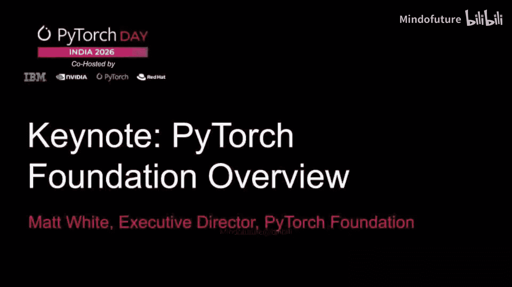
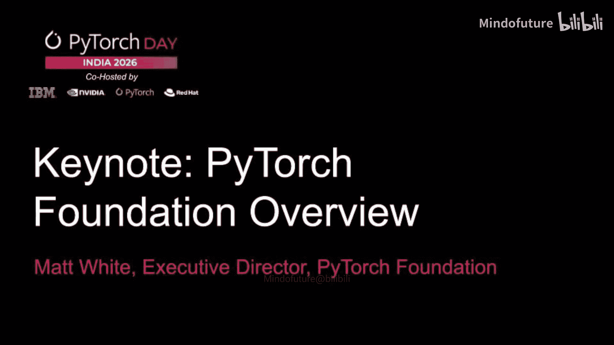

# 002：主题演讲

## 概述
在本节中，我们将学习PyTorch基金会执行董事Matt White在PyTorch Day India 2026上的演讲核心内容。演讲阐述了PyTorch基金会的使命、AI发展的新阶段、开源社区的重要性，并特别强调了印度社区的关键作用与未来合作方向。

大家好，欢迎来到PyTorch Day India。首先，我想说我非常希望能亲自到场与大家相聚，但由于身体不适，我今天无法出行。

如你们所见，我的嗓音状况不佳，但我会尽力发言。我实在不想错过直接与这个社区交流的机会。印度是全球最具活力、发展最迅速、且以价值观驱动的开源AI社区之一。PyTorch Day India就是这一点的有力证明。

对于每一位维护者、贡献者、研究员、学生、教育者、线下聚会组织者和社区领袖，感谢你们让这一天成为可能。你们的工作影响深远，远超一座城市或一场活动。它体现在我们构建的工具、发表的论文、发布的产品和开启的职业生涯中。

过去几年，我们见证了PyTorch基金会旗下项目及更广泛生态系统的非凡发展势头。PyTorch仍然是AI开发的核心。围绕它的项目正变得在整个生命周期中不可或缺，从训练到推理，再到部署和分布式系统。

我要特别感谢印度社区对PyTorch、VLOM、Ray和Deep Steam以及开发者日常依赖的众多生态系统项目的支持与贡献。你们不仅是开源AI的用户，更是它的建设者和守护者。这一点现在比以往任何时候都更重要。

## AI发展的新阶段与开源的重要性
上一节我们感受到了印度社区的活力，本节中我们来看看AI发展进入的新阶段。我们已经从AI作为原型，进入了AI作为企业能力的阶段。各行各业都在从孤立的演示转向真实的部署。这些系统必须可靠、安全、可观测、成本效益高且合规。这就是AI运营化的工作，也是许多最棘手问题所在之处。这里也正是开源变得不可或缺的地方。

因为生产环境的采用需要透明的构建模块、强大的社区以及能够被检查、改进并集成到复杂环境中的技术。在印度，这一时刻更具深远意义。随着即将到来的印度AI影响力峰会，信号很明确：AI是一项战略重点，也是一个重大的经济机遇。

这创造了一个难得的协同局面，如果我们在正确的基础上构建，初创公司、现有企业和学生都能同时加速发展。这些基础包括广受信任的开源框架和工具，也包括使AI在现实世界中可用的运营实践。

在工业和企业的环境中，这意味着可复现的训练与评估、可扩展的推理与部署、分布式计算与数据管道、安全与供应链管理、多云可移植性与成本管理、清晰的治理和可持续的维护。这正是基金会和我们的社区发挥重要作用的地方。

## 基金会的使命与社区角色
我们存在的目的是帮助生态系统负责任且可靠地扩展，加强支持我们项目的共享基础设施，促进跨项目协作，并创建在全球范围内扩大参与和技能的项目。我们希望PyTorch及其托管项目不仅适用于研究和实验，也能在组织运营的生产环境中表现出色。

关于更广泛市场的变化，需要快速说明一下。越来越多的AI系统正在成为“系统的系统”。它不只是一个模型，而是连接模型、数据、检索、工具使用、部署、监控和治理的工作流。其中一些系统将包含像智能体工作流这样的新模式。

但重点远不止于任何单一技术。方向很明确：企业正在采用端到端的AI系统，他们需要健壮的开源工具和强大的社区才能做好。现在我想把话题带回印度，因为这里正在发生一些特别的事情。

## 印度社区的特殊机遇
印度拥有规模、人才密度和卓越的建设者文化。你们拥有世界级的研究、快速扩张的初创企业生态系统，以及大规模培养雄心勃勃工程师的教育渠道。结合开源，这意味着印度不仅有能力采用AI，更有能力展示如何在全球范围内构建和部署AI。

因此，我很高兴分享几个社区优先事项。

以下是基金会为印度社区规划的具体举措：

*   **第一**，PyTorch大使计划将在未来几个月启动新一期。我强烈鼓励印度各地的人们申请。如果你一直在组织线下聚会、教授PyTorch、指导贡献者、建设本地社区或帮助他人入门，这个计划就是为你准备的。大使们能扩大领导力和包容性。他们帮助新贡献者找到融入社区的途径，并帮助PyTorch在每一个使用它的地方都真正实现本地化。
*   **第二**，感谢印度各地已经发生的基层领导工作。本地线下聚会并非可有可无。它们是社区变得真实的地方，是实践知识共享的地方，是首次贡献发生的地方，也是人们建立维系开源长期发展的人际关系的地方。如果你正在组织聚会或指导贡献者，请知道你正在做的是生态系统中一些最具杠杆效应的工作。
*   **第三**，我们希望深化与印度在工业和学术界的联系。在工业方面，我们希望有更多来自印度的成员公司加入PyTorch基金会。会员资格不仅仅是一个标识，更是通过共享基础设施支持生态系统、支持社区项目以及参与保持开源可靠和可扩展的协作工作的承诺。印度的初创公司和成熟企业有机会通过直接参与来塑造开源AI的未来。

在学术方面，我们希望与印度建立更多的研究和大学合作伙伴关系。这包括与实验室更紧密的合作、与大学开源项目办公室更深入的互动、课程支持以及为学生提供为全球使用的项目做出贡献的清晰途径。如果你在学术界或支持学术研究，我很乐意听取你的意见。

对于学生和早期职业工程师，我想非常直接地说：在AI领域建立信誉的最快方式是在开放环境中构建。

以下是构建个人信誉的具体行动建议：

*   贡献代码
*   改进文档
*   参与我们的编程马拉松
*   修复错误
*   编写教程
*   协助测试
*   加入工作组
*   学习系统在生产环境中的行为

这些技能会快速积累，社区也会注意到。

## 总结与展望
在结束之前，我想留给大家一个简单的信息：AI的未来将由那些构建可访问、可信赖的系统并使其广泛可用的社区塑造。这意味着质量、安全、可靠性和长期维护。这意味着跨组织和跨国界的协作。这意味着开放的生态系统，能够在不受锁定限制的情况下实现创新。印度绝对是引领未来的社区之一。

再次感谢你们为PyTorch、BLLM、Ray、Deep Steam以及使开源AI成为现实的生态系统项目所做的一切。希望你们在印度的PyTorch日收获满满。请继续构建，请继续贡献，请继续邀请他人加入，并在这样做时，秉持开放原则。

如果你想参与进来，无论你是开发者、研究员、学生、初创公司还是成熟企业，请联系我们。我们希望你能加入社区，我们希望与你一起构建下一个篇章。

保重，并享受这次活动。