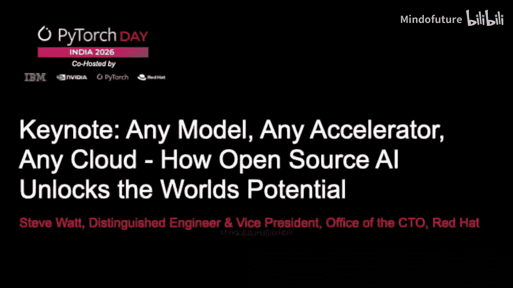
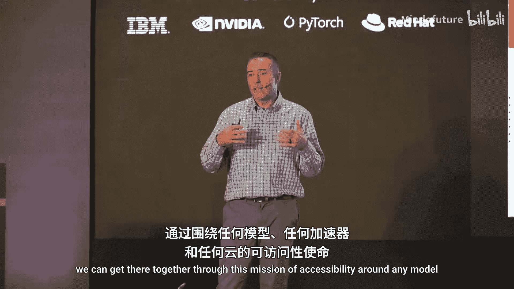
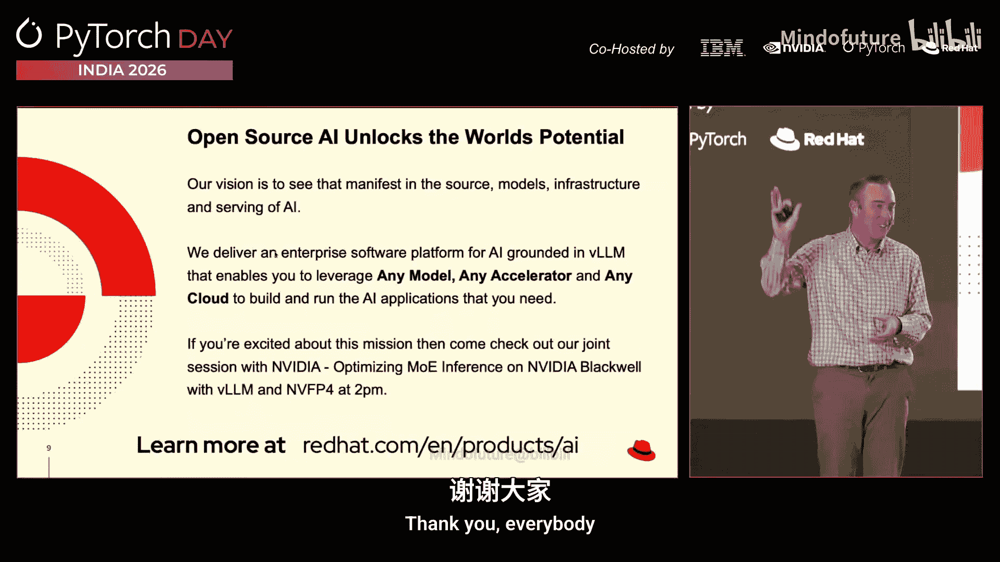

# 003：解锁世界潜能——任何模型、任何加速器、任何云



## 概述

在本节课中，我们将学习开源AI如何通过实现“任何模型、任何加速器、任何云”的愿景来解锁世界的创新潜能。我们将探讨从模型推理、服务器架构到硬件加速和软件供应链可靠性的完整技术栈。



---

## 章节 1：开源AI的愿景与挑战

上一节我们介绍了课程主题，本节中我们来看看开源AI的核心理念及其当前面临的挑战。

开源创新的基石在于**可访问性、自主权和自由**。这意味着任何人都可以：
*   在GitHub上发现项目。
*   进行分支、构建并加入自己的想法。
*   在宽松的许可下进行商业化或二次创新。

然而，在AI领域，许多前沿模型仍是闭源的。它们通常体量巨大、难以自行部署，需要昂贵且稀缺的高端GPU。这限制了灵活性和定制化，降低了开发者的生产力。

**过渡**：为了克服这些挑战，我们需要一种更灵活、更易访问的AI构建方式。接下来，我们将探讨一种名为“可组合智能”的新思路。

---

## 章节 2：可组合智能与模型路由

上一节我们提到了大模型部署的挑战，本节中我们来看看如何通过“可组合智能”来应对。

“可组合智能”的核心思想是使用多个更小、更专业的模型协同工作，而非依赖单一巨型模型。例如，您可以拥有：
*   一个精通哲学的小型语言模型。
*   一个精通历史的小型语言模型。
*   一个精通物理的小型语言模型。
*   一个精通体育的小型语言模型。

以下是其工作流程的关键组件：

1.  **语义路由器**：这是一个分析推理请求并决定将其路由到哪个模型的组件。
2.  **路由规则**：
    *   **静态路由**：基于预定义规则（如关键词）进行路由。
    *   **动态路由**：通过语义分析判断问题意图（例如，“关于板球运动员萨钦的问题应路由到体育模型还是物理模型？”）。

这种架构的优势在于，小型语言模型更容易在更普及的基础设施上部署和服务，从而让更多开发者能够利用现有资源构建出强大的推理能力。

**过渡**：确定了使用哪些模型后，下一步就是高效地服务这些模型。这引出了我们对推理服务器的需求。

---

## 章节 3：开源推理服务器：vLLM与LLM-D

上一节我们讨论了模型组合，本节中我们来看看服务这些模型的引擎——推理服务器。

vLLM 是目前世界上最流行的开源推理服务器之一，隶属于PyTorch基金会。它的核心价值在于：

*   **广泛的模型支持**：与各大实验室合作，实现新模型的“第0天启用”。这意味着新模型发布当天，即可通过Hugging Face下载并在vLLM中运行。
*   **广泛的硬件支持**：vLLM为众多不同的加速器编写了GPU内核，充当了**各种模型**与**各种硬件**之间的中介。
*   **灵活的部署**：它可以在任何云环境（公有云或本地数据中心）中运行，为用户提供部署选择。

为了进一步提升可扩展性，Red Hat与IBM研究院共同创建了**LLM-D**项目。您可以将其理解为“分布式vLLM”。它将核心组件（如预填充、解码、KV缓存）解耦并分布到不同节点上，从而提供更具扩展性的推理服务性能。

**过渡**：vLLM支持多种硬件的关键在于其底层的高性能GPU内核。然而，编写GPU内核是一项复杂且小众的技能。如何让更多人能参与其中呢？

---

## 章节 4：简化内核开发：编译器与DSL

上一节我们提到了GPU内核开发的门槛，本节中我们来看看如何通过编译器和领域特定语言来降低这个门槛。

为了让编写针对不同目标的GPU内核变得更简单、更易访问，社区投资于编译器和DSL技术。这包括：

*   **Triton**：一个开源的GPU编程语言和编译器，简化了高性能内核的开发。
*   **Torch Compiler**：PyTorch的编译器栈，旨在优化模型执行。
*   **Helion**：一个较新的项目，同样致力于通过高级抽象简化加速器编程。

这些技术的目标是：开发者可以使用更高级的DSL描述计算，然后由编译器自动优化并生成针对不同硬件目标（如NVIDIA GPU、AMD GPU、甚至专用AI芯片）的高效代码。

**公式/代码示例（概念性）**：
```python
# 伪代码：使用高级DSL描述一个矩阵乘法内核
@triton.jit
def matmul_kernel(A, B, C, M, N, K):
    # ... 使用高级抽象描述计算 ...
    # 编译器会将其转换为针对特定硬件优化的低级代码
```

**过渡**：除了GPU，企业环境中还存在大量未被充分利用的CPU资源。我们能否利用它们进行AI推理呢？

---

## 章节 5：利用CPU进行推理：vLLM-CPU与ACLE标准

上一节我们主要关注GPU，本节中我们来看看如何让CPU也成为高效的AI推理引擎。

许多企业面临GPU稀缺或成本高昂的问题，并希望利用现有的CPU资源。答案是肯定的，但需要合理设置对性能的期望。

Red Hat正在 **vLLM-CPU** 项目中努力，旨在为CPU推理提供与vLLM类似的通用抽象层。它支持如Intel Xeon和AMD EPYC等主流服务器CPU。

更重要的是，CPU本身也在进化以更好地满足推理需求。通过**X86生态系统咨询组**，业界正在制定新的指令集标准，例如**ACLE**。这些新标准被集成到更新的CPU架构中，并由vLLM-CPU等项目向上层应用暴露，从而显著提升CPU的AI推理效率。

在选择全栈方案时，**功耗预算**是一个关键考量因素。您需要在给定的功耗限制内，权衡模型能力、软件效率和硬件选择，以达成最佳的性能功耗比。

**过渡**：除了通用的CPU和GPU，未来还涌现出许多为推理任务专门优化的新型加速器。PyTorch如何优雅地集成它们？

---

## 章节 6：面向未来：专用加速器与Open Registry

上一节我们讨论了现有硬件，本节中我们展望未来，看看PyTorch如何拥抱新型专用加速器。

业界正朝着为推理任务进行功耗优化的专用加速器发展（例如IBM的SpiCE芯片）。为了便于社区集成这些创新硬件，而不必对PyTorch主代码库进行复杂修改，Red Hat主导推动了 **Open Registry** 项目。

Open Registry 的核心是创建一个框架，允许将加速器支持以“树外”插件的形式添加。这意味着：
*   加速器代码不必放入PyTorch主线。
*   开发者可以使用插件式架构启用新加速器。
*   通过运行测试来验证其兼容性和功能性。
*   确保所有加速器插件遵循基本的接口兼容性标准。

这极大地降低了为PyTorch生态系统添加新硬件支持的门槛和复杂性。IBM SpiCE预计将成为首批基于此项目实现的加速器之一。

**过渡**：要让开源AI被企业广泛信任并用于生产环境，仅有强大的功能还不够，可靠性至关重要。

---

## 章节 7：企业级可靠性：安全与信任

上一节我们探讨了技术实现，本节中我们来看看如何确保开源AI栈足够可靠和安全，以满足企业级需求。

企业采用开源技术的核心前提是**信任**。这涉及到：

*   **安全软件供应链**：确保软件不包含漏洞或恶意代码。
*   **稳定性**：确保软件在运行生产负载时不会崩溃。
*   **持续集成**：确保新功能的引入不会破坏现有组件的兼容性。

Red Hat的班加罗尔PyTorch团队专注于提升PyTorch的可靠性。他们的工作包括：
1.  修复大量Bug（例如在Torch Compile中修复了60多个问题）。
2.  改进上游持续集成流程，将可靠性测试集成进去。
3.  确保不同组件（如ROCm）的变更能通过兼容性测试。

在过去的三个月里，该团队已成为PyTorch项目的**前三大贡献者之一**，这体现了社区对构建坚实、可信赖基石的巨大投入。

**过渡**：我们已经从模型、服务器、编译器、硬件到可靠性，完整地梳理了开源AI栈。现在，让我们总结这一切如何共同实现最初的愿景。

---

## 章节 8：总结与行动号召

在本节课中，我们一起学习了开源AI通过“任何模型、任何加速器、任何云”的愿景来解锁世界潜能的完整路径。

我们探讨了从顶层的**可组合智能**模型路由，到核心的**vLLM**推理服务器及其分布式扩展**LLM-D**，再到底层通过**编译器/DSL**简化内核开发，并利用**CPU**和面向未来的**专用加速器**（通过**Open Registry**集成）来提供硬件选择自由。最后，我们强调了通过贡献**可靠性工程**来建立企业级信任的重要性。

要实现开放的AI未来，我们需要更多开放的**基础设施管道、数据集**以及包含**宽松许可证模型**的完整推理生态系统。

**“任何模型、任何加速器、任何云”** 正是实现这一目标的蓝图。它确保无论用户身处何地、拥有何种资源，都能找到一种方式来访问并运行他们所需的AI应用。



如果您对推动PyTorch生态系统的多样性和选择性感到兴奋，欢迎加入上述开源项目。开源AI的潜力有待我们共同释放。