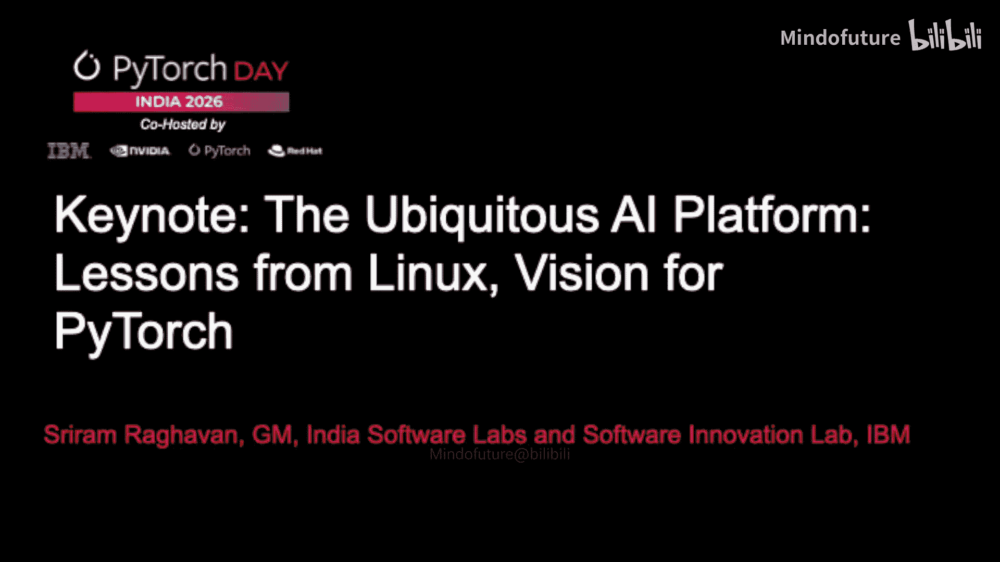
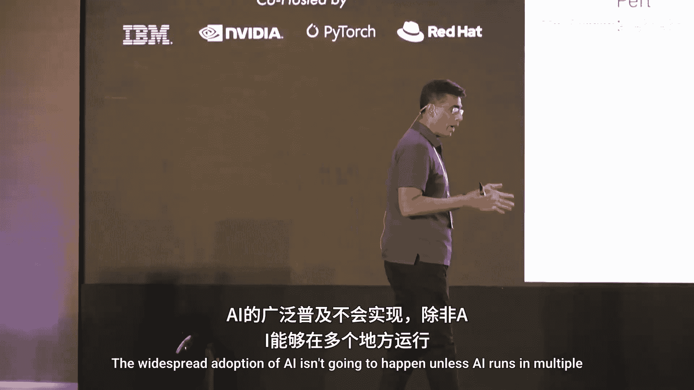
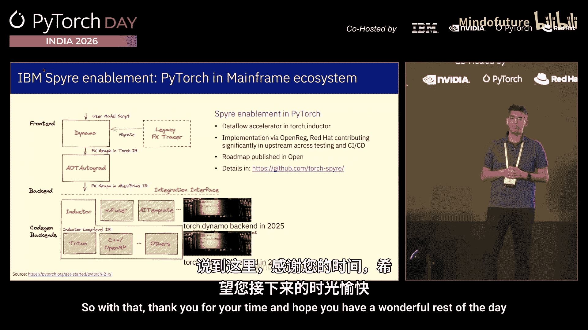

# 004：无处不在的AI平台——来自Linux的教训与PyTorch的愿景

在本节课中，我们将跟随演讲者的分享，了解IBM在开源领域的长期投入，探讨Linux成功背后的核心原则如何为PyTorch生态系统的发展提供借鉴，并了解IBM如何基于这些原则，特别是通过与Red Hat的合作，在PyTorch生态系统中进行战略布局和创新实践。

## IBM的开源之旅与核心理念

上一节我们概述了本次分享的主要内容。本节中，我们来看看IBM在开源领域的深厚历史及其背后的驱动哲学。

IBM的开源之旅始于1990年代，当时一群工程师决定将Linux移植到IBM的大型机（mainframe）和Power PC平台上。这标志着IBM开始拥抱开源，并随后投入了数十亿美元来支持Linux基金会等开源组织的建立与发展。

IBM积极参与开源，并非偶然。纵观软件发展史，每一个主要的技术转折点，从操作系统、Web基础设施、开发工具到云原生，开源都不仅是参与者，更是塑造行业采用方式的关键力量。AI领域也不例外。AI的广泛普及必须依赖于其在多种平台和环境（如主权数据中心、私有数据中心、公有云）上运行，并支持多种模型。开源将在确保这一点上发挥根本性作用。

以下是IBM参与并支持的部分重要开源基金会和项目：
*   1999年：协助塑造Apache软件基金会。
*   2000年：协助创建Linux基金会。
*   2004年：成为Eclipse基金会的创始成员。
*   当前：积极参与PyTorch基金会等组织。

IBM作为一家明确的商业公司，其开源哲学源于一个清晰的认知：企业参与开源“飞轮”能够创造巨大价值。企业需要依赖一个稳定、可靠的基础层来驱动更多用户和开发者采用，进而促进硬件支持，最终通过这个生态飞轮来发展自身业务。

## 来自Linux成功的三大经验

上一节我们回顾了IBM的开源历程。本节中，我们深入分析Linux取得巨大成功、吸引像IBM这样的企业深度参与的三项关键原则。这些原则对PyTorch生态的演进极具参考价值。

**第一，提供一致且稳定的硬件抽象。** Linux并非在所有方面都追求最好，但它擅长提供稳定、一致的硬件抽象层。这为企业参与生态飞轮奠定了基础。企业可以依赖这个抽象层来吸引用户和开发者，从而驱动更广泛的硬件支持。

**第二，确立稳定的契约接口。** 无论是用户态与内核态的划分，还是系统调用（syscall）接口的稳定性，Linux都做得非常出色。这创造了一个清晰的层次，允许企业在契约之上或之下进行创新。
*   **在契约之下创新**：企业可以开发一流的硬件（如IBM的大型机或Power平台），并确保其能在这个稳定的抽象层上获得支持，从而服务特定市场。
*   **在契约之上创新**：接口的稳定性使得企业能够在其上构建丰富的应用程序和生态系统。

**第三，保持社区驱动的管理。** 这一点至关重要。Linux从未失去其由社区驱动的管理本质，这为企业提供了长期参与的信心和透明度，是生态系统健康发展的基石。

这三项原则对于思考如何让PyTorch生态系统成长并达到Linux在AI世界中的采用水平，具有非常重要的指导意义。

## IBM的AI战略与PyTorch核心地位

上一节我们总结了Linux的成功经验。本节中，我们来看看IBM如何将这些理念应用于其AI战略，以及PyTorch在其中扮演的核心角色。

IBM在企业AI的各个层面都采取了基于开源的方法，从基础设施、平台、数据层到智能体中间件。PyTorch是这一战略的核心。

IBM与Red Hat合作，在过去三到四年间有策略地投资于多个关键开源项目。以下是一些具体的参与示例：
*   **PyTorch**：IBM的旅程始于内部研究和产品开发。团队早期就与PyTorch编译（compile）团队合作，是将其用于推理的最早采用者之一。IBM研究团队为高效FP8训练的验证、基于内部经验贡献的大规模有状态数据加载器（stateful data loader）等方面做出了贡献。
*   **vLLM**：目前是企业最大的贡献者，持续推动创新。
*   **Hugging Face** 与 **Triton**：同样深度参与，例如与AMD合作，利用OpenAI Triton为其GPU驱动新内核。

此外，IBM也是**LLMD**项目的创始成员。该项目旨在解决分布式推理中的实际调度和资源管理问题，因为未来的推理将涉及协调具有不同属性和类型的模型集合。

## 案例研究：将尖端AI引入传奇平台

上一节我们了解了IBM在PyTorch生态中的广泛参与。本节中，我们通过一个具体案例——将AI引入IBM大型机（mainframe）——来展示开源如何成为连接尖端技术与传奇平台的关键桥梁。

大型机是一个传奇平台，至今仍处理着全球70%的交易，其总体拥有成本（TCO）优势难以被后来者超越。客户希望在大型机上运行机器学习模型，处理生成式AI任务，并满足低延迟、高安全性的要求。

为此，IBM开发了**IBM Spyre加速器**。其设计重点包括：
1.  针对大型机预期工作负载进行优化。
2.  注重能效。
3.  支持根据客户需求灵活扩展（从每台设备8张卡最多可扩展至192张卡）。

最关键的是，该加速器通过一个**完全基于PyTorch和vLLM等开源技术的软件栈**连接到应用程序。这使得开发者体验与在通用平台上使用PyTorch进行开发**完全一致**。

IBM首先在自己的产品上验证了这一架构：
*   **Watsonx Assistant for Z**：帮助维护和排查大型机问题的辅助系统。
*   **Code Assistant for Z**：针对COBOL等大型机特有编程语言的代码助手。

目前，Spyre主要利用PyTorch栈进行**推理（inference）和服务（serving）**，因为这是大型机上的主要AI工作负载。未来的战略是让Spyre编译器更深入地集成PyTorch生态系统，特别是利用**Dynamo**和**Inductor**组件。这也推动了IBM和Red Hat对Dynamo/Inductor生态以及**OpenRE**项目的加倍投入。

这种合作带来了双赢：
*   **对IBM**：能够利用开源社区在模型架构支持、优化等方面的所有成果。
*   **对生态系统**：IBM贡献了对数据流加速器（dataflow accelerator）的更好支持（Spyre本质上是数据流设计），使整个生态能更好地适应未来多样的硬件加速器。

## 总结：构建AI的“操作系统”

本节课中，我们一起学习了IBM的开源哲学、Linux成功的核心原则，以及IBM如何将这些经验应用于PyTorch生态和具体的AI创新实践中。

演讲者最终总结道，通过PyTorch及其生态系统项目，我们正在构建的是 **AI的“操作系统”** 。PyTorch生态是这个操作系统的**中枢神经系统**。如果构建得当，我们将看到在Linux生态中发生的一切，甚至更多的创新，在这个AI操作系统之上和之下涌现。

这种将企业级商业软件/硬件世界与开源世界紧密结合的方式，展示了开源在驱动尖端技术创新与传奇平台融合中的强大力量。