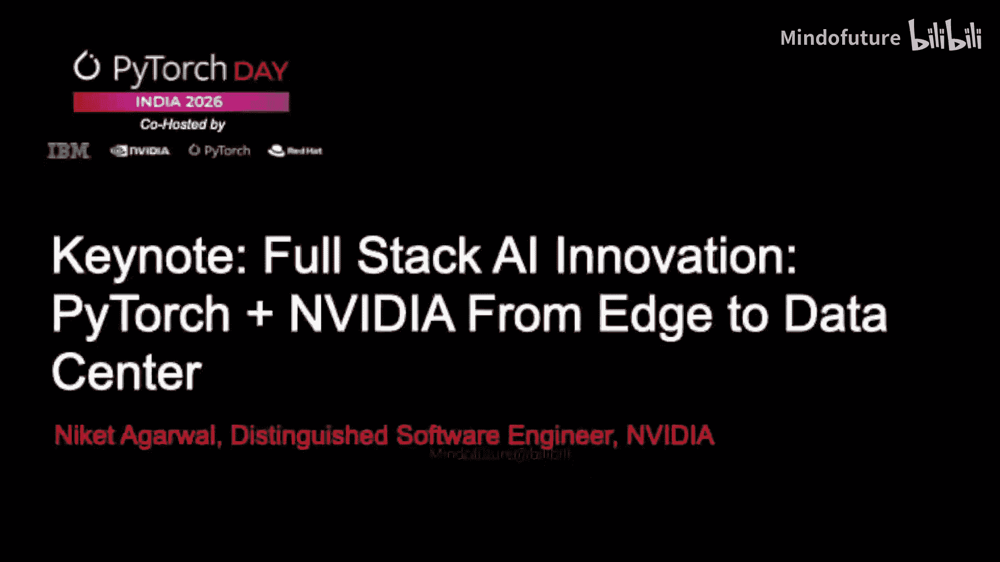
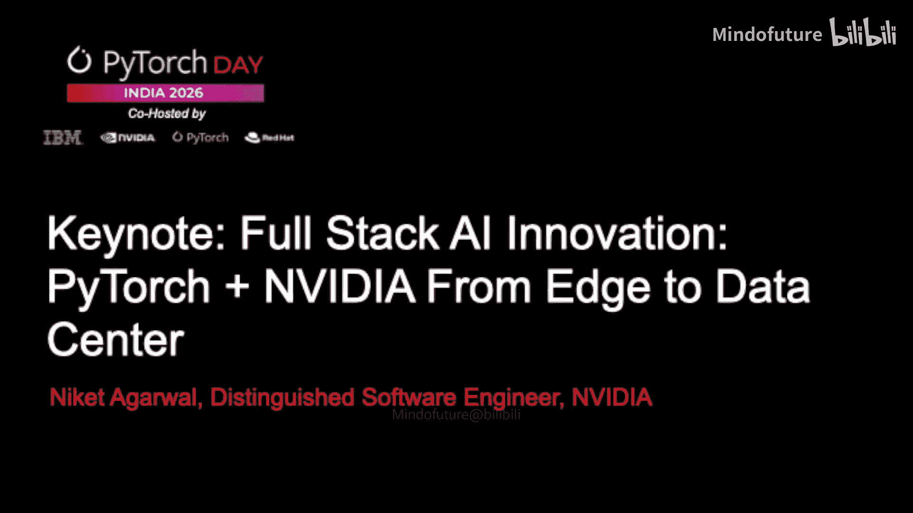
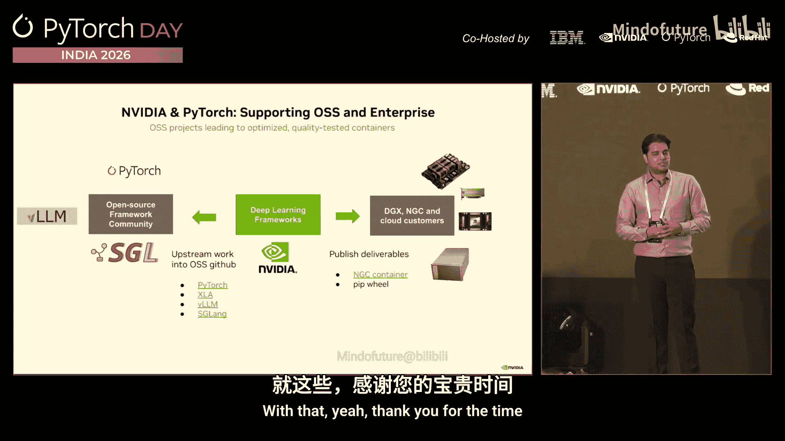

# 005：从边缘到数据中心的加速计算

## 概述

在本节课中，我们将学习 NVIDIA 如何与 PyTorch 深度集成，共同构建从边缘到数据中心的完整 AI 技术栈。我们将探讨 PyTorch 作为开发者首选框架的原因，并深入了解 NVIDIA 如何通过一系列库和硬件协同设计，将 PyTorch 代码的性能提升到极致，以支持从研究实验到大规模生产部署的整个 AI 生命周期。

---

## AI 发展历程回顾

上一节我们概述了课程目标，本节中我们来看看 AI 发展的关键节点，这有助于理解我们当前所处的位置。

AI 的新时代始于 2012 年的 AlexNet。多伦多大学的一批研究人员使用 GPU 参加了 ImageNet 竞赛，并在未通知 NVIDIA 的情况下，以巨大优势击败了人类，赢得了比赛。

这开启了一个以感知 AI 为主的时代，包括语音模型、视觉模型和一系列推荐模型。整个消费社区开始在不自知的情况下与 AI 交互。在 2012 年至 2020 年期间，我们使用的电子商务、社交网络和搜索引擎都由这些强大的推荐模型驱动。

下一个时代，即我们当前所处的生成式 AI 时代，始于 2022 年 ChatGPT 的出现。它开创了生成式 AI 的实际应用，我们现在生活在一个截然不同的世界中。

我们现在正处于智能体 AI 和物理 AI 的时代。智能体 AI 是指 AI 不再仅仅是帮助我们的工具，而是作为工具的使用者来完成任务。现在有智能体为我们编写代码，进行财务分析，它们甚至在自己的社交网络中相互交流。

与此同时，我们也生活在物理 AI 的时代。在美国旧金山等地，你可以看到没有驾驶员的汽车在路上行驶。停车场里，数十辆汽车在夜间自动停放。同样的情况正在扩展到机器人领域。未来我们将拥有能够相互交流的物理机器人。

我们通过 AI 模型的演进达到了今天的高度。2012 年的 AlexNet 是卷积神经网络，解决了重要的特定领域任务，但它不具备生成能力，每个领域问题都需要专门研究。2022 年，随着 ChatGPT 的出现，开始使用称为通用 Transformer 的模型，这是一种下一个令牌预测模型或算法。它开始使用相同的骨干网络处理所有问题。

2022 年，我们看到 ChatGPT 和其他模型通过预训练取得了巨大成功。随后，性能开始趋于平稳。去年，推理时代到来，DeepSeek 和 ChatGPT-4 向我们展示了在预训练之后，可以通过强化学习和测试时扩展来解决更多问题。扩展并未停止，这促成了我们当前所处的下一个 AI 时代。

所有这些发展的结果是，许多开源和闭源模型现在能够达到人类水平的智能。很多时候，我们很难区分在线社区中的发言者是人是 AI。

---

## 为什么选择 PyTorch？

了解了 AI 的发展脉络后，我们需要一个能够支持从实验研究到生产系统的框架，这就是 PyTorch 脱颖而出的地方。

PyTorch 允许我们进行实验和构建研究模型，然后整个 AI 开源生态系统会利用这些模型，实现生产用例。PyTorch 是这一切的中心，但仅靠 PyTorch 是不够的，我们需要共同努力来增强它，使其具备生产价值。

以下是 PyTorch 受欢迎的关键原因：

*   **易于实验和开发**：特别是在即时执行模式下，逐步调试代码、了解运行情况非常容易。虽然无法获得极致性能，但可以快速构建新事物并进行尝试。
*   **强大的生态系统**：随着图模式的引入，以及 IBM、Red Hat 和 NVIDIA 等公司支持的生态系统，现在这个庞大的生态系统正在将 PyTorch 代码变得快速，并在生产规模上真正可靠。
*   **广泛的采用**：目前每月有约 20 万次下载，在开发中被广泛使用。

NVIDIA 作为加速计算公司，我们的角色是与 PyTorch 进行深度集成，使其在大规模运行时真正高性能。

---

## NVIDIA 与 PyTorch 的深度集成

上一节我们探讨了 PyTorch 的优势，本节中我们来看看 NVIDIA 如何作为“引擎”与 PyTorch 这个“开发语言”协同工作。

我们认为 PyTorch 是开发者的语言，而 NVIDIA 是使该开发能够大规模快速运行的引擎。我们共同解决技术栈的每一层。您可以用高级 Python 编写代码，然后 NVIDIA 和生态系统提供许多框架和底层内核来使其高性能运行。我们进行了许多无缝集成。

以下是 PyTorch 生态系统的概览：

*   **模型创建**：首先，您需要创建模型。有许多开源框架，如 Hugging Face Transformers、TorchVision、TorchAudio 等，开发者可以决定在特定领域构建模型，然后轻松使用这些模型库创建模型。
*   **模型训练**：拥有模型后，您需要训练它们。有许多优秀的开源库和框架，如 NVIDIA 的 Megatron 或 TorchTitan 等，您可以使用它们无缝地训练模型。
*   **模型推理**：训练完成后，您需要进行推理。同样有大量优秀的开源库，如 SGLang、VLLM 等，可以帮助您进行大规模推理。

所有这些都在 NVIDIA 生态系统中通过我们称为 CUDA-X 的库得到支持和推动。这些是 NVIDIA 构建并开源的高速数学和通信库，然后将它们集成到各种框架中，以充分利用我们构建的 GPU。

我们不仅在云端这样做，还从边缘一直做到数据中心，包括桌面端。因为 CUDA 的强大之处在于，您可以在本地开发一些代码，然后在云端大规模启动，无需在如今非常稀缺的云端 GPU 上进行开发。许多边缘应用，特别是在需要隐私和安全、不希望接触云端的场景中，我们也希望在边缘环境中实现相同的体验和功能。

最终，神奇之处在于，这不再仅仅是一个 IT 应用或消费者应用，它正在赋能金融、医疗保健、机器人等多个行业。AI 的影响已经触及每个人，而不仅仅是高科技行业的人。

---

## 单 GPU 性能优化实战

了解了高层架构后，作为开发者会议，本节我们将通过具体代码示例，展示 NVIDIA 如何集成到 PyTorch 生态系统中，以优化模型性能。

以下是一个简单的 GPT 模型实现。实际上，GPT 主要包含两个热点循环：内存带宽受限的注意力层和计算/内核受限的 MLP 层。即使模型很复杂，最终也归结为这两个人们多年来一直在优化的热点循环。

在 PyTorch 中定义它非常简单。这看起来像 Python 代码，它就是 Python 代码。您可以轻松地理解和推理，这就是开发者喜爱这个接口的原因。

但如何使其高性能呢？我们为生态系统提供的第一个杠杆是我们的加速 GEMM 内核库。我们有 cuBLAS、cuDNN 等库，它们根据您运行的硬件优化这些 GEMM 内核。我们在不同代际、不同部署环境中拥有大量硬件，我们希望这些 GEMM 内核能在其上真正优化运行。

以下是使用我们库的代码示例。只需几行代码，您就可以让 PyTorch 代码使用我们的 cuBLAS 库进行张量计算。这样做的好处是，代码中的所有 GEMM 操作（例如线性层）都将被自动加速。硬件将被检测，并由优化的内核执行。

结果是，您编写的优秀 PyTorch 代码，通过启用这个 cuBLAS 库，仅此一项就能获得显著的加速。

接下来，我们讨论 GEMM 库之外的另一个代码部分：注意力内核。它们通常是内存带宽受限的。朴素的 PyTorch 实现会实例化这些大矩阵，需要在系统的计算和内存之间进行大量来回传输，最终受限于内存带宽。加速此过程的库之一是 PyTorch 的 SDPA（缩放点积注意力）。它使用 Flash Attention 等技术，不实例化整个矩阵，而是以更高效的方式流式传输。这同样通过非常简单的代码更改来优化注意力部分的内存传输。

使用此库与朴素的 PyTorch 实现相比，几乎可以获得 5 倍的内存减少。结果是，在您已有的基线基础上，又获得了数倍的性能提升。

我们已经优化了 GEMM 内核和注意力矩阵，但仍然有很多内核调用发生。通常，当您编写 PyTorch 代码并使用 GPU 时，会有一个概念：内核被准备然后启动到 GPU 上执行。如果您执行许多小内核，最终会发生的情况是：设置内核、内核执行、取回结果、再次设置内核、再取回一些结果。想象一下，如果设置开销很大，而只加速了部分代码，就会遇到阿姆达尔定律的瓶颈，无法扩展。`torch.compile` 实际上会自动融合许多小内核。同样，您可以看到只需一个命令行更改，它就会自动查找可以融合的小内核，其结果通常是在其他优化基础上再获得 50% 的加速。

我们完成了所有这些优化。我们还在不断发明新的、更低的精度。我们在 Hopper 架构中使用了 FP8。现在 Blackwell 引入了 FP4。如何进行混合精度推理和训练？如何找到内核进行优化？手动操作工作量很大。NVIDIA 通过 Transformer Engine 库使其能够自动优化。

在这个例子中，您会看到我们仍然使用注意力和 MLP 层，但我们使用了 Transformer Engine 版本。它做的一件事是根据您拥有的硬件自动缩放精度。作为开发者，您无需担心。结果，您又获得了大约两倍的加速。

您可能会问，我真的能获得这么多倍加速吗？为了证明这一点，我昨晚实际运行了相同的实现。您可以访问我昨晚写的这个 GitHub 链接。从基线到所有四种技术，加速效果是存在的。我能够获得 16 倍的加速。所以不要相信我，去下载并在您的 GPU 上尝试。根据 GPU 的不同，您会获得不同的加速，但您应该能够从基线实现中获得一个数量级的加速，同样是在您选择的单 GPU 上。

---

## 扩展到多 GPU 与数据中心规模

上一节我们优化了单 GPU 上的模型，使用了 NVIDIA 的内核库和一些 PyTorch 库。现在我们正在训练具有数万亿令牌的模型。它们不仅仅是文本令牌，还包括视频和其他令牌，训练成本非常高。我们正在训练具有数百亿参数的大型模型。我们没有时间等待单个 GPU 完成训练，那将需要数年时间。

因此，我们如何扩展训练规模以更快完成任务？我们使用并行性。我们将模型扩展到在多个 GPU 上运行。我们做的第一种方式是拆分模型，这称为张量并行。这种方法已经存在一段时间了，您将模型拆分，并将线性层和注意力层分布到单个系统上的多个 GPU 上。通常，在 NVIDIA DGX 盒子上，您会有 8 个 GPU，您可以将模型拆分成 8 份。

在 PyTorch 中编写这样的代码并不复杂。拆分后，在最后需要有一个归约步骤，每个人共享他们的答案，然后我们得出正确答案。因此，每当您进行多 GPU 训练时，都会发生归约步骤。如果不优化，它会成为瓶颈。NCCL 是我们开发的一个库，它加速了整个通信步骤。同样，作为 PyTorch 开发者，您甚至不知道它的存在，但库底层会找出如何优化通信。实际上，复杂性在于，您可能在一个有 NVLink 的系统上，也可能在一个没有 NVLink 的系统上，或者在一个横向扩展的系统上，NCCL 会自动找到正确的算法来执行所有这些归约操作。因此，您获得了多 GPU 能力，然后 NVIDIA NCCL 库会去优化它。

8 个 GPU 或多 GPU 还不够。正如我所说，我们正在训练大量令牌。所以下一件事是，如何扩展到数据中心规模。我现在有数千个 GPU，未来人们将在数据中心使用数百万个 GPU。如何扩展到数据中心？NVIDIA Megatron 是我们开发的一个用于数据中心规模模型训练的生产级框架。

这意味着您可以采用一个模型，不仅跨张量维度进行分片，还可以使用流水线并行等技术，其中某些层在某些 GPU 上运行，结果将传递给下一层，然后结果再传递给下一层，我们可以流水线化您的模型计算。您可以运行模型的多个版本，并给它们不同的数据来处理。想象一下，我们正在处理数万亿个令牌，您可以并行处理，这称为数据并行。最后，随着长上下文的出现，我们现在训练的是百万令牌级别的上下文。您还可以进行序列并行，将输入拆分到各个模型副本中。

Megatron 允许您非常无缝地做到这一点。它处理所有分片和检查点等底层细节，因此开发者无需处理所有这些复杂性。同样，NCCL 将负责底层所有通信。这样做将使模型不仅能够跨少数 GPU 扩展，还能跨整个数据中心扩展。

Megatron 就是那个库。现在，我们不仅在软件层停止。我们意识到这很好，您可以不断扩展。但在某些时候，网络会成为瓶颈。因此，如果我们在一个称为 DGX 的特定系统中有 8 个 GPU，它们通过 NVLink 以每秒数 TB 的高带宽进行通信。但当您在多个节点之间扩展时，带宽会下降到每秒 GB 级别。因此，如果您从一个节点扩展到另一个节点，无法获得相同的横向扩展性能。

因此，我们在最新一代 Blackwell 架构中协同设计了硬件和软件，发明了名为 NVLink 72 的技术，其中整个机架是一台计算机，而不仅仅是一个节点是一台计算机。现在，我们有 72 个 GPU 通过每秒 130 TB 的带宽相互连接。因此，我们现在可以将模型在张量并行中拆分到 72 个 GPU 上，而不仅仅是 8 个 GPU。同样，NCCL 库负责它们之间的通信抽象。

所有这些层次的结果是，我们加速了数学库，加速了通信，加速了注意力，并跨 NVLink 72 进行扩展。这是一个示意图，Y 轴是训练的总吞吐量（每秒浮点运算次数），X 轴是 GPU 数量。您可以看到，结合所有这些技术，我们可以将模型几乎线性地扩展到数千个 GPU。所有部分协同工作，您能够继续训练，这就是为什么人们不断在数据中心构建更多 GPU，而不仅仅是扩展它们，因为他们能够使用所有这些 GPU 越来越快地训练这些模型。

---

## 总结与资源

在本节课中，我们一起学习了 NVIDIA 如何与 PyTorch 深度集成，构建从边缘到数据中心的完整 AI 加速计算栈。

快速回顾一下，我说过 PyTorch 是语言，NVIDIA 是引擎。因此，结合两者，您可以实现所有的 AI 目标。PyTorch 表达模型，您能够快速开发。我们有 NVIDIA 库来加速它们，然后 NCCL、Megatron 以及 Blackwell 和 NVLink 72 架构帮助您进行硬件软件协同设计，从而为您的模型在整个数据中心获得峰值训练吞吐量。我给出了一个训练示例，同样的方法也适用于推理和强化学习。我们所有的库都支持，尽管有时针对不同框架有不同的库。对于推理，我们开发了 Dynamo 和 Nixel。我们与 VLLM、AGLang 等合作伙伴密切合作，希望在所有开源生态系统中实现相同的体验。

最后，我向您展示了所有这些示例。当然，您可以尝试我在那个链接中展示的示例。所有这些深度学习框架我们都相信开源，因此我们为所有这些开源生态系统做出贡献。您可以查看我们在这些开源 GitHub 仓库中的所有支持。但也有很多用户只想要经过质量测试的容器，他们希望有现成可用的东西。因此，我们也将这些经过优化、测试和支持的容器放入我们的 NVIDIA NGC 仓库中。您也可以从那里下载软件包或容器。

希望您今天接下来的时间愉快。