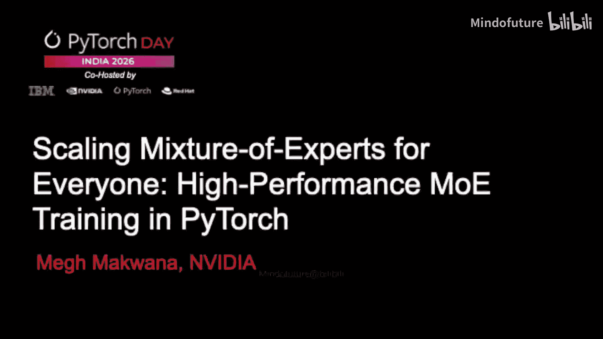
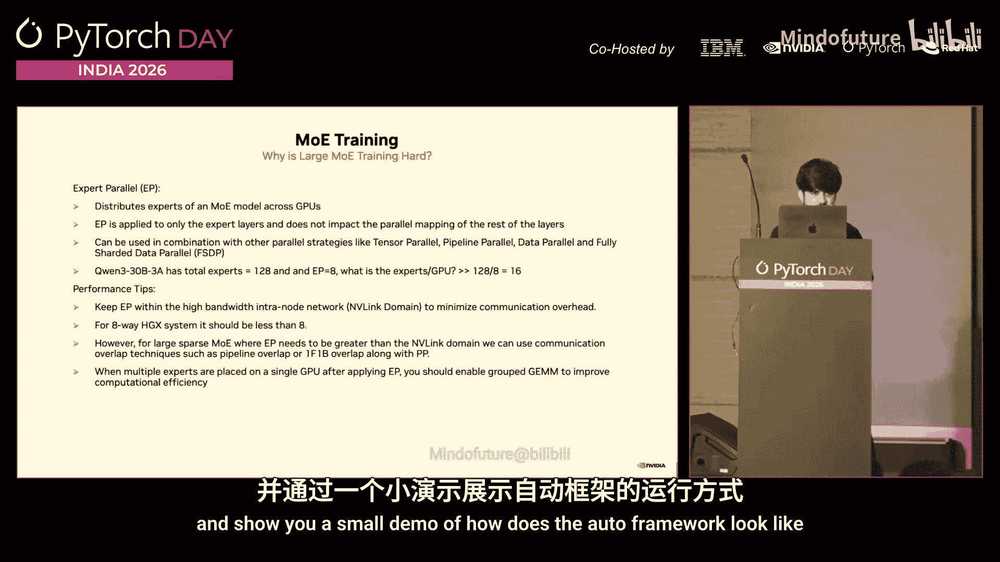
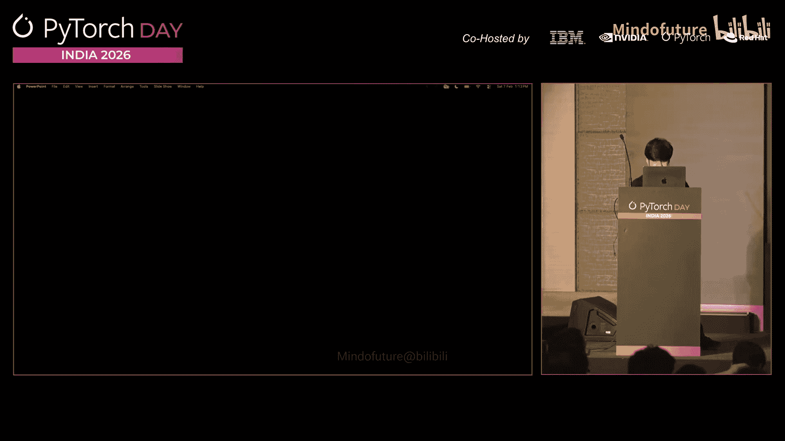
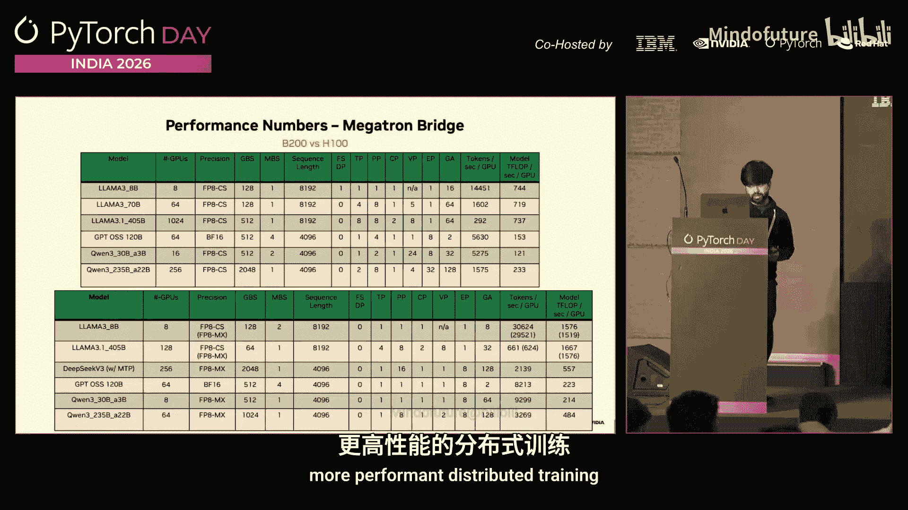
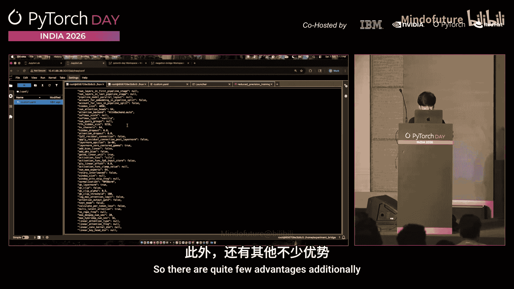
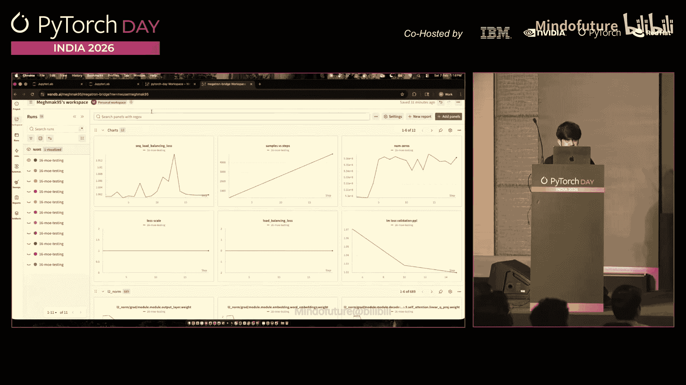
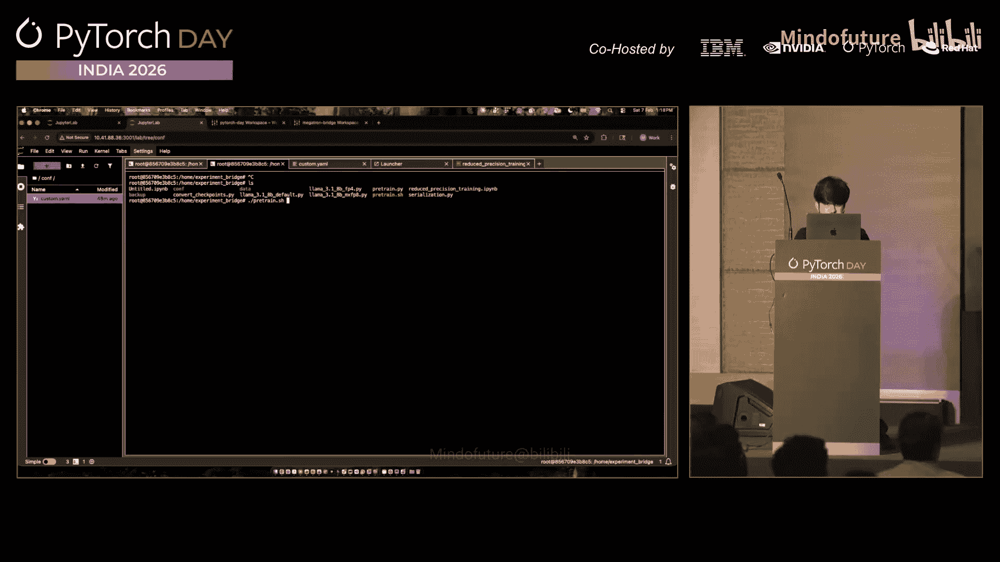
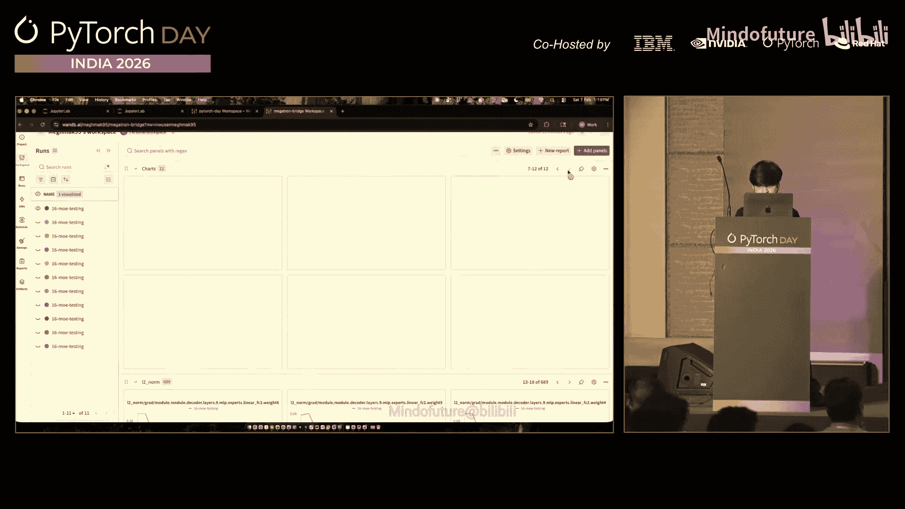
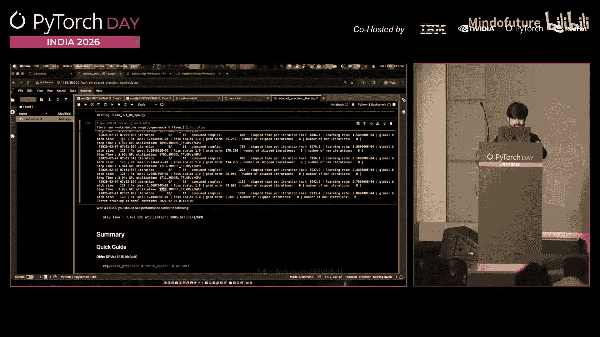

# 006：高性能MoE训练在PyTorch

## 概述

在本节课中，我们将学习如何训练专家混合模型。我们将了解训练此类模型时面临的核心挑战，并介绍两个基于PyTorch的框架——AutoModel和Megatron Bridge——它们提供了从入门到大规模训练所需的工具和优化。

---

## 什么是MoE模型？🤔

当前许多先进模型都趋向于采用专家混合架构。简单来说，可以将MoE模型理解为对标准Transformer模型的改造。

在常见的密集模型（如Llama）中，我们只需将前馈网络层替换为MoE层即可。

**MoE层**由两个核心组件构成：
1.  **路由器**：学习一个概率分布。当接收到输入词元时，它负责决定将该词元路由到哪个专家。
2.  **专家**：多个较小的前馈网络。每个专家都是一个独立的神经网络。

通常，MoE层中的**路由器数量**和**专家大小**都是可调的超参数。

与密集模型相比，MoE模型的优势在于：
*   能够拥有更多的参数。
*   在推理时无需激活所有参数，只需激活少数几个专家，从而显著降低推理所需的计算量。

---

## 为何MoE模型训练更具挑战性？⚡

训练MoE模型的挑战主要可归纳为以下三类。

### 1. 模型并行策略

许多MoE模型规模庞大，需要高效地将其分布到多个GPU上以获得最佳性能，这涉及到多种模型并行策略：

*   **专家并行**：决定如何将专家分布到不同GPU上。例如，如果一个MoE层有128个专家，专家并行大小为8，则每个GPU将承载 `128 / 8 = 16` 个专家。
*   **流水线并行**：将模型的层拆分到不同的GPU组上。例如，一个40层的MoE模型，若流水线并行大小为2，则前20层在一个GPU组，后20层在另一个GPU组。
*   **上下文并行**：在处理极长序列时非常重要，它按上下文并行维度分割序列长度。
*   **FSDP**：全分片数据并行，将模型权重、梯度和优化器状态分片到所有GPU上。

### 2. 路由与调度开销

由于专家分布在多个GPU上，路由器需要高效地将词元路由到所有专家，这会导致大量的通信（如All-to-All通信）。此外，由于每个专家只接收部分输入，总体GEMM效率也会下降。

为了应对这些挑战，我们采用以下三种优化组合：
*   **MoE置换融合**
*   **路由器融合**
*   **MoE分组GEMM**：其目标是确保当单个GPU上有多个MoE块时，能通过一个内核跨整个MoE块执行GEMM操作，而非对单个块执行。

### 3. 路由不平衡问题

在训练过程中，词元可能只被分散到少数几个专家，导致只有部分专家对最终输出有贡献，造成负载不平衡。

---

## AutoModel框架介绍 🛠️

接下来，我们将介绍AutoModel框架，以及我们如何将上述优化集成到其中。

AutoModel是一个纯PyTorch原生的框架，它允许您使用之前提到的所有模型并行技术，并帮助您对LLM和VLM模型进行预训练和后训练。整个代码库高度依赖YAML配置，您可以直接通过修改YAML文件来调整训练配置。

此外，我们还集成了来自Transformer Engine和DeepSpeed的自定义内核，以确保模型训练的性能和较高的模型浮点运算利用率。

### AutoModel工作流程演示

以下是使用AutoModel进行训练的基本步骤：

1.  **准备数据**：使用`tokenizer.py`将JSON格式的数据转换为IDX-BIN格式。
2.  **配置训练**：通过YAML配置文件设置所有重要参数，如张量并行大小、上下文并行大小、流水线并行大小和专家并行大小。框架还支持自动流水线功能，可自动分配各流水线阶段的层数。
3.  **定义模型**：在模型定义中，我们调用Transformer Engine的注意力、线性和RMSNorm块的内核，并利用DeepSpeed的高度优化调度器库。
4.  **设置损失函数与数据集**：定义简单的损失函数和数据加载函数（示例中使用模拟数据）。
5.  **配置优化器与调度器**：设置优化器和学习率调度器的超参数。

完成配置后，只需运行启动命令即可开始预训练任务。所有超参数都会清晰显示，训练开始后，通过观察GPU功耗可以判断是否获得了良好的计算性能。

对于MoE模型的初学者，可以轻松地获取一个预定义的MoE模型，并使用AutoModel快速启动工作流。

---

## 如何最大化训练性能？🚀

在决定训练配置时，有几个重要因素需要考虑。

**如何确定专家并行大小？**
通常，如果模型规模较小，应尽量将专家并行限制在一个节点内。例如，在一个8卡节点上，专家并行大小应小于或等于8。以330B模型为例，它有128个专家，我们将专家并行大小设为8。如果设为16，通信将跨越两个节点，专家并行的通信开销会增加，从而降低总体TFLOPS。

最佳实践是：
*   **小模型**：将专家并行保持在节点内。
*   **大模型**：当专家并行大小需要大于8（如16、32、64）时，应确保同时启用1F1B流水线并行重叠优化，使通信与计算重叠，以避免流水线气泡。

我们已在不同模型架构上使用AutoModel进行了测试，规模最高可达约1000个GPU。如果需要扩展到2000或4000个GPU的规模，则建议转向**Megatron Bridge**框架。

---

## Megatron Bridge框架介绍 🌉

Megatron Bridge是一个扩展框架，它包含了AutoModel中的所有并行策略，并拥有完整的Megatron核心代码库，支持进行更高效的大规模分布式训练。

其工作流程同样直接：
1.  调用主训练脚本（如`pretrain.py`）。
2.  脚本读取一个自定义的YAML配置文件，其中包含了训练器、模型等所有相关的超参数。
3.  虽然配置可能比AutoModel更复杂，但它允许您进行更细致和特定的调整。

### 训练监控与可视化

在训练过程中，监控以下指标至关重要：

*   **负载均衡损失**：这是训练MoE模型时极其重要的指标。理想情况下，其值应接近1。如果该值大于1（如1.1、1.2、1.3），则意味着只有少数专家参与了前向传播，存在不平衡。通过观察模型中所有层的负载均衡损失图，可以详细了解训练动态。
*   **L2梯度范数**：在大规模训练中，如果训练开始发散，梯度范数可以帮助定位原因。通常，某些层的梯度范数会开始异常增大，这可能导致训练运行发散。监控所有层的梯度范数变化非常有用。

这些可视化图表有助于深入理解模型训练的动态过程。

---

## 低精度训练实践 🔬

在新的Blackwell架构中，您可以使用低精度进行预训练和后训练。

以Llama模型为例：
*   使用**BF16**精度时，我们大约能在每个GPU上实现1000 TFLOPS的性能。
*   切换到**MXFP8**混合精度后，性能从约1.1K TFLOPS提升至约1.5K TFLOPS，提升了约30-35%。
*   进一步使用**NVFP4**精度时，性能可提升至约1700 TFLOPS。

实现这些只需在配置中修改精度类型（如将`BF16`改为`MXFP8 mixed`）。这表明，人们现在也开始使用低精度方案来训练MoE风格的模型。

---

## 总结

本节课中，我们一起学习了专家混合模型训练的核心概念与挑战。我们介绍了两个基于PyTorch的框架：**AutoModel**适合希望快速入门或在中等规模上进行训练的用户；**Megatron Bridge**则专为需要扩展到数千个GPU的超大规模训练而设计。我们还探讨了如何通过合理的并行策略配置、利用框架内置优化以及采用低精度训练来最大化训练性能。最后，我们了解了监控负载均衡损失和梯度范数对于确保训练稳定性的重要性。