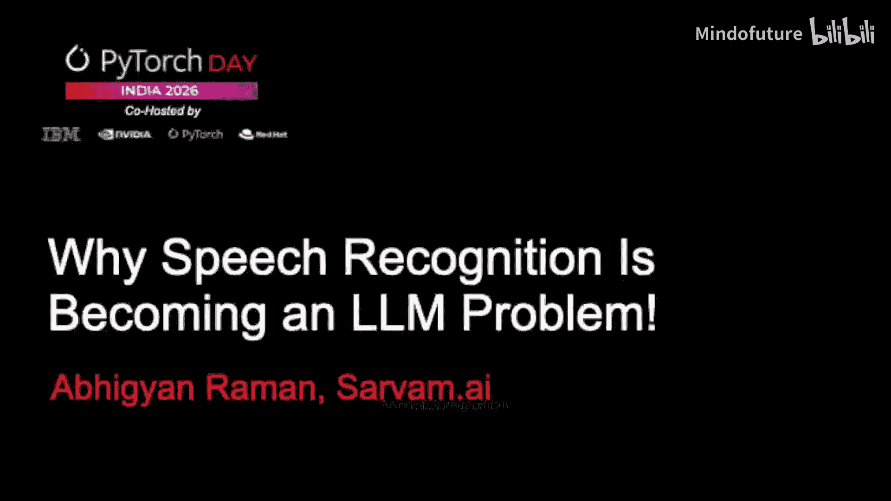
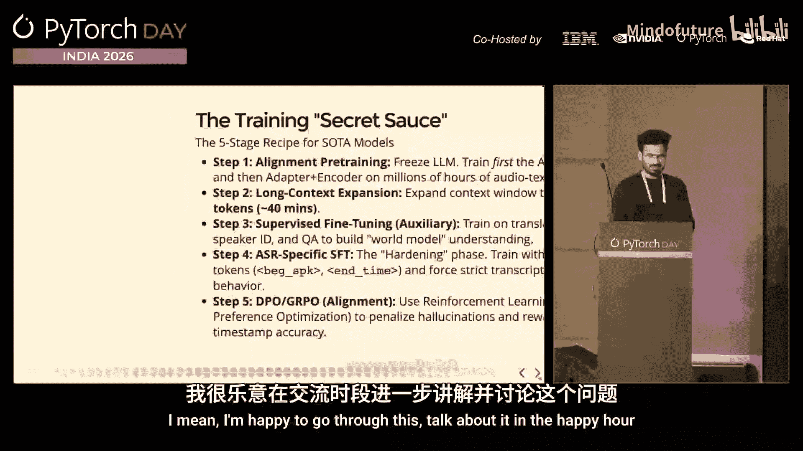

# 007：为什么语音识别正成为一个LLM问题

## 概述
在本节课中，我们将探讨语音识别技术如何从传统的专用模型演变为一个大型语言模型问题。我们将回顾其发展历程，分析架构演变，并理解当前基于LLM的语音识别系统的核心原理与挑战。

---

## 演讲者介绍
我是Sarvam AI的一名全职数据工程师。在此之前，我曾在A公司工作，更早则在大学和一些初创公司任职。我从事数据相关工作已近十年，期间也参与模型构建。我选择称自己为“数据工程师”，是因为在过去十年中，我观察到数据具有极佳的扩展性。虽然模型架构会不断推陈出新，但作为一名数据工程师，有大量机会去实验和体验如何策划更大规模、更有趣的数据。根据卡达谢夫定律，任何无法扩展的事物终将消亡，我认为这对当前所有人工智能的发展也同样适用。

## 语音识别的三个时代
基于上述扩展性的考量，我将语音识别问题的发展划分为三个时代：前扩展时代、过渡时代和LLM时代。

### 前扩展时代
前扩展时代距今并不遥远，大约就在五六年前。当时我们使用如DeepSpeech、CTC、RNN-T等模型。这些模型相对较小、自包含，能较好地完成转录这一单一任务，但功能有限。为了让系统真正可用，必须添加许多额外组件，例如：
*   统计语言模型模块：用于提升转录文本的流畅度。
*   标准化模块：处理标点、大小写等。
*   说话人分离模块：区分不同说话人。

这就像一个由众多不同部件拼凑而成的系统，任何一个环节出错都会导致整个链条崩溃，使得系统非常脆弱。

### 过渡时代
随后进入了过渡时代。我们意识到可以扩展数据，并且存在能够支持数据扩展的架构，这意味着模型可以实现更好的泛化能力、处理多任务以及支持多语言。在模型方面，出现了更大的模型，如wav2vec 2.0，其参数量达到数亿级别（尚未达到数十亿）。Whisper的发布是一个关键转折点，它展示了：
*   模型可以扩展。
*   数据可以扩展。
*   单个模型可以实现跨不同任务的泛化能力。

这个时代的主题仍然是“扩展”，但我们尚未真正进入LLM时代。

### LLM时代
随着GPT浪潮的到来，我们认识到LLM是通用模型，它们对世界有一定理解，并且能很好地适应各种任务。提示工程等技术开始流行。这是最近的时代，人们意识到可以将数据规模从数百万小时扩展到数千万小时。此时，作为“大脑”的LLM组件充当解码器并保持不变。如果我们能获得泛化行为，由于LLM是智能的核心，我们基本上可以在LLM之上添加音频模态，从而完成LLM所能做的一切事情。

## 技术架构的演变
接下来，我们更详细地看看技术架构是如何演变的。

### 第一阶段：黑暗时代
大约十年前我刚开始做语音识别时，那是一个“黑暗时代”。我们必须手动设计特征，使用不同的模型，整个系统由多个子系统拼接而成。任何一个环节出问题，整个链条就会崩溃。

### 第二阶段：帧预测模型
第一次革命是帧预测模型的出现，端到端深度学习开始成型。CTC和RNN-T等模型至今仍然非常相关，它们小巧、高效、专注。但它们仍然存在一些问题，其中之一是在生产系统中，你仍然需要一些外部模块才能使其真正工作。

### 第三阶段：关键转折点——Whisper
2018年（注：实际为2022年），Whisper的发布带来了范式转变。这是第一个在大约70万小时嘈杂、多样化的伪标签数据上训练的模型。我们意识到：
*   语音可以被视为令牌（Token）。
*   单个模型可以处理多任务。
*   自回归生成模型（而非帧预测模型）是可行的。

虽然它有时会产生“幻觉”，但人们逐渐认识到，这种“幻觉”在某些场景下是一种特性而非缺陷。由于其出色的泛化能力，Whisper至今仍被广泛采用，它是第一个音频条件的LLM。

## 现代音频LLM的架构
一旦明确音频可以像文本一样被令牌化，架构思路就清晰了：我们可以使用一个强大的LLM解码器，并配一个投影空间，将音频特征投影到与文本相同的向量空间中，然后就可以通过音频模态执行任何任务，如总结、对话、回答一般性问题等。

以下是架构的具体演变：

### 传统端到端ASR（帧预测）
这种架构目前仍然有效。其核心是一个编码器块，解码器通常是一个单层或多层感知机，用于进行帧级别的预测。输入音频被分成帧，每一帧都有对应的预测。这是一个非常确定的系统。
**缺点**：它没有完整的上下文，不是一个生成式模型，而是一个判别式模型。

### 自回归模型（如Whisper）
从帧预测模型到自回归模型的关键变化在于**解码器变成了自回归的**。
*   编码器基本保持不变，是一个非因果编码系统。
*   解码器则是一个完整的Transformer自回归解码器。
*   两者通过交叉注意力层连接。

工作流程是：传入所有输入音频，在编码器侧不进行预测，只是通过交叉注意力将编码器的特征传递给解码器侧，从而将声学特征捕获到解码器。你输入音频和一个“前缀”（包含特定指令，最初是通过特殊令牌实现的，如“转录”、“英语”等），模型被强制遵循这个路径开始生成文本。例如，如果音频是“the quick brown fox”，模型首先生成“the”，然后将其作为输入的一部分，再生成“quick”，依此类推。

这是语音识别方式的根本性转变。人们第一次意识到，可以将ASR更多地视为一个语言问题，而非纯粹的声学问题。本质上，你是在用音频条件来调整你的LLM（在当时，解码器就是一个带有编码器的语言模型），并从这个分布中持续采样。

### 适配器架构的音频LLM
上述系统的一个有趣限制是必须使用交叉注意力层。编码器将音频编码到交叉注意力的K/V值中，然后开始解码。但如果我们想要一个能与现代LLM协同工作的系统，我们不希望将交叉注意力注入到解码器层中。

因此，出现了新的架构：
1.  **音频编码**：音频通过一个编码器，得到音频嵌入。
2.  **分块处理**：为了泛化到任意长度的音频，可以将其分块（例如，30秒一块）。
3.  **适配器层**：这是音频LLM的核心。它将来自音频空间的嵌入转换到文本令牌空间。
4.  **LLM处理**：转换后的音频特征作为通用令牌，与文本提示（如“请转录”）拼接后，直接输入给LLM。

这样，LLM就能开始生成转录文本。解码器侧仍然是自回归的，但关键区别在于音频特征通过适配器与文本空间对齐后，可以直接利用LLM强大的提示理解能力。

**核心训练点**：虽然适配器层可能很薄（如两层线性层或几层卷积/Transformer层），但它是需要最多训练量的组件。编码器和适配器需要协同工作，以确保在添加音频复杂性后，LLM的能力不会发生偏移。

## 专用ASR LLM的兴起
进入2026年，我观察到（并参与了一些工作）一个有趣的现象：音频LLM虽然强大，能完成通用LLM的任务，但在执行非常精确的任务（如语音识别）时，有时会产生幻觉。语音识别要求精确的帧级别预测，同时也需要理解上下文和世界知识（例如准确捕获提到的实体名称）。

因此，出现了专门为ASR任务微调的音频LLM。例如：
*   **vivoice ASR**：支持超长音频转录，并统一了时间戳功能。
*   **Coin3 ASR**（上周发布）：专注于上下文理解、长音频处理和实时组件。
*   **v-transcript**（两天前发布）：专注于ASR任务。

这些模型都聚焦于两个重要方面：
1.  **精确性**：必须非常精确，不易产生幻觉，不易被“越狱”。
2.  **性能**：为了部署，需要在性能和运行时效率之间取得平衡。

## 实时流式处理的挑战
在实时场景（如实时字幕）中，我们希望语音一开始，转录就随之进行。这在传统的帧预测ASR系统中是可能的。但在编码器-解码器架构中，编码器通常是非因果的（注意力是双向的），需要编码整个音频后才能开始解码，这对实时性构成了挑战。

最近的趋势是尝试在编码器中注入流式自注意力（因果注意力）块，以实现流式推理。微软、阿里巴巴等公司都在致力于解决这个问题。

## 为什么需要专用ASR LLM？
我们需要专用ASR LLM的原因包括：
*   **安全与精确控制**：限制指令集，防止越狱。
*   **格式控制**：通过训练和提示，控制输出格式（例如，印地语中混用的英语单词是用罗马字母还是天城文书写出）。
*   **偏置控制**：早期通过专用模块实现的热词偏置，现在可以通过提示词来实现。例如，vivoice ASR允许注入数百个上下文词，或描述领域信息，从而偏置转录结果。这真正展现了LLM的能力。

## 训练流程简介
最后，简要介绍此类模型的训练流程：
1.  **对齐预训练**：取现有LLM和音频编码器，加入适配器层。冻结LLM，在数百万小时的音频-文本对（包括转录对和音频-文本交错的下一个令牌预测对）上训练适配器和编码器。
2.  **长上下文扩展**：初始聚焦较短上下文，随后扩展到更长的音频。
3.  **监督微调**：针对特定任务进行微调，此时会解冻LLM模块，进行端到端训练，以保留其对世界的理解。
4.  **ASR特定SFT**：专门针对ASR任务进行微调，注入特殊令牌，确保其在时间戳对齐、说话人分离等对自回归模型较难的任务上表现良好。
5.  **训练后强化学习**：最终优化阶段。

## 总结
本节课中，我们一起学习了语音识别如何从一个由多个脆弱组件拼接的系统，演变为基于强大、可扩展的大型语言模型的通用任务。我们回顾了从帧预测模型到自回归模型，再到现代适配器架构的音频LLM的技术发展路径。我们还探讨了当前趋势——开发专用ASR LLM以追求更高精确性和可控性，以及实现实时流式处理所面临的挑战。理解这一演变，有助于我们把握语音技术未来的发展方向。