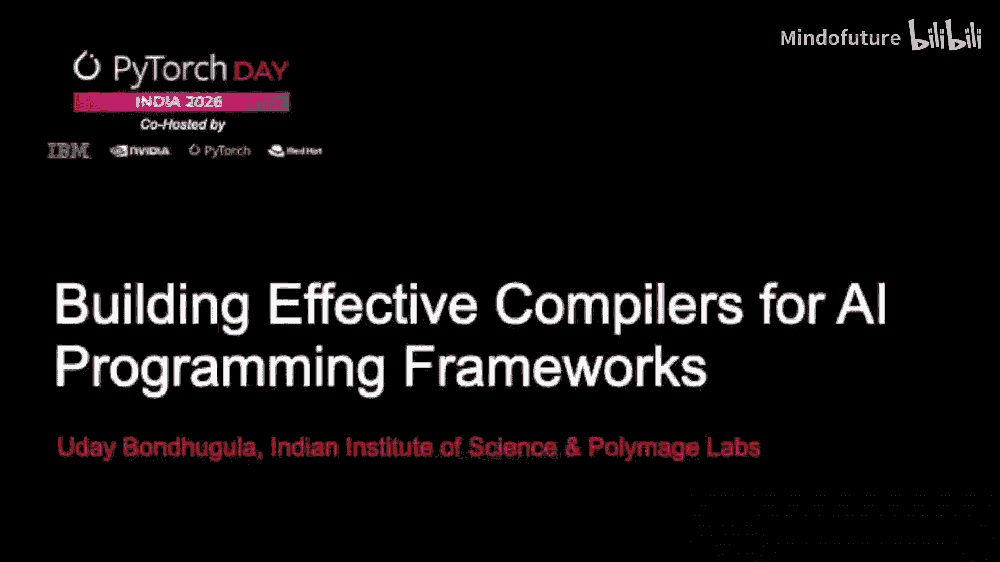
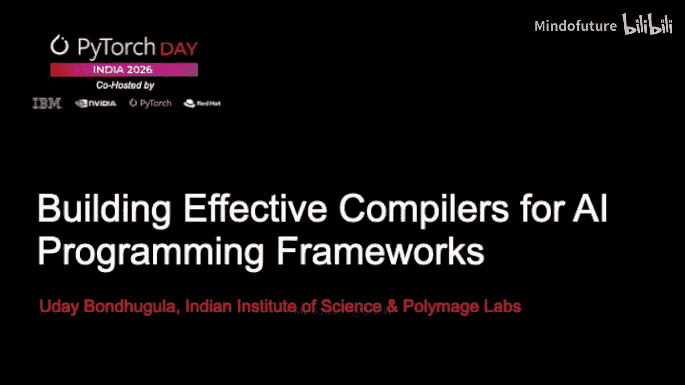
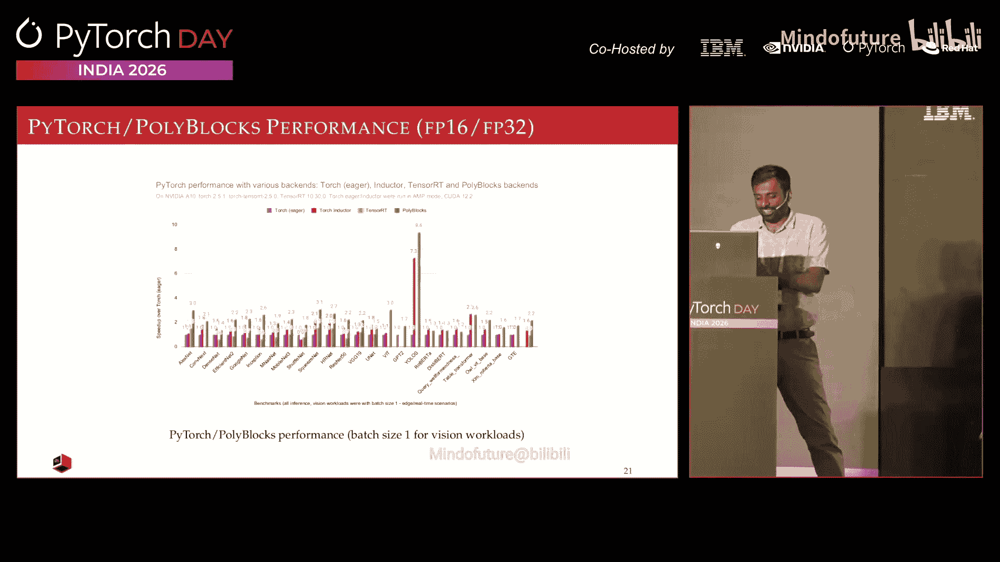
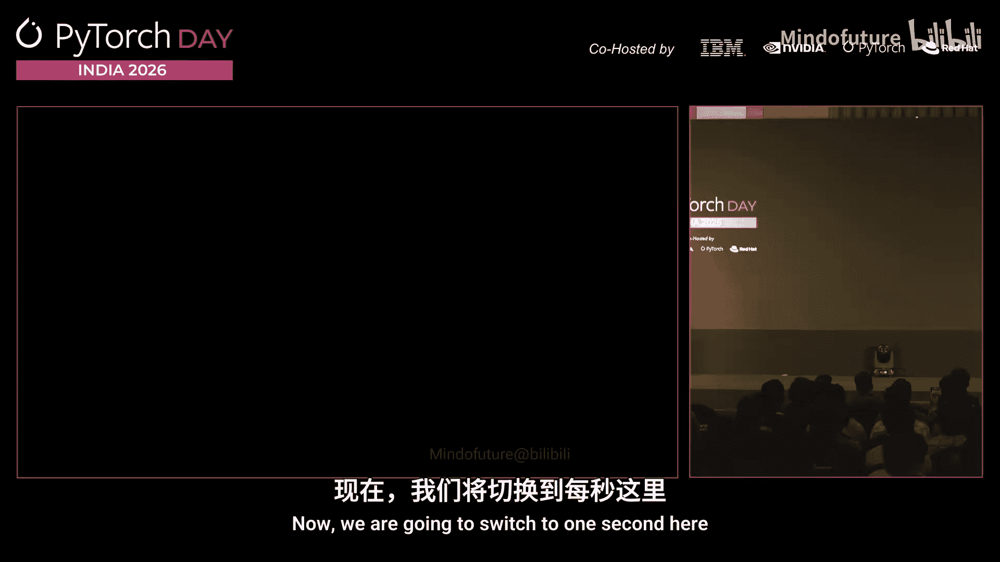
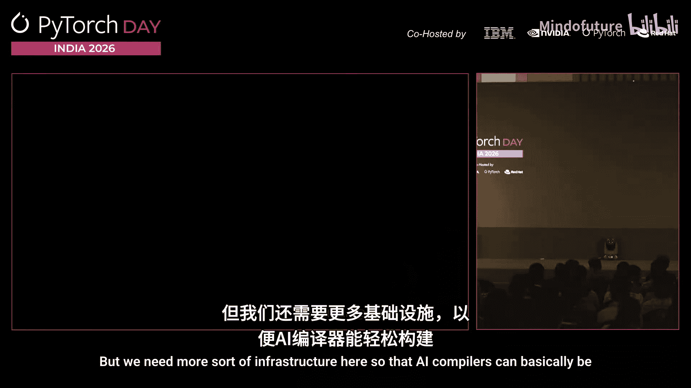
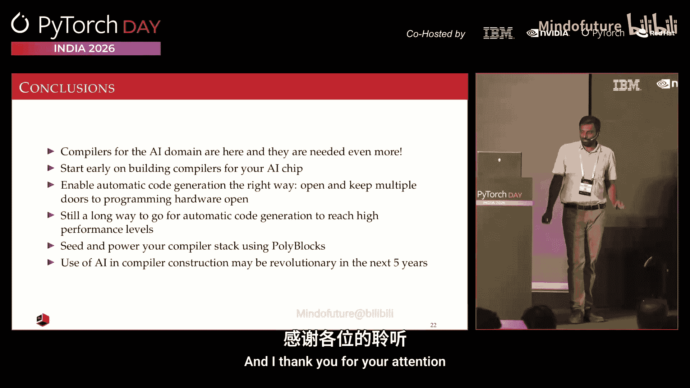

# 008：为AI编程框架构建有效编译器






在本节课程中，我们将探讨如何为AI编程框架构建有效的编译器。我们将了解AI编译器的挑战、现有基础设施、不同层次的编译器方法，并通过一个实际演示来展示编译器带来的性能提升。

## 🧠 AI编译器的挑战

构建AI编译器非常困难。AI编译器需要将高级AI编程框架（如PyTorch、JAX）的代码转换为能在AI加速器芯片上高效运行的代码。这之所以困难，是因为框架提供的抽象层次与硬件执行层次之间存在巨大鸿沟。

PyTorch提供了数百个算子，用户使用这些算子构建模型。为了在硬件上获得高性能，编译器必须利用并行性、内存层次结构以及专用计算单元（如张量核心、矩阵单元）。硬件不断涌现新特性，而编译器的目标不仅是生成代码，更是生成高性能的代码。所有这些因素都使得编译器的构建工作极具挑战性。

## 🛠️ 现有基础设施与编译器

尽管挑战巨大，但我们并非从零开始。目前已有许多优秀的开源基础设施，例如 **LLVM**、**MLIR**、**Triton**。这些工具为构建编译器提供了便利。

*   **LLVM** 是一个编译器基础设施，可用于构建多种编译器。
*   **MLIR** 作为LLVM的下一代项目，解决了LLVM的两个关键限制：提供了多层次的抽象表示，并支持轻松扩展新的操作和类型，这对于构建领域特定编译器（如AI编译器）至关重要。

然而，即使有了这些基础设施，构建新的编译器仍然需要大量工作。开发者需要理解硬件优化、算子转换和代码生成。

## 📊 编译器层次：从高级到低级

AI编译器并非只有一种。根据抽象层次，可以分为几类：

*   **高级编译器**：例如 **XLA**（用于JAX/TensorFlow）和 **Torch Inductor**（用于PyTorch）。它们可以直接编译未经修改的高级框架代码。
*   **中级编译器**：例如 **Triton**。它提供了比PyTorch更低、更接近硬件的抽象。编程难度稍高，但能获得比纯高级框架更好的性能。用户可以在性能不理想时，将部分代码用Triton重写。
*   **低级编译器**：用于编译手工优化的库，如 **cuDNN**、**cuBLAS**、**MKL**。这些库通过CUDA编译器或C++编译器编译，为特定操作提供极致性能。

在模型执行策略上，也存在一个光谱：
*   **即时执行**：对于模型中的每个算子，调用预编译好的高性能库来执行。
*   **完全代码生成**：为模型的每个部分（包括算子）动态生成代码，并通过LLVM等工具链编译为机器码。

像Inductor和XLA这样的编译器采取了一种**混合策略**：对于能高效编译的部分进行代码生成；对于难以编译或已有高度优化库的部分，则调用预编译库。这可以看作是一种“半编译器”。

## 🚀 编译器的价值：性能提升

编译器的核心价值在于性能优化。Meta近期发表的一篇论文展示了编译器的效果：在评估的约200个模型中，对其中约100个模型，编译器通过**跨算子融合**、**代码专业化**等优化，带来了**超过2倍的性能提升**。

这意味着，仅仅通过添加一行如 `torch.compile` 的代码，同一模型在相同硬件上就能运行得更快。这充分证明了编译器对于充分挖掘硬件潜力、接近其峰值性能的重要性。

## 🏗️ PolyBlocks：一个可复用的编译器引擎

上一节我们看到了编译器带来的显著性能提升。本节中，我们将介绍一个旨在简化AI编译器构建的项目——**PolyBlocks**。

PolyBlocks是一个基于MLIR构建的编译器引擎。其目标是构建一个可服务于多种AI框架（如PyTorch、JAX）和多种硬件（如GPU、其他AI芯片）的通用编译器基础设施，使得为新型AI芯片快速构建编译器（例如在几个月内）成为可能。

它的编程模型非常直接。例如，对于PyTorch，可以将其注册为一个后端：

```python
@torch.jit.script
def my_function(x):
    # ... PyTorch code ...
    return result



# 或者使用 torch.compile
optimized_model = torch.compile(my_model, backend='polyblocks')
```

PolyBlocks是一个**完全代码生成**的编译器，不依赖任何手写内核或预编译库。这对于为生态尚不完善的新型AI芯片构建软件栈至关重要。同一套编译器引擎可以用于PyTorch和JAX，因为一旦进入编译流程，底层的优化和转换是可以共享的。



## 🎬 演示：编译器实战

理论阐述了编译器的优势，现在让我们通过一个实际演示来直观感受。我们将运行一个来自Meta的基于Transformer的视觉模型 **DINO**，并比较不同执行模式下的性能。

以下是性能对比的核心结果：

1.  **CPU即时执行**：处理一帧图像约需825毫秒，仅能达到约1帧/秒的速度。
2.  **GPU即时执行**：利用笔记本的RTX 4080 GPU（包括张量核心），速度提升约10倍，达到约45-50毫秒/帧。
3.  **启用 Torch Inductor 编译**：在GPU上，通过编译器优化（主要是算子融合），性能进一步提升约30%，达到约35毫秒/帧。
4.  **启用 PolyBlocks 编译**：作为完全代码生成的编译器，在不使用任何高度调优库的情况下，其性能与Inductor接近（相差约20%）。这证明了完全代码生成路径的可行性。


这个演示清晰地表明，仅通过启用编译，就能获得显著的性能提升，而这主要归功于编译器执行的跨算子融合等优化，这些是即时执行模式无法实现的。

## 💡 结论与建议



本节课我们一起学习了为AI框架构建编译器的核心知识。我们来总结一下关键要点：


*   **构建AI编译器很难**，但由于LLVM、MLIR等共享基础设施的存在，这项任务变得可行。
*   **编译器能显著提升性能**，关键优化如算子融合对于挖掘硬件潜力至关重要。
*   **存在不同层次的编译器**（高级、中级、低级）和**执行策略**（即时、完全代码生成、混合），形成了丰富的工具生态。
*   **PolyBlocks** 等项目展示了构建**可复用、完全代码生成的编译器引擎**的可能性，有助于快速为新硬件适配软件栈。

对于AI芯片厂商，核心建议是：**尽早启动编译器开发工作**。不要只专注于芯片设计和手写内核，而应将编译器视为软件栈的核心部分同步开发。同时，保持工具链的开放性，支持从PyTorch到Triton再到CUDA等多层次编程抽象，为开发者提供多种性能调优路径。

最后，一个新兴的方向是 **“AI for Compilers”**，即探索如何利用大语言模型（LLM）或生成式AI来辅助编译器构建，例如自动生成代价模型或优化策略，这可能是未来五年编译技术发展的有趣趋势。



