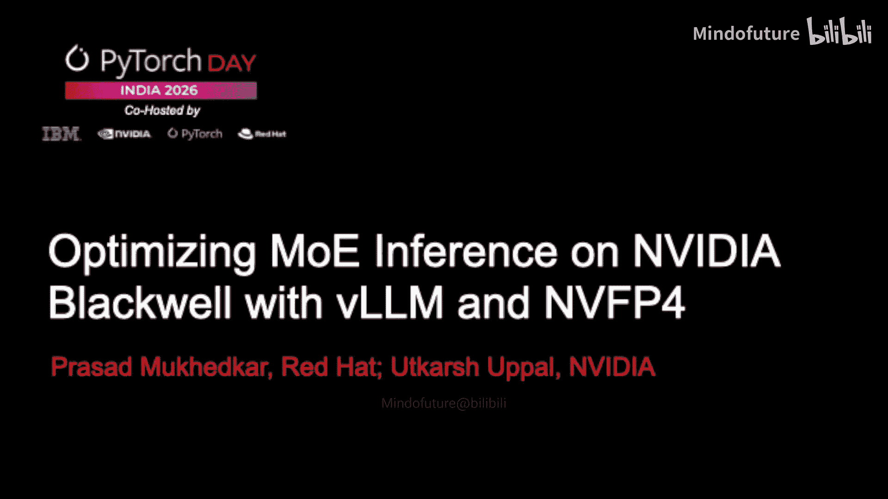
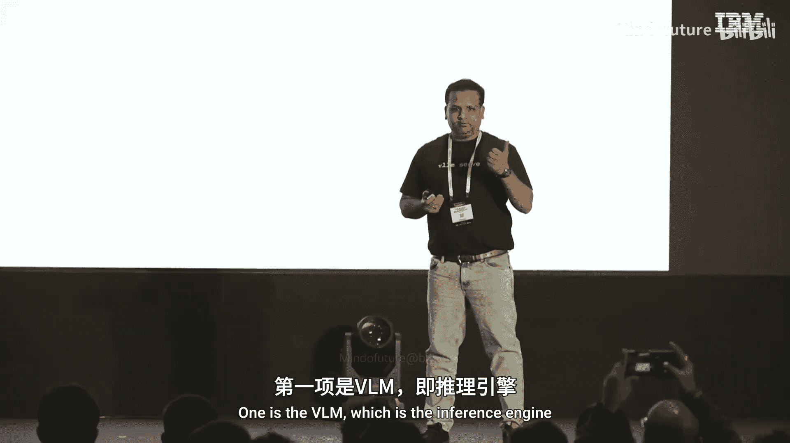
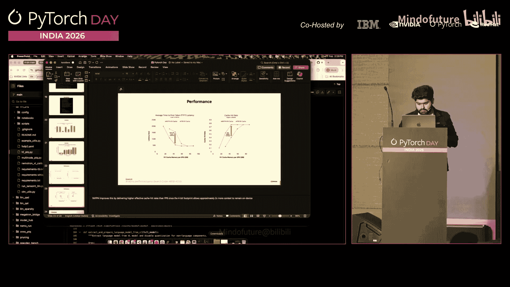

# 009：在 NVIDIA Blackwell 上使用 vLLM 和 NVFP4 优化 MoE 推理





## 概述
在本节课中，我们将学习如何利用 vLLM 推理引擎和 NVFP4 低精度量化技术，来优化混合专家模型的推理性能。我们将了解 vLLM 的核心特性、MoE 模型的挑战，以及 NVFP4 量化如何显著提升效率并节省 GPU 内存。

---

## vLLM 简介：高性能推理引擎 🚀

vLLM 是一个用于大型语言模型的高性能、内存高效、低延迟推理和服务引擎的开源标准。它非常流行且易于使用。

以下是 vLLM 的主要优势：

*   **易于使用**：可以通过 `pip install vllm` 安装，或使用 Docker 镜像快速运行。
*   **广泛的模型支持**：支持超过 100 种模型架构，包括 Llama、Mixtral 等前沿模型以及多种区域模型。
*   **灵活的并行策略**：支持张量并行、流水线并行和专家并行，便于在多 GPU 或跨节点环境中运行大型模型。
*   **广泛的硬件支持**：优化支持所有 NVIDIA GPU，同时也支持 AMD 等其他 AI 加速器。
*   **丰富的子项目生态**：包括用于多模态模型的 VLMM、用于性能测试的 Guidem、用于优化的 Speculator 等。
*   **强大的社区支持**：这是一个由 PyTorch 基金会托管的项目，拥有超过 2000 名贡献者和 70000 多个 GitHub star。

上一节我们介绍了 vLLM 的基本情况，本节中我们来看看它如何应对混合专家模型推理的挑战。

---

## 应对 MoE 模型的挑战：vLLM 的优化策略 ⚙️

混合专家模型在架构上包含多个被称为“专家”的人工神经网络，以及一个路由层。MoE 模型的挑战不仅在于计算，更在于内存管理和调度。

vLLM 通过以下关键技术来解决这些挑战：

*   **连续批处理**：传统的静态批处理效率低下。vLLM 采用动态连续批处理，请求进入后立即处理，无需等待批次填满，从而提高了吞吐量。
*   **页面注意力与 KV 缓存管理**：LLM 的注意力机制会生成键值向量。vLLM 使用页面注意力技术来管理 KV 缓存，这类似于操作系统的虚拟内存分页，能有效减少 GPU 内存碎片，充分利用内存。
*   **专家并行**：这是针对 MoE 模型的专门优化。例如，Mixtral Large 模型有 128 个专家。vLLM 可以将这些专家分布到不同的 GPU 上运行，实现高效的专家级并行计算。
*   **量化支持**：vLLM 支持全面的量化策略以节省内存。
    *   **权重量化**：将模型权重从 FP16 降低到 INT8、INT4 等精度。
    *   **激活量化**：对推理过程中产生的中间激活值进行量化。
    *   **KV 缓存量化**：对占用大量内存的 KV 缓存本身进行量化。

了解了 vLLM 的优化策略后，接下来我们将深入探讨其中一项关键技术：NVFP4 低精度量化。

---

## NVFP4 量化：Blackwell GPU 上的突破性技术 🔬

NVIDIA Blackwell GPU 原生支持包括 NVFP4 在内的低精度数值格式。这与传统的浮点数格式不同。

**微尺度格式与传统格式的区别**：
传统 FP 格式使用单个缩放因子作用于整个张量。微尺度格式则将张量划分为多个“块”，每个块拥有自己的缩放因子。

一个块格式包含三个部分：
1.  **元素数据类型**：例如 `E2M1`（2位指数，1位尾数，1位符号位）。
2.  **缩放数据类型**：例如 `E8M0`（8位指数，无尾数）。
3.  **块大小**：共享同一缩放因子的元素数量。

**NVFP4 格式详解**：
NVFP4 的数值类型为 `E2M1`。它与 MXFP4 有两个关键区别：
1.  **两级微缩放策略**：
    *   **块级缩放**：使用 `E4M3` 格式（而非 `E8M0`）作为缩放因子，提高了编码精度。
    *   **张量级缩放**：使用 FP32 格式的全局缩放因子，以弥补因提高精度而减小的动态范围。
2.  **更小的块大小**：NVFP4 使用 16 个元素作为一个块（MXFP4 为 32），能更好地适应数据的局部动态范围。

**量化流程**：
大多数开源模型检查点都是 FP16 格式。我们可以使用 NVIDIA 的 `modelopt` 等工具库将其量化为 NVFP4 格式。

```python
# 伪代码示例：使用 modelopt 进行量化
from modelopt import quantize
quantized_model = quantize(model, precision="nvfp4")
```

**精度与性能**：
实验表明，从 FP8 量化到 NVFP4，在 MMLU 等基准测试上的精度损失非常小。而在性能上，在 B200 GPU 上，NVFP4 相比 FP8 能带来约 3 倍的推理速度提升。同时，NVFP4 KV 缓存能显著提高缓存命中率，允许在相同内存中容纳更长的上下文。

最后，让我们通过一个实际演示来直观感受 NVFP4 量化带来的效果。

---

## 实战演示：在 B200 上部署 NVFP4 量化模型 🖥️

本次演示在 NVIDIA B200 GPU 上进行。我们将部署一个名为 “Nemoron 30V” 的 MoE 模型。

**部署步骤**：
1.  使用 vLLM 加载一个预量化的 NVFP4 格式模型检查点。
2.  利用 FlashAttention 后端和 MoE 优化内核进行推理。
3.  通过客户端代码向部署的模型发送查询。

**演示结果**：
模型成功部署并响应查询。例如，当输入“写一首关于 GPU 的俳句”时，模型不仅输出了诗歌，还展示了其推理过程的思维链。这证明了量化后的模型依然保持了强大的逻辑和生成能力。



---

## 总结
本节课中我们一起学习了优化 MoE 模型推理的两大关键技术。首先，**vLLM** 作为一个高效的推理引擎，通过连续批处理、页面注意力、专家并行和全面的量化支持，有效解决了 MoE 模型的内存与调度挑战。其次，**NVFP4** 作为一种先进的低精度量化格式，在 NVIDIA Blackwell GPU 上实现了高精度、高性能的 4 位推理，显著提升了速度并节省了内存。结合使用 vLLM 和 NVFP4，开发者能够在最新的硬件上高效部署和运行大规模的混合专家模型。