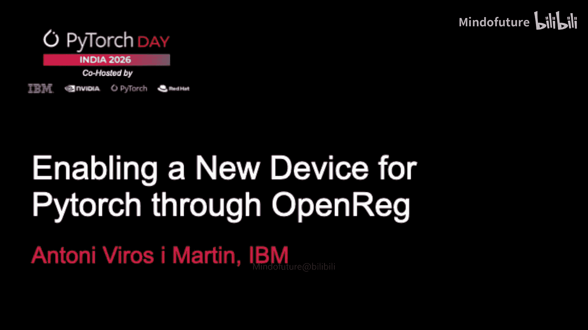
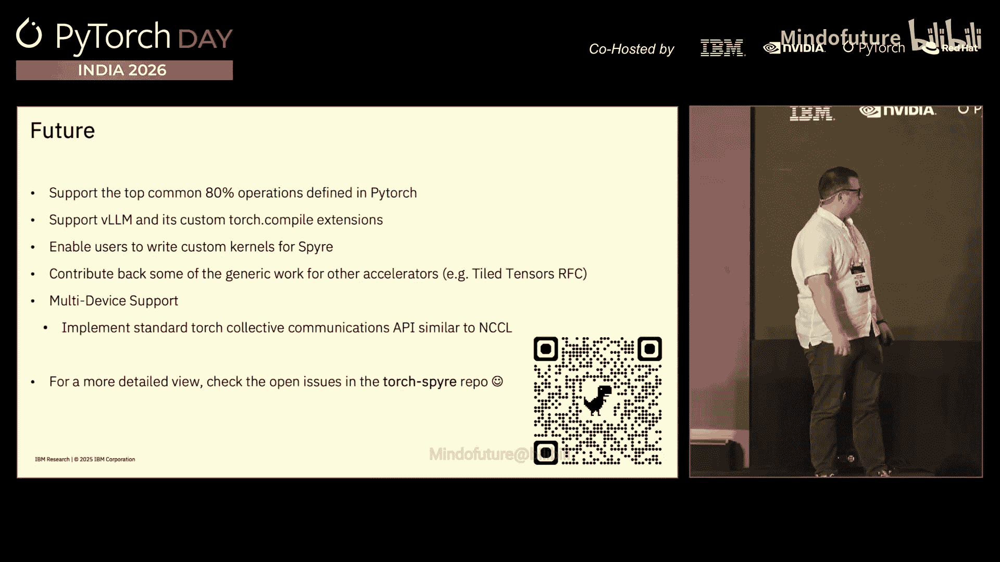

# 010：通过 OpenReg 为 PyTorch 启用新设备




## 概述

在本节课中，我们将学习如何为 PyTorch 启用一个新的硬件设备。我们将以 IBM 的 Spire 硬件为例，介绍使用 OpenReg 和 TorchDynamo 框架来集成新设备的关键步骤，包括设备注册、内存管理、操作分发以及编译器的集成。

## 演讲者介绍

我是 Antoni，来自 IBM。大约三年前，我加入了 IBM。在此之前，我曾在 PyTorch 团队短暂工作。在过去的三年半里，我主要致力于 PyTorch 和 Torch Compile 相关的工作。最近一年左右，我专注于为 PyTorch 启用 IBM 的 Spire 硬件。今天，我将介绍我们采用的最新方法：通过开放注册表来启用新设备。

我想感谢整个团队。今天观众中有很多团队成员。仅 Spire 的开源仓库就有 23 位贡献者。这不仅仅是硬件开发，还涉及驱动、编译器、模型、CI/CD 等各个方面，所有这些环节对于让模型在硬件上运行都至关重要。

## 设备分类

在 PyTorch 中，设备主要分为两类：
*   **内置设备**：例如 CPU、CUDA（NVIDIA GPU）、MPS（Apple Metal）。
*   **外部设备**：所有其他设备。例如 Intel Gaudi、Habana 或我今天要讲的 IBM TorchSpire。

## 启用新设备的框架

幸运的是，现在情况已大不相同。PyTorch 团队做了大量工作，让集成新加速器变得更容易。这主要通过两个框架实现：
*   **TorchDynamo**：一套 PyTorch API，用于帮助启用新设备。
*   **OpenReg**：一个示例项目，它使用 Python 和 C++ 代码，展示了如何创建一个新设备。OpenReg 设备实际上在 CPU 上运行，但它通过一条非标准 CPU 路径运行，这有助于开发者理解需要实现哪些 API。

以下是相关文档和代码的链接：
*   PyTorch 文档：[链接]
*   OpenReg 源代码：[链接]

## 启用新设备的四个核心任务

要启用一个新设备，需要完成以下四件事：

1.  **设备注册与初始化**：让 PyTorch 知道设备存在，并知道如何启动设备（如调用驱动、启动运行时）。
2.  **内存分配**：在设备内存中分配张量，并处理数据在主机内存和设备内存之间的移动。
3.  **操作执行**：让 PyTorch 知道如何在你的设备上运行代码（内核）。
4.  **数据传输**：实现高效的数据传输机制。

对于 IBM Spire，我们创建了 `torch-spire` 开源仓库。接下来的内容将围绕这四个任务，结合 Spire 的具体实现展开。

## 1. 设备注册与初始化

上一节我们概述了核心任务，本节我们来看看如何具体注册一个设备。

设备注册的代码看起来很简单，如屏幕左侧所示，主要包含两行。其核心是 PyTorch 的**分发器**。当你调用一个操作时，分发器会检查输入张量的设备和类型，然后决定调用哪个内核（例如 CUDA 内核或 CPU 内核）。

PyTorch 添加了一个 `PrivateUse1` 分发器键，你可以将其重命名为你的设备名，如 `spire`、`npu` 等。重命名后，你需要注册它，并注册设备的启动代码。

右侧展示了注册启动代码的示例。这里只显示了 Python 代码，实际的 C++ 代码（约 150 行）在仓库中，它负责启动 Spire 设备的运行时和驱动。此外，`torch-spire` 还加载了 Inductor 插件，并为了适应 Spire 的特性，对 PyTorch 的 Tensor 函数进行了一些修补。

## 2. 内存分配

设备注册完成后，下一步是管理设备内存。

PyTorch 实现了一个**分配器接口**，包含 `allocate` 和 `free` 函数。这允许你在 CPU、GPU 或任何实现了该接口的设备上分配内存。它能与 Python 垃圾收集器无缝集成，当张量被删除时，会自动通知设备释放内存。

Spire 的分配器还需要处理其独特的内存模型。例如，CPU 上的分配通常按 64 字节或 32 字节对齐，而 Spire 的最小分配单位可能是 128 字节。我们的分配器代码需要处理这些特殊性。

以下是需要实现的一些关键函数（C++ 示例）：
```cpp
at::Tensor empty(IntArrayRef size, at::TensorOptions options);
at::Tensor empty_strided(IntArrayRef size, IntArrayRef stride, at::TensorOptions options);
at::Tensor _sparse_coo_tensor_unsafe(const at::Tensor& indices, const at::Tensor& values, at::IntArrayRef size);
void set_(at::Tensor& self, const at::Storage& storage);
void copy_(at::Tensor& self, const at::Tensor& src);
```
在 C++ 中，你使用 `PrivateUse1` 作为设备参数，而不是直接使用 `spire`。

## 3. 操作分发与执行

内存管理就绪后，我们需要让 PyTorch 知道如何在我们的设备上执行操作。

正如之前提到的，**分发器**是 PyTorch 将 Python 函数调用路由到相应设备实现的核心机制。这是一个非常复杂但高效的技术。

在屏幕左下角，你可以看到如何注册一个操作的实现。例如，你可以为 `aten::add` 操作（即 `torch.add`）注册一个特定的 C++ 函数。当在 Spire 张量上调用 `add` 时，分发器就会调用你注册的这个函数。你需要确保这个函数的语义与 PyTorch 的期望一致。

## 4. Spire 编译策略演进

操作分发解决了单个操作的执行问题，但要获得最佳性能，我们需要一个编译器来优化整个计算图。

Spire 硬件项目始于大约七年前，当时 PyTorch 还不像今天这样流行。最初的编译器是为 TensorFlow 等图框架构建的。我们最初完全用这个编译器替换了 PyTorch 的 Inductor。这种方法存在一些问题：难以调试、依赖 NumPy 进行张量操作（导致对 BF16、FP8 等数据类型支持不佳）、难以自定义优化行为。

因此，在第二个阶段，我们决定拥抱 PyTorch 的整个编译栈：Dynamo、AOTAutograd、Inductor。我们选择 **Inductor** 作为核心，因为：
*   它是 PyTorch 内置的编译器。
*   用 Python 实现，易于协作开发。
*   能同时生成运行时代码和设备内核代码。
*   将复杂的 PyTorch 操作分解为更简单的原语（Primitive），大大减少了需要手动实现的操作数量。
*   支持内核融合、内存优化、符号形状等高级特性。
*   支持后端插件。

## 5. 我们的 Inductor 插件

基于 Inductor，我们构建了自己的插件。我们添加了编译器通道来优化 Spire 特定的内存需求，调整了现有通道的启发式规则，并重用了 Inductor 的大部分代码库。Inductor 本身有约 13 万行 Python 代码，而我们的插件只有约 4000 行。

我们还通过 RFC 文档贡献我们的工作。例如，Spire 使用一种称为 **Tile** 的内存布局，这与传统的行优先/列优先不同。我们希望将对此的支持贡献回上游 PyTorch，以便其他有特殊内存需求的加速器也能受益。

使用 Inductor 的另一个巨大优势是，你可以用它来为你的设备实现**即时执行模式**。例如，你可以通过 Inductor 编译一个 `matmul` 操作，然后将编译后的版本作为即时函数运行，并利用 Dynamo 和 Inductor 的缓存机制，几乎免费地获得高效的即时执行能力。

## 6. Torch-Spire 的目标

最后，我来介绍一下 `torch-spire` 项目的目标：

*   **支持 80% 的常用操作**：覆盖大多数模型所需的核心操作集，为新模型提供更好的基础支持。
*   **原生支持大语言模型**：目标是让用户下载一个 LLM，安装 `torch-spire` 后就能直接运行，无需特殊代码。
*   **支持用户编写内核**：就像为 GPU 编写 Triton 或 CUDA 内核一样，我们希望能让用户为 Spire 编写高性能内核。
*   **向上游贡献**：将我们的工作（如 Tile Tensor 支持）贡献回 PyTorch 社区。
*   **多设备与训练支持**：初期支持多设备推理（如张量并行），未来计划支持微调。我们的路线图在 GitHub 仓库的 Issues 中公开。

## 总结

本节课我们一起学习了为 PyTorch 启用新设备的完整流程。我们以 IBM Spire 为例，详细介绍了设备注册、内存分配、操作分发和编译器集成这四个核心步骤，并探讨了利用 PyTorch Inductor 框架构建设备专用编译后端的优势。通过 `torch-spire` 项目，我们正致力于提供完备的设备支持，并积极回馈开源社区。



