# 011：为优化内核构建统一生态系统


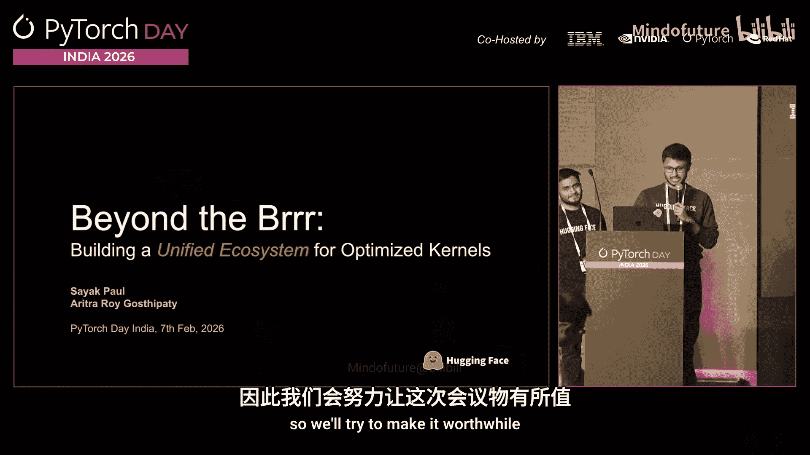

## 概述
在本节课程中，我们将学习 Hugging Face 如何围绕优化内核构建一个统一的生态系统。我们将探讨深度学习效率的构成、自定义内核的挑战，以及 Hugging Face 的 `kernels` 包如何通过提供标准化的构建、分发和使用流程来解决这些问题。最后，我们将通过一个案例研究，展示如何在实际模型中使用这些内核来提升性能。

---

## 深度学习效率的构成

在深入探讨优化内核之前，我们首先需要理解深度学习效率由哪些部分组成。这有助于我们明确优化的目标。

深度学习效率主要包含三个部分：
1.  **计算**：指加速器（如GPU）实际执行浮点运算所花费的时间。
2.  **内存访问**：指在内存层级之间传输张量数据以及所有相关开销所花费的时间。这部分通常是影响效率的主要瓶颈。
3.  **开销**：指在延迟中除计算和内存访问之外的所有额外耗时，通常被称为“开销”。

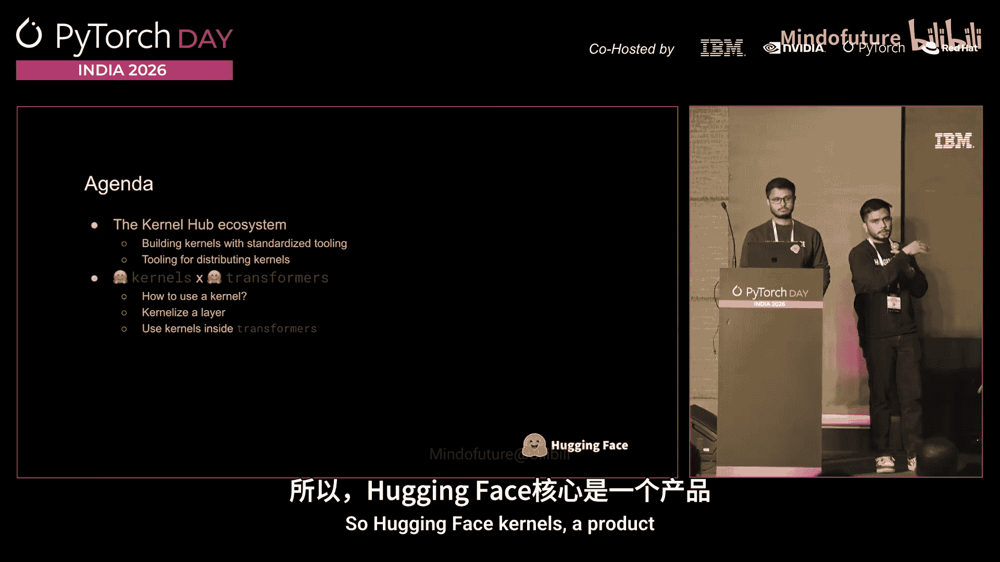

在深度学习中，效率损失的大部分通常来自于**内存访问**。因此，优化内存访问是提升性能的关键。

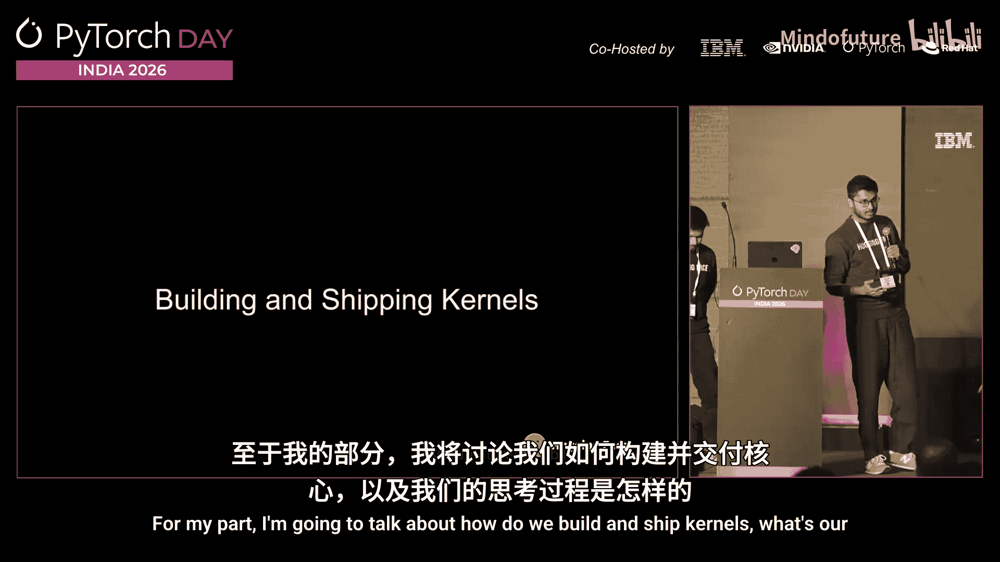

---

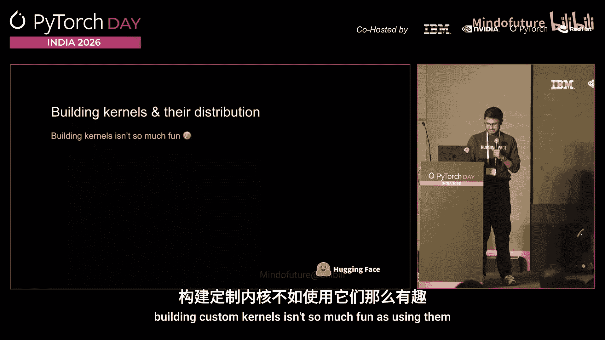

## 优化内核的作用

上一节我们介绍了效率瓶颈，本节我们来看看优化内核如何解决内存访问问题。

优化内核（或自定义内核）是提升GPU效率的一种核心方法。它们主要带来以下好处：
*   **将内存密集型算法转化为计算密集型算法**：通过增加算术强度，让GPU更多地执行计算而非等待数据。
*   **减少通信时间**：优化数据移动路径，降低内存访问延迟。
*   **保持加速器“忙碌”**：通过更高效的任务调度，让GPU持续处于高负载状态，避免空闲。

目前，已有一些优秀的Python包提供了这类优化内核，例如 **Flash Attention** 和 **Thunder Kittens**。

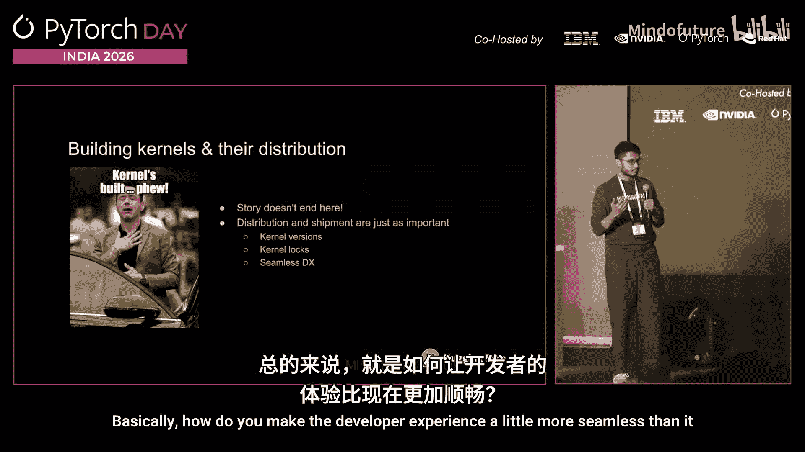

---

## Hugging Face 的愿景：构建内核中心生态系统

了解了优化内核的价值后，Hugging Face 的目标是围绕这些自定义内核构建一个统一的生态系统。这个议程包含两个主要部分：
1.  构建一个名为 **Kernel Hub** 的生态系统，用于内核的构建、分发和管理。
2.  将优化内核与 **Hugging Face Transformers** 库深度集成，让用户能轻松地在流行模型中使用它们。

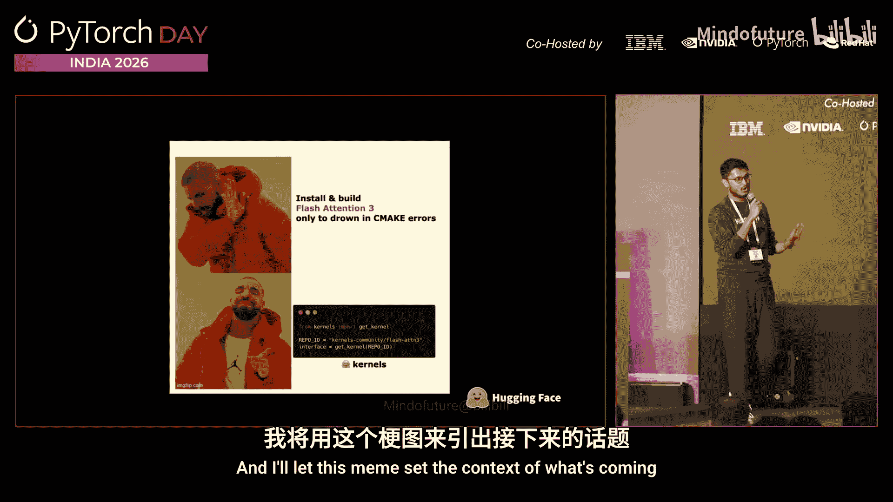

接下来，我们将分别深入这两个部分。

---

## 构建与分发内核：挑战与解决方案

首先，我们来探讨构建和分发自定义内核时面临的挑战，以及 Hugging Face 的解决方案。

### 构建自定义内核的挑战
虽然使用优化内核很有趣（例如通过优化模型获得性能提升），但构建它们的过程却充满挑战：
*   **缺乏统一和可预测的结构**：在编写内核时，需要思考如何组织源代码、Python绑定和PyTorch包装器。
*   **构建工具分散**：开发者可能使用Bazel、CMake、Ninja等多种工具，缺乏统一标准。
*   **漫长的构建时间**：例如，从源码构建Flash Attention 3可能需要很长时间。
*   **庞大的支持矩阵维护**：需要为不同的PyTorch版本、CUDA版本和各种加速器后端（如CUDA, ROCm, Metal）维护兼容性，工作繁重。
*   **分发与版本管理**：构建完成后，还需要考虑二进制文件的发行、版本控制和锁定机制，以提供无缝的开发者体验。

### 解决方案：`kernels` 包
为了解决上述问题，我们引入了 **`kernels`** 包。它的目标是统一整个计算内核的构建工具生态系统。

`kernels` 包主要包含两个核心组件：
1.  **Kernel Builder**：一个基于Ninja的构建系统，负责处理所有与构建和结构标准化相关的工具。
2.  **Kernels（库本身）**：提供内核管理和使用的接口。

该方案旨在实现以下目标：
*   **强制执行统一且可预测的构建结构**。
*   **实现可复现且灵活的构建**。
*   **确保与PyTorch的原生兼容性**。
*   **提供一种简单的方式与社区分享预构建的二进制文件**。

### 统一的结构与广泛的支持
`kernels` 包强制所有通过它分发的内核遵循统一的目录结构。这使添加对新后端（如非CUDA后端）的支持变得有章可循。

同时，它支持广泛的硬件和软件环境矩阵，包括：
*   **加速器后端**：CPU, CUDA, ROCm, Metal, XPU等。
*   **软件版本**：不同的PyTorch版本、CUDA计算能力等。

对于已经存在的流行内核（如Flash Attention 2/3、GPOS Metal Kernels），Hugging Face 维护了一个**标准化内核兼容源代码**的单体仓库。这个仓库：
*   提供了重构后的、符合`kernels`生态标准的源代码。
*   包含全面的测试以确保输出无误。
*   提供基准测试以验证性能无退化。
*   会与上游仓库同步更新（例如，当某个内核添加了`torch.compile`兼容性支持时）。

### Kernel Hub 生态系统
我们正在构建一个 **Kernel Hub** 生态系统。许多在自定义内核领域知名的贡献者（例如Red Hat）已经参与其中。多家公司也在此维护他们自己的预构建二进制文件。这形成了一个协作的内核中心。

---

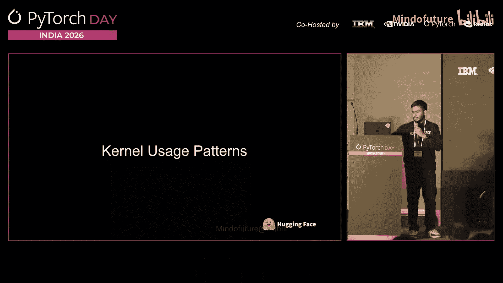

## 使用内核优化模型

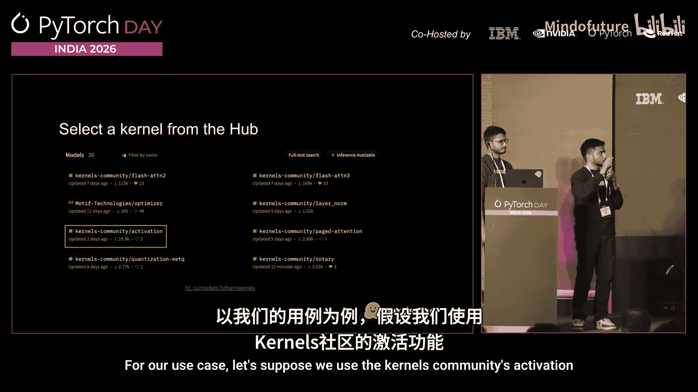

上一节我们介绍了如何构建和获取内核，本节我们来看看如何在实际中使用它们来优化模型。

使用 Hugging Face Kernel Hub 中的内核非常简单，流程如下：

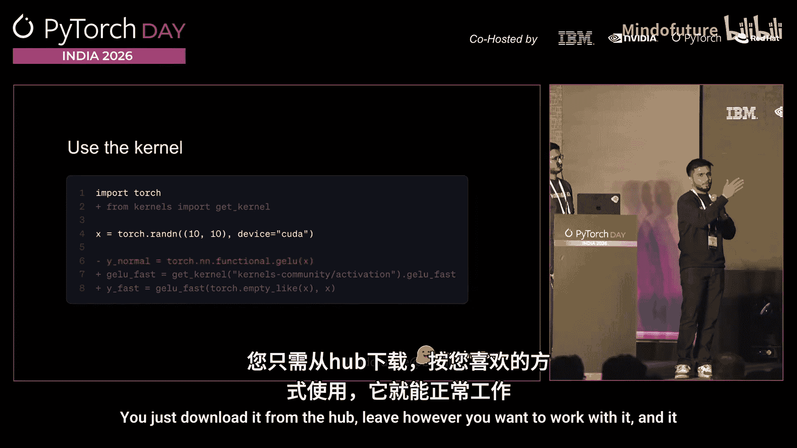

### 1. 查找并下载内核
就像使用Hugging Face上的模型或数据集一样，你可以到Hub上搜索所需的内核。例如，我们可以查找并选择 `kernels-community` 提供的 `activation` 内核。

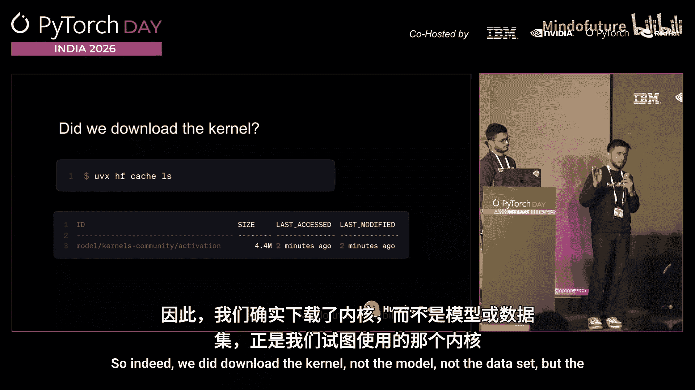

在Hub页面上，系统会明确标记出与你的当前环境（如PyTorch版本、CUDA版本）**兼容**的内核，通常以绿色对勾显示。

下载和使用内核只需两行代码：
```python
from kernels import get_kernel

# 获取并使用内核
kernel = get_kernel(“org/repo-name”)
# 或者，直接下载并作为Python函数使用
```
这个过程无需编译，开箱即用。

### 2. 验证内核使用
为了建立信任，我们可以检查Hugging Face缓存。执行缓存列表命令后，你不仅能看到模型，还能看到已下载的内核文件（如 `activation` 内核），这证实了内核确实被下载并准备就绪。

### 3. 替换模型层的正向传播
更有趣的是，我们可以用优化内核替换PyTorch模型中某一层的标准前向传播计算。

这通过三个步骤完成：
1.  **装饰**：使用 `@kernelized` 装饰器标记你想要替换的模型层。
2.  **映射**：将该层映射到Kernel Hub上具体的优化内核仓库。
3.  **内核化**：调用 `kernelize` 函数。这个函数会遍历PyTorch计算图，识别被装饰的层，并将其前向传播逻辑替换为指定的优化内核。

完成这三步后，该层的 `.forward()` 调用将使用你提供的优化内核。

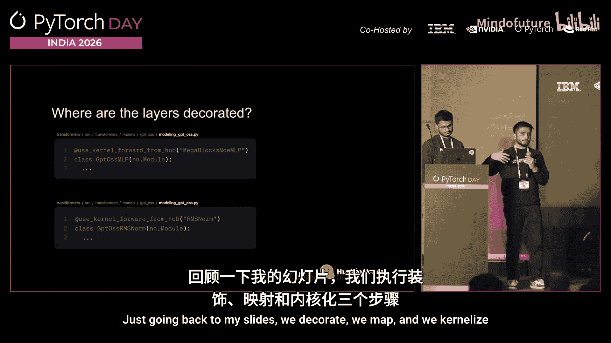

### 4. 在完整模型中使用内核：以GPT-S为例
最后，我们将上述方法应用于一个完整的模型。这里以OpenAI的**GPT-S**系列模型为例进行案例研究。

在Hugging Face Transformers库中使用内核优化模型非常简单：
*   在使用 `from_pretrained` API加载模型时，只需设置一个参数（例如 `use_kernels=True`）即可激活内核优化。
*   激活后，在缓存中可以看到，除了GPT-S模型文件，相关的优化内核（如 `lerp_kernels` 和 `megablocks`）也被自动下载。

在代码层面，这对应了我们之前提到的三个步骤：
1.  **装饰**：在 `modeling_gpt_s.py` 中，用 `@kernelized` 装饰需要优化的层。
2.  **映射**：在Hub上配置好层与内核的映射关系。
3.  **内核化**：在模型初始化逻辑中调用 `kernelize` 函数。

### 5. 性能基准测试
理论需要实践验证。以下是使用内核优化前后的性能对比（以吞吐量为指标，数值越低越好）：
*   **无内核 vs. 有内核**：在A100 GPU上，随着批次大小增加，使用内核（蓝色柱）能维持稳定的新token生成吞吐量，而未使用内核（红色柱）的性能则急剧下降。
*   **Flash Attention 3 效果**：在处理长序列（如4K, 8K前缀token）时，不使用Flash Attention内核无法获得良好的吞吐量，而使用Flash Attention 3则能显著提升性能。

在Transformers中启用Flash Attention 3同样简便，只需在 `from_pretrained` 时指定 `attn_implementation=”flash_attention_3″` 参数即可。

---

## 总结与资源

本节课我们一起学习了 Hugging Face 为优化内核构建统一生态系统的努力。我们回顾了：
1.  深度学习效率的瓶颈在于内存访问。
2.  优化内核通过提高算术强度和优化数据移动来提升效率。
3.  构建和分发自定义内核面临结构、工具、兼容性和分发等多重挑战。
4.  Hugging Face 的 `kernels` 包通过提供统一的构建系统、标准化的结构以及 Kernel Hub 生态系统来解决这些挑战。
5.  我们可以轻松地从 Hub 下载内核，并通过装饰、映射、内核化三个步骤将其集成到 PyTorch 模型层乃至完整模型中，从而显著提升推理性能。

如果你对参与内核开发或使用 Kernel Hub 感兴趣，可以参考我们提供的资源。我们鼓励社区一起让自定义内核的开发和使用体验变得更加顺畅和令人兴奋。

---

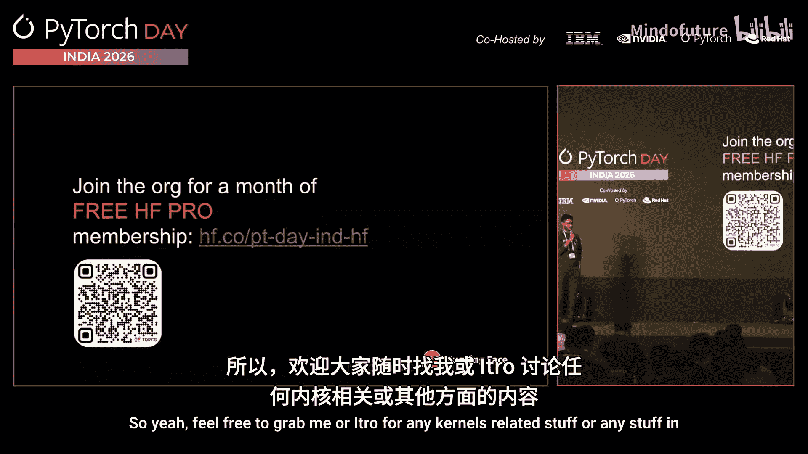

**（注：文中的二维码及幻灯片链接因文本格式已省略，请参考原视频或幻灯片获取。）**