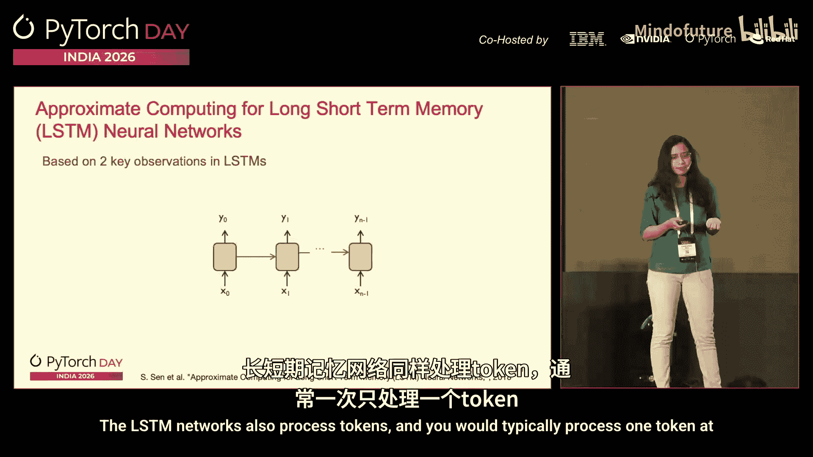
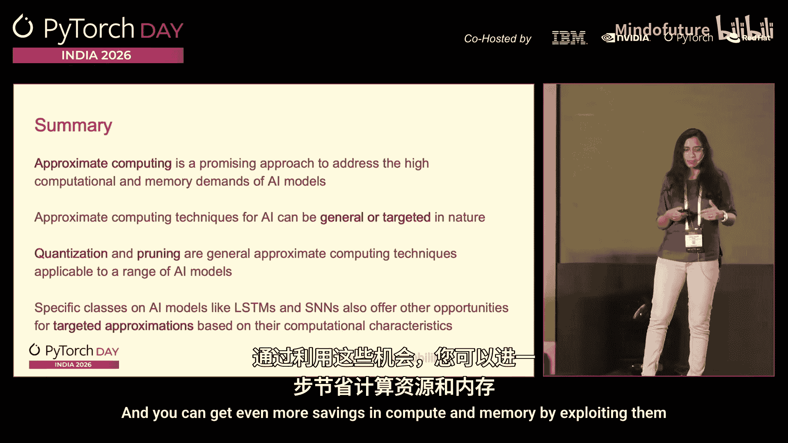

# 012：通过近似计算实现高效AI

在本节课程中，我们将探讨一种名为“近似计算”的技术，它旨在通过利用AI应用内在的容错性，来降低其计算和内存需求，从而构建运行更快、更高效的AI系统。

## 背景：AI模型日益增长的计算与内存需求

回顾自2012年AlexNet引发深度学习革命以来，AI模型对计算资源的需求呈现出明显的上升趋势。下图展示了这一点，其中Y轴表示评估一个模型所需的浮点运算次数，X轴表示时间演进，各个点代表不同的深度学习模型。

从图中可以看出两个关键点：首先，模型所需的计算量（浮点运算）持续增长；其次，颜色较浅（代表更高精度）的模型往往需要更多的计算。这表明，提升AI模型性能通常伴随着计算需求的增加。

与此同时，AI模型的内存需求也在急剧增长。下图展示了模型参数量（即权重大小）随时间的变化，这直接反映了内存需求。

图中显示，模型大小的增长速度远超硬件内存容量的提升速度。因此，为了持续构建高效、可扩展的AI系统，我们需要新的方法来应对这些日益增长的计算和内存需求。

## 什么是近似计算？

近似计算是一种设计范式，它通过利用某些应用固有的容错性，来减少其计算和内存需求，从而同时获得性能和能效上的收益。

为什么AI应用具有这种容错性呢？我们可以通过一个图像识别神经网络的例子来说明。假设一个模型被训练来区分猫和狗，其输出是图像属于“猫”或“狗”类别的概率，概率最高的类别即为识别结果。

我们观察到，即使模型在计算中间结果时出现一些错误或不精确，只要最终的概率排序和阈值判断没有改变，模型的输出类别就可能保持不变。例如，虽然“猫”的概率值可能因计算误差而略有变化，但只要它仍然高于“狗”的概率，最终的分类结果就依然是“猫”。这种特性使得我们可以在不显著影响最终准确率的前提下，以不精确的方式执行部分底层计算，而这正是近似计算所利用的核心思想。

## 近似计算技术概览

针对AI的近似计算技术可以应用于硬件-软件栈的各个层级，从算法/应用层一直到硬件数字逻辑层。

在本节中，我们将这些技术分为两大类进行介绍：通用近似计算技术和针对性近似计算技术。

## 通用近似计算技术

通用近似计算技术指的是一套广泛适用的方法，几乎可以应用于所有类型的AI模型，例如卷积神经网络、Transformer网络、扩散模型等。这类技术的典型代表是**量化**和**剪枝**。

### 量化

量化技术旨在降低AI模型中数据（如权重、激活值、误差等）的表示精度，从而减少内存占用和计算开销。

传统上，AI模型中的数据通常以高精度格式存储，例如IEEE 754标准的32位浮点数。量化则使用少于32位的数值来表示这些数据。

**核心公式**：`原始32位浮点数 (FP32) -> 量化后的低位宽表示 (如 BF16, INT8)`

例如，使用BF16（16位脑浮点数）格式可以将内存和计算成本直接降低2倍。更进一步，可以使用整数表示（如INT8）。整数运算相比浮点运算通常具有更低的计算成本。

然而，量化必然会导致信息损失，因为无法在低精度下精确表示原始的所有值。这相当于将一个范围内的值映射（或近似）为单个值。

该领域的主要挑战在于：如何设计量化方案，在最小化对模型质量影响的前提下实现量化。研究人员已经探索了多种新颖的量化方案和格式。例如，在之前的课程中详细讨论过的**NF4**格式，就是为了在大型语言模型背景下，实现量化同时最小化精度损失的一种尝试。

需要特别注意的一点是，并非所有硬件平台都能原生支持这些低精度计算。例如，CPU可能不支持NF4这样的特定格式。因此，在执行这些低精度AI模型时，通常需要硬件和软件的协同优化。这也是当前研究的一个重点方向，特别是在新兴AI模型的背景下探索新的量化方案或格式。

### 剪枝

剪枝技术的目标是在AI模型的各类数据结构（如权重、误差、激活值）中引入零值，从而创造稀疏性。

**核心概念**：将一个密集的张量（如权重矩阵）中的一部分值置为零，使其变得稀疏。

剪枝之所以重要，原因有二：
1.  **减少计算需求**：AI模型中的核心操作之一是乘加运算（`y = x * w + b`）。当权重`w`或输入`x`为零时，整个乘加操作变得冗余，可以被跳过。
2.  **减少内存需求**：稀疏的数据结构可以用更紧凑的格式存储，从而加快内存访问速度。

与量化类似，剪枝面临的主要挑战也是：如何以对模型质量影响最小的方式进行剪枝。这可能涉及一种或多种数据结构，例如权重、KV缓存等。此外，当从传统AI模型转向更新型的模型时，也会出现新的挑战。

## 针对性近似计算技术

上一节我们介绍了适用于所有AI模型的通用近似计算技术。本节中，我们将目光转向更具针对性的方法。

针对性近似计算技术基于不同类别AI模型独特的计算特性，识别出特定的近似计算机会。下面我将通过我过去研究中的两个例子来说明：针对长短期记忆网络和脉冲神经网络的近似计算。

### 针对长短期记忆网络的近似计算

长短期记忆网络是当今大型语言模型的前身。在之前的语音识别课程中曾提到，循环神经网络是语音识别的初始方法之一。LSTM网络按顺序处理输入令牌（如句子中的单词）。

我们发现，LSTM网络在计算过程中会产生许多数值极小的中间结果，这些结果对最终输出的贡献微乎其微。基于这一观察，我们提出了一种技术：**动态地跳过那些产生微不足道结果的LSTM单元计算**。

**核心思路**：在运行时监控中间值的大小，如果某个LSTM单元的输出值低于一个动态调整的阈值，则在后续时间步中跳过该单元的计算。实验表明，这种方法可以在几乎不影响模型准确率的情况下，显著减少计算量。

### 针对脉冲神经网络的近似计算

脉冲神经网络是一种受生物神经元启发的模型，它通过离散的“脉冲”进行通信，具有事件驱动的特性，因而在能效方面有巨大潜力。

在SNN中，我们提出了**动态神经元近似**的概念。每个神经元都被赋予一个“近似等级”，该等级决定了其活跃的输入和输出连接的比例。

**核心思路**：基于连接的权重，始终优先停用权重较低的连接。在运行时，从所有神经元处于最高近似等级开始。随着时间推移，根据网络活动，将某些神经元调整到更低的近似等级（即停用更多连接）。这样，脉冲只沿着活跃的连接传播，沿非活跃连接的更新则被跳过。

这个过程持续进行，直到输出层仅剩单个活跃神经元（指示获胜类别），或者执行结束。这种方法在专为SNN设计的硬件加速器上，实现了**1.4倍至5.5倍**的脉冲操作减少，以及**1.2倍至3.6倍**的能耗降低，在服务器端整体获得了约**1.3倍至3.9倍**的加速。

## 总结

本节课我们一起学习了近似计算技术。近似计算是应对AI模型高计算和高内存需求的一种有效方法。它主要分为两类：
1.  **通用近似计算技术**：如量化和剪枝，适用于广泛的AI模型，通过降低数据精度或引入稀疏性来提升效率。
2.  **针对性近似计算技术**：通过深入理解特定类别AI模型的计算行为，发掘其独有的近似机会，从而获得更大的计算和内存节省。

总而言之，近似计算通过巧妙利用AI的容错性，为构建下一代高效、可扩展的AI系统提供了关键的技术路径。

