# 013：探索基于瓦片的编程抽象用于KLA的图像处理

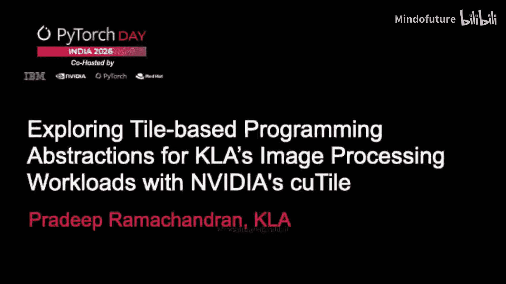

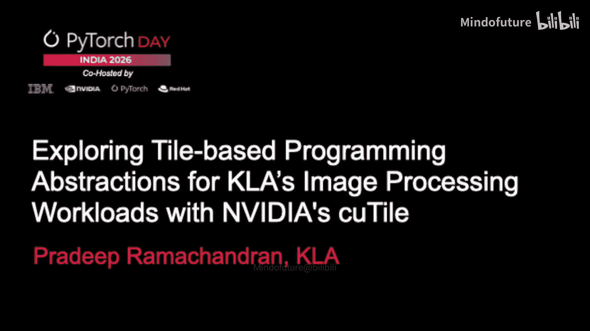

## 概述

在本节课程中，我们将探讨半导体工艺控制的基本概念，了解KLA公司在此领域的作用，并深入研究其数据处理栈。课程的核心将聚焦于一种名为“基于瓦片”的编程抽象，特别是NVIDIA新发布的Kutile语言，并分析它如何帮助我们在图像处理任务中平衡性能与开发效率。

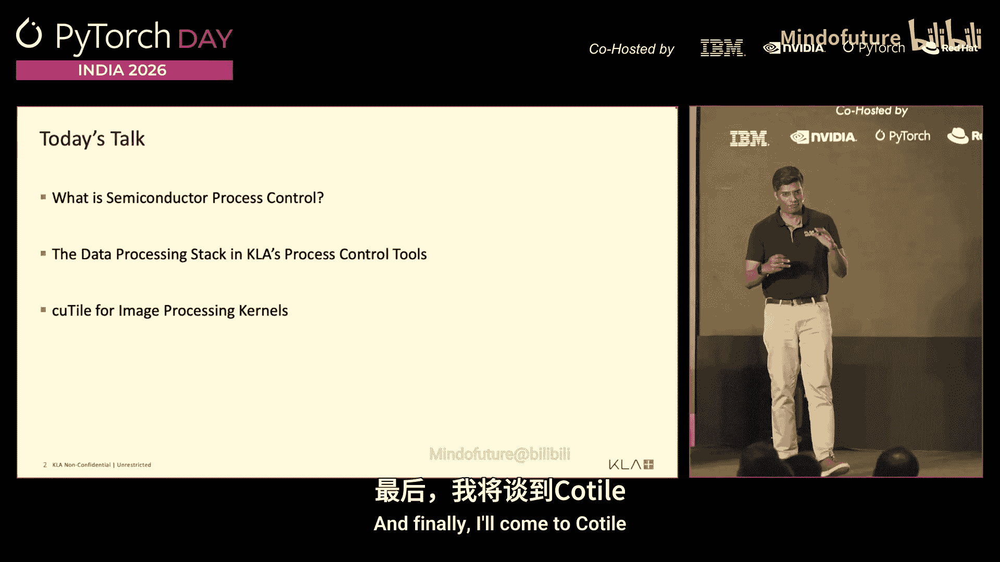

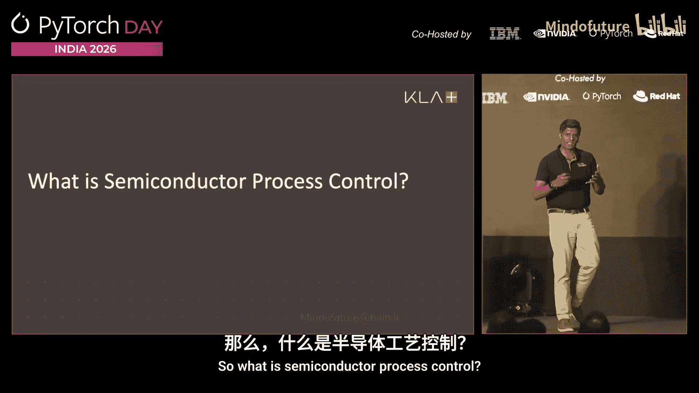

## 什么是半导体工艺控制？

上一节我们介绍了课程的整体框架，本节中我们来看看半导体工艺控制的具体含义。

许多人都参与芯片设计。我也曾是一名芯片设计师。但我们没有意识到的是，当我们完成芯片设计并将其送往晶圆厂后，从这一步到最终拿回芯片之间，存在着一个极其复杂的世界。

左侧是当今晶体管的样子。这是一个环绕栅极晶体管的示意图，它是用于驱动我的Mac和你们许多笔记本电脑的3纳米芯片的基本构建单元。这个结构的横截面大约为10到20纳米。人类头发的横截面是10000纳米。请思考这个尺度。

制造商试图在约20纳米的尺度上绘制或构建这个结构。这仅仅是晶体管的基本单元。中间是3D NAND的构建单元，它是构建你们所有128GB或1TB手机存储的组件。在图形中绘制它已经很困难，想象一下在100纳米的横截面上绘制它。最后一个是所谓的掩模版，做过摄影的人会知道，这是在实际制造芯片之前，电路被转换成的“底片”。其横截面约为100纳米。

我希望以上内容能让大家相信，这些都是相当复杂的几何结构，其复杂性不仅在于构建困难，还在于耗时极长。这里的示意图展示了构建单个环绕栅极晶体管所涉及的各种工艺步骤。这个过程需要三到六个月的时间。只有在整个流程完成后，才能进行电气测试。

想象一下，如果在基础层出现错误，那么制造的每一个芯片、每一个晶体管都将无法工作。投入数百亿美元建造的工厂将无法生产出可用的芯片。KLA所做的是制造所谓的工艺控制工具。这些是大型机器，大约有本讲台四分之一大小。它们使我们能够在能够进行电气测试之前，及早识别缺陷。

这是一个信息物理系统。用于在晶圆制造过程中对其成像并处理该图像的所有设备都包含在这个物理系统内部。与你们所有人在数据中心使用那些出色的GB200芯片构建和使用云服务不同，我们的世界非常不同，因为一切都物理地封装在机器内部。

我们使用光学中的照明源，这涉及一系列有趣的物理技术。我们拥有高速传感器，以每秒约50千兆字节的速率收集数据。这相当于一次操作中产生约4PB的数据。全球所有Facebook用户一天生成4EB数据。而这只是一台工具在一次会话中生成4PB数据。我们使用物理位于这些机器内部的图像数据处理流水线来处理所有这些数据。

因此，当我谈到运行大数据时，我指的是真正在这个物理系统内部运行非常大的数据。

我们用它来做两件事。我们进行所谓的“检测”，即实际寻找缺陷。顶部的图像实际上是扫描电子显微镜图像。每张图像的横截面大约为50 x 150纳米。再次强调尺度：头发的横截面是10000纳米。这是50 x 150纳米。我试图找到像那样的缺陷。如果有人能在右下角找到缺陷，今晚我请喝啤酒。我们试图发现的是非常精细的问题。

另一方面，我们也制造称为“量测”系统的设备。这些系统利用光来实际测量晶体管的关键尺寸。再次强调，当我学习电气工程时，关键尺寸是源极和漏极之间的距离。但今天的晶体管有大约25到30个关键尺寸，需要精确到埃米级，晶体管才能正常工作。我们使用光和成像技术来测量这些尺寸。

在制造过程中同时进行这两个步骤非常重要。因为如果找不到缺陷，就无法修复。如果无法测量，就无法控制。之所以称为工艺控制，是因为今天的制造实际上是一个近似操作。你会看到这里的直线不再真正笔直，这是由于量子效应。我们使用光进行制造，其波长接近试图制造的结构的实际尺寸。因此，当你试图绘制一条直线时，它会是锯齿状的。但如果这种锯齿状在一定控制范围内，晶体管仍然可以工作。因此，我们的工具进行所谓的工艺控制。

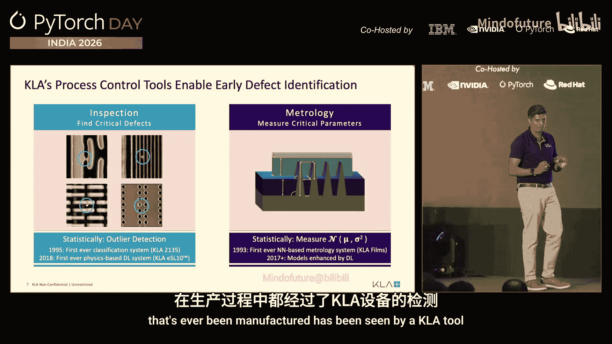

从统计学上讲，这归结为更多的数学。我们在检测工具上所做的工作称为异常值分析。我们找到均值和标准差，并试图找出异常值：1西格玛、2西格玛、3西格玛工具。我们在这方面进行深度学习已经很久了。以前我们不能称之为深度学习，因为这不是一个时髦或好听的词，但现在我可以说我们一直在做深度学习。在量测方面，仍然是统计学的，只不过目标不是测量标准差，而是真正测量均值。我想确保均值在控制范围内，这样我制造的器件才能正常工作。

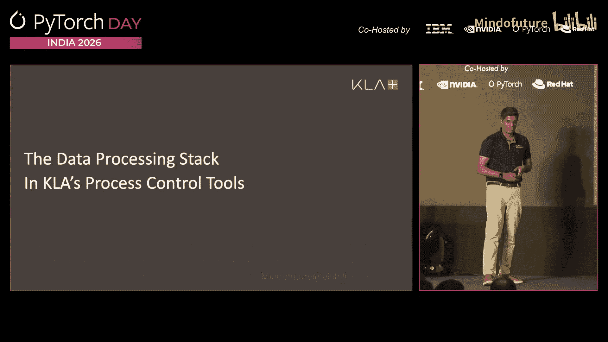

我之前说过会说服你们，我们影响着每一个被制造的器件。我们为制造过程中的几乎每一步制造这些机器，从未加工的硅片开始，一直到可以运出进行电气测试的印刷电路板。在工艺的某些步骤中，只有KLA制造工具。因此，字面上每一个曾经被制造的电子器件都曾被KLA的工具“看过”。

所以我的遥控器、你们用来刷Instagram的手机，都受到我们部署的系统的影响。现在，让我们谈谈数据处理，以及我们最终在哪里使用高性能计算和人工智能。

## 数据处理栈与计算挑战

上一节我们了解了KLA在半导体制造中的关键作用，本节中我们将深入其数据处理栈和面临的计算挑战。

如前所述，处理栈从我们的光学系统开始。我们使用波长从200到1000纳米的光学系统。我们还有分辨率更高（1纳米）的扫描电子显微镜。我们还拥有收集数据的高速传感器。数据处理始于位于我们工具内部的超级计算机。这些是CPU和GPU集群，我们称之为“区域计算机”。它们接收原始输入，这只是传感器数据，是不同波长的响应。

然后我们进行所谓的“光学检测”。这是一个光学图像的例子。如果你觉得分辨率看起来很差，看不清，实际上它看起来就是这样。如果我用扫描电子显微镜拍摄同一图像，你实际上可以看到结构。但我的目标是尝试使用光学检测，它比SEM快大约一千倍，来发现缺陷。

最后，当光学检测算法指出存在缺陷时，我们会将这些缺陷位置输出，然后使用SEM去复查那是否真的是缺陷。你希望它是个缺陷，并且它确实是个缺陷。然后我们以某种形式向工艺工程师提供信息，以改进工艺。本质上，工作负载非常简单：获取图像、处理图像、提供信息。三个步骤：图像处理。你可以猜到，图像处理是我们做了50年的事情。今天，图像处理算法得到了人工智能的增强，并可能用于我们的工具内部。

这看起来几乎像教科书的一章或目录，但事实确实如此。我们在工具中研究使用的算法涵盖了从随机森林等基本机器学习模型，到自编码器、像素CNN、物理空间机器学习等。这些都是我们研究用于增强现有图像处理算法的技术。但我不打算讨论这个，我将更多地关注计算方面。

当我们查看计算栈时，在计算的各个阶段，我使用不同类型的加速器。一方面，当我从传感器收集输入时，我进行实时或近实时处理。当我进行光学检测并开始运行检测算法时，我进行更多的批处理或吞吐量计算。当我进行SEM验证时，我有少量需要验证的结构或位置，数据更具结构性，但仍然是批处理。在每一步中，我都使用不同类型的加速器来完成工作。

因此，当我们查看算法时，我们通过一个称为“光速”的模型来指导算法的部署。光速模型是一个非常分析性、非常直观的模型，你将一个由计算操作和内存操作组成的工作负载，转换为该操作应该花费的时间。你必须根据计算吞吐量或内存吞吐量来计算时间。根据你处于延迟用例还是吞吐量用例，你将光速计算为计算时间和内存时间的总和或最大值。

事实上，我们尝试过这个指标，并与包括屋顶线分析在内的许多其他指标进行比较，以衡量预期的光速。我们发现这个指标非常强大。它非常基础，但仍然非常强大，因为你不根据实现方式来“着色”光速。屋顶线分析的问题在于它已经被你的实现方式着色了。如果你做了非常糟糕的分解，你预测的屋顶线也会非常糟糕。因此，这个模型能更好地指导我们。

我们真正从光速分析开始，我们首先问一个问题：如果我使用我称之为“GPU原生语言”的低级语言（接近GPU），我能否真正达到光速性能？我们当然从这里开始。社区已经做了很多工作，希望你能用PyTorch编写代码并获得这种性能。我看到这里坐着很多研究这个问题的编译器专家。但我们说，让我们深入底层，接触硬件，看看CUDA、HIP、DPC++，看看内核的运行时以及包括IO传输在内的总运行时，与预测时间（顺序执行，即你的延迟用例，或并行执行，即你的吞吐量用例）相比如何。

我们在几年前SIGGRAPH上发表的一篇论文中发现，根据GPU以及软件和硬件的组合，你实际上可能得到非常不同的运行时特性，以及你距离光速有多近。这当然让我们相信，协同设计软件和硬件是实现良好性能的一个非常重要的抽象。因此，我们开始寻找能够进行接近金属编程的方法。

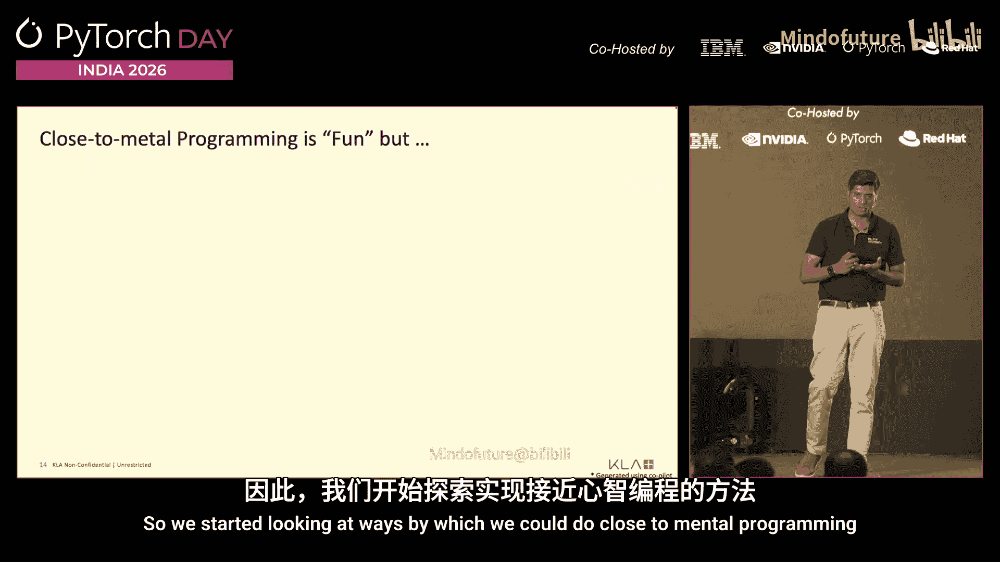

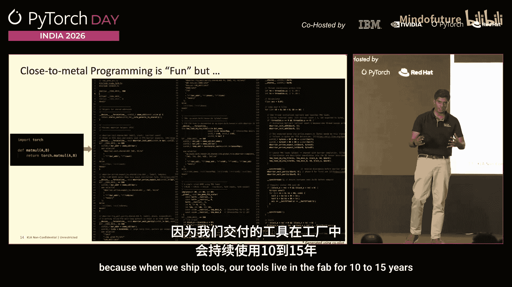

接近金属编程很有趣，但如果你看看Torch，这只是一个矩阵乘法，那是矩阵乘法的CUDA代码。如果你能从最后一行读懂代码，我再请你喝一杯啤酒。这是185行代码，用来表示三行Torch代码。所以这是不可持续的。这正变得越来越复杂，这对我们KLA来说尤其重要，因为当我们交付工具时，我们的工具会在晶圆厂中运行10到15年。我们需要支付工程师工资，让他们在10到15年内去调试工具和软件。如果那是他们必须调试的代码，我想他们不会再为我工作了。所以我必须找到一个更好的方法来解决这个问题。

## 基于瓦片的编程抽象与Kutile

上一节我们探讨了接近金属编程的复杂性，本节中我们来看看基于瓦片的编程抽象，特别是Kutile语言，如何提供一种平衡方案。

基于块的抽象对我们来说非常令人兴奋，因为它实际上是一种介于两者之间的抽象：一端是像PyTorch这样的高级模型所关注的整个图像级别，另一端是像CUDA这样的模型所关注的线程级别。基于块（或瓦片）的模型特别令人兴奋，因为应用工程师负责将网格转换为块，而编译器则负责将块编译为特定硬件工作负载的问题。

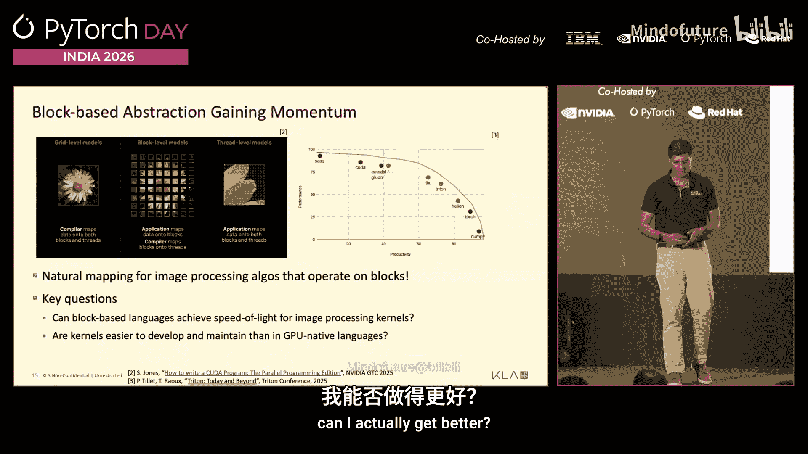

右侧的图表来自最近Triton会议上Philip的演讲，他展示了现在有很多编程语言可以帮助你在性能和生产力之间取得平衡。左上角是SASS，即NVIDIA GPU的低级汇编编程；右下角是NumPy，给你最好的生产力，但最差的性能。中间有很多停靠点，取决于什么对你来说最有趣。

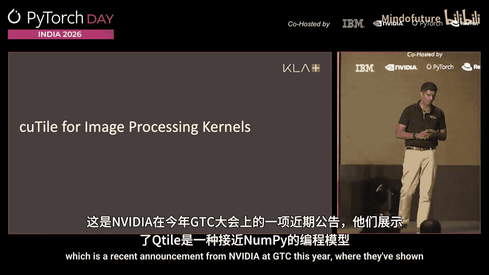

这对我们来说尤其令人兴奋，因为图像自然映射到这种基于块的模型。你自然地在图像块上操作，而块具有某些约束和语义。所以图像实际上工作得很好。因此我们问了两个问题。第一个问题：基于块的语言能否为图像处理模型达到光速？我们再次回到光速，说那就是我想要达到的目标。基于块的程序能帮助我吗？第二个问题，既然动机是不写那190或160行代码的内核，我能否真正获得更好的效果？我能否更容易地开发？我能否更容易地维护它？

因此，我们研究了不同的语言。这里我将讨论Kutile，这是NVIDIA在今年GTC上发布的一个新语言，他们展示了Kutile是一种接近NumPy的编程模型。这是一个用NumPy编写的softmax核函数的简单定义。你只需取不同的区域，使用`np.max`、`np.exp`等。转换为Kutile是一个非常简单的转换。你只需要引入`ct.load`来加载瓦片，`ct.store`来存储瓦片。除此之外，Kutile完全扩展了NumPy，可以使用，并能提供非常好的性能。

Kutile另一个让我们非常兴奋的有趣部分是，Triton IR实际上被原生嵌入到CUDA中，以实现可移植性。因此，Triton IR成为与PTX类似的一级虚拟ISA。从Triton方言到SASS的转换实际上由MLIR编译器处理。

从内核开发者的角度来看，另一个让我们特别兴奋的部分是，你可以选择停留在块级别，或者下降到线程级别，或者随时回到块级别。Kutile内核和CUDA C++内核可以互相调用。据我们了解，这在第一个版本中尚未提供，但我们认为这将是Kutile带来的一个非常强大的范式。

我们一直在评估这个。鉴于时间关系，我不打算深入细节，但我们的一些早期结果非常有希望。这里我在Y轴上展示了不同滤波器相对于该特定滤波器光速的相对性能。1.0意味着达到了光速。任何小于1.0的都无法达到1.0，因为那是终极目标。你可以接近，但如果超过1.0，那是内核中的错误。幸运的是，没有超过的。所以你越接近1.0越好。对于一些内核，如2D插值，我们实际上用Kutile内核非常接近光速。对于不同的内核，取决于半径和实现，有时你无法真正达到，但从早期实现来看，这尤其令人兴奋，因为它不仅达到了，而且代码行数还少了一半以上，这是目前最令人兴奋的事情。

在右侧，你可以看到高斯滤波器，它像一个300行的CUDA内核，我可以用不到100行代码编写，并且能达到接近80%的性能。同样，3D插值，我几乎能达到光速，代码行数大约是50%。因此，Kutile成为一个非常有趣的角度，例如，如果你不想在CUDA或低级编程语言中编写所有内容，你可以在更高的抽象级别上编写。基于块的编程可能令人兴奋，开发起来也容易得多。如果存在组合性，你可以在块级别和线程级别之间工作，你实际上可以在它们之间切换，这对你的工作来说将成为一个非常强大的范式。

关于编程体验的一些快速说明。使用Kutile的编程体验非常有趣。一个很大的优势是，由于它是基于数组的索引，我不必做所有容易引入很多bug的指针运算。当然，对于CUDA代码和Sonnet 4.5、4.6，我不知道是否仍然适用，它是否会出错，但我会出错。而使用基于数组的编程，用Kutile就容易多了。我们看到的另一个大优势是，像TMA这样的硬件结构会自动映射，这是一个非常强大的结构。我们还可以提取不同的子瓦片以便于编程。

也存在一些挑战和限制。我认为其中一些可能在未来得到解决。我们今天有2的幂次方的限制。它只适用于尺寸是2的幂次方的瓦片。并非我们所有的结构都符合2的幂次方，所以这成为一个挑战。我们希望能够以MLIR格式转储并查看MLIR源代码，但这尚不可用。最后一点，我认为不会发布的是，从Triton IR到CUDA的编译器实际上是闭源的。这是一个闭源编译器。了解实际的转换过程有助于生成更好的代码，但这是一个限制。

我们今年在GTC上有一个更详细的演讲。鉴于时间关系，我只想指出这一点。在那里，我们将更详细地介绍Kutile，以及我们在评估Triton和Kutile方面的经验，以及它们之间的比较。

## 总结

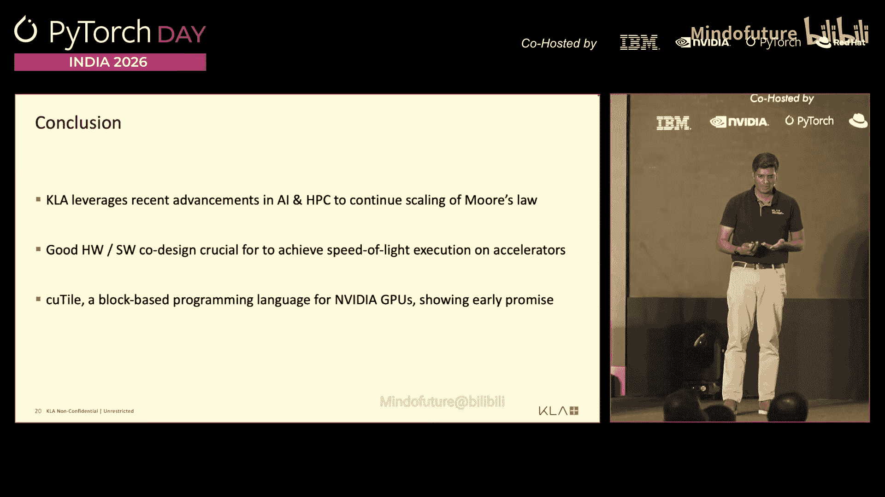

在本节课中，我们一起学习了半导体工艺控制的基础知识，了解了KLA如何通过其检测和量测系统影响每一个电子器件的制造。我们深入探讨了其庞大的数据处理栈和面临的计算挑战，特别是接近金属编程的复杂性。最后，我们重点介绍了基于瓦片的编程抽象，并以NVIDIA的Kutile语言为例，展示了它如何在图像处理任务中，以更少的代码量实现接近理论“光速”的性能，从而在开发效率和运行效率之间取得良好平衡。协同设计软件和硬件至关重要，而像Kutile这样的高级抽象为高性能计算应用开发提供了新的可能性。