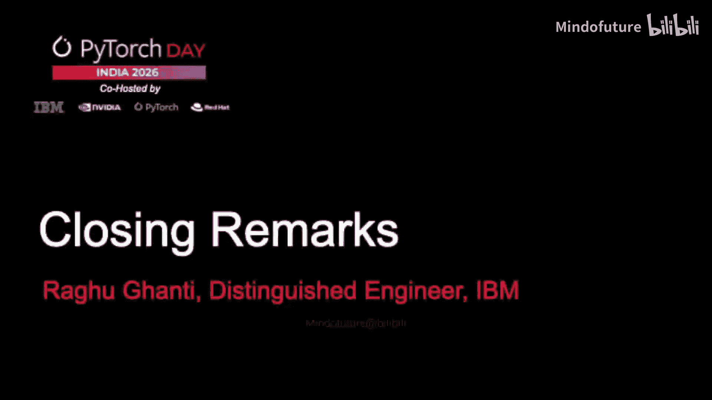
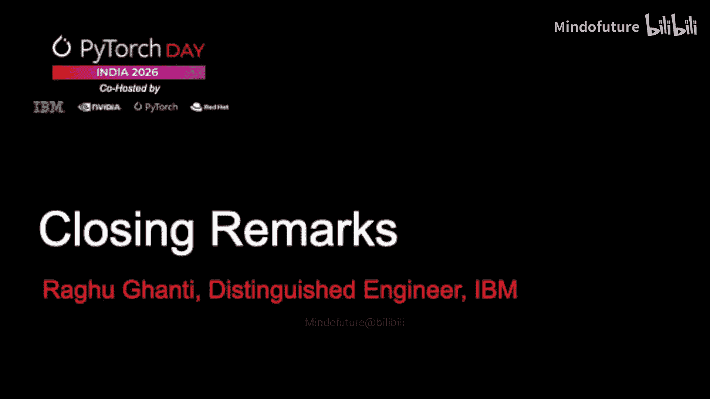

# 015：闭幕致辞与活动组织

在本节课中，我们将学习如何组织一场成功的开发者大会，并了解其背后的关键要素。我们将通过分析一段闭幕致辞，来总结活动成功的要点。

---

多么精彩的一天，而且它尚未结束。

接下来还有社交聚会，大家可以自由交流、建立联系。我看到有些人可能已经开始了这个过程。今天是非常棒的一天。正如史蒂夫指出的，我们大约在一个月前才开始筹划，但活动组织得非常顺利。活动门票售罄的事实令人振奋。希望未来我们能举办更多此类活动，规模或许可以更大。这是我们对未来的展望。让我们为所有的演讲者和专题讨论小组成员鼓掌。

最后，需要知道的是，这类活动不会凭空发生。

有许多人在幕后辛勤工作，才使这一切成为可能。

你们之前看到了联合主办人苏希尔和卡维塔，是他们将这一切组织起来。

他们负责寻找场地、确保各项事宜到位、组织所有事务。

整个活动像时钟一样精准运行，甚至可能提前了两分钟。这完全归功于像他们这样的人，当然，还有所有志愿者。

志愿者们确保一切顺利进行，无论是打印胸牌分发给大家，还是处理其他各种事务，都保证了活动的顺畅。

让我们为联合主办人和志愿者们鼓掌。

说到这里，我想我可以宣布闭幕了。有人建议我抛开讲稿，发自内心地讲话。

正如你们所见，我遵从了这个建议，没有使用讲稿。

我们所有人，包括在场的每一位听众和长时间关注活动的人，都完成得非常出色。

这太棒了。非常感谢大家。

---

本节课中，我们一起学习了成功举办技术大会的几个核心要素：**精心的前期策划**、**优秀的演讲者与内容**、**高效的幕后执行团队**（包括组织者和志愿者），以及促进交流的**社交环节**。这些要素共同作用，才能创造出一场“像时钟一样精准运行”的精彩活动。