# 002：OpenCL C语言基础

在本节课中，我们将要学习OpenCL C语言的基础知识。OpenCL C是用于编写在OpenCL设备（如GPU）上运行的代码的语言。它基于C99标准，但为了适应并行计算设备，进行了一些修改和限制。我们将从数据类型、内存区域、向量操作等核心概念开始，逐步构建对OpenCL C的理解。

## 概述与讲师介绍

我是RayiYanuTara，一名并行编程专家，精通C++、OpenCL和Linux。我专注于将OpenCL应用于实际、有趣的软件项目，而不仅仅是研究代码。我开发了OpenCL中间件，旨在简化OpenCL的使用，同时不牺牲效率。我长期从事高性能计算工作，并可以提供算法设计或OpenCL适用性评估等方面的咨询。


OpenCL C并非传统的C99语言，它存在一些差异。例如，OpenCL C中没有函数指针，也不支持递归。函数调用可能会被内联。OpenCL C并非C语言的子集，它包含一些C语言没有的特性，但整体上非常接近。

## OpenCL C是什么？

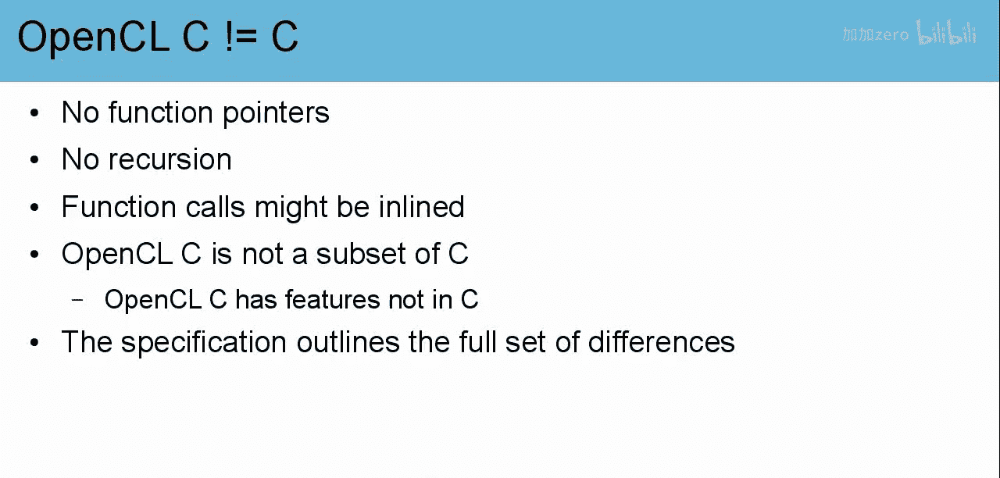

首先，OpenCL C是一种OpenCL设备编程语言。在之前的课程中，我们介绍了OpenCL的设备抽象模型。OpenCL C可以看作是C编程语言的修改版，专门用于在这些设备上编程。

它是OpenCL编程中的主要角色，你将花费大部分时间与OpenCL C代码打交道。它也是OpenCL规范的另一主要部分。规范的大部分内容都致力于定义OpenCL C。你不需要学习所有细节，我将展示它与你已知的C语言非常相似，你可以将规范用作参考。

## 本节内容概览

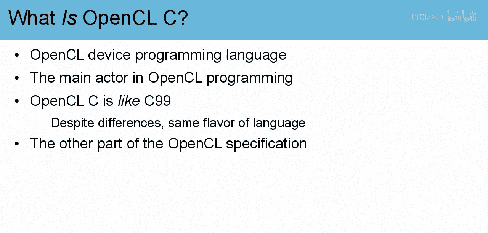

在本视频中，我们将讨论以下主题：
*   类型
*   内存区域
*   向量操作
*   结构体
*   函数
*   内核
我们还将快速浏览一些值得单独一提的主题。我的目标是为你提供足够的背景知识，让你能够立即开始学习OpenCL规范。


## 数据类型


让我们从类型开始。这部分内容应该非常熟悉，我假设你在学习本课程前已经了解C语言。

以下是OpenCL C与C语言在类型上的主要区别：
1.  **具体表示**：OpenCL C提供了具体的数据表示。例如，有符号整数使用二进制补码表示。C语言规范并未规定这一点。
2.  **固定大小**：OpenCL C中的类型具有固定的大小。C语言则不然。
3.  **向量类型和操作**：OpenCL C提供了向量类型和操作，这是C语言所没有的，甚至在C++中也没有优雅的实现。
4.  **图像类型**：OpenCL C提供了图像类型，这是一种不透明类型。你无法直接访问其内存表示，需要使用其他函数从中提取信息。图像是OpenCL C中目前唯一的此类不透明类型。

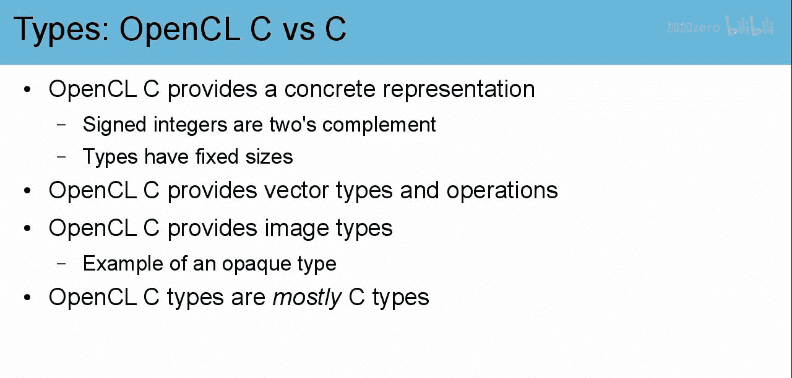

OpenCL C的类型大部分是C语言中的类型。

以下是整型类型：
*   `char`：8位整数
*   `short`：16位整数
*   `int`：32位整数
*   `long`：64位整数
每个类型都有对应的无符号版本（如 `unsigned char`）。有符号整数严格使用二进制补码表示。

一个有用的建议是，创建并使用以下类型定义，这可以确保主机和设备之间的兼容性，稍后你会明白这为什么重要。
```c
typedef int int32_t;
typedef unsigned int uint32_t;
// ... 其他类型定义
```

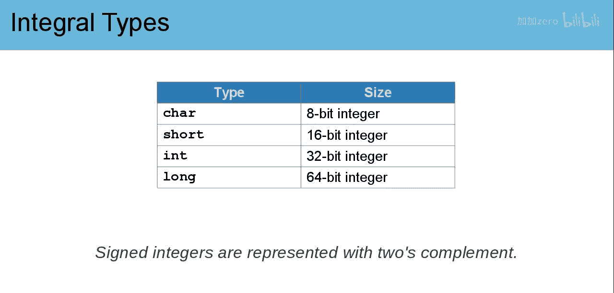

OpenCL C中还有浮点类型：
*   `float`：单精度（32位），遵循IEEE 754标准。
*   `double`：双精度。
*   `half`：半精度，可能在图形处理中有用，但不如其他类型精确。
需要注意的是，`double`和`half`类型可能不被所有设备支持。因此，你需要检查你的设备是否具备相应的能力。

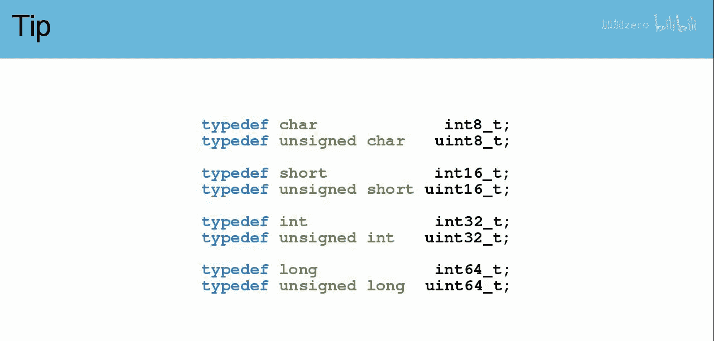

必须警惕主机和设备类型的差异。当谈论OpenCL C整数时，我指的是在设备上运行、有标准表示的东西。

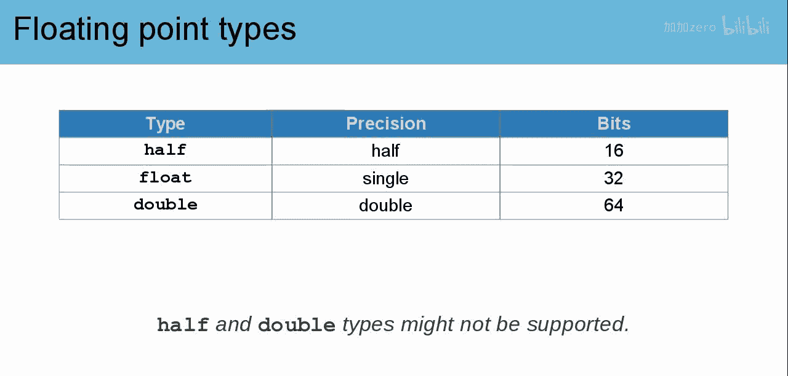

假设在主机程序（C99）中声明了 `int x`，在设备（OpenCL C）中声明了 `int y`。我们能将x的值复制到y吗？答案绝对是**不能**，必须非常小心。在设备上，我们使用32位二进制补码表示整数。在主机上，我们甚至不知道整数的位数和表示方式。因此，在进行主机和设备数据交换时要格外小心。


这并非全是坏消息。在主机标准头文件中，你会看到类似 `cl_float`、`cl_int` 这样的类型定义。这就是中间件或库可以帮助你确保数据传输正确的地方。

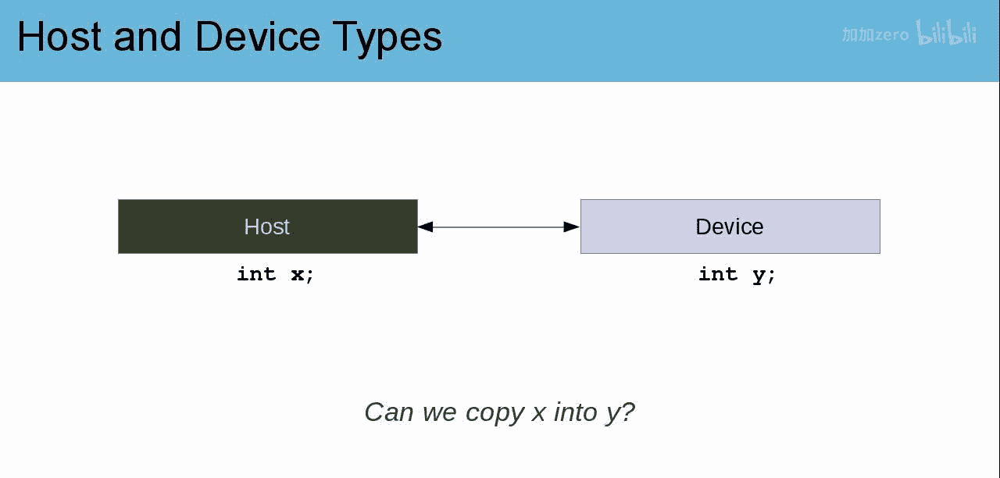


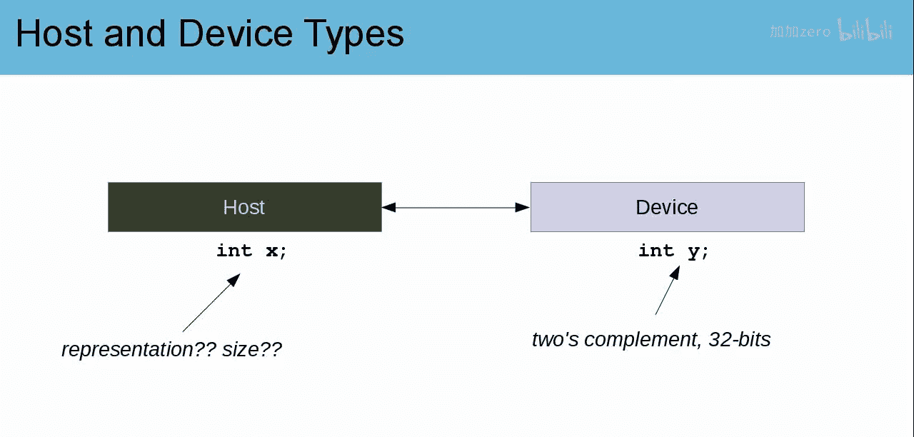

还有一些类型仅限于设备使用。这意味着你无法将它们从主机复制到设备。例如 `bool`、`size_t`、`ptrdiff_t` 等类型。根据C语言规范，它们各有用途，但重要的是你不能在主机和设备之间传输它们。


## 内存区域

我假设你已经完全理解了我之前关于内存模型的讨论。处理单元可以访问称为私有、常量、本地和全局的内存空间。

在OpenCL C语言中，我们有关键字来指定这些内存区域：`__global`、`__local`、`__private`、`__constant`。这些概念现在应该完全熟悉了，你可能还不知道如何应用它们，但你已经知道设备模型包含这些内存区域。

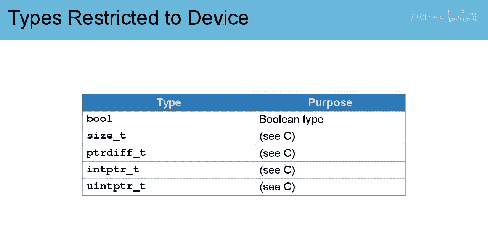

让我们看一个声明示例：
```c
__global int* ptr;
```
首先要认识到，这个关键字指定了内存区域。我们想指向哪里？这个指针应该被视为一个整体：`__global int*` 表示指向全局内存区域中的一个整数。


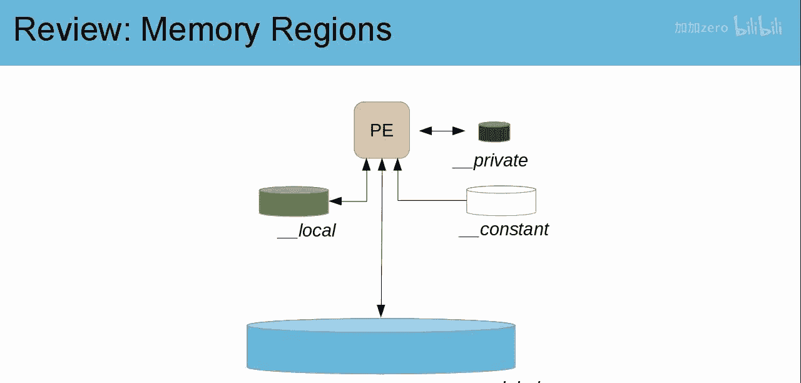

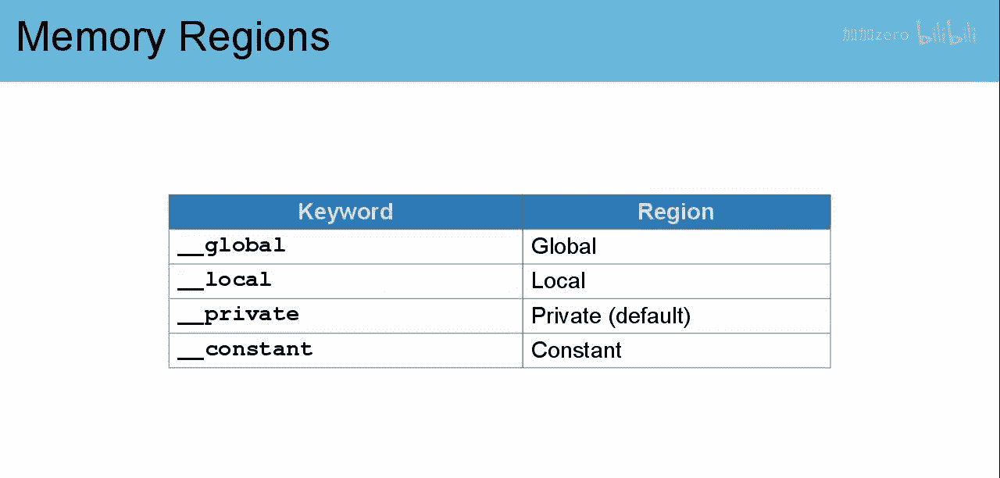

这不需要太多时间就能习惯，但你需要熟悉它，并开始思考：当我有一段内存时，它位于哪里？这对于有C/C++背景的人来说可能有点不自然，但在OpenCL C中你应该习惯它，因为你大部分时间都将花在思考内存的位置上。

这里有一个例子。我们有两个指针x和y，它们都指向全局内存空间中的某个整数。我们可以进行赋值 `x = y;` 吗？是的，我们可以让x指针指向y当前指向的位置。这几乎是标准的C语言，除了那些关键字。

现在考虑，如果我有一个指向全局内存的指针和一个指向私有内存的指针，我们不能将指针重新赋值指向另一个区域，因为这是两个不同的内存区域。所以它不仅仅是指向整数的指针，它是指向全局空间中的整数的指针。这应该很快会感觉自然，但我想指出，我们应该认识到我们正在处理许多不同的内存空间。这是OpenCL中一个非常重要的概念。

然而，我们仍然可以通过值来复制。这样做是可以的。这个操作在物理上对你的设备产生了影响：我们正在从私有内存中取出东西，并发出一个复制到全局内存空间的指令。这不再是一个简单的语句，它产生了影响，是有成本的，可能成本很高。对于这个特定的例子，我们稍后会详细讨论这些操作的实际相对成本，但我想让你清楚，我们实际上是在从多个内存空间的角度思考问题，你真的应该养成这个习惯。从私有内存复制到全局内存是完全可行的。

我们是在内存之间复制，而不是重新分配指针指向的位置。

关于类型就讲这么多，应该很自然了。接下来让我们谈谈向量。

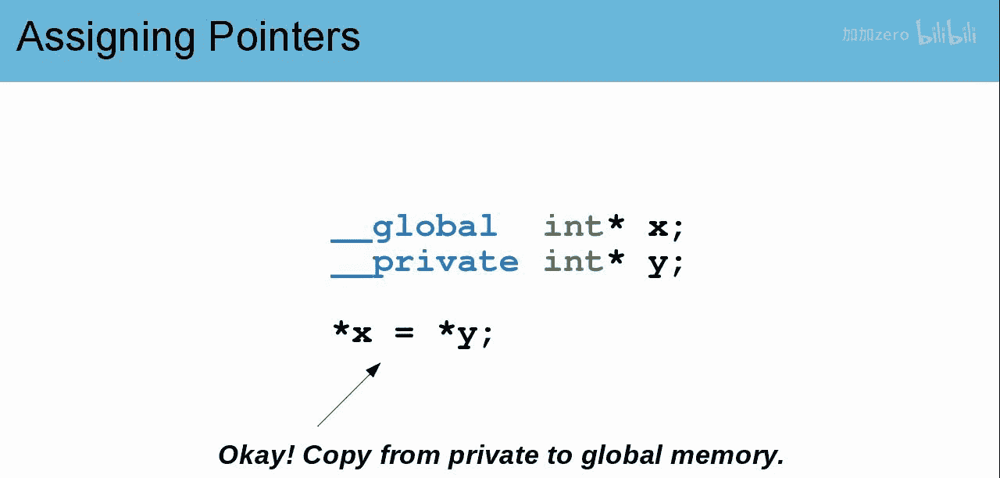

## 向量类型与操作

当我们谈论处理器内的向量操作时，向量操作是最重要的事情之一。那么，我们如何真正获得良好的向量化代码呢？这是一个复杂的问题，有几种方法。


以下是几种向量化方法：
1.  **使用库**：问题在于我们把问题转移给了别人。
2.  **让编译器完成**：如果你有一个向量化/优化编译器，它可以查看代码的某些结构并提取出向量操作。
3.  **使用C++类**：你可以重载运算符，让代码看起来不错，但问题在于效率可能不会很高。
4.  **使用内部函数**：例如Intel提供的一些内部函数，但这会变得非常混乱。
5.  **汇编语言**：更糟糕，谁想写汇编呢？

我想指出，实际上获得向量化的方法很少，而OpenCL C的一个优点就是向量化是一件非常自然、非常容易做的事情。这是我告诉人们的一个原因：即使你不使用GPU，OpenCL C也有很多可提供的东西。如果你只是在CPU上编写代码，而现代CPU都有运行向量指令的能力，OpenCL在这方面很棒。与你使用任何其他方法手动操作相比，它在向量化你的代码方面做得非常好。

让我们看看这些向量类型。它们是“一等公民”。注意左侧的字母N，它代表一个数字，可以是2、3、4、8或16。

这意味着，例如，`charN`。我们可以去掉N。我们已经有了`char`类型，但我们还有`char2`（两个字符）、`char3`（三个字符）、`char4`（四个字符）、`char8`（八个字符）和`char16`（十六个字符）。这些类型我们可以直接访问。我们可以有有符号或无符号类型，没有`unsigned char2`，你需要使用类似`uchar2`这样的形式。

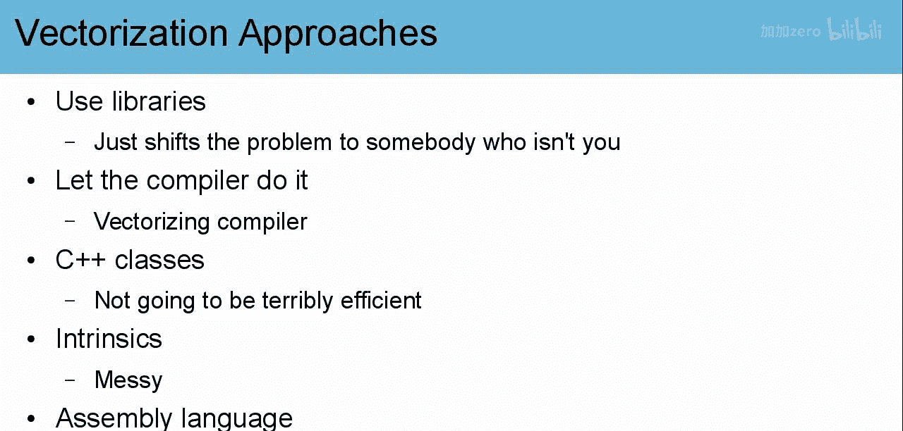

到目前为止看起来还不错。那么，当你进行向量操作时会发生什么？

如果我们有两个标量x和y，都是单精度32位浮点数，我们赋值给z。这和传统的C语言一样，你在这里没学到什么新东西。

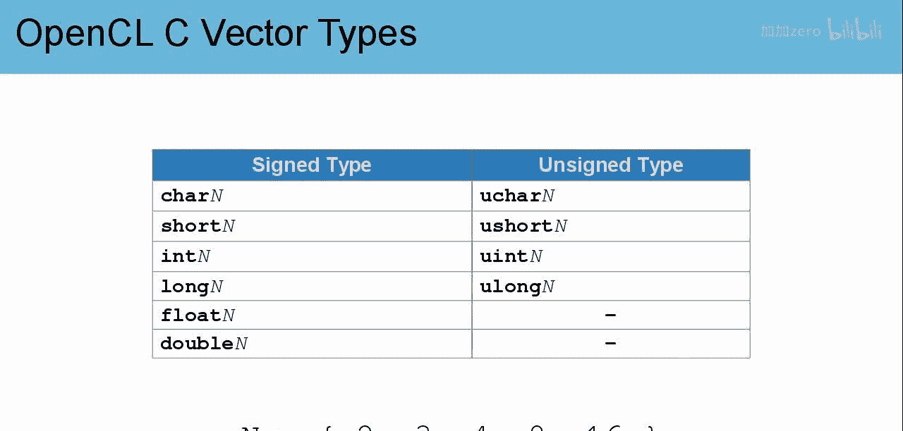

但是当你对两个向量进行操作时会发生什么？我们有4宽度的向量x、y和z。当我们做加法时，我们将进行分量级的加法。

假设我们有一个通用的操作符，比如 `x cross y`。当执行这个操作时，结果z1将等于x1 cross y1，并且这个操作将按分量进行，直到zK等于xK cross yK。

这个“cross”操作符实际上可以是什么？它可以是加法、减法、乘法或任何关系运算符。需要注意的是，关系运算符可能看起来有点令人困惑，因为从数学上讲，你不能自然地将“小于”映射到向量上，你需要使用其他操作来确定向量的顺序。所以我想让你意识到，当你比较两个向量时，结果是一个按分量进行布尔操作的向量。注意这个陷阱。

如果我们混合操作会怎样？我们有一个标量和一个向量，这定义了吗？在这种情况下，`x + y`，其中x是标量，y是4宽度向量，结果会是什么？这定义了吗？

它是定义的，结果将是一个`float4`。当混合标量和向量时，标量将被填充扩展，这很自然。所以x将被填充为向量[X, X, X, X]，然后我们将其加到y上。注意这一点，因为这可能不是你想要的特性，编译器可能会愉快地接受这个可能是个错误。

总结一下向量操作：
*   标量与标量操作：我们知道。
*   向量与向量操作：按分量进行。
*   标量与向量操作：标量被填充扩展到相同大小，然后我们使用向量与向量操作。

现在谈谈寻址。如果我有一个向量，我想访问一个分量，我想解包那个向量。我会使用点号，然后调用这个分量。由于我们做编程，你肯定乐意使用十六进制，而且因为我们是从0到16，十六进制非常适合这个。所以 `vec.s0` 是第一个分量，`vec.s8` 是第九个分量，最后一个分量是 `vec.sf`。

这里需要注意，从向量解包分量的角度，就编译器能做的事情而言，你可能没有做到最好。但这将在另一节课中讨论。你可以解包这些向量。

哪些地址是有效的？如果你有一个2向量（例如`float2`或`char2`），你可以使用 `x.s0` 和 `x.s1`，其他的是错误的。对于3宽度向量，可以使用s0到s2。对于4宽度向量，可以使用s0到s3。对于8宽度向量，可以使用s0到s7。对于完整的16宽度向量，可以使用s0到sf。非常自然，只需记住如何使用这个寻址方案，进行向量操作就很简单了。

但更高层次的问题是，我们为什么想使用OpenCL向量类型？编译器真的会做得更好吗？它能做得多好？

从概念上讲，OpenCL C可以处理这两个语句：`z = x + y`。如果我们不使用向量，也许我们必须按分量进行，所以可能需要进行四次加法。假设我们的架构有向量指令。让我们把这个OpenCL C片段交给编译器，我们会得到什么？我们会得到设备ISA或汇编语言中的一个完全虚构的语句。假设这是一个虚构的向量指令，我们现在将取寄存器1和寄存器2，将它们相加，并存储到寄存器3。这个加法可以一步完成。假设其他加法需要四步，那么通过使用向量操作，我们确实获得了四倍的性能提升。

使用向量操作，你真的想使用向量操作，但传统上，用你想编写代码的语言实际获得向量操作一直非常困难。使用OpenCL向量类型有一些优势：
1.  **清晰的沟通**：你和编译器之间就向量操作达成了清晰的沟通，你们都同意这些是向量。
2.  **简化代码**：它开始看起来比使用内部函数好得多。
3.  **获得优异性能**：编译器在使用向量的上下文中可以非常好地进行向量化。

我们已经讲完了向量，关于它们需要知道的就是这些。如何使用它们完全是另一回事，但这就是你需要知道的全部。现在让我们谈谈结构体。

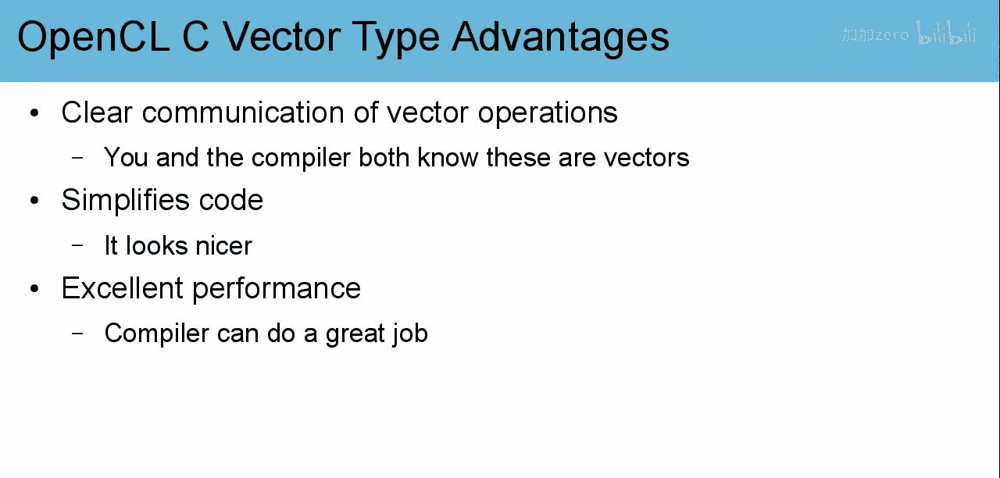

## 结构体与联合体


这是在C语言中聚合数据的典型方式。你可以在OpenCL C中定义结构体，也可以定义联合体，就像C语言一样。

然而，有很好的理由要避免使用OpenCL C结构体，原因与性能有关，另一节课将详细讨论这一点。但请相信我，你可能想避免使用它们。

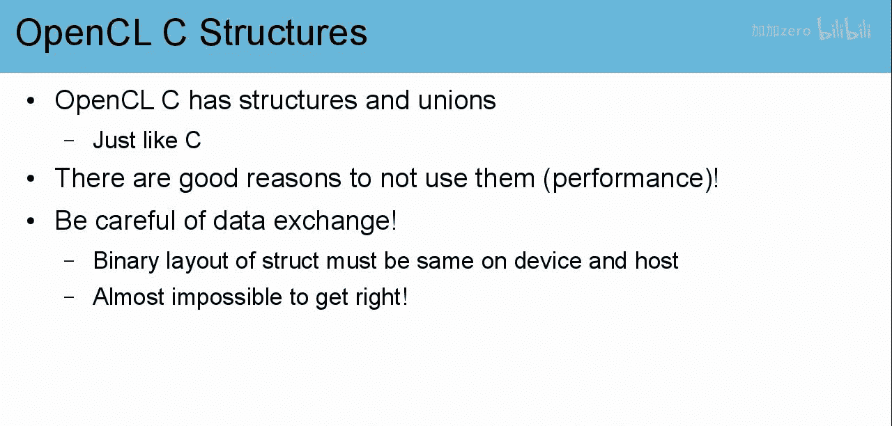

此外，要非常小心数据交换。记住，主机和设备必须就表示方式达成一致。当我们复制数据时，从主机到设备或反之是一个二进制操作，结构体的二进制布局在主机和设备上必须相同。考虑到对齐，几乎不可能获得正确的布局。可以做到，但根据我的经验，这非常困难。例如，如果你尝试在OpenCL C和C中编译一个结构体，它会根据不同架构的对齐方式以不同的方式填充。你必须开始手动添加填充，这变得一团糟。正如我所说，由于性能原因，你可能也不想使用结构体。


## 函数

我们已经看到了基本类型，看到了称为向量的特殊类型，也看到了我们可以将东西聚合到结构体中。那么OpenCL C中的函数是怎么回事呢？它们就是普通的C函数，没什么特别的。但是，你不能递归，我在本课开始时提到过递归是被禁止的。函数可能会被编译器内联展开，这不一定会影响你，但你应该知道。

让我们看一个函数的例子。我们有一个`float4 add(float4 x, float4 y)`函数，这是完全有效的。我们可以把它改成添加一些指针。这也是可以的，但我要指出这里有一些隐含的东西，希望你还记得前几张幻灯片：私有内存空间是隐含的。所以我们实际上有一个`add`函数，它添加两个私有浮点数。如果我们想添加两个全局浮点数，我们必须添加另一个函数。

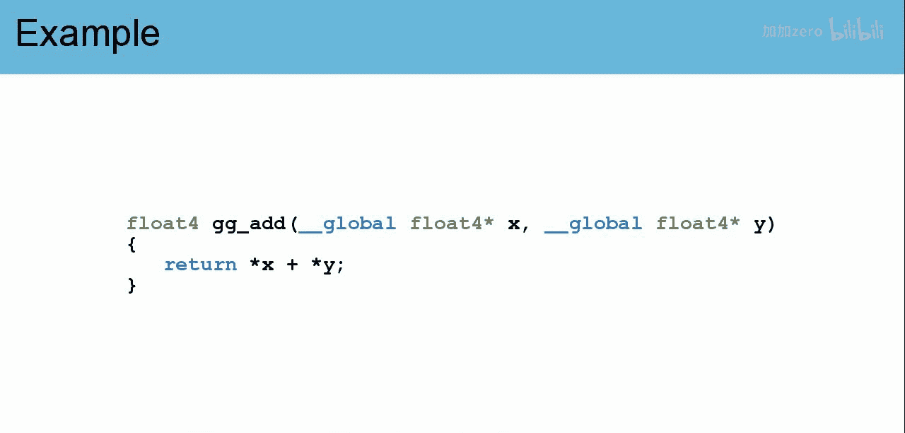

请记住，内存区域是函数签名的一部分。如果你正在编写需要以相同方式处理不同内存区域的代码，仅仅将指针作为参数，这可能会有点困难，或者至少非常烦人。请注意这一点。


## 内核

函数真的没什么可说的，它和你以前见过的一样。而内核，正如你从我对执行模型的讨论中回忆起来的那样，这真的是你调用在设备上执行工作的东西。

我希望我花时间向你解释执行模型能在这里得到回报，因为现在描述内核非常简单。

首先要理解的是，内核实际上是设备执行的入口点。我们熟悉C语言中的这个概念，事实上，我们有`int main`，它接受特定的参数列表，这是一种固定形式。但在这种情况下，内核只是一个像`main`一样的入口点，只不过我们可以随意命名这个主要部分，你可以认为在某种意义上有多个`main`函数。

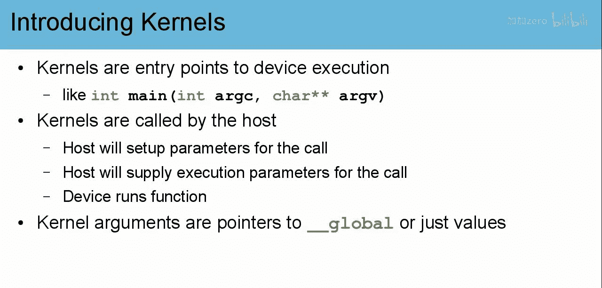

内核由主机调用。主机将设置控制执行的调用参数，主机也将设置参数列表并提供它，然后它将发出一个主机API调用，说“好的，去执行这个，完成后告诉我”。这就是完整的图景，设备将运行那个函数。

内核参数是指向全局空间某物的指针，或者只是值。这里有几件事……这不完全准确，你会在幻灯片中看到，但你应该这样想。不准确之处其实有点傻……我们假装我没说过。所以内核参数是指向全局某物的指针，或者只是被复制的值。请记住，每个内核启动或函数的每次调用都将具有相同的指定值，它们有相同的参数列表，它们使用索引来弄清楚它们实际上在做什么。

让我们看一个例子，这是你看到的第一个OpenCL C程序，它非常令人失望，因为它所做的只是将两个数组相加。

我们将添加这两个数组。我们得到数组x和y作为输入，我们将结果相加，并按分量存储到z的相同位置。现在我们提供了数组的长度，原因是我们需要终止那些索引溢出、超出范围的工作项。我们通过这里的if语句来实现这一点。

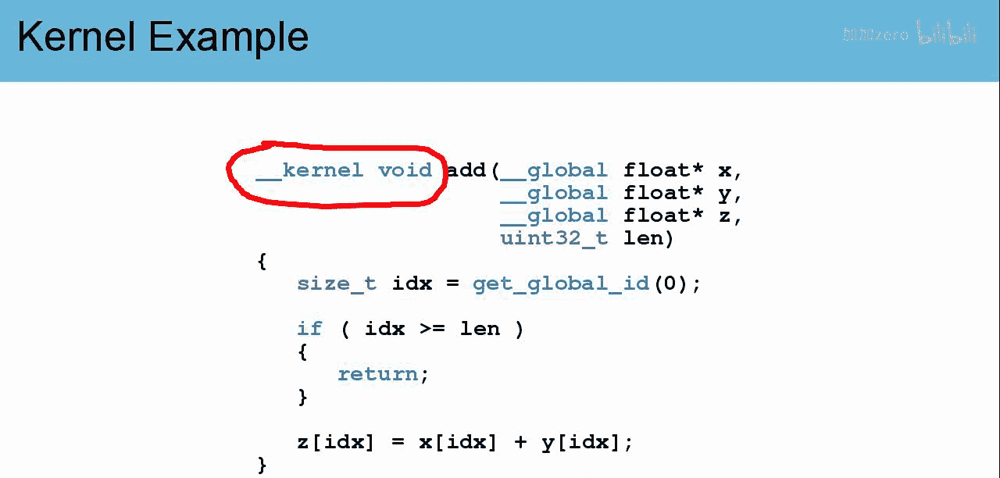

所以首先要注意的是，这个if语句所做的就是说，如果我超出了范围，我就停止，什么都不做。否则，我就做加法。现在，这个索引部分正在调用`get_global_id`。还记得我说过我们有这些完全唯一的全局ID吗？这就是它的作用。这里的0只是ID维度的指示符。记住，我说过在调用中我们可以有多个维度。这是你完整的内核调用。

这是完全有效的，我要指出`kernel void`总是必需的。我们不能返回任何东西。我们只是调用它，设备没有地方返回，它必须为此使用全局变量。`__kernel`只是将其标记为一个特殊函数，告诉编译器“嘿，你可以调用我，我是设备的入口点”，然后它可以继续构建所有必需的代码。

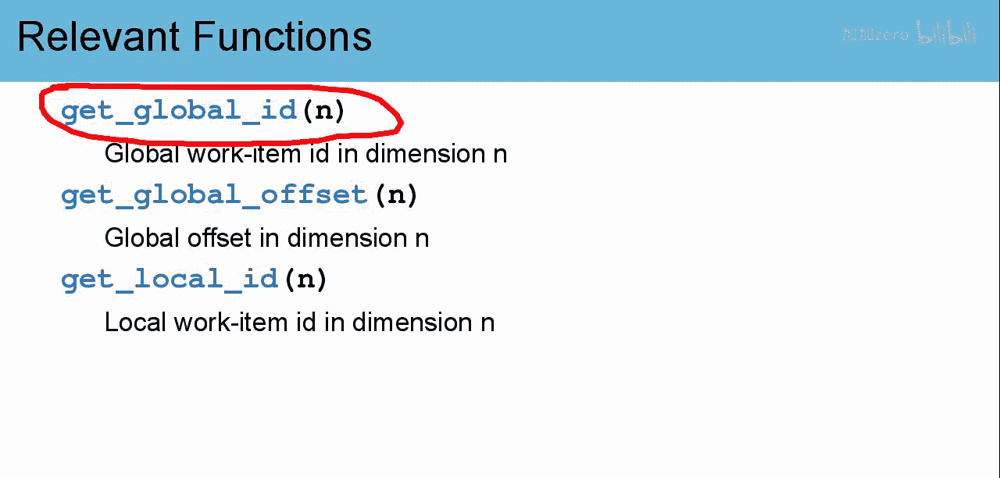

让我们回顾一下我们的执行模型。记住执行有维度：全局工作大小、全局偏移、工作组大小。我花了这么多时间解释这些概念，因为当你实际编写内核时它们非常重要。有一些相关的函数可以访问这些信息。再次记住，参数列表是固定的，所以弄清楚我们在做什么的唯一方法是使用外部函数来询问运行这些函数的系统我们在哪里。

OpenCL C中的相关函数是`get_global_id`，其中n是维度。这将给我们第n维的工作项ID。我们还可以使用`get_global_offset`，我在之前的讨论中提到过偏移量，它是一个被加到所有索引上的数字。我们还有`get_local_id`，它只是告诉我们我在我的工作组中是哪个工作项。这些只是众多函数中的几个，我鼓励你去查看文档，看看其他的，但这些是你将要使用的几个。我想说，你最常使用的可能是`get_global_id`，你可能比使用其他函数更频繁地使用这个。

现在让我们看另一个例子。这实际上是同一个例子，但我想让你快速看一下我们再次使用这个函数的事实。我想强调，我们基于这个调用弄清楚了自己的位置。顺便说一下，我还要指出，我使用的是`size_t`，它是设备特定的，根据设备可能是32或64位，但这没关系，因为它不在我们被外部调用的列表中。我还要指出，我继续使用我建议你使用的类型定义，因为这会让你的生活轻松一点。

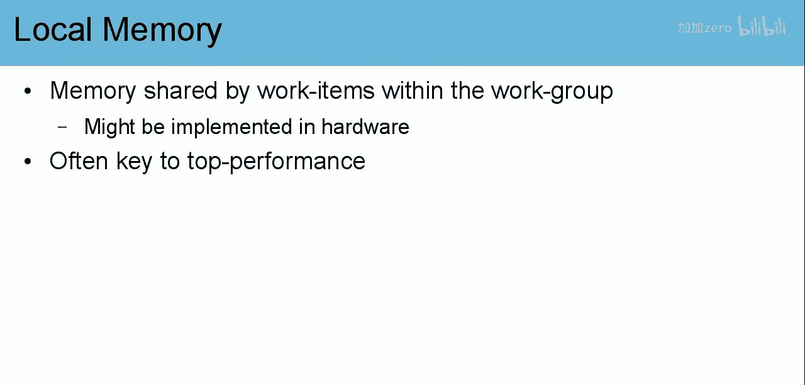

## 本地内存

现在让我们谈谈本地内存。这就是我们如何修改我们的执行概念，将本地内存引入到这里的图景中。本地内存由工作组内的工作项共享。本地内存可能是硬件中的物理存在，也可能不是。但因为它是一个模型，它并不总是以相同的权重映射到所有硬件。在GPU上，它将映射到物理的东西。所以当你可以的时候，你想使用本地内存。通常，本地内存是获得顶级性能的关键。

那么我们如何声明使用本地内存的东西呢？有几种方法可以做到这一点。

第一种方法是提供一个参数。你会看到这里我提供了一个指向本地内存的参数。记住本地内存……事实上，你可以在参数列表中这样做。记住我说过参数列表要么是指向全局某物的指针，要么是指向值的指针，要么是值本身。然后我在这里的讨论中有点磕巴，我不完全确定如何提及这个例外……当你调用函数来声明本地内存时……抱歉，当你在排队内核并要调用内核时，当你有一个本地值或变量时……问题是，我使用的术语存在于许多其他地方。当你有一个指向本地某物的指针参数时，主机一方的期望并不是你提供一个真正的指针，而是提供该内存应该有多大的大小。所以，你所能做的只是提供指向全局某物的指针或值，这仍然是正确的。

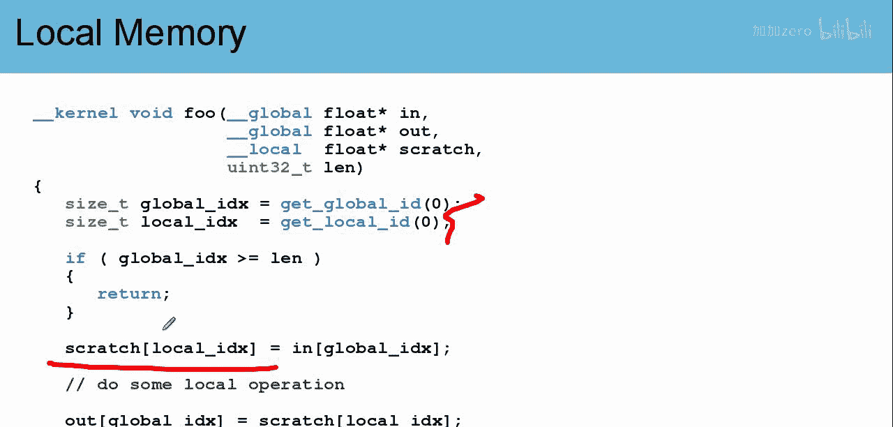

现在我使用了两个索引，我使用了本地信息。那么这是在做什么呢？让我们看一下。我获取一个全局索引，同样，如果我溢出了，我什么都不做。我在这里做的是将某些东西加载到暂存空间中。所以我取我的全局索引，将某些东西加载到暂存空间，然后暂存空间将从0到……哦，这不是我期望的，抱歉……它将从0到K，例如，其中K是工作组大小。所以这个索引是不同的。我将我的全局值加载到一个本地值中，然后我把它写回去。这不是最有趣的内核，我只是想向你展示如何使用本地内存。

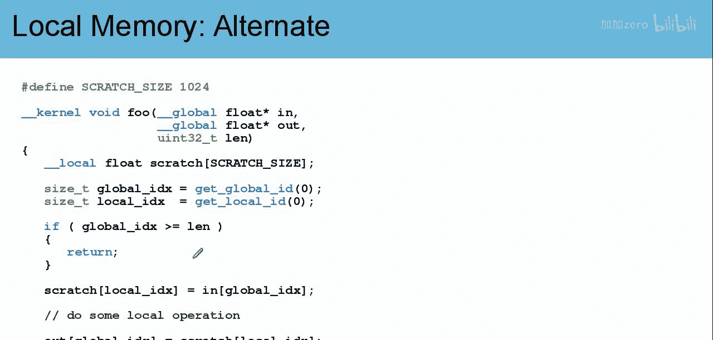

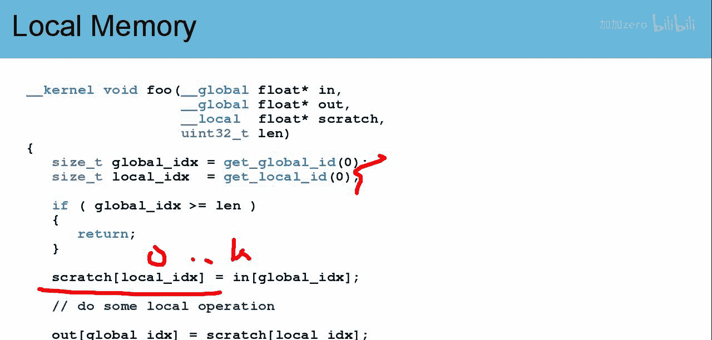

还有另一种使用本地内存的方法，你可能更喜欢。

就是，它更有意义一些。当我可以的时候，我更喜欢这种方法。我只是直接说，嘿，我正在使用一个局部变量，这是暂存空间。但我要指出，即使它看起来是在单个工作项内部，实际上它是在工作组内所有工作项之间共享的。所以这在语法上表现为好像是一个工作项在执行这个，它没有执行任何东西，它只是一个分配。所以这是所有工作项都会看到的分配，在这个例子中它的大小固定为1024，一切都和之前的例子完全一样。所以这是做你刚才在另一个例子中看到的完全相同事情的另一种方法。

## 常量内存

常量内存是只读内存，由所有工作项共享。我们之前看到它读取速度非常快，但空间相对较小。在某些情况下它很有用，如果你想到查找表，你现在应该真正考虑常量内存，因为常量内存相对较小，如果你有一个巨大的查找表，它就没那么有用了。但我想让你记住，常量内存和本地内存类似。

你如何填充常量内存呢？你可以直接把它放在你的文件中，或者你可以把它作为一个参数传递，将一个指向全局内存区域的指针传递给它。

## 内核限制

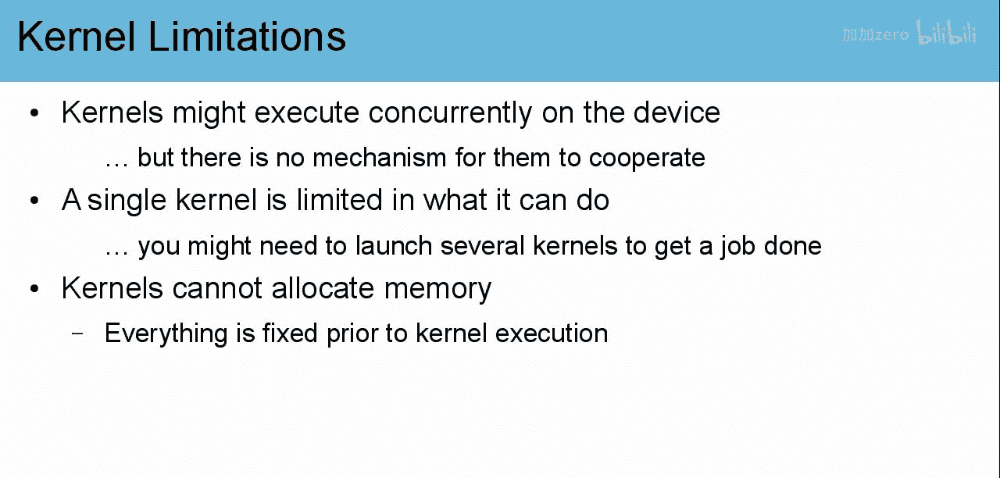

内核有一些限制。首先要认识到的是，内核可能在设备上并发执行。当我说内核时，我指的是`add`内核和`f`内核，两个不同的内核（不是同一个内核中的工作项）。它们可能共享同一个设备，但它们不能合作，完全不能。任何让它们尝试合作的行为都是编程错误。你不应该这样做，这是未定义行为。

单个内核能做的事情确实有限。你能写一个像`main`那样做所有事情的函数吗？不，你不能。你可能需要启动几个内核来完成一个特定的工作。当你实际看到如何使用OpenCL编写算法时，你会看到这一点。现在，你只是看到了游戏规则，语法。

内核不能自己分配内存。所有东西都是固定就位的，然后它们只是运行，直到我之前描述的那个索引空间被清空。所以所有东西都设置好了，内核只是不断运行、运行、运行，直到一切完成，它们终止。它们不能分配内存，因为这会违反这种哲学。

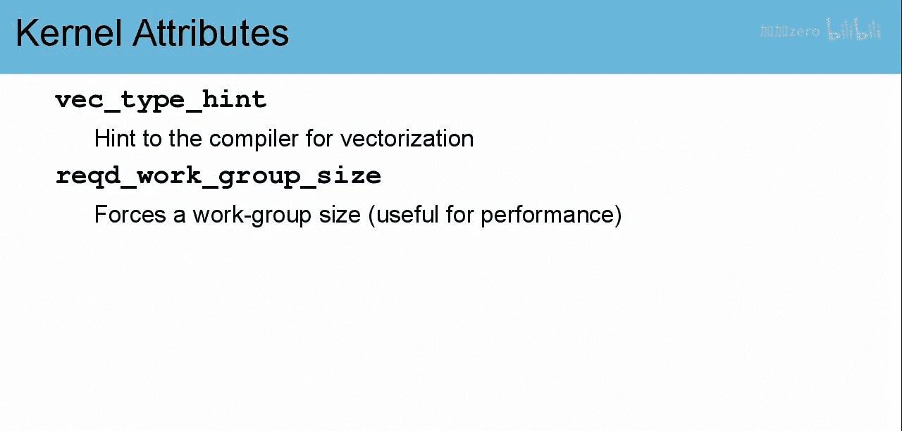

## 内核属性


有一些属性，这些非常重要。属性是你在文档中可以看到的东西，你会在更高级的演示中看到。我所做的一切都是为了构建一个更高级的讨论，以便你能快速进入使用OpenCL编写非常快的代码。

你可以拥有的一个属性是向量化的提示，关于向量的宽度。这允许你向编译器传达一些它可能自己无法弄清楚的东西，关于你想象中向量化的方式。

另一件你可以做的事情（顺便说一下，还有其他一些属性，但最重要的两个）是`reqd_work_group_size`。这强制了工作组的大小，这对性能非常有用。你会看到在我编写的每一个试图获得最高速度的内核中，我都会使用这个。这将强制一个特定的工作组大小。发生的情况是，因为编译器知道工作组大小是64（64是AMD的一个特殊数字，不管它是什么），如果它看到工作组大小是64，它可以应用非常特殊和具体的优化，并在寄存器定位等有趣的事情上做得非常好，当我们讨论这些模型如何被转换（抱歉，是转换）成实际代码的实际方式时，我们会深入探讨。

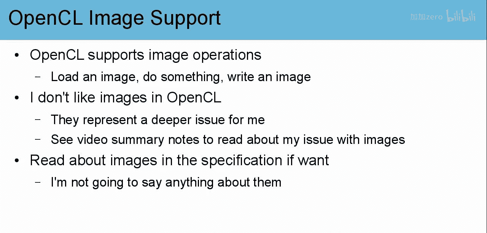

## 快速主题

我们已经差不多讲完了OpenCL C。现在有一些快速主题，我不会详细讨论，但我想为你提供足够的背景知识，让你可以自己去学习。

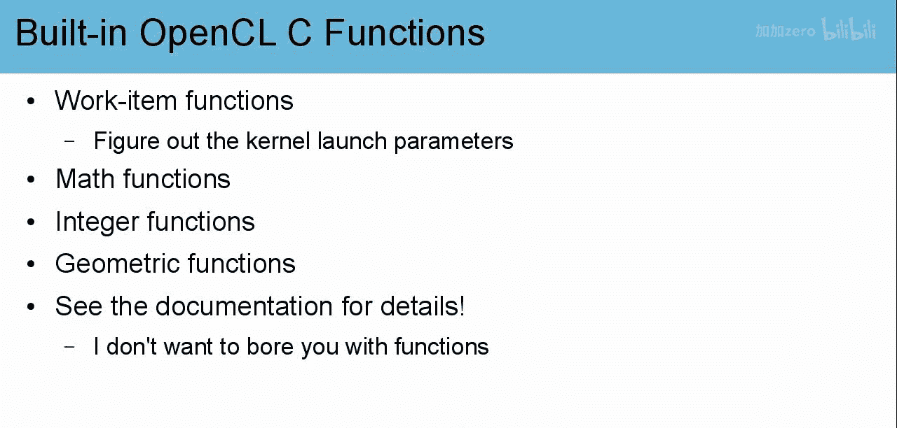

OpenCL确实提供了对图像的支持。你可以加载图像，用它做点什么，你可以写图像。这些东西在OpenCL C中直接支持，你会看到规范中有相当一部分是关于图像的。我个人不喜欢OpenCL中的图像，并不是我不喜欢图形或者我对图像有问题，问题在于我认为它们代表了一个更深层次的缺陷。这是一个更高级的话题，如果你看到摘要笔记，你可以阅读我写的关于SPIR的文章中我对图像问题的看法。所以它们存在，但我不打算涵盖它们，我实际上从未使用过它们。它们不……图像有一些有趣的特性，但我做的是通用计算，我做的是非图像处理的事情。如果我在做图像处理，我会使用它们。现在，如果你想了解图像，可以在规范中阅读，关键是我在开始时提到的：它们是不透明类型，我们不知道它们的内存表示。这是出于性能原因，关于图像就讲这么多。

OpenCL C有内置函数。我们有许多内置函数可以直接调用。它不完全像一个标准库，但有点像标准库。我们有工作项函数，可以找出我们排队时的参数；有数学函数；有整数函数；有几何函数。你真的应该看看文档，我不会通过遍历每个函数来让你感到无聊。但那里有一些真正的好东西，比如叉积或点积，你有机会真正使用它们来获得良好的性能，因为这些实现很可能由供应商以该架构最快的方式实现，甚至可能调用特殊指令，我不知道，这取决于设备和实现。

同步。我的意思是，在OpenCL C中，你还没有看到，它真的是一种并行编程方法，同步非常重要。它也是一个非常复杂的话题，你必须等着我做另一个视频，我将专门讨论同步。OpenCL C提供了原子操作。OpenCL C中的并行性有点棘手，你真的会开始欣赏像我这样有免等待算法设计背景的人，因为这意味着我可以编写适合OpenCL C编程模型的算法。然而，如果你习惯使用锁或互斥锁，无论你怎么称呼它们，你在OpenCL中会非常困难。这并不是说你有困难是因为有什么你不知道的东西，而是因为OpenCL的设计是为了性能，为性能所做的一切几乎排除了锁的使用。所以你必须小心。

我把这些话题分成小块的原因是，在这一点上，你已经看到了这么多OpenCL C，现在我可以讨论执行模型了。我可以说，好吧，让我们谈谈工作组，谈谈工作项。事物如何映射？计算单元的接口是什么？计算单元如何看待事物？处理单元如何看待事物？一切如何关联？经过这两个小时的课程，你现在有足够的背景知识来欣赏所有额外的话题。我真的想做这些课程，它们对我来说是基础，它们为你提供了一些东西，现在我们可以进行一些真正有趣和严肃的讨论了。

我要在本次讨论中留给你的最后一件事是关于扩展。OpenCL C标准有扩展，可以向其中添加东西，这些是你可以通过使用`#pragma`指令启用的额外功能。和往常一样，对于`#pragma`或任何尚未完全进入规范的外部东西，要小心，运用良好的判断力，安全第一，注意你如何设计你的代码，因为你可能会发现你最喜欢的扩展消失了，或者使用扩展可能不是一个好主意，因为会导致供应商锁定。所以当你使用它时要意识到，你可以浏览提供的扩展，它们很有用，其中一些值得一看。

## 总结

首先，恭喜你，你现在理解了OpenCL及其相关模型，以及OpenCL C的基础知识。我鼓励你出去阅读规范，拿起来，随便翻翻，你现在拥有了一切真正理解正在发生的事情所需的东西。请记住，一切都需要一些时间才能消化，如果有什么不清楚的地方，或者我没有描述得尽可能好，请随时给我留言，我可能会制作另一个视频来修正你觉得我没有做好的地方，或者我可能会写一篇文章来帮助你更好地理解那个概念。所以我鼓励你订阅我的博客，你可以在这个视频的“关于”部分查看，我会在下一张幻灯片中发布链接。我也可以作为顾问提供帮助，包括帮助你实际获得良好的性能，如何构建你的程序以便重用，OpenCL的设计模式是什么。我正在谈论这些，向公众传达这些信息需要时间。但如果你雇我作为顾问，你今天和现在就能得到我的建议的好处。

我叫Aion，非常感谢你查看这些内容，请随时给我发邮件或查看我的网站。当有新视频发布到这个频道和那个网站时，我会发布通知。

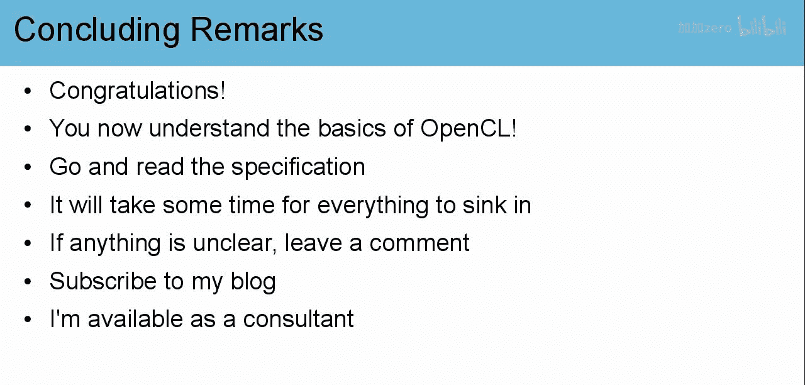


非常感谢你的时间，晚安。