# 003：GPU架构详解 🚀

在本节课中，我们将深入探讨GPU的通用架构。虽然会以AMD 7970 GPU为例，但所涉及的核心概念同样适用于NVIDIA或其他厂商的GPU，甚至与CPU上的SIMD指令集原理相通。理解GPU的工作原理，将为我们后续讨论针对此独特架构优化的算法和数据结构奠定基础。

## 讲师简介


我是并行编程领域的专家，精通C++、OpenCL和Linux。我专注于后端服务器开发与性能压榨，致力于解决现实中的软件工程问题，并进行OpenCL中间件开发。我在高性能计算领域拥有多年经验。如果您需要相关咨询或帮助，可以联系我。

## 课程动机与背景

本次讲座的主题是GPU架构。我们首先思考一下，为何要将原本用于图形处理的GPU用于通用计算。

GPU通用计算（GPGPU）的发展颇具偶然性。硬件厂商和整个行业无意中催生了一个从未被设想过的GPU角色。GPU的架构最初由游戏渲染和像素处理驱动，但其构造的演变恰好允许我们进行非常有趣的计算。今天，你将看到的GPU架构，需要你意识到市场营销信息可能具有误导性。我们旨在拨开迷雾，理解GPU真正新颖和有趣之处，以便你能基于此做出明智的硬件选择。

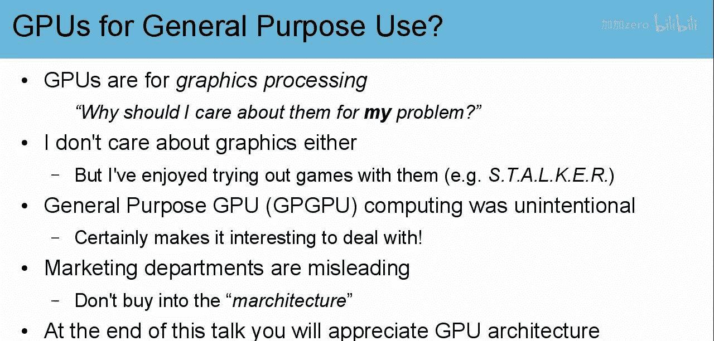

## OpenCL视角下的GPU架构

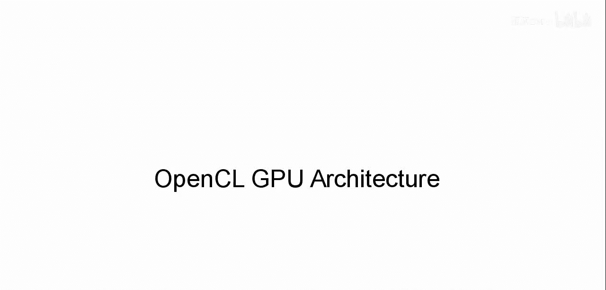

这里讨论的是OpenCL所呈现的GPU架构视图，我们只关注对OpenCL开发暴露的特性。

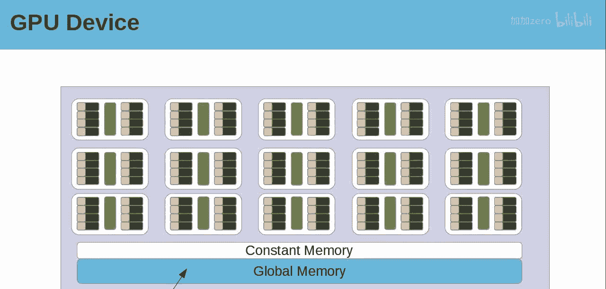

你应该还记得这个设备模型图。在GPU上，与之前模型不同的是，常量内存空间和全局内存空间是由硬件实际实现的。显卡上存在物理的全局内存和常量内存。

现在，让我们深入到计算单元内部。这与OpenCL的计算单元模型略有不同，我们稍作修订以展示GPU的实际工作方式。

在GPU的计算单元内部，有一组处理元件。本地内存和私有内存同样由硬件实现，这与CPU架构不同。私有内存虽然被所有处理元件共享（在硬件上作为一个寄存器文件池分配），但各个处理元件仍然无法互相访问彼此的私有内存。

此外，每个计算单元还有一个工作调度器。GPU的执行模型比较特殊：**一个计算单元内所有处理元件的指令指针是锁定在一起的**。

## 波前与锁步执行

让我们通过一个假想的低级汇编指令序列来追踪执行过程，以理解其含义。

假设有四个处理元件。它们都从各自的私有内存中读取寄存器R2和R1的值，然后执行相同的加法指令，并将结果写入各自的R3。你可以将此视为一个4宽度的SIMD指令。接下来，它们又一起执行乘法指令。即使在获取内存时，每个处理元件都是独立操作自己的数据，但**所有处理元件必须执行相同的操作**。

NVIDIA将这种锁步执行的集合称为“Warp”，AMD则称之为“Wavefront”（波前）。**波前是来自同一工作组、指令指针锁定在一起执行的一组工作项**。你可以将波前视为工作组中被切割出来、一起执行的最小单元。

## 分支与线程发散

既然指令指针被锁定，那么当遇到条件语句时会发生什么？

考虑一个条件赋值语句：`if (a < b) f = x; else f = y;`。每个工作项都有自己的`a`和`b`副本。

1.  **理想情况**：如果波前内所有工作项的条件判断结果一致（例如都为真），那么它们将一起执行`f = x;`，没有问题。
2.  **线程发散**：如果有一个工作项的条件判断为假，情况就复杂了。GPU的处理方式是：对于条件为真的工作项，执行赋值操作；对于条件为假的工作项，它也会“参与”执行这条指令，但会设置一个掩码，使其写操作无效（不产生副作用）。然后，当执行`else`分支的`f = y;`时，之前条件为假的工作项会执行赋值，而条件为真的工作项则掩码其写入。这被称为**线程发散**。

线程发散会导致性能下降，因为部分处理元件在“空转”。为了缓解这个问题，OpenCL提供了内置的`select`函数，它可能被编译成一条条件移动指令，效率更高。但请注意，如果条件分支涉及复杂的函数调用，使用`select`可能使代码难以阅读，此时编译器通常也能很好地处理`if`语句。

## GPU内存层次与访问代价

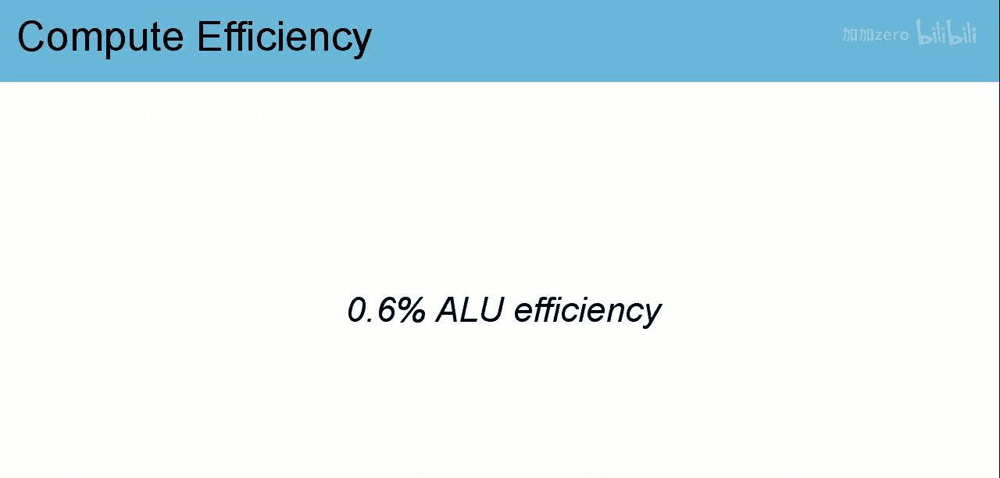

现在我们来讨论GPU内存。让我们通过一个思想实验来理解内存访问的代价。假设每个处理元件每秒执行一条指令。

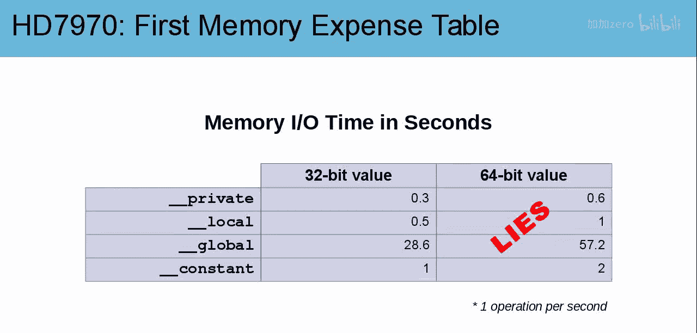

考虑一个简单的操作：`z = x + y;`，其中`x`和`y`从全局内存读取，结果`z`写回全局内存。

*   从全局内存读取两个4字节整数（共8字节）：耗时 **57秒**。
*   执行加法运算：耗时 **1秒**。
*   将4字节结果写回全局内存：耗时 **28秒**。
*   总耗时：86秒。其中只有1秒用于实际计算，效率仅为 **1/86 ≈ 1.2%**。

如果将数据换成8字节的长整型：
*   读取两个长整型（16字节）：耗时 **114秒**。
*   加法：1秒。
*   写回一个长整型（8字节）：耗时 **57秒**。
*   总耗时：172秒，计算效率降至 **1/172 ≈ 0.6%**。

以下是访问不同内存空间所需时间的对比表（以“1次操作=1秒”为基准）：

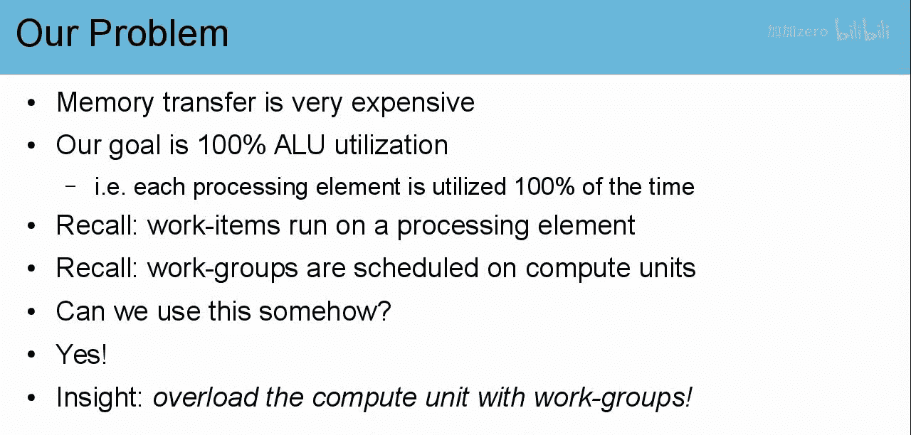

| 内存类型 | 访问32位值耗时 | 访问64位值耗时 |
| :--- | :--- | :--- |
| 全局内存 | 28.6 秒 | 57.2 秒 |
| 常量内存 | 1.0 秒 | 2.0 秒 |
| 私有内存 | 0.3 秒 | 0.6 秒 |
| 本地内存 | 0.5 秒 | 1.0 秒 |

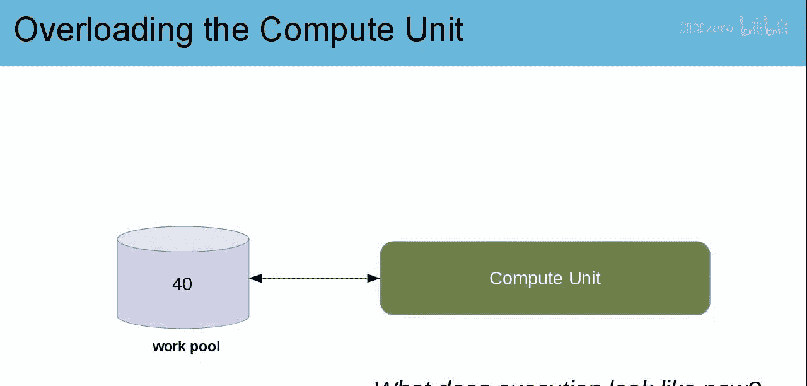

> **注意**：上表中64位值的访问时间只是简单地将32位值的时间翻倍，这在实际中是一个“谎言”。因为像AMD 7970这样的GPU，其内存合并访问优化是针对32字节步长设计的，64位访问的性能可能更差。

一个提升效率的技巧是：**增加每次内存访问后执行的算术逻辑单元操作数量**。如果内存IO开销相对固定，那么通过进行大量计算来“分摊”这个开销，就能提高ALU利用率。例如，在读取数据后执行一百万次操作，那么内存访问的开销就几乎可以忽略不计，ALU效率接近100%。这在整数分解、密码分析等计算密集型任务中很常见。

## 延迟隐藏与工作调度

内存访问延迟是我们的主要问题。为了实现100%的ALU利用率，我们需要让处理元件一直有工作可做，而不是空等数据。

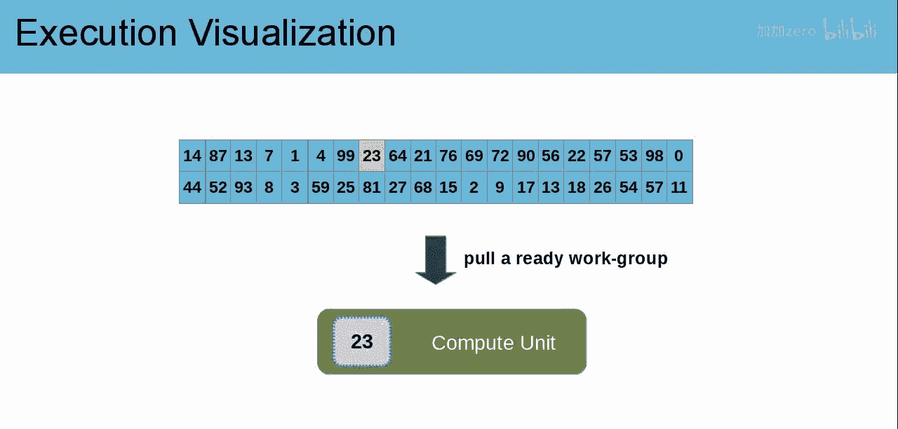

关键思路是：**让计算单元超载多个工作组**。这是通过工作调度器实现的。

想象一个计算单元有一个工作池。最初只放入一个工作组（WG 0），那么当该工作组因内存请求而阻塞时，计算单元就闲置了。

如果我们向工作池中放入大量工作组（例如，容量为40个）。调度器会这样工作：
1.  从池中选取一个“就绪”的工作组（例如WG 68）开始执行。
2.  执行固定周期或直到遇到内存请求。
3.  当遇到内存请求时，将该工作组标记为“阻塞”并放回池中。
4.  立即从池中选取另一个“就绪”的工作组（例如WG 23）执行。
5.  如此反复。当某个工作组等待的内存数据到达时，它会被重新标记为“就绪”，并有机会被再次调度执行。

这样，通过在不同工作组之间快速切换，**计算单元几乎总在执行有用的计算，而长内存延迟被其他工作组的工作所“隐藏”**。这就是**延迟隐藏**的核心原理。

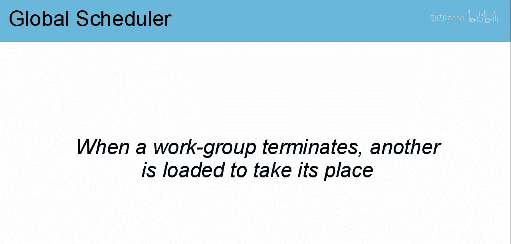

需要澄清的是，延迟隐藏的实际调度单位是**波前**，而非整个工作组。一个工作组可能包含多个波前。

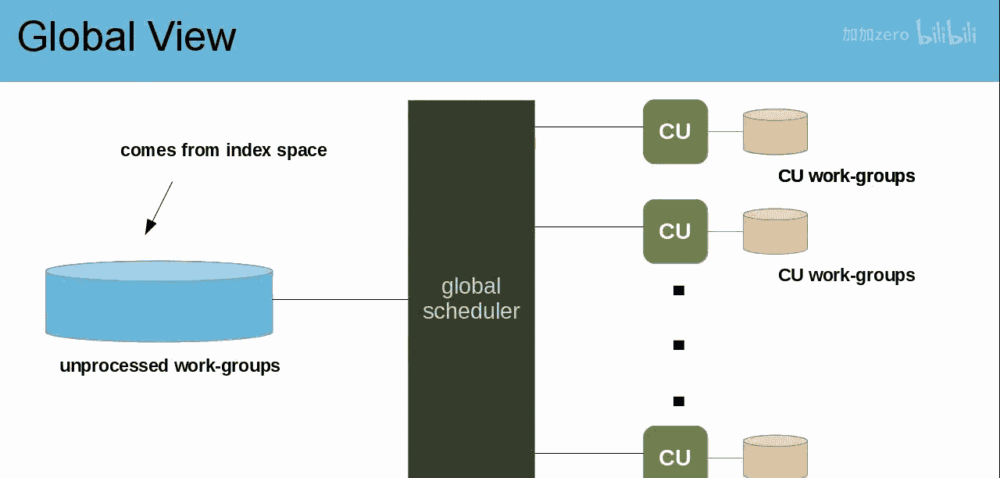

## 占用率

每个计算单元的工作调度器有固定数量的波前槽位（例如AMD 7970是40个）。**占用率**是指实际可以同时驻留在计算单元上的波前数量与最大可能波前数量之比。

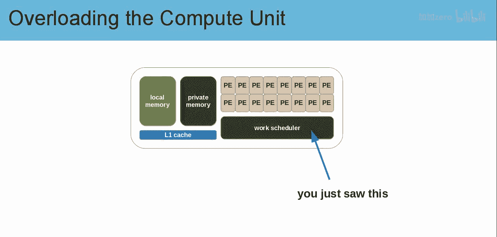

例如，如果最大波前槽位是40，而你的内核设计允许同时运行30个波前，那么占用率就是 **30 / 40 = 75%**。

占用率是一个重要的性能指标。高占用率通常意味着有更多的工作可以用于隐藏延迟。但请注意，如果内核本身的计算与内存访问比例极高（计算密集型），那么即使占用率低，也可能获得高性能，因为ALU本身已经很忙。

那么，是什么限制了占用率？主要是**私有内存和本地内存**的使用量。因为这些内存资源在所有处理元件/波前之间共享，且总量固定。

在AMD 7970上：
*   每个计算单元有 **256 KB** 私有内存（寄存器文件）。
*   每个计算单元有 **64 KB** 本地内存。

内核使用的这些资源越多，能同时驻留的波前就越少。

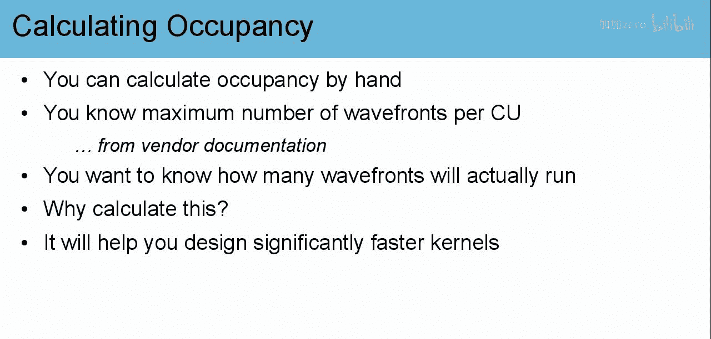

## 占用率计算示例

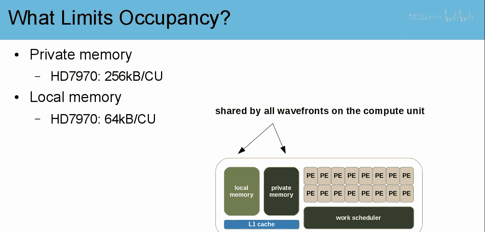

我们通常将工作组大小设置为波前大小（在7970上是64），以便于分析。

计算最大波前数量的公式如下：

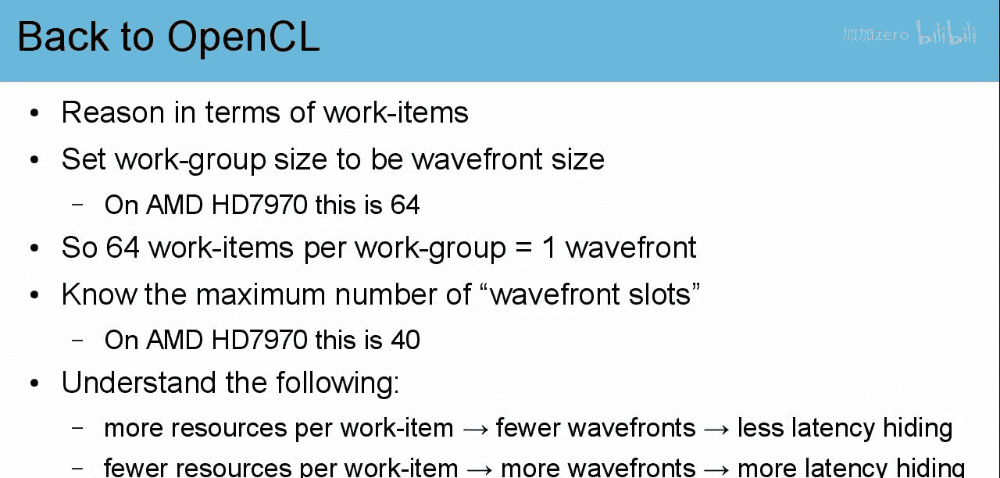

```
最大波前数 = (可用内存资源总量) / (每个波前所需内存资源)
```

其中，`每个波前所需内存资源 = 每个工作项所需内存 * 波前大小（工作项数）`

**示例**：为了在AMD 7970上实现最大占用率（40个波前），每个工作项最多能使用多少私有内存？


```
每个工作项最大私有内存 = 总私有内存 / (最大波前数 * 波前大小)
                        = 256 KB / (40 * 64)
                        = (256 * 1024 字节) / 2560
                        ≈ 102.4 字节
```

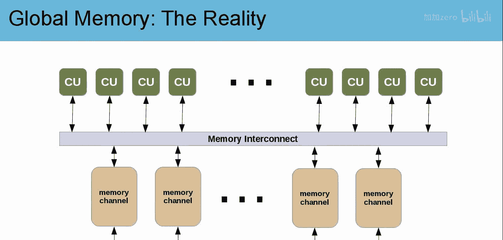

这意味着，每个工作项大约只能使用 **102字节** 的私有内存（约25个32位变量），才能达到最大占用率。这包括了内核运行本身所需的基本寄存器。因此，为了高占用率，必须精打细算地使用私有变量。

本地内存的计算方式类似，只需将总容量替换为64 KB即可。

## 内存通道与合并访问

全局内存并非一个所有计算单元都能无冲突访问的统一池。实际上，它被划分为多个分区，每个分区连接一个**内存通道**。在AMD 7970上，有32个计算单元和12个内存通道。

每个全局内存地址都映射到特定的内存通道。当多个计算单元请求访问映射到同一通道的内存地址时，这些请求会被**序列化**，导致性能下降。

根据鸽巢原理，32个计算单元向12个通道发起请求，必然有通道收到多个请求。为了获得最佳性能，硬件厂商推荐使用**合并访问**模式。

**合并访问**是指：**相邻的工作项访问相邻的全局内存地址**。这种模式能让内存控制器最有效地工作，实现高带宽。

相反，随机或跨步很大的内存访问模式会降低性能，可能导致请求集中在少数通道上。

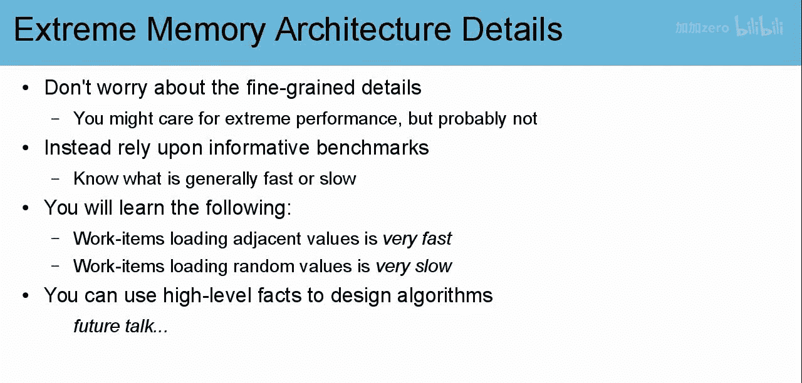

对于性能优化，我们的建议是：
1.  优先设计算法以实现合并访问。
2.  如果无法避免非合并访问，则尝试在内存操作之间插入足够多的ALU操作，利用延迟隐藏来减轻性能损失。
3.  最终，应依赖实际的基准测试来指导优化，因为理论性能可能与实际硬件行为有差异。

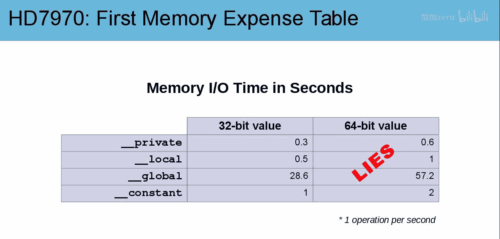

## 课程总结与展望

本节课中，我们一起深入学习了GPU的核心架构：

1.  **锁步执行与波前**：理解了GPU计算单元内处理元件如何以波前为单位，锁定指令指针一起执行。
2.  **线程发散**：认识了条件分支导致的性能问题及其原理。
3.  **内存层次与代价**：通过思想实验，直观感受了全局内存访问的巨大延迟，以及本地/私有内存的速度优势。
4.  **延迟隐藏**：掌握了通过超载工作组、利用工作调度器在多个波前间切换，以隐藏内存访问延迟的核心机制。
5.  **占用率**：学会了如何计算和分析占用率，并明白其受私有/本地内存资源限制。
6.  **内存通道与合并访问**：了解了全局内存通过多通道访问的物理现实，以及合并访问对性能的关键影响。

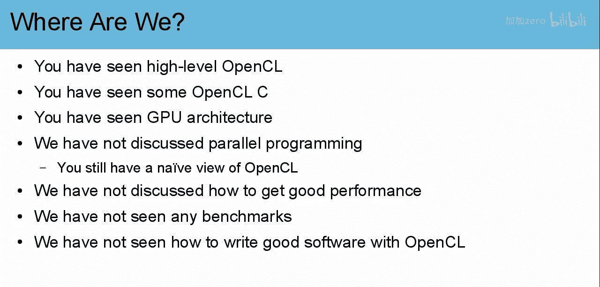

到目前为止，我们的学习路径是：OpenCL高级概述 -> OpenCL C语言基础 -> GPU架构。我们尚未深入讨论并行编程中工作项间的协作（如原子操作、同步）、如何具体测量和获取高性能、以及如何编写良好的OpenCL软件工程实践。这些主题将在未来的课程中陆续展开。


希望本课程为你理解GPU编程打下了坚实的基础。要真正掌握性能调优，还需要大量的实践和经验积累。