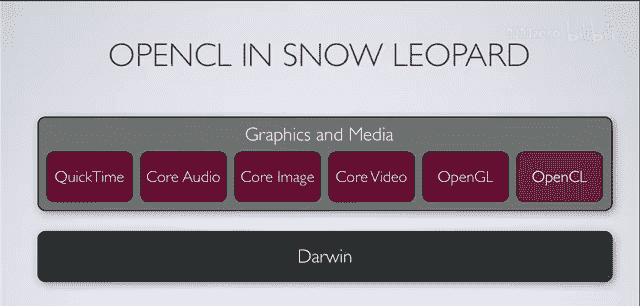

# 004：OpenCL简介 🚀

在本节课中，我们将要学习OpenCL的基础知识。我们将探讨OpenCL是什么，它如何工作，以及为什么它对现代高性能计算至关重要。通过本教程，你将了解OpenCL的核心概念、应用场景以及它与其他技术的关系。

## 什么是OpenCL？

OpenCL代表开放计算语言。它最初由苹果公司在2008年提出，并由包括NVIDIA、AMD、英特尔在内的多家大型公司共同开发其规范。OpenCL本质上是一个规范，而非特定的技术实现。该规范由Khronos集团维护，该集团也负责维护OpenGL等技术的规范。

由于OpenCL是一个规范，这意味着要实际使用它，必须有人根据规范实现相应的库、框架和资源。这与OpenGL的工作方式非常相似，它是一个开放标准，任何厂商都可以基于其硬件和软件编写自己的实现。实现者只需确保其实现符合规范的所有最低要求，即可拥有一个兼容的实现。

## 为什么需要OpenCL？

计算性能的重点已从时钟速度转向核心数量。过去，通过提高CPU的时钟速度就能轻松获得性能提升。而现在，人们开始寻求使用多核处理器，即在一个系统中集成多个CPU核心。

然而，编程范式并未跟上这一变化。我们一直专注于如何从单个CPU中榨取最大性能，编写的程序和算法也基于此，而没有充分考虑如何在多核环境下高效地分割算法和共享数据。OpenCL旨在解决这个问题，它像一种“粘合剂”，让你能够访问计算机中的所有硬件资源。

OpenCL是一个编程接口，其核心理念是：既然系统中有这么多闲置的计算资源，为什么不尝试利用它们呢？因此，OpenCL旨在支持通用目的的并行计算，而不仅仅是多媒体或图形应用，也可以用于科学计算等任务。

## OpenCL的核心特点

上一节我们介绍了OpenCL的诞生背景和目标，本节中我们来看看它的几个核心特点。

*   **设备无关性**：OpenCL被设计为与设备无关。这意味着规范本身不规定它必须在何种设备上运行。只要硬件能够满足规范的要求，它就可以成为一个OpenCL设备。常见的设备包括CPU和GPU，但也可能是DSP芯片、FPGA或任何嵌入式处理器。
*   **代码可移植性**：作为一个开放标准，你的OpenCL代码应该能够在不同厂商的实现之间移植。只要目标平台的支持符合规范，你的代码就应该能正常工作，这与OpenGL的理念一致。
*   **开放规范**：规范由Khronos集团管理，没有单一公司控制它。这意味着你不必担心技术变得封闭或专有。虽然具体实现可能是专有的，但规范本身是开放的。

## OpenCL的目标与能力

OpenCL旨在成为一个简洁、高效的API，用于访问系统中所有设备以进行通用、高性能的计算。它基于C99语言，增加了一些额外的数据类型、内置函数和限定符。你可以将其视为一个线程管理框架，它帮你处理创建、销毁线程以及锁等底层细节，让你无需操心。

它需要易于使用、轻量且高效，不应给系统带来显著负担。更重要的是，它需要提供一定的保证，例如在不同实现间能获得相同（或至少满足最低精度要求的）数值结果，并提供具有确定精度的数学函数。

那么，OpenCL可以用在哪些地方呢？它的应用非常广泛：
*   科学计算
*   图像和视频处理
*   医学成像
*   金融服务（如高速交易、金融模型分析与生成）

简而言之，OpenCL适用于任何**数据并行**且计算密集型的算法，即那些需要大量时间和计算资源才能完成的任务。

## 理解数据并行计算

当我们谈论数据并行计算时，指的是一个巨大的技术谱系。从粗粒度到细粒度，包括：
*   网格计算
*   在单个系统内使用MPI
*   使用Pthreads或OpenMP的标准线程模型
*   非常细粒度的SIMD（单指令多数据）并行，如SSE、AltiVec等向量引擎

在OpenCL的上下文中，我们主要关注后两种：类OpenMP/Pthread的线程模型以及SIMD。当然，这些模型可以混合使用，但OpenCL的核心在于高效处理这两种并行模式。

在OpenCL中，数据并行计算主要涉及两个方面：
1.  **任务并行**：可以看作是在单个系统内的粗粒度分发模型。例如，你的程序有多个任务（如处理多张图片），你可以使用OpenCL将这些任务分配给不同的CPU核心。
2.  **数据并行**：这是我们重点关注的。例如，我们有一个数字数组，希望对每个元素执行相同的操作（如取绝对值）。计算这个元素的绝对值不需要知道另一个元素的值，因此这是一个完美的数据并行任务。

让我们看一个更具体的例子：**盒式滤波器**（用于图像模糊）。算法是取一个像素周围一个“盒子”区域内的所有像素，计算它们的平均值，并将这个平均值赋给中心像素。然后在整个图像上滑动这个盒子，为每个像素生成新值。

关键在于，每个盒子区域的计算是独立的，因为它们从原始图像读取数据，并将结果写入一个新图像缓冲区。由于读写位置分离，我们无需担心同步问题。虽然这个算法本身可能不是最优的，但它清晰地展示了数据并行计算的特点：大量相同的、可独立执行的计算单元。

## OpenCL与其他技术的关系

OpenCL被设计为与OpenGL协同工作。OpenGL是图形编程语言，而OpenCL则专注于数值计算。它们是“姐妹”技术，OpenCL可以轻松地与OpenGL共享数据缓冲区，因为两者使用相同的内存位表示。这意味着你可以用OpenCL进行数值计算，然后将结果无缝传递给OpenGL进行渲染，整个过程性能开销极低。

那么，OpenCL不能很好地处理哪些问题呢？
*   **顺序问题**：本身不具备并行性的顺序问题不适合用OpenCL，你无法从中获得想要的性能提升。
*   **需要大量同步的计算**：那些需要频繁来回通信、同步数据的计算可能也不适合OpenCL。虽然OpenCL提供了同步机制，但你更希望数据尽可能独立。
*   **设备依赖限制**：某些计算可能因特定设备的限制或需要特殊处理而无法使用OpenCL。

OpenCL并非“万能钥匙”，它旨在解决一个特定问题：如何尽可能简单、便携地利用计算机中的全部计算能力。

## OpenCL与CUDA

OpenCL常被拿来与NVIDIA的CUDA进行比较。CUDA是一个强大、先进的GPGPU编程接口，极大地推动了GPU计算的主流化，让开发者能够用C/C++（加上一些特殊修饰符和语义）在GPU上运行代码。

两者主要区别在于：
*   **专有性与开放性**：CUDA不是设备无关的，它仅适用于NVIDIA的硬件，并由NVIDIA完全控制。而OpenCL是开放标准。
*   **代码移植**：使用CUDA意味着你将主要与NVIDIA硬件绑定。幸运的是，NVIDIA显卡销量很大。

但重要的是，你不必在CUDA和OpenCL之间二选一。实际上，从一种技术迁移到另一种并不困难，因为核心的计算部分（内核）非常相似，只需进行一些语言语义上的微小修改。你在一种技术上的投入，可以相对快速、容易地在另一种技术上获得回报。

## 如何获取与使用OpenCL？

OpenCL的第一个主要实现随Mac OS X 10.6 Snow Leopard（于2009年8月28日发布）推出，作为一个系统框架提供。这意味着对于开发者，它已经内置在系统中，无需用户额外安装。只要用户运行10.6或更高版本，你的应用就能使用它。

NVIDIA和AMD也在开发自己的实现。NVIDIA的测试版已经有一段时间了。这些实现也让你能在其他操作系统和平台上使用OpenCL。

什么样的计算机能运行OpenCL计算？
*   对于苹果电脑：任何运行Mac OS X 10.6或更高版本的Mac都具备OpenCL能力（因为它有CPU）。要使用GPU，则需要较新的机型，如Mac Pro、24英寸iMac、新款MacBook Pro等。
*   目前所有NVIDIA出货的显卡都支持OpenCL。

在Snow Leopard的架构中，OpenCL位于图形和媒体技术层，与QuickTime、Core Video、Core Image和OpenGL并列，因为它与OpenGL紧密结合良好。

## 为什么关注GPU？优势与挑战

人们如此关注OpenCL和GPU计算，是因为GPU是浮点计算的“怪兽”。它们专为数值计算设计，具有高度可扩展性。如果你的算法是数据并行且优化良好，它在GPU上能表现得非常出色，并随着更强大的GPU发布而持续扩展。

例如，比较常见的Core 2 Duo CPU（约45 GFLOPs）与高端的NVIDIA GTX 285显卡（近1 TFLOPs），后者浮点性能有数量级的提升，而价格并非遥不可及。

然而，在使用GPU时也需注意一些挑战：
*   **数据传输瓶颈**：数据需要通过PCIe总线从主机内存传输到显卡内存，这个速度（约3-4 GB/s）远慢于显卡内部的内存带宽。在传输少量数据（如16字节）的时间里，CPU可能已经完成了很多工作。因此，你需要确保计算任务足够繁重，以抵消数据传输的开销。
*   **调试与错误处理**：GPU上的调试和复杂错误处理不如CPU成熟，虽然正在改善，但目前仍有一定挑战。
*   **数据组织**：GPU对数据的组织方式有特定要求。为了获得最佳性能，你需要按照GPU喜欢的方式（而非人类思维中“整洁”的方式）来组织数据。遵守这些规则，你就能获得惊人的性能回报。

## 总结与演示

本节课中我们一起学习了OpenCL的基础知识。OpenCL是一个开放的、设备无关的规范，旨在让开发者能够轻松、便携地利用系统中所有计算设备（尤其是GPU）进行通用目的的并行计算。它简化了GPU编程，并与OpenGL无缝集成。

为了让你更直观地感受OpenCL的威力，请看一个实际演示：将一个用于计算生物分子静电特性的真实科学代码（APBS软件的一部分），从CPU移植到GPU。该计算在单个CPU核心上运行约60秒，在16个CPU线程上并行后缩短至约4.8秒，而在单个NVIDIA GTX 285 GPU上运行仅需约180毫秒，并且计算结果与CPU完全一致。这充分展示了OpenCL在加速数据并行计算方面的巨大潜力。

希望本教程能帮助你理解OpenCL的核心价值，并激发你探索如何在自己的项目中利用这项强大的技术。