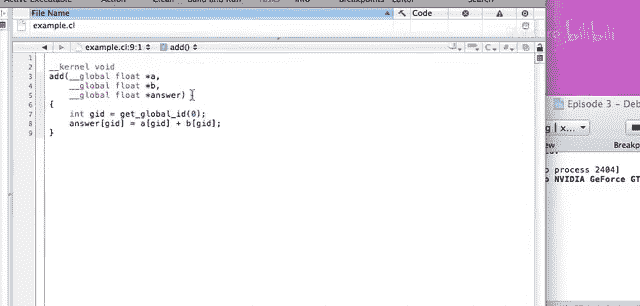
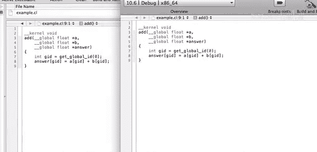
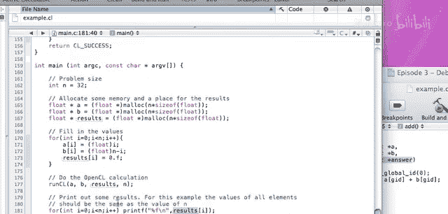
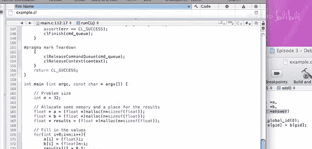
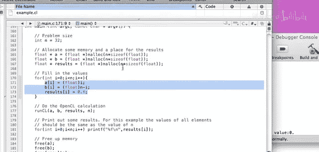
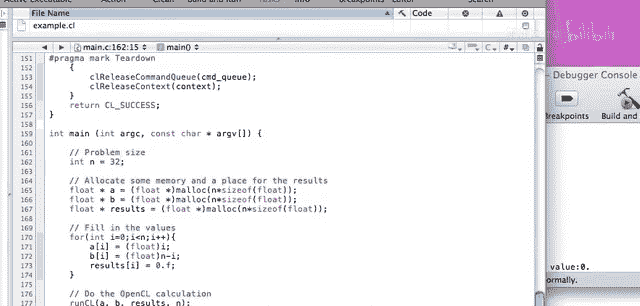

# 006：构建OpenCL项目 🚀

## 概述
在本节课中，我们将学习如何构建一个OpenCL项目。我们将更详细地探讨一些关键函数和功能，了解如何设置计算，以及如何使用像Xcode这样的工具来构建项目、运行计算和创建在底层使用OpenCL的应用程序。我们首先会回答一些常见问题，然后通过一个简单的示例项目来演示整个过程。

---

## 常见问题解答

上一节我们介绍了OpenCL的基础概念，本节中我们来看看一些开发者常遇到的问题。

### 双精度运算
双精度运算对许多科学计算至关重要。在OpenCL 1.0规范中，双精度是可选扩展。这意味着硬件和实现都必须支持它。你可以通过查询设备信息来检查是否支持双精度。如果支持，你需要在执行任何双精度计算语句之前使用一个特定的`#pragma`指令。如果不这样做，规范定义其行为是未定义的，可能导致计算崩溃或编译错误。

**核心概念**：使用`clGetDeviceInfo`查询`CL_DEVICE_EXTENSIONS`来检查是否支持`cl_khr_fp64`扩展。

需要注意的是，即使支持，双精度运算也可能带来显著的性能损失。例如，在GTX 285显卡上，单精度浮点运算可达约1000 GFLOP/s，而双精度可能只有约90 GFLOP/s。如果你的硬件不支持双精度，可以考虑使用混合精度算法来模拟。

### 面向对象编程
OpenCL基于C语言，本身不支持面向对象的概念。这意味着你不能将复杂的对象（如C++或Objective-C对象）直接传递到OpenCL内核中。

**核心概念**：内核参数必须是C语言的内置类型或OpenCL支持的扩展类型（如标量、向量、结构体）。结构体可以包含这些类型。

你可以从面向对象的程序中调用OpenCL例程，但需要先将对象数据转换为OpenCL能理解的原始类型数组（如`float*`），传递给内核处理，然后再将结果转换回对象。对于计算密集型任务，这种数据格式转换的开销通常可以忽略不计。

### 工作组大小与维度
工作组大小是性能调优的关键。全局工作组大小是你的问题规模（如一个包含16个元素的数组）。本地工作组大小必须是全局大小的整数因子，并且在CPU上必须为1（因为CPU上线程间同步开销极大）。

在GPU上，确定最佳本地工作组大小通常需要实验。它不应小于硬件的基本处理单元大小（NVIDIA的Warp是32个线程，AMD的Wavefront大小类似）。通常，2的幂次方或其组合是较好的选择。有时，为了对齐到2的幂次方，可能需要在数据末尾填充一些无操作的元素。

OpenCL支持将问题划分为一维、二维或三维（NDRange）。这主要是为了方便思考和索引，例如将图像处理视为二维问题，或将网格计算视为三维问题。目前没有证据表明不同维度划分会带来性能差异，选择哪种取决于哪种方式更符合你对问题的建模。

**核心概念**：
*   `size_t global_work_size = 16; // 总工作项数`
*   `size_t local_work_size = 2; // 每个工作组的工作项数，必须能整除global_work_size`
*   在CPU上：`local_work_size = 1;`
*   在GPU上：`local_work_size` 通常为 32, 64, 128, 256 等值进行试验。

### 适用的问题类型
许多典型的科学计算问题都适合用OpenCL/GPU处理，并且可以高效实现，例如：
*   快速傅里叶变换
*   基础线性代数子程序
*   LAPACK
*   蒙特卡洛模拟
*   偏微分方程

然而，并非所有算法都能在GPU上达到最优。关键通常在于数据布局。GPU对数据的存取模式有特定偏好，如果能将数据组织成合适的格式，性能会非常出色。有时，这可能意味着需要重构算法或创建临时数据结构。

另一个重要概念是：复杂的计算不需要在单个内核调用中完成。你可以将其分解为多个内核或多个队列调用。例如，共轭梯度算法包含多个步骤（如SAXPY操作、矩阵向量乘法），每个步骤可以是一个独立的内核，按顺序在队列中执行。

需要注意的是，一旦任务进入命令队列，就无法中途终止。因此，对于有提前退出条件（如收敛检查）的迭代算法，一种策略是：在CPU端设置固定迭代次数（如200次），执行完成后，将单个标量结果（如残差）读回CPU检查，再决定是否继续迭代。

---

## 关键OpenCL函数详解

在进入实际项目之前，让我们更深入地了解一些构建OpenCL程序时会用到的核心函数。

### 设备发现与信息查询
要使用OpenCL，首先需要发现可用的计算设备。

*   **`clGetDeviceIDs`**: 此函数用于获取设备列表。其第二个参数`device_type`至关重要，你可以指定寻找`CL_DEVICE_TYPE_CPU`、`CL_DEVICE_TYPE_GPU`、`CL_DEVICE_TYPE_ACCELERATOR`或`CL_DEVICE_TYPE_ALL`等。
*   **`clGetDeviceInfo`**: 获取设备的具体信息，例如供应商名称(`CL_DEVICE_VENDOR`)、全局内存大小(`CL_DEVICE_GLOBAL_MEM_SIZE`)、最大工作组大小(`CL_DEVICE_MAX_WORK_GROUP_SIZE`)以及支持的扩展列表(`CL_DEVICE_EXTENSIONS`)。这是你检查双精度支持等功能的途径。

### 程序构建与编译
OpenCL内核在运行时编译（即时编译）。

*   **`clBuildProgram`**: 编译链接着色器源代码创建程序对象。如果编译失败，你需要检查构建日志。
*   **`clGetProgramBuildInfo`**: 在`clBuildProgram`之后调用，特别是当构建失败时，用于获取构建日志(`CL_PROGRAM_BUILD_LOG`)，其中包含了编译器错误和警告信息，对于调试内核代码语法错误非常有用。

### 内存管理
数据需要在主机（CPU）内存和设备（如GPU）内存之间移动。

*   **`clCreateBuffer`**: 在设备上分配内存缓冲区。创建时可以指定内存标志，例如：
    *   `CL_MEM_READ_ONLY`: 内核只能读取此缓冲区。
    *   `CL_MEM_WRITE_ONLY`: 内核只能写入此缓冲区。
    *   `CL_MEM_READ_WRITE`: 内核可读写。
    *   使用`CL_MEM_USE_HOST_PTR`或`CL_MEM_ALLOC_HOST_PTR`可以在特定情况下优化主机与设备间的数据传输，但在GPU上频繁通过PCIe总线访问主机内存会非常慢，应避免。
*   **`clEnqueueWriteBuffer`**: 将数据从主机内存写入设备缓冲区。关键参数`blocking_write`：
    *   设为`CL_TRUE`（阻塞）：函数会等待数据复制完成才返回。确保数据在计算开始前已就位。
    *   设为`CL_FALSE`（非阻塞）：函数立即返回，复制操作在后台进行。如果内核紧接着启动，可能会读取到不完整或旧数据。
*   **`clEnqueueReadBuffer`**: 将计算结果从设备缓冲区读回主机内存。同样有`blocking_read`参数，通常使用阻塞读取以确保在后续处理前已获得完整结果。

### 内核执行
设置并启动内核进行计算。

*   **`clSetKernelArg`**: 为内核函数设置参数。你需要传递缓冲区对象（`cl_mem`）或标量值。
*   **`clEnqueueNDRangeKernel`**: 将内核执行命令放入命令队列。你需要指定全局工作大小（`global_work_size`）和可选的本地工作大小（`local_work_size`）。如果本地工作大小为`NULL`，OpenCL实现会尝试选择一个值。
*   **`clFinish`**: 阻塞主机程序，直到命令队列中的所有命令都执行完毕。在读取结果之前调用`clFinish`可以确保所有计算已经完成。

---


## 实战：一个简单的OpenCL Xcode项目

现在，让我们通过一个实际的Xcode项目来整合上述概念。这是一个极简的示例，目的是展示OpenCL项目的结构和基本流程。

### 项目概述
本项目实现了一个简单的向量加法（A + B = C）。它首先尝试在GPU上运行，如果找不到GPU，则回退到CPU。代码有详细注释，结构清晰。

以下是项目的主要步骤：



1.  **定义问题与主机数据**：在`main`函数中，定义问题大小（例如32），并在主机上分配并初始化输入数组A和B。
2.  **调用OpenCL运行函数**：将数据和控制权传递给`run_cl`函数。
3.  **设备发现与选择**：
    *   尝试获取GPU设备。
    *   如果失败，则回退到CPU设备。
    *   使用`clGetDeviceInfo`打印设备信息。
4.  **创建上下文和命令队列**：为选定的设备创建上下文和命令队列。
5.  **创建与构建程序**：
    *   从磁盘文件（`.cl`后缀）读取内核源代码。
    *   调用`clBuildProgram`编译程序。
    *   （可选）此处可添加错误检查，使用`clGetProgramBuildInfo`获取编译日志。
6.  **创建内核对象**：从已构建的程序中，通过内核函数名（`"add"`）创建内核对象。
7.  **分配设备内存**：
    *   为输入数组A和B创建`CL_MEM_READ_ONLY`缓冲区。
    *   为输出数组C创建`CL_MEM_WRITE_ONLY`缓冲区。
    *   使用`clEnqueueWriteBuffer`（阻塞方式）将A和B的数据传输到设备。
    *   调用`clFinish`确保数据传输完成。
8.  **设置内核参数**：使用`clSetKernelArg`将三个设备缓冲区设置为内核`add`的参数。
9.  **执行内核**：
    *   设置全局工作大小为问题大小（32）。
    *   本地工作大小设为`NULL`，让OpenCL自行决定。
    *   调用`clEnqueueNDRangeKernel`将内核放入队列。
    *   调用`clFinish`等待内核执行完毕。
10. **读取结果**：使用`clEnqueueReadBuffer`（阻塞方式）将结果从设备缓冲区C读回主机内存。
11. **清理资源**：释放OpenCL对象（缓冲区、内核、程序、队列、上下文）。
12. **验证结果**：控制权返回`main`函数，打印结果数组C。

### 内核代码 (`add.cl`)
内核文件非常简单，定义了加法操作。

```opencl
__kernel void add(__global const float* a,
                  __global const float* b,
                  __global float* c)
{
    // 获取当前工作项的全局ID
    int gid = get_global_id(0);
    // 执行加法
    c[gid] = a[gid] + b[gid];
}
```

### 关于内核代码管理的讨论
在项目中，内核代码通常以两种方式管理：
1.  **外部文件（如本例）**：优点是与主机代码分离，更清晰，易于编辑和调试。缺点是如果希望保护内核代码知识产权，需要额外处理（如预编译为二进制）。
2.  **内嵌为C字符串**：将内核源代码作为字符串常量写在主机代码中。这样做可以一定程度上混淆代码，但会使主机代码变得冗长且难以维护内核逻辑。

关于编译时机：
*   **即时编译（JIT）**：本例采用的方式。优点是可以针对运行时发现的特定硬件进行优化，可能获得最佳性能。编译开销通常在程序初始化阶段，对于长时间运行或计算密集型的应用来说可以接受。
*   **预编译**：OpenCL支持将内核预编译为二进制格式并直接加载。这可以保护知识产权并减少运行时编译开销。但缺点是失去了针对最终用户硬件进行特定优化的机会。

### 运行项目
在Xcode中构建并运行该项目，你将在控制台看到类似以下输出：
```
Device: NVIDIA GeForce GTX 285 by NVIDIA Corporation
Results: 2.0, 4.0, 6.0, ... , 64.0
```
这表示程序成功在GPU上执行了向量加法。



---

## 总结与资源





本节课我们一起学习了如何构建一个完整的OpenCL项目。我们从解答常见问题开始，涵盖了双精度支持、面向对象编程的局限性、工作组大小调优以及OpenCL适用的科学计算问题类型。接着，我们深入探讨了设备查询、程序构建、内存管理和内核执行等关键函数。最后，我们通过一个简单的Xcode示例项目，一步步演示了从主机代码编写、内核开发到项目运行的全过程。






**延伸阅读**：
1.  **稀疏矩阵向量乘法**：NVIDIA的Nathan Bell等人发表了一篇关于在GPU上实现稀疏矩阵向量乘法的优秀论文，详细讨论了存储格式和优化技巧，非常值得一读。
2.  **混合精度算法**：有一份在线演示文稿详细介绍了如何使用混合精度算法在支持有限精度的设备上模拟更高精度的计算，同时避免巨大的性能损失。

希望本教程能帮助你入门OpenCL项目开发。如果你有任何问题或评论，欢迎通过Macresearch.org网站或电子邮件提出。下次课程中，我们计划探讨数据布局、内存访问模式以及Warp/Wavefront等更深入的主题。