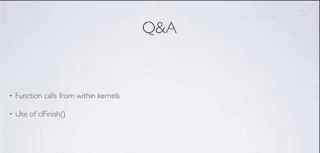

# 007：内存布局与访问 🧠


在本节课中，我们将学习OpenCL编程中至关重要的一个主题：内存布局与访问。理解如何高效地组织数据并访问内存，是充分发挥GPU性能的关键。我们将从GPU架构的视角出发，探讨数据对齐、合并访问、共享内存以及如何避免性能瓶颈。


---



## 概述

本节课我们将深入探讨GPU的内存架构，特别是NVIDIA硬件上的内存组织方式。我们将学习线程、线程块、warp等核心概念，并理解数据在全局内存和共享内存中的布局。通过一个矩阵转置的实例，我们将看到如何应用这些知识来优化内存访问，从而显著提升程序性能。

---

## GPU架构简介

上一节我们介绍了OpenCL的基本执行模型。本节中，我们来看看GPU的物理架构，特别是NVIDIA GPU的组成，这有助于我们理解内存访问模式背后的原因。

GPU的计算单元是分层组织的。在NVIDIA的术语中（对应OpenCL的工作项和工作组）：
*   **线程** 对应一个 **工作项**，执行一个内核实例。
*   **线程块** 对应一个 **工作组**，是线程的集合。

以GTX 285显卡为例，其核心架构如下：

*   **线程处理集群**：显卡上最粗粒度的计算单元，共有10个。
*   **流多处理器**：每个TPC包含多个SM。GTX 285有30个SM。
*   **流处理器**：每个SM包含8个流处理器（也称为“核心”）。整个显卡共有240个这样的核心。
*   **特殊功能单元**：每个SM有2个SFU，用于处理超越函数（如`sin`, `cos`, `sqrt`）。
*   **双精度单元**：每个SM有1个，用于双精度浮点计算。
*   **共享内存**：每个SM有16KB的超高速内存，供该SM内的所有流处理器共享，用于线程块内线程间的数据交换。

---

## 线程执行与Warp

理解了硬件组成后，我们来看看线程是如何在SM上调度和执行的。这直接关系到我们如何编写高效的内核。

每个SM可以并发执行多个线程块。线程块在硬件上被进一步细分为更小的调度单元，称为 **Warp**。在NVIDIA硬件上：
*   一个 **Warp** 包含 **32** 个线程。
*   一个Warp还可以分为两个 **Half-Warp**，每个包含16个线程。16这个数字在内存访问中尤为重要。

Warp中的32个线程以 **锁步** 方式执行相同的指令。这意味着如果代码中存在条件分支（如`if-else`），导致Warp内部分线程执行不同路径，那么所有路径将被**串行化**执行，从而造成性能损失。这种现象称为 **分支发散**，应尽量避免。

---

## 内存层次与访问模式

上一节我们了解了线程的执行方式。本节中我们来看看数据在GPU内存层次结构中的流动，特别是如何高效地从全局内存加载数据。

GPU拥有不同层次的内存，其速度和容量各不相同：
1.  **全局内存**：容量大，但延迟高（慢）。
2.  **共享内存**：位于SM上，容量小（如16KB），但速度极快，堪比寄存器。
3.  **寄存器**：速度最快，但数量有限。

为了隐藏全局内存的高延迟，GPU采用 **大规模多线程** 策略。当一个Warp因等待数据而暂停时，硬件会迅速切换到另一个就绪的Warp执行。因此，拥有足够多“在途”的线程有助于保持计算单元忙碌。

从全局内存加载数据时，最关键的概念是 **合并访问**。

---

### 合并访问与对齐

以下是访问全局内存时需要注意的几种情况：

*   **未对齐访问**：线程0的起始地址不是硬件加载大小（如64字节）的整数倍。这会导致低效的多次内存事务。
*   **交叉访问**：线程访问的内存地址不连续。硬件无法将其识别为一次大块加载，会导致多次串行加载。
*   **部分线程访问**：并非所有线程都参与加载。同样无法形成合并访问。
*   **理想情况：合并且对齐的访问**：一个Warp（或Half-Warp）的所有线程访问一段连续的、对齐的内存地址。硬件可以将其合并为一次大的内存事务（如一次加载64字节），这是最高效的方式。

**公式**：对于Half-Warp（16个线程）和`float`类型（4字节），一次理想的合并加载大小是：
`16 threads * 4 bytes/thread = 64 bytes`

---

## 共享内存与存储体冲突

我们已经知道如何高效地将数据读入芯片。接下来，我们看看如何利用共享内存来优化数据重用和访问模式。

共享内存被组织成多个 **存储体**。在当前的硬件上，通常有16个存储体。多个线程可以同时访问不同的存储体，从而实现极高的内存带宽。

然而，如果多个线程试图访问**同一个存储体**中的不同数据地址，就会发生 **存储体冲突**，导致对这些地址的访问被**串行化**，降低性能。

以下是共享内存访问模式的例子：

*   **无冲突访问**：每个线程访问不同存储体中的连续地址（步长为1）。这是最佳情况。
*   **广播**：所有线程读取**同一个地址**的数据。这是一种特殊情况，硬件会进行广播，不会导致冲突。
*   **存储体冲突**：多个线程访问同一个存储体中的不同地址（例如，步长为2的访问可能导致2路冲突）。这会导致串行化，应尽量避免。

**核心思想**：将数据从全局内存**合并**加载到共享内存后，线程可以在共享内存中自由地、快速地以任意模式访问所需数据，而无需担心全局内存访问的延迟和合并问题。

---

## 实战案例：矩阵转置

现在，让我们将前面学到的所有概念应用到一个实际例子中：矩阵转置。这个例子完美展示了共享内存和合并访问的价值。

矩阵转置操作（`B[y][x] = A[x][y]`）在直接使用全局内存时面临一个问题：要么读取是合并的但写入是交叉的，要么反之。这会导致低效的内存访问。

优化策略如下：

1.  **合并读取**：让一个线程块的所有线程从全局内存中**合并读取**一个数据块（例如，一块`16x16`的矩阵数据）到共享内存。每个线程负责读取一个元素。
2.  **共享内存中转**：数据现在位于高速的共享内存中。线程在共享内存中交换数据（进行转置操作）。由于共享内存访问速度快，且我们通过填充等手段可以避免存储体冲突，这一步开销很小。
3.  **合并写入**：线程块的所有线程将转置后的数据从共享内存**合并写入**到全局内存的输出矩阵中。

通过这个“全局内存 -> 共享内存 -> 全局内存”的流程，我们确保了在全局内存层面的读取和写入都是高效的合并访问，从而大幅提升性能。

**代码概念**：
```c
// 伪代码示意内核函数中的关键步骤
__kernel void transpose(__global float* input, __global float* output, __local float* block) {
    int local_x = get_local_id(0);
    int local_y = get_local_id(1);
    int global_in_x = get_group_id(0) * BLOCK_SIZE + local_x;
    int global_in_y = get_group_id(1) * BLOCK_SIZE + local_y;

    // 1. 合并读取：从输入矩阵读取到共享内存块
    block[local_y * (BLOCK_SIZE+1) + local_x] = input[global_in_y * WIDTH + global_in_x];
    barrier(CLK_LOCAL_MEM_FENCE); // 确保块内所有线程完成读取

    // 2. 在共享内存中交换索引（转置）
    int swapped_local_x = local_y;
    int swapped_local_y = local_x;

    // 3. 计算输出全局坐标
    int global_out_x = get_group_id(1) * BLOCK_SIZE + swapped_local_x;
    int global_out_y = get_group_id(0) * BLOCK_SIZE + swapped_local_y;

    // 4. 合并写入：从共享内存写入到输出矩阵
    output[global_out_y * WIDTH + global_out_x] = block[swapped_local_y * (BLOCK_SIZE+1) + swapped_local_x];
}
```
*注意：共享内存数组`block`的宽度被填充了1（`BLOCK_SIZE+1`），这是为了避免在从共享内存读取转置数据时发生存储体冲突。*

---

## 总结

本节课我们一起深入学习了OpenCL中内存布局与访问的核心知识。我们首先了解了NVIDIA GPU的基本架构，包括SM、Warp等概念。然后，我们重点探讨了如何实现高效的**合并内存访问**以利用全局内存带宽，以及如何利用**共享内存**来优化数据重用和访问模式。最后，通过**矩阵转置**的案例，我们看到了如何将这些理论应用于实践，通过“全局->共享->全局”的流程，将低效的交叉访问转化为高效的合并访问。

记住这些关键点：**对齐**、**合并**、**利用共享内存**、**避免分支发散和存储体冲突**。掌握它们是编写高性能OpenCL内核的基础。在接下来的课程中，我们将通过更多实际的内核优化示例来巩固这些概念。