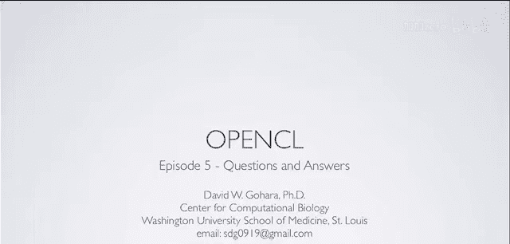
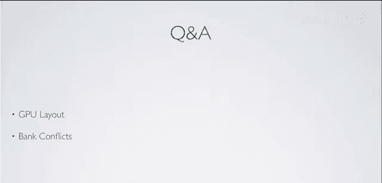

# 008：问题与解答 🎥

在本节课中，我们将专注于解答观众提出的两个核心问题：GPU硬件架构的术语解释，以及共享内存中“存储体冲突”的详细原理。我们将通过清晰的图示和简单的例子，帮助你理解这些关键概念。

---

## GPU硬件架构与术语解析 🧩

上一节我们介绍了GPU编程的基本概念，本节中我们来看看GPU硬件的具体组织方式，并澄清一些容易混淆的术语。

下图展示了一个典型的GPU（以NVIDIA 10系列架构为例）内部结构：

以下是其层级结构的分解：

*   **GPU**：整个黑色区域代表一个GPU芯片。
*   **线程处理集群**：每个深灰色方块代表一个**线程处理集群**。在10系列架构中，一个GPU包含10个TPC。
*   **流多处理器**：每个浅灰色方块代表一个**流多处理器**。每个TPC包含3个SM，因此一个GPU总共有 **30个SM**。
*   **核心/流处理器**：每个橙色小方块代表一个**核心**（也称为流处理器或标量处理器）。每个SM包含8个这样的核心，因此一个GPU总共有 **240个核心**。

**重要提示**：这里的“核心”概念与CPU的“核心”不同。GPU的“核心”主要指执行**单精度浮点运算和整数运算**的算术逻辑单元。而一个CPU核心则包含ALU、FPU、缓存、内存控制器等多种功能单元。这种术语差异有时是出于市场宣传，但理解其本质区别对编程至关重要。

此外，每个SM还包含其他专用硬件单元：
*   **双精度单元**：每个SM有1个，整个GPU共30个。
*   **特殊功能单元**：每个SM有2个，用于快速计算超越函数（如`sin`, `cos`）和倒数平方根等。整个GPU共60个。
*   **本地/共享内存**：用于SM内线程（或工作组）之间的数据共享。

---

## 深入理解存储体冲突 🔄

在上一节关于共享内存的讨论中，我们提到了“存储体冲突”会严重影响性能，并以矩阵转置为例说明了可能发生冲突的情况。本节我们将通过一个更详细的图示来彻底解释其原因。

首先，快速回顾共享内存的关键特性：
*   容量通常为16 KB。
*   分为 **16个存储体**，每个存储体1 KB。
*   每个存储体能提供32位（4字节）宽的数据访问。
*   **关键规则**：连续的32位字被分配到连续的存储体中。例如，地址0的字在存储体0，地址1的字在存储体1，……，地址16的字又回到存储体0，依此类推。
*   **存储体冲突**：当同一个**半线程束**（16个线程）中的两个或更多线程**同时访问同一个存储体**中的**不同数据**时，这些访问会被**序列化**（即一个一个执行），从而导致性能下降。唯一的例外是当所有线程访问同一个存储体中的**完全相同地址**的数据时，这属于“广播”操作，不会冲突。

现在，我们来看矩阵转置中导致冲突的具体场景。假设我们有一个包含32个元素（0-31）的数组，每个元素4字节。一个完整的线程束（32线程）处理所有数据，但硬件以半线程束（16线程）为单位调度。

**第一步：将数据从全局内存写入共享内存**
我们进行合并访问，每个线程写入共享内存中连续且对齐的位置。此时没有冲突。
*   元素 0 -> 存储体 0
*   元素 1 -> 存储体 1
*   ...
*   元素 15 -> 存储体 15
*   元素 16 -> 存储体 0 （因为只有16个存储体，所以取模16）
*   元素 17 -> 存储体 1
*   ...

**第二步：从共享内存读取以进行转置**
这才是问题所在。为了转置，线程的读取模式发生了变化：
*   `线程0` 读取 `元素0` （存储体0）
*   `线程1` 读取 `元素16` （存储体0）
*   `线程2` 读取 `元素32` （存储体0）
*   ...

你会发现，**同一个半线程束内的多个线程（线程0、1、2...）试图同时访问不同但都位于存储体0的数据**。根据上述规则，这构成了存储体冲突，硬件必须将这些访问序列化，严重拖慢速度。

**解决方案：填充共享内存数组**
解决方法是给共享内存数组增加**填充**。通常只需填充一个元素。

修改后的写入步骤：
*   我们声明共享内存数组的大小为 **17个元素**（而非16个），多出的一个位置作为填充，不使用。
*   写入数据时，我们仍然从全局内存合并读取，但写入共享内存时故意错位：
    *   全局`元素0` -> 共享`位置0` (存储体0)
    *   全局`元素1` -> 共享`位置1` (存储体1)
    *   ...
    *   全局`元素15` -> 共享`位置15` (存储体15)
    *   **共享`位置16` 留空（填充）**
    *   全局`元素16` -> 共享`位置17` (存储体**1**，因为17 mod 16 = 1)
    *   全局`元素17` -> 共享`位置18` (存储体**2**)
    *   ...

修改后的读取步骤：
*   `线程0` 读取共享`位置0` （存储体0）
*   `线程1` 读取共享`位置17` （存储体**1**）
*   `线程2` 读取共享`位置34` （存储体**2**）
*   ...

通过填充，原本会冲突的访问被分散到了不同的存储体，从而**避免了存储体冲突**。这种技术在处理需要非连续或跨步访问共享内存的算法（如矩阵转置、卷积等）时非常常见。

---

## 总结与资源 📚

本节课中我们一起学习了两个重点：
1.  **GPU架构术语**：理解了GPU由TPC、SM和核心构成的多层级结构，并明确了GPU“核心”与CPU“核心”的功能差异。
2.  **存储体冲突**：通过矩阵转置的详细例子，剖析了共享内存中存储体冲突产生的根本原因（多个线程同时访问同一存储体的不同数据），并掌握了通过**数组填充**这一有效方法来避免冲突。

希望这些解释能让之前感到困惑的概念变得清晰。要深入掌握OpenCL，持续的实践和查阅资料至关重要。

**延伸学习资源**：
*   本系列所有视频和资料均可在 [Macresearch.org/opencl](http://Macresearch.org/opencl) 找到。
*   网站还提供其他优秀教程，如Jerry McCormack的“Cocoa for Scientists”系列。
*   NVIDIA官方定期举办在线研讨会（Webinars），讲解CUDA、OpenCL等GPU编程技术，会后会提供视频，是很好的学习资源。

下一节课，我们将兑现承诺，通过一个**实际的应用示例**，把到目前为止学到的所有知识——内核编写、优化、利用本地/共享内存及填充技巧——融合贯通。敬请期待！

---
*注：部分提及的推广内容（如主机服务商、亚马逊商店）已按教程要求省略，仅保留核心学习资源链接。*