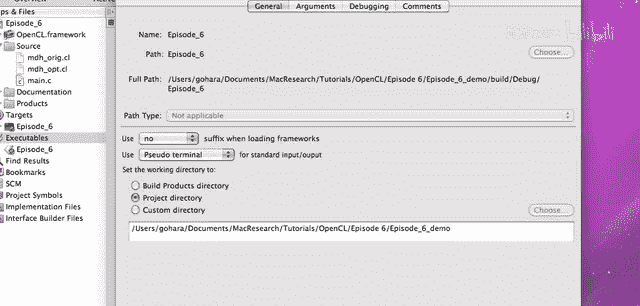
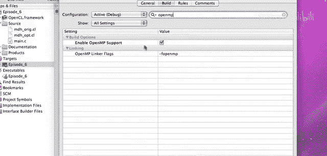
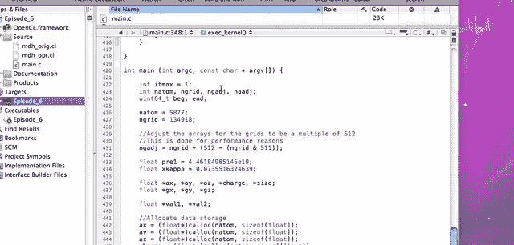
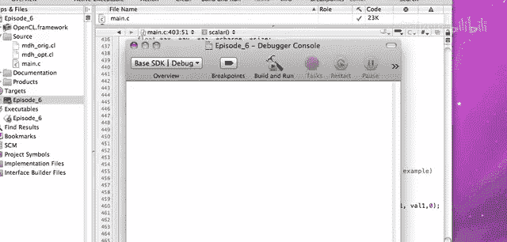

# 009：共享内存内核优化

在本节课中，我们将学习如何利用OpenCL的共享内存来优化内核性能。我们将通过一个源自真实科学计算程序（APBS）的代码示例，深入探讨共享内存的概念、如何通过协作加载数据来减少全局内存访问延迟，以及如何使用同步屏障来协调工作组内的工作项。通过对比优化前后的性能，你将直观地看到共享内存带来的巨大性能提升。

---

## 概述与背景

在之前的课程中，我们介绍了共享内存的基本概念和用途。本节课程将把这些概念付诸实践，通过一个具体的计算示例来展示如何利用共享内存进行内核优化。

这个示例计算生物分子中每个网格点的静电势能，其核心是对所有原子进行求和计算。在串行计算中，我们可以采用原子中心或网格中心的方法。但在并行环境中，特别是GPU上，网格中心的方法是更优的选择，因为它避免了数据竞争，也无需使用锁或归约操作。

## 核心计算与初始实现

计算的核心是为每个网格点累加所有原子的贡献值。公式上，这类似于库仑定律的扩展：

`网格点值 += 函数(原子坐标, 原子电荷, 原子半径, 网格点坐标)`

在CPU上，一个简单的串行实现是双层循环：

```c
for (每个网格点 i) {
    for (每个原子 j) {
        // 计算原子j对网格点i的贡献并累加
    }
}
```

当我们将此计算移植到GPU时，最直接的思路是将外层循环（网格点迭代）映射为全局工作项（NDRange）。每个工作项（对应一个网格点）独立地循环遍历所有原子。初始的、未优化的内核代码如下所示：

```opencl
__kernel void unoptimized_kernel(__global float* gridData,
                                 __global float* atomData,
                                 int numAtoms) {
    int gid = get_global_id(0); // 当前网格点ID
    float gridValue = 0.0f;
    // 假设atomData中按顺序存储了所有原子的x, y, z, charge, radius
    for (int atom = 0; atom < numAtoms; ++atom) {
        float dx = atomData[atom*5 + 0] - gridX[gid];
        float dy = atomData[atom*5 + 1] - gridY[gid];
        float dz = atomData[atom*5 + 2] - gridZ[gid];
        float charge = atomData[atom*5 + 3];
        float radius = atomData[atom*5 + 4];
        // ... 进行计算并累加到 gridValue ...
    }
    gridData[gid] = gridValue;
}
```

这种实现存在明显的性能问题：每个工作项都需要反复从全局内存中读取原子数据（坐标、电荷等）。尽管硬件可能会检测到相邻工作项在读取相同地址并进行合并访问，但在原子循环中，这种加载操作仍然是序列化的，会成为性能瓶颈。

## 共享内存优化策略

为了解决上述性能问题，我们引入共享内存。基本思路是：让一个工作组（Work-Group）内的所有工作项协作，将一大块原子数据从全局内存一次性加载到快速的共享内存中，然后所有工作项再从共享内存中读取数据进行计算。

我们首先在kernel中声明共享内存：

```opencl
__local float sharedAtomData[5 * LOCAL_SIZE];
```


这里，`LOCAL_SIZE`是工作组的大小（例如64）。我们分配了5倍于工作组大小的浮点数空间，用于连续存储原子的X、Y、Z坐标、电荷和半径数据。





上一节我们介绍了优化策略，本节中我们来看看具体的实现步骤。以下是优化后内核中内层循环的主体结构：



1.  **协作加载数据**：工作组以`LOCAL_SIZE`为步长，分批处理原子。在每一批中，每个工作项负责将特定原子的数据从全局内存拷贝到共享内存的指定位置。
2.  **同步屏障**：确保工作组内所有工作项都完成数据拷贝后，才能进行下一步计算。
3.  **共享内存计算**：所有工作项从共享内存中读取当前批次的原子数据，并行完成各自网格点的部分累加计算。
4.  **再次同步**：确保所有工作项都使用完当前批次的共享内存数据后，才能加载下一批数据，防止数据被覆盖。

对应的内核代码片段如下：

```opencl
for (int atomBase = 0; atomBase < numAtoms; atomBase += LOCAL_SIZE) {
    int loadLimit = min(LOCAL_SIZE, numAtoms - atomBase);
    int localIdx = get_local_id(0);

    // 步骤1: 协作加载数据到共享内存
    if (localIdx < loadLimit) {
        int globalAtomIdx = atomBase + localIdx;
        sharedAtomData[localIdx + 0*LOCAL_SIZE] = atomData[globalAtomIdx*5 + 0]; // X
        sharedAtomData[localIdx + 1*LOCAL_SIZE] = atomData[globalAtomIdx*5 + 1]; // Y
        sharedAtomData[localIdx + 2*LOCAL_SIZE] = atomData[globalAtomIdx*5 + 2]; // Z
        sharedAtomData[localIdx + 3*LOCAL_SIZE] = atomData[globalAtomIdx*5 + 3]; // Charge
        sharedAtomData[localIdx + 4*LOCAL_SIZE] = atomData[globalAtomIdx*5 + 4]; // Radius
    }

    // 步骤2: 等待所有工作项完成加载
    barrier(CLK_LOCAL_MEM_FENCE);

    // 步骤3: 从共享内存进行计算
    for (int i = 0; i < loadLimit; ++i) {
        float dx = sharedAtomData[i + 0*LOCAL_SIZE] - gridX[gid];
        float dy = sharedAtomData[i + 1*LOCAL_SIZE] - gridY[gid];
        float dz = sharedAtomData[i + 2*LOCAL_SIZE] - gridZ[gid];
        float charge = sharedAtomData[i + 3*LOCAL_SIZE];
        float radius = sharedAtomData[i + 4*LOCAL_SIZE];
        // ... 进行计算并累加到 gridValue ...
    }

    // 步骤4: 等待所有工作项完成计算，再开始下一批次
    barrier(CLK_LOCAL_MEM_FENCE);
}
```

## 同步屏障的重要性

同步屏障（`barrier`）在此优化中至关重要。第一个屏障确保了在计算开始前，所有需要的原子数据都已安全地驻留在共享内存中。如果没有这个屏障，执行得快的工作项可能会读到尚未被其他工作项加载的无效数据。



第二个屏障确保了在覆盖共享内存以加载下一批原子数据之前，所有工作项都已经完成了对当前批次数据的计算。省略这个屏障可能导致数据竞争和计算结果错误。

## 性能对比与总结

通过实际运行示例代码，我们可以得到清晰的性能对比：

*   **CPU单线程**：约 25-32 秒
*   **CPU多线程（16核，OpenMP）**：约 2.5 秒 （比单线程快约10倍）
*   **GPU未优化内核**：约 1.2 秒 （已比单线程CPU快约20倍）
*   **GPU共享内存优化内核**：约 0.125 秒 （比未优化GPU内核快约10倍，比单线程CPU快约200倍）

本节课中我们一起学习了如何利用OpenCL共享内存进行内核优化。关键点包括：
1.  识别出内核中频繁访问的只读数据（本例中的原子数据）。
2.  使用共享内存作为高速缓存，由工作组协作加载数据块。
3.  正确使用同步屏障来协调工作组内工作项的执行顺序，保证数据一致性。
4.  通过将全局内存访问转换为共享内存访问，显著降低了内存延迟，从而极大提升了内核性能。


这个示例充分表明，理解硬件特性（如内存层次结构）并据此设计算法，是释放GPU强大并行计算能力的关键。你可以下载并修改附带的代码，尝试调整工作组大小或注释掉屏障语句，以更深入地观察其影响。

---
**注意**：如果您的系统只有一块显卡，运行长时间计算的GPU内核可能导致显示界面暂时无响应，因为图形命令队列可能被计算任务阻塞。建议在测试时调小问题规模，或使用专用于计算的第二块GPU。