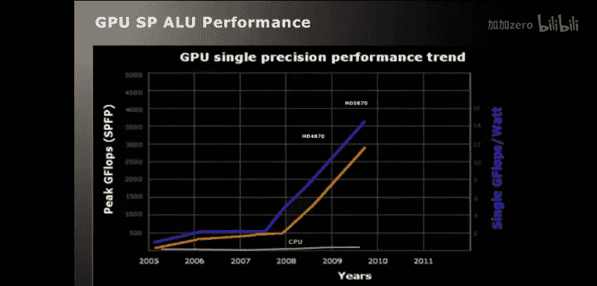
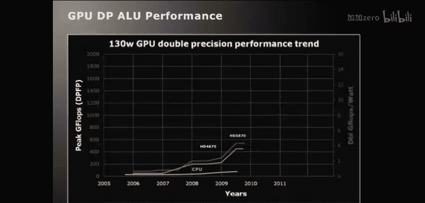
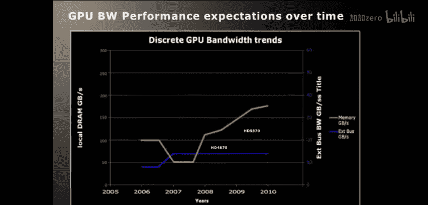
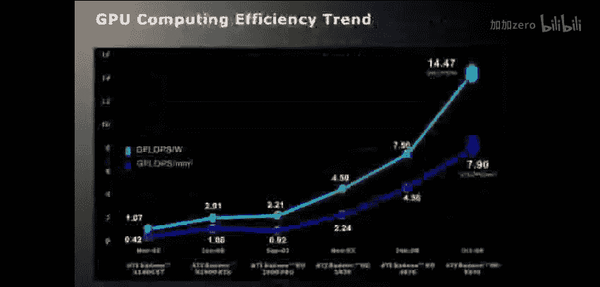
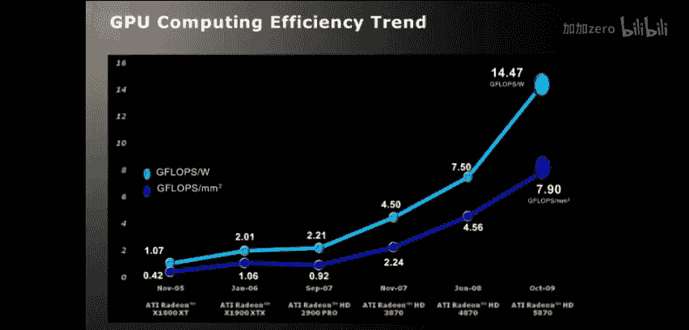
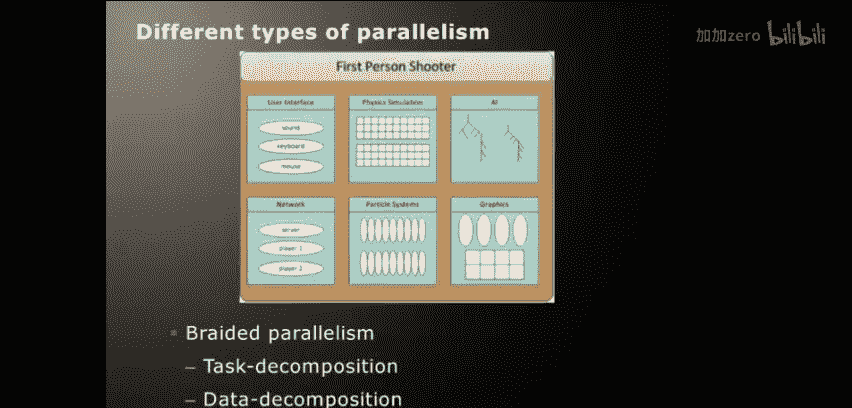
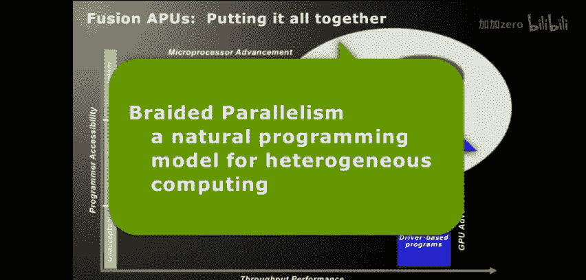

# 010：并行与异构计算入门 🚀

## 概述
在本节课中，我们将要学习并行与异构计算的基本概念。我们将探讨为什么传统的单核处理器性能提升遇到了瓶颈，以及如何通过并行计算和异构系统（特别是结合CPU和GPU）来应对这一挑战。我们还将介绍相关的术语，并展望未来的编程模型发展趋势。

---

## 为什么需要并行计算？ ⚡
在2005年，Herb Sutter提出了著名的“免费午餐已经结束”的观点。这意味着硬件厂商不能再仅仅依赖提升时钟频率、优化指令级并行性或增加缓存大小来获得显著的性能提升。物理限制和功耗问题成为了主要瓶颈。

因此，性能提升的关键转向了**并行性**。通过让多个计算核心同时执行独立的任务，我们可以在不显著增加功耗的前提下，大幅提升计算能力。

**核心概念**：并行性是指计算中各个部分相互独立，因此可以**同时执行**，从而缩短整体计算时间。

---

## 关键术语定义 📖
在深入讨论之前，让我们明确几个核心术语的定义，以确保我们在同一基础上进行交流。

### 并行性 vs. 并发性
*   **并行性**：这是一种计算属性，指的是计算的各个部分相互独立，因此可以**同时执行**。其核心目标是**提升性能**。
    *   **示例**：计算 `A = B + C` 和 `D = E * F` 这两个赋值语句是独立的，可以并行执行。
*   **并发性**：这是一种逻辑上的编程抽象，允许构建可以相互通信的多个任务。它**不强制要求**任务同时执行。
    *   **示例**：在单核处理器上运行两个线程。处理器通过时间片轮转交替执行它们，从逻辑上看它们是并发运行的，但并非物理上的并行。

**简单来说**：并行关乎**物理执行**（同时发生），而并发关乎**逻辑结构**（可能同时发生）。

### 异构计算
异构计算是指一个系统由**两个或更多在结构上存在显著差异的计算引擎**组成。

*   **典型例子**：传统的CPU和GPU组合。
    *   **CPU**：专为低延迟、复杂控制流和顺序任务优化，拥有大容量缓存。
    *   **GPU**：专为高吞吐量、数据并行任务设计，采用大规模多线程架构。

### 融合架构
这是AMD提出的愿景，旨在将CPU和GPU（可能还有其他计算单元）**集成到同一块硅芯片**上。这种设计旨在实现高性能、低功耗，并简化编程模型。

**核心优势**：CPU和GPU可以共享内存，极大减少了数据拷贝和通信开销。

---

## 异构世界的硬件展望 🖥️
上一节我们介绍了基本概念，本节中我们来看看硬件是如何演进来支持异构计算的。

### 计算平台的演进
计算平台的发展大致经历了三个阶段：
1.  **单核时代**：依赖提升时钟频率和指令级并行性。最终受限于功耗和物理极限。
2.  **多核时代**：通过增加处理器核心数量来提升性能。但面临缓存一致性带来的可扩展性挑战和软件并行化的难题。
3.  **异构时代（当前）**：我们正处在这个时代的开端。通过结合不同架构的计算单元（如CPU和GPU），利用各自的优势。GPU因其在数据并行任务上的极高能效而成为关键。

### 为什么GPU如此重要？
以下是GPU的一些关键优势：
*   **极高的计算吞吐量**：现代GPU能提供每秒数万亿次浮点运算（TeraFLOPS）的性能。
*   **高内存带宽**：专用显存提供远超系统内存的带宽。
*   **优异的能效比**：在单位功耗和单位面积上，GPU能提供比CPU高得多的计算性能。

**公式示例**：`性能提升 ≈ (GPU计算单元数量) × (并行任务数量)`

### 为什么仍然需要CPU？
尽管GPU强大，但CPU不可或缺，原因如下：
*   **处理串行和任务并行工作负载**：擅长处理低延迟、分支密集型的标量代码。
*   **庞大的软件生态**：需要支持现有的操作系统（如Windows、Linux）和成千上万的应用程序。
*   **控制与协调**：负责系统管理、I/O操作以及为GPU准备和调度任务。

**结论**：未来的方向不是用GPU取代CPU，或将CPU变成巨型GPU，而是让两者**紧密协同**，各自处理最擅长的任务。

### AMD融合架构示例
传统的PC系统中，CPU和GPU是独立的设备，通过PCIe总线连接，并拥有各自独立的内存。数据交换需要显式的拷贝操作。

在AMD的融合架构中，CPU和GPU被集成到同一块芯片（APU）上：
*   **共享系统内存**：CPU和GPU可以直接访问同一块内存，消除了大量数据拷贝。
*   **更低延迟通信**：芯片内部的通信延迟远低于通过PCIe总线。
*   **更简化的编程模型**：为未来实现更统一的内存访问模型（如GPU直接引用CPU指针）奠定了基础。

**注意**：初代融合APU的GPU性能可能不及高端独立显卡，但其在简化编程和降低特定场景延迟方面优势明显。未来会有面向不同市场（从移动设备到数据中心）的、性能更强的融合产品。

---

## 异构世界的软件挑战 💻
上一节我们探讨了硬件趋势，本节中我们来看看随之而来的软件编程挑战和可能的解决方案。

未来的性能提升完全取决于**软件**，即我们如何有效地为这些异构系统编程。

### 并行化方法
主要有两种分解问题以实现并行的方法：

**1. 任务并行**
任务并行侧重于将问题分解为多个不同的、可以独立或按依赖关系执行的任务。

**以下是任务并行的关键特点：**
*   **任务间可能存在依赖**。
*   **需要任务间通信**。
*   **核心是负载均衡**：动态地将任务分配给空闲的计算核心，以最大化资源利用率。

**相关技术示例**：Intel TBB, Apple GCD, OpenMP tasks, Microsoft TPL。

**2. 数据并行**
数据并行侧重于对大量独立的数据元素应用相同的操作。

**以下是数据并行的关键特点：**
*   **核心是同时处理大量数据元素**。
*   **元素间通常独立，但也可支持局部通信**（如粒子系统模拟中邻近粒子的交互）。
*   **非常适合GPU加速**。

**相关技术示例**：OpenCL, CUDA, OpenMP (SIMD), Microsoft Accelerator。

### 编织并行：未来的方向
大多数现实世界的应用程序（如现代游戏）同时包含任务并行和数据并行的元素。这种混合模式被称为“编织并行”。

**示例**：在一个游戏场景中：
*   **AI逻辑、用户输入处理**：属于任务并行。
*   **粒子系统、物理模拟**：属于数据并行。

未来的编程模型需要自然地支持这种**任务并行与数据并行的结合**，并能智能地将不同部分调度到最适合的计算单元（CPU或GPU）上执行。

### OpenCL的角色
OpenCL是一个低级别的编程模型，支持在CPU、GPU和其他加速器上执行数据并行任务。它是实现异构计算的重要工具之一。

**OpenCL与CUDA**：两者都是GPGPU编程语言，设计用于在GPU上高效运行数据并行任务，共享许多特性。OpenCL的优势在于其跨平台和跨厂商的开放性。

**当前局限与未来**：目前，OpenCL提供了源码可移植性，但难以实现**性能可移植性**（即同一段代码在CPU和GPU上都能高效运行）。未来的发展（如更高级的容器类型、编译器优化）将致力于改善这一点，并更好地与任务并行框架集成，以支持“编织并行”。

---

## 总结 🎯
本节课中我们一起学习了并行与异构计算的基础知识。

我们首先了解了为什么需要从串行计算转向并行计算。然后，我们明确了并行性、并发性和异构计算等关键术语。接着，我们探讨了硬件向异构时代演进的趋势，特别是AMD融合架构如何将CPU和GPU的优势结合。最后，我们审视了随之而来的软件挑战，介绍了任务并行和数据并行两种方法，并指出结合两者的“编织并行”模型与OpenCL等工具将是应对异构系统编程的关键。

异构计算的时代刚刚开始，如何为其编写高效、简洁的程序是留给整个行业的核心问题。