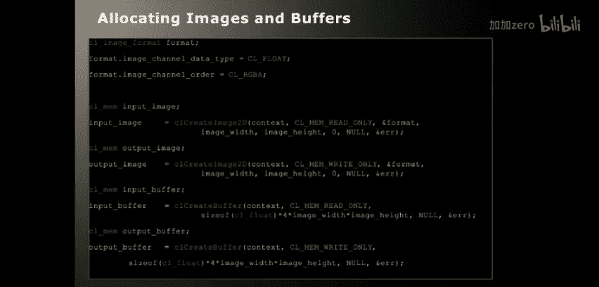
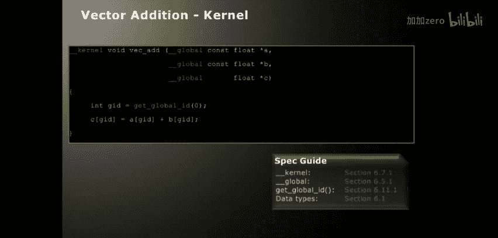
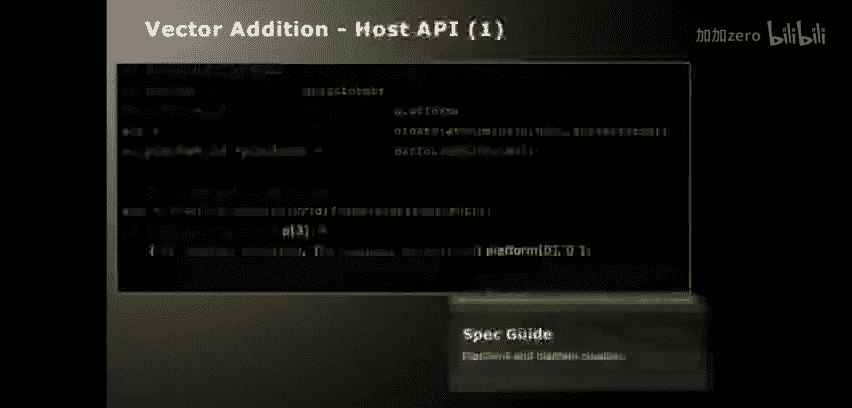
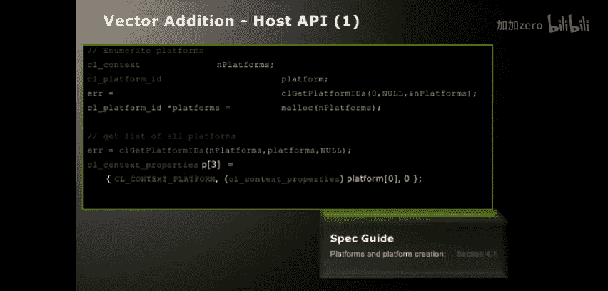
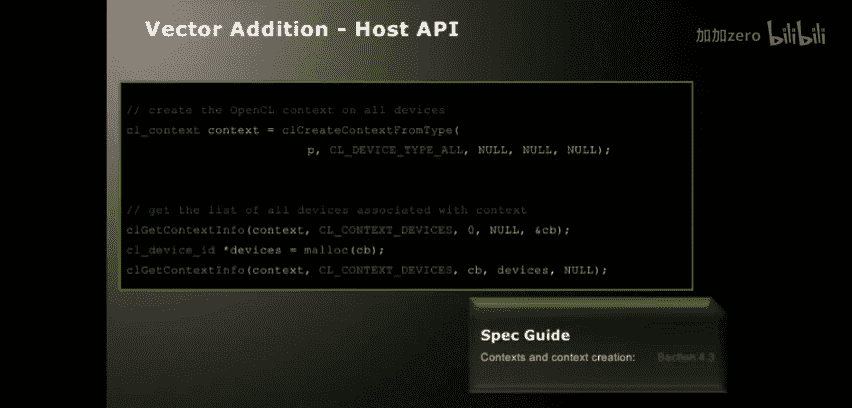
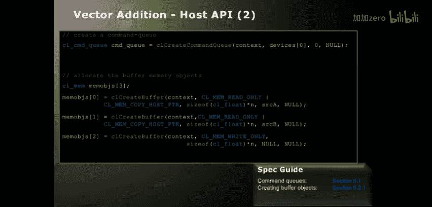
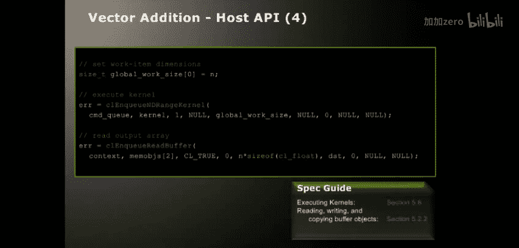

# 011：OpenCL简介 🚀

在本节课中，我们将要学习OpenCL的基础概念、核心架构以及一个简单的编程流程。OpenCL是一个用于编写在异构平台（如CPU、GPU）上运行程序的框架，它允许开发者利用多种设备的并行计算能力来加速应用程序。

---

## 什么是OpenCL？🤔

OpenCL是一个基于平台的编程模型。在这个模型中，有一个主机（通常是传统的CPU），它通过某种总线（如PCI Express或HyperTransport）连接到一个或多个计算设备。这些设备可以是另一个CPU、GPU或其他类型的加速器。

从OpenCL的视角看，一个设备被视为一组**计算单元**的集合。每个计算单元又进一步划分为多个**处理元素**，这些元素以**单指令多数据**的方式执行指令。

OpenCL的执行模型基于**内核**的概念。内核是可执行代码的基本单位，类似于C语言中的函数。它定义了一个可以从主机程序调用的入口点，用于在设备上执行计算任务。

---

## OpenCL执行模型 ⚙️

OpenCL主要支持两种执行模型：**数据并行**和**任务并行**。

### 数据并行模型

数据并行模型是当前最高效的模型，尤其适合GPU类设备。在这个模型中，计算被定义在一个N维的**计算域**中。

*   **全局工作项**：计算域中的每个独立元素称为一个**工作项**。所有工作项可以并行执行。
*   **工作组**：工作项可以被分组为**工作组**。工作组在一个SIMD核心上执行。
*   **关键特性**：工作组内的**工作项可以共享本地内存**，并且**可以进行同步**。这使得工作组内的通信变得非常高效。然而，不同工作组之间的工作项不能直接进行快速通信。

**数据并行示例**：
假设我们要处理一个1024x1024的图像，这就是我们的全局问题维度。我们将为图像中的每个像素（即每个工作项）启动一个内核实例。

传统CPU上的标量乘法循环代码：
```c
for (int i = 0; i < N; i++) {
    result[i] = inputA[i] * inputB[i];
}
```
在OpenCL内核中，循环被隐式化，通过`get_global_id`函数获取每个工作项的索引：
```c
kernel void vec_mul(global float* A, global float* B, global float* result) {
    int id = get_global_id(0);
    result[id] = A[id] * B[id];
}
```

### 任务并行模型

在任务并行模型中，内核仅使用**单个工作项**执行。这对于在CPU设备上运行本机编译的代码、集成现有C/C++库或利用OpenCL的队列模型进行任务调度非常有用。

---

## OpenCL内存模型 🧠

OpenCL明确地暴露了设备（尤其是GPU）的内存层次结构，这与传统的C语言内存模型不同。

以下是OpenCL的主要内存空间：

*   **主机内存**：由主机（CPU）管理的内存。
*   **全局内存**：所有工作项和工作组都可以访问的内存区域。访问延迟较高。
*   **常量内存**：全局可见的只读内存，通常放置在高速缓存中。
*   **本地内存**：在工作组内共享的内存。访问速度非常快，但需要程序员显式管理。
*   **私有内存**：每个工作项私有的内存。

**关键点**：在OpenCL中，**所有内存管理都必须是显式的**。这意味着数据在主机内存、全局内存和本地内存之间的移动需要通过明确的API调用或内核中的加载/存储操作来完成。

---

## OpenCL框架与对象 🏗️

使用OpenCL编程主要涉及创建和管理一系列对象。

### 核心对象

以下是使用OpenCL框架时需要了解的核心对象：

*   **平台**：代表一个特定的OpenCL实现（如AMD或NVIDIA的实现）。
*   **设备**：系统中的计算单元（如CPU或GPU）。可以通过API查询设备的能力。
*   **上下文**：将一组设备和内存对象关联在一起的对象。它定义了这些内存对象之间的一致性模型。
*   **命令队列**：与特定设备和上下文关联，用于向设备提交命令（如内核执行、内存传输）。
*   **内存对象**：包括**缓冲区**（一维内存块）和**图像**（用于优化图像访问的特殊不透明类型）。
*   **程序对象**：封装了OpenCL C源代码或二进制代码，包含一个内核列表。
*   **内核对象**：代表程序中的一个内核函数，可以为其设置参数并排队执行。
*   **事件对象**：用于处理命令之间的依赖关系和同步，因为大多数`clEnqueue*`命令都是异步执行的。

### 基本工作流程

一个典型的OpenCL应用程序遵循以下步骤：

1.  **查询并选择平台和设备**。
2.  **创建上下文和命令队列**。
3.  **创建内存对象**（缓冲区/图像）。
4.  **创建程序对象，编译OpenCL C源代码，并从中提取内核对象**。
5.  **为内核对象设置参数**。
6.  **将内核执行命令放入命令队列**。
7.  **排队进行内存读写操作，以传输数据**。
8.  **使用事件来同步命令的执行**。

---



## OpenCL C语言简介 📝

OpenCL C是基于C99的语言，用于编写在内核中执行的代码。它包含一些限制和许多针对并行计算的扩展。

### 主要特性

*   **基于C99**：但不支持递归等特性。
*   **并行工作项函数**：例如`get_global_id`、`get_local_id`、`get_group_id`，用于获取工作项在计算域中的位置信息。
*   **地址空间限定符**：如`__global`、`__local`、`__constant`、`__private`，用于指定变量的存储位置。
*   **向量类型**：支持长度为2、4、8、16的向量（如`float4`、`int8`），并提供了丰富的向量操作函数。
*   **同步原语**：如`barrier`，用于工作组内的同步。
*   **大量内置函数**：包括数学函数、几何函数、图像读写函数等。

### 内核示例

以下是一个简单的向量加法内核：
```c
kernel void vec_add(__global const float* a,
                    __global const float* b,
                    __global float* result) {
    int gid = get_global_id(0);
    result[gid] = a[gid] + b[gid];
}
```

---

## 一个完整的简单示例 🔧

让我们将以上概念整合到一个完整的、简化的主机端代码流程中，实现向量加法。





**步骤概述**：
1.  获取平台和设备。
2.  创建上下文和命令队列。
3.  创建输入和输出的缓冲区。
4.  创建程序，编译内核源代码。
5.  创建内核对象并设置其参数。
6.  执行内核。
7.  将结果读回主机。







**简化代码流程**：
```c
// 1. 获取平台和设备ID
cl_platform_id platform;
cl_device_id device;
clGetPlatformIDs(1, &platform, NULL);
clGetDeviceIDs(platform, CL_DEVICE_TYPE_GPU, 1, &device, NULL);



// 2. 创建上下文和命令队列
cl_context context = clCreateContext(NULL, 1, &device, NULL, NULL, NULL);
cl_command_queue queue = clCreateCommandQueue(context, device, 0, NULL);

// 3. 创建缓冲区
cl_mem bufA = clCreateBuffer(context, CL_MEM_READ_ONLY, size, NULL, NULL);
cl_mem bufB = clCreateBuffer(context, CL_MEM_READ_ONLY, size, NULL, NULL);
cl_mem bufResult = clCreateBuffer(context, CL_MEM_WRITE_ONLY, size, NULL, NULL);

// 4. 创建并构建程序
const char* source = "kernel void vec_add(...) {...}";
cl_program program = clCreateProgramWithSource(context, 1, &source, NULL, NULL);
clBuildProgram(program, 1, &device, NULL, NULL, NULL);

// 5. 创建内核并设置参数
cl_kernel kernel = clCreateKernel(program, "vec_add", NULL);
clSetKernelArg(kernel, 0, sizeof(cl_mem), &bufA);
clSetKernelArg(kernel, 1, sizeof(cl_mem), &bufB);
clSetKernelArg(kernel, 2, sizeof(cl_mem), &bufResult);

// 6. 执行内核
size_t global_work_size = N;
clEnqueueNDRangeKernel(queue, kernel, 1, NULL, &global_work_size, NULL, 0, NULL, NULL);

// 7. 读取结果（阻塞方式，隐含了等待内核完成）
clEnqueueReadBuffer(queue, bufResult, CL_TRUE, 0, size, host_result_ptr, 0, NULL, NULL);
```

---

## 总结 📚

本节课中我们一起学习了OpenCL的基础知识。我们了解到OpenCL是一个用于异构计算的开放标准框架，它通过**数据并行**和**任务并行**模型，允许程序利用CPU、GPU等多种设备的计算能力。

我们探讨了OpenCL的**平台模型**、**执行模型**（特别是基于工作项和工作组的数据并行）以及**显式的内存层次结构**。我们还介绍了OpenCL框架中的核心**对象**（如上下文、队列、缓冲区、内核）和基本工作流程。最后，我们简要了解了用于编写内核的**OpenCL C语言**，并通过一个向量加法的例子串联了整个编程过程。

OpenCL提供了对硬件底层的控制能力，虽然编程模型稍显复杂，但对于具有大量并行性且对性能有要求的应用程序，它能带来显著的加速效果。在接下来的课程中，我们将深入探讨GPU架构、OpenCL C语言细节以及性能优化技巧。