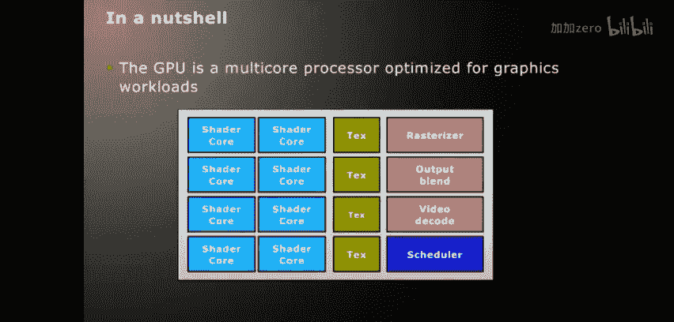
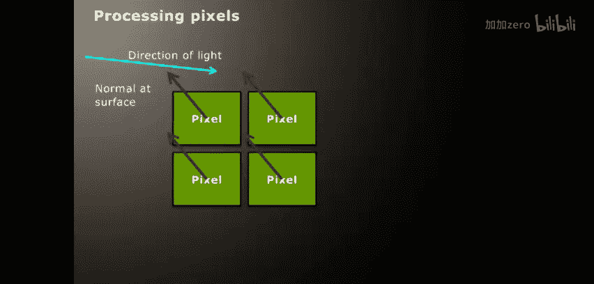
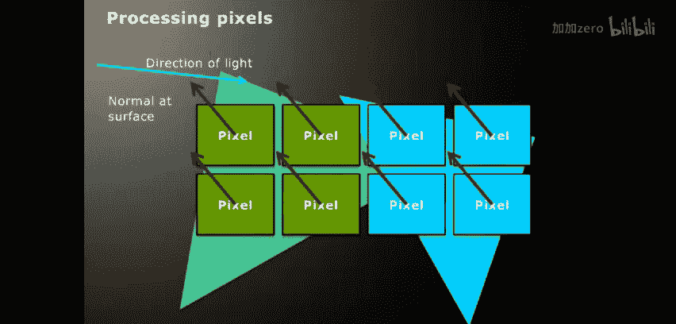
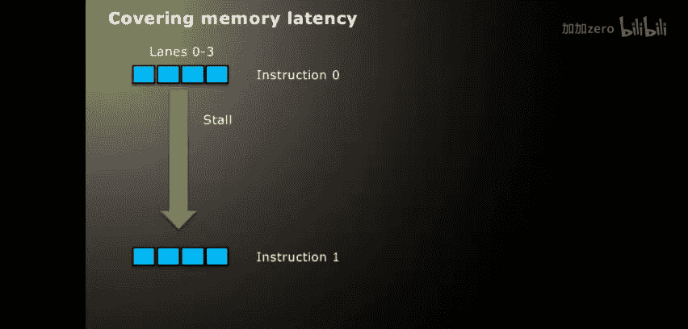
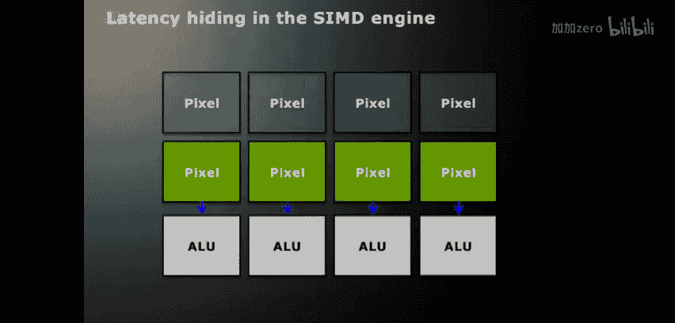
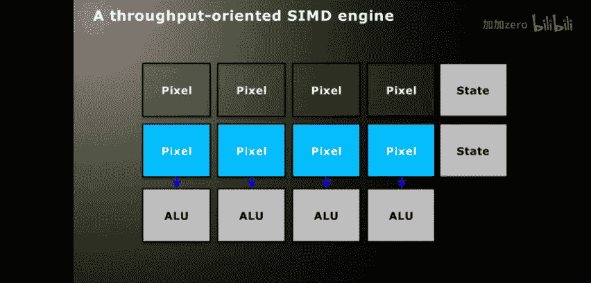
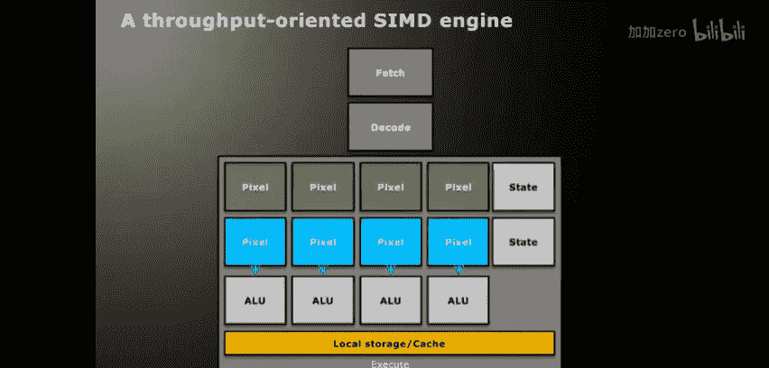
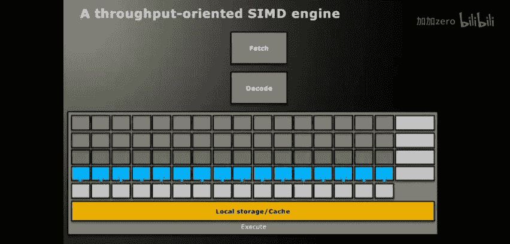
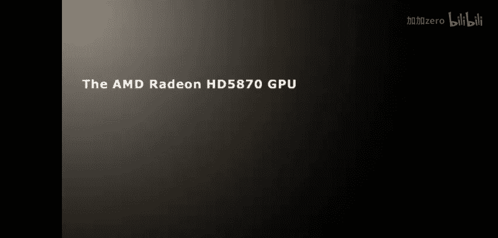

# 012：从图形处理器到通用计算

在本节课中，我们将要学习GPU架构的基础知识，特别是从图形处理到通用计算的演变过程。我们将探讨GPU设计的核心理念，以及它与CPU的根本区别。

## 什么是GPU？

从计算程序员的视角来看，GPU是一个为处理像素而优化的多核处理器。它拥有宽SIMD核心，以实现高度的数据并行性，其核心设计侧重于吞吐量而非延迟。

## 图形处理基础

上一节我们介绍了GPU的基本定义，本节中我们来看看它的起源——图形处理。

假设我们正在处理单个像素的数据。我们可能有一个定义在缓冲区中的光源、像素的颜色和法线等属性。我们可以从输入寄存器中读取这些值，计算光源如何影响像素，并生成输出颜色。这个过程很简单。

当然，我们可以同时处理多个像素。在图形处理中，**四边形**是大多数GPU处理的基本单位。四边形是渲染API绘制到屏幕上的多边形的一部分。光栅化硬件会根据DirectX或OpenGL传递的多边形输入流来生成四边形以供硬件处理。

当我们想要生成输出结果时，会执行一个**片段程序**。这个程序使用GLSL或HLSL等语言编写。重要的是，程序被写成独立的形式，它只与单个像素相关，完全不考虑像素如何组合在一起。程序的输出仅取决于与该特定像素相关的输入，并且没有像素间的通信。这使得硬件能够进行非常高效的并行处理，而无需进行依赖性分析。

早期的通用GPU计算就是以这种方式进行的，使用屏幕多边形来生成大型矩形工作负载。

此外，对于每个多边形，我们可能运行一个略有不同的片段程序。因此，除了需要执行顶点数据处理、光栅化等操作外，GPU在**线程级并行**方面也有很高的要求，这也影响了其设计。

## SIMD执行与分支

上一节我们了解了GPU如何处理图形像素，本节中我们来看看这种处理方式如何塑造了其核心执行模型——SIMD。

像素数据是图形工作负载的主要组成部分，因此影响了硬件的设计方式。我们仍然以四边形为例。编写代码时，为每个像素单独考虑程序是合理的，因为这是我们生成数据的层面。我们通常不知道像素在屏幕上的具体位置或其与其他像素的关系。

这意味着硬件层面的数据并行执行是从一个无依赖性的程序中推断出来的。我们知道每个像素可以独立并行执行，但同时它们执行的是相同的程序（或至少是同一小组像素），因为它们运行的是相同的着色器代码。GPU的前端光栅化和工作调度硬件会将来自同一多边形的四个相邻像素打包成一个四边形，并努力将来自相似多边形或单个较大多边形的四边形打包在一起，以便执行相同的着色器代码。

由此我们首先可以看到，我们可以将这些像素映射到一个**SIMD引擎**上。这意味着**单指令，多数据**。所有四个像素将同时执行相同的指令和程序。这类似于x86处理器的SSE扩展。在AMD的GPU硬件上，这被称为一个**波前**。

这带来了很高的ALU密度。但当代码中出现分支时，问题就来了。现在，多个独立的程序在单个SIMD单元上一起执行，这意味着它们都执行那条单一指令。如果分支走向一致，则没有问题。如果不一致，我们可能会看到以下情况：

首先，从内存中进行的第一次收集操作将是单个指令中每个像素的内存地址集合。然后，我们遇到一个条件判断。这将生成一个**掩码**。如果掩码指示所有分支走向相同，硬件可能会执行一个“全部投票”指令，将其转换为分支。但如果像本页所示，并非所有像素都满足条件，我们不希望它们全部执行。然而，由于这是SIMD指令，无法避免执行，指令仍会为所有四个通道发出。因此，硬件会使用计算出的掩码来屏蔽掉不满足条件的像素，只输出满足条件的像素的结果。然后，当执行到`else`部分时，我们将反转掩码，剩余的像素将由后续的条件赋值指令处理。最后，返回语句将再次为所有四个通道执行。

因此，原本看似四个操作（读取、测试、赋值、返回）的着色器，变成了六个操作：条件赋值、反转第一个掩码、条件赋值和返回。这对于四边形中的所有四个像素，乃至整个64宽的波前中分组在一起的所有像素都是如此。特别需要注意的是执行轨迹中的间隙，这些是ALU被浪费的地方，SIMD通道在执行指令但没有写入有用结果。显然，`if-else`块越大、条件嵌套越深、波前越宽、不同通道间的计算分歧越大，SIMD引擎的整体利用率就越低，我们获得的数据并行执行效率也就越低。因此，尽管硬件由于这些宽SIMD引擎和后续讨论的效率而具有非常高的峰值吞吐量，但实际的平均吞吐量会因这种分歧而低得多。

## SIMD指令的必要性

上一节我们看到了分支对SIMD执行效率的影响，本节中我们来探讨一个相关问题：SIMD执行是否一定需要SIMD指令？

像素着色器的处理方式（这也是我将其作为从像素逐步引入的原因）是，我们在不使用向量指令的情况下编写了SIMD程序。向量指令可以由硬件实时生成（自动掩码）或由编译器生成。在x86世界中，人们习惯于使用SSE intrinsic等指令。思考这些指令的难度会使开发变得繁琐，并且需要相当高的技巧。我们必须考虑如何手动打包不同的操作、收集/分散寄存器，然后对它们发出收集或分散指令。这意味着我们还需要手动处理分支掩码。我们必须仔细地手工编写所有这些代码，虽然可能，但对于非常宽的真正向量编程来说，这有点像一门艺术。

另一方面，显式向量指令也有优势。以这种通道方式编写SIMD代码，存在让开发者误以为每个通道是独立分支的风险，误以为着色器或OpenCL内核的每个实例是独立分支的。虽然在硬件上可能看起来如此，但实际上并非如此。如果你想获得良好的性能，这一点必须考虑进去。

因此，对于宽SIMD硬件，编程方式各有利弊。以这种通道方式编程似乎更容易让程序员理解。对于当前的AMD GPU，掩码由硬件控制，并隐含在中间语言中。

## 这对计算有何意义？

这为何对计算很重要？这正是本次讲座的目的。传统上，图形代码的着色器相对较短，且处理的是较大的三角形，因此随着时间的推移，分支分歧的影响会减弱。总体而言，分支分歧的水平通常不会很高，而且在这些情况下也难以控制，因为你无法清楚地知道哪些像素会映射到同一个SIMD引擎。即使你知道有一个大三角形，你也不知道摄像机会离它多近。因此，你只能有限地规避分支分歧。

而在OpenCL代码中，你可以精确定义执行空间，选择哪些工作项执行哪些工作，以及这些工作项在网格中相对于其他工作项的位置。因此，你可以选择如何构建算法来避免这种分歧。这意味着，如果你的OpenCL代码出现分支分歧，那是你的责任，是你决定让它这样的，希望这是因为该算法需要如此。本系列后续的讲座更适合解释这在优化方面的实际意义。

## 吞吐量计算

上一节我们讨论了SIMD和分支，本节中我们来看看GPU架构的另一个主要可见方面——为吞吐量计算而设计。

这意味着什么？假设我们有一个四宽的SIMD向量正在执行指令，并且它发生了停顿。比如，它正在等待浮点数加法完成所需的周期数。一个具有复杂控制逻辑的快速时钟、乱序执行的CPU会尝试用同一指令流中的其他不依赖于停顿指令结果的指令来覆盖这个停顿周期（因此称为乱序执行），或者通过流水线中的数据前传来让下一条指令比从寄存器读取更早地执行。所有这些都需要复杂的硬件，这些硬件会占用本可用于ALU的空间和功耗。

因此，GPU采取了一种略有不同的方法。在SIMD架构上，我们通常在多个周期上运行一个更宽的向量。这意味着我们可以使用相同的指令来覆盖停顿时间。图中向量第一个四分之一的停顿时间被第二、第三和第四个四分之一执行相同指令所覆盖。这也有减少指令解码带宽的好处。因此，一旦你看到这些周期中ALU在做什么，停顿时间就会短得多。

在5870 GPU上，我们在16宽的硬件SIMD单元上运行一个64宽的向量，以实现这种四周期设计。在这个非常简单的例子中，我们完全覆盖了停顿，ALU保持忙碌，达到了100%的利用率。

当然，那是一个非常简单的案例。如果停顿时间更长呢？比如，我们正在等待内存请求的返回数据，而编译器无法在访问和使用之间插入其他指令来覆盖。即使使用我们的宽向量，也会出现间隙。我们可以执行更宽的向量，将向量宽度加倍，这可能就足够了。但向量可以越来越宽，然而由于我们之前看到的SIMD分支分歧问题，这只会增加低效率，降低ALU的利用率。因此，这可能不是正确的解决方案。

另一种方案是，我们可以从另一个正在运行的线程中“插入”另一条指令。在这里，我将一个线程定义为一个最终在同一个SIMD单元上的波前。我们可以看到，线程B的指令0填补了线程A指令0和1之间的间隙。在每个SIMD单元上运行的波前越多，我们就能以这种方式覆盖更多的延迟。如果我们有足够多的波前和ALU指令，就几乎不需要让SIMD单元等待纹理单元返回内存数据。显然，有些情况下这是不可行的，但在大多数情况下，你几乎可以做到这一点。

这意味着单个波前执行需要更长的时间。波前第一个四分区的第一条指令和第二条指令之间现在不是间隔四个周期，而是八个周期。你插入的波前越多，这个间隙就变得越长。但关键在于，我们不是试图最小化单个线程在硬件上的执行延迟，而是试图最大化整个线程集的吞吐量。这意味着我们努力提高利用率，而不关心第一个线程完成需要多长时间。

这样做的效果是，我们原本只有一个SIMD引擎，但由于有许多线程来覆盖延迟，我们可以在下一个周期送入下一个波前或波前的另一部分。反过来，一旦我们获得了第一组像素正在进行的任何计算结果，我们就可以将其反馈回顶部。我们可以用尽可能多的像素重复这个过程，以保持流水线尽可能接近满负荷运行。

但这里需要注意的是，我们现在有多个像素。虽然它们实际上并不都在ALU流水线中，但它们正在等待进入，你当然不希望它们在准备进入之前出现延迟。这意味着我们需要为每个等待使用ALU的波前存储状态。每个在运行中的线程都有自己的一组寄存器状态，覆盖其使用的所有寄存器。而且，这组寄存器状态必须覆盖向量的整个宽度。因此，这种寄存器状态在设备上占用空间，并且会随着状态集的数量和向量的宽度而扩展。

GPU通过维护一个大的寄存器池来工作，这些寄存器只是根据每个波前的资源需求来通用地分配给状态集。大多数多线程CPU都有多个相当精确的架构状态集副本，因此往往有一个固定的最大数量。但关键点是，你想要的波前越多，并行度越高，你需要的状态集就越多。

## 内存层次结构

上一节我们讨论了如何通过多线程隐藏延迟，本节中我们来看看这对内存访问意味着什么。

我们不太关心延迟，因为我们的目标是吞吐量。这是GPU与CPU的另一个不同之处。CPU希望尽可能减少内存读取的平均访问时间，其缓存层次结构就是为此设计的。你希望尽可能从最接近的缓存层级读取，因为那具有最少的周期延迟。这是因为CPU内部状态较少，且试图以低延迟实现高吞吐。

但由于GPU的设计已经考虑了覆盖延迟，我们可以从一个略有不同的角度来看待这个问题。我们现在运行着大量线程。正因为有大量线程，它们会访问大量内存地址。因此，我们现在必须最大化可用内存带宽，以满足所有这些并行性，而不是试图最小化延迟。

一种方法是GPU使用高带宽、高延迟的内存接口，如GDDR。但即便如此，减少数据流量也是值得的。在大量线程的情况下，所需的数据总量可能非常庞大。这就是纹理缓存和本地内存的用武之地。这两者都是为了支持工作项之间的数据重用而设计的。

在我们的架构中，本地内存区域被称为**本地数据共享**。这意味着它们支持空间局部性，而非时间局部性。这些缓存和程序员控制的共享内存区域通过允许数据仅通过主内存接口复制一次，然后由不同工作项以不同路径重用来实现数据传输的减少。

纹理缓存特别为此设计，它可以自动对数据强制执行二维结构，以高效捕获四边形和同一多边形上像素可能从输入缓冲区访问的紧密相关数据。

对于本地数据区域，我们有更多的控制权。与SIMD分支结构类似，高效使用此内存、共享数据以减少全局内存需求是开发者的责任。

本地内存相对于缓存的另一个好处是，它可以更高效地构建在芯片上。因为它不需要自动缓存所需的标签查找和管理结构。因此，对于相同数量的晶体管，可以实现更高的容量和带宽。

## 硬件设计权衡

上一节我们介绍了内存层次结构，本节中我们来看看这些设计选择如何影响硬件的整体布局。

你应该记得我之前说过，每个SIMD单元共享一个指令解码块。通过在多个ALU之间以SIMD方式共享此硬件，我们最小化了控制逻辑消耗的硅片面积。随着我们增加状态集的数量，这些指令解码步骤的尺寸保持相对固定，但我们增加了执行块的尺寸，将更多的硅片面积专用于有用的计算。在这种情况下，执行块要大得多。我们之所以能做到这一点，不仅是因为我们可以扩展SIMD引擎，还可以增加状态集的数量。因此，这个图的垂直维度实际上是系统中的状态量，水平维度是SIMD向量的宽度。我们获得了更多的指令解码硬件复用。

这就是为什么当前的GPU拥有非常宽的SIMD引擎和大量的状态集。随着状态集数量的增加，不仅寄存器状态量会增加，本地存储和缓存的需求也会增长。因此，仍然会存在一些权衡，基于芯片上非ALU硬件的数量与可实现的吞吐量之间。但总会有一个点，纯粹的数据并行性不再足够。

正如我们之前看到的，并非所有多边形都需要运行相同的片段程序，特别是在进行计算代码时。如果我们精心设计代码，了解它将如何启动，比如让每个工作组以不同的方式分支，那么就没有分支分歧的问题，因为这些代码集是完全独立的。这意味着我们可以达到一个点，在硬件上拥有多个核心。根据工作负载，设计更多但更窄的SIMD核心可能更高效。具有高度依赖性和控制流的程序，可能在不依赖宽SIMD的架构上运行得更好。而最大的ALU密度将通过一个执行单一指令流的巨大SIMD单元实现，但那将没有延迟隐藏能力。

因此，你添加的每个状态集或核心都会降低ALU密度，但好处是提高了ALU的利用率。这种权衡的落点很大程度上取决于工作负载。GPU的权衡之所以如此，是因为图形工作负载具有非常高的并行性。

本质上，从通用计算程序员的角度看，GPU就是一组宽SIMD核心的集合，每个核心承载多个程序状态，并交织许多线程以覆盖流水线延迟。这意味着我们可以将GPU置于现有CPU核心设计的设计空间中来思考。GPU设计并非在抽象意义上完全不同，它只是这个设计空间中的一个点，是权衡以特定方式落定的结果。

## GPU在处理器设计空间中的位置

上一节我们讨论了硬件设计的权衡，本节中我们通过几个简单的例子，将GPU置于更广阔的处理器设计空间中来理解其定位。

这些例子略有简化，但应该能传达基本思想。例如，AMD的Phenom II X4核心。众所周知，每个核心有一个状态集，每个核心运行一个硬件线程，并使用四宽SIMD（实际上有多个SIMD流水线）。

Intel的i7采取了略有不同的方法，Pentium 4也做过类似的事情。我们现在有一个稍大的核心，但它包含两个状态集。因此，它们可以在同一核心上同时交错执行在不同ALU上的指令。这有助于增加可用的指令级并行性，而不是仅仅尝试从长指令序列中提取。但这确实是以更复杂的控制硬件为代价的。

Sun的UltraSPARC T2（Niagara 2）以及最初的Niagara采用了一种有趣的方法。它有八个核心，每个核心有八个状态集。这是为标量网络处理设计的，因此它完全放弃了数据并行性，转而追求高度的线程级并行性。

当然，AMD的GPU设计可以说是这个频谱的极端。考虑到GPU工作负载的高数据并行性，这正是我们所期望的。市场上的竞争性GPU选择了相当相似的设计点。例如，NVIDIA的GTX 480有15个核心和16宽SIMD，同样有大量的状态集，在如何提取指令级并行方面实现方式略有不同，但在设计空间中的总体位置是相似的。

因此，如果我们考虑GPU和CPU设计是否会融合的问题（忽略将它们放在同一芯片上的融合，而是真正的架构融合），我们真正要问的是工作负载是什么，以及它们如何被最佳执行。当前的CPU工作负载在GPU上执行得并不好，反之亦然。在它们融合之前，设计将始终处于设计空间的不同点上。

## AMD Radeon HD 5870架构细节

上一节我们将GPU置于更广阔的设计空间中，本节中我们来具体看一个GPU实现的技术细节——AMD Radeon HD 5870。

从计算程序员的角度来看，大多数相同的细节也适用于该系列中更低端的设备以及6000系列。总体而言，它是一个2.72 TFLOP（单精度）和略低于550 GFLOP（双精度）的架构，拥有21.5亿个晶体管。特别要注意的是，本地数据共享的带宽为每时钟周期2560字节，约合2.1 TB/s。这比L1缓存的带宽高一倍，原因如前所述，与缓存相比，设计可编程寻址的共享内存效率更高。它比外部内存带宽高出一个数量级。

设备上并发波前的数量为496，但这是基于调度硬件可以处理的数量。实际上，并发波前的数量将取决于每个波前使用多少寄存器（总共5.24 MB通用寄存器）以及本地数据共享（640 KB），这些资源根据每个波前和工作组的需求进行分配。

当内核分派命令处理器解码内核并生成一定数量的波前到设备时（或者如果是处理光栅化像素数据，则生成四边形或打包在一起），如果SIMD单元有空闲资源，并且整个工作组恰好有足够的资源适合该空间，它将被分配给该硬件。整个芯片有20个SIMD引擎（可以理解为20个核心），八个GDDR5内存库、全交叉开关和L2缓存。此外，还有用于全局内存原子操作的写组合缓存和读-修改-写缓存。

一个重要的设计特点是，它遵循宽松的全局内存一致性模型，需要栅栏指令来确保写入的可见性。这与x86设计（主要是强一致性）不同。这确保了SIMD引擎和纹理单元能够保持高度的数据并行性，而无需复杂的硬件支持。

一个不寻常的特点是，硬件有一个基于**子句**的执行模型。在流内核分析器中查看反汇编时，你会看到这一点。这里的绿色代码是控制流代码，由顶部的两个标量单元执行。每个单元交错执行来自所有线程的控制流程序。因此，它们之间可以交错执行多达496个波前的控制流。

示例的第一行是一个“ALU子句开始”指令，这意味着定序器将通过将该子句的内容分派给当前波前状态所在的任何SIMD单元来执行该指令。然后，该标量单元将执行该子句，而定序器则去执行其他波前的控制流子句代码。其他SIMD单元也将执行它们自己的子句。在子句执行结束时，会生成一个谓词值用于继续控制流。这里它执行一个跳转指令，这可能意味着它必须生成一个分支掩码，或者根据谓词的投票结果实际进行分支。掩码的生成将由硬件自动完成。

当遇到纹理子句时，它将被发送到内存控制器，纹理单元与SIMD引擎相连。当数据获取正在执行时，其他控制流程序的其他子句可以在SIMD引擎上执行。这增加了设备上可能的并行执行量，并有助于覆盖延迟。如果有大量子句可供执行，这种开销是最小的。但如果你的程序没有太多的线程级并行性，没有发出足够的波前来占用设备，那么开销可能会变得显著。因此，在为峰值性能调整代码时，查看这些指令块以获得代码可能如何执行的概览是很重要的。

## SIMD引擎与处理单元

上一节我们概述了5870的顶层架构，本节中我们深入看看其核心——SIMD引擎。

在之前的图表中，我们看到了20个SIMD引擎。这是一个简化图。一个SIMD引擎包含16个处理单元，构成物理上的SIMD硬件。这些处理单元将在波前上跨ALU子句执行单条指令，持续8个周期（每周期执行一部分）。因此，应用程序中的每个波前都位于给定的SIMD引擎上，其所有寄存器和LDS数据都维护在那里，移动这些数据将是低效的。每个引擎可以同时执行来自多个内核的波前，在那些指令上交错来自不同子句的波前。当然，SIMD引擎中的通道将根据我们讨论的掩码机制被启用或禁用。

在SIMD引擎块内，有两个对计算程序有用的主要组件：第一个是**本地数据共享**，它允许工作组内的工作项共享数据；另一个是**处理单元**（有时容易混淆地称为流处理器），它执行内核中的ALU子句指令。如前所述，有16个处理单元。

本地数据共享包含32个存储体。SIMD引擎中的16个处理单元每个周期可以从LDS的任意地址请求读取或写入两个32位字（至少读取是任意地址，写入由于指令中的槽位数量限制，可以是基地址和步长）。在LDS存储体发生冲突时，单元将检测到冲突并在后续周期重新发出读/写请求，直到所有请求完成。原子操作使用图中底部附近与每个存储体关联的一排小型、仅支持整数操作的ALU来执行。这样，非返回型的LDS原子操作完全在LDS内部处理，独立于SIMD引擎的其余部分。这使得具有大量原子操作的代码能够实现非常高的指令吞吐率。由于直接在LDS中完成锁定等操作非常高效，但这并不意味着浮点原子操作会更复杂。

LDS的带宽远高于外部内存，并且比缓存更高效。因此，每个SIMD引擎每时钟周期可以实现1 KB的带宽，单指令延迟为8个周期（注意，单指令延迟并不意味着一个周期，实际上是八个）。所有这些都可以通过LDS进行流水线处理。这是吞吐量执行的另一个例子。我们可以通过下一条指令可能到达的时间来轻松覆盖这个峰值周期延迟。

SIMD引擎的另一个特性是处理单元。5870架构的处理单元是一个由五个ALU组成的集群，它们操作一个超长指令字（VLIW）包。这意味着，不是执行单条指令，而是执行一个由编译器打包的、具有一组已知依赖关系的五操作指令包。其中四个ALU是相同的，基本上可以执行任何32位浮点操作，或者可以组合起来执行更复杂的操作。第五个ALU也能执行大多数基本操作，此外还包含一个可以生成超越函数（如sin/cos）的特殊功能单元。

VLIW设计意味着编译器必须生成指令包才能充分利用设备。但通过将这项工作转移到编译器，硬件可以非常密集地封装ALU。我们再次进行了权衡，通过减少控制硬件来追求高峰值吞吐量。这就是为什么该设计具有非常高的峰值性能。当然，你永远无法完全达到峰值，因为你永远无法获得100%的封装率。同样，这可以在ISA代码中看到。分析工具会为此提供线索。

一个特性是，它可以在单个包中共同发出某些依赖操作集，这有助于增加编译器可以实现的封装率，不一定需要五个完全独立的操作。例如，可以发出一个点积4操作，它需要在通道之间进行加法操作，这可以作为一个包实现。每个通道还可以执行24位整数操作，要执行32位整数乘法，则必须组合通道。有不同方式可以组合通道，编译器知道这些方式。

最后一个特性是**全局数据共享**。我最初提到过它，在大的架构图中可以看到。它的大小为64 KB，是LDS的两倍，基本功能相同。重要的是，它连接到设备上的整个SIMD引擎集合。目前，在OpenCL或DirectCompute中，它并未完全作为内存暴露。在DirectX中，它通过特定方式暴露。你可以想象在OpenCL中暴露它。它支持更快的原子计数器。DirectX中可见的追加缓冲区功能（允许你从每个工作项创建带有可选输出的紧凑输出数据集）就是使用这个来加速的。这些特性允许加速特定结构，尽管它们可能不作为通用内存可用。它提供25个时钟周期的延迟，远低于全局内存，并且每个时钟周期可以处理八个工作项请求。

## 总结与问答

本节课中我们一起学习了GPU架构的基本原理，结合处理器设计空间进行了探讨，并概述了AMD Radeon HD 5870架构中影响计算应用的基本特性。后续讲座将深入探讨GPU优化以及这些架构特性的实际使用方式。

以下是问答环节的部分内容整理：

*   **问：波前中的工作项可以访问纹理缓存中的随机像素吗？这会导致性能问题吗？**
    **答：** 可以访问随机像素。如果访问是聚集的，会导致性能问题。如果访问能落在缓存行内，会比全局内存访问快。具体性能取决于缓存结构和存储体冲突情况，与LDS类似但更复杂。

*   **问：第五个ALU中的特殊功能单元（超越函数）是原生版本还是完全精度的OpenCL函数？**
    **答：** 是原生版本。如果OpenCL中的原生函数生成了它们，那就是这些。由该通道生成的超越函数不是完全精度的，它们是快速近似，对大多数图形代码足够好，对计算代码是否足够取决于你的需求。完全精度需要执行更长的指令序列。

*   **问：获取设备完全占用的最佳方式是什么？工作组大小应该是16或64的倍数吗？**
    **答：** 这是一个复杂的问题。一个基本点是，工作组大小应该是64的倍数。如果工作组只有32个项，你只能获得50%的占用率。实际的完全占用取决于许多因素：每个波前使用的寄存器数量、每个工作组所需的本地内存量、工作组大小、屏障数量、分支分歧程度等。这是一个需要综合权衡的复杂问题。

*   **问：OpenCL中是否有方法查询设备的波前大小？**
    **答：** 没有直接的方法。在OpenCL 1.1中，有一个查询可以获取“首选工作组大小倍数”，我们的运行时通常会返回64。但这不能保证，你可以为你可能运行的设备创建一个查找表。

*   **问：能否解释一下“完全合并访问”？**
    **答：** 这指的是全局内存访问。最简单的情况是，你的波前将在一个操作中发出内存请求，每个通道访问连续的、对齐的地址上的浮点数或4维向量。这是内存访问的绝对峰值。如果访问未对齐或是随机收集，效率就会下降，性能取决于是否是缓存访问。

*   **问：波前和工作组在OpenCL术语中是什么关系？**
    **答：** 工作组是一组工作项。如果高效编程，工作组应该是一个或多个波前（即一组或多组64个工作项）。你希望工作组大小是64的倍数。一个工作组可能只有一个波前大小，也可能包含多个。如果包含多个，那么当你发出屏障指令时，同步将发生在这多个波前之间。如果工作组只有一个波前，那么屏障指令没有意义，会被优化掉。

*   **问：如果内核需要很多寄存器，不同的工作组还会切换以隐藏延迟吗？寄存器上下文会被换出到RAM吗？**
    **答：** 在当前设计中，寄存器上下文永远不会存储到RAM中。硬件不会自动将寄存器换出到RAM。一个工作组会在一个核心上运行直至完成。这就是为什么你不能保证调度中工作组之间的全局同步，也不推荐全局同步，因为你无法控制任何给定时间设备上实际有哪些工作组。然而，如果你的内核使用了大量寄存器，编译器可以生成将寄存器数据移动到位于VRAM中的“私有内存”再移回的代码，这称为“溢出”。这样，编译器可以减少内核所需的寄存器数量，但硬件不会自动溢出。