# 013：N体算法实现教程 🚀

## 概述
在本教程中，我们将深入学习OpenCL编程，重点讨论N体算法的实现。我们将从OpenCL基础概念回顾开始，接着介绍简化主机端编程的StandardCL库，最后详细剖析N体算法的内核代码和主机端代码实现。

---

## OpenCL基础概念回顾

OpenCL为混合CPU/GPU架构提供了一套平台和运行时层，用于管理跨多个设备的并发操作执行。它包含一个C语言扩展，用于实际编程设备（如GPU）。最重要的是，OpenCL API是一个具有广泛行业支持的平台和设备无关的API。

OpenCL API的基本结构包括：
*   **语言规范**：用于编程设备（如GPU）的C语言扩展。
*   **平台API**：提供查询系统可用资源并为其设置计算层的例程。
*   **运行时API**：在主机端用于管理内核对象、内存对象以及在OpenCL设备上执行内核。

### 执行模型
执行模型分为两部分：
*   **内核**：代表将在OpenCL设备上运行的可执行代码，支持数据并行和任务并行编程模型。
*   **主机程序**：在主机端执行，负责内存管理以及通过命令队列在一个或多个设备上管理这些内核的执行。

### 内核编程的C语言扩展
基于ISO C99，并有一些限制和扩展以支持并行性：
*   **向量数据类型**：映射到许多设备（如支持向量操作的GPU）的类型。
*   **工作项和工作组**：可以将其视为线程，线程被分组到工作组中，并提供了内置函数来帮助内核管理执行。
*   **同步内置函数**：由于编程模型需要跨线程的细粒度并行化，因此需要同步能力。
*   **地址空间限定符**：反映了混合系统中分布式内存元素的复杂内存模型。
*   **大量内置函数**：例如许多数学内置函数。

### 数据并行性表达
理解内核编程首先需要理解如何用这些内核表达数据并行性。本质上，你需要定义一个N维计算域（N可以是1、2或3维）。计算域中的每个元素称为一个**工作项**，可以将其视为一个线程。

在这个N维域中，有一个**全局维度**，定义了将并行执行的工作项或线程的总数。核心思想是每个工作项或线程执行相同的内核。

工作项被分组为**工作组**，在同步和共享内存访问方面具有特殊属性。有一个**局部维度**定义工作组的大小。通常，工作组内的线程在同一计算单元上一起执行，可以访问相同的共享本地内存，并且能够同步。相反，在不同工作组中执行的线程不会被同步。

### 主机端执行模型
主机程序中的所有内容都集中在一个**上下文**中。上下文内包括：
*   要执行内核的设备集合。
*   程序对象（OpenCL支持即时编译模型）。
*   内核本身（已编译和链接的可执行文件）。
*   内存对象（支持跨设备管理内存的缓冲区）。
*   命令队列（每个设备一个），用于排队内核、内存/数据传输操作以及同步操作。

### 内存模型
OpenCL支持不同层次的内存类型，以反映混合系统中分布式内存的性质：
*   **全局内存**
*   **常量内存**
*   **本地内存**
*   **私有内存**

OpenCL具有完全宽松的内存一致性模型，这意味着程序员必须显式管理内存内的数据传输。

### 主机端同步
同步变得非常重要，尤其是在使用多个设备时。程序员有责任同步事件（包括内核执行和数据传输），可以通过命令队列或显式阻塞主机端的某些事件来实现。

---

## 使用StandardCL简化主机端编程

上一节我们回顾了OpenCL的核心概念，本节中我们来看看如何简化主机端编程。OpenCL提供了对内核执行和数据移动的非常明确且平台/设备独立的控制。在实践中，OpenCL有很多步骤（尤其是设置上下文）本质上是样板代码，每次都会重复执行。

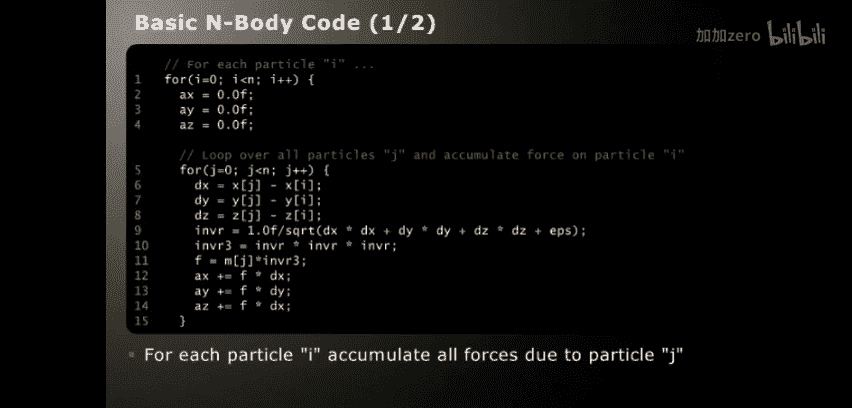

StandardCL的理念是基于典型用例提供简化接口，并以类似UNIX的风格构建。我们将使用StandardCL来简化后续代码剖析中的主机端代码。其优点是允许我们专注于概念，而不会迷失在大量底层语法中。

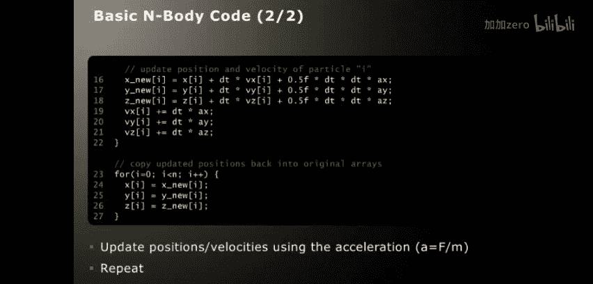

需要指出的是，此API在访问OpenCL提供的全部功能方面没有限制，API调用本身非常接近原始的OpenCL调用。

以下是我们将使用的一些简化API调用：

### 获取计算层上下文
使用OpenCL，你必须查询可用平台，选择平台，获取该平台的所有可用设备，为每个设备创建上下文，然后为每个设备创建命令队列。而StandardCL提供了默认的、开箱即用的上下文。只需包含 `standardcl.h` 并链接库，你就拥有了一个包含所有CPU和GPU设备的就绪上下文。

### 管理内核
OpenCL支持即时编译模型，因此你必须管理程序文本、原始字符串、创建程序、构建程序并创建内核。StandardCL提供了简化的方法，本质上可以通过两次调用获取内核：使用 `cl_open` 打开包含内核代码的文件获取句柄，然后使用该句柄按名称查询你想要构建和链接的内核。结果是你获得了一个准备就绪的OpenCL内核。

### 内存管理
OpenCL要求使用不透明的内存缓冲区，并且必须在命令队列中排队读写缓冲区命令来传输数据，这与大多数C程序员习惯的内存管理方式不同。StandardCL提供了 `cl_malloc`，它以一种与 `malloc` 非常相似的语义分配内存，只是分配的内存实际上可以在OpenCL设备之间共享。`cl_malloc` 实际上是在为你创建和管理这些内存缓冲区。

### 管理事件执行
使用OpenCL，你需要在命令队列中排队操作并管理结果事件。使用StandardCL，你可以使用 `cl_msync` 和 `cl_fork`。`cl_msync` 用于将数据同步到设备或从设备同步回主机。`cl_fork` 用于在选定的设备上执行内核。`cl_wait` 是一个同步调用，用于等待已排队的事件完成。`cl_msync` 和 `cl_fork` 都有阻塞和非阻塞的变体，这在开始使用多个设备以实现并发操作时非常重要。

---

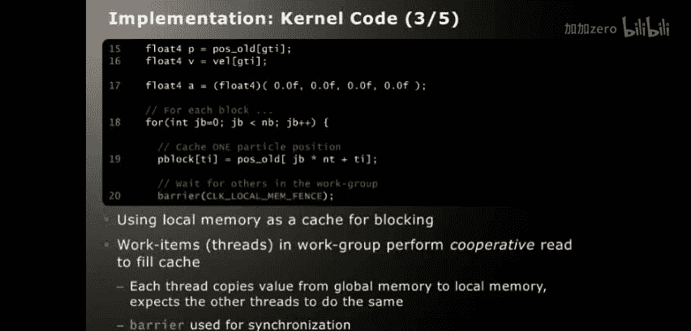

## N体算法代码剖析

现在，我们进入本教程的核心部分：N体算法实现的代码剖析。

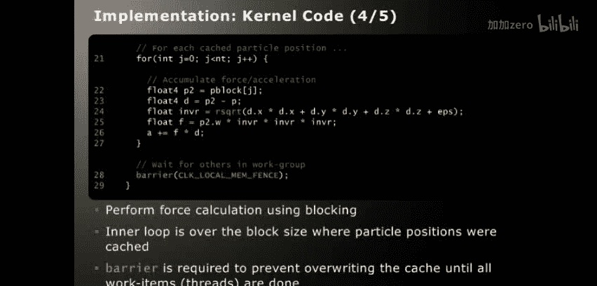

### 算法概述
N体算法是一个相对简单的算法，通常用于展示许多加速协处理器的性能。它模拟了N个粒子在某种粒子-粒子相互作用下的运动（例如，万有引力）。该算法的计算复杂度为 **O(n²)**，这意味着如果将模拟中的粒子数量加倍，计算负载将增加四倍。这对于研究带宽与计算比率问题非常有用。

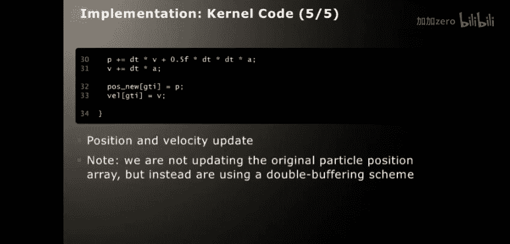

算法有两个主要步骤：
1.  **计算每个粒子上的力**：通过对系统中所有其他粒子的相互作用贡献求和来确定。这是算法的 **O(n²)** 部分。
2.  **更新粒子位置和速度**：使用基本的牛顿动力学在某个小时间步长内更新。

整个未优化的算法可以用几十行C代码编写。

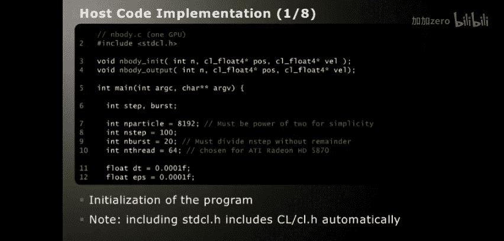

### OpenCL程序结构
OpenCL实现由两部分组成：
*   **内核代码**：编译后在GPU上运行，执行实际计算。
*   **主机代码**：不进行有意义的计算，但处理初始化和簿记任务，并协调OpenCL设备上的操作（主要是内存管理和内核执行本身）。

### 内核代码实现
内核代码的目标是提供一个可理解的、合理标准的实现，并尝试使用OpenCL的良好实践。需要记住OpenCL内核代码的上下文：内核将在索引空间内的每个工作项上执行。在这个应用中，我们有一个简单的一维索引空间，工作项的数量等于系统中的粒子数。

内核代码将为系统中的每个N粒子调用一次，其任务是使用牛顿力学更新一个粒子的位置和速度。

以下是内核代码的关键部分解析：

**内核原型**
```c
__kernel void nbody(
    float dt,
    __global float4* oldPos,
    __global float4* newPos,
    __global float4* vel,
    __local float4* pblock)
```
*   `__kernel` 限定符表示这是一个内核函数。
*   `__global` 限定符表示这些指针指向全局内存。
*   `__local float4* pblock` 将用作每个工作组的本地缓存。

**大小和索引确定**
```c
float4 dt4 = (float4)(dt, dt, dt, 0.0f*dt);
int gti = get_global_id(0);
int ti = get_local_id(0);
int n = get_global_size(0);
int nt = get_local_size(0);
int nb = n / nt;
```
*   `get_global_id(0)` 获取全局ID。
*   `get_local_id(0)` 获取局部ID（相对于本地工作组）。
*   `get_global_size(0)` 和 `get_local_size(0)` 获取全局索引空间和本地工作组的大小。
*   `nb` 计算我们分块方案中的块数。

**实际计算**
内核首先读取粒子的位置和速度，并将加速度清零。然后开始循环遍历块。

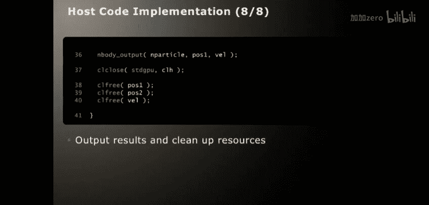

**协作读取填充缓存**
```c
pblock[ti] = oldPos[j*nt + ti];
barrier(CLK_LOCAL_MEM_FENCE);
```
内核缓存一个粒子位置，但依赖于工作组中的其他工作项或线程执行相同的操作来加载缓存。然后使用 `barrier` 等待工作组内的其他线程赶上。

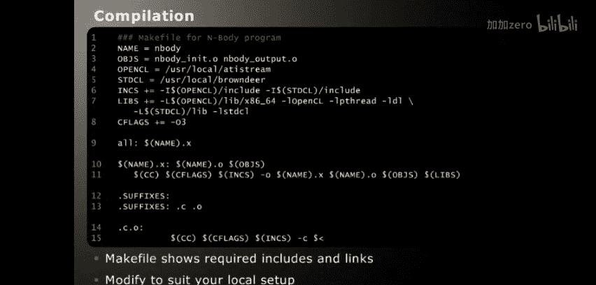

**循环遍历缓存的粒子位置并计算力**
```c
for (int j = 0; j < nt; j++) {
    float4 p2 = pblock[j];
    float4 d = p2 - p;
    float invr = rsqrt(d.x*d.x + d.y*d.y + d.z*d.z + eps);
    float f = p2.w * invr * invr * invr;
    a += f * d;
}
```
这里实现了与C代码相同的力计算，但使用了OpenCL的向量数据类型和内置函数（如 `rsqrt`）。

**更新粒子位置和速度**
```c
vel[gti] += dt4 * a;
newPos[gti] = oldPos[gti] + dt4 * vel[gti];
```
使用 `float4` 数据类型，可以同时更新X、Y和Z分量。

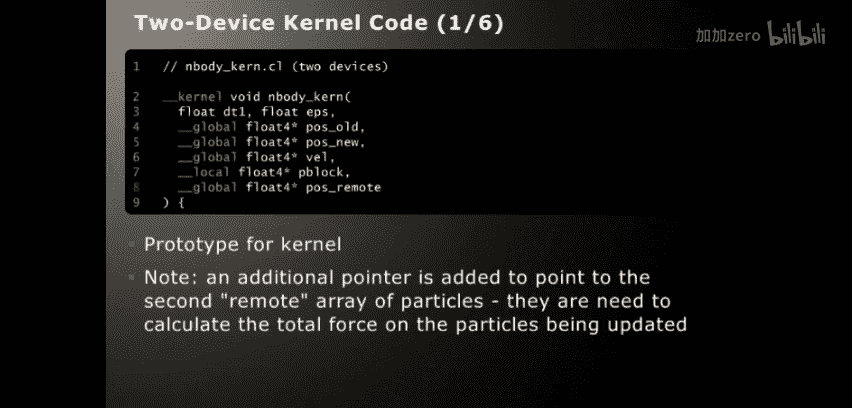

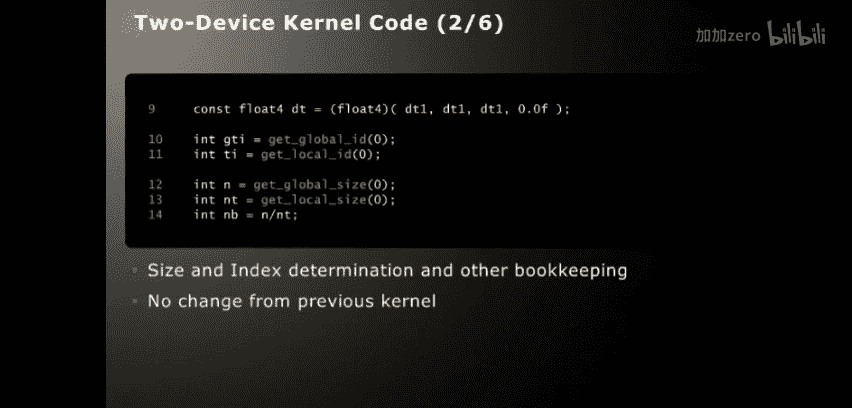

### 主机代码实现
主机代码负责初始化、内存分配、内核设置、数据传输和协调内核执行。

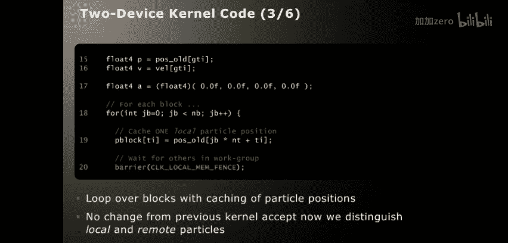

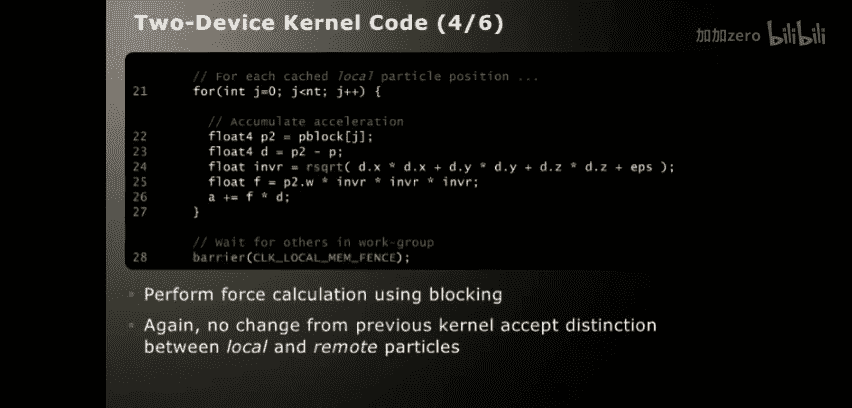

**初始化和参数设置**
```c
#include "standardcl.h"
int nParticle = 8192;
int nStep = 100;
int nBu = 20;
int nThread = 64;
```

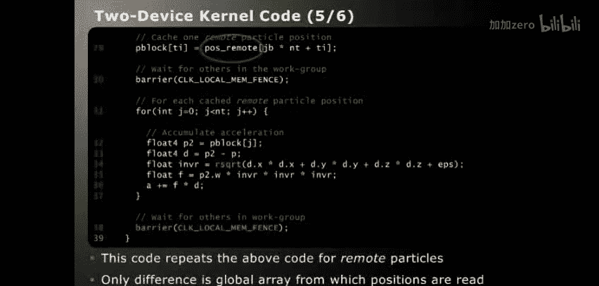

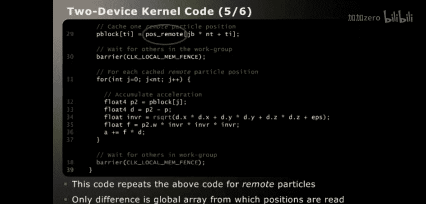

**分配共享内存**
```c
float4* pos1 = (float4*)cl_malloc(nParticle * sizeof(float4));
float4* pos2 = (float4*)cl_malloc(nParticle * sizeof(float4));
float4* vel = (float4*)cl_malloc(nParticle * sizeof(float4));
```
使用 `cl_malloc` 分配主机和GPU之间可共享的内存。

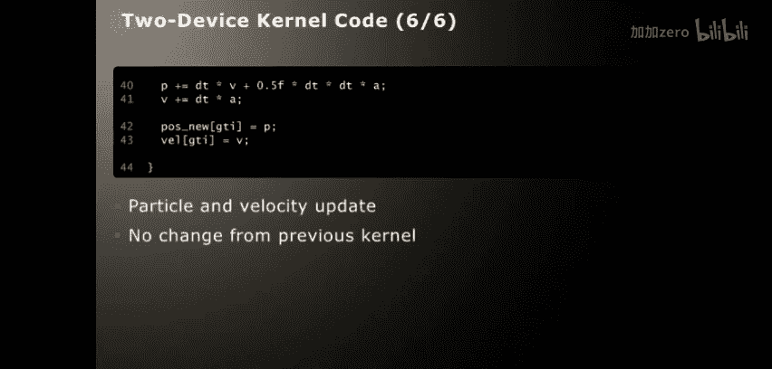

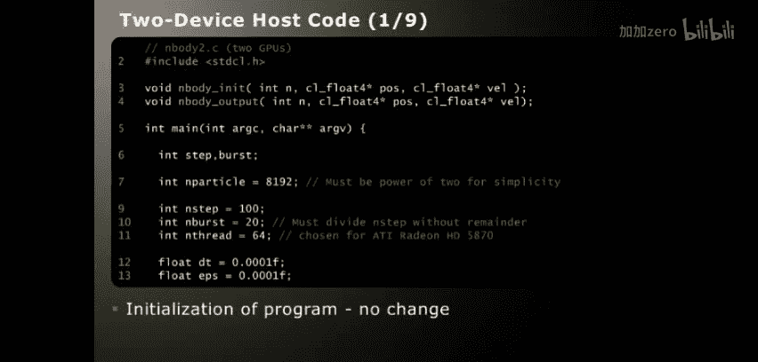

**构建和创建OpenCL内核**
```c
void* clp = cl_open("nbody.cl");
cl_kernel krn = cl_kernel(clp, "nbody");
```
`cl_open` 返回已编译的OpenCL内核代码的句柄，`cl_kernel` 按名称提取内核。

**设置计算域和内核参数**
```c
cl_ndrange ndr = cl_ndrange_1d(0, nParticle, nThread);
cl_arg(krn, 0, dt);
cl_arg_global(krn, 4, vel);
cl_arg_local(krn, 5, nThread * sizeof(float4));
```
设置一维计算域，并设置内核参数。注意，参数2和3（位置数组）稍后动态设置，以实现双缓冲方案。

**数据传输到设备**
```c
cl_msync(0, pos1, nParticle * sizeof(float4), CL_MSYNC_TO_DEVICE);
cl_msync(0, vel, nParticle * sizeof(float4), CL_MSYNC_TO_DEVICE);
```
使用 `cl_msync` 将数据同步到GPU。

**执行循环**
```c
for (int s = 0; s < nStep; s += nBu) {
    for (int b = 0; b < nBu; b++) {
        cl_arg_global(krn, 2, pos1);
        cl_arg_global(krn, 3, pos2);
        cl_fork(0, krn, &ndr, CL_EVENT_NOWAIT);
        // 交换pos1和pos2以进行双缓冲
        swap(pos1, pos2);
    }
    cl_wait(0);
    cl_msync(0, pos1, nParticle * sizeof(float4), CL_MSYNC_TO_HOST);
    // 输出结果
    nbody_output(...);
}
```
在循环中，动态设置位置数组参数，使用 `cl_fork` 非阻塞地排队内核执行，然后使用 `cl_wait` 等待所有排队的内核完成，最后使用 `cl_msync` 将数据同步回主机。

**清理资源**
```c
cl_close(clp);
free(pos1); free(pos2); free(vel);
```

### 编译代码
编译主机程序时，需要提供OpenCL头文件路径和StandardCL头文件路径，并链接相应的库。内核代码文件（.cl）需要与可执行文件一起携带，因为它是在运行时使用即时编译方法编译的。

---

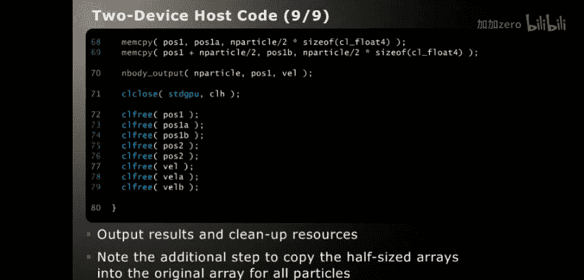

## 扩展到多GPU支持

上一节我们完成了单GPU的N体算法实现，本节中我们来看看如何修改代码以支持多个设备（以两个GPU为例）。

### 修改内核代码
内核代码的修改相对较小，主要是添加一个额外的参数来指向“远程”粒子位置（即另一个GPU负责更新的粒子）。

**内核原型修改**
```c
__kernel void nbody(
    float dt,
    __global float4* oldPos,
    __global float4* newPos,
    __global float4* vel,
    __local float4* pblock,
    __global float4* oldPosRemote) // 新增参数
```

**计算力的循环分为两部分**
首先，循环遍历本地粒子位置（`oldPos`）计算力。然后，再循环遍历远程粒子位置（`oldPosRemote`）计算力，并将两部分力累加。

### 修改主机代码
主机代码的修改更为显著，涉及同步和内存管理。

**分配半尺寸数组**
```c
float4* pos1A = (float4*)cl_malloc(nParticle/2 * sizeof(float4));
float4* pos1B = (float4*)cl_malloc(nParticle/2 * sizeof(float4));
// ... 为pos2和vel分配类似的半尺寸数组
```
因为要将粒子分配到两个GPU上，所以需要分配半尺寸的数组。

**分割数据**
将完整的粒子位置和速度数组分割到这些半尺寸数组中。

**设置计算域**
计算域的全局大小现在是原来的一半。
```c
cl_ndrange ndr = cl_ndrange_1d(0, nParticle/2, nThread);
```

**数据传输到两个GPU**
```c
cl_msync(0, pos1A, (nParticle/2)*sizeof(float4), CL_MSYNC_TO_DEVICE);
cl_msync(1, pos1B, (nParticle/2)*sizeof(float4), CL_MSYNC_TO_DEVICE);
// ... 同步速度数组
```

**执行内核并设置参数**
需要为两个GPU分别排队内核执行，并正确设置参数（包括指向本地和远程位置数组的指针）。

**GPU间数据交换**
这是多设备编程中新引入的关键步骤。在一个GPU更新了其负责的粒子位置后，另一个GPU需要这些更新后的位置来计算力。
```c
// 将更新后的位置从两个GPU同步回主机
cl_msync(0, pos2A, ..., CL_MSYNC_TO_HOST | CL_EVENT_NOWAIT);
cl_msync(1, pos2B, ..., CL_MSYNC_TO_HOST | CL_EVENT_NOWAIT);
// 等待数据传输完成
cl_wait(0); cl_wait(1);
// 将交换后的位置数据同步回GPU
cl_msync(0, pos2B, ..., CL_MSYNC_TO_DEVICE | CL_EVENT_NOWAIT); // GPU 0 获取 GPU 1 的数据
cl_msync(1, pos2A, ..., CL_MSYNC_TO_DEVICE | CL_EVENT_NOWAIT); // GPU 1 获取 GPU 0 的数据
```

**合并数据回完整数组（可选）**
为了便于使用现有的辅助函数，可以将半尺寸数组合并回完整的数组。

---

## 总结

在本教程中，我们一起深入学习了OpenCL编程，并完成了N体算法的完整实现。我们从OpenCL的核心概念和编程模型回顾开始，了解了其执行模型、内存模型和同步机制。接着，我们引入了StandardCL库来简化主机端繁琐的样板代码，使我们可以更专注于算法逻辑。

随后，我们详细剖析了N体算法的内核代码和主机端代码，理解了如何将串行算法转化为并行内核，以及主机端如何管理内存、设置参数和协调执行。最后，我们探讨了如何将实现扩展到多GPU环境，这涉及到内核参数的调整、数据的分割以及关键的设备间数据交换步骤。

通过本教程，你应该对使用OpenCL进行异构计算编程有了更扎实的理解，并掌握了实现一个典型计算密集型算法（N体模拟）的基本方法。