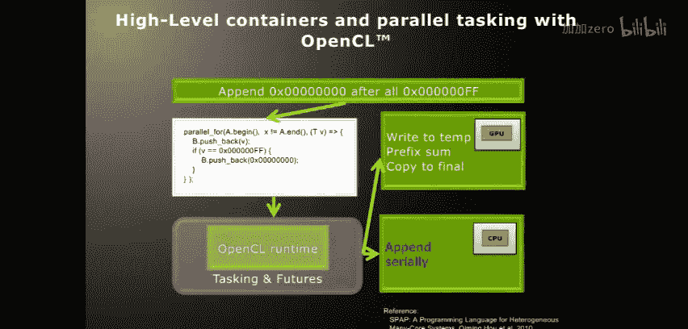
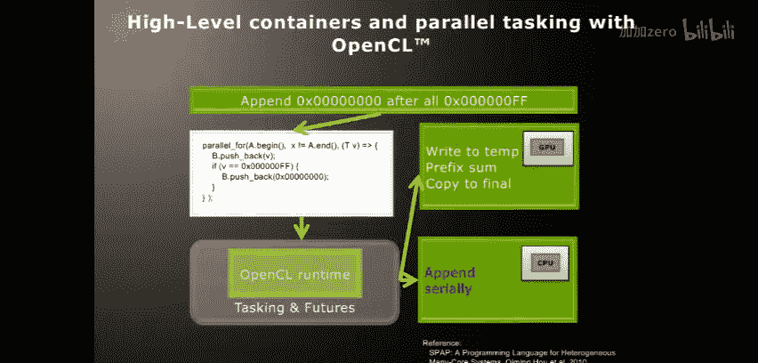

# 015：OpenCL设备分割扩展

在本节课中，我们将要学习OpenCL的一个扩展功能——设备分割。这个功能允许我们将一个物理计算设备（如多核CPU）在逻辑上分割成多个独立的OpenCL设备，从而实现对硬件资源的更精细控制。我们将了解扩展的类型，并通过一个具体的并行向量填充案例来演示设备分割的实际应用。

## OpenCL扩展概述

在深入设备分割之前，我们首先需要了解OpenCL扩展的通用知识。OpenCL标准定义了三种不同类型的扩展，它们为开发者提供了超越核心规范的功能。

以下是OpenCL的三种扩展类型：

1.  **KHR扩展**：这是由OpenCL工作组正式批准的标准扩展。与OpenCL核心规范一样，实现KHR扩展需要通过Khronos组织的一系列一致性测试，以确保其跨平台兼容性。
2.  **EXT扩展**：这类扩展由至少两个或更多的工作组成员共同开发，但尚未获得整个工作组的正式批准。因此，它没有强制的一致性测试要求，不同厂商的实现可能存在细微差异。
3.  **厂商扩展**：这类扩展由单个硬件或软件供应商开发，通常也只在该供应商的平台或设备上得到支持。使用这类扩展会牺牲代码的可移植性，因此应谨慎使用，通常用于调试等非生产环境。

所有扩展的官方文档都可以在Khronos的OpenCL注册网站上找到，确保了规范的公开透明。

## 设备分割扩展简介

上一节我们介绍了OpenCL扩展的通用分类，本节中我们来看看一个具体的KHR/EXT扩展——设备分割。

设备分割扩展的核心思想是，允许开发者将一个包含多个计算单元（例如，CPU的多个核心）的物理设备，在逻辑上分割成多个独立的OpenCL设备。例如，一个四核CPU在默认情况下会被OpenCL视为一个单一设备。通过设备分割，我们可以将其划分为两个、四个甚至更多个逻辑设备。

这种能力带来了显著的优势：

*   **资源预留与控制**：你可以为高优先级任务预留特定的核心。
*   **负载与缓存优化**：在NUMA（非统一内存访问）架构系统中，你可以根据内存亲和性来分割设备，确保相关任务组在共享缓存的核心上运行，从而提高缓存复用率，减少内存访问延迟。
*   **保证执行进度**：在某些并行算法（如我们后面将看到的管道模式）中，将工作组分派到独立的设备上可以避免因OpenCL运行时工作组调度顺序不确定而导致的死锁问题。

目前，设备分割扩展主要支持在多核CPU和IBM Cell Broadband Engine处理器上使用。AMD在其CPU实现中支持此功能，并且同时兼容AMD和Intel的处理器。未来，这项技术也有可能扩展到GPU等其他设备上。

## 应用案例：并行流填充算法

为了具体说明设备分割的用途，我们来看一个实际的编程案例：并行流填充算法。这个案例改编自一个实际的图像处理问题（Impac2流处理）。

**问题描述**：我们有一个输入字节流。每当在流中遇到一个值为 `0xFF` 的字节时，就需要在该字节**之后**插入一个值为 `0x00` 的填充字节。

**顺序实现**：用C语言实现这个算法非常简单。我们遍历输入数组，将每个字节写入输出数组。如果当前字节是 `0xFF`，则在写入该字节后，再向输出数组写入一个 `0x00`。这里的关键是，我们需要维护两个索引：一个用于输入数组（每次递增1），另一个用于输出数组（根据是否遇到 `0xFF` 递增1或2），以确保输出顺序与输入顺序严格一致。

**直接并行化的挑战**：如果我们尝试用OpenCL内核直接并行化这个循环（例如，每个工作项处理一个输入字节），就会遇到问题。虽然每个工作项都能正确判断是否需要填充并计算自己在输出数组中的位置，但OpenCL不保证工作项的执行顺序。因此，**位置靠后的工作项可能先于位置靠前的工作项执行**，导致最终输出数组中的元素顺序混乱，尽管填充本身是正确的。

## 解决方案：基于管道模式的并行算法

为了解决执行顺序问题，我们需要重新设计算法。上一节我们看到了直接并行的弊端，本节中我们引入**管道模式**作为解决方案。

管道模式是一种经典的并行计算模式。在这个模式中，我们将计算任务分解为多个阶段（或“管道工”），每个阶段处理数据的一个块，并将处理结果（或元数据）传递给下一个阶段。

我们将输入数据分成连续的块。每个计算单元（例如，一个CPU核心）负责处理一个数据块。处理过程包括：
1.  计算本数据块内需要插入的 `0x00` 的数量。
2.  计算本数据块在最终输出数组中的起始写入偏移量。

**关键点**：第2步的偏移量取决于**前面所有数据块**的写入长度。因此，每个计算单元必须等待前一个单元计算出其累积偏移量后，才能开始自己的写入操作。这就形成了一个管道：单元N等待单元N-1的信号，处理完后通知单元N+1。

**使用独立设备保证进度**：如果我们使用OpenCL的默认设备，并将所有工作组提交到同一个命令队列，OpenCL运行时无法保证工作组的启动和执行顺序。这可能导致死锁（例如，负责处理后面数据块的工作组先开始执行并空等，而负责处理前面数据块的工作组迟迟得不到调度）。通过**设备分割**，我们将每个核心创建为一个独立的OpenCL设备和命令队列。这样，我们可以显式地将每个数据块的处理任务提交到对应的核心设备上。操作系统调度器会保证每个核心上的任务都能获得执行时间，从而确保整个管道能够向前推进，避免死锁。

## 技术实现：结合设备分割与原生内核

为了实现上述管道方案，我们将结合使用设备分割和OpenCL的另一个功能——**原生内核**。

**原生内核**允许我们在OpenCL设备（特别是CPU设备）上直接运行普通的C/C++函数，而不仅仅是OpenCL C内核。这对于集成现有库、进行复杂调试或实现需要操作系统调用的机制（如更高级的线程同步）非常有用。

以下是实现步骤的概要：

1.  **初始化与设备分割**：
    *   查询平台和设备。
    *   选择支持设备分割的CPU设备。
    *   使用 `clCreateSubDevices` 函数和 `CL_DEVICE_PARTITION_EQUALLY` 属性将设备分割为多个子设备（例如，每个核心一个子设备）。
    *   为每个子设备创建独立的命令队列和上下文。

2.  **准备数据与通信**：
    *   创建输入/输出缓冲区。
    *   创建“邮箱”缓冲区数组，用于在管道阶段间传递累积偏移量。每个子设备对应一个邮箱。

3.  **提交原生内核任务**：
    *   我们将处理每个数据块的C++函数作为原生内核。
    *   遍历所有子设备（计算单元），为每个单元准备参数：
        *   输入/输出缓冲区指针（通过OpenCL内存对象传递）。
        *   邮箱缓冲区指针。
        *   数据块大小、块ID等。
    *   使用 `clEnqueueNativeKernel` 将每个任务异步提交到对应的子设备命令队列中。每个任务会收到一个事件对象。

4.  **内核函数逻辑**：
    *   函数内部，首先根据块ID读取对应的输入数据块。
    *   如果块ID不是0，则**忙等待**或通过更高级的机制轮询对应的邮箱，直到前一个阶段写入其累积偏移量。
    *   计算本块的输出偏移量（前一块的偏移 + 本块基础大小 + 本块中填充的 `0x00` 数量）。
    *   **立即将本块计算出的新累积偏移量写入下一个阶段的邮箱**，以通知其可以开始工作。
    *   将本块处理后的数据（包括可能的填充）写入输出缓冲区的正确位置。

5.  **同步与完成**：
    *   主机程序等待所有子设备命令队列返回的事件完成。
    *   所有事件完成后，输出缓冲区中即为顺序正确的填充后数据。

通过这种设计，我们既利用了多核并行处理数据块内部的计算，又通过邮箱通信保证了数据块间写入全局内存的顺序。设备分割确保了每个管道阶段都有独立的硬件资源，从而保证了执行进度。

## 性能与总结

本节课中我们一起学习了OpenCL设备分割扩展及其在一个并行流填充算法中的应用。

*   **核心概念**：设备分割允许将物理设备划分为多个逻辑设备，实现资源隔离和进度保证。
*   **关键模式**：管道模式结合邮箱通信，解决了并行计算中的顺序依赖问题。
*   **实现工具**：我们使用了原生内核来在CPU上执行复杂的C++逻辑，并利用设备分割创建了独立的执行上下文。

即使在这样一个计算密度不高（主要是条件判断和内存写入）的案例中，在一台四核机器上我们也观察到了 **2.3 到 2.4 倍的性能加速**。这充分展示了通过精细的硬件控制和并行算法设计，即使在CPU上也能利用OpenCL获得显著的性能提升。如果算法中包含更多的向量化计算，性能收益将更加可观。

设备分割的用途不仅限于此，它还在NUMA系统优化、实时任务预留等场景中发挥着重要作用。随着OpenCL生态的发展，我们期待看到更多设备支持这一强大的扩展功能。