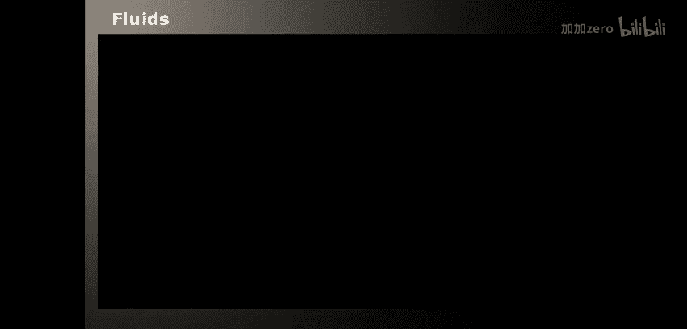

# 016：平滑粒子流体动力学 (SPH) 🚀

在本节课中，我们将学习如何使用OpenCL实现平滑粒子流体动力学（SPH）方法，这是一种用于模拟流体（如水）行为的计算技术。我们将从流体力学的基本概念开始，逐步深入到SPH的数学原理，最后解析一个完整的OpenCL模拟程序。

---

## 概述：什么是流体？ 💧

流体是我们日常生活中常见的物质状态，主要包括液体（如水、油）和气体（如空气）。从物理学的角度看，流体遵循纳维-斯托克斯（Navier-Stokes）方程所描述的规律。本节课我们将专注于**不可压缩**的纳维-斯托克斯方程，它适用于描述在常规速度和温度下，像水这样的流体行为。

流体运动主要受三种力支配：**重力**、**压力**和**粘性力**。压力差驱动流体从高压区流向低压区，而粘性力则描述了流体的“粘稠度”，它影响流体各部分运动的协调性。

---

## 纳维-斯托克斯方程 📐

纳维-斯托克斯方程是流体动力学的核心偏微分方程组。对于不可压缩流体，我们主要关注两个方程：

1.  **运动方程**：描述了速度场随时间的变化。
    \[
    \rho \left( \frac{\partial \mathbf{v}}{\partial t} + \mathbf{v} \cdot \nabla \mathbf{v} \right) = -\nabla p + \mu \nabla^2 \mathbf{v} + \rho \mathbf{g}
    \]
    *   `ρ` 是密度。
    *   `v` 是速度向量。
    *   `p` 是压力。
    *   `μ` 是动力粘度系数。
    *   `g` 是重力加速度向量。
    *   `∇` 是梯度算子，`∇²` 是拉普拉斯算子。

    方程左侧是惯性项（包含对流加速度 `v·∇v`），右侧依次是压力梯度、粘性力和重力。

2.  **质量连续性方程**：对于不可压缩流体，密度恒定，该方程简化为速度场的散度为零。
    \[
    \nabla \cdot \mathbf{v} = 0
    \]
    这表示流体在运动过程中体积保持不变。

为了得到适用于粒子模拟的方程，我们沿粒子路径取**物质导数**，从而得到单个粒子 `i` 的运动方程：
\[
\frac{d \mathbf{v}_i}{dt} = \mathbf{g} - \frac{1}{\rho} \nabla p + \frac{\mu}{\rho} \nabla^2 \mathbf{v}
\]
我们的目标就是求解这个方程。

---

## 平滑粒子流体动力学 (SPH) 方法 🔬

上一节我们介绍了描述流体运动的方程，本节中我们来看看如何使用SPH方法数值求解这些方程。SPH是一种无网格的粒子方法，它将流体离散为一系列相互作用的粒子。

SPH的核心思想是使用**平滑核函数** `W` 来估算空间任意点的场量（如密度、压力）。核函数定义了粒子间相互作用的范围和权重：距离越近，影响越大；超过相互作用半径 `h`，影响为零。

以下是SPH方法中对关键物理量的近似公式：

**密度近似**
粒子的密度通过对邻近粒子的质量进行加权求和来近似：
\[
\rho_i \approx \sum_j m_j W(|\mathbf{r}_i - \mathbf{r}_j|, h)
\]

**压力梯度近似**
压力梯度项近似为：
\[
-\frac{1}{\rho_i} \nabla p \approx -\sum_j m_j \left( \frac{p_i}{\rho_i^2} + \frac{p_j}{\rho_j^2} \right) \nabla W(|\mathbf{r}_i - \mathbf{r}_j|, h)
\]
其中压力 `p` 由状态方程给出：`p = k(ρ - ρ₀)`，`ρ₀` 是静止密度，`k` 是常数。

**粘性力近似**
粘性力项近似为：
\[
\frac{\mu}{\rho_i} \nabla^2 \mathbf{v} \approx \frac{\mu}{\rho_i} \sum_j m_j \frac{\mathbf{v}_j - \mathbf{v}_i}{\rho_j} \nabla^2 W(|\mathbf{r}_i - \mathbf{r}_j|, h)
\]
这个项会使邻近粒子的速度趋于一致。

**常用的平滑核函数**
以下是程序中使用的具体核函数形式（`r = |r_i - r_j|`）：

*   标量核函数 `W`:
    \[
    W(r, h) = \frac{315}{64\pi h^9} (h^2 - r^2)^3 \quad (0 \le r \le h)
    \]
*   梯度 `∇W` (一个向量):
    \[
    \nabla W(r, h) = \frac{45}{\pi h^6} (h - r)^2 \frac{\mathbf{r}_j - \mathbf{r}_i}{r}
    \]
*   拉普拉斯算子 `∇²W` (一个标量):
    \[
    \nabla^2 W(r, h) = \frac{45}{\pi h^6} (h - r)
    \]

---

## SPH模拟算法步骤 ⚙️

综合以上公式，SPH模拟每一时间步的计算流程如下：

1.  **计算密度和压力**：对每个粒子 `i`，使用密度近似公式计算 `ρ_i`，进而计算 `p_i`。
2.  **计算压力加速度**：对每个粒子 `i`，使用压力梯度近似公式计算由压力产生的加速度。
3.  **计算粘性加速度**：对每个粒子 `i`，使用粘性力近似公式计算由粘性产生的加速度。
4.  **计算总加速度**：将重力、压力加速度和粘性加速度相加，得到粒子的总加速度 `a_i`。
5.  **时间积分**：使用显式欧拉法更新粒子的速度和位置。
    \[
    \mathbf{v}_i^{new} = \mathbf{v}_i + \Delta t \cdot \mathbf{a}_i
    \]
    \[
    \mathbf{r}_i^{new} = \mathbf{r}_i + \Delta t \cdot \mathbf{v}_i^{new}
    \]
6.  **处理边界条件**：确保粒子不会超出模拟区域（如盒子）。

一个朴素的实现需要计算所有粒子对之间的相互作用，复杂度为 `O(N²)`，效率低下。

---

## 高效邻居搜索与OpenCL实现 🖥️

为了提升性能，我们需要优化邻居搜索过程。基本思路是将空间划分为边长为 `2h` 的体素（voxel）。这样，任意粒子可能相互作用的邻居粒子，只可能位于其所在的体素及相邻的26个体素之内。

以下是优化后的算法步骤及其对应的OpenCL内核：

1.  **体素化与排序**
    *   **内核: `hash_particles`**：计算每个粒子所在的体素索引（哈希值），并将体素ID和粒子ID作为键值对存储。
    *   **内核: `sort` 与 `sort_postpass`**：对键值对（体素ID， 粒子ID）进行排序。排序后，属于同一体素的粒子在内存中连续排列。然后重排粒子的位置和速度数据以匹配新的顺序。

2.  **构建空间索引**
    *   **内核: `index` 与 `index_postpass`**：构建 `grid_cell_index`，这是一个数组，其下标是体素ID，内容是该体素内第一个粒子在排序后数组中的索引。这允许我们快速定位任意体素中的所有粒子。

3.  **构建邻居图**
    *   **内核: `find_neighbors`**：对于每个粒子，在其所在的 `2x2x2` 体素区域内搜索潜在邻居。为了在只采样部分邻居（如32个）时避免偏差，搜索起点是随机的，并且搜索方向交替进行。最终将选中的邻居粒子ID存入 `neighbor_map`。

4.  **执行物理计算**
    *   **内核: `compute_density_pressure`**：根据 `neighbor_map`，每个粒子仅与其32个邻居相互作用，计算密度和压力。
    *   **内核: `compute_acceleration`**：计算压力加速度和粘性加速度，并合成总加速度。
    *   **内核: `integrate`**：积分更新速度和位置，并实施边界碰撞。

**程序中的缓冲区**
主要的OpenCL缓冲区包括：
*   `pos` / `vel`: 粒子的位置和速度 (float4类型，便于硬件访问)。
*   `sorted_pos` / `sorted_vel`: 排序后的位置和速度。
*   `particle_index`: 存储（体素ID， 粒子ID）键值对，用于排序。
*   `grid_cell_index`: 体素到粒子索引的映射。
*   `neighbor_map`: 每个粒子的邻居列表。

**关于互操作性 (Interop)**
理想情况下，应使用OpenCL-DirectX互操作，使得GPU上的计算缓冲区可以直接被图形API用于渲染，避免在主机和设备间复制数据的开销。虽然示例代码中包含了相关设置，但当前版本并未启用此优化。

---

## 总结与问答要点 📝

本节课中我们一起学习了：
1.  **流体基础**：了解了流体的定义和支配其运动的力（压力、粘性、重力）。
2.  **纳维-斯托克斯方程**：学习了描述不可压缩流体运动的偏微分方程组及其物质导数形式。
3.  **SPH方法**：掌握了使用平滑核函数将连续方程离散化为粒子相互作用形式的原理和关键近似公式。
4.  **OpenCL实现**：剖析了一个高效的SPH模拟程序结构，包括空间划分、邻居搜索、多内核协作的完整流程。

**常见问题解答：**
*   **密度是否恒定？** 在不可压缩流体中，**整体**密度恒定，但**局部**密度可以有微小变化，正是这种变化产生了压力波。
*   **使用单精度还是双精度？** 本程序使用单精度(`float`)以追求性能。双精度(`double`)精度更高但速度更慢。
*   **能模拟湍流吗？** SPH方法更适合模拟层流。模拟湍流通常需要更专门的技术和极高的分辨率。
*   **粒子数量上限？** 受限于GPU显存。在AMD HD 5870级别的GPU上，约32K粒子可保证实时模拟。
*   **为什么用缓冲区而非图像内存？** 开发时测试发现性能差异不大。未来OpenCL的缓存缓冲区特性可能是更好的选择。

鼓励大家下载并研究示例代码，进一步探索和修改。希望本教程对你有所帮助！