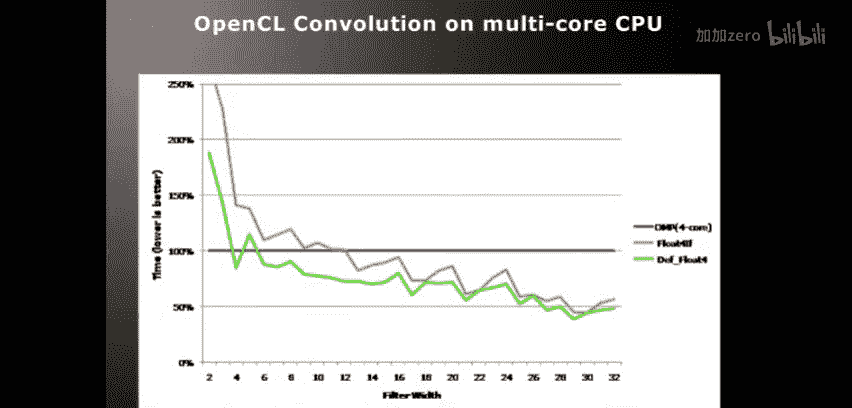
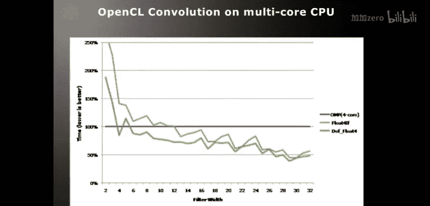
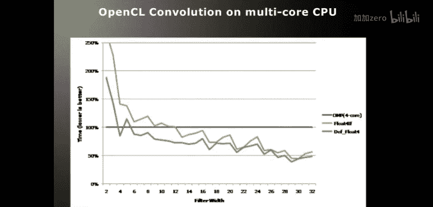
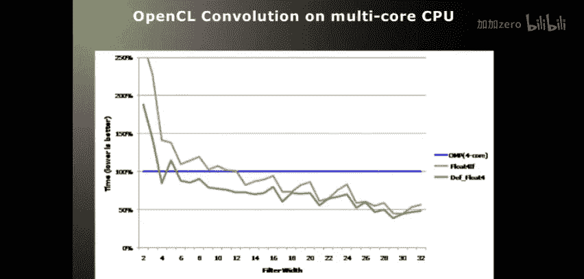
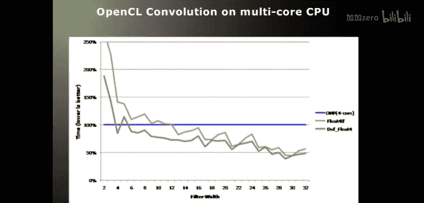
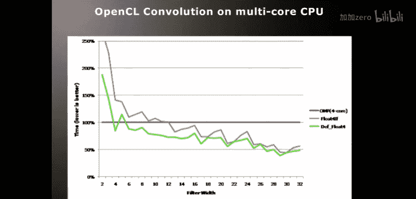
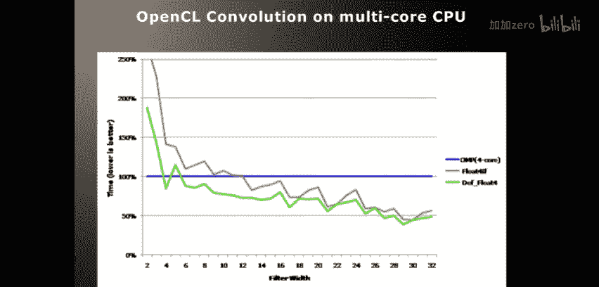
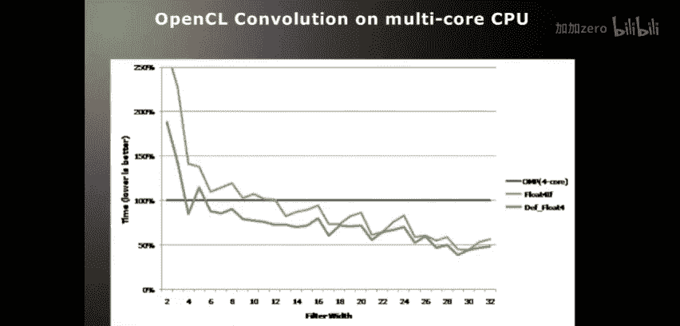

# 017：图像卷积优化

在本节课中，我们将以图像卷积算法为例，学习在GPU和CPU上使用OpenCL进行性能优化的多种技术。我们将从理解AMD GPU硬件架构开始，逐步探讨如何通过数据重用、缓存利用、循环展开等策略，将算法性能提升数十倍。

## AMD GPU架构概述

上一节我们介绍了课程目标，本节中我们来看看优化工作的基础——理解底层硬件架构。这对于后续的优化至关重要。

AMD GPU（以Evergreen系列，如Radeon HD 5870为例）的核心是流处理器阵列。HD 5870拥有20个SIMD核心。每个SIMD核心是一个单指令多数据单元，意味着它在每个时钟周期执行一条指令，但该指令会同时作用于多个数据元素。

该GPU的峰值单精度浮点性能为2.72 TFLOPs，双精度性能为其五分之一（544 GFLOPs），全局内存带宽为153.6 GB/s。优化目标通常是达到这些峰值性能的70%-80%。

每个SIMD核心包含两种缓存：
*   **本地数据共享**：对应OpenCL中的 `__local` 内存（或CUDA中的共享内存），大小为32 KB。
*   **纹理缓存**：对应OpenCL中的图像对象，大小为8 KB。

## OpenCL到硬件的映射

理解了硬件基础后，我们来看看OpenCL的抽象概念是如何映射到这些硬件单元上的。

以下是OpenCL内存层次结构与AMD GPU硬件的对应关系：
*   **私有内存**：映射到寄存器。
*   **工作项**：映射到流处理器中的单个ALU线程。
*   **计算单元**：映射到一个SIMD核心。
*   **本地内存**：映射到SIMD核心的32 KB本地数据共享。
*   **全局内存**：映射到板载的显存（如1GB或2GB）。
*   **常量内存**：映射到常量缓存（主要来自全局内存）。
*   **图像**：数据通过L2缓存，最终缓存在8 KB的纹理缓存中。

一个关键概念是**波前**。在AMD GPU上，一个波前包含64个工作项。硬件会以16个ALU为一组，分4个时钟周期执行同一条指令，从而完成这64个工作项的计算。因此，为了获得最佳性能，**工作组大小应是64的倍数**（如64、128、256）。如果一个工作组内的线程执行路径出现分歧（例如if-else分支），GPU将串行执行所有路径，可能导致性能下降。

## 卷积算法简介

在深入GPU优化之前，我们先简要回顾一下将要优化的算法——图像卷积。

卷积算法用于处理图像等信号。对于2D图像，算法使用一个滤波器（或掩膜）在输入图像上滑动。在每个输出像素位置，将滤波器权重与对应的输入图像像素值相乘并求和，结果即为该输出像素的值。

对于一个 `N x N` 的滤波器，计算每个输出像素需要读取 `N x N` 个输入像素和 `N x N` 个滤波器权重。算法核心是一个双重嵌套循环：

```c
for (int i = -filterRadius; i <= filterRadius; i++) {
    for (int j = -filterRadius; j <= filterRadius; j++) {
        sum += inputImage[y+i][x+j] * filter[i+filterRadius][j+filterRadius];
    }
}
outputImage[y][x] = sum;
```

该算法的特点是**数据重用性高**：当滤波器移动一个像素时，大部分输入数据与上一个位置重叠。优化将重点利用这一特性。

## CPU优化技术

尽管本课重点在GPU，但相同的OpenCL内核也可在CPU上运行并获得良好性能。以下是几种简单的CPU优化方法：

以下是三种关键的CPU优化策略：
1.  **循环展开**：手动或通过编译器指令减少循环控制开销。
2.  **编译时常量**：利用OpenCL内核在运行时编译的特性，通过 `-D` 选项传递滤波器大小等参数作为宏定义，使编译器能进行更积极的优化（如自动循环展开）。
3.  **使用向量类型**：使用 `float4`、`int4` 等类型。这能生成SSE/AVX指令，并结合OpenCL的自动多线程，性能可能超越传统的OpenMP实现。

实验表明，通过向量化等技术，OpenCL内核在CPU上的性能可以达到传统多线程OpenMP实现的两倍。

## GPU优化实战







现在，我们进入核心部分，探讨如何在GPU上优化卷积算法。我们将以一个4K x 4K输出图像、16 x 16滤波器的案例进行测试。初始的朴素实现耗时约1511毫秒。












### 优化1：使用本地内存实现数据重用

朴素实现直接从全局内存读取数据，而全局内存延迟高且未缓存。第一个优化是利用本地内存手动缓存数据。

我们创建一个工作组（例如8x8，共64个线程）来处理一块输出图像。这块输出图像所需的输入图像区域比输出区域大（因为有滤波器重叠）。工作组的所有线程协作将这块所需的输入数据从全局内存加载到快速的本地内存中。然后，每个线程在计算自己的输出像素时，都从本地内存中读取数据。

**效果**：每个输出像素需要从全局内存读取的数据量从256次大幅降至约8.3次。执行时间从 **1511毫秒** 降至 **359毫秒**。

### 优化2：增大工作组尺寸

既然使用本地内存有效，那么增大工作组可以重用更多数据。

我们将工作组大小从8x8增加到16x16。这样，每个输出像素需要从全局内存读取的数据量进一步降至约3.7次。执行时间从 **359毫秒** 降至 **182毫秒**。

### 优化3：使用图像对象自动缓存

手动管理本地内存需要额外代码。OpenCL的图像对象提供了自动缓存机制。

将输入数据声明为 `image2d_t` 类型并使用采样器访问。硬件会自动通过纹理缓存缓存数据。对于8x8和16x16工作组，执行时间分别约为 **346毫秒** 和 **207毫秒**，与手动管理本地内存效果相近。

### 优化4：将滤波器放入常量内存

我们回过头优化滤波器数据的读取。滤波器数据较小且被所有线程重复读取。

将滤波器指针声明为 `__constant`。当多个线程访问常量内存中的同一地址时，访问会被优化。在朴素实现上应用此优化，时间从1511毫秒降至 **1375毫秒**。

### 优化5：循环展开与向量化加载

现在关注计算效率。原始的双重循环有控制流开销，且每次读取一个`float`。

我们将内层循环展开4次，并一次性读取4个输入值和4个滤波器值（使用`float4`）。这减少了循环开销，并且128位宽的内存访问通常比32位更高效。

**效果**：仅应用此优化，时间降至 **401毫秒**。如果滤波器也使用`float4`访问，时间进一步降至 **389毫秒**。

### 优化6：组合优化与陷阱

组合优化4和5（常量内存+向量化），时间反而增加至 **680毫秒**。原因是：将滤波器声明为 `__constant float*` 并访问`float4`时，编译器需要生成额外的ALU指令来计算所需的`float`在`float4`中的位置，增加了计算开销。

**解决方案**：直接将滤波器声明为 `__constant float4*` 数组。这样编译器可以直接进行向量化访存和计算，消除了额外的索引计算。应用此优化后，时间显著降至 **346毫秒**。

### 优化7：利用编译时常量进行终极优化

OpenCL允许在运行时编译内核时传递宏定义。我们可以将滤波器宽度等参数作为编译时常量传入。

这使得编译器能够进行彻底的静态优化，例如完全展开循环、预计算偏移量等。结合所有最佳实践（使用本地内存、大工作组、`float4`向量化、`__constant float4*`滤波器），最终执行时间从最初的1511毫秒降至惊人的 **25毫秒**（使用LDS）和 **63毫秒**（使用图像），实现了近60倍的性能提升。

## 总结与性能回顾

本节课中我们一起学习了针对图像卷积算法的多层次OpenCL优化技术。

以下是优化路径与性能提升的总结：
*   **起点**：朴素实现，1511毫秒。
*   **数据重用**：使用本地内存或图像缓存，降至~180-200毫秒。
*   **内存访问优化**：使用`float4`向量化读取和`__constant float4*`滤波器，降至~70-90毫秒。
*   **编译器优化**：利用编译时常量进行激进优化，最终达到25-63毫秒。

优化过程揭示了性能瓶颈的转移：最初是**内存带宽受限**，通过缓存优化解决后，可能变为**ALU计算受限**或**指令调度受限**，需要采取不同的优化策略。理解硬件架构（如波前、缓存层次）是进行有效优化的基础。