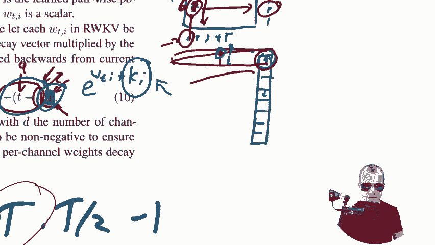
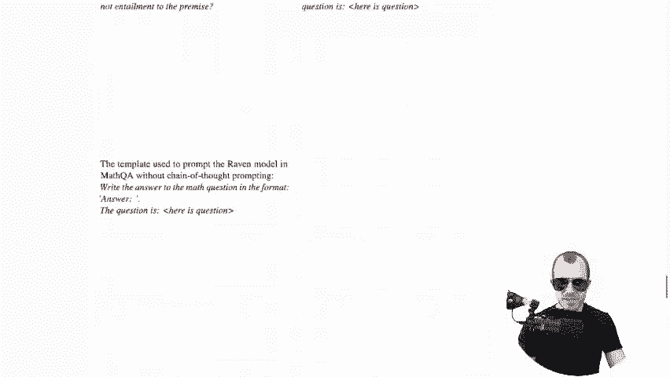

# 课程 1：Transformer时代的RNN复兴——RWKV模型详解 🧠


在本节课中，我们将要学习一个名为RWKV的创新型模型架构。它旨在结合Transformer的可扩展、可并行化训练优势，以及RNN在推理时内存占用恒定的高效特性。我们将深入探讨其设计原理、核心机制，并分析其与传统模型的权衡。


---

## 概述：什么是RWKV？🤔

RWKV代表Receptance、Weight、Key和Value，这些是模型架构中的核心元素。它被设计为一个语言模型，用于预测文本序列中的下一个词元。

Transformer模型因其强大的注意力机制而闻名，但该机制存在一个根本限制：其计算和内存需求随序列长度呈**二次方增长**。这意味着处理长文本时成本极高。

相比之下，传统的循环神经网络（RNN）在推理时具有**恒定内存**的优势，因为它以逐步、循环的方式处理序列，将信息压缩到一个隐藏状态中。然而，RNN存在梯度消失、难以并行化训练以及信息通过隐藏状态瓶颈传递可能丢失细节等问题。

RWKV试图在这两种范式之间找到一个平衡点。

---

## Transformer与RNN的核心瓶颈 🔍

上一节我们介绍了RWKV的目标，本节中我们来看看它要解决的核心问题。

**Transformer的瓶颈**在于其注意力机制。在因果语言建模中，每个词元都需要关注其之前的所有词元。对于长度为 `T` 的序列，这会产生大约 `T^2` 次交互，导致计算和内存的二次方复杂度。

**RNN的瓶颈**在于其顺序性。虽然它在推理时内存恒定，但训练时无法像Transformer那样并行处理整个序列。此外，信息必须通过一个固定的隐藏状态向量传递，这限制了模型回顾和利用遥远过去信息的能力，并存在梯度消失问题。

RWKV的设计目标就是融合二者的优点。

---

## RWKV的灵感来源：从LSTM到线性注意力 💡

为了理解RWKV的解决方案，我们需要回顾一些基础。长短期记忆网络（LSTM）是RNN的一种改进，通过引入门控机制（如遗忘门、输入门）来控制信息的流动。然而，LSTM的隐藏状态更新涉及非线性函数的堆叠，这使得其计算本质上是顺序的，难以并行化。

Transformer的注意力机制可以写成以下加权和形式：

```
Attention = softmax(Q * K^T) * V
```

其中Q（查询）、K（键）、V（值）均由输入数据计算得出。`Q * K^T` 的外积操作导致了二次方复杂度。

近年来，出现了“无注意力Transformer”等工作，它们尝试用**固定的**或**数据调制的线性加权和**来替代标准注意力，从而避免二次方成本。RWKV从此类工作中汲取了灵感。

---

## RWKV的核心：时间混合与通道混合 ⚙️

RWKV模型由多个层堆叠而成。每一层都包含两个核心模块：**时间混合** 和 **通道混合**。

### 通道混合模块

通道混合模块类似于传统的前馈神经网络层，其目的是在特征维度（通道）之间混合信息。

以下是其数据流的一个简化描述：
1.  对输入 `x_t` 应用线性变换得到 `r` 和 `k`。
2.  将 `k` 通过一个非线性激活函数（如平方ReLU）。
3.  再次进行线性变换得到 `v`。
4.  最终输出是 `v` 与由 `r` 经过Sigmoid函数产生的“遗忘门”进行逐元素相乘的结果。

该模块还引入了一个关键技巧：**词元偏移**。模块的输入并非单纯的当前输入 `x_t`，而是当前输入与上一时间步输入 `x_{t-1}` 的线性插值：`μ * x_t + (1 - μ) * x_{t-1}`。这为模型提供了一些直接的短期上下文，其作用类似于一个简单的卷积核。

### 时间混合模块

时间混合模块是RWKV实现高效长程依赖建模的关键。它负责混合不同时间步的信息。

其核心是一个**线性注意力**机制，计算方式如下：

```
output = (Σ_{i=1}^{t-1} exp(-(t-i) * w + k_i) * v_i + exp(u + k_t) * v_t) / (Σ_{i=1}^{t-1} exp(-(t-i) * w + k_i) + exp(u + k_t))
```



让我们分解这个公式：
*   `w`：一个可学习的**向量**，每个维度有一个值。它决定了每个特征维度对过去信息的“衰减率”。`w` 越大，该维度对过去的记忆衰减越快。
*   `-(t-i) * w`：这部分构成了一个**指数衰减**的权重。时间间隔 `(t-i)` 越大，权重越小。
*   `k_i`：由当前输入计算得到的**键**。它**调制**了衰减权重，允许模型根据当前内容动态调整对过去每个时间步的关注程度。
*   `v_i`：由输入计算得到的**值**，是需要被聚合的信息。
*   `u`：一个额外的可学习参数，用于处理当前时间步自身。

这个设计的精妙之处在于：
1.  **可并行训练**：由于聚合操作（求和）是线性的，没有嵌套的非线性函数，因此对于整个序列，可以高效地并行计算所有时间步的加权和。
2.  **可递归推理**：我们可以将分子和分母分别作为隐藏状态维护。在推理时，每接收到一个新词元，只需用新数据更新这两个状态，然后相除得到输出。这实现了RNN般的恒定内存推理。
3.  **长程依赖**：虽然信息以指数衰减，但理论上可以回溯到序列开头，不像Transformer有固定的上下文窗口限制。

---

## RWKV：本质上是卷积网络？ 🌀

综合来看，我们可以从另一个视角理解RWKV：
*   **词元偏移**操作类似于一个宽度为2的卷积。
*   **时间混合**中的线性注意力机制，可以看作一个**具有指数衰减核的、无限冲激响应的卷积**。核的形状由可学习的全局衰减率 `w` 和每步的调制因子 `k_i` 共同决定。


因此，RWKV也可以被视为一种特殊类型的、非常深的**一维卷积网络**。这种视角解释了其良好的可扩展性（易于堆叠层数）和高效性。

---

## 模型表现与局限性 ⚖️

实验表明，RWKV模型在多项语言建模基准测试中，性能与规模相似的Transformer模型**具有可比性**。其最大优势在于：
*   **推理效率**：生成文本时，内存占用与序列长度无关，且速度很快。
*   **训练可扩展**：能够成功扩展到数百亿参数，证明了其架构的可扩展性。

然而，RWKV也存在一些局限性：
1.  **信息回顾能力**：线性注意力机制可能限制了模型在需要精确回忆长上下文细节任务上的表现。它更擅长捕捉长期的、概括性的依赖，而非精细的、基于内容的即时检索。
2.  **提示工程敏感性**：一些实践发现，RWKV模型可能比Transformer更依赖于精心设计的提示词，这可能与其信息传递方式有关。
3.  **计算瓶颈转移**：虽然解决了内存的二次方瓶颈，但在并行训练时，计算复杂度仍然与序列长度线性相关，对于极长序列训练，计算量依然可观。

可视化分析显示，在RWKV的不同网络层中，模型学会了分配不同的“记忆周期”。底层更关注局部信息，而高层则分配了更多通道来承载长期记忆。

---

## 总结 🎯

本节课中我们一起学习了RWKV模型。我们了解到：
1.  RWKV是一种融合了Transformer和RNN优势的混合架构。
2.  它通过**时间混合模块**中的线性注意力机制，实现了可并行训练和可递归推理。
3.  该机制的核心是指数衰减加权和，由可学习的全局衰减向量 `w` 和每步的键 `k_i` 调制。
4.  **通道混合模块**和**词元偏移**技术提供了必要的非线性变换和短期上下文。
5.  RWKV在保持竞争力的模型性能的同时，提供了极高的推理效率，并在参数缩放上表现良好，但其在处理需要精细长程上下文的任务时可能存在限制。




RWKV代表了在Transformer主导的时代下，对RNN理念的一次重要创新与复兴，为高效大语言模型的发展提供了新的思路。