# 课程一：RWKV模型核心解读 🚀

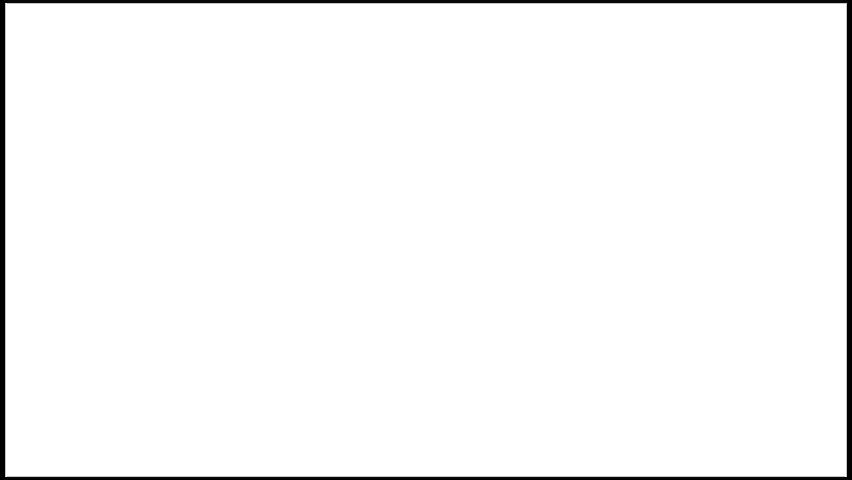

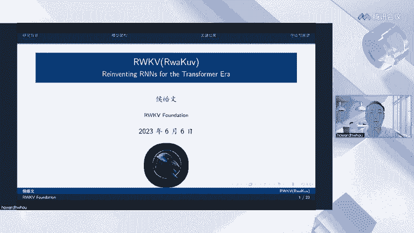

在本节课中，我们将学习一种名为RWKV的新型神经网络架构。它巧妙地将Transformer的并行化训练优势与RNN的高效推理能力结合在一起，旨在解决大语言模型在部署和推理时面临的计算与内存瓶颈。

## 概述：RNN与Transformer的局限性

上一节我们介绍了课程目标，本节中我们来看看RWKV想要解决的核心问题。传统的循环神经网络（RNN）和Transformer架构各有其显著的优缺点。

以下是RNN的主要局限性：
*   **梯度消失问题**：在训练长序列时，RNN容易出现梯度消失，导致模型难以学习远距离依赖关系。即使有LSTM、GRU等改进，其有效记忆长度通常也有限。
*   **无法并行训练**：RNN必须按时间步顺序处理数据，这限制了其利用大规模算力进行快速训练的能力，从而阻碍了模型规模的扩展。

以下是Transformer的主要局限性：
*   **二次复杂度**：标准Transformer的自注意力机制具有 `O(T²)` 的时间和空间复杂度（`T`为序列长度）。在处理长文本时，计算成本和内存占用会急剧上升。

RWKV架构的提出，正是为了结合两者的优点，同时缓解这些已知的限制。

## RWKV的核心创新：线性注意力机制

上一节我们了解了现有模型的瓶颈，本节中我们来看看RWKV的核心解决方案。它受到苹果公司“Attention Free Transformer (AFT)”工作的启发，提出了一种线性复杂度的注意力机制。

在AFT中，注意力分数计算从 `Qᵢ * Kⱼ` 改为了 `wᵢⱼ + kⱼ`。其中 `w` 是一个固定的位置偏置矩阵，`k` 是与token相关的向量，用于调制这个偏置。

RWKV在此基础上进行了关键改进，引入了**通道级（channel-wise）的时间衰减向量** `W`。这里的“通道”指的是隐藏层的每一个维度（共 `D` 维）。

RWKV的核心公式可以简化为一种类似指数移动平均（EMA）的聚合方式：
```
状态_t = 衰减 * 状态_{t-1} + 输入_t
```
其中，`衰减` 就是由向量 `W` 控制的，它决定了过去信息以多快的速率被“遗忘”。距离当前token越远的信息，衰减程度越大。这使得模型能以线性复杂度 `O(T)` 有效地融合历史信息。

## RWKV模型架构详解

上一节我们介绍了核心思想，本节中我们来深入看看RWKV模型的具体构成。RWKV由四个关键向量组成，其名称也来源于此：
*   **R (Receptance向量)**：控制接受多少过去信息的门控向量。
*   **W (Time-decay向量)**：上文提到的通道级时间衰减向量。
*   **K (Key向量)**：类似于传统注意力中的Key，用于调制位置信息。
*   **V (Value向量)**：类似于传统注意力中的Value，是信息的载体。

一个嵌入向量（Embedding）输入RWKV块后，会依次经过两个主要模块：

**1. Time Mixing 模块**
这个模块负责融合当前token与所有历史token的信息。其计算是线性的，依赖于可递归计算的 `WKV` 状态。可视化显示，当前token的权重最高，随着时间回溯，历史token的权重（颜色）逐渐衰减。

**2. Channel Mixing 模块**
Time Mixing主要进行时间维度的混合。为了增强模型的非线性表达能力，RWKV引入了Channel Mixing模块。它使用类似Sigmoid的强非线性函数，对同一个token内部不同通道（维度）的信息进行充分混合。

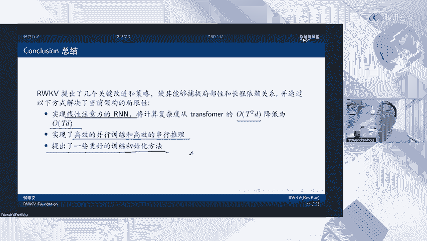

此外，RWKV还有一个关键设计：**Token Shift**。在输入每个模块前，当前token的嵌入会与上一个token的嵌入进行线性混合（例如：`mix = μ * x_t + (1-μ) * x_{t-1}`）。这可以理解为一种窗口大小为2的卷积操作。随着网络层数加深，模型顶层的感受野会线性增长（N层网络约有N的感知范围），这极大地增强了模型捕捉长距离依赖的能力。

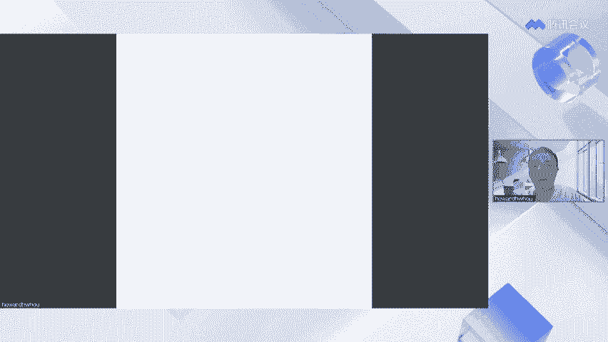

## 训练与推理：并行与高效的统一

上一节我们剖析了模型结构，本节中我们来看看它如何实现训练与推理的高效统一。

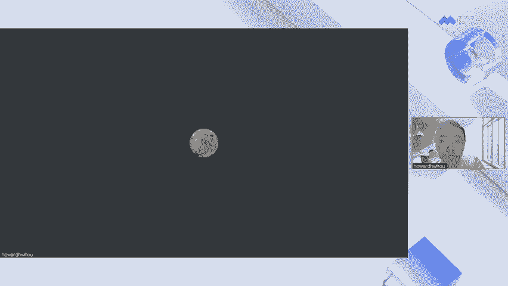

**并行化训练**
由于Time Mixing中的核心计算可以改写为不依赖前序状态递归的矩阵形式，因此RWKV可以像Transformer一样，对整个序列进行并行化训练，充分利用GPU算力。

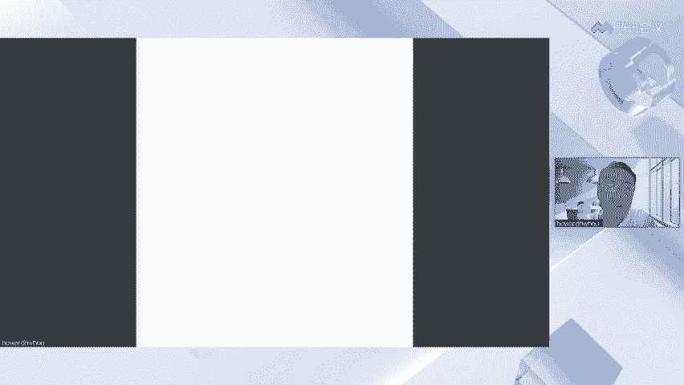

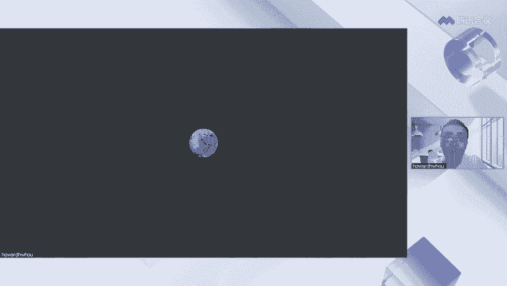

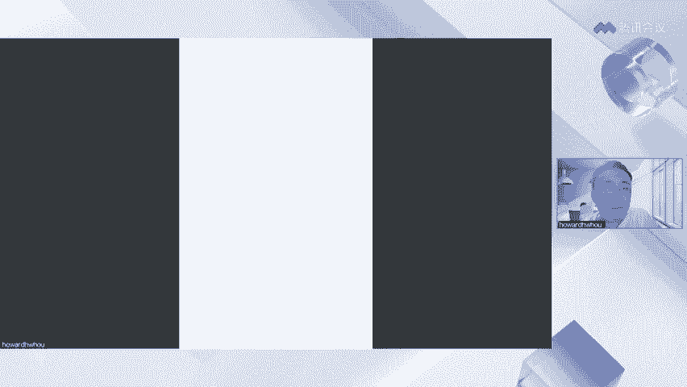


**RNN模式推理**
在推理（生成）时，RWKV可以切换到高效的RNN模式。因为 `WKV` 状态可以递归更新：
```
新状态 = f(旧状态， 当前输入)
```
模型只需要维护一个固定大小的状态（State），并基于它和当前输入来预测下一个token。这使得：
*   **单步推理时间恒定**，总生成时间随序列长度**线性增长**。
*   **内存占用恒定**，不随生成长度增加。
*   计算和内存需求仅随模型大小**线性增长**。

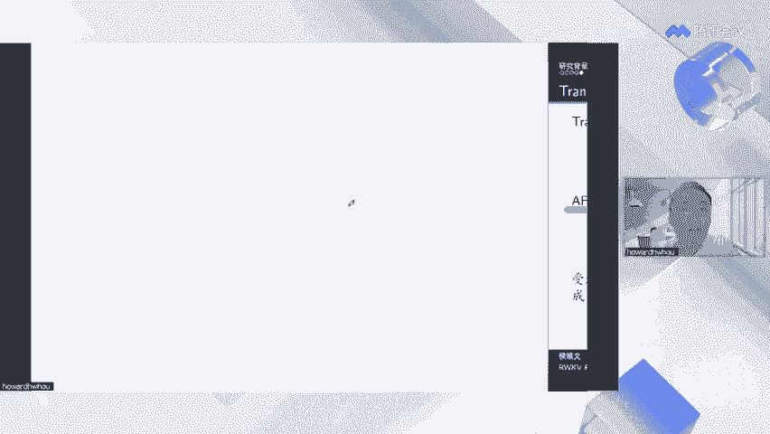

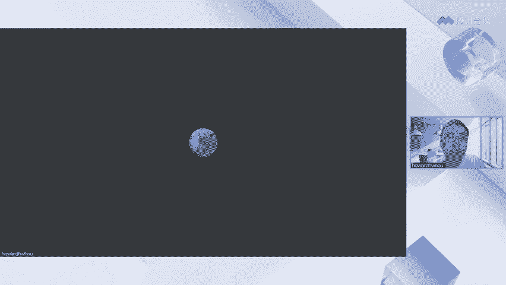

相比之下，Transformer在推理时需要缓存所有历史token的Key和Value（KV Cache），导致内存和计算量随序列长度增长而快速上升。

## 实验结果与优势

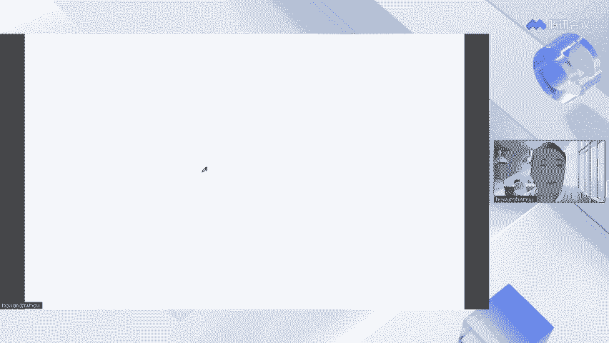

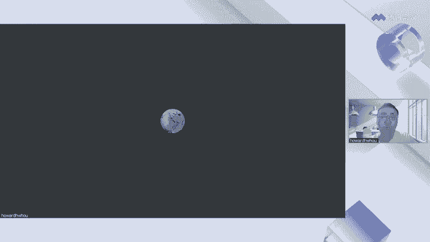

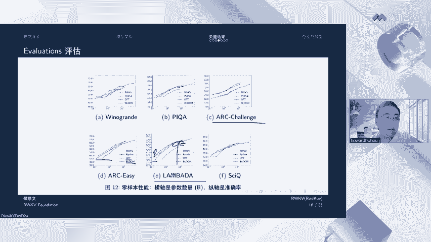

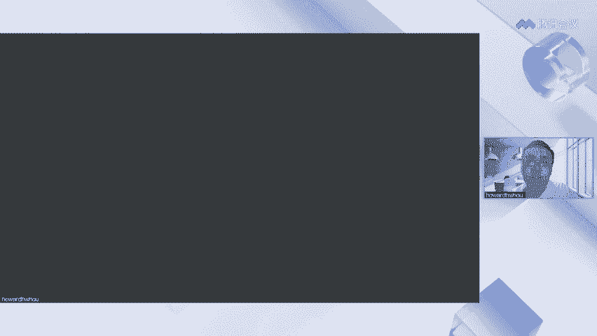

上一节我们了解了其高效性，本节中我们通过实验数据来验证RWKV的实际表现。

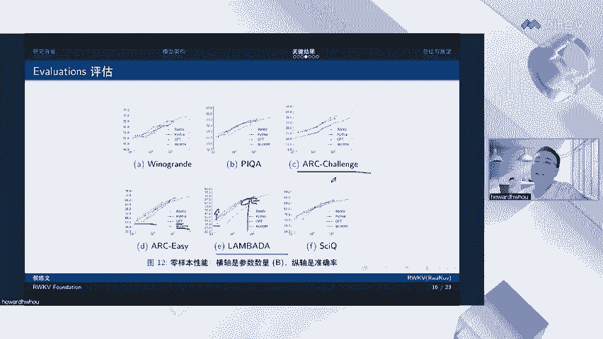

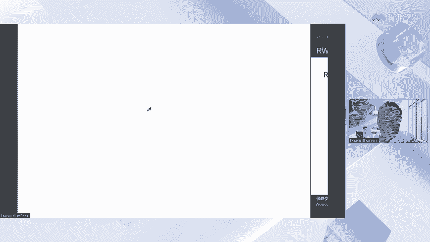

**长序列建模能力**
在语言建模损失（Perplexity）实验中，LSTM在约100个token后损失便不再下降，而RWKV在4096的序列长度上损失仍在持续降低，证明了其卓越的长程依赖捕捉能力。

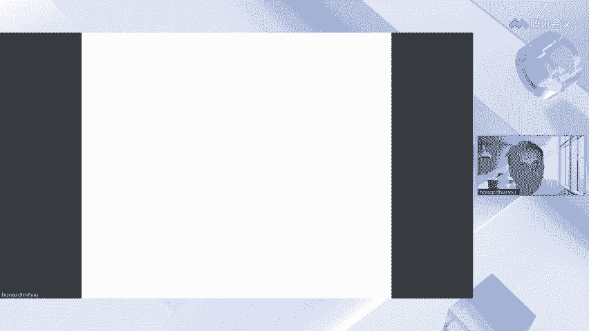

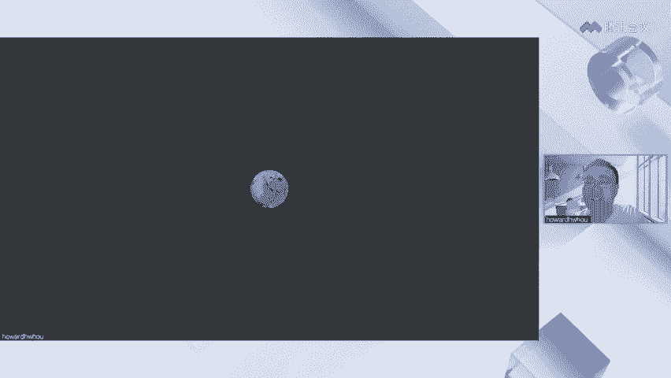

**模型性能**
在多项标准评测（如LAMBADA）中，RWKV的性能与同参数规模的Transformer模型（如GPT-Neo、BLOOM）相当，甚至在某些任务上更优。值得注意的是，RWKV从缩放定律（Scaling Law）中获益更大，模型参数越大，其性能提升越明显。

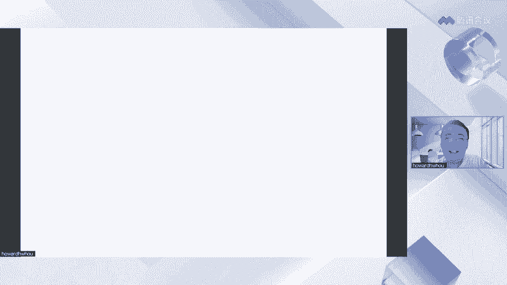

**部署优势**
RWKV的RNN推理模式带来了显著的部署优势：
*   **低资源部署**：可在CPU上以INT8精度运行70亿参数模型，仅需约16GB内存。
*   **降低硬件门槛**：使得在消费级GPU甚至未来可能的手机端部署大模型成为可能。
*   **突破限制**：减少了对高端GPU（如英伟达产品）的依赖。

## 当前局限与未来展望

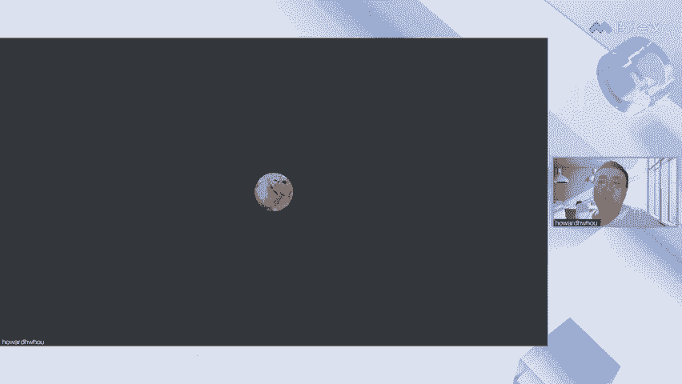

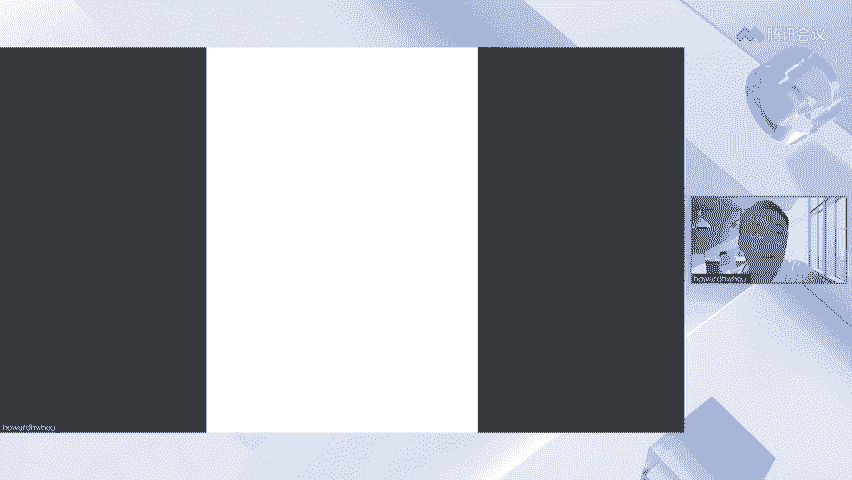

上一节我们看到了RWKV的优势，本节中我们也需客观了解其当前局限和未来发展方向。

**模型局限性**
*   **回望能力受限**：作为一种递归模型，RWKV难以像完整自注意力那样随时“回顾”并精确提取历史中任何位置的细节信息，信息在传递过程中会被压缩和衰减。
*   **对提示词（Prompt）更敏感**：由于上述原因，精心设计输入提示词以在早期强调关键信息，对于获得最佳性能可能更为重要。


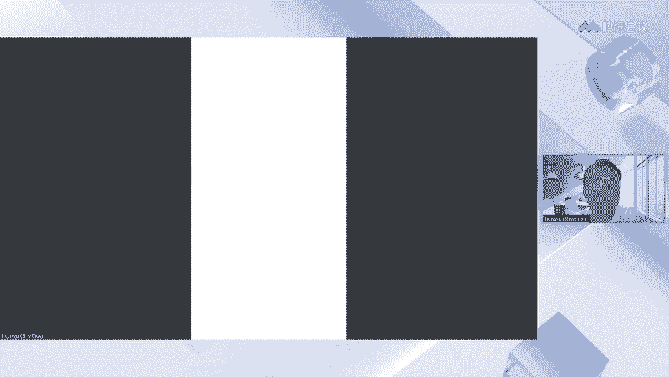

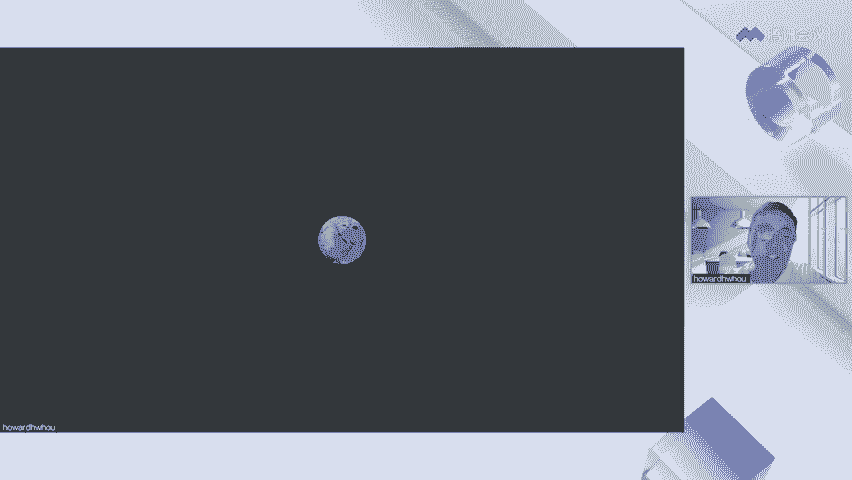

**未来改进方向**
未来的工作可能集中在：
*   **并行扫描算法**：进一步将计算复杂度降低到 `O(log T)`。
*   **扩展到编码器-解码器架构**：当前RWKV主要用于解码器架构。
*   **增强可解释性与安全性**。
*   **集成更高效的微调方法**（如LoRA）。

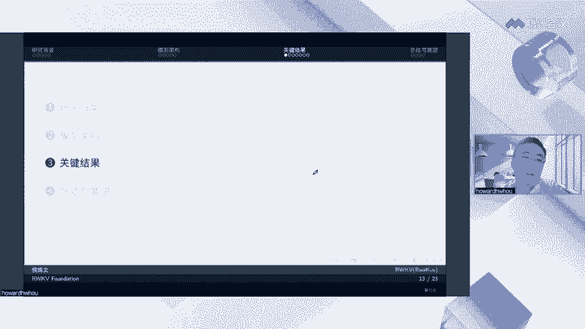

## 总结

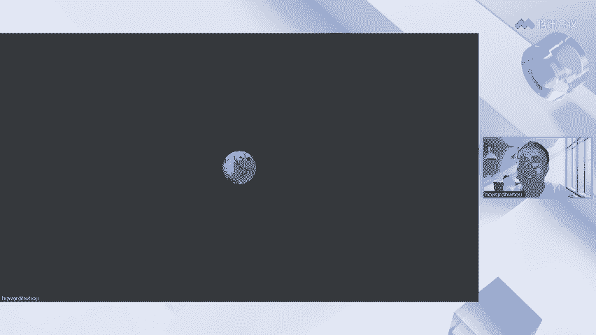

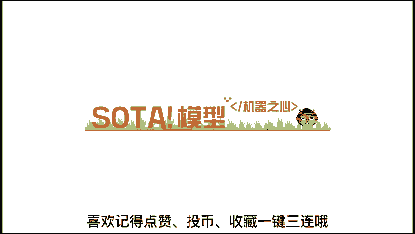

本节课中我们一起学习了RWKV模型。它是一种创新的线性注意力架构，通过融合RNN的高效递归推理与Transformer的并行训练能力，在保持与Transformer相当性能的同时，实现了 `O(T)` 的推理复杂度和恒定内存占用。RWKV为降低大模型部署成本、拓宽其应用场景（如端侧部署）提供了新的可能性，有望推动大模型基础架构的演进。