# 课程名称：RWKV-6 论文解读 - P1 🧠

## 概述
在本节课中，我们将学习 RWKV-6 模型的核心架构、设计理念及其与 Transformer 等模型的区别。课程将从背景介绍开始，逐步深入到 RWKV 的公式演进、计算成本分析，并探讨其作为联想记忆的本质。

---

## 背景介绍
RWKV 和 Transformer 代表了两种不同的模型架构。RWKV 是一种新型的 RNN，而 Transformer 则是大家熟知的架构。

传统的 RNN，如 LSTM 和 GRU，在处理长序列时容易出现梯度消失问题，并且无法并行化训练，导致训练效率低，可扩展性受限。

后来发展出的 Transformer 支持并行训练，但其计算复杂度是二次的，在长序列任务上计算成本和内存占用都非常高。内存占用持续增加在推理过程中容易导致内存溢出。

RWKV 则具有恒定的线性内存占用，使得它在运行过程中的可靠性更高。

---

## RWKV 总体架构
RWKV 由四个字母组成，与 Transformer 的 QKV 相对应。这四个字母贯穿了整个 RWKV 系列。

Transformer 使用一种寻址记忆模式。它先使用 Query 和 Key 进行匹配，找到最匹配的 Key，再取出对应的 Value。

RWKV 采用了不同的思想。它拥有 Key 和 Value，但不使用一个 Query 去进行整体计算。RWKV 的核心思想包括对整体信息进行衰减，以及对信息接受程度的衡量，即 Receptance。

衰减是必要的，因为模型的记忆容量有限。如果不衰减旧的记忆，新的记忆就无法进入。这就是字母 W 的含义。

Receptance 则用于控制模型对信息的接收程度。对于高价值信息，模型应通过较大的 Receptance 赋予其高权重。

---

## RWKV Block 结构
每个 RWKV Block 由两部分组成：通道混合和时间混合。

通道混合主要是一个 MLP 层，与其他大模型架构差异不大。

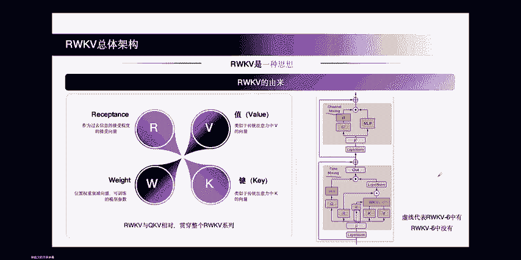

RWKV 的核心贡献和价值在于时间混合部分。

RWKV-5 和 RWKV-6 的参数相同，但计算过程不同。RWKV-6 引入了一条虚线，使得每次计算 WKV 算子时依赖于当前输入，这是非常重要的设计和核心理念。

---

## Token Shift 与数据依赖
所有进入 RWKV 的数据都会进行一次 Token Shift。Token Shift 是将当前 Token 和前一个 Token 进行混合。

RWKV-5 采用简单的线性插值，由一个可训练的参数 μ 决定混合比例。

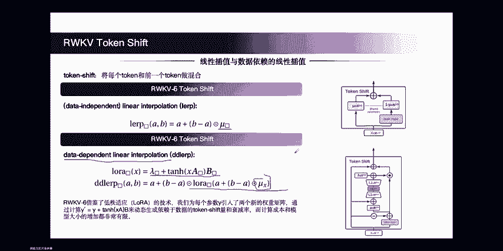

RWKV-5 的做法存在一个问题：插值参数应该由输入决定，效果会更好，而不是仅仅是一个静态的可训练参数。

因此在 RWKV-6 中，我们提出了数据依赖的线性插值。可以看到，参数 μ 的位置被替换成了一个 LoRA 模块。

RWKV-6 借鉴了 LoRA 技术，为每个参数引入了两个全新的矩阵 A 和 B。通过计算 `Y' = Y + tanh(X * A) * B` 来动态生成 Token Shift 的量和衰减率。

在计算成本有限的情况下，这增加了很少的计算成本，但很好地提高了模型的容量。

采用 LoRA 设计可以更好地复用 RWKV-5 训练的结果，因为 RWKV-6 是在 RWKV-5 上构建的。

---

## Time Mixing 核心公式演进
以下是 RWKV 系列模型 Time Mixing 核心公式的演进过程，这是整个系列最有价值的部分之一。

**RWKV-4：**
*   W、K、V 都是一个维度为 D 的向量，Head Size 为 1（单头）。
*   在第一步，会对 K₀、V₀ 进行计算，并加上一个偏置 μ。
*   后续步骤会进行累积和衰减，并对 K₀ 和 V₀ 进行指数衰减，即越远的信息衰减越多。

**RWKV-5：**
*   核心设计在于对角化 W 向量和 K、V 矩阵。
*   RWKV-5 将模型维度区分成多个 Head，每个 Head Size 是 64。每个头独立计算。
*   第一步也是加一个偏置 μ，然后将 K₀ 的转置和 V₀ 相乘，这就是所谓的矩阵值状态。
*   通过这种方式，模型的状态大小从 D 变成了 (D/H) * H（即一个矩阵），从一个向量状态进化成了一个矩阵状态。这是 RWKV-5 的最核心贡献，巧妙地扩大了整个状态的规模。

**RWKV-6：**
*   RWKV-6 的公式与 RWKV-5 相同。
*   它的核心贡献在于数据依赖的线性插值，使得 Token Shift 依赖于当前输入。
*   同时，衰减率 W 也依赖于当前输入。在 RWKV-6 中，每一步的 W 都是一个全新的、依赖于当前输入的值。
*   因此，RWKV-6 是一个完全动态的递归形式。其核心贡献是引入了通道宽度的动态衰减率 W_t。

---

## RNN 视角与代码示意
从 RNN 视角看，RWKV 可以写作一个递归形式：每一个新的 WKV 状态等于前一步的状态加上当前的偏置和新的 KV 对的一个组合。

RWKV-5 和 RWKV-6 的区别就在于那条虚线。RWKV-6 中有虚线，RWKV-5 中没有。另一个区别在于参数 μ，RWKV-5 是数据无关的，RWKV-6 是数据相关的。

从代码角度更容易理解。在代码中加入了 Batch Size 和 Head 数量两个维度。W 对于 RWKV-5 来说是与输入无关的，对于 RWKV-6 则是与输入有关的。偏置 μ 目前还是与输入无关的状态。

当新的 KV 进来时，会先计算新的 KV 值。这里使用外积的方式来更新记忆，根据相关研究，这种方式干扰最少，效果最好。

然后计算输出，输出公式是：`输出 = Receptance * (WKV_state + 偏置与KV的组合)`。
同时更新当前的 WKV 状态：`新状态 = 衰减率 * 前一步状态 + 当前KV`。

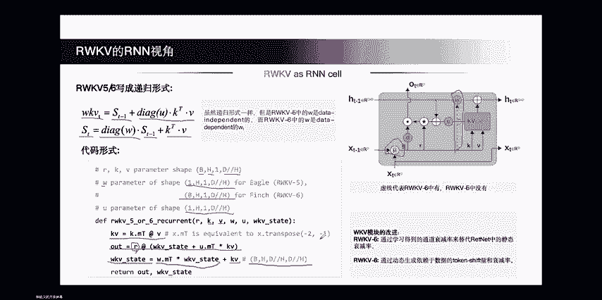

WKV 状态的形状是 `[Batch Size, Head 数量, Head Size, Head Size]`，是一个矩阵形式，因此称为矩阵值状态。

---

## 计算成本与状态大小分析
以下是 RWKV-5 和 RWKV-6 的计算成本分析。

参数量的计算主要来自矩阵乘法、Time Mixing、Layer Norm 和词表。

推理时的计算量简单认为是 2 倍的参数量加上 6 倍的 WKV 计算量。
训练时的计算量简单认为是 3 倍的前向传播计算量。

RWKV-6 因为引入了一些新的 Token Mixing 参数，所以这部分参数会比 RWKV-5 更大，其他部分相同。

下表提供了 RWKV-5 和 RWKV-6 在状态大小、参数量、推理和训练计算量上的直观规模对比。

关于状态大小：
*   RWKV-5 和 RWKV-6 的状态大小是 `6 * D * L`（D是模型维度，L是层数）。
*   RWKV-4 使用的是向量状态，大小为 `5 * D * L`。
*   Transformer 的状态大小是 `2 * D * L * T`（T是序列长度），与其输入的序列长度相关。

可以估算一下，当 Transformer 的上下文长度 C 约为 33 时，其状态大小才与 RWKV-5/6 相当。但一个只有 33 个 KV Cache 的 Transformer 很难完成复杂任务，而 RWKV 用 66 倍 D*L 的状态就已经够用。

这说明 Transformer 的状态存储效率相对较低。RWKV 通过不断有损压缩来获得新状态，而 Transformer 的无损特性必然带来内存膨胀，在长序列推理中容易导致内存耗尽。

---

## 与其他架构的 Time Mixing 对比
在这个赛道上，RWKV 并非唯一的玩家。

*   **S4 (Structured State Space)**： 其衰减机制使用了一个静态的、可训练的衰减参数 α。
*   **Mamba**： 可以看作是动态的 S4，核心贡献在于把衰减参数 α 从一个静态值转化为一个依赖于当前时间步输入 t 的动态机制。
*   **RetNet**： 使用了 Head-wise 的静态衰减。其衰减参数 γ 是人工设计的、不可训练的静态值，这也是我们认为 RetNet 表现不够好的一个核心原因。
*   **Mamba-2**： 又回到了线性注意力路线，其表达式与 RetNet 很像，但它把静态的 Head-wise 衰减改成了动态的 Head-wise 衰减，这是其核心改进。
*   **RWKV 系列内部迭代**：
    *   RWKV-5.1： 使用了可查询表格的、可训练的 Head-wise 衰减参数，相比 RetNet 的纯静态是进步。
    *   RWKV-5.2： 改进为通道宽度的、可训练的衰减。
    *   **RWKV-6**： 最终改进为**通道宽度的、动态的衰减**。RWKV-6 的这种设计是现阶段表达能力最高的设计，也是我们看到的所有模型中最优的设计之一。

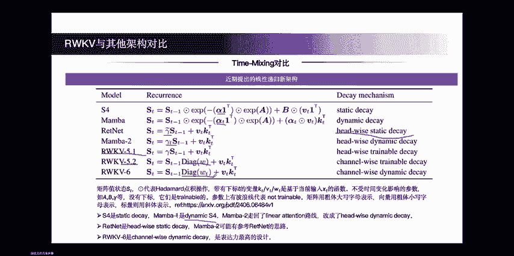

---

## 核心差异：寻址记忆 vs. 联想记忆
RWKV 和 Transformer 的核心差异不仅仅是线性注意力与二次复杂度注意力，或者线性和二次计算复杂度的区别。

本质上是两种记忆模式之间的区别。

Transformer 的记忆模式称为**寻址记忆**。它通过 Query 搜索 Key 来寻找地址，再取出对应 Value，类似于计算机的工作方式。其优点是可以不断拼接新的记忆，理论上只要硬件允许，可以拥有无限大的上下文。

RWKV 的记忆模式是**联想记忆**。它有一个状态 S_t 来存储所有信息。存入信息时，将 Key 和 Value 的外积加到状态中。检索信息时，用当前查询的 Key 与状态 S_t 进行内积，由于不同 Key 之间设计为正交，其他项内积为零，从而能检索出对应的 Value。这类似于用一个残缺的“9”就能从记忆中联想出完整的“9”。

更深刻的问题是，AGI 背后真正的记忆机制是什么？对于人类而言，记忆能力是有限的，并且在成年后可能衰减，这与联想记忆的特性更匹配。学术界普遍认为联想记忆更接近大脑的工作方式。

---

## RWKV-6 的其他改进：分词器与数据集
RWKV-6 论文中还设计了一个全新的分词器，称为 RWWKV Word 分词器。

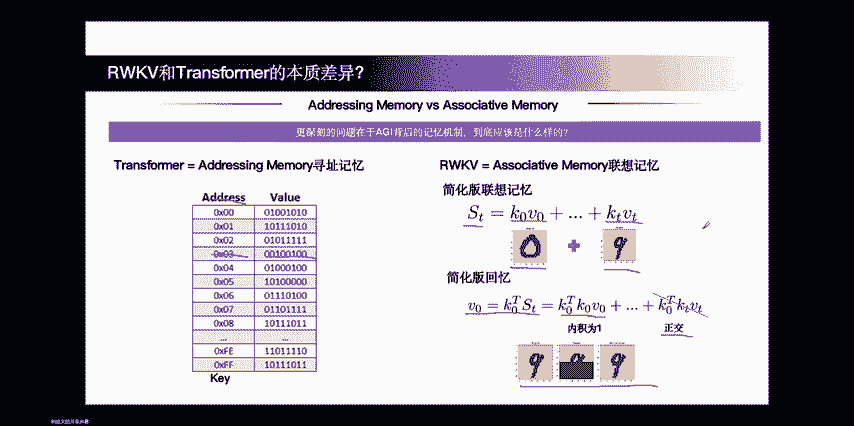

目标是兼容全世界更多的少数语言。传统 BPE 分词器主要在英文语料上训练，对其他语言代表性差，且可能带来推理成本问题。

因此，我们手动筛选并融合了多个分词器的词汇表，词汇表大小为 65536。RWWKV Word 分词器是一个贪婪分词器，每次选择当前能匹配到的最长 Token 进行匹配，并采用前缀树来优化编码速度。

这个分词器的性能非常优秀，优于 OpenAI 的 Tokenizer 和其他一些常用分词器的性能。

在数据集方面，RWKV-6 使用了总计 1.12T tokens 的多语言数据集，其中 70% 为英语，55% 为多语言，15% 为代码。没有进行任何上采样或下采样，保持了数据的原样。

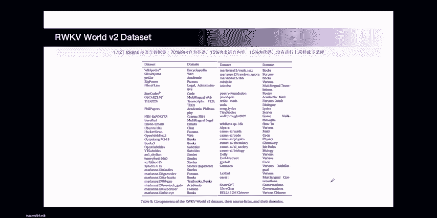

---

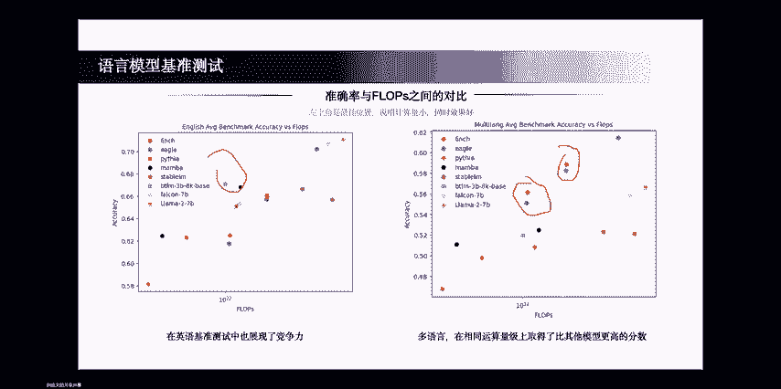

## 性能评估：语言与关联记忆
在多语言任务上，RWKV-6 表现出了很好的效果，平均分基本最高，超过了其他同规模模型。

在英语任务上，由于兼顾了其他语言，其表现也名列前茅，虽然在某些场景下可能略逊于个别模型，但整体能力处于前列。

在关联记忆测评任务上，RWKV 展现了极高的准确率。该任务用于衡量模型随着序列延长，能否回忆出其中的信息。

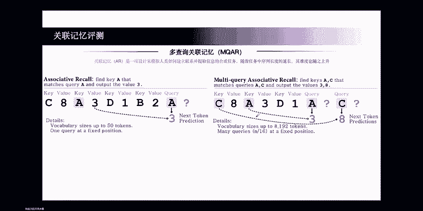

*   在序列长度 64 时，所有模型都没什么难度。
*   长度 128 时，RWKV-4 表现开始下降，但 RWKV-5 和 RWKV-6 仍保持 100% 准确率。
*   长度 256 时，更多模型掉队。
*   长度 512 时，只有 RWKV-6 在 64 的维度上依然能保持非常高的准确率，超越了其他已知的非 Transformer 架构。

在上行上下文实验中，在 PG19 数据集上，RWKV-5 和 RWKV-6 在序列长度超过训练长度 4096，达到约 10000 时，依然能保持很低的损失。而 RWKV-4 的损失则开始上升。Transformer 若无特殊设计，在超过训练长度后损失会急剧上升。

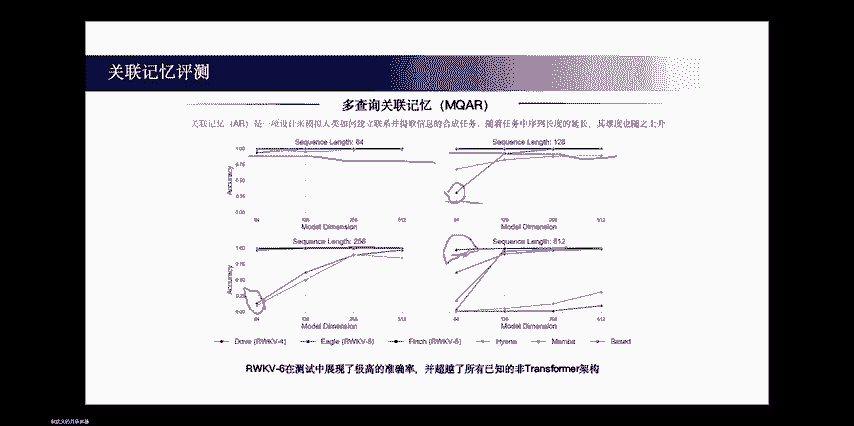

---

## 速度与内存性能评估
在批量大小为 8、维度为 4096 的设置下进行测试。

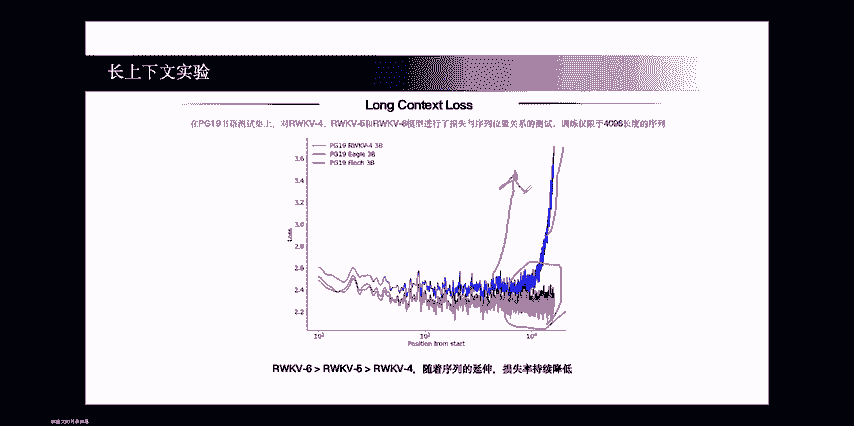

从内存使用来看，RWKV-6 一直是最低的。随着序列增长，其优势越来越明显。Flash Attention 虽然是优秀的工作，但在超长序列上，其内存使用仍会快速提高。

从推理时间来看，Flash Attention 基本保持了二次复杂度关系。而 RWKV 是一个线性关系，随着序列增长，其推理时间线性增加。

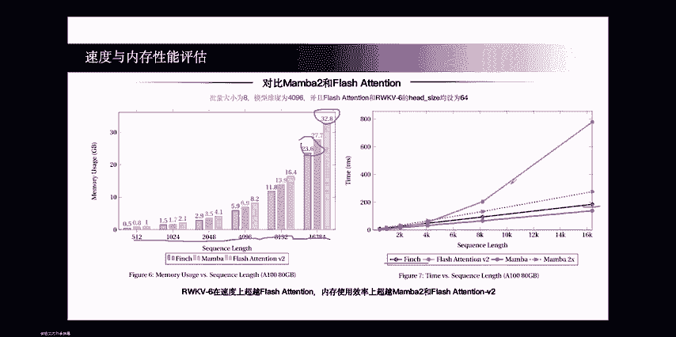

---

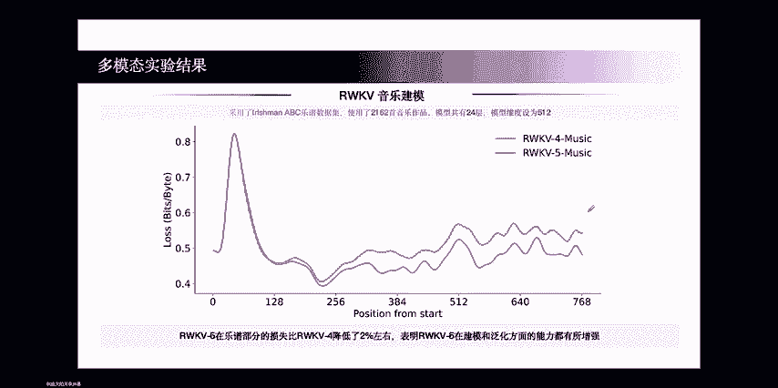

## 多模态与其他任务结果
**RWKV-5 在音乐数据集上**：相比 RWKV-4，音谱部分的损失降低了约 2%，在泛化和建模能力方面都有增强。

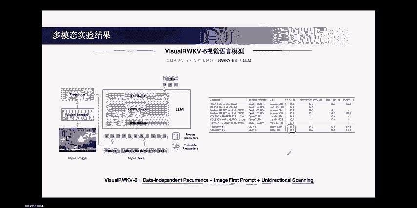

**RWKV-5 的视觉模型**：使用 CLIP 做视觉编码器，RWKV 做语言模型。它使用的是数据无关的递归，图片放在最前面，且只使用单向扫描，效果一般，与其他模型比还不错，但与 SOTA 有差距。

**RWKV-6 的视觉模型 (VU-RWKV)**：进行了大量改进，效果得到快速提升。
*   在多个数据集上超越了 LLaVA，特别是在中文数据集上得益于 RWKV 的多语言特性。
*   在其他学术数据集上，也优于 LLaVA。
*   同时保持了 RWKV 的线性推理时间和低内存占用的优势。在 2 万多上下文长度时，比 LLaVA 快 4 倍，节省 54% 的内存。

**VU-RWKV6 的具体改进**：
1.  **三明治格式**： 发现仅把图片放在前面不够好。让模型先知道要提取哪些信息（文本），再提取（图片），再做任务（文本），效果会好很多。这提升了模型效果。
2.  **双向扫描**： 对于文本是单向扫描，但对于图片，单向信息不充足。使用双向或多向扫描帮助模型提取全方位信息，再交给单向的 RWKV 生成，提升了效果。
3.  **RWKV-6 的数据依赖递归**： 这是最大的提升之一，在 VQA 任务上提升了近 15 个点。当迁移到多模态时，RWKV-6 的提升非常显著。

**RWKV 在音频上的实验**：引入了四向位移技术，能更好地捕捉二维频谱中的临近关系。

**RWKV-CLIP**： 将 Transformer 替换为 RWKV 来做对比学习，也表现出非常好的效果。在可视化中发现，RWKV-CLIP 的文本和测试图像之间产生了某种奇妙的对齐，而 Transformer 在非对称结构中的分离度较大。

此外，RWKV 也被用到了点云数据上，取得了不错的效果。

---

## 总结
本节课我们一起学习了 RWKV-6 模型的核心内容。

我们从背景出发，了解了 RWKV 作为一种高效线性 RNN 与 Transformer 的区别。深入探讨了 RWKV 的总体架构、Block 结构，特别是其 Time Mixing 机制的公式演进，从 RWKV-4 的向量状态到 RWKV-5 的矩阵值状态，再到 RWKV-6 的动态数据依赖递归。

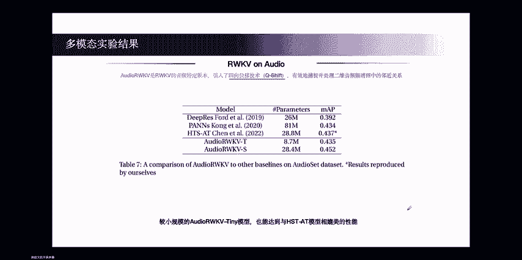

我们分析了 RWKV 的计算成本、状态大小效率，并与其他线性注意力架构进行了对比。更重要的是，我们探讨了 RWKV 作为联想记忆与 Transformer 寻址记忆的本质区别。

最后，我们查看了 RWKV-6 在分词器、多语言数据集、各类基准测试（尤其是关联记忆和长上下文）、以及多模态任务（视觉、音频）上的优异表现和具体改进。

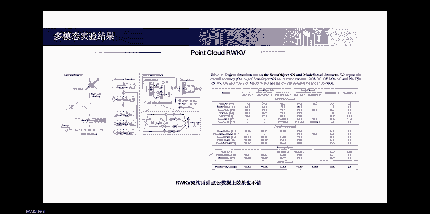

RWKV-6 在保持线性效率优势的同时，正在快速追赶 Transformer 的效果，展现出巨大的潜力。