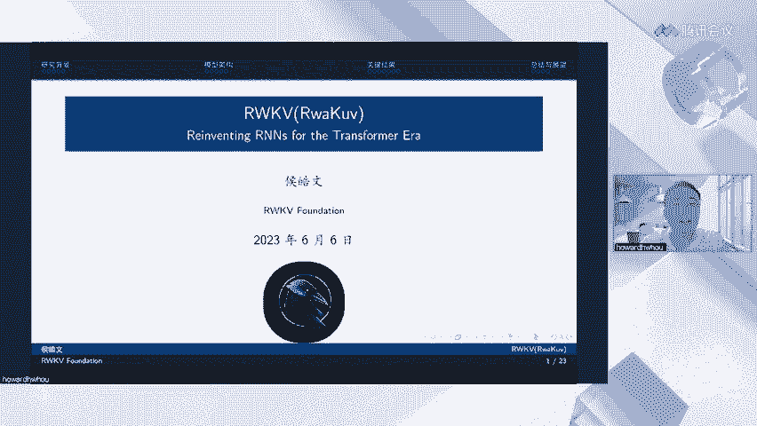
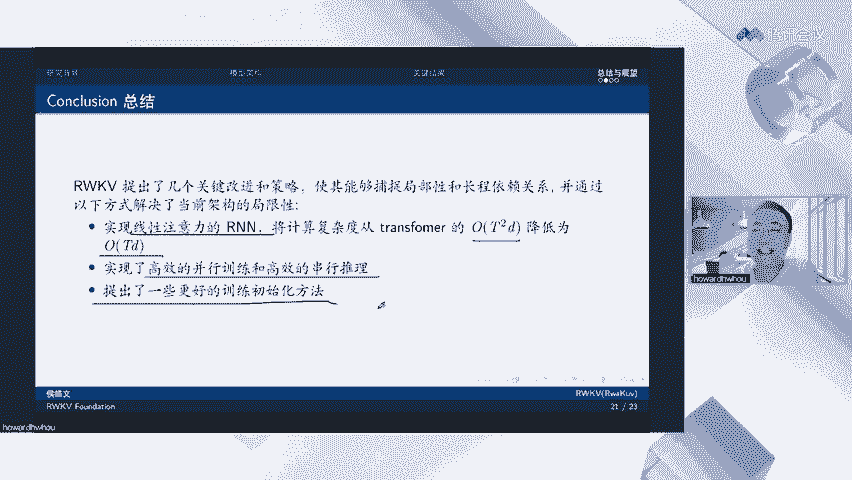
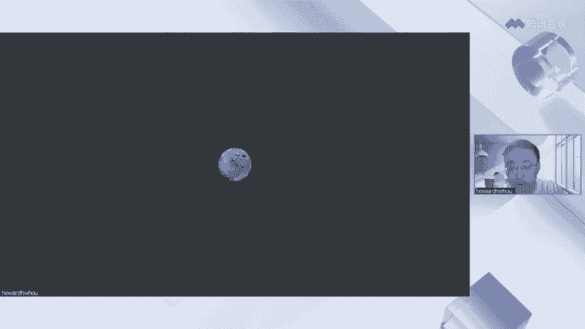

# 课程：RWKV：在Transformer时代重塑RNN - P1 🧠



在本节课中，我们将学习一种名为RWKV（发音为“Raccoon”）的新型神经网络架构。该架构旨在结合循环神经网络（RNN）和Transformer模型的优点，同时克服它们各自的局限性。我们将探讨其核心原理、架构设计、关键优势以及实际应用潜力。

---

## 概述：RNN与Transformer的局限性 🔍

上一节我们介绍了本课程的主题。在深入RWKV之前，我们需要理解现有主流架构的挑战。

传统的RNN在训练长序列时容易出现梯度消失问题。尽管LSTM和GRU等改进方案试图缓解此问题，但它们在超过约100个token后仍会开始遗忘信息。此外，RNN无法进行并行化训练，这严重限制了其模型规模的可扩展性。

另一方面，标准的Transformer模型虽然支持并行训练，但其注意力机制具有**O(T²)**的时间与空间复杂度（T为序列长度）。这在处理长序列时会导致极高的计算成本和内存占用。

RWKV架构的提出，正是为了同时解决上述问题。

---

## RWKV的核心卖点 ✨

以下是RWKV相较于传统Transformer的几个关键优势：

1.  **恒定单Token推理时间**：模型处理单个token的时间是恒定的，总推理时间随序列长度**线性O(T)**增加，而非Transformer的**二次方O(T²)**增加。
2.  **恒定内存占用**：推理时的内存占用不随序列长度增加，仅为**O(1)**。
3.  **高效的模型缩放**：推理时间和内存占用随模型尺寸**线性增长**，而其他模型可能是指数级增长。

这意味着使用RWKV可以大幅降低大模型的硬件限制和部署成本。它甚至可以在CPU和非英伟达的加速卡上运行，使得在普通台式机、笔记本乃至未来的手机端部署大模型成为可能。

---

## 从传统注意力机制到线性注意力 🧩

上一节我们了解了RWKV的优势，本节中我们来看看其核心思想是如何从传统注意力机制演变而来的。

传统的注意力机制计算如下（为简化，忽略缩放因子）：

**公式：** `Attention(Q, K, V) = softmax(Q * K^T) * V`

其中，Q（查询）、K（键）、V（值）均由输入序列生成。计算Q与所有K的点积（即`Q * K^T`）导致了**O(T²)**的复杂度。

RWKV的灵感部分来源于“Attention Free Transformer”。它摒弃了`Q * K^T`的乘法操作，转而使用一个可学习的时间衰减向量**W**和一个与位置相关的偏置**K**来调制注意力。RWKV在此基础上，提出了一个**通道级（channel-wise）的时间衰减向量W**。

**核心思想**：对于隐藏层的每一个维度（称为一个“channel”），模型学习一个独立的衰减因子。距离当前token越远的过去信息，在该channel上的衰减程度越大。这通过一个指数移动平均（EMA）的形式实现，将过去的信息平滑地累积到当前状态。

---

## RWKV架构详解 🏗️

上一节我们介绍了线性注意力的概念，本节我们来完整解析RWKV的架构。

RWKV的名称来源于其四个核心组件：
*   **R**：接收门（Receptance），决定接受多少过去信息。
*   **W**：时间衰减向量（Time-decay），控制历史信息的衰减率。
*   **K**：键值（Key），用于调制位置偏置。
*   **V**：值（Value），携带的信息内容。

一个嵌入向量输入RWKV块后，会依次经过两个主要模块：

### 1. 时间混合模块
此模块将当前token的信息与过去所有token的历史信息进行融合。
**公式（简化版）**：`wkv_t = (累积的过去状态) + (当前token的贡献)`
其中，过去状态的累积通过时间衰减向量**W**进行加权求和。这使得模型具有线性复杂度，并能有效捕捉长期依赖关系。

### 2. 通道混合模块
时间混合主要处理序列维度上的信息流动。通道混合模块则负责在**特征维度（channel）** 上引入强大的非线性变换，以增强模型的表达能力。
**公式中使用了平方ReLU等非线性函数**来混合不同通道的信息。

此外，RWKV引入了一个关键操作：**Token Shift（令牌平移）**。每个模块的输入不仅包含当前token `X_t`，还包含前一个token `X_{t-1}`。

**Token Shift的作用**：
*   可以理解为强制进行了一种二元组（bigram）建模。
*   从卷积神经网络（CNN）视角看，它相当于一个窗口大小为2的卷积核。
*   **更重要的是**：随着模型层数的堆叠，通过这种叠加效应，高层神经元能够获得非常大的感受野。例如，一个100层的RWKV模型，其顶层神经元理论上可以直接“看到”约100个token之前的信息，这极大地增强了其长上下文建模能力。

---

## 训练与推理：并行与循环模式 🔄

RWKV架构设计最巧妙的一点在于，它同时支持两种运行模式。

**训练模式（并行）**：
由于WKV计算可以重写为不依赖严格顺序的矩阵运算，因此RWKV可以像Transformer一样进行**完全并行化的训练**。这意味着它可以充分利用GPU等硬件，高效地在大规模数据上训练超大型模型。

**推理模式（循环）**：
在生成文本（解码）时，RWKV可以切换到RNN模式。模型只需要维护一个**状态（state）**，该状态浓缩了之前所有历史信息。每生成一个新的token，只需将当前token和这个状态输入模型，即可更新状态并输出下一个token。
**代码逻辑示意**：
```python
state = initialize_state() # 初始化状态
for token in input_sequence:
    output, state = model(token, state) # 输出预测，并更新状态
```
这种模式使得单步推理时间恒定，内存占用极低，非常适合自回归生成任务。

---

## 关键结果与评估 📊

上一节我们了解了RWKV的工作原理，本节我们通过实验数据来看看它的实际表现。

**长程依赖能力**：
在语言建模任务中，LSTM在约100个token后损失便不再下降，表明其遗忘了更早的信息。而RWKV在长达4096的序列上，损失曲线仍保持下降趋势，证明其具有强大的长程信息捕捉能力。

**模型性能**：
在多项标准基准测试（如LAMBADA、PIQA）中，参数量相当的RWKV模型性能与主流Transformer模型（如GPT、BLOOM）持平甚至有所超越。特别值得注意的是，RWKV的**缩放定律（Scaling Law）** 表现优异。当模型参数较小时，它可能略逊于Transformer；但当参数规模扩大到70亿或140亿时，其性能迅速追上并持平。这表明RWKV是大模型时代的理想架构之一。

**部署优势**：
*   **CPU部署**：通过INT8量化，16GB内存的普通电脑即可运行70亿参数的模型。
*   **GPU部署**：入门级GPU（如15GB显存）即可流畅运行70亿参数模型。
*   这为在边缘设备、个人电脑上部署大模型开辟了道路。



---

## 总结与展望 🎯

本节课我们一起学习了RWKV架构。我们来总结一下核心内容：

**核心改进**：
1.  提出了**线性注意力的RNN**，将训练和推理的复杂度从**O(T²)**降至**O(T)**。
2.  通过**时间衰减向量W**和**Token Shift**等设计，有效捕捉长序列依赖。
3.  支持**并行训练**与**循环推理**，兼具训练效率与推理效率。

**当前局限性**：
1.  **回望能力受限**：作为一种RNN，它无法像完整注意力机制那样随时访问所有历史细节，一旦信息被压缩或丢弃则无法找回。
2.  **对提示词（Prompt）更敏感**：需要更精心地设计输入提示，以在初始阶段引导模型关注关键信息。



**未来方向**：
未来的研究可能集中在：1）通过并行扫描技术将复杂度进一步降至**O(log T)**；2）发展适用于编码器-解码器任务的RWKV变体；3）增强模型的可解释性与安全性；4）开发更高效的微调方法。

RWKV代表了一种有前景的方向，它可能推动大模型从二次复杂度的Transformer架构，向更高效的线性架构迁移。