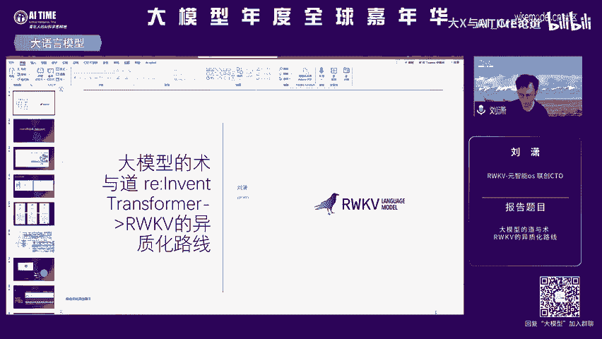
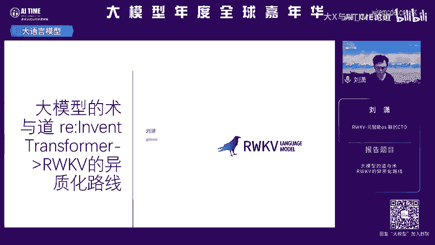
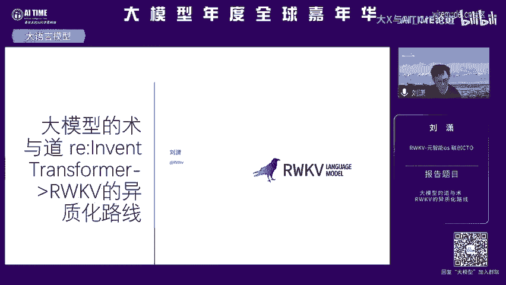
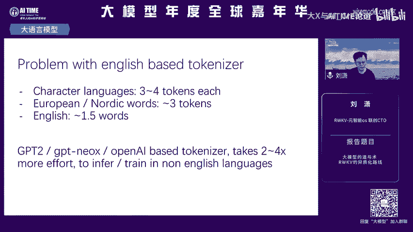
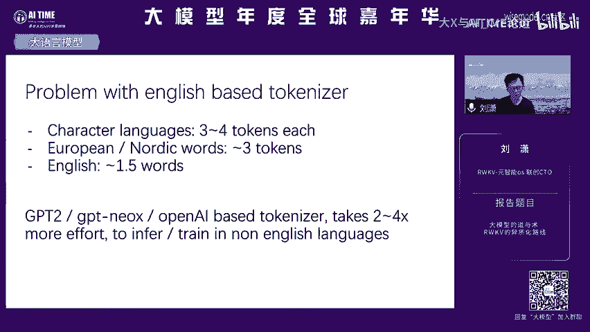
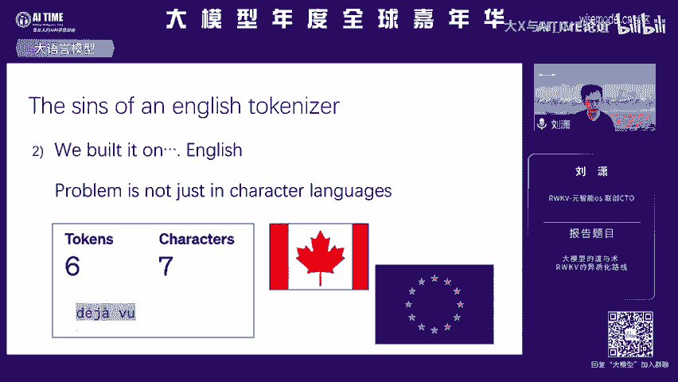
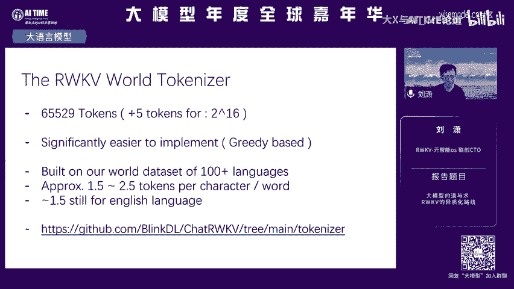

# 课程名称：RWKV异质化路线 - 大模型的道与术 (P1) 🧠

## 概述

在本节课中，我们将学习RWKV这一全新的大语言模型技术架构。我们将了解它的起源、核心设计思想、与Transformer架构的关键差异，以及它在多模态、长文本处理、推理效率等方面的独特优势。课程内容旨在让初学者能够清晰地理解RWKV的“异质化”路线及其背后的技术哲学。

---

## RWKV的起源与初衷 🌱

上一节我们概述了课程内容，本节中我们来看看RWKV这一架构是如何诞生的。

RWKV是一个全新的大语言模型技术架构。它是全球唯一基于RNN（循环神经网络）的语言模型。它是一个不同于Transformer的技术架构，同时也是一个生态和技术社区。这背后蕴含了作者及社区成员在过去三年中的努力。

RWKV的诞生主要源于几个初衷。首先，它希望像人脑一样思考，探索如何通过模型架构（最初是Transformer，现在是RWKV）来表达大脑的结构。其次，Transformer已经能够模拟大脑的一部分能力（例如海马体的记忆能力），但我们仍然需要一个“状态”（state）来实现长程记忆、规划以及对信息的抽取、压缩和抽象。RWKV认为宇宙是连续的，是一个状态到另一个状态的变换，因此希望通过“状态”来寻找答案。基于这些初衷，RWKV演变出了与Transformer的诸多区别。

---

## 架构的演变：从V4到V6 🏗️

上一节我们了解了RWKV的设计初衷，本节中我们来看看它的技术架构是如何一步步演进的。

RWKV在三年中，其架构从借鉴Transformer、CNN，最终演变为以RNN为核心。其核心思考是如何将Transformer的结构重新演化到我们想要的RNN结构中。

以下是RWKV架构从V4到V6版本的演变过程：

*   **V4版本**：其结构非常接近Transformer的核心回路，但其中的注意力机制被“Token Shift”操作替代。Token Shift本质上是一个CNN（卷积神经网络）结构。这使得RWKV具备了RNN的天然特性：无限上下文的状态外推能力远强于Transformer。这里的“状态”可以理解为对信息的压缩和抽象。
*   **V5版本**：核心工作是扩展“状态”的大小。状态被视为接近大脑的记忆体或信息压缩与规划能力的载体。V5的目标是让这个状态变得更大、更强大。
*   **V6版本**：核心工作是让状态的扩展和记忆内容变得“数据依赖”。即，模型根据当前输入的数据动态决定状态应该记忆和抽象什么，从而增强其泛化和抽象能力。

这些架构细节可以在RWKV官网及技术社区中找到。

---

## RWKV的能力与优势 ⚡

上一节我们梳理了架构的演变，本节中我们来看看RWKV模型实际表现出的能力及其优势。

在V4版本时，外界常认为RWKV是一个线性的、复杂度较低的Transformer变体，性能可能存在差距。但到了V5版本，其复杂度已经显著提升，并且RWKV与Transformer解决的是不同的任务。

以下是V5版本模型在性能上的一些体现：

*   **基准测试表现**：V5版本的1.5B参数模型已经达到了T5模型的水平，而7B参数模型也接近LLaMA 2的水平。作为一个主要依赖开源数据训练的模型，这证明了其底座模型的强大能力。
*   **推理性能优势**：由于RNN的“状态”机制，RWKV的推理时间复杂度是`O(N)`，并且显存消耗远低于Transformer的`O(N²)`，这是其天然优势。

---

## RWKV的差异化应用场景 🎨

上一节我们讨论了模型的整体能力，本节中我们聚焦于RWKV在一些具体应用场景中展现出的独特优势。

RWKV的“状态”机制使其在多模态、长序列处理等场景中表现得非常自然。

以下是RWKV的一些差异化应用示例：

*   **多模态**：`state`具备天然的信息压缩和序列化处理能力，为多模态信息（如图像、音频）接入文本序列提供了新的探索方向。开源项目`VisualRWKV`就是一个例子。
*   **音乐生成**：RWKV可以构建纯续写的乐谱生成模型。模型能够根据输入的乐谱片段，进行无限时长的音乐生成。这可以在手机等端侧设备上运行。
*   **AI智能体与对话**：得益于`state`切换几乎没有性能消耗的特性，RWKV可以高效运行大量AI智能体。例如，在MacBook Pro上可以同时运行200多个进行交互的智能体（AI小镇）。基于`RWKV Runner`项目，也可以在本地轻松进行角色扮演对话。
*   **长文本处理**：一个仅用16K上下文长度训练的RWKV模型，可以自然地外推到处理200K长度的PDF文档进行问答。虽然在某些需要精确记忆的长文本任务上可能不占优，但RWKV可以通过修改架构（例如加入注意力机制）来增强记忆能力。
*   **文本风格捕捉**：RWKV在捕捉文本风格和信息抽象方面有优势。例如，在小说续写任务中，它能很好地延续原作的写作风格。
*   **高效RAG系统**：社区有项目利用LoRA等方法，将同一个7B的RWKV模型同时改造为嵌入模型、检索模型和推理模型，从而用单一模型完成整个RAG流程，构建个人助手。

---

## 社区、规模化与Tokenizer 🚀

上一节我们看到了RWKV的多种应用，本节中我们来了解支撑其发展的社区、规模化潜力及其基础组件。

RWKV是一个由中国人主导研发和创新的开源项目，拥有活跃的技术社区。

以下是相关要点的介绍：

*   **社区与开源**：社区通过迁移学习、后预训练等技术，已经尝试训练出了120亿参数的模型。RWKV架构的持续升级，有望极大加速更大规模模型（如600亿、1000亿参数）的落地和应用。
*   **模型规模化**：RWKV架构的优化旨在不断提升训练效率，使得训练更大模型成为可能。
*   **Tokenizer的优势**：与GPT等模型使用的Byte Pair Encoding不同，RWKV使用基于词的Tokenizer。对于中文等语言，这避免了“一个字被拆成多个token”导致的上下文利用率低的问题。RWKV的Tokenizer对各种语言都保持约1.5个字符对应1个token的公平效率。
*   **推理效率对比**：由于`O(N)`的复杂度，RWKV在长序列推理时的速度和显存占用相比`O(N²)`的Transformer有显著优势。

---

## 总结

本节课中，我们一起学习了RWKV这一异质化的大语言模型路线。

我们从RWKV模仿人脑状态处理信息的初衷开始，回顾了其架构从V4到V6的演变历程，理解了其核心的“状态”机制。我们看到了RWKV在多项基准测试中证明的能力，以及其在推理效率上的天然优势。更重要的是，我们探讨了RWKV在多模态、音乐生成、长文本处理、AI智能体等场景下的差异化应用，这得益于其独特的状态设计。最后，我们了解了围绕RWKV的活跃开源社区、其模型规模化的潜力以及其Tokenizer的设计优势。

RWKV代表了一条不同于主流Transformer的技术路径，它在效率、序列处理和多模态融合等方面展示了巨大的潜力和独特的价值。