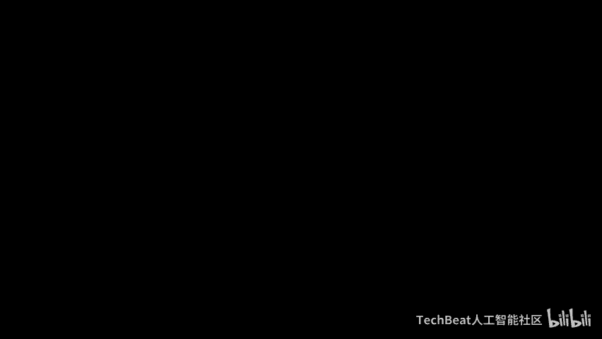
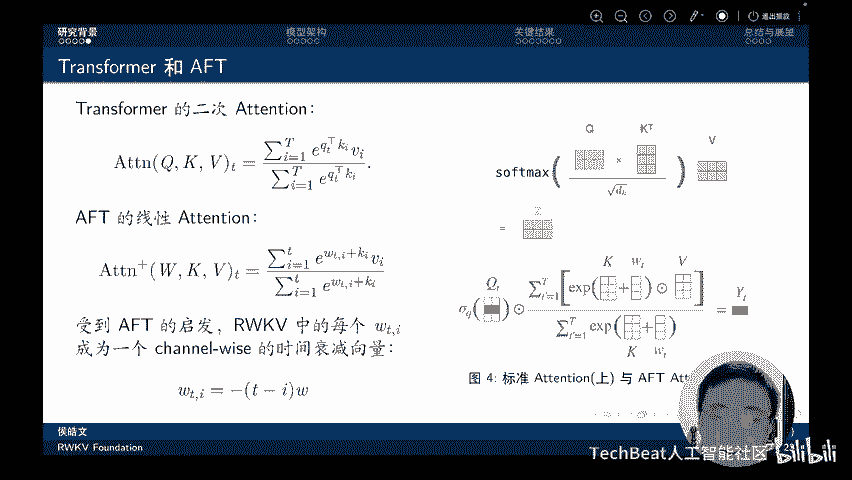
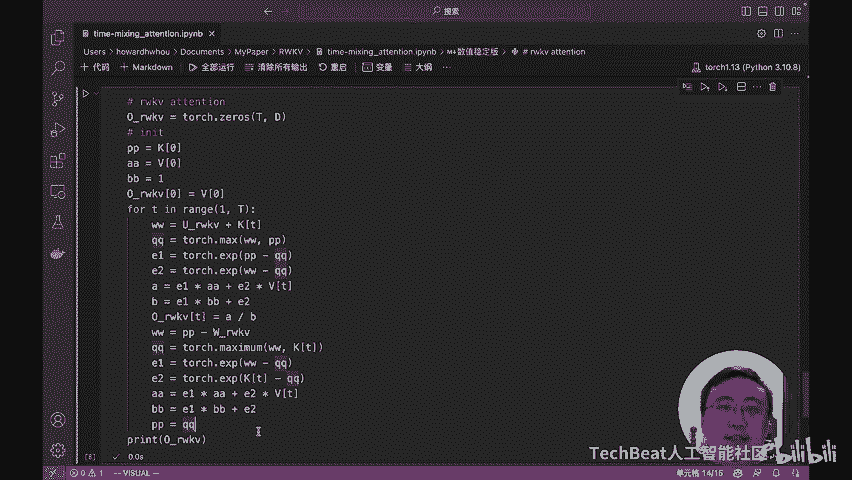

# 课程一：RWKV论文解读 - 在Transformer时代重塑RNN 🧠

在本节课中，我们将学习一种新型的大语言模型架构——RWKV（读作“R-W-K-V”）。我们将探讨其核心设计思想、技术优势，并理解它是如何结合循环神经网络（RNN）和Transformer的优点，同时克服它们各自局限性的。

## 概述

RWKV模型的核心卖点在于其**O(1)**的推理时间复杂度和**O(1)**的内存占用。这意味着：
*   单token推理时间恒定。
*   总推理时间随序列长度线性增长。
*   内存占用不随序列长度增长。
*   推理时间和内存占用随模型尺寸线性增长。

相比之下，标准Transformer模型具有二次方的注意力复杂度，在长序列任务中计算成本和内存占用很高。RWKV的这些特性有望大幅降低大语言模型的硬件和部署成本，推动从传统Transformer架构向具有线性注意力的新型架构迁移。

## RNN与Transformer的局限性

上一节我们介绍了RWKV的潜力，本节中我们来看看它旨在解决的传统架构问题。

传统的RNN存在以下主要限制：
*   **梯度消失问题**：虽然LSTM等变体试图缓解，但问题依然存在。
*   **训练无法并行化**：RNN在时间维度上无法并行计算，限制了其利用GPU资源进行训练和扩展的能力。

Transformer架构则存在另一个问题：
*   **二次方注意力复杂度**：其自注意力机制的计算复杂度为O(T²)，其中T是序列长度，导致在长序列任务中计算成本高昂。

RWKV模型的设计目标正是结合RNN和Transformer的优点，同时缓解这些已知限制。

## RWKV架构总览 🏗️

了解了背景后，我们现在深入RWKV的网络架构。RWKV结合了RNN的递归特性和Transformer的并行训练能力。

RWKV的名称含义如下：
*   **R**：Receptance（接受度向量）。
*   **W**：Weight（位置衰减权重）。
*   **K**：Key（键向量）。
*   **V**：Value（值向量）。

以下是RWKV的整体处理流程：
1.  输入token首先经过层归一化（Layer Norm）。
2.  进入 **Time Mixing** 模块，该模块负责在时间维度上混合信息，是线性注意力的核心。
3.  Time Mixing 模块的输出会与原始输入通过残差连接进行融合。
4.  融合后的结果输入到 **Channel Mixing** 模块，该模块负责在通道维度（特征维度）上混合信息，以增强模型的非线性表达能力。

## Time Mixing 模块：线性注意力的核心 ⏳

上一节我们看到了RWKV的整体结构，本节中我们重点剖析其核心——Time Mixing模块。该模块在不引入二次复杂度的情况下，实现了类似Transformer中QKV注意力机制的功能。

Time Mixing的核心思想是使用一个随时间衰减的权重向量 **W**。对于当前时刻 `t` 和过去时刻 `i`，注意力权重随距离 `(t - i)` 呈指数衰减，公式可简化为 `exp(-(t-i-1)*w + k_i)`。这使得模型能够以线性加权平均的方式，将遥远过去的信息传递到现在。

其计算过程可以理解为一种串行扫描：模型从左到右处理序列，每一步都将当前token的信息与一个累积的“状态”进行混合，并更新该状态。这个“状态”包含了所有历史信息的压缩表示。

## Channel Mixing 模块与Token Shift机制 🔀

在Time Mixing处理了时间维度信息后，数据会进入Channel Mixing模块。该模块的主要目的是增强模型的非线性表达能力。

Channel Mixing模块的一个关键设计是 **Token Shift** 机制。以下是该机制的工作原理：
*   在每一步，模型不仅接收当前token `X_t` 作为输入，还通过一个移位操作接收前一个token `X_{t-1}`。
*   这种设计使得模型在每一层都能直接看到相邻token的信息。
*   随着网络层数的加深，通过多层Token Shift的堆叠，模型顶层的感受野会线性增长。对于一个L层的模型，顶层的token可以“看到”前面L个token的信息。

因此，Token Shift机制隐式地为模型提供了更大的感受野和更强的序列建模能力，类似于简化的卷积或bigram模型。

## RWKV的推理优势：RNN模式解码 ⚡

RWKV的一个显著优势是它可以在推理时像RNN一样高效解码。这是通过将其并行计算形式转化为递归形式实现的。

其核心公式可以重写为递归形式。在推理时，模型只需要维护两个状态向量：`A_{t-1}` 和 `B_{t-1}`，它们编码了到前一时刻为止的所有历史信息。当新token `X_t` 输入时，模型通过以下步骤计算：
1.  基于 `A_{t-1}`, `B_{t-1}` 和 `X_t` 计算当前输出。
2.  使用 `X_t` 更新状态，得到 `A_t` 和 `B_t`，为下一步做准备。

这个过程完全避免了像Transformer那样需要存储和计算整个历史序列的键值对（KV Cache），从而实现了O(1)的内存占用和恒定的单步计算时间。

## 长程依赖与实验结果 📊

RWKV通过三种机制协同工作来捕捉长程依赖关系：
1.  **循环结构**：像RNN一样在时间步间传递状态。
2.  **时间衰减（Time Decay）**：通过指数加权平均传递历史信息，并隐式编码位置信息。
3.  **Token Shift**：扩大模型的感受野。

实验表明，在序列长度达到4096时，RWKV的损失仍在下降，证明其能有效捕捉长序列中的信息。可视化分析也显示，不同网络层学会了不同的衰减策略，底层更关注局部信息，而高层则倾向于保留更长的历史信息。

在模型性能方面，随着参数规模增大，RWKV在多项评测任务上的表现迅速接近并匹敌同等规模的Transformer模型，显示出优秀的可扩展性（Scalability）。

## 部署优势与总结 🚀

RWKV的线性复杂度带来了巨大的部署优势。以下是其关键优势：

**推理效率对比**
*   RWKV生成长度为T的序列，总时间是**O(T)**线性增长。
*   Transformer则是**O(T²)**二次增长。在生成1000个token时，RWKV已有约6倍的性能优势。

**端侧部署能力**
*   **CPU**：16GB内存可运行70亿参数模型；支持INT8量化后，12GB内存即可运行。
*   **GPU**：15GB显存可运行70亿参数模型；INT8量化后仅需9GB显存。
这使得在普通台式机、笔记本甚至未来手机上部署大模型成为可能。

**总结与展望**
本节课我们一起学习了RWKV模型。它通过实现线性注意力的RNN，将计算复杂度从Transformer的O(T²)降低到O(T)，同时支持高效的并行训练和串行推理。

RWKV也存在一些限制，例如在回忆上下文中非常细节的信息时可能不如完全的自注意力机制灵活，并且对提示词（Prompt）工程可能更敏感。

未来的工作方向包括：
*   优化并行扫描算法，以处理超长序列。
*   将RWKV扩展到编码器-解码器架构，用于多模态、检索增强等任务。
*   基于其确定性的状态进行可解释性、可控性和安全性研究。

RWKV为代表的新架构，正在推动大语言模型向更高效、更易部署的方向演进。

---
*注：本教程根据新加坡国立大学博士侯皓文的分享内容整理，聚焦于RWKV的核心思想与架构，省略了代码演示部分。*