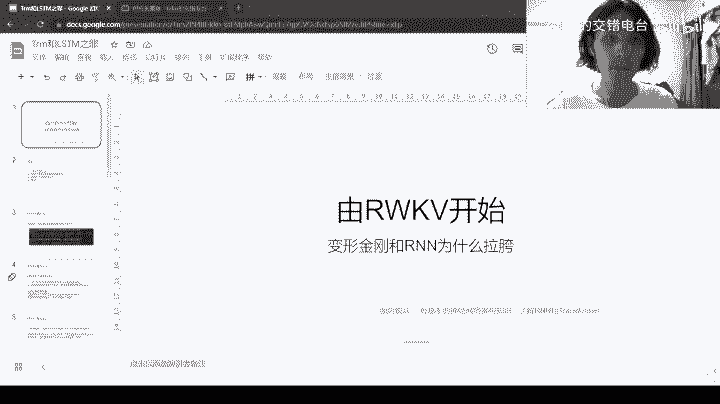
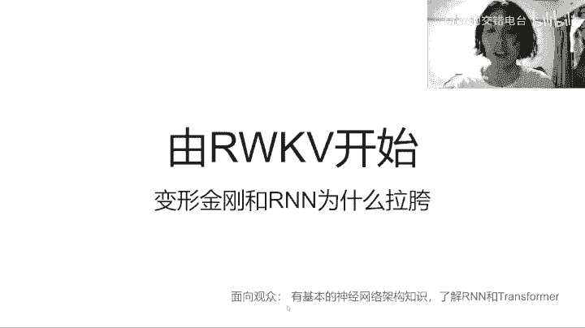
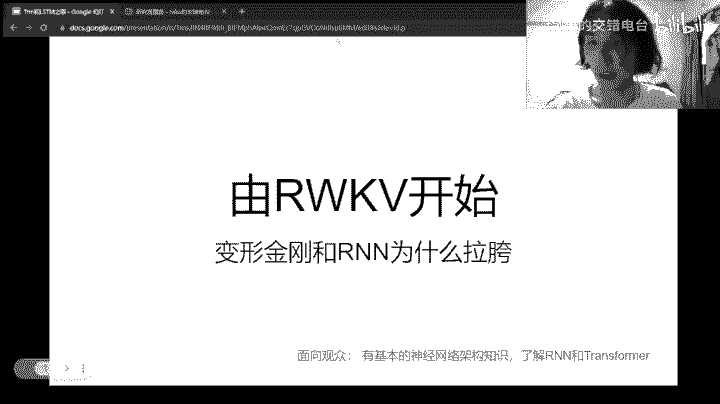
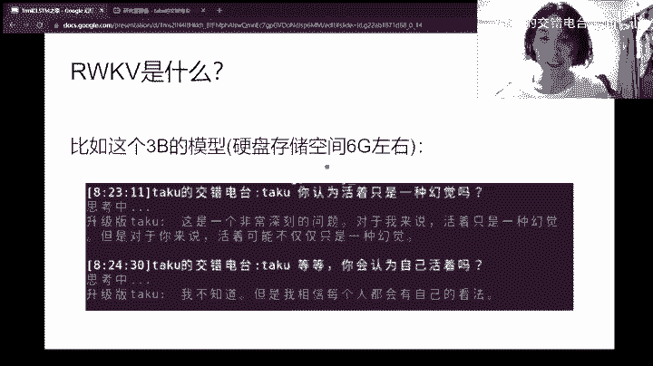
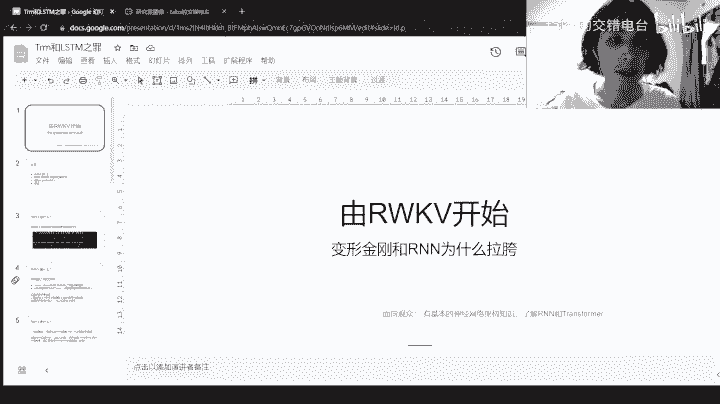
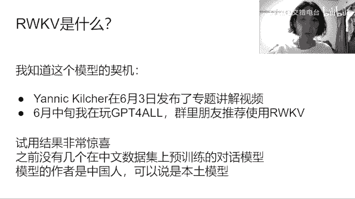
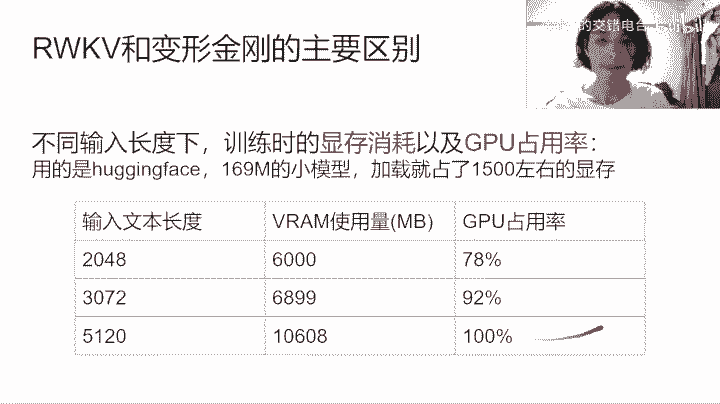
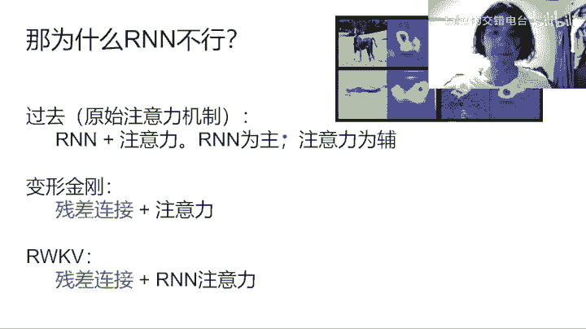
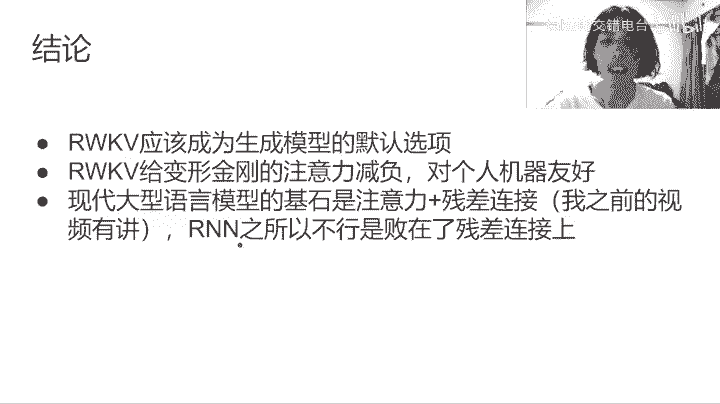
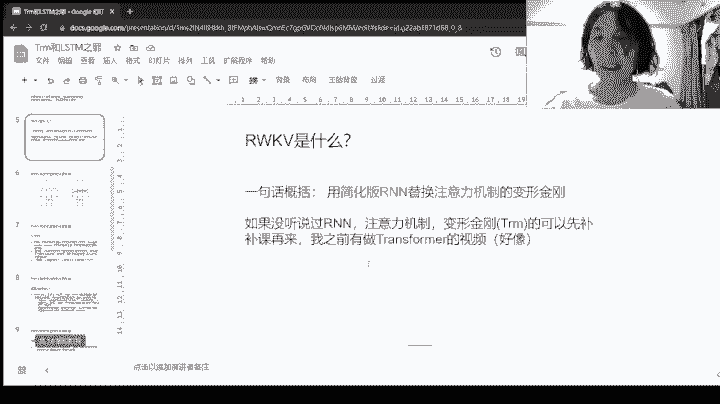

# 课程 P1：你必须了解RWKV 🚀，以及Transformer为何存在局限

在本节课中，我们将学习一个名为RWKV的新型大型语言模型。我们将探讨它的核心原理、与主流Transformer架构的关键区别，以及它为何在某些方面表现优异。课程内容旨在让具备基本神经网络知识的初学者也能理解。

---

## 概述 📋

RWKV是一个在中文社区兴起的大型语言模型。它的核心创新在于用线性计算复杂度的RNN式注意力机制，替代了Transformer中平方计算复杂度的注意力机制。这使得模型在保持良好性能的同时，对计算资源更加友好，尤其适合在个人电脑上运行。

---

## RWKV是什么？🤔

用一句话概括，RWKV是一个**用简化版的RNN替换了注意力机制的Transformer**。

为了理解这一点，我们需要先对比RWKV和Transformer的结构差异。

### RWKV与Transformer的结构对比

以下是RWKV（左）与Transformer（右）的核心结构示意图：

我们先看右侧广为人知的Transformer部分：
*   输入经过一层线性变换后，会得到用于计算注意力的键（K）、值（V）、查询（Q）。
*   注意力的本质是**每个token都需要与序列中的所有其他token进行交互**。
*   因此，其**计算量和内存消耗都与序列长度的平方（O(n²)）成正比**。序列越长，资源消耗增长越快。

我们再来看左侧的RWKV部分：
*   它将Transformer中平方级别的注意力（Attention）替换为了一种RNN式的注意力。
*   这种结构的**计算量和内存消耗与序列长度呈线性（O(n)）增长**。
*   这是RWKV一个显著的优势。

---

## RWKV的优势与特点 ✨

上一节我们介绍了RWKV的核心结构，本节中我们来看看它带来的几个关键特性。

### 1. 时序编码与连续性
*   **天然编码时序**：RNN式的结构天然地编码了序列的顺序信息，因此可以**省去Transformer中必需的“位置编码”（Positional Encoding）**。在Transformer中，如果没有位置编码，模型将无法区分“猫追老鼠”和“老鼠追猫”。
*   **连续处理文本**：RNN结构为连续处理文本提供了可能性。语言本质上是线性组织的，RNN可以自然地维护一个“隐藏状态”（hidden state），在处理新句子时沿用之前句子的信息，这比Transformer的切片处理方式更为自然。

### 2. 计算效率
*   **线性计算复杂度**：如前所述，RWKV的计算消耗是线性的，这对于生成长文本或处理长上下文非常有利。
*   **牺牲并行性**：这个优势的代价是**牺牲了并行计算能力**。Transformer的注意力计算没有顺序依赖，可以同时进行。而RWKV的RNN结构存在顺序依赖，必须逐个token计算，无法充分利用GPU的并行能力。

### 3. 模型性能与资源消耗
RWKV作为一个约6GB的模型，在中文对话上展现出了令人惊喜的效果。它拥有纯中文数据集预训练的版本，是本土化模型的优秀代表。

以下是关于资源消耗的实验观察：

使用Hugging Face发布的RWKV模块（169M参数小模型）进行测试，观察不同输入长度下的显存占用：
*   模型加载后占用显存约 **1500 MB**。
*   输入长度2048 token时，显存占用约 **6000 MB**。
*   输入长度增加1024 token，显存占用增加约 **900 MB**。
*   输入长度再增加2048 token，显存占用上升至约 **11000 MB**。

可以看到，显存占用随着序列长度**线性增长**。如果使用传统Transformer，其增长趋势将是平方级别。

---

## 为什么单纯的RNN不行？🤷‍♂️

既然RNN结构有这些好处，为什么过去的大型语言模型不主要使用RNN呢？上一节我们看到了RWKV的效率，本节我们来探讨深层原因。

神经网络的性能本质上取决于其**深度**和**参数量**。但单纯堆叠RNN的层数（增加深度）效果很差，核心原因在于缺少**残差连接**。

残差连接是现代深度神经网络能够成功训练非常深层次的关键技术。它允许梯度直接穿过网络层，缓解了梯度消失问题。

以下是Transformer、RWKV与传统RNN在结构思想上的对比公式：

*   **Transformer / RWKV 通用思想**：
    `hidden = hidden + Attention(hidden)`
    或
    `hidden = hidden + RNN_Attention(hidden)`
    这里的 **`+`** 操作就是残差连接，注意力或RNN注意力是作为“增量”附加到隐藏状态上的。

*   **传统RNN+注意力**：
    传统方法是以RNN为主体，注意力仅为辅助。其结构思想更接近：
    `hidden = RNN(hidden)`
    注意力可能被用在别处，但**没有在主干网络上形成稳定的残差连接**，因此难以堆叠得很深。

**结论**：现代大型语言模型的基石其实是 **“注意力机制 + 残差连接”**。Transformer是“残差连接 + 自注意力”，RWKV是“残差连接 + RNN式注意力”。而早期RNN的失败，很大程度上是因为缺失了残差连接这一关键组件。

---

## 结论与展望 🔮

综合以上分析，我们可以得出以下结论：

1.  **RWKV应作为生成模型的默认选项之一**：在资源受限或需要处理超长序列的场景下，RWKV的线性复杂度优势明显。它能为Transformer“减负”，对个人计算设备更加友好。
2.  **注意力机制在缓慢衰减**：RWKV的注意力机制会随着时间推移，逐渐降低对遥远历史token的关注，这符合人类处理信息的直觉。
3.  **架构选择策略**：在RWKV性能足够时优先使用它，在需要极致并行计算能力或某些特定任务上再考虑Transformer，这是一种合理的策略。

最后，尽管RWKV项目为了追求性能在通用性上做出了一些妥协（例如早期Hugging Face版本存在一些Bug），但它所代表的架构方向极具潜力，值得自然语言处理领域的研究者和开发者密切关注与尝试。

---

## 总结 🎯

本节课我们一起学习了RWKV模型。我们从它与Transformer的结构对比入手，理解了其**线性计算复杂度**的核心优势及其**牺牲并行性**的代价。我们探讨了它**天然编码时序**、**适合连续处理**的特点，并通过实验观察了其资源消耗的线性增长。最后，我们分析了**残差连接**的重要性，解释了为何单纯的RNN难以构建大型模型，而RWKV通过结合RNN与残差连接取得了成功。RWKV为大型语言模型的发展提供了一个高效且有趣的新思路。