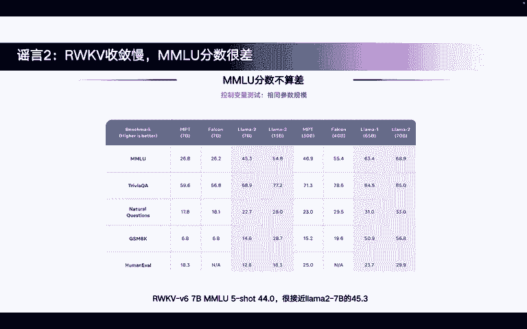
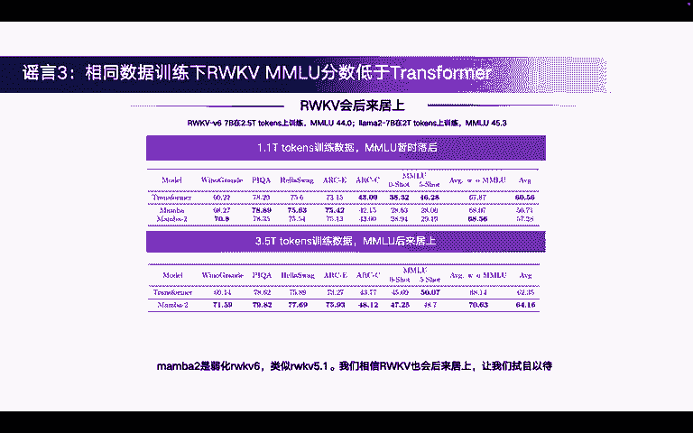
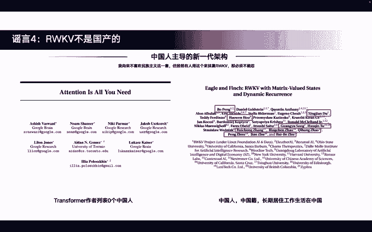

# 课程 1：破除关于RWKV的5个谣言 🧐

在本节课中，我们将逐一审视并澄清关于RWKV模型的五个常见误解。我们将通过实验数据、论文引用和事实分析，帮助你清晰地理解RWKV的真实特性。

---

## 谣言一：RWKV训练效率低下

上一节我们介绍了课程概述，本节中我们来看看第一个谣言：RWKV的训练效率比Transformer慢得多。

散播此谣言的人常将RWKV视为LSTM时代的传统RNN，认为它必须逐个处理Token而无法并行，因此训练速度慢。但事实并非如此，RWKV早已革新，与旧式RNN完全不同。

以下是验证RWKV训练效率的实验说明：
*   **实验基线**：使用高度优化的nanoGPT代码，它已通过混合精度训练和Flash Attention等技术，达到了单机训练的极限效率。
*   **实验结果**：如右图所示，表格的“训练时间”列代表训练一个step所需的时间。
    *   在短上下文长度下，RWKV的训练速度确实略慢于使用了Flash Attention的GPT。
    *   当上下文长度达到4K时，两者训练时间均约为1000毫秒，速度已非常接近。
    *   当上下文长度达到8K时，RWKV的训练速度已超过GPT。
    *   如果需要更长的训练上下文，RWKV的优势将进一步扩大。

因此，RWKV在长上下文训练中效率很高，并非训练缓慢。

---

## 谣言二：RWKV收敛慢且MMLU分数差

在了解了训练效率后，我们来看看关于模型性能的谣言：RWKV收敛速度慢，并且在MMLU基准测试上表现不佳。

实际上，真正运行过RWKV的人都知道，其收敛速度比Transformer快得多。

以下是相关证据：
*   **收敛速度**：真实的训练结果显示，在使用nanoGPT作为参照的对比中，RWKV的损失（Loss）下降速度比GPT更快。
*   **综合能力**：左图展示了RWKV 6 7B模型在一系列英文及多语言测试集上的效果。其英文能力仅次于Llama 3 8B和Mistral 7B，而多语言能力则是最佳的，这得益于其在2.5T的多语言文本上进行训练。
*   **MMLU分数**：RWKV 6 7B的MMLU分数并不差，在5-shot设置下可达44.0分，非常接近Llama 2 7B的45.3分。在开源社区的开源模型中，这是一个相对有竞争力的分数。

所以，RWKV收敛迅速，且其MMLU分数在同等规模模型中具有竞争力。

---

## 谣言三：相同数据下，RWKV的MMLU分数低于Transformer

基于上一节的分数，可能产生一个新的疑问：在相同训练数据量下，RWKV的MMLU分数是否真的低于Transformer？

从已有数据看，RWKV 6 7B使用2.5T token训练，MMLU得分为44.0；Llama 2 7B使用2T token训练，得分为45.3。这似乎表明RWKV用了更多数据，分数却略低。

但英伟达的一篇关于Mamba模型（另一种无标准注意力机制的新架构）的论文揭示了重要现象：
*   当Mamba在1.1T token上训练时，其在其他测试集上表现良好甚至优于Transformer，但MMLU分数暂时显著落后。
*   当训练数据量提升到3.5T token时，Mamba的MMLU分数实现了反超，其Zero-shot分数甚至超过了Transformer。

这说明了什么？
> 这说明Transformer与其他新架构确实有不同的学习过程。它们在不同训练阶段（Token数量）可能经历不同的学习轨迹。在足够多的数据（如3.5T）下，新架构的MMLU分数能够后来居上。

Mamba 2可以被视为一个简化版的RWKV 6。我们有理由相信，随着训练数据的增加，RWKV在MMLU等基准上的表现也会进一步提升。

---

## 谣言四：RWKV不是国产模型

讨论完技术性能，我们来看一个关于出身的谣言。虽然不推崇民族主义，但有人以此抹黑RWKV，有必要澄清。

以下是关于模型“血统”的事实对比：
*   **Transformer**：其原始论文的作者列表中没有任何中国人，国产化率为0%。这已成为无法改变的历史事实。
*   **RWKV**：无论是RWKV 4、5还是6的论文，都有大量中国人参与。RWKV的核心架构创新和开发的主导者**彭博**是中国人，长期在中国居住和工作。
    *   因此，可以说RWKV是中国人主导的新一代架构。
    *   即使退一步讲，承认有不少外国友人也参与了研发，RWKV作者列表中的中国成分也远高于Transformer。

作为补充信息，备受关注的Mamba模型，其两位主要作者据信分别是华裔美国人和越南裔美国人。

因此，称RWKV具有高国产成分或由中国主导，是符合事实的。

---

## 谣言五：RWKV是民科模型

最后一个谣言涉及对RWKV创始人背景的偏见：认为彭博不在学术界，所以RWKV是“民科”模型。

这种观点是错误的。彭博长期在对冲基金工作，而对冲基金领域汇集了全球众多顶尖人才（如各学科奥林匹克竞赛金牌得主）。这恰恰说明他身处顶尖人才环境。

相反，彭博展现了卓越的创新能力和学术素养，并获得了广泛认可：
*   他得到了包括传奇程序员Fabrice Bellard、LSTM之父Jürgen Schmidhuber、康奈尔大学教授等各界专家的认可。
*   RWKV模型正出现在越来越多的学术论文中，被作为重要的基准（Benchmark）进行对比。

这标志着RWKV早已获得全球学术界和工业界的认可，绝不是一个“民科”模型。

---

## 总结

本节课中我们一起学习了关于RWKV的五个常见谣言及其真相：
1.  **训练效率**：RWKV在长上下文训练中效率很高，甚至优于Transformer。
2.  **收敛与分数**：RWKV收敛速度快，其MMLU分数在开源模型中具有竞争力。
3.  **数据与分数关系**：新架构学习过程不同，随着训练数据增加，其MMLU分数有望反超。
4.  **模型出身**：RWKV是由中国人主导开发的架构，国产成分高。
5.  **模型性质**：RWKV已获学术界和工业界广泛认可，并非民科模型。

希望本教程能帮助你更客观地认识RWKV。欢迎加入RWKV社区，共同探索。