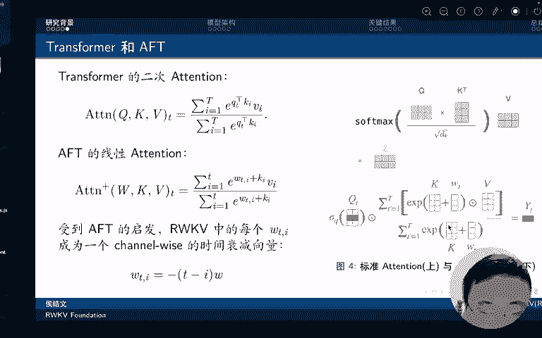
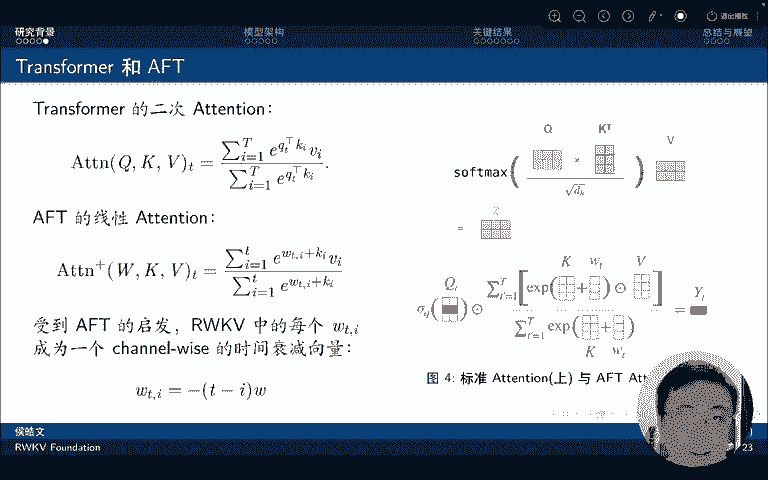
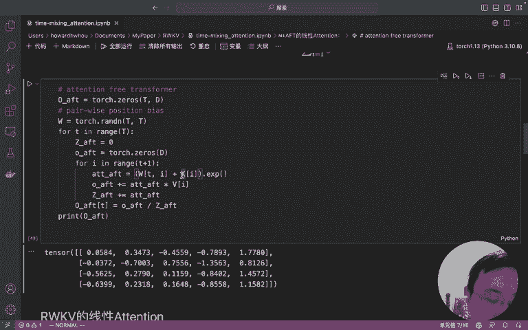
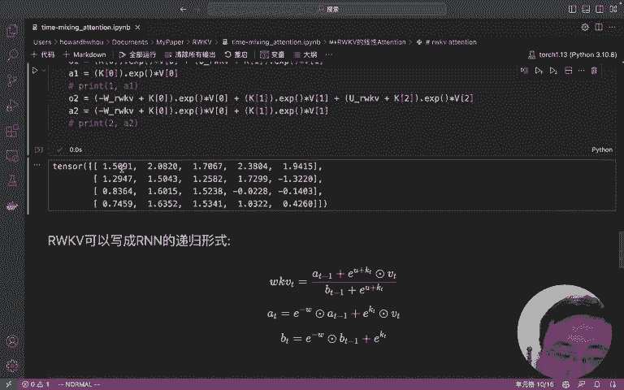
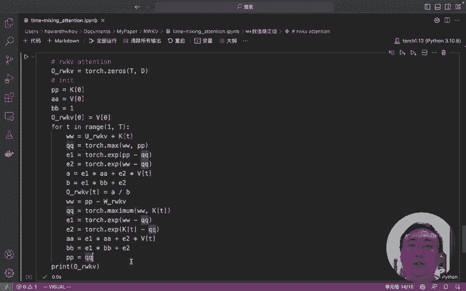

# 课程一：解密RWKV线性注意力的进化过程 - P1 🧠





在本节课中，我们将要学习注意力机制从经典的Transformer到线性注意力，再到RWKV模型的演进过程。我们将通过对比向量版与矩阵版的注意力计算，理解线性注意力的核心思想，并最终推导出RWKV模型高效且数值稳定的递归形式。

---

## 从Transformer到线性注意力 🔄

上一节我们介绍了课程目标，本节中我们来看看注意力机制最初的形态。

### Transformer的向量版注意力

标准的Transformer注意力通常以矩阵形式呈现。向量版的计算过程则更为直观，它清晰地展示了每个输出是如何通过循环累加计算得到的。

以下是向量版注意力的计算步骤：

1.  初始化一个由序列长度 `T` 和模型维度 `D` 决定的输出张量。
2.  从第一个词元（token）开始遍历。
3.  初始化当前词元的归一化因子。
4.  初始化当前词元的输出张量。
5.  计算当前查询（Q）与后续所有键（K）的点积分数，并通过指数函数变换。
6.  将变换后的分数与对应的值（V）向量相乘并累加，得到未归一化的输出。
7.  同时累加指数分数作为归一化因子。
8.  最后，将累加的输出除以归一化因子，得到最终的注意力输出。

用代码表示其核心循环如下：
```python
# 伪代码示意
for t in range(T):
    z = 0
    o_t = zeros(D)
    for i in range(t, T):
        score = exp(Q[t] @ K[i].T) # Q和K的点积并取指数
        o_t += score * V[i]
        z += score
    output[t] = o_t / z
```
从这个不严谨的分析可以看出，向量版包含双重循环，其时间复杂度为 `O(T^2)`。

标准的矩阵版Self-Attention计算则更为简洁：
```python
# 矩阵版注意力
scores = Q @ K.T
attention = softmax(scores) @ V
```
计算结果与向量版完全一致。将注意力转化为向量版，虽然看似效率较低，但能让我们更清晰地看到后续一系列演进的起点。

---

## Attention-Free Transformer (AFT) 的线性化 ✨

上一节我们回顾了Transformer的注意力计算，本节中我们来看看如何将其线性化。

受向量版注意力的启发，AFT模型提出了一种线性注意力机制。它取消了Q和K的显式点积计算，转而使用一个可学习的相对位置偏置矩阵 `W` 和每个词元的权重 `K` 来近似注意力分数。

以下是AFT线性注意力的计算逻辑：



1.  定义一个 `T x T` 的矩阵 `W`，它代表词元间固定的位置偏置。
2.  遍历每个目标词元 `t`。
3.  对于每个源词元 `i`，其注意力分数由位置偏置 `W[t, i]` 加上词元权重 `K[i]` 构成。
4.  对该分数取指数后，与值向量 `V[i]` 相乘并累加。
5.  同时累加指数分数作为归一化因子。
6.  最后进行归一化，得到输出。

其计算过程同样包含循环，但关键点在于：每个位置的注意力分数不再依赖于所有其他词元的复杂交互（矩阵乘法），而是通过查表（`W`矩阵）和加和（`K`权重）获得。这使其摆脱了 `O(T^2)` 的复杂度限制，成为一种线性注意力。

---

## RWKV的WKV机制与递归形式 📈

上一节我们介绍了AFT的线性注意力，本节中我们来看看RWKV模型如何在此基础上引入时间衰减并实现高效递归。

RWKV的线性注意力同样使用了 `W`、`K`、`V`，因此在其论文中被称为WKV机制。其核心思想是：一个词元的重要性应随着它与当前词元距离的增加而衰减。

### WKV机制的直观形式

具体而言，模型为当前词元设置一个奖励偏置 `U`，为前一个词元设置衰减因子 `0`，为更早的词元设置递增的负衰减（`-W`， `-2W`， `-3W`...）。计算时，仍需遍历所有历史词元，效率仍有优化空间。

### 递归形式（RNN模式）

观察WKV公式可以发现，其中的累加项可以在时间步之间传递。RWKV通过将其转化为递归形式，实现了 `O(1)` 的空间复杂度和 `O(T)` 的时间复杂度。

以下是递归形式的核心步骤：

1.  初始化状态 `A = 0`， `B = 0`，分别代表分子和分母的累积和。
2.  对于第一个词元，其输出即为 `V[0]`。
3.  从第二个词元开始遍历，对于每个时间步 `t`：
    *   利用上一时刻的状态 `A_{t-1}`， `B_{t-1}` 和当前输入 `K_t`， `V_t`， `U`， `W` 计算当前输出。
    *   按特定公式更新状态 `A_t` 和 `B_t`，为下一个时间步做准备。

递归公式的核心推导是将历史信息的指数加权和（即 `A` 和 `B`）作为状态保存，从而避免重复计算。

### 数值稳定版本



直接计算指数 `exp(K)` 在低精度（如FP16）下容易数值溢出。RWKV的最终稳定版本在求指数前，会先减去当前时间步的最大值，将数值范围压至负数和零附近，从而保证计算稳定性。这也是开源代码中实际使用的版本。

---

## 总结 📝

本节课中我们一起学习了注意力机制的演进之路：
1.  我们从**Transformer的向量版注意力**出发，理解了其 `O(T^2)` 复杂度的来源。
2.  接着，我们看到了**AFT模型**如何通过引入位置偏置矩阵和词元权重，将计算简化为查表与加和，实现了**线性注意力**。
3.  最后，我们深入分析了**RWKV模型**的WKV机制。它继承了线性注意力的思想，并引入了时间衰减概念。通过巧妙的数学变换，我们将其转化为高效的**递归形式**，并解决了训练中的**数值稳定性**问题。



这个过程清晰地展示了从经典注意力到高效、线性、可递归计算的RWKV注意力机制的完整进化路径。