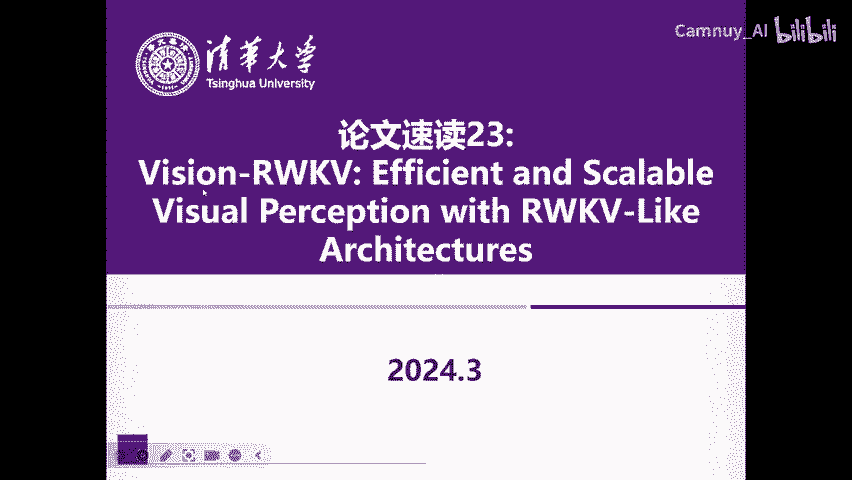
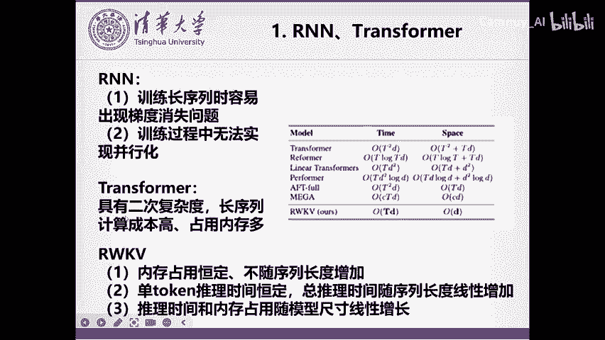
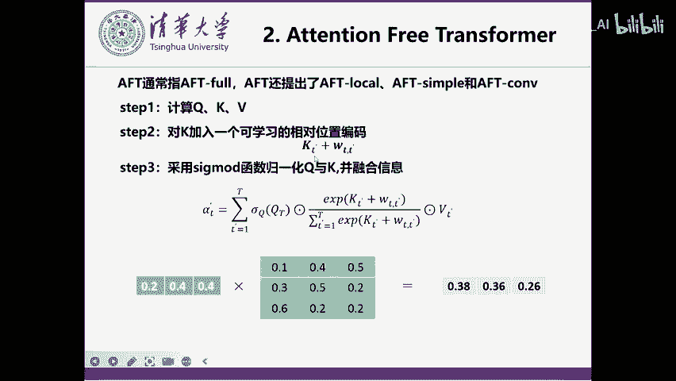
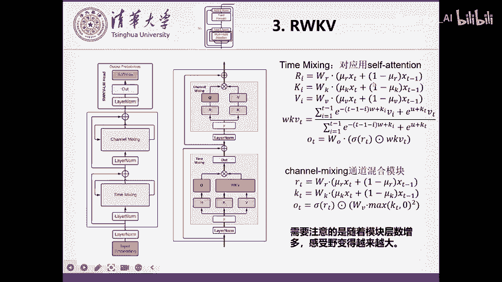
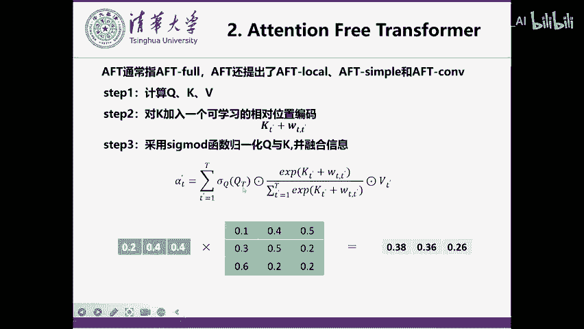
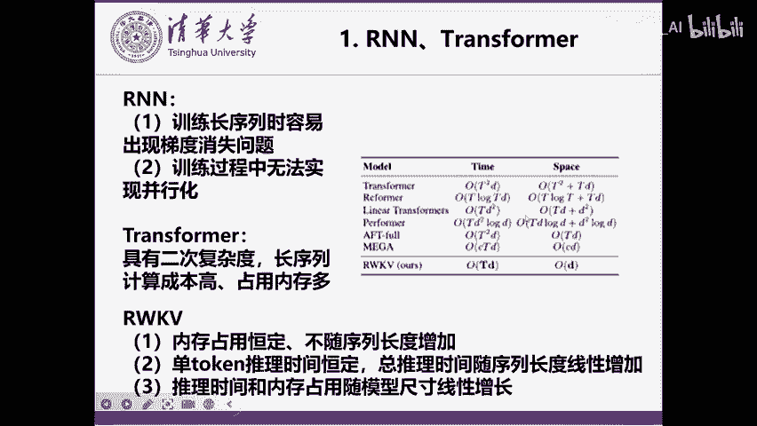
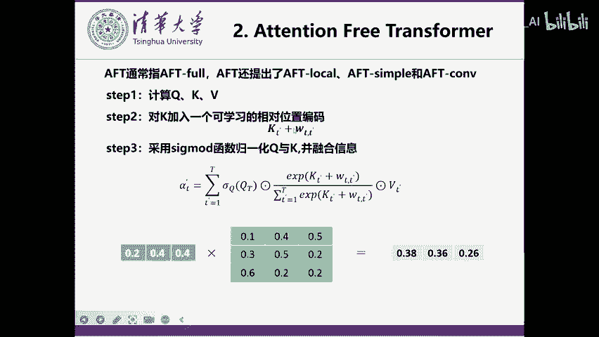
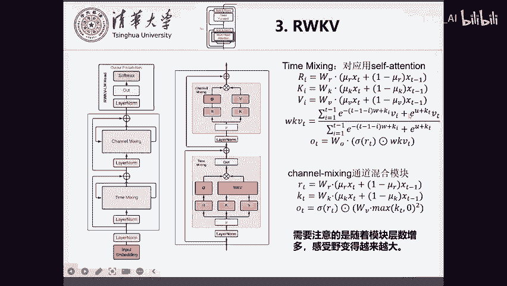
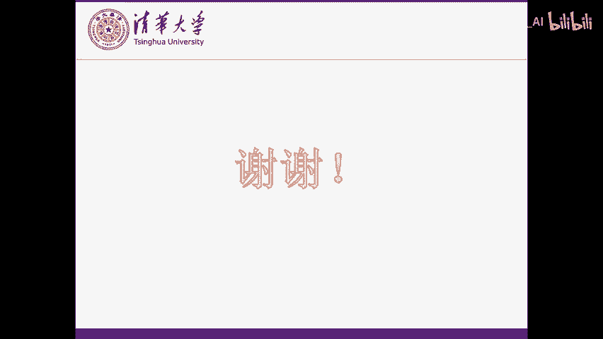

# 论文速读23：Vision-RWKV 🖼️➡️🧠

在本节课中，我们将学习一篇名为“Vision-RWKV”的论文。该论文将最初为自然语言处理设计的RWKV框架扩展到了计算机视觉领域。我们将首先回顾传统RNN和Transformer模型存在的问题，然后深入探讨RWKV的核心机制及其优势，最后讲解如何将其适配到视觉任务中。

## 传统模型的问题 🤔

上一节我们介绍了课程背景，本节中我们来看看RNN和Transformer模型在处理序列数据时各自面临的挑战。

以下是RNN模型的两个主要问题：
1.  训练长序列时容易出现梯度消失问题。因为梯度需要回传到很早期的序列单元，路径过长导致信号衰减。
2.  训练过程无法并行化。RNN需要按顺序逐个处理序列单元。

以下是Transformer模型的主要问题：
1.  注意力机制具有**二次复杂度**。计算成本随序列长度急剧增加，导致内存占用高。

## RWKV的优势 ✨

了解了传统模型的瓶颈后，本节我们来看看RWKV框架提出的解决方案及其核心优势。

RWKV框架的主要优点如下：
1.  内存占用恒定，不随序列长度增加。
2.  单序列单元的推理时间恒定，总推理时间随序列长度**线性增加**。
3.  推理时间和内存占用随模型尺寸**线性增加**。

## 基础：Attention Free Transformer (AFT) 🧱

在深入RWKV之前，我们需要理解其基础——Attention Free Transformer，特别是AFT-full变体。RWKV正是基于此结构改进的。

AFT-full的计算流程如下：
1.  计算查询（Q）、键（K）、值（V）向量。
2.  为键（K）加入一个可学习的相对位置编码。位置编码取决于当前融合位置 `t` 和待融合位置 `t’` 之间的差距。
3.  分别对Q和K应用 **sigmoid** 函数进行归一化，然后融合信息。这保证了信息融合时权重之和为1，避免了梯度问题。
4.  与线性Transformer类似，会先计算K和V的乘积以降低复杂度。

## RWKV的核心机制 ⚙️

上一节我们介绍了AFT，本节中我们来看看RWKV如何在此基础上进行创新。RWKV的一个模块主要由两部分组成：时间混合（Time Mixing）和通道混合（Channel Mixing）。

### 时间混合（Time Mixing）模块

此模块功能类似Transformer的注意力机制，其计算过程如下：
1.  计算一个类似查询（Q）的向量 `R`。
2.  计算键（K）和值（V）时，不仅使用当前时刻特征 `X_t`，还会以线性方式融合上一时刻的特征 `X_{t-1}`，类似于RNN。
3.  信息融合方式与AFT-full基本一致。
4.  关键改进在于位置编码：RWKV使用一个单一的可学习参数 `W`（`W > 0`）。对于待融合时刻 `i` 到当前时刻 `t`，其位置编码为 `-(t-1-i)*W`。这意味着距离 `t` 越近的 `i`，其融合权重越大；越远则权重越小。
5.  当前时刻自身信息的融合通过另一个可学习参数 `U` 控制。
6.  最终，通过对所有权重进行归一化，得到融合后的信息 `WKV`。
7.  之后，`R` 会执行一个类似RNN中“遗忘门”的操作，并与当前时刻信息结合，再经过线性层 `W_o`，得到该模块的输出。

### 通道混合（Channel Mixing）模块

此模块功能类似Transformer的前馈网络（FFN），其计算过程如下：
1.  计算时，同样会融合上一时刻的信息来得到 `R` 和 `K`。
2.  计算 `max(K_t, 0)^2`，这类似于一个带平方的ReLU激活函数。
3.  对 `sigmoid(R_t)` 进行操作，作者称其意图是实现类似RNN“遗忘门”的功能，以过滤掉部分通道特征。
4.  最终得到该时刻的输出。

**信息流动与感受野**：在多层RWKV模块堆叠时，`Time Mixing` 的输入会包含上一时刻 `Channel Mixing` 的输出。这意味着随着网络深度增加，模型能融合越来越多历史时刻的信息，感受野变大，相比传统RNN更不易出现梯度消失。

## RWKV的RNN形式转化 🔄

RWKV被称为“Transformer时代的RNN”，因为它可以转化为RNN的迭代形式。
通过维护两个隐状态 `A_t` 和 `B_t`，并按照RNN方式迭代更新，可以直接计算出每一时刻的 `WKV_t`。这使得RWKV既能像Transformer一样高效训练，又能像RNN一样高效推理。

## 从NLP到视觉：Vision-RWKV的适配 👁️

前面我们学习了RWKV在NLP中的原理，本节我们看看如何将其应用到视觉任务中。Vision-RWKV主要做了两点关键优化。

### 优化一：双向WKV

在NLP中，一个词通常只需关注其前面的词（自回归）。但在视觉中，一个像素需要关注图像中所有其他像素。
*   **方法**：将融合范围从“之前所有时刻”扩展到“所有时刻”（双向）。在计算位置编码时，使用 `abs(t-1-i)` 代替 `(t-1-i)`，使得前后位置的衰减对称。
*   **RNN形式保持**：即使改为双向，仍可转化为RNN形式，但需要维护 `A_t, B_t, C_t, D_t` 四个隐状态进行迭代更新。

### 优化二：查询偏移（Query Shift）

图像具有二维空间结构，而序列化处理会丢失此信息。此优化旨在让模型感知空间近邻。
*   **方法**：在计算 `X_t` 时，不仅融合上一时刻的序列化特征，还从其对应的原始图像位置的**上、下、左、右**四个邻域像素中，各提取一部分通道特征进行融合。
*   **目的**：使模型在序列计算中仍能部分利用图像的二维局部性。但作者指出，这仍未完全解决二维结构信息利用的问题，是未来可改进的方向。

## 总结 📝

本节课我们一起学习了Vision-RWKV这篇论文。我们首先回顾了RNN和Transformer的局限性，然后深入探讨了RWKV框架如何通过线性复杂度和类RNN的迭代形式解决这些问题。我们剖析了其Time Mixing和Channel Mixing核心模块，并理解了其可转化为RNN形式的原理。最后，我们学习了RWKV适配视觉任务的两个关键优化：双向WKV以捕捉全局上下文，以及Query Shift以融入局部空间信息。Vision-RWKV为在视觉任务中实现高效的长序列建模提供了一个新颖且有潜力的方向。