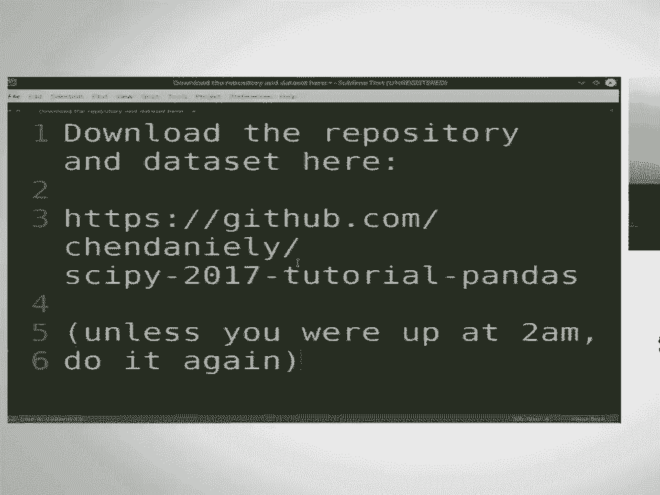
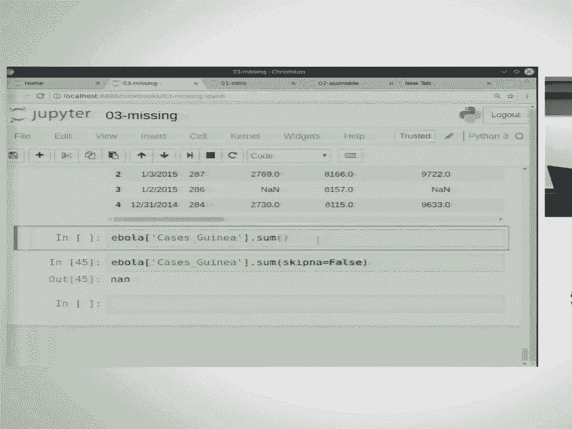
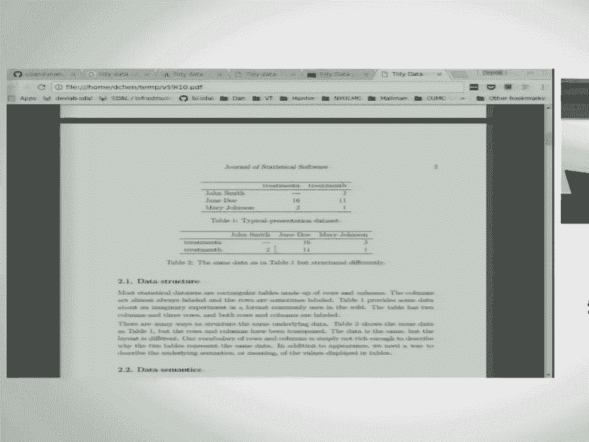
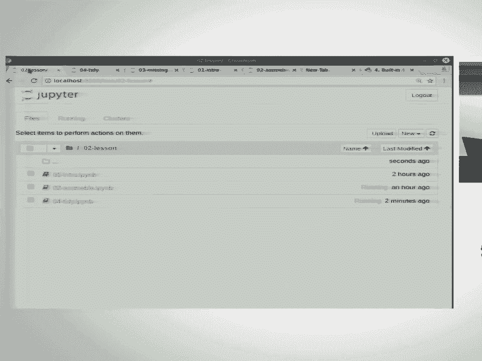
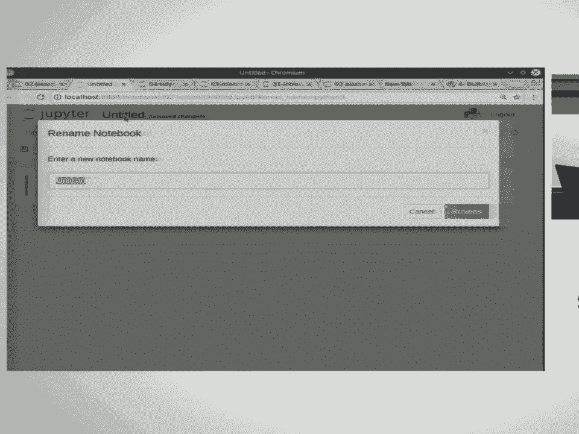
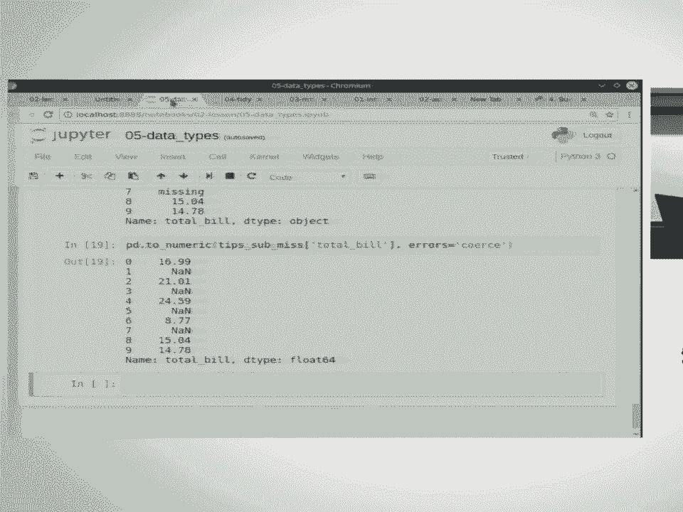
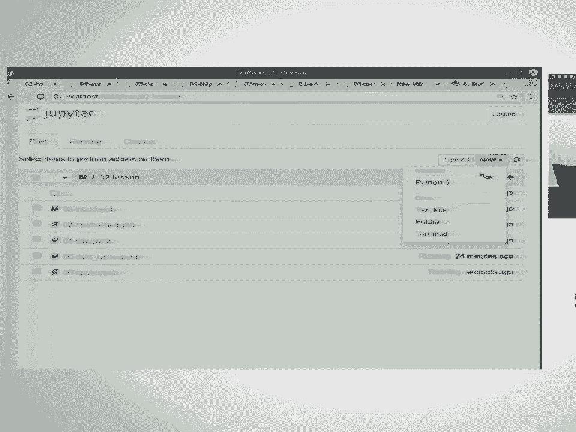
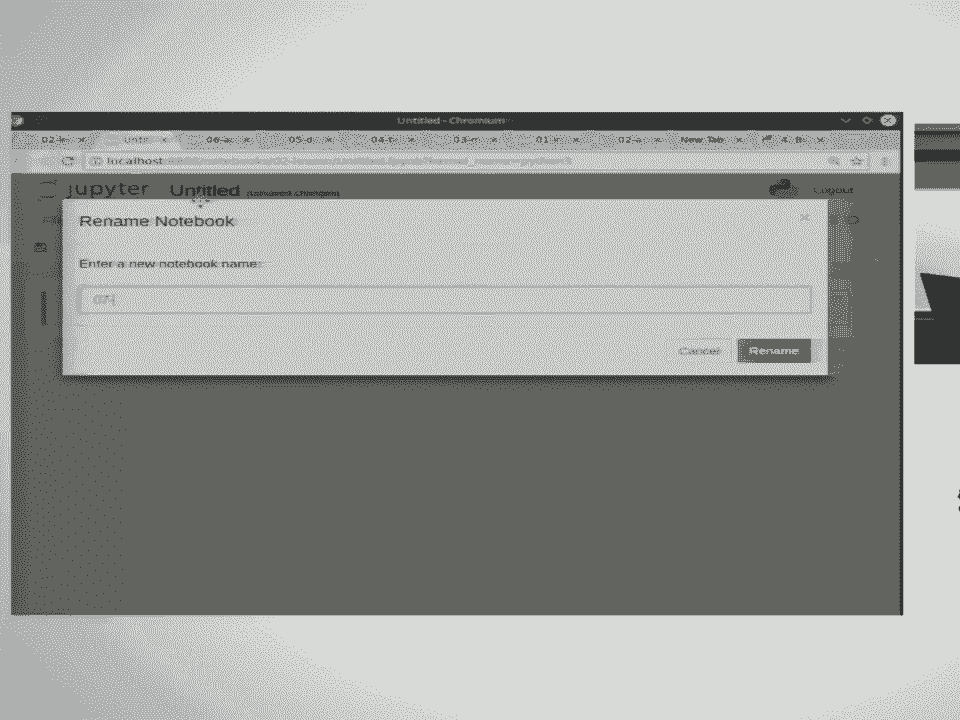

# 1：Pandas 数据分析入门教程 🐼



在本课程中，我们将学习如何使用 Python 的 Pandas 库进行数据分析。Pandas 是一个强大的工具，可以看作是支持异构数据的 NumPy，或者类似于 R 语言中的数据框。它提供了一种编程方式来操作类似 Excel 表格的数据。

---

## 准备工作与数据加载

首先，请确保您已下载课程资料库。资料库中包含本课程将使用的所有数据集和讲义。

为了开始工作，我们需要导入 Pandas 库并加载数据。通常，我们会为 Pandas 设置一个别名 `pd` 以方便使用。

```python
import pandas as pd
```

接下来，我们使用 `read_csv` 函数来加载数据。如果数据是制表符分隔的（TSV文件），我们需要指定分隔符参数。

```python
df = pd.read_csv('../data/gapminder.tsv', delimiter='\t')
```

加载数据后，我们可以使用 `head` 方法查看前几行，以确认数据加载正确。

```python
df.head()
```


要了解数据集的整体结构，我们可以使用 `shape` 属性获取行数和列数，或使用 `info` 方法查看每列的数据类型和非空值数量。


```python
df.shape
df.info()
```

---

## 数据子集选择：行与列

上一节我们介绍了如何加载和查看数据，本节中我们来看看如何从数据框中选择特定的行和列。

### 选择列

选择单列有两种常见方法：使用方括号或点号表示法。点号表示法更简洁，但要求列名不包含空格。


```python
# 方法一：方括号
country_df = df['country']


# 方法二：点号表示法（仅适用于无空格列名）
country_df = df.country
```

如果需要选择多列，则需要提供一个列名列表。

```python
subset = df[['country', 'continent', 'year']]
subset.head()
```

### 选择行



选择行主要使用 `loc` 和 `iloc` 属性。`loc` 通过行标签选择，而 `iloc` 通过行位置（索引）选择。




```python
# 使用 loc 选择标签为 0 的行
row_loc = df.loc[0]

# 使用 iloc 选择位置为 0 的行（第一行）
row_iloc = df.iloc[0]

# 使用 iloc 选择最后一行
last_row = df.iloc[-1]
```

我们还可以同时选择特定的行和列。

```python
# 选择第 0, 99, 999 行，以及 'country', 'lifeExp', 'gdpPercap' 列
subset = df.loc[[0, 99, 999], ['country', 'lifeExp', 'gdpPercap']]
```

### 布尔子集选择

布尔子集选择允许我们根据条件筛选行。例如，筛选出寿命期望高于平均值的所有行。

```python
life_exp_mean = df['lifeExp'].mean()
above_average = df.loc[df['lifeExp'] > life_exp_mean, :]
```

---

## 分组与聚合统计






在查看了如何选择数据子集后，一个常见的分析任务是计算分组统计量。Pandas 的 `groupby` 功能非常强大。

分组操作遵循“拆分-应用-合并”的模式：先将数据按指定键拆分成组，然后在每个组上应用函数，最后将结果合并。

例如，计算每年的平均寿命期望：




```python
# 按年份分组，计算 lifeExp 列的平均值
lifeExp_by_year = df.groupby('year')['lifeExp'].mean()
lifeExp_by_year.head()
```

我们可以对多个列进行分组和聚合。

```python
# 按年份和大陆分组，计算 lifeExp 和 gdpPercap 的平均值
grouped = df.groupby(['year', 'continent'])[['lifeExp', 'gdpPercap']].mean()
grouped.head()
```

分组后，结果可能是一个具有多层索引的 Series 或 DataFrame。我们可以使用 `reset_index` 方法将其展平为普通的 DataFrame。

```python
flat_df = grouped.reset_index()
```

---





## 数据可视化与保存

Pandas 内置了简单的绘图功能，可以快速可视化数据。例如，绘制平均寿命期望随年份变化的趋势图。

```python
import matplotlib.pyplot as plt
%matplotlib inline

lifeExp_by_year.plot()
plt.title('Average Life Expectancy Over Time')
plt.ylabel('Life Expectancy')
plt.xlabel('Year')
plt.show()
```

分析完成后，我们通常需要将结果保存到文件。Pandas 提供了 `to_csv` 等方法。

```python
# 将展平后的 DataFrame 保存为 CSV 文件，不保存行索引
flat_df.to_csv('../output/life_expectancy_by_year.csv', index=False)
```

---

## 总结

在本课程中，我们一起学习了 Pandas 数据分析的基础知识。我们从数据加载和查看开始，然后学习了如何选择数据的行和列，包括使用 `loc`、`iloc` 和布尔索引。接着，我们探索了强大的分组聚合功能，使用 `groupby` 来计算分组统计量。最后，我们简要介绍了如何使用 Pandas 进行数据可视化以及如何将结果保存到文件。


掌握这些基础操作是进行更复杂数据分析的第一步。Pandas 的功能远不止于此，但这些核心概念将为您后续的学习打下坚实的基础。