# 2：计算统计学 SciPy 2017 教程 🧮


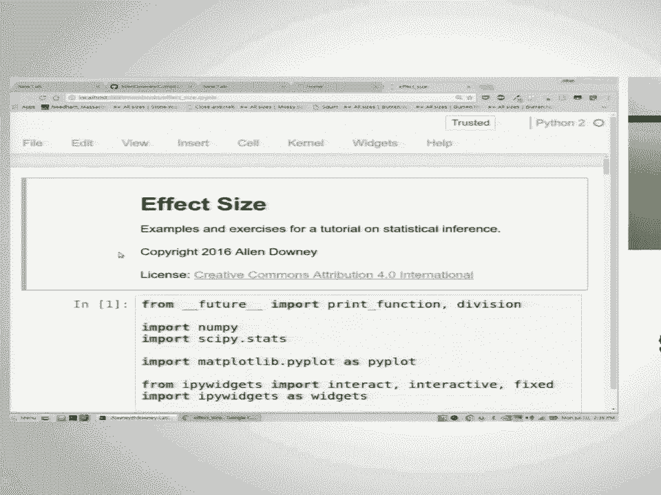

在本节课中，我们将要学习计算统计学的核心概念，包括效应量估计、置信区间计算和假设检验。我们将通过Python和Jupyter Notebook进行实践操作，理解如何用计算的方法替代传统的数学分析来解决统计推断问题。

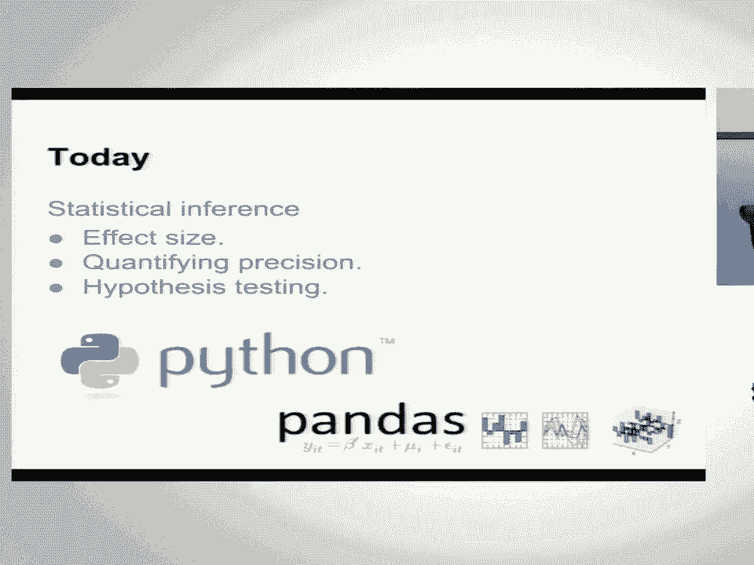

## 概述 📋


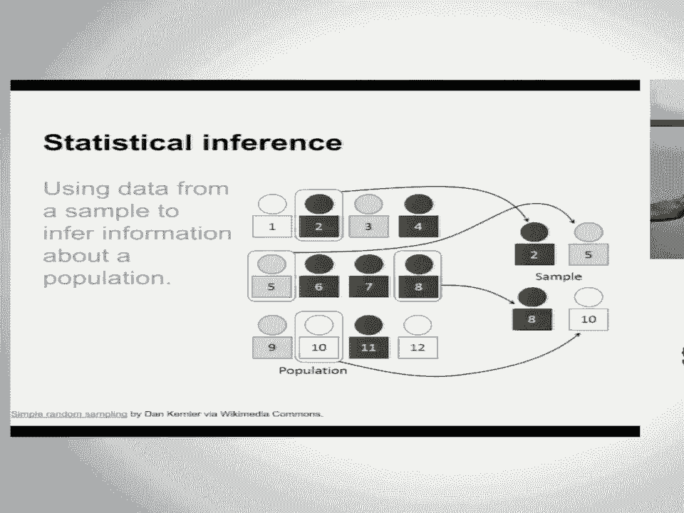

统计推断的核心是从一个总体的小样本出发，试图利用样本信息来推断总体的特性。这通常涉及三个主要部分：估计效应大小、量化估计的精确度以及进行假设检验。传统上，这些问题通过数学分析解决，但本课程将展示如何通过计算（例如重采样和模拟）来更灵活、更直观地处理它们。

## 第一部分：效应量 📏


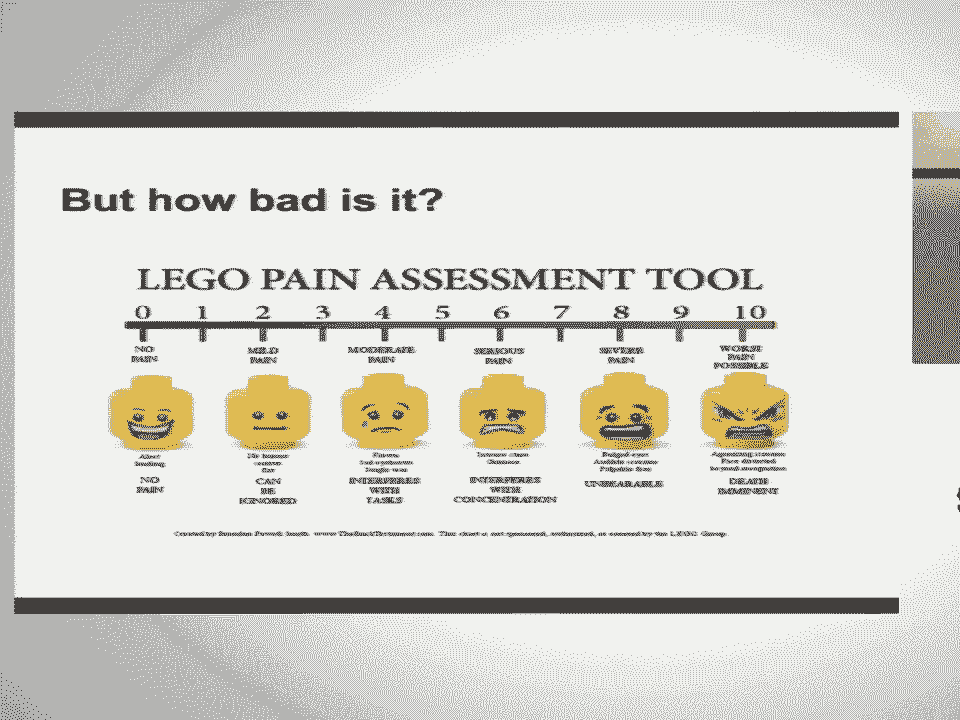

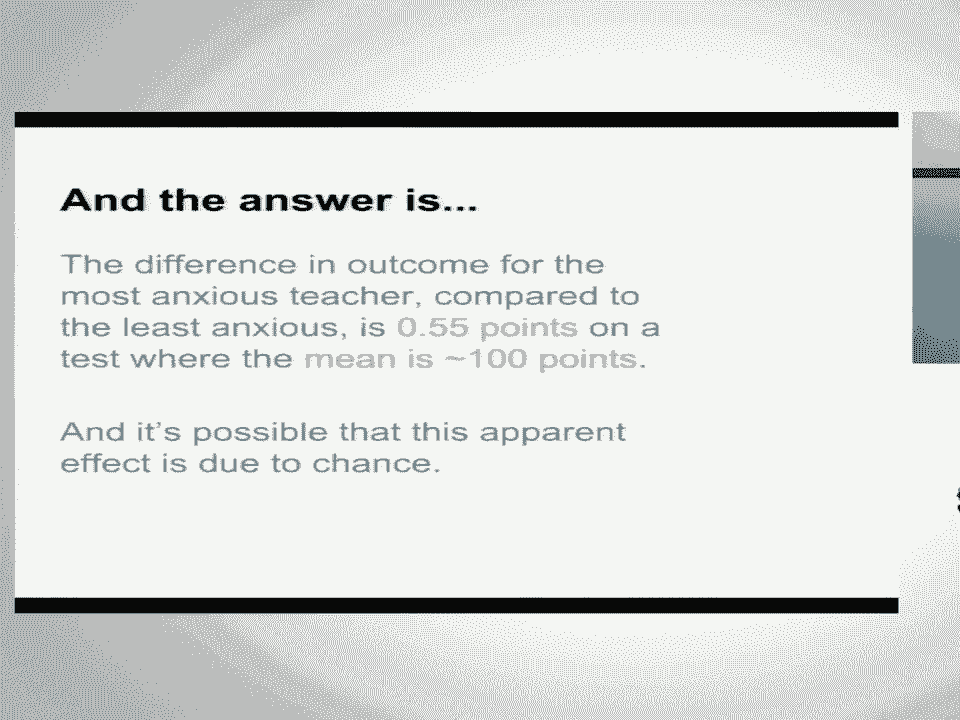

上一节我们介绍了统计推断的整体框架，本节中我们来看看如何量化效应大小。效应量是衡量观察到的差异或效应实际大小的指标，它比单纯的“是否显著”更为重要。


### 绝对差异与相对差异

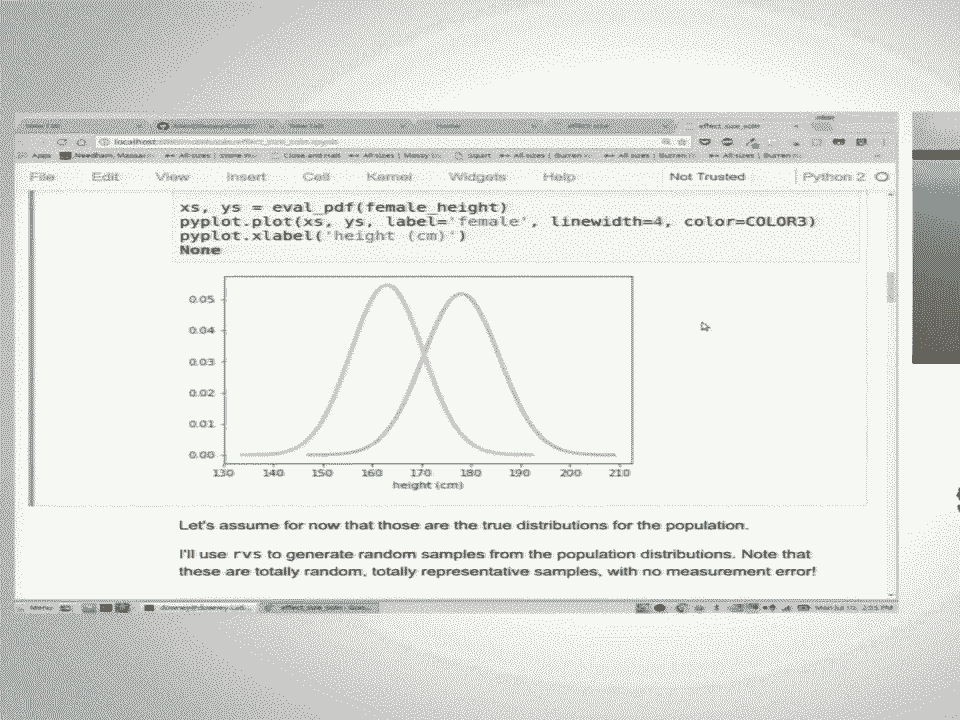

首先，我们处理一个简单的例子：男性和女性的平均身高差异。我们可能得到一个以厘米为单位的绝对差异，但将其转换为百分比形式的相对差异通常更有意义。

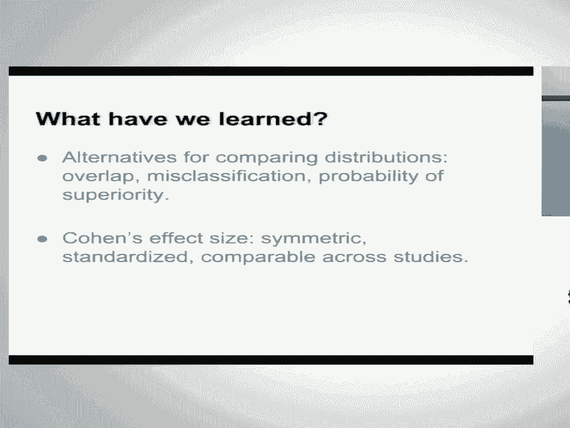

以下是计算相对差异的几种方法：

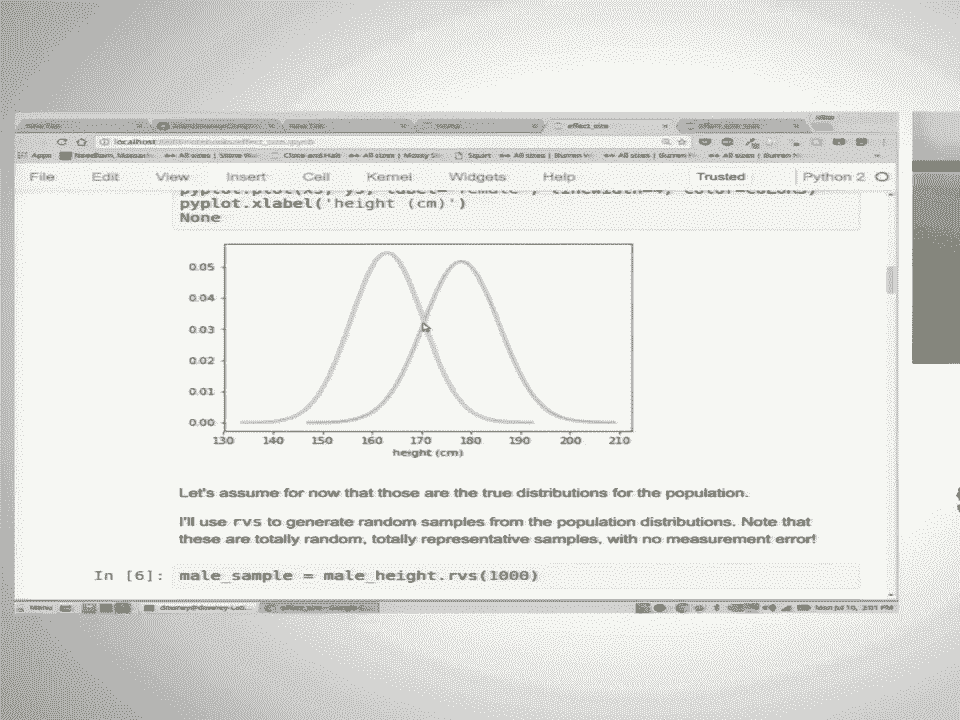

*   **基于男性均值**：`(男性均值 - 女性均值) / 男性均值`
*   **基于女性均值**：`(男性均值 - 女性均值) / 女性均值`
*   **基于总均值**：`(男性均值 - 女性均值) / ((男性均值 + 女性均值)/2)`

选择哪种方法取决于上下文，例如是否有一个明确的对照组。


### 误分类率与优势概率

除了相对差异，我们还可以用更实际的方式解释均值差异。

*   **误分类率**：如果我们根据身高阈值（如两组均值的中间点）来猜测一个人的性别，被错误分类的样本比例。在NumPy中，可以通过比较数组与阈值并求和来计算。
    ```python
    threshold = (mean_male + mean_female) / 2
    misclassified = np.sum(male_sample < threshold) + np.sum(female_sample > threshold)
    misclassification_rate = misclassified / len(total_sample)
    ```
*   **优势概率**：随机抽取一名男性和一名女性，男性身高更高的概率。可以通过配对样本或逻辑数组计算。
    ```python
    # 方法一：使用zip配对
    pairs = zip(male_sample, female_sample)
    prob_superiority = sum(1 for m, f in pairs if m > f) / len(male_sample)
    # 方法二：使用NumPy广播
    prob_superiority = np.mean(male_sample[:, None] > female_sample)
    ```

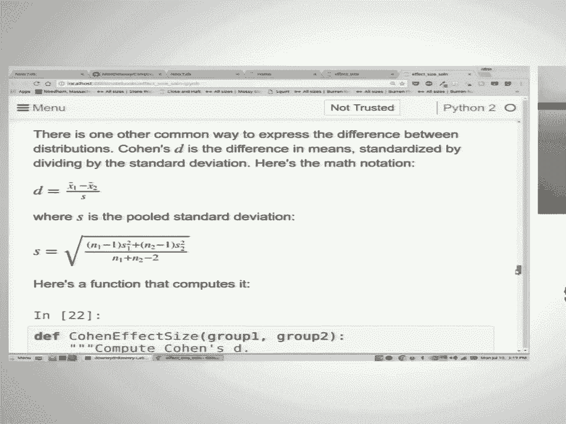

### 科恩效应值

科恩效应值（Cohen‘s d）是一种标准化的效应量度量，它表示两组均值差异相当于多少个合并标准差。这使得不同研究间的比较成为可能。

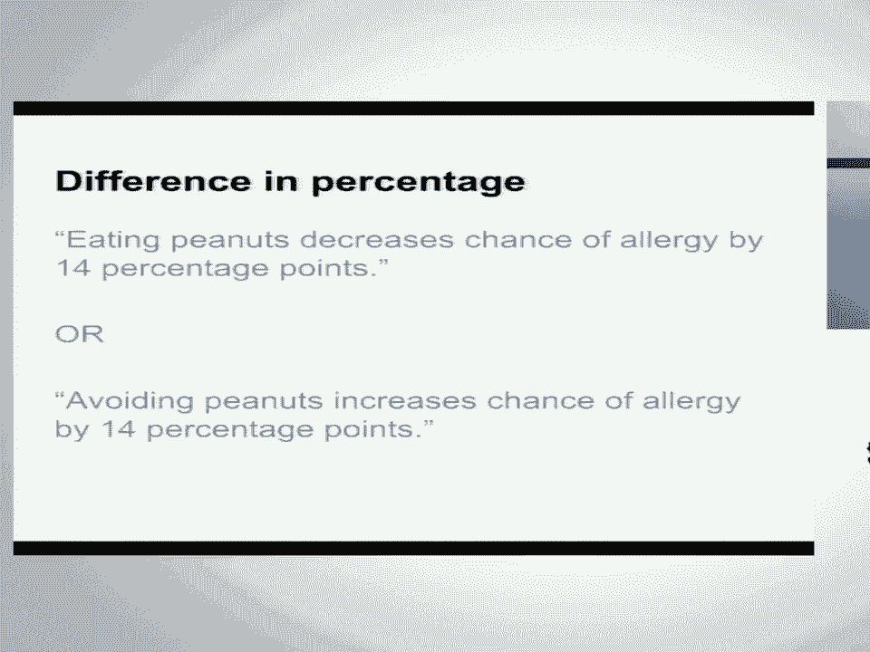

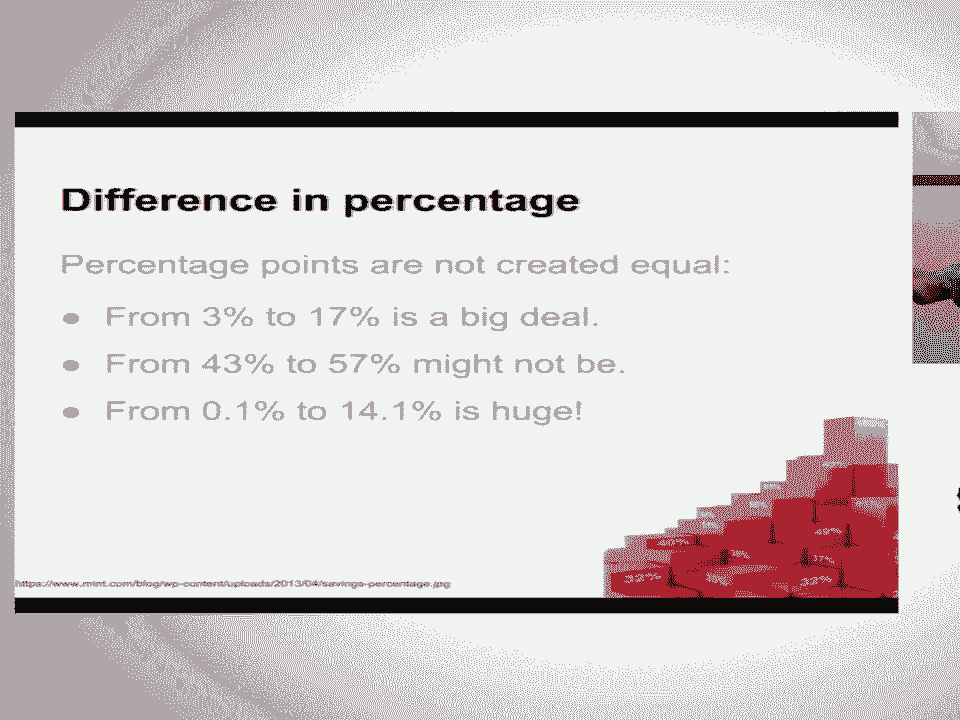


公式为：
`d = (mean1 - mean2) / pooled_std`

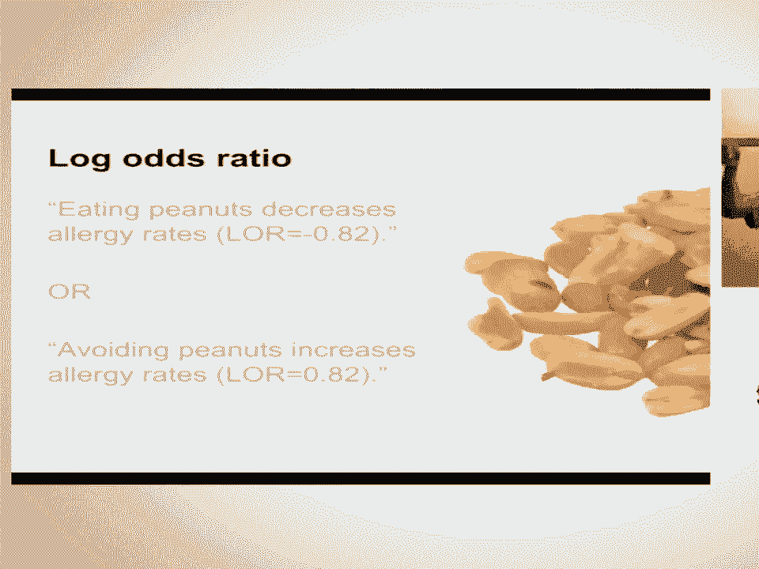

其中合并标准差 `pooled_std` 的计算考虑了每组的样本量和方差：
`pooled_std = sqrt(((n1-1)*std1^2 + (n2-1)*std2^2) / (n1 + n2 - 2))`

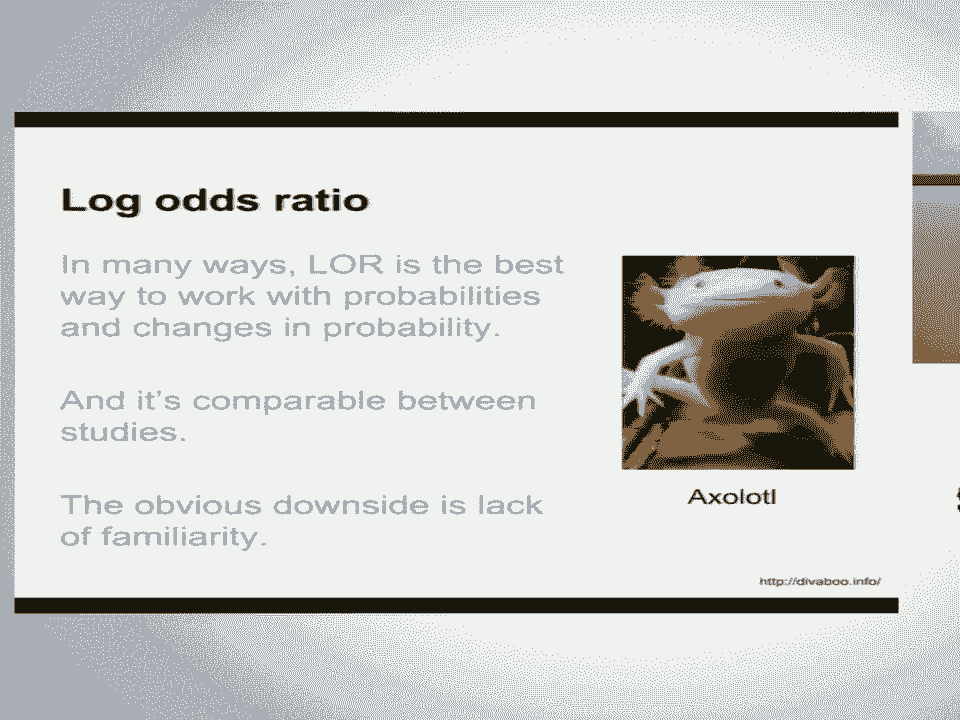

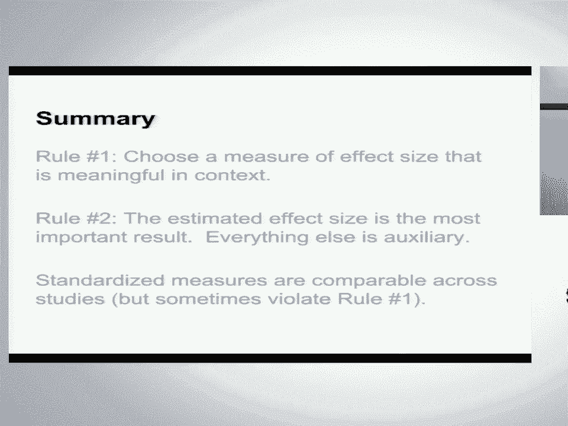


科恩效应值是一个无量纲数。根据经验，`d=0.2` 被视为小效应，`d=0.5` 为中等效应，`d=0.8` 为大效应。许多心理学中报告的性别差异效应值在0.5或以下，其实际重要性可能有限。

### 比例差异：以花生过敏研究为例

当处理比例数据（如花生过敏研究：避免花生的儿童过敏率为17%，食用花生的为3%）时，有多种方式表达效应大小。

以下是表达比例差异的不同方式及其特点：

*   **绝对风险差**：`17% - 3% = 14%`。简单直观，但难以在不同基线风险的研究间比较。
*   **相对风险**：`17% / 3% ≈ 5.67` 或 `3% / 17% ≈ 0.176`。表示倍数关系，但方向不对称，且公众可能难以理解“百分比的百分比”。
*   **优势比**：`(0.17/(1-0.17)) / (0.03/(1-0.03)) ≈ 6.6`。在医学中常用，但同样存在不对称性，且解释需要专业知识。
*   **对数优势比**：`log(6.6) ≈ 1.89`。具有优良的数学性质（对称性、可加性），并与贝叶斯因子相关，但最不为大众所熟悉。

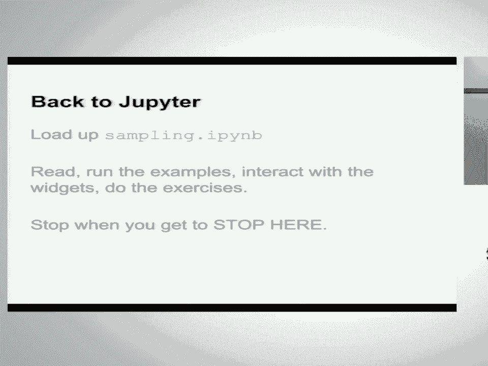

选择哪种度量需要在数学严谨性和与受众的沟通有效性之间取得平衡。

## 第二部分：量化精确度 🎯

上一节我们学习了如何测量效应大小，本节中我们来看看如何评估这种测量的精确度。我们主要关注由随机抽样引起的误差（随机误差），尽管在实践中，抽样偏差和测量误差可能更为重要。

### 抽样分布与标准误

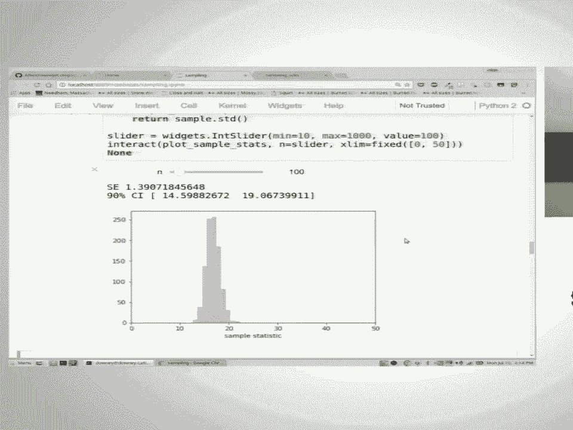

如果我们知道总体的真实分布（例如，假设成年人体重服从对数正态分布），我们可以通过模拟来理解估计的变异性。

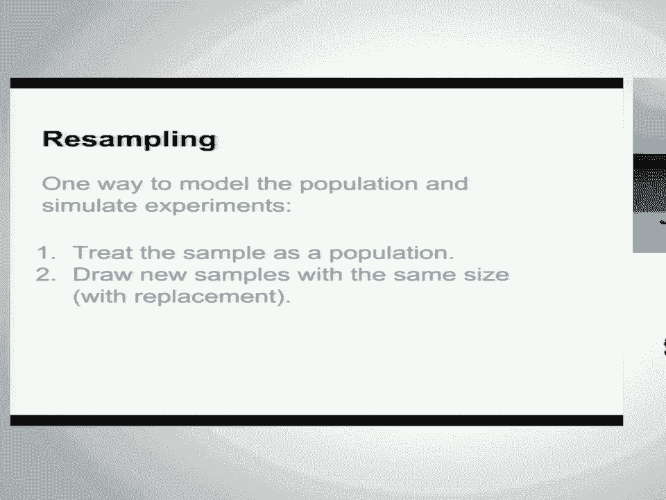

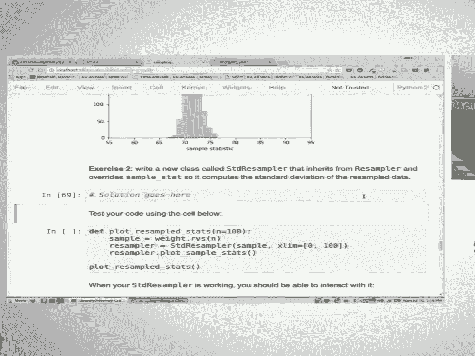

核心思想是进行多次“模拟实验”：每次从已知总体中抽取一个样本（大小为 `n`），计算我们关心的统计量（如均值），然后观察这些估计值的分布。这个分布称为**抽样分布**。

*   **标准误**：抽样分布的标准差。它量化了由于随机抽样导致的估计值波动范围。
*   **置信区间**：抽样分布的一个区间，例如去除最低和最高5%的值后剩下的90%区间，称为90%置信区间。

随着样本量 `n` 增大，抽样分布变窄，标准误减小，置信区间宽度变窄。这体现了大样本带来的更高精确度。

### 自助法

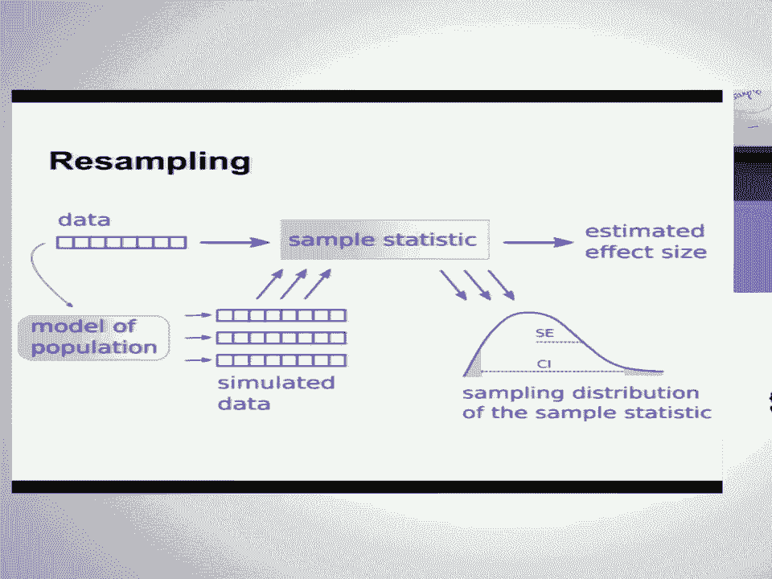

然而，我们通常并不知道总体分布。自助法提供了一种解决方案：我们利用手头已有的单个样本，通过**有放回地重采样**来模拟总体，并生成许多新的“自助样本”。

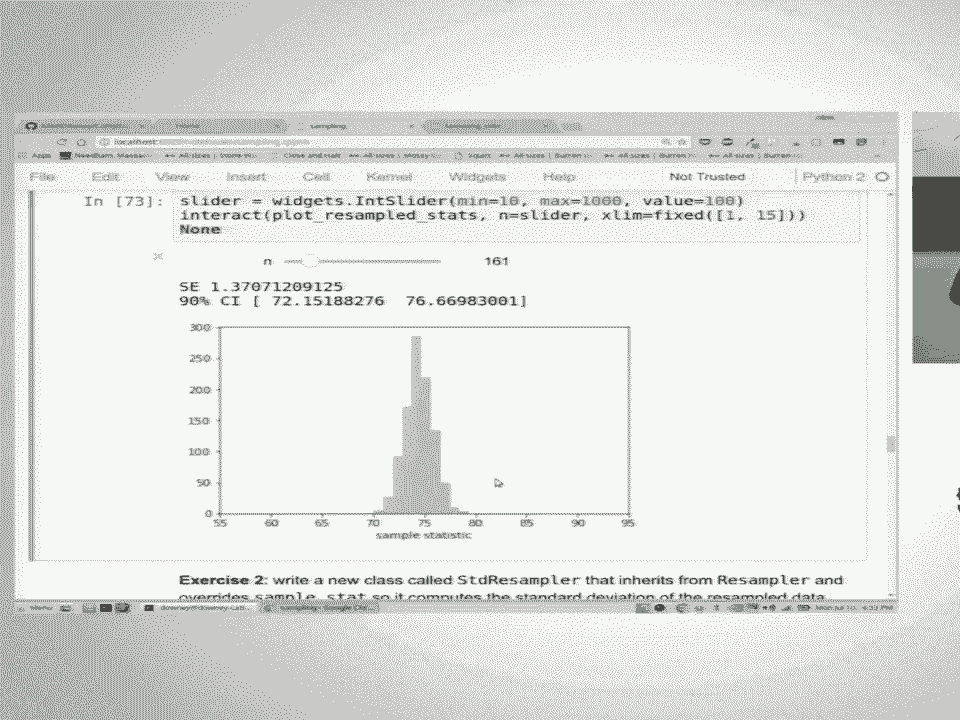

自助法的框架如下：
1.  **原始数据与估计**：从原始样本计算统计量（如均值），得到点估计。
2.  **构建模型**：将原始样本视为“总体”的代理。
3.  **生成模拟数据**：从原始样本中有放回地抽取多个自助样本（每个样本大小与原始样本相同）。
4.  **计算抽样分布**：对每个自助样本计算相同的统计量，形成该统计量的自助抽样分布。
5.  **总结不确定性**：计算自助抽样分布的标准误或百分位数置信区间。

这种方法的美妙之处在于，它可以应用于任何可以计算的统计量（均值、中位数、标准差等），而无需复杂的数学推导。

### 关于置信区间的重要说明

一个常见的误解是“真实值有90%的概率落在90%置信区间内”。在频率学派的框架下，真实值是固定的（非随机的），置信区间是随机的。更准确的解释是：如果重复进行多次实验，每次计算一个90%置信区间，那么这些区间中大约有90%会包含真实值。

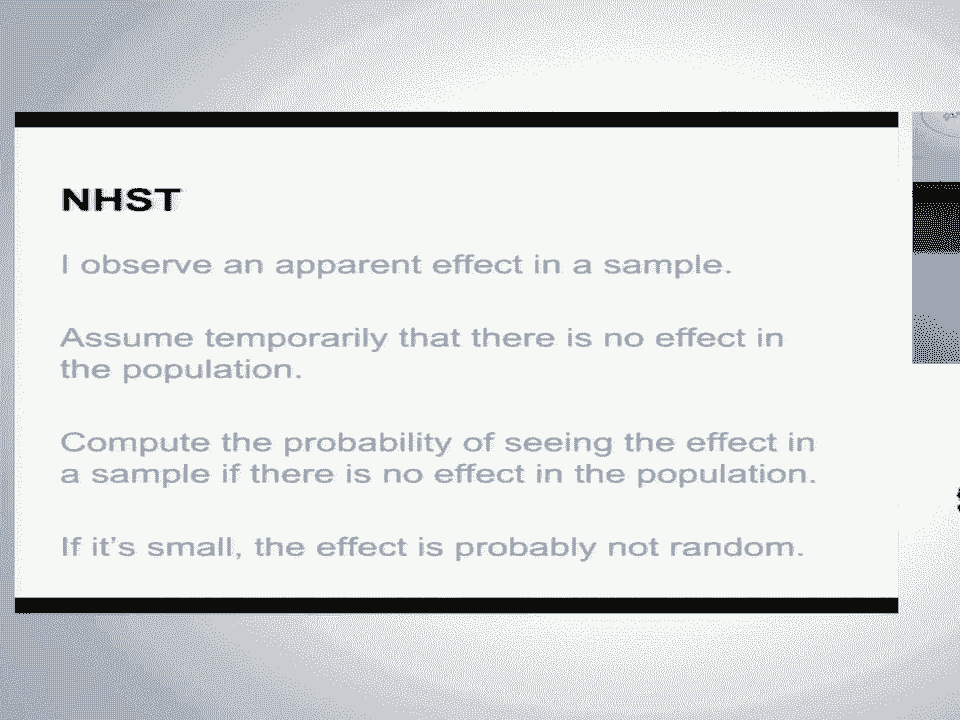


更重要的是，置信区间只量化了**随机抽样误差**。当样本量很大时，标准误和置信区间会非常小，但这并不意味着估计非常准确，因为**抽样偏差**和**测量误差**等其他误差源可能占主导地位。一个很窄的置信区间只是排除了随机误差作为主要担忧，研究者应将注意力转向其他可能的误差来源。

## 第三部分：假设检验 ❓

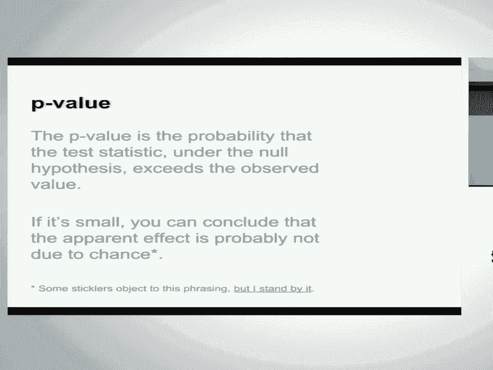

上一节我们讨论了如何量化估计的不确定性，本节中我们来看看如何检验一个效应是否可能只是随机产生的。虽然效应大小和置信区间更为重要，但假设检验（特别是p值）在科学文献中广泛使用，因此需要正确理解和应用。

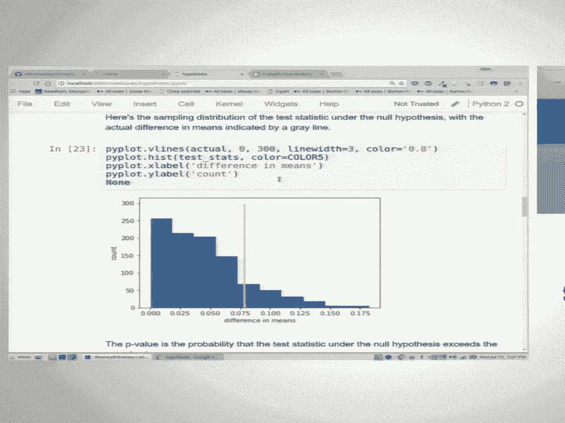

### 零假设显著性检验框架

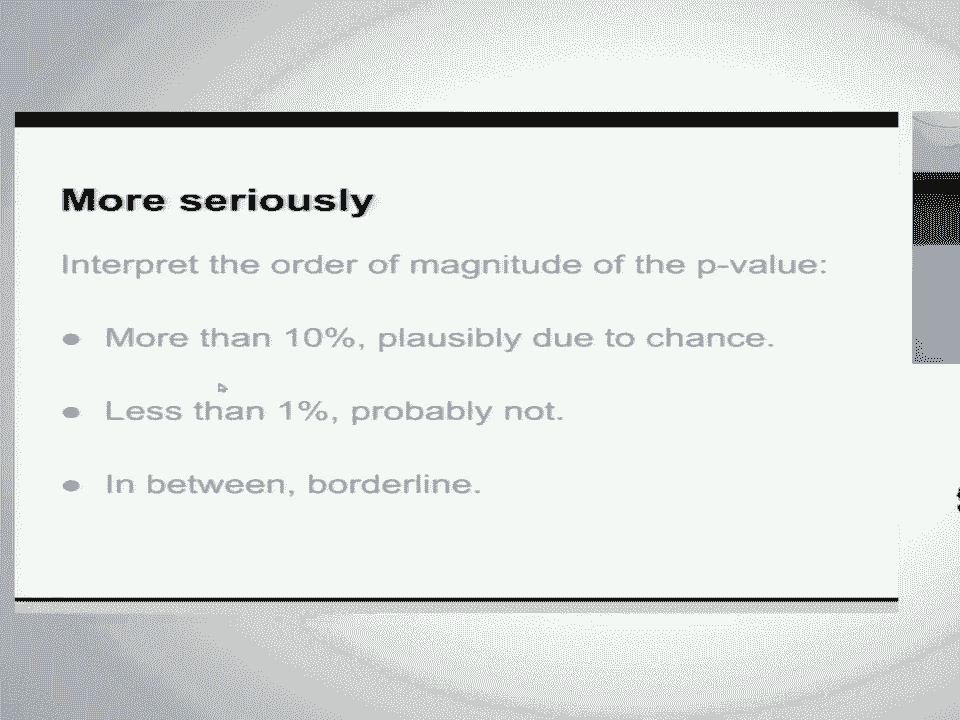


假设检验的逻辑类似于数学中的反证法：
1.  **定义检验统计量**：通常是效应大小的度量（如两组均值之差）。
2.  **建立零假设**：通常假设效应不存在（例如，两组均值没有差异）。
3.  **模拟零假设世界**：在零假设成立的条件下生成模拟数据。对于比较两组均值，通常将两组数据合并，然后随机打乱并重新分成两组（保持原样本量），这称为**置换检验**。
4.  **构建零分布**：对大量模拟数据计算相同的检验统计量，得到在零假设下该统计量的可能分布（零分布）。
5.  **计算p值**：计算在零分布中，出现大于或等于实际观察到的效应量（或更极端情况）的概率。即 `p = (# of simulated stats >= observed stat) / (# of simulations)`。

如果p值很小（例如小于0.05），意味着如果零假设为真，观察到如此大效应的可能性很低，从而提供证据反对零假设，支持效应是真实存在的。

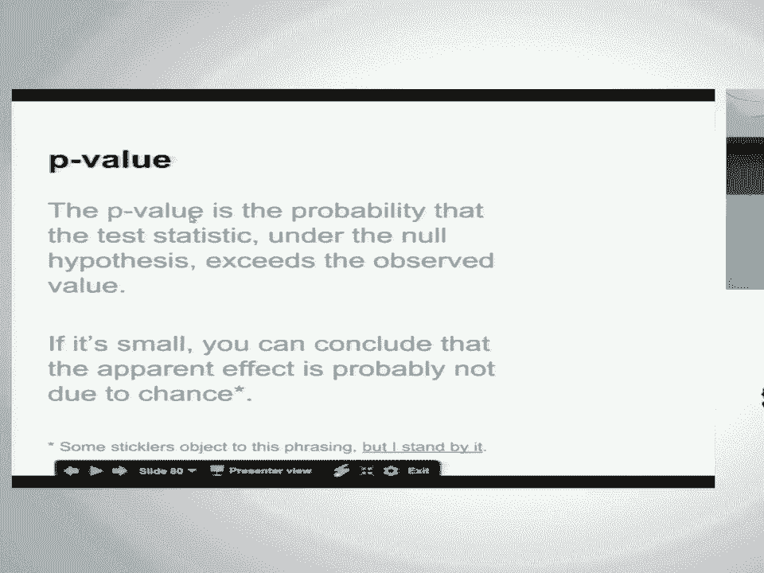

### p值的解释与局限

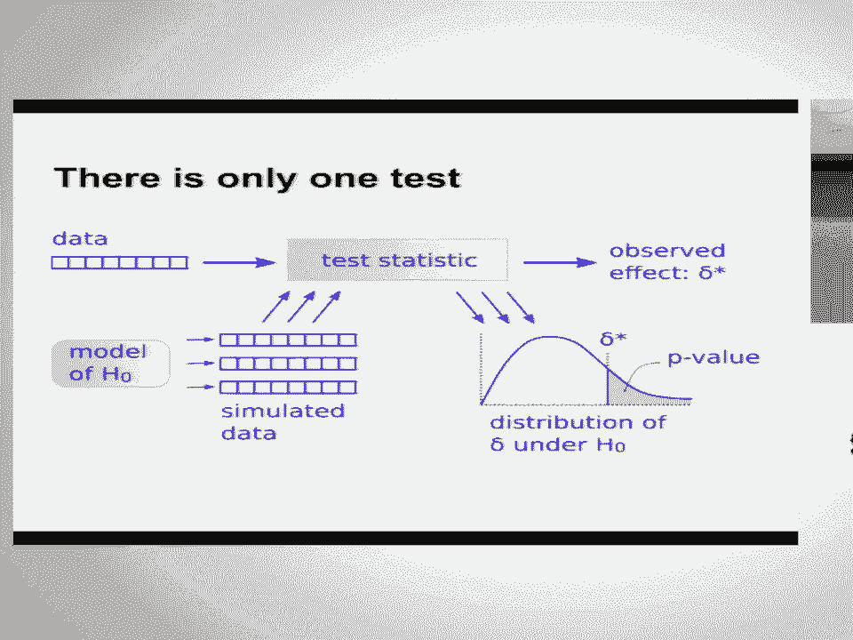

*   **解释**：p值是在零假设为真的前提下，观察到当前数据（或更极端数据）的概率。它不是零假设为真的概率，也不是效应大小的度量。
*   **阈值**：不应僵化地使用0.05作为“显著”的魔法阈值。建议采用数量级解释：p > 0.1 表示结果可能由偶然产生；0.01 < p < 0.1 是灰色区域，需要更多数据；p < 0.01 则提供较强证据反对零假设。
*   **多重检验问题**：如果进行多次检验，即使所有零假设都为真，也有机会得到一些小p值。应对方法包括调整显著性水平（如Bonferroni校正）或预先明确主要假设。
*   **唯一检验**：上述置换框架是通用的。传统的t检验、Z检验等都是针对特定统计量和假设，用分析方法近似p值的特例。计算框架允许你轻松检验任何自定义的统计量（如标准差的差异、分布形态的差异等）。

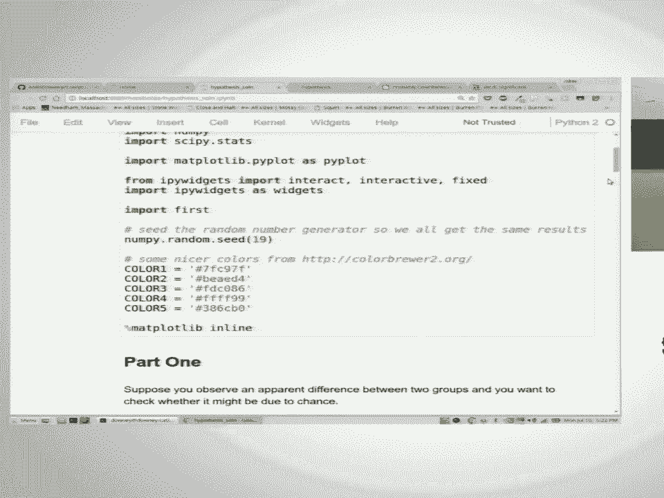

### 假设检验的定位

假设检验（p值）的主要作用是**排除随机误差作为观察到的效应的合理解释**。一个很小的p值让我们可以暂时将“随机巧合”从怀疑列表中划掉，转而关注其他更可能的问题，如测量误差或研究设计缺陷。它本身并不能证明效应是真实或重要的。

## 总结 🎓

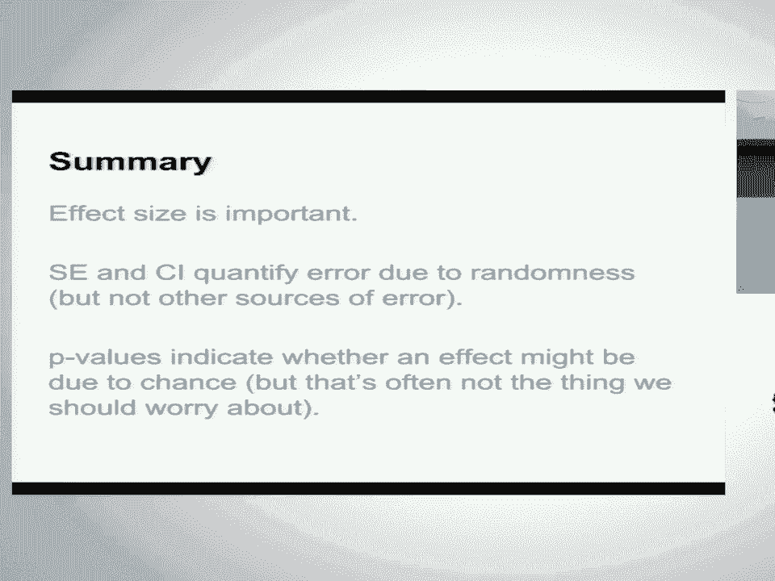


本节课中我们一起学习了计算统计学的三个核心支柱：

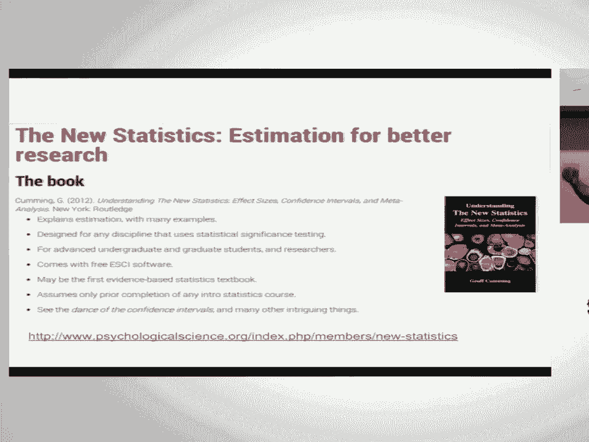

1.  **效应量**：量化观察到的差异的实际大小。这是最重要的信息，应优先报告。科恩效应值、优势比等标准化度量有助于跨研究比较。
2.  **置信区间**：量化估计值的精确度，反映随机抽样带来的不确定性。自助法是一种强大且通用的计算工具，可用于估计任何统计量的置信区间。
3.  **假设检验与p值**：评估观察到的效应是否可能仅由随机因素导致。应正确理解p值的含义，避免滥用，并记住它只是评估研究可靠性的众多方面之一。

记住，统计推断的目标是理解世界。效应大小告诉我们发生了什么，置信区间告诉我们对此有多确信，而p值则帮助我们排除一种特定的错误可能性。始终将效应大小放在首位，并意识到所有统计结论都依赖于模型假设，且可能受到抽样偏差、测量误差等未量化因素的影响。


**推荐资源**：想深入了解这些内容，可以参考Allen Downey的书籍《Think Stats》（O‘Reilly出版，也有免费在线版），其中详细介绍了探索性数据分析、可视化以及本教程涉及的统计推断方法。