# 3：Dash - 构建技术计算用户界面的新框架 🚀

在本节课中，我们将学习一个名为 Dash 的框架。Dash 是一个用于在纯 Python 中构建 Web 应用程序的框架，无需编写任何 JavaScript、HTML 或 CSS。我们将了解 Dash 的核心概念、基本结构，并通过示例学习如何创建交互式数据可视化应用。

---

## Dash 应用概览 📊

Dash 应用是完全在 Web 浏览器中查看的 Web 应用程序。一个简单的 Dash 应用可能只需大约一百行代码。例如，一个应用可以包含一个下拉菜单，用于选择不同的股票代码。当用户选择一个股票代码时，应用程序会调用 Python 代码进行计算，并将生成的股票走势图发送回浏览器显示给用户。

以下是另一个 Dash 应用示例。当用户将鼠标悬停在散点图上的数据点时，左侧会更新显示该分子（数据点）的元信息、图像和相关链接。图表上方有一个下拉菜单，选择不同选项可以高亮显示散点图中的对应点，下方则会列出所有在下拉菜单中选中的分子。

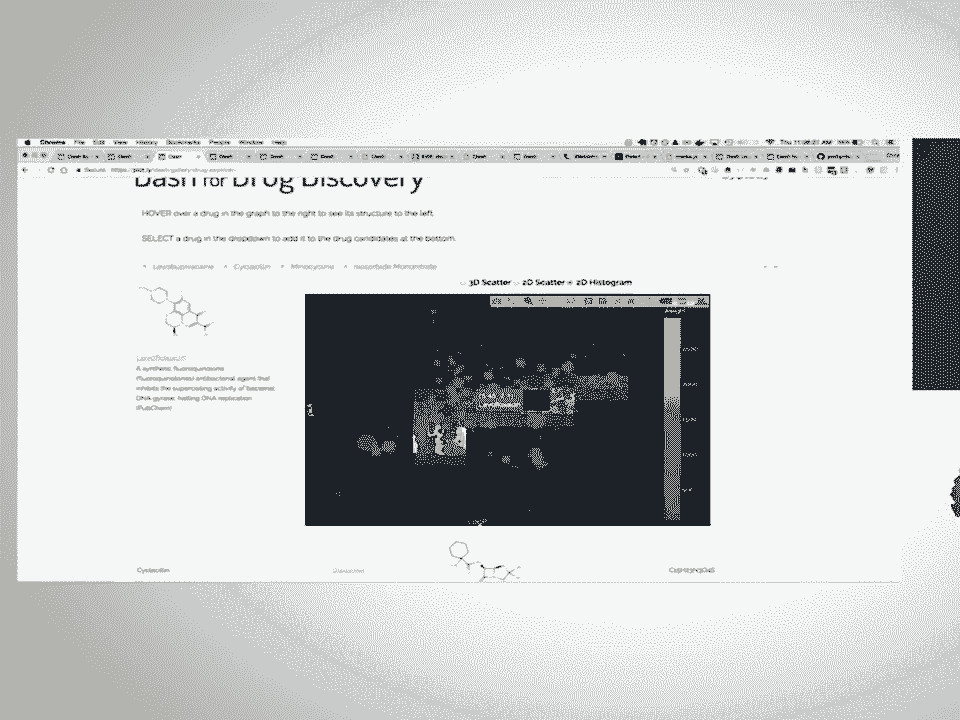

整个应用仅用 Python 编写，无需任何 JavaScript、HTML 或 CSS。应用的所有交互性都是完全定制的。当用户在应用中悬停时，当前选中的数据点会被传递到 Dash 应用的后端，后端在 pandas DataFrame 中查找该点的信息，然后返回更新图表或左侧的元数据。

Dash 的强大之处在于，你可以用它构建非常自定义的用户界面。它不对数据格式或应用程序的外观做任何假设。整个应用大约只需 300 行 Python 代码，且都在一个文件中。

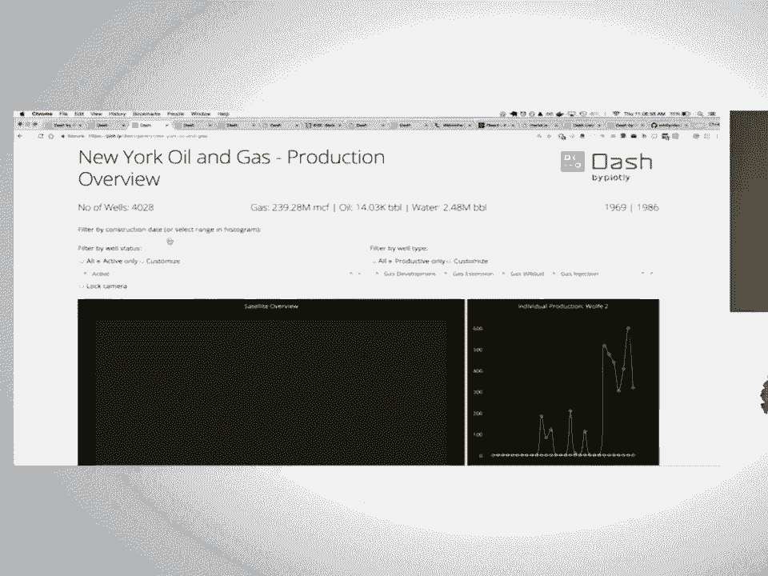

另一个 Dash 应用的例子被格式化为仪表板样式。当用户将鼠标悬停在左侧地图上的点时，应用代码会被调用，并传入当前悬停的值。代码在 pandas DataFrame 中查找数据并提取时间序列。随着悬停点的变化，右侧的时间序列图会相应更新。所有这些图表都由上方的一组输入控件控制，例如一个控制查看年份范围的滑块，以及用于筛选数据的不同下拉菜单。

所有筛选器和输入控件组合在一起，用于更新 Dash 在此示例中运行的基础数据分析代码。此示例大约有 400 行 Python 代码。

你可以用 Dash 构建各种类型的应用程序。它不仅仅用于构建我们刚才看到的传统仪表板。这是一个被格式化为报告样式的 Dash 应用示例。它具有横跨整个网页的漂亮全幅图表，并包含用 Markdown 编写的文本。这是在纯 Python 中重现《纽约时报》文章的一个尝试。

由于 Dash 应用在 Web 浏览器中查看，你可以利用 CSS 的全部功能来自定义应用程序的外观和感觉。Dash 应用的每个美学元素都是可定制的，包括颜色、元素位置、字体等。这是一个我们为客户制作的 Dash 应用示例，它被格式化为报告样式，看起来就像你可能收到的 PDF 报告，只不过是在浏览器中查看。这些图表现在是交互式的，你看到的表格是从数据生成的，它们来自 pandas DataFrame。因此，如果基础数据发生变化，这些图表和表格也会更新。此外，还有一个“打印 PDF”按钮，利用 Chrome 强大的 PDF 生成器来生成应用程序的高质量 PDF。

---

## 构建 Dash 应用教程 🛠️

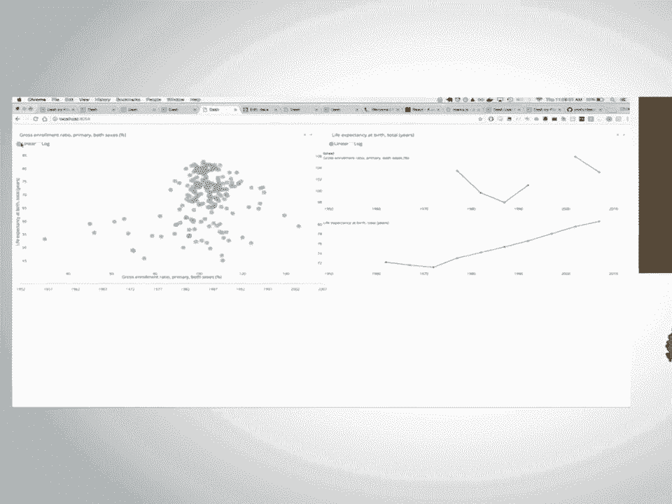

接下来，我们将用大约 10 到 15 分钟创建一个 Dash 应用程序。这个应用大约有几百行代码，包含几个不同的元素。左侧有一个交互式图表，当鼠标悬停在左侧图表的数值上时，右侧的图表会更新显示该点的时间序列。还有一些下拉菜单用于更新 Y 轴绘制的数据，以及单选按钮用于切换以线性或对数格式查看数据。

### 应用布局：描述外观

Dash 应用的第一部分描述了应用程序的外观，称为应用的布局。

以下是一个非常简单的应用。我们有三个组件：一个标题元素 `h1`，一个包含 Markdown 的 `Markdown` 组件，以及一个硬编码了一些数据并绘制条形图的 `Graph` 组件。

Dash 附带两个组件库。第一个是 **dash-html-components**，它为所有可用的 HTML 元素及其属性提供了 Python 抽象。常见的 HTML 元素包括 `div`（通用容器）、标题 `h1`、`h2`，以及图像、段落、表格等。

第二个组件库是 **dash-core-components**，这是一组更高级的组件。它们在幕后结合了 JavaScript、CSS 和 HTML，用于创建更具交互性的控件，包括我们之前看到的下拉菜单，以及这里的 `dcc.Graph`（即 dash-core-components.graph）。

我们刚刚硬编码了一些数据，但你可以想象如何使应用程序更具数据驱动性。只需更改几行代码，不再硬编码数据，而是从 pandas DataFrame 导入数据。然后，不再将 `x` 和 `y` 设置为列表，而是从该 DataFrame 中提取列。例如，`x = df[‘life_expectancy’]`，`y = df[‘gdp_per_capita’]`。每个数据点上还有文本元素，悬停时会显示对应的国家名称。此外，还在下方添加了一个表格元素来显示该 pandas DataFrame。

在 Dash 中，如前所述，应用程序的每个元素都是可定制的，包括颜色、字体。你可以使用 CSS 的全部功能。在这个例子中，我更新了背景样式为深灰色，将文本颜色改为白色。最终，Dash 将这个 HTML `div` 渲染为浏览器中的一个 HTML 元素。因此，所有可用的 HTML 属性，如 `style`、`class`、`id`，都可以作为 Python 属性使用。在这种情况下，`style` 不再是你编写原始 HTML 时看到的字符串，而是一个包含键值对的字典。例如，我可以设置 `color: white`、`background-color: #222`，并在此处将文本居中。

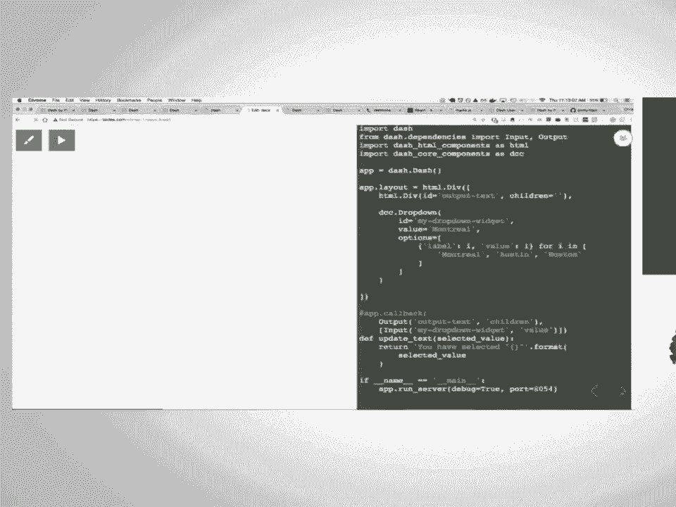

### 应用交互性：描述行为

Dash 应用的第二部分描述了应用程序的交互性，即输入组件如何更新输出组件。

在这个例子中，输入组件是一个下拉菜单，我将根据这个输入来更新文本。当从这个下拉菜单中选择不同的项目时，我会更新上方的文本元素。

在 Dash 中，你通过回调函数来描述交互性。这些回调装饰器以声明式的方式告诉 Dash 输入元素应如何更新输出元素。第一个参数是输出元素，这里有一个字符串 `‘output-text’`，它对应于布局中一个 ID 为 `‘output-text’` 的元素。

这个装饰器表示：每当 ID 为 `‘my-dropdown-widget’` 的输入组件（即上面描述的 `my_dropdown_widget`）的 `value` 属性发生变化时（`value` 是此下拉菜单当前选中的值），就调用被此装饰器包装的函数，并传入新的当前选中值。

因此，在这种情况下，如果我将其更改为 “Austin”，我在这里编写的函数将被 Dash 自动调用，并传入该新值。然后，Dash 期望你返回的值格式正确，并将使用该值来更新我的 Dash 应用程序的另一个属性。在这里，它将更新我的 `div` 的 `children` 属性。

所以，我在这里所做的就是获取下拉菜单中选中的新值，将其格式化为字符串，然后更新那个文本元素。

你可以想象如何使这些应用程序更具数据驱动性。在这个例子中，我将把之前看过的数据集导入 pandas，而不仅仅是显示当前选中值的简单文本。我将基于该值运行一些计算。

这个下拉菜单列出了我的 DataFrame 中所有可用的国家。我根据 pandas DataFrame 中的唯一值动态更新了下拉菜单中的选项。这就是用 Python 编写所有标记的一个非常酷的地方：你可以用 Python 上下文中的值动态更新你的标记。在这里，我有一个包含数百个国家/地区的下拉菜单，我们只是动态地更新它。如果基础数据发生变化，下拉菜单中的可用选项也会随之改变。

然后，我稍微修改了函数以运行计算。我获取当前选中的国家，在此函数内部，我过滤 DataFrame 以仅返回对应于该国家的行，然后基于该数据子集计算 GDP 人均值的平均值。因此，当我更改下拉菜单中的值时，我的函数会被 Dash 自动调用，它计算统计量并将该统计量返回给 Web 浏览器。

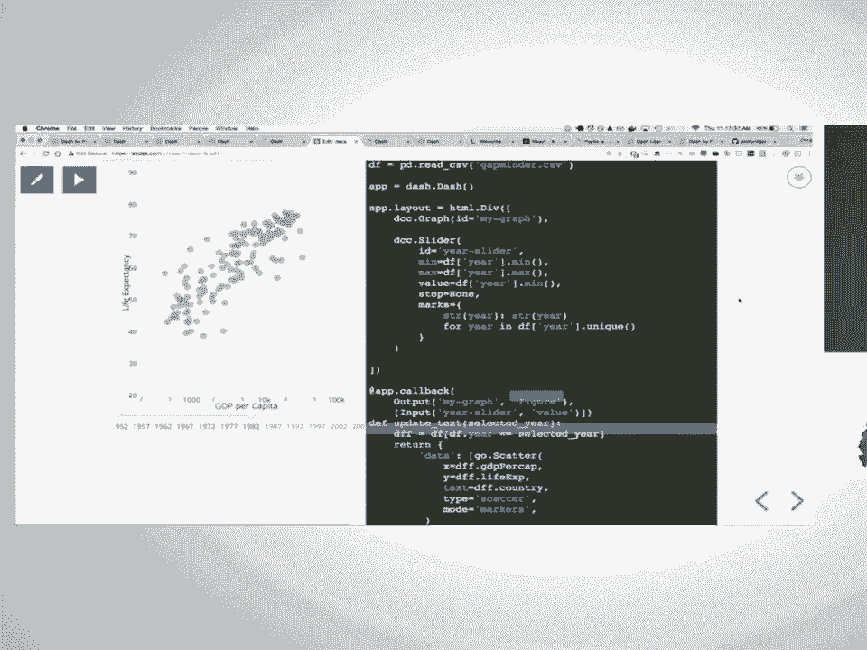

这是一个相当简单的例子，我们只是更新一个文本元素。但让我们将下拉菜单改为滑块，并将文本元素改为图表。

在这种情况下，我们有一个 `dcc.Slider`（即 dash-core-components 滑块组件）和上方的一个 `Graph` 组件。当我在滑块中选择不同的值时，我的函数被自动调用。我根据当前选中的年份过滤我的 DataFrame 数据，然后基于过滤后的数据绘制散点图，将 X 轴数据设置为 GDP 人均值，Y 轴数据设置为过滤后的 DataFrame 中的预期寿命。

这只是单个输入元素更新单个输出元素的情况。在许多情况下，我们的数据分析代码中有多个参数，我们可能希望设置多个输入来更新单个输出。

在这个例子中，我有两个下拉菜单、两个单选项目和一个滑块，总共五个输入。我只是扩展了我的回调装饰器，以包含页面上显示的所有这些输入。因此，每当我更改这些元素中的任何一个，或者在下拉菜单中选择一个新值时，Dash 将收集我选择的所有输入的当前选中值，并将它们作为位置参数传递给我装饰的函数。然后，我可以自由地用它做任何我想做的事情。在这里，我将根据这些值过滤我的 DataFrame，并基于过滤后的数据返回一个新的 `figure` 属性。如果我选择“线性”或“对数”，我将更改坐标轴类型。

这是 Dash 的一个很酷的地方：即使一次只有一个输入在变化，而不是所有输入同时变化，Dash 也会完成所有工作，收集所有输入的当前选中值，并使它们对你可用。因此，你可以编写这些函数，并且知道你在函数内部获得的变量代表了应用程序的当前状态。

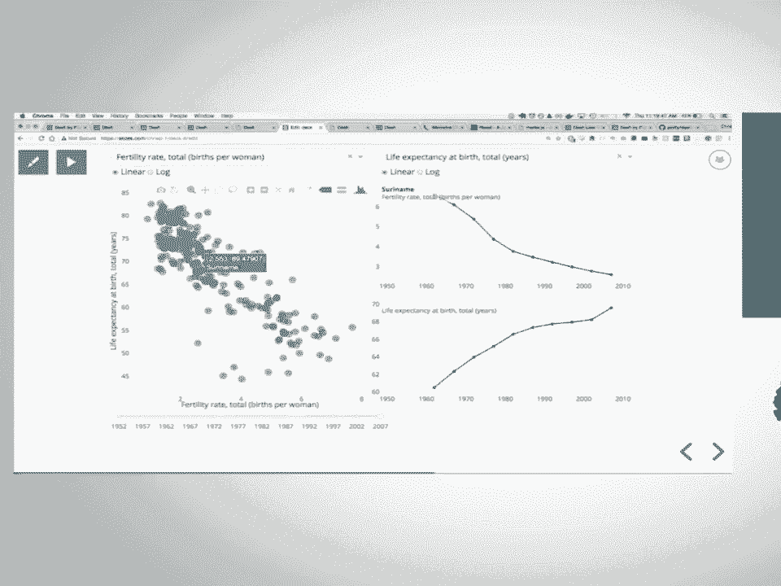

这只是一个具有五个输入元素的输出元素。如果你想要有多个输出，你只需编写具有不同装饰器的多个函数。这个例子可以很容易地扩展到我们拥有相同数量的输入元素（两个下拉菜单、两个单选项目和一个滑块），但我们基于它更新三个图表的情况。因此，我们有三个不同的函数被装饰。

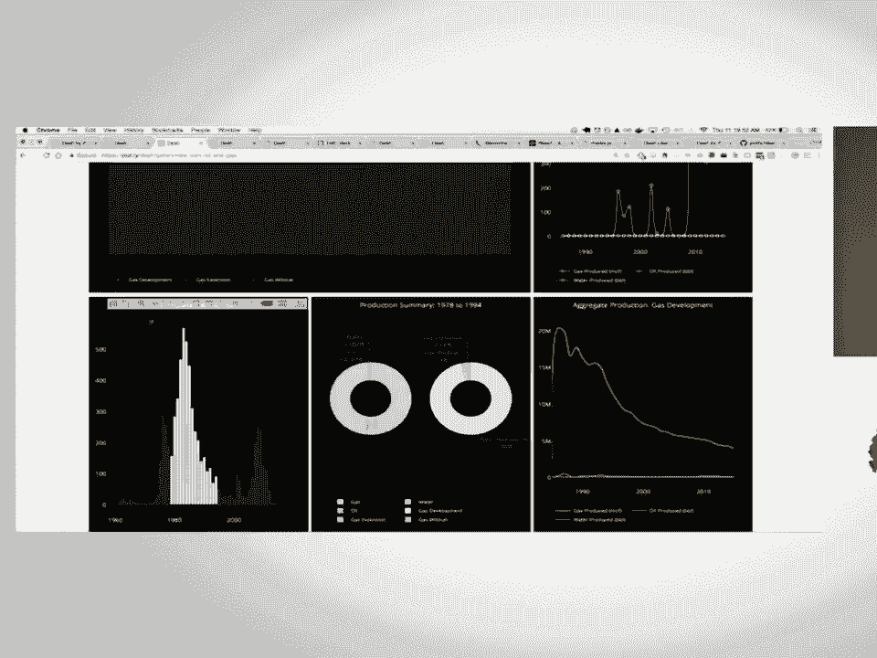

这里的图表本身也是一个输入元素。当我在这个图表中悬停数值时，它会调用其他装饰器来更新右侧的时间序列图，只需使用 pandas 对该数据进行一些过滤即可。

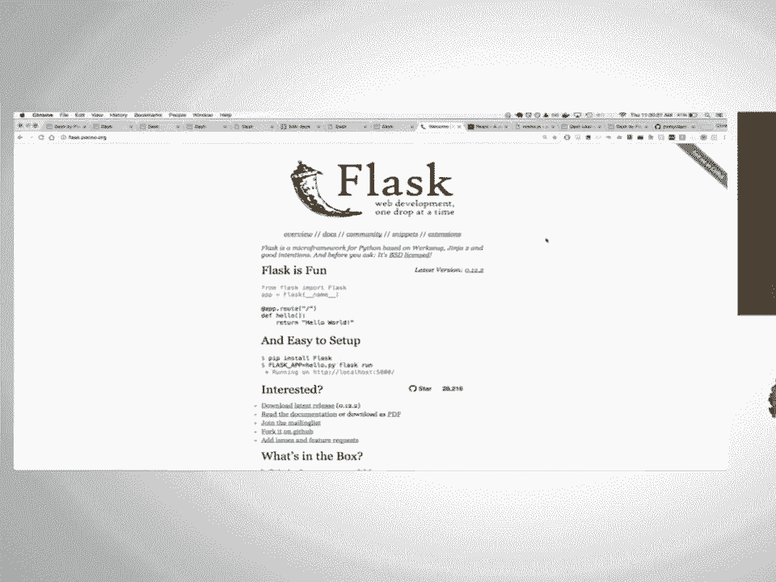

---

## Dash 的技术基础与生态系统 ⚙️

简而言之，这就是 Dash。你可以扩展这些示例来创建更复杂的应用程序类型，就像我们之前展示的那样，具有多个输入和多个输出，并且可以将它们设计得非常美观。

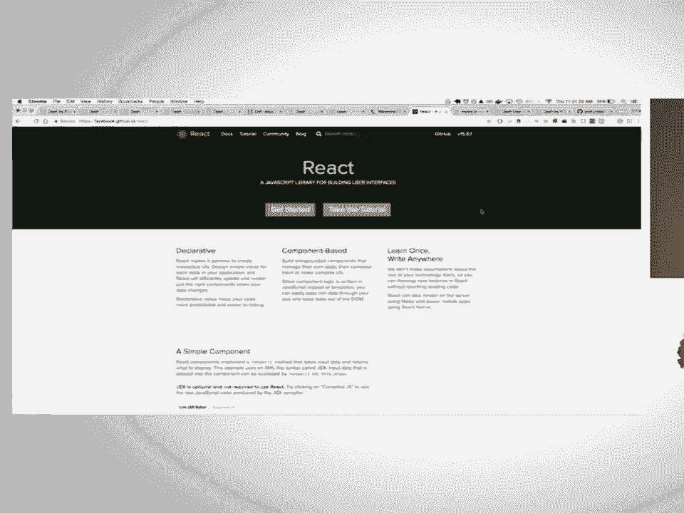

Dash 的实现依赖于几个核心关键技术。Dash 本身是一个 Web 应用程序框架，我们使用的底层服务器是 Flask，并且作为 Dash 开发者，你可以使用它。例如，如果你想向 Dash 应用程序添加额外的路由，你可以访问该底层服务器实例并添加额外的路由。

实际上，Dash 主要是一个前端项目，在幕后主要是 JavaScript 项目。我们渲染的所有组件都是通过这个名为 React 的前端框架实现的。React 是一个由 Facebook 构建和维护的前端用户界面框架。我们在 Plotly 内部大量使用它来构建 Web 应用程序，它非常出色。

React 的一个真正优点是，有一个庞大的开发者社区，他们用 JavaScript 制作这些模块化组件，并在非常宽松的许可证（如 MIT 许可证）下开源，供所有人使用。

对于 Dash，我们所做的是创建了一个工具链，使得将现有的 React.js 组件转换为与 Dash 生态系统兼容、可在 Dash 应用程序中使用的组件变得非常容易。

例如，我们之前看到的滑块组件，实际上并不是我编写的，而是开源社区中的其他人编写和维护的。我碰巧找到了它，它非常棒。通过 Dash 的 React-to-Python 工具链，我能够只用大约 10 到 15 行额外的 JavaScript 就将这个组件转换为 Dash 兼容的组件。将这个组件转换为 Dash 兼容组件真的很容易。

因此，考虑到 Dash 的未来，我们已经可以在 React 生态系统中获得数千个高质量的前端组件。通过这个将 React 组件转换为 Dash 兼容组件的工具链，我认为我们很快将拥有一个非常丰富的组件集，这些组件不仅由我们或单个人维护，而是由社区维护。

我们在内部用于将这些 React 组件转换为 Python Dash 组件的工具链也是开源的，任何人都可以使用。因此，如果你想编写一个组件，或将现有的 React 组件转换为 Dash 兼容组件，你也可以这样做，并且使用的是我们内部使用的相同工具集。

如果 React 和 JavaScript 对你来说是新的，我们还在 academy.plot.ly 上编写了一个非常棒的 React 入门教程。这是我们用来培训自己员工的 React 教程，它会引导你从头到尾在 JavaScript 中创建一个 React 组件和 React 应用程序。将组件从 React 转换为 Python 的指南是用户指南中的一章，它会逐步引导你完成。

Dash 本身是开源的，采用 MIT 许可证。因此，你可以在自己的笔记本电脑上自由使用它，也可以在自己的基础设施或他人的基础设施上自由部署 Dash 应用。你部署和管理 Dash 应用就像部署和管理 Flask 应用一样。

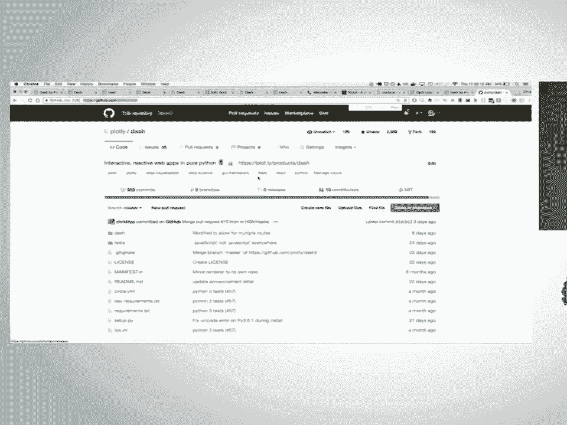

Plotly 本身是一家私营公司，我们获得了风险投资支持。我们能够通过许可企业附加组件和企业平台来资助我们所做的所有开源工作，这些附加组件和平台使公司更容易采用开源软件。

对于 Dash，我们开发了一个部署服务器，用户可以安装在自己的基础设施上。这使得上传 Dash 代码并自动为你启动服务器变得非常容易。它还添加了诸如 LDAP 和 Active Directory 身份验证等功能。当然，你也可以自己实现这些功能。我们完全没有将你锁定在其中。我们只是创建了一些企业平台和企业附加组件，使这变得更容易一些。

最终，通过这种制作这些企业附加组件和平台以使其更易于使用该软件的商业模式，我们能够资助一个团队，其中超过一半的工程师直接从事每个人都可以使用的开源软件工作。这包括 Dash 本身，包括我们用于交互式图形的 JavaScript 绘图库 Plotly.js，以及所有使用 Plotly.js 的库，比如我们的 R 库和 Python 库以及 Julia 库。

因此，我们认为这是一个非常酷的模式，也是一种构建软件的方式，这种软件将长期存在，并将长期得到公司的支持。

---

## 总结与资源 📚

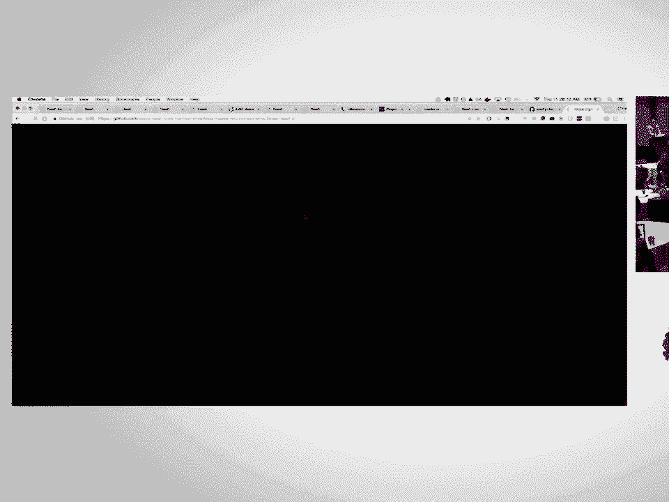

本节课中，我们一起学习了 Dash 框架。Dash 是一个用于在纯 Python 中构建交互式 Web 应用程序的强大工具，特别适合数据分析和可视化。我们了解了：

*   Dash 应用的基本结构：**布局**（描述外观）和**回调**（描述交互性）。
*   核心组件库：**dash-html-components** 和 **dash-core-components**。
*   如何通过 Python 回调函数连接输入和输出，实现动态数据更新。
*   Dash 基于 Flask 和 React 的技术栈，以及其强大的社区插件生态。

Dash 是开源的，你可以在 GitHub 上找到它。通过用户指南，你可以在大约半小时内入门。我们鼓励你尝试它，并参与到社区中。

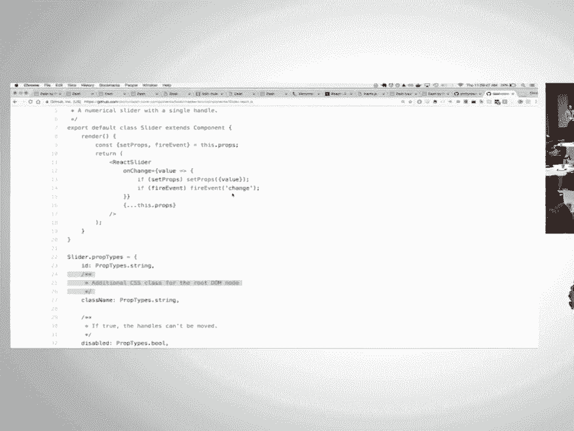

**核心概念公式/代码表示：**

*   **布局结构**：`app.layout = html.Div([dcc.Graph(...), dcc.Dropdown(...)])`
*   **回调装饰器**：`@app.callback(Output(‘output-id’, ‘property’), [Input(‘input-id’, ‘value’)])`
*   **更新函数**：`def update_output(input_value): return processed_data`

希望本教程能帮助你开始使用 Dash 构建自己的数据应用！