# 4：机器学习与 scikit-learn 教程（第一部分） 🧠

在本节课中，我们将学习机器学习的基础概念，并了解如何使用 scikit-learn 库进行实践。课程将从机器学习的核心思想开始，逐步深入到数据表示、监督学习、无监督学习以及 scikit-learn 的统一 API。

---

## 📚 机器学习概述

机器学习的目标是从数据中学习并做出预测或决策。其核心思想是**泛化**，即模型不仅要在训练数据上表现良好，还要能够准确预测新的、未见过的数据。

一个标准的机器学习流程如下：你拥有一些带有标签（或称为目标值）的历史数据（训练集）。算法通过学习这些数据来预测标签。当遇到新的观测数据（测试集）时，算法需要能够正确预测其标签。

以下是机器学习的主要类别：

*   **监督学习**：数据带有标签。目标是学习从输入特征到标签的映射。
    *   **分类**：预测离散的类别标签（例如，判断邮件是否为垃圾邮件）。
    *   **回归**：预测连续的数值（例如，预测房屋价格）。
*   **无监督学习**：数据没有标签。目标是发现数据中的内在结构或模式。
    *   **聚类**：将相似的数据点分组。
    *   **降维**：将高维数据投影到低维空间以便可视化或压缩。
    *   **异常检测**：识别与大多数数据显著不同的数据点。

---

## 🧮 数据表示与可视化

在 scikit-learn 中，数据通常被表示为一个二维的 NumPy 数组 `X`，其形状为 `(n_samples, n_features)`。每一行代表一个样本（观测值），每一列代表一个特征（描述符）。

我们将使用经典的 **Iris（鸢尾花）** 数据集作为示例。这个数据集包含 150 个样本，每个样本有 4 个特征（萼片长度、萼片宽度、花瓣长度、花瓣宽度），目标是将花分类为三个品种之一。

```python
from sklearn.datasets import load_iris
iris = load_iris()
X = iris.data  # 特征矩阵，形状 (150, 4)
y = iris.target # 目标标签，形状 (150,)
```

在开始建模前，可视化数据非常重要。例如，我们可以绘制特征之间的散点图来观察类别是否可分。

```python
import matplotlib.pyplot as plt
plt.scatter(X[:, 0], X[:, 1], c=y)
plt.xlabel(iris.feature_names[0])
plt.ylabel(iris.feature_names[1])
```

---

## 🧪 训练集与测试集

为了评估模型的泛化能力，我们需要将数据划分为**训练集**和**测试集**。模型只在训练集上学习，然后在测试集上评估性能。这可以防止模型“死记硬背”（过拟合）。

scikit-learn 提供了 `train_test_split` 函数来完成这个任务。

```python
from sklearn.model_selection import train_test_split
X_train, X_test, y_train, y_test = train_test_split(X, y, test_size=0.3, random_state=42)
```

参数 `random_state` 用于固定随机种子，确保每次分割的结果可复现。对于分类问题，可以使用 `stratify=y` 参数进行分层抽样，确保训练集和测试集中各类别的比例与原始数据集一致。

---

## 🔍 监督学习：分类

上一节我们介绍了如何准备数据，本节中我们来看看如何使用 scikit-learn 构建一个分类器。

我们将使用一个简单的 **k-最近邻（k-NN）** 分类器。它的原理是：对于一个新样本，在训练集中找到 k 个最相似的样本（邻居），然后根据这 k 个邻居的标签来预测新样本的标签。

以下是使用 k-NN 分类器的基本步骤：

1.  **导入并实例化模型**。
2.  **在训练集上拟合（训练）模型**。
3.  **在测试集上进行预测**。
4.  **评估模型准确率**。

```python
from sklearn.neighbors import KNeighborsClassifier
# 1. 实例化模型，设置邻居数 k=3
knn = KNeighborsClassifier(n_neighbors=3)
# 2. 在训练集上拟合模型
knn.fit(X_train, y_train)
# 3. 在测试集上预测
y_pred = knn.predict(X_test)
# 4. 评估准确率
accuracy = (y_pred == y_test).mean()
print(f"准确率: {accuracy:.2f}")
```

所有 scikit-learn 的估计器（模型）都遵循类似的 `.fit()` 和 `.predict()` API。拟合后，模型会学习到一些参数，这些参数通常存储在以下划线结尾的属性中（例如，对于线性模型，系数存储在 `coef_` 中）。

---

## 📈 监督学习：回归

现在，让我们转向回归问题。回归的目标是预测一个连续值，而不是一个类别。

我们将使用一个合成的数据集来演示，其中 `y` 是 `x` 的正弦函数加上一些线性趋势和噪声。我们的目标是拟合这个关系。

首先，我们尝试最简单的 **线性回归** 模型。它试图找到一条直线（在高维空间中是超平面）来最好地拟合数据。

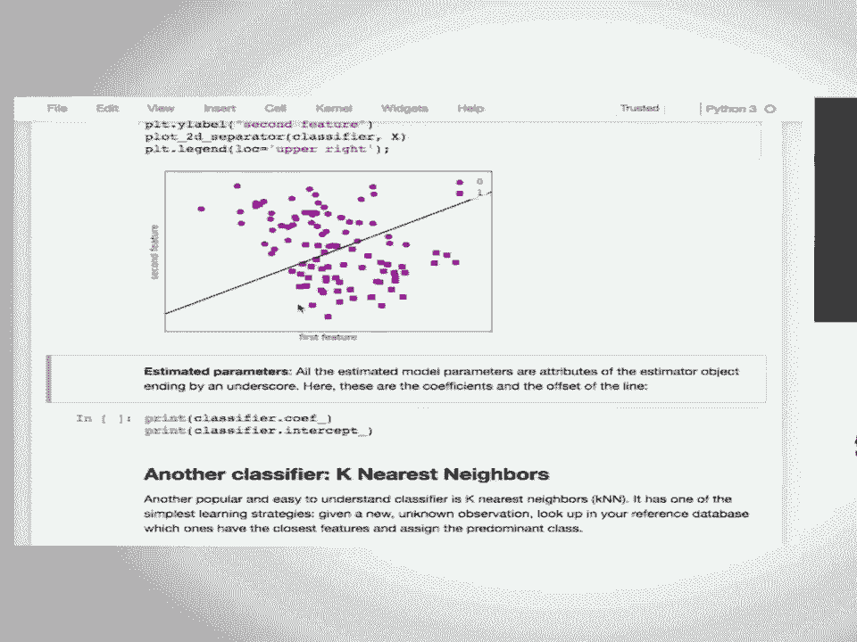

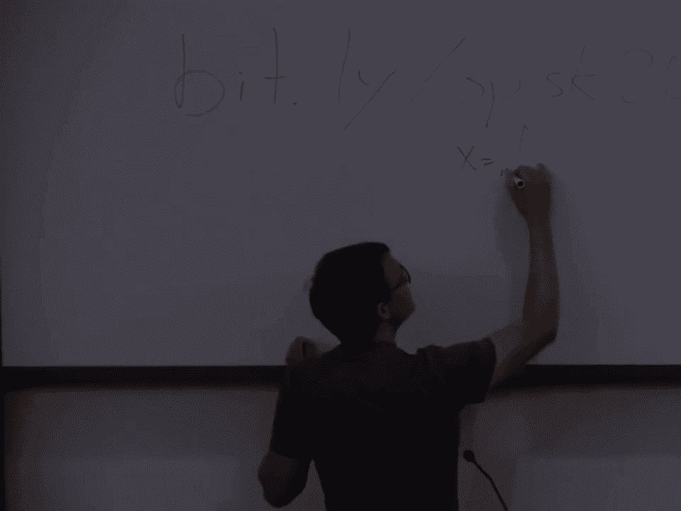

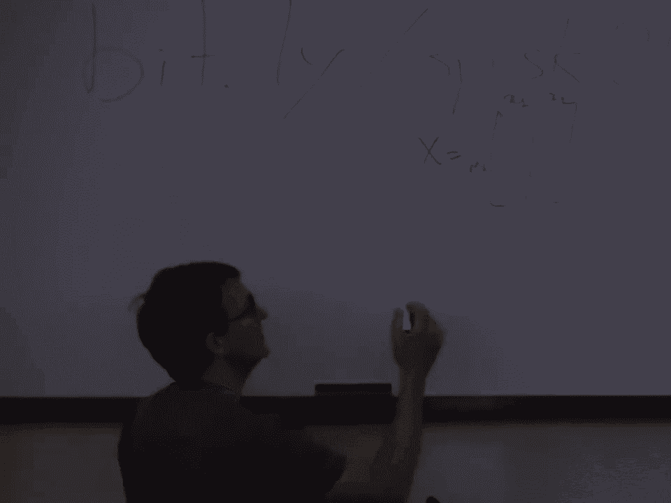

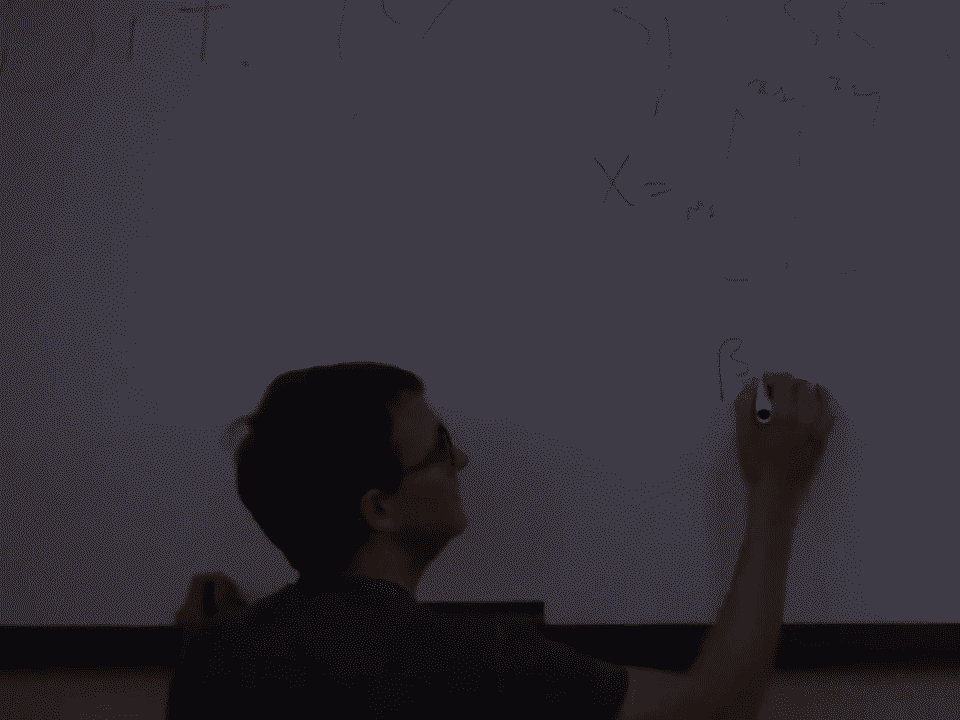

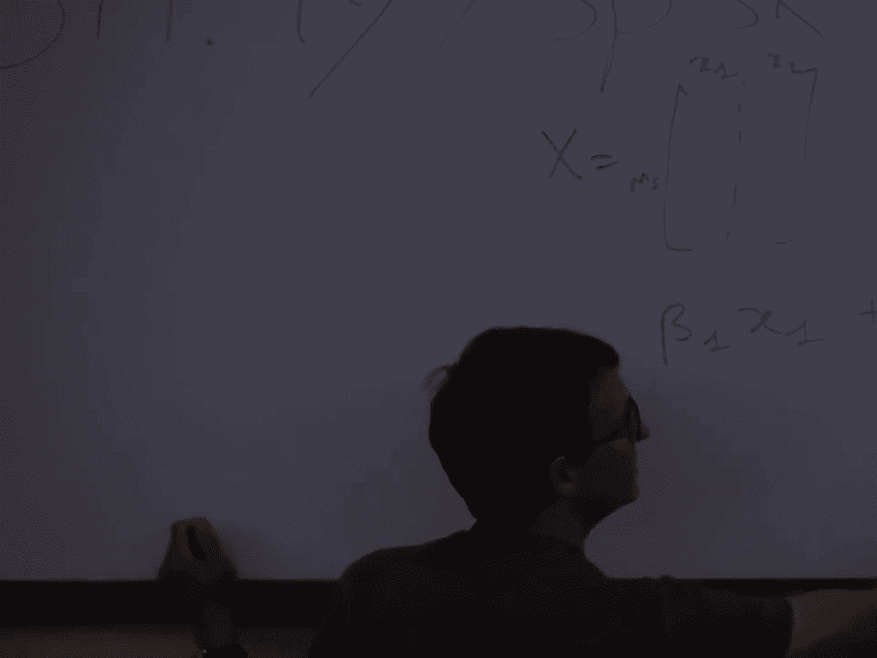

```python
from sklearn.linear_model import LinearRegression
# 生成合成数据
X = np.linspace(0, 10, 100).reshape(-1, 1)
y = np.sin(X).ravel() + X.ravel() * 0.5 + np.random.randn(100) * 0.5

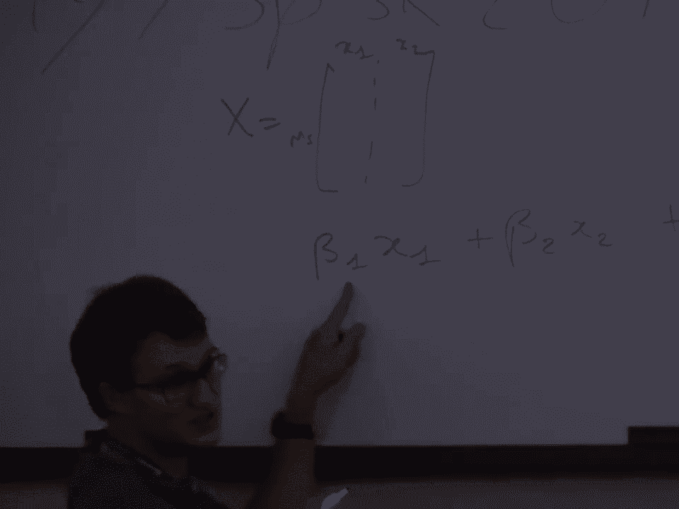

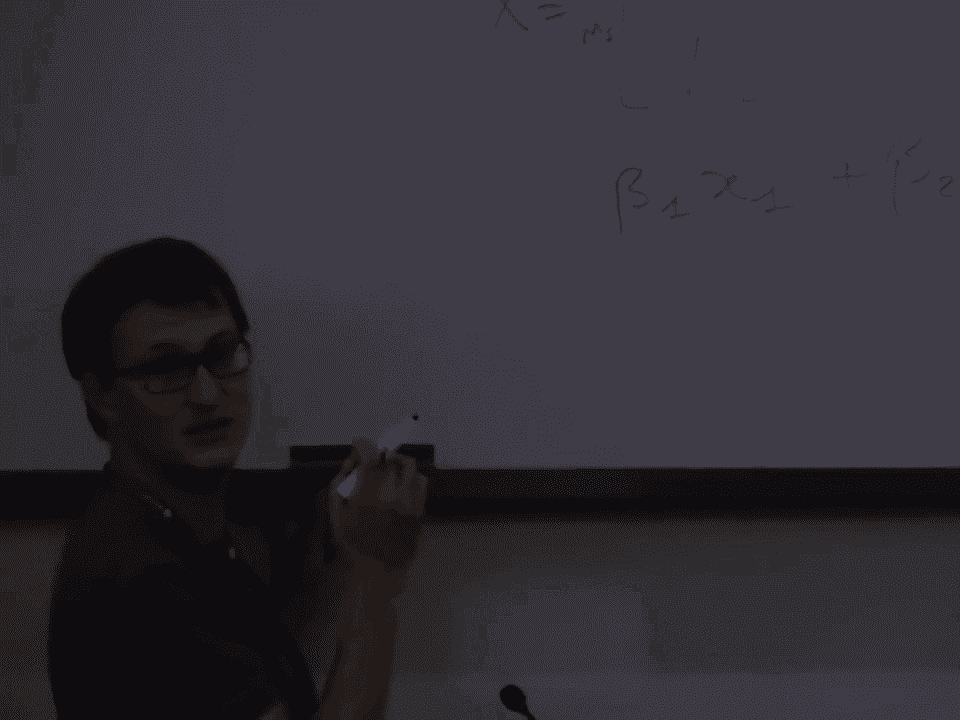

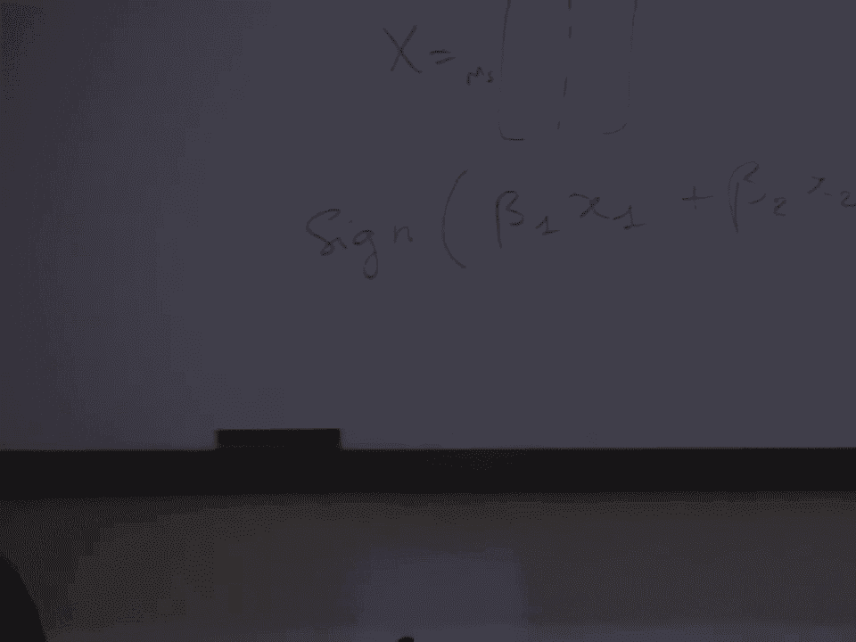

reg = LinearRegression()
reg.fit(X_train, y_train)
y_pred = reg.predict(X_test)
```

线性模型的形式是：`y_pred = coef_ * X + intercept_`。对于这个非线性数据，线性回归只能捕捉到整体的线性趋势，而无法捕捉周期性波动。

为了让线性模型处理非线性关系，我们可以进行**特征工程**，即手动创建非线性特征（例如，添加 `sin(X)` 作为一个新特征），然后让线性模型去学习这些特征的组合。

```python
# 添加正弦波作为新特征
X_new = np.hstack([X, np.sin(4 * X)])
reg_new = LinearRegression()
reg_new.fit(X_new_train, y_train)
```

这样，模型就能同时捕捉线性和周期性的模式了。当然，更强大的模型（如 k-NN 回归器或基于树的模型）可以自动学习这些非线性关系。

---

## 🌀 无监督学习：数据预处理与变换

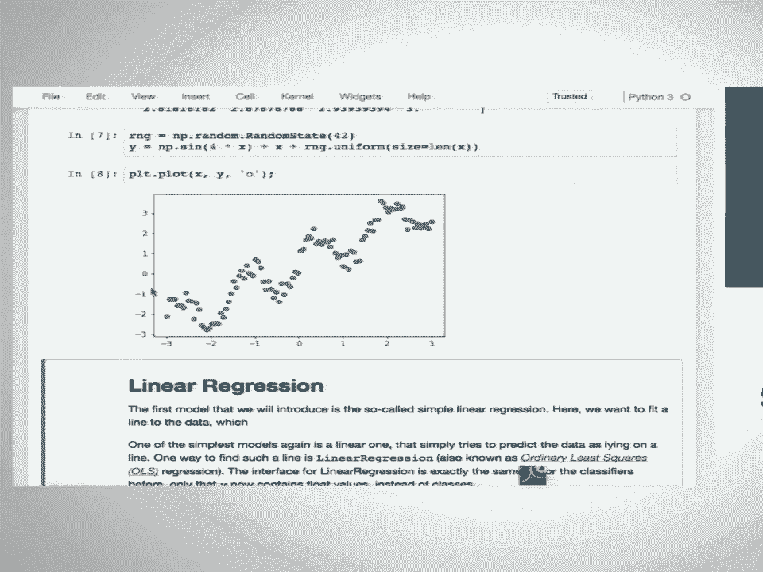

在深入更复杂的无监督学习之前，我们先看看一些基本的数据变换。许多机器学习算法对数据的尺度很敏感，因此**标准化**是一个常见的预处理步骤。


`StandardScaler` 会将每个特征缩放为均值为 0，方差为 1。**关键点**是：缩放器应该只在训练集上拟合（计算均值和方差），然后用同样的参数去变换训练集和测试集。

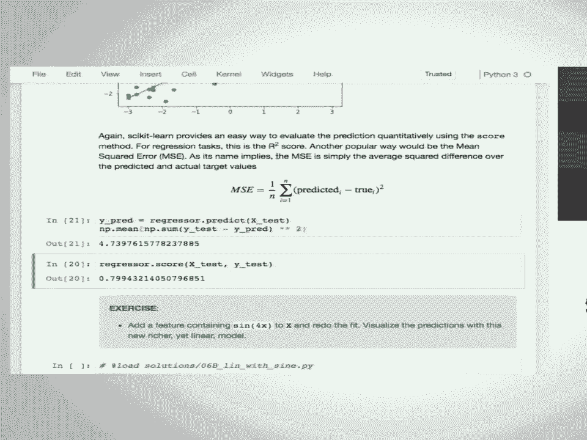

```python
from sklearn.preprocessing import StandardScaler
scaler = StandardScaler()
scaler.fit(X_train) # 只在训练集上计算均值和标准差
X_train_scaled = scaler.transform(X_train)
X_test_scaled = scaler.transform(X_test) # 用训练集的参数变换测试集
```

---

## 🎯 无监督学习：降维（PCA）


**主成分分析（PCA）** 是一种常用的降维技术。它通过线性变换找到数据中方差最大的方向（主成分），并允许我们保留最重要的几个成分，丢弃信息量少的成分。

PCA 常用于数据可视化（将高维数据降至 2D 或 3D）或作为特征压缩/提取的前置步骤。

```python
from sklearn.decomposition import PCA
pca = PCA(n_components=2) # 降至2维
X_pca = pca.fit_transform(X_scaled) # 拟合并变换数据
# X_pca 现在是一个二维数组，可以用于绘图
```

我们可以查看每个主成分所解释的方差比例，以决定保留多少成分。

```python
print(pca.explained_variance_ratio_)
```

---

## 👥 无监督学习：聚类（K-Means）

**聚类**的目标是将数据点分组，使得同一组内的点彼此相似，而不同组的点彼此不同。**K-Means** 是最常用的聚类算法之一，它试图找到 `k` 个簇中心，并将每个点分配到最近的中心。

使用 K-Means 需要预先指定簇的数量 `k`。

```python
from sklearn.cluster import KMeans
kmeans = KMeans(n_clusters=3, random_state=42)
cluster_labels = kmeans.fit_predict(X) # 同时拟合和预测
# 可以查看簇中心
centers = kmeans.cluster_centers_
```

评估聚类质量是一个挑战，因为没有真实的标签。对于像手写数字这样的数据集，我们可以将聚类结果与真实标签比较（使用如 `adjusted_rand_score` 的指标），但在真正的无监督场景中，通常需要人工检查簇的含义。

K-Means 假设簇是球形的且大小相近，对于复杂形状的簇可能效果不佳。scikit-learn 还提供了其他聚类算法，如 DBSCAN 和 Agglomerative Clustering。

---

## ⚙️ scikit-learn API 统一接口回顾

scikit-learn 的所有估计器都遵循一个一致的接口，这大大简化了使用过程。主要的方法可以总结如下：

*   **`.fit(X, [y])`**: 在数据 `X`（和标签 `y`，如果是监督学习）上训练模型。这是**学习**的过程。
*   **`.predict(X)`**: 使用训练好的模型对新的数据 `X` 进行**预测**（用于分类、回归或聚类）。
*   **`.transform(X)`**: 使用训练好的模型将数据 `X` 转换到新的表示空间（用于预处理、降维等）。
*   **`.score(X, y)`**: 评估模型在给定数据（和真实标签）上的性能。对于分类器，默认是准确率；对于回归器，默认是 R² 分数。

许多模型还提供了便捷方法，如 `.fit_predict()`（用于聚类）和 `.fit_transform()`（用于变换）。

---

## 🚢 案例研究：泰坦尼克号生存预测

让我们将所学知识应用到一个更真实的数据集上：预测泰坦尼克号乘客的生存情况。这是一个二分类问题（生存/未生存）。

数据预处理是关键步骤，因为原始数据包含多种类型：
1.  **数值特征**：如年龄、票价。可以直接使用，但可能需要处理缺失值（使用 `SimpleImputer` 填充均值）。
2.  **分类特征**：如性别、登船港口、客舱等级。需要转换为数值。
    *   **独热编码（One-Hot Encoding）**：为每个类别创建一个新的二进制特征。适用于线性模型、k-NN 等。可以使用 `pandas.get_dummies` 或 `sklearn.preprocessing.OneHotEncoder`。
    *   **标签编码（Label Encoding）**：为每个类别分配一个整数。适用于树模型（如随机森林）。

以下是处理流程的概要：

```python
import pandas as pd
from sklearn.model_selection import train_test_split
from sklearn.impute import SimpleImputer
from sklearn.linear_model import LogisticRegression

# 1. 加载数据，选择特征
data = pd.read_csv('titanic.csv')
features = ['Pclass', 'Sex', 'Age', 'SibSp', 'Parch', 'Fare', 'Embarked']
X = data[features]
y = data['Survived']

# 2. 分割数据
X_train, X_test, y_train, y_test = train_test_split(X, y, random_state=0)

# 3. 预处理：将分类特征转换为独热编码，并处理数值特征的缺失值
X_train = pd.get_dummies(X_train) # 自动处理分类列
imputer = SimpleImputer(strategy='mean')
X_train_imputed = imputer.fit_transform(X_train)
# 对测试集进行同样的转换（使用训练集拟合的imputer和get_dummies的列结构）
# ... (需要更细致的处理来保持列对齐)

# 4. 训练模型
logreg = LogisticRegression()
logreg.fit(X_train_imputed, y_train)

# 5. 评估（需要在测试集上应用相同的预处理步骤）
# ...
```

通过这个案例，你可以看到构建一个机器学习管道涉及数据清理、特征工程、模型选择和评估等多个环节。

---

## 🎯 总结

在本节课中，我们一起学习了：
1.  机器学习的基本概念：**监督学习**（分类、回归）与**无监督学习**（聚类、降维）。
2.  在 scikit-learn 中表示数据：使用形状为 `(n_samples, n_features)` 的 NumPy 数组。
3.  评估模型泛化能力的关键：将数据分割为**训练集**和**测试集**。
4.  使用 scikit-learn 的统一 API（`.fit()`, `.predict()`, `.score()`）构建和评估分类器与回归器。
5.  常见的数据预处理技术：**标准化**和**独热编码**。
6.  无监督学习技术：**PCA** 用于降维和可视化，**K-Means** 用于聚类。
7.  通过 **泰坦尼克号数据集** 的案例，实践了从原始数据到建模的完整流程。

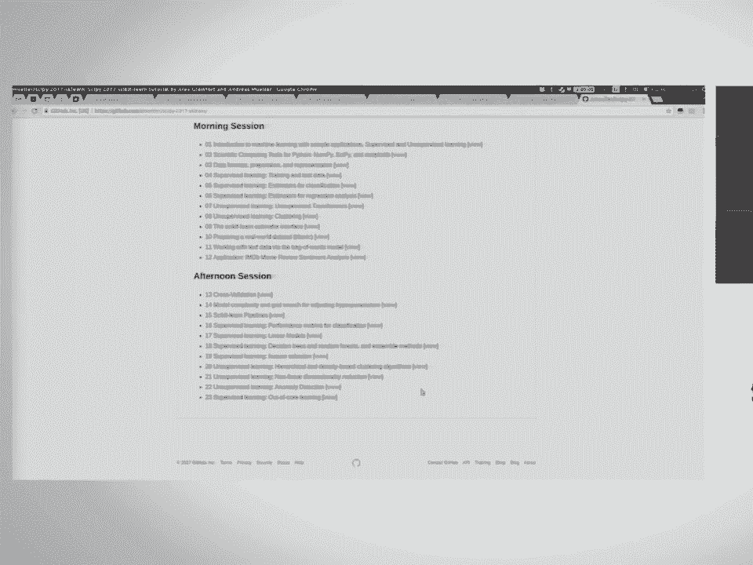

这些基础知识为你使用 scikit-learn 解决实际问题奠定了坚实的基础。在接下来的课程中，我们将深入探讨模型选择、超参数调优、集成方法以及文本数据处理等更高级的主题。