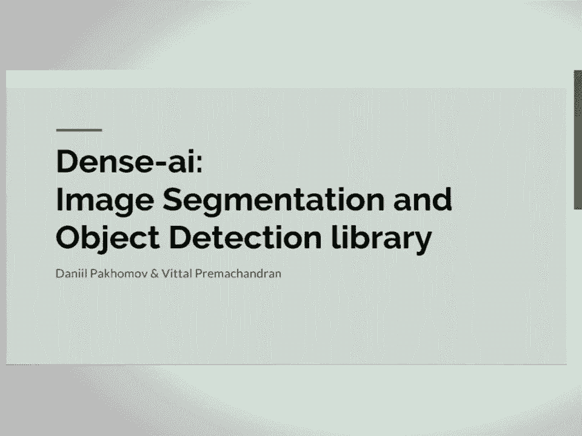
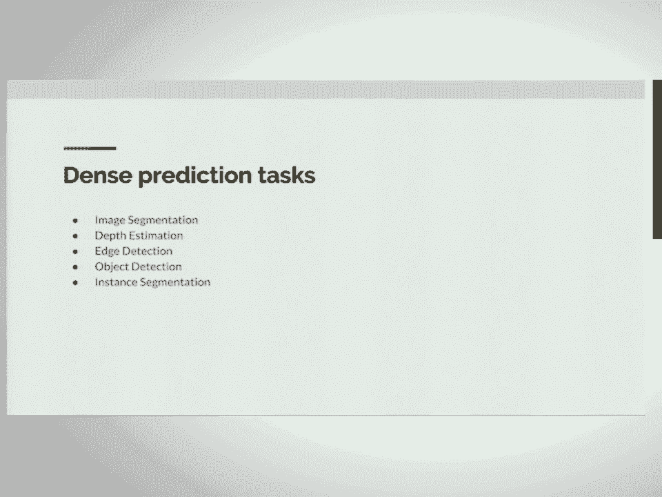

# 6：用于图像分割的全卷积网络 🧠

在本课程中，我们将学习全卷积网络在图像分割任务中的应用。我们将从基础的机器学习模型开始，逐步理解卷积神经网络的工作原理，并最终探讨如何将其改造用于像素级的密集预测任务，如图像分割。

---

## 从线性模型到多层感知机

上一节我们介绍了课程概述，本节中我们来看看图像分类的基础模型。

逻辑回归和线性回归是简单的线性模型。它们将图像（例如MNIST手写数字）的像素展平，并通过一个线性函数进行预测。其核心公式如下：

**线性回归**: `y = Wx + b`
**逻辑回归（Softmax）**: `P(class=i) = exp(z_i) / Σ_j exp(z_j)`

这种模型的局限性在于无法建模输入变量之间的复杂交互关系，例如它无法表示异或（XOR）函数。

为了解决线性模型的局限性，我们引入了非线性激活函数，并将多个层堆叠起来，形成了**多层感知机**。以下是两种常见的非线性激活函数：

*   **Sigmoid**: `σ(x) = 1 / (1 + exp(-x))`
*   **修正线性单元**: `ReLU(x) = max(0, x)`

MLP是一个非线性模型，能够表示非常复杂的函数，从而在MNIST等任务上获得更高的准确率。

---

## 计算机视觉的灵感：金字塔与层次特征

上一节我们了解了MLP如何引入非线性，本节中我们来看看计算机视觉中的经典思想如何启发神经网络的设计。

在计算机视觉研究中，**高斯金字塔**和**拉普拉斯金字塔**被用于多尺度图像分析。高斯金字塔通过不断下采样得到图像的不同尺度表示，用于处理不同大小的目标（如远近不一的人脸）。拉普拉斯金字塔则将图像分解为不同频率的子带，分别捕捉高频（如边缘）和低频（如整体形状）信息。

有趣的是，卷积神经网络的结构与这些金字塔模型有深刻的相似性。网络浅层的神经元激活响应类似于拉普拉斯金字塔的高频信息（捕捉边缘、纹理），而深层的神经元则响应更高级的语义特征（如物体的部件或整体）。

卷积神经网络的一个重要特性是它能**分层学习特征**。例如，一个用于人脸识别的网络，其第一层权重可能学习到边缘或斑点，中间层学习到眼睛、耳朵等部件，更深层则学习到整个面部的结构。

---

## 卷积神经网络算术

理解了CNN的灵感来源后，我们需要掌握其核心运算机制。

卷积操作有两个关键参数：**填充**和**步长**。
*   **填充**：在输入特征图边缘添加零值，以控制输出特征图的大小。
*   **步长**：卷积核在输入上移动的间隔，决定了下采样的程度。

通过堆叠卷积层和池化层，网络能够逐步提取特征并降低空间分辨率，实现从细节到语义的抽象。

---

## 密集预测任务

现在我们已经掌握了CNN的基础，本节中我们来看看本课程的核心目标——密集预测任务。

密集预测任务要求为图像的每个像素生成一个输出。主要包括：
*   **语义分割**：为每个像素分配一个类别标签（如人、马、背景）。
*   **深度估计**：从单张图像预测每个像素的深度值。
*   **边缘检测**：识别图像中物体的边界。

这些任务在计算机视觉中至关重要，并可作为更高级算法（如自动驾驶、医学图像分析）的组成部分。

---

## 从分类网络到全卷积网络

传统的CNN用于图像分类时，末端通常包含全连接层，最终输出一个固定维度的向量（如1000类的概率）。然而，全连接层要求输入特征图的尺寸是固定的，这限制了网络处理任意尺寸图像的能力。

为了将CNN应用于分割任务，我们需要进行一个关键改造：**将全连接层转换为卷积层**。具体做法是将全连接层的权重矩阵重塑为卷积核。例如，一个`4096x7x7`的全连接层可以看作是一个具有`4096`个`7x7`卷积核的卷积层。

经过这种转换后，网络就变成了**全卷积网络**。它可以接受任意尺寸的输入图像，并输出一个二维的特征图（而非一维向量）。在分类网络中，这个输出特征图的空间尺寸会因池化而下采样（例如缩小32倍）。

---

## 上采样与跳跃连接

上一节我们得到了一个全卷积网络，但其输出是下采样的粗糙预测图。本节中我们来看看如何恢复精细的预测。

为了得到与输入图像尺寸一致的分割图，我们需要对网络末端的特征图进行**上采样**。最直接的方法是使用双线性插值，并且可以将其设计为可微分的层，以便进行端到端训练。

然而，仅通过上采样得到的预测通常非常粗糙，丢失了大量细节。这是因为网络深层特征虽然语义信息丰富，但空间细节不足。

为了解决这个问题，我们引入了**跳跃连接**。其思想是将网络浅层（包含丰富的边缘、纹理等细节信息）的特征图，与深层（包含高级语义信息）的上采样特征图进行融合。这样，网络就能利用浅层的精确定位信息来“修饰”深层的粗糙语义预测，从而生成边界清晰、准确的分割结果。

训练时，我们使用**逐像素交叉熵损失**，即对输出特征图的每个位置计算分类损失，然后求和。这与图像分类中使用的损失函数本质相同，只是应用到了每个像素上。

---

## 改进、应用与总结

我们已构建了一个基本的全卷积分割网络。本节中我们快速浏览该领域的一些重要改进和实际应用。

该领域后续的重要改进包括：
*   **空洞卷积**：在不增加参数或降低分辨率的情况下，扩大卷积核的感受野，有助于捕捉更广泛的上下文信息。
*   **条件随机场**：作为后处理步骤，用于优化网络输出的分割边界，使其更加平滑和准确。
*   **Mask R-CNN**：将目标检测与实例分割耦合，先检测物体，再为每个检测框预测精细的掩码。

这些技术已被成功应用于诸多领域，例如医学图像分析（如手术器械分割）、手机摄影的“人像模式”（背景虚化）和趣味性的图像编辑（如更换背景）。

**总结**：在本课程中，我们一起学习了全卷积网络用于图像分割的原理。我们从基础的线性模型和MLP出发，理解了CNN从计算机视觉金字塔模型中获得的灵感。通过将分类网络中的全连接层卷积化，我们得到了可以处理任意尺寸图像的全卷积网络。为了获得精细的分割结果，我们引入了上采样和跳跃连接来融合深层语义与浅层细节。最后，我们看到了该技术在持续改进并广泛应用于科研和工业场景中。