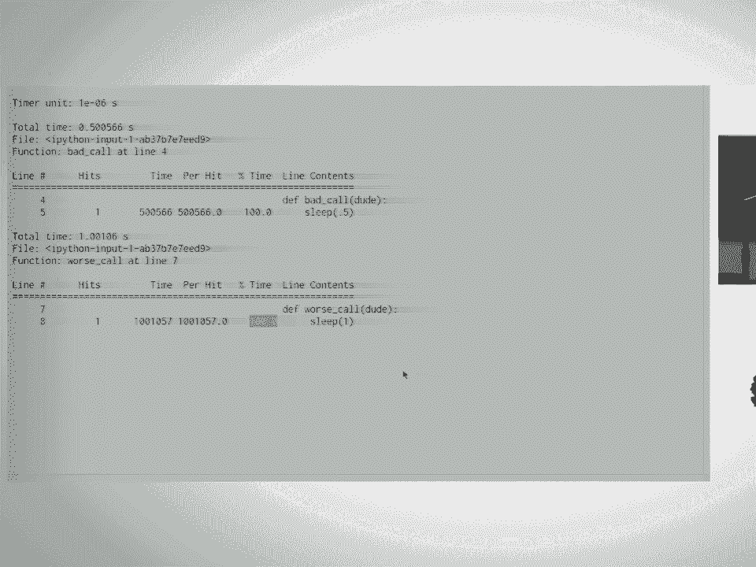
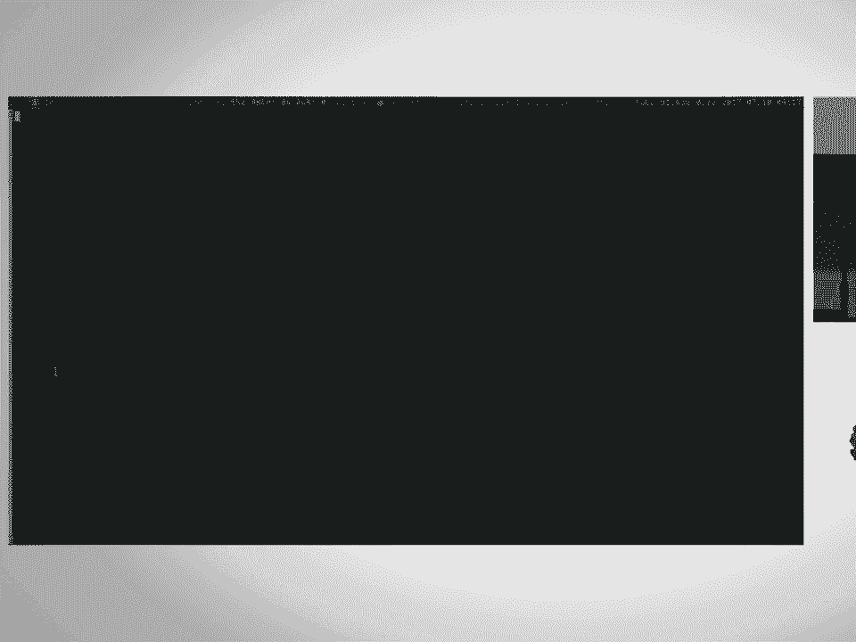
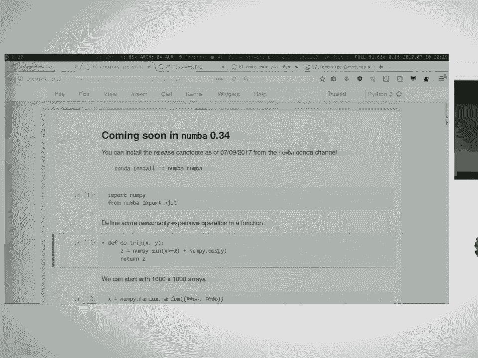

# 7：Numba - 告别C++ 📚

在本课程中，我们将学习如何使用Numba来加速Python代码，特别是数学密集型运算。我们将从性能分析开始，逐步探索Numba的JIT编译、不同编译模式、向量化操作以及并行计算。

---

## 概述

Numba是一个针对Python的即时（JIT）编译器。它利用LLVM将Python代码编译为高度优化的机器码，并与科学计算栈（如NumPy）良好集成。Numba主要针对数学运算进行优化，可以显著提升代码性能，而无需重写为C++或Fortran。

---





## 性能分析 🔍

在优化代码之前，首先需要识别性能瓶颈。性能分析帮助我们了解代码中哪些部分运行缓慢，从而有针对性地进行优化。

以下是三种常用的性能分析工具：

1.  **cProfile**：Python内置的性能分析器，提供函数级别的调用次数和时间统计。
2.  **line_profiler**：行级性能分析器，显示函数中每一行代码的执行时间。
3.  **timeit**：用于测量小段代码执行时间的工具，适合快速基准测试。

使用这些工具可以准确找到代码中的热点，避免在不重要的部分浪费时间。

---

## Numba JIT 编译器 ⚡

上一节我们介绍了性能分析，本节中我们来看看如何使用Numba的JIT编译器来加速代码。

Numba的核心功能是通过`@jit`装饰器将Python函数编译为机器码。编译过程在函数首次运行时自动进行。

### 基本用法

以下是一个计算数组元素和的简单函数：

```python
def array_sum(arr):
    total = 0.0
    for i in range(arr.shape[0]):
        for j in range(arr.shape[1]):
            total += arr[i, j]
    return total
```

使用`@jit`装饰器加速：

```python
from numba import jit

@jit
def array_sum_numba(arr):
    total = 0.0
    for i in range(arr.shape[0]):
        for j in range(arr.shape[1]):
            total += arr[i, j]
    return total
```

### 性能对比

使用`timeit`比较加速效果：

```python
import numpy as np
arr = np.random.rand(300, 300)

%timeit array_sum(arr)       # 原始版本
%timeit array_sum_numba(arr) # Numba加速版本
```

Numba版本通常可以获得数十倍甚至上百倍的性能提升。

---

## 编译模式：对象模式 vs. nopython模式 🛠️

Numba有两种编译模式：对象模式（object mode）和nopython模式。nopython模式能提供最佳性能，但要求代码完全由Numba支持的操作组成。

### 对象模式

当代码包含Numba无法优化的操作（如字符串拼接）时，会自动回退到对象模式。对象模式速度较慢，因为它需要依赖Python对象系统。

### nopython模式

使用`@jit(nopython=True)`或`@njit`装饰器强制启用nopython模式。如果代码中有不支持的操作，Numba会抛出错误。

```python
from numba import njit

@njit
def add_numbers(a, b):
    return a + b  # 支持数值类型

# @njit
# def add_strings(a, b):
#     return a + b  # 字符串操作会引发错误
```

### 类型推断

Numba在编译时会推断输入和输出的数据类型。使用`inspect_types()`方法可以查看编译后的类型信息。

```python
add_numbers.inspect_types()
```

---

## 实战应用：N体问题模拟 🌌

现在我们将Numba应用于一个更实际的场景：模拟N体问题中的直接求和计算。这是一个计算密集型问题，涉及所有粒子对之间的相互作用。

### 原始实现

使用Python类和列表实现：

```python
class Particle:
    def __init__(self, x, y, z, mass):
        self.x = x
        self.y = y
        self.z = z
        self.mass = mass
        self.potential = 0.0

def direct_sum(particles):
    for i, target in enumerate(particles):
        for j, source in enumerate(particles):
            if i != j:
                dist = ((target.x - source.x)**2 +
                        (target.y - source.y)**2 +
                        (target.z - source.z)**2)**0.5
                target.potential += source.mass / dist
```

### 使用Numba优化

由于Numba不能直接优化类方法，我们需要将数据结构转换为NumPy数组，并使用自定义dtype来保持代码可读性。

```python
import numpy as np
from numba import njit

particle_dtype = np.dtype([
    ('x', np.float64),
    ('y', np.float64),
    ('z', np.float64),
    ('mass', np.float64),
    ('potential', np.float64)
])

@njit
def distance(p1, p2):
    return ((p1['x'] - p2['x'])**2 +
            (p1['y'] - p2['y'])**2 +
            (p1['z'] - p2['z'])**2)**0.5

@njit
def direct_sum_numba(particles):
    n = len(particles)
    for i in range(n):
        for j in range(n):
            if i != j:
                dist = distance(particles[i], particles[j])
                particles[i]['potential'] += particles[j]['mass'] / dist
```

通过这种优化，通常可以获得数十倍的性能提升。

---

## 高级主题：向量化与并行计算 🚀

Numba的`vectorize`装饰器可以将标量函数转换为处理数组的通用函数（ufunc），并支持自动并行化。

### 创建向量化函数

```python
from numba import vectorize
import math

@vectorize(['float64(float64, float64)'])
def trig_func(a, b):
    return math.sin(a)**2 * math.exp(b)

# 现在可以处理数组
result = trig_func(np_array_a, np_array_b)
```

### 并行执行

通过设置`target='parallel'`，Numba会自动并行化向量化函数的执行。

```python
@vectorize(['float64(float64, float64)'], target='parallel')
def trig_func_parallel(a, b):
    return math.sin(a)**2 * math.exp(b)
```

对于循环结构，也可以使用`@jit(parallel=True)`尝试自动并行化。

```python
@jit(parallel=True)
def parallel_sum(arr):
    total = 0.0
    for i in range(arr.shape[0]):
        for j in range(arr.shape[1]):
            total += arr[i, j]
    return total
```

---



## 总结

在本课程中，我们一起学习了：

1.  **性能分析的重要性**：使用cProfile、line_profiler和timeit识别代码热点。
2.  **Numba JIT编译**：通过`@jit`装饰器显著加速数学运算。
3.  **编译模式**：理解对象模式与nopython模式的区别，并强制使用nopython模式以获得最佳性能。
4.  **实战优化**：将面向对象的代码重构为使用NumPy数组和Numba兼容的循环，以解决N体问题。
5.  **向量化与并行**：使用`vectorize`创建通用函数，并利用并行目标进一步提升大规模数据处理的性能。

Numba是一个强大的工具，它让Python开发者能够在保持开发效率的同时，获得接近原生代码的性能。通过本课程介绍的技术，你可以有效地优化计算密集型任务，无需依赖C++或Fortran。