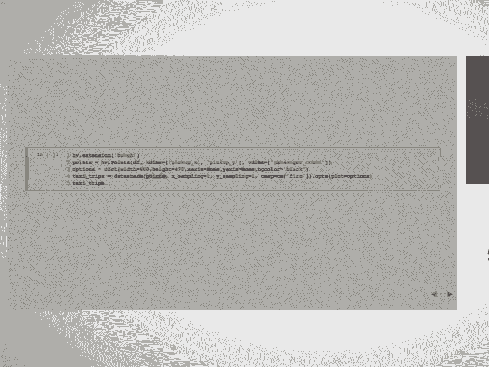
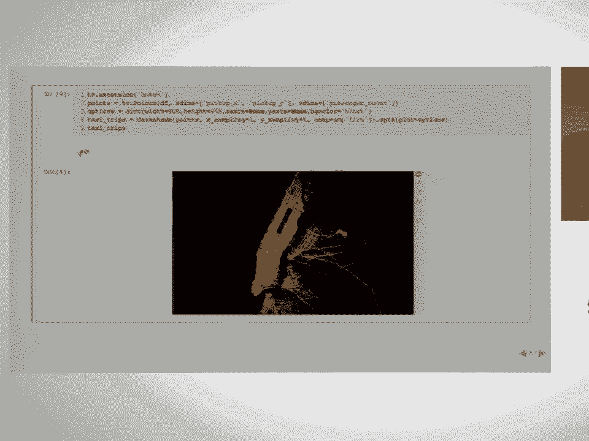
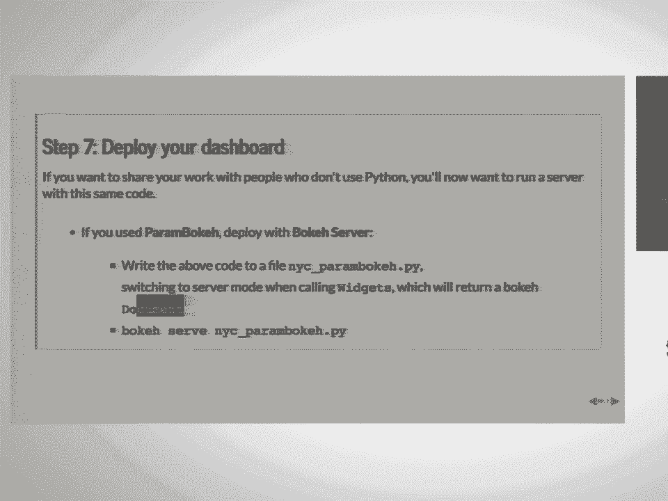
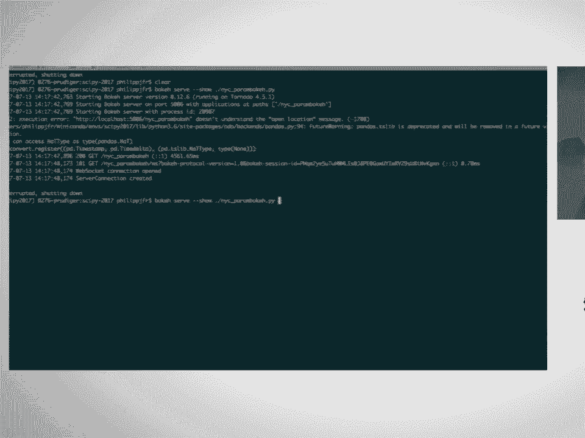
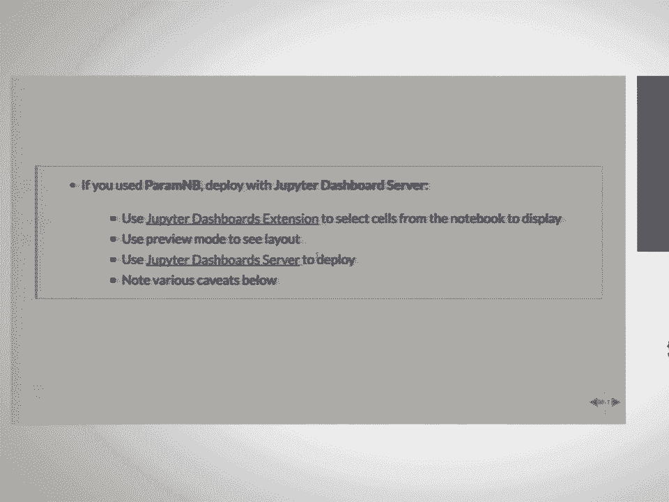
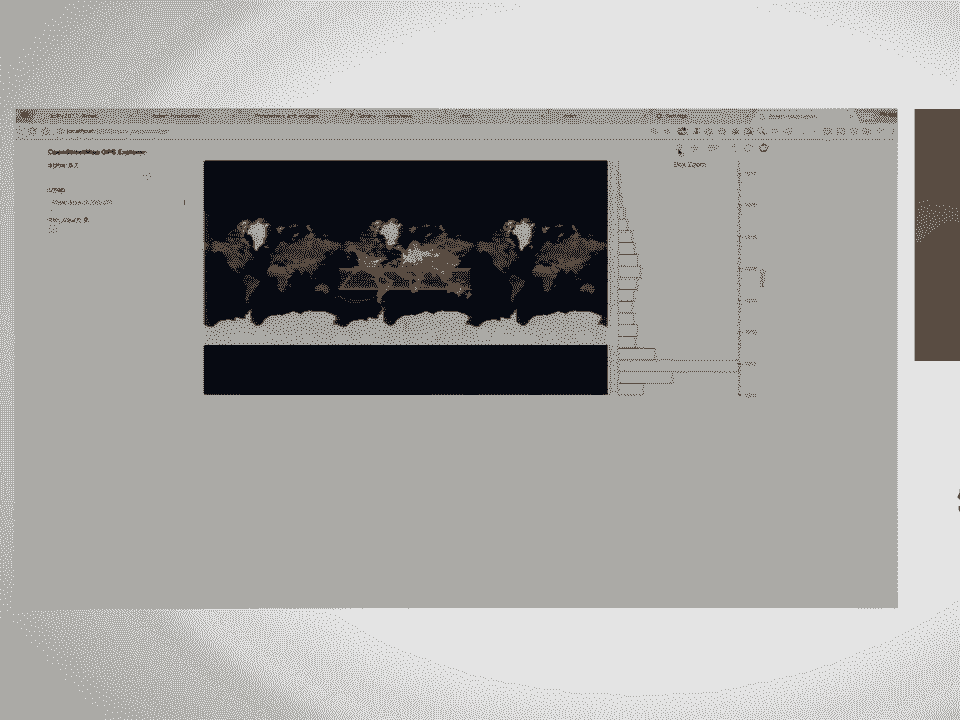
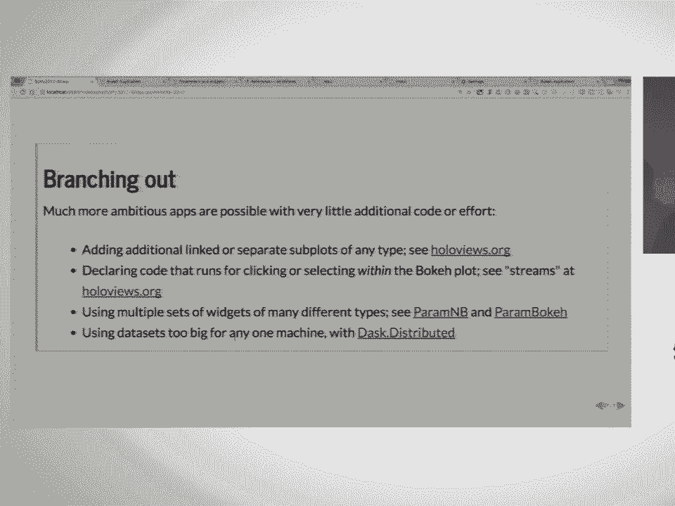
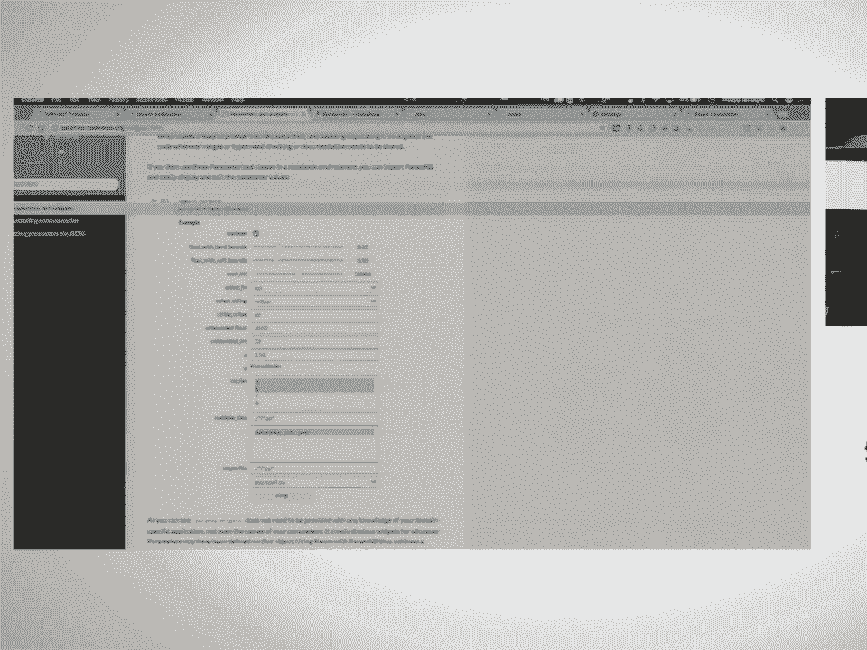

# 8：使用交互式 Jupyter 仪表板可视化数亿数据点 📊

在本节课中，我们将学习如何使用一系列 Python 库，通过大约 30 行代码，构建一个能够交互式可视化数亿乃至十亿数据点的仪表板。我们将从加载数据开始，逐步完成数据可视化、参数声明、控件绑定，最终部署为一个独立的应用程序。

---

## 第一步：获取数据 📥

我们首先需要获取数据。本节课将使用纽约出租车数据集的一个子集，其中包含约 1200 万个数据点。数据以 Parquet 格式存储，我们将使用 Dask 库将其加载到内存中。

以下是加载数据的代码：

```python
import dask.dataframe as dd

# 从磁盘加载数据
df = dd.read_parquet('nyc_taxi_data.parquet')
# 将数据持久化到内存
df = df.persist()
```

加载过程大约需要两秒钟。数据包含五列：乘客数量、上车地点的 X 和 Y 坐标，以及下车地点的 X 和 Y 坐标。

---

## 第二步：在笔记本中构建原型图 📈

现在数据已加载到内存中，我们开始进行探索性可视化。为此，我们将使用 HoloViews 库。HoloViews 提供了一套简单、声明式的方法来为数据添加可视化注释，并包含一个庞大的元素库，每个元素都有其对应的视觉表现形式。

然而，我们的数据量（1200 万个点）太大，无法直接发送到浏览器进行渲染。因此，我们需要先使用 Datashader 库对数据进行栅格化处理。

以下是可视化数据的代码：

```python
import holoviews as hv
from holoviews.operation.datashader import datashade
hv.extension('bokeh')

# 将数据包装为点元素
points = hv.Points(df, ['pickup_x', 'pickup_y'], 'passenger_count')
# 设置绘图选项
plot_opts = dict(width=600, height=400, bgcolor='black', show_grid=False)
# 应用 Datashader 进行栅格化，并指定色彩映射
shaded = datashade(points, cmap='viridis').opts(**plot_opts)
shaded
```

执行这段代码后，我们在一秒内就能得到一个交互式图表。缩放或平移时，图表会根据新的坐标轴范围重新进行栅格化渲染。

---

## 第三步：将数据置于地理背景中 🗺️

为了更直观地理解数据的地理位置，我们可以将可视化结果叠加在地图底图上。HoloViews 的地理扩展库 GeoViews 可以方便地集成在线地图瓦片服务。





以下是添加地图背景的代码：

```python
import geoviews as gv
gv.extension('bokeh')

# 声明一个地图瓦片源
tiles = gv.tile_sources.OSM()
# 将出租车数据点叠加在地图上
overlay = tiles * shaded
overlay
```

现在，我们的数据点就显示在真实的网络地图上了，并且所有交互功能（如缩放、平移）依然保持流畅。

---

## 第四步：声明控制可视化的参数 ⚙️

为了能动态定制可视化效果，我们需要声明一些参数。这里使用 `param` 库，它可以让我们清晰地表达参数的意图、类型、取值范围和默认值等。

我们创建一个名为 `NYCTaxiExplorer` 的类，并为其添加一些参数：

```python
import param

class NYCTaxiExplorer(param.Parameterized):
    # 透明度参数，范围 0 到 1
    alpha = param.Number(default=0.5, bounds=(0, 1))
    # 选择可视化上车点还是下车点
    column = param.ObjectSelector(default='pickup', objects=['pickup', 'dropoff'])
    # 选择色彩映射
    cmap = param.ObjectSelector(default='viridis', objects=['viridis', 'plasma', 'inferno'])
    # 选择乘客数量范围
    passengers = param.Range(default=(1, 4), bounds=(0, 10))
```

创建这个类后，我们就可以像访问普通属性一样访问这些参数。`param` 库会自动进行类型和范围校验。

---

## 第五步：将参数链接到可视化 🔗

接下来，我们需要将上一步声明的参数与我们的可视化图表连接起来。我们在 `NYCTaxiExplorer` 类中添加一个方法，根据参数值动态生成视图。

以下是链接参数与可视化的方法：

```python
class NYCTaxiExplorer(param.Parameterized):
    # ... 参数定义同上 ...

    def make_view(self, x_range=None, y_range=None):
        # 根据选择的列（上车/下车）筛选数据点
        current_points = hv.Points(self.df, [f'{self.column}_x', f'{self.column}_y'])
        # 根据乘客数量范围筛选
        filtered_points = current_points.select(passenger_count=self.passengers)
        # 应用 Datashader，并设置当前参数（如透明度、色彩映射）
        shaded = datashade(filtered_points, cmap=self.cmap, alpha=self.alpha)
        # 叠加地图瓦片
        return gv.tile_sources.OSM() * shaded
```

现在，每当我们更改参数并调用 `make_view` 方法时，返回的可视化结果都会反映这些更改。

---

## 第六步：添加控件以交互控制图表 🎛️

我们希望用户界面上的控件（如滑块、下拉菜单）能够实时控制图表。`param` 库有对应的 UI 扩展，可以自动将参数转换为控件。

首先，我们可以使用 `paramnb` 库（基于 IPyWidgets）在 Jupyter 笔记本中生成控件：

```python
import paramnb
# 创建类实例
explorer = NYCTaxiExplorer()
# 生成控件
widgets = paramnb.Widgets(explorer)
widgets
```

然而，Jupyter Dashboard Server 已不再维护。因此，我们更推荐使用基于 Bokeh 的 `panel` 库（原名 param-bokeh），它能够生成 Bokeh 控件并支持部署为独立应用。

使用 `panel` 生成控件的代码类似：

```python
import panel as pn
pn.extension()
# 创建控件
widgets = pn.widgets.WidgetBox.from_param(explorer.param)
widgets
```

这些控件与我们的参数对象是双向绑定的，移动滑块或选择下拉选项会立即更新参数值。

---

## 第七步：创建动态地图并部署为仪表板 🚀

最后一步是将控件和动态更新的图表结合起来。HoloViews 的 `DynamicMap` 对象可以接受一个回调函数（即我们的 `make_view` 方法）和一组“流”（streams）。当流的值（例如参数值或视图范围）发生变化时，它会自动调用回调函数来更新图表。

以下是创建动态仪表板的代码：



```python
from holoviews.streams import Params, RangeXY



# 将参数和视图范围定义为流
param_stream = Params(explorer.param, ['alpha', 'column', 'cmap', 'passengers'])
range_stream = RangeXY(source=overlay) # 捕获图表的可视范围

# 创建动态地图
dmap = hv.DynamicMap(explorer.make_view, streams=[param_stream, range_stream])

# 使用 panel 进行布局：左侧放控件，右侧放动态地图
dashboard = pn.Row(widgets, dmap)
dashboard
```



现在，一个完整的交互式仪表板就构建完成了。更改任何控件，图表都会实时更新。缩放图表时，`RangeXY` 流会捕获新的视图范围并触发重绘。



为了部署为独立的 Bokeh 应用，我们可以将上述代码保存到一个脚本文件中，并使用 `panel` 的服务器模式：

```python
# 在脚本中，例如 app.py
import panel as pn
pn.extension()
# ... 重复上述仪表板构建代码 ...
# 将仪表板转换为可服务的 Bokeh 文档
app = dashboard.servable()
```

然后可以通过命令 `panel serve app.py` 来启动一个独立的 Web 服务器。

---

## 扩展与未来工作 🔮

上一节我们完成了基础仪表板的部署，本节我们来看看可以如何扩展以及未来的发展方向。

**扩展可视化类型**：HoloViews 支持多种图表元素（如曲线、散点图、热图），它们都能与 Datashader 和 Bokeh 后端协同工作。

**更多参数与控件类型**：`param` 库支持丰富的参数类型（如文本、字典、布尔开关、多选下拉框），`panel` 库能据此生成对应的复杂控件。



**处理更大规模数据**：对于超过单机处理能力的数据（例如本节课后面演示的包含 10 亿个 OpenStreetMap GPS 点的数据集），可以结合 `Dask.distributed` 将计算分布到集群上。

**未来开发方向**：团队正在积极开发 `panel` 库，以提供更灵活的布局选项，并致力于完善基于 Bokeh 服务器的部署体验，以期未来能替代旧的 Jupyter Dashboard Server 的拖放布局功能。

---

## 总结 📝

在本节课中，我们一起学习了构建高性能交互式数据仪表板的完整流程：
1.  使用 **Dask** 高效加载大规模数据。
2.  利用 **HoloViews** 进行声明式数据标注和构图。
3.  通过 **Datashader** 对海量数据进行实时栅格化渲染。
4.  使用 **GeoViews** 添加地理上下文背景。
5.  通过 **param** 库声明和管理控制参数。
6.  借助 **panel** 库将参数自动转换为 UI 控件，并构建交互逻辑。
7.  最终将所有组件集成为一个可通过 **Bokeh 服务器** 部署的独立应用。



这套工具链使得用少量代码探索和展示超大规模数据集成为可能，并保持了良好的交互性能。