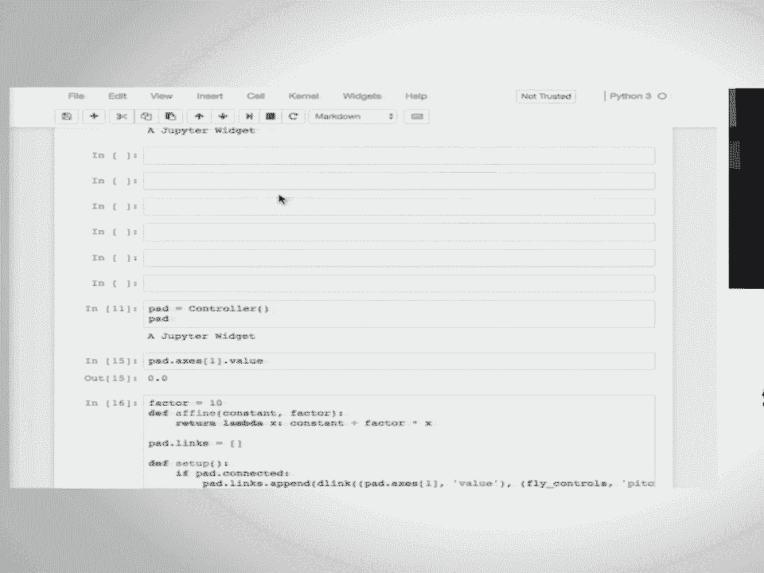

# 10：Jupyter交互式控件生态系统 🎛️

在本课程中，我们将学习Jupyter交互式控件（Widgets）的核心概念、使用方法以及如何利用它们来创建高度交互的数据分析和可视化工作流。我们将从基础概念开始，逐步深入到控件创建、样式布局、事件处理，并最终探索基于此生态系统的强大可视化库。

## 概述：控件的核心理念 💡

我的名字是Matt Craig，我在明尼苏达州立大学物理与天文学系任教。今天和我一起的还有Jason Grout（在Bloomberg工作）和Sylvain Corlay（在Quantstack工作）。我们还有几位助手：Mark和Paul。

首先，请确保您获取了教程Notebook的最新版本。如果打开索引文件时，顶部从零介绍开始，那么您就拥有了最新版本。

控件的核心理念是让Notebook中的交互式计算变得更加互动。为了说明这一点，我们来看一个非常简单的例子：计算一个数的平方。

最初，我们可能通过手动输入 `9 * 9` 来计算。然后为了探索，我们尝试 `10 * 10`，`11 * 11`。虽然我们开始注意到一些模式，但反复输入数字变得非常繁琐。

因此，工作流中的下一步通常是编写函数来自动化这个过程。我们可以定义一个打印数字平方的函数 `f(x)`。这样，工作流就变成了 `f(9)`，`f(10)`，`f(11)`。这比之前快了一些，但仍然不够快。

原因在于，当我们执行代码时，整个流程的瓶颈在于“输入代码”这个环节。特别是对于简单的工作流，输入占用了大量时间。不仅如此，输入行为还会将你从分析数据和思考问题的高层次认知中拉下来，陷入打字的机械操作中。当你得到输出后，又需要重新回到高层次去理解结果的意义。这种上下文切换带来了摩擦，降低了效率。

Notebook和内核并没有拖慢我们，是我们自己（的输入界面）拖慢了自己。这正是控件大放异彩的地方。我们想要让这个循环变得和你思考一样快，而不是和你打字一样快。

IPython控件提供了一个简单的 `interact` 函数。例如，`interact(f, x=(0, 100))`。执行后，一个GUI控件会自动为我们创建。当我们改变这个控件时，函数会自动在每次参数值变化时运行。这样，我就可以非常快速地探索参数空间（81， 100），真正地以思考的速度来解决问题。这就是IPython控件的天才之处和应用场景。

我们拥有许多不同类型的控件。如果系统没有自动猜测出合适的控件类型，你可以创建特定的控件，例如一个浮点数滑块。你可以精确控制我们构建的控件类型。实际上，我们展示的控件共享同一个模型，但可以多次显示，并且它们是链接在一起的。这只是同一个控件的两个不同视图。

我们可以在后端（内核端）询问控件的值。例如，我可以从用户那里获取输入，然后从Python端询问那个值是什么。我也可以基于该值的变化来触发其他操作。每当滑块变化时，我可以运行任何想要的Python代码。

我还可以将两个控件链接在一起。例如，将文本框与滑块链接，当我移动滑块时，文本框会自动更新。

随着课程的深入，我们会更详细地探讨这些内容。这里只是对控件的一些能力和核心理念做一个简要概述。

控件不仅仅是我们提供的一套控件（如滑块、文本框等），它更是一个在Notebook中编写交互式控件的框架。基于此，有许多库（如BQplot、ipyleaflet、pythreejs、ipyvolume等）使用相同的基础设施来提供和构建交互式控件。

这些库提供了自定义控件：BQplot用于2D图表，ipyleaflet用于构建可交互的地图，pythreejs用于3D绘图，ipyvolume也用于3D绘图。同样，这些库中的每一个元素都是用户可以与之交互的，并且会将消息发送回内核，让内核端的代码响应用户的交互。

重申一下，核心理念是：我们希望让你的计算保持在高级别，并消除繁琐的输入过程。同时，我们也希望提供一个框架，让人们能够编写任意复杂度的GUI控件，并将它们连接到Python端，这样你就可以在Notebook端与高级控件交互，而Notebook端的任何交互都会自动发送到Python端，在那里函数可以运行，你可以调查用户的操作，并基于前端的用户交互触发任何类型的操作。这是一个非常强大的库。

接下来，让我们进入 `interact` 函数的介绍部分。

## 第一部分：`interact` 函数入门 🚀

上一节我们介绍了控件的核心理念，本节中我们来看看最常用的控件生成函数 `interact`。

首先，让我们了解一下听众的背景。有多少人以前使用过Notebook？很好，几乎是所有人。有多少人使用过控件？哦，太棒了。有多少人编写过控件？我们甚至有一些这样的人，在讲到更复杂的部分时，我们可能会请你帮助周围的人。有多少人可以说你广泛地使用过控件？好的。有多少人主要使用过 `interact`？有多少人实际使用过控件本身（即不是通过 `interact`，而是直接构建浮点滑块并连接等）？好的，我们对听众有了更好的了解。

当你想要使用控件时，首先要问自己的问题是：是否需要自己编写任何控件代码。`interact` 提供了一种无需编写太多控件代码就能生成控件的方法。

让我们跳转到相应的Notebook。索引中的概述部分包含了一些我们在介绍中提到的包的引用和链接。

如果我们切换到 `interact` 笔记本，我希望大家花几分钟时间，完成笔记本中的内容，直到到达“使用 `fixed` 固定参数”这一部分。

看起来几乎每个人都使用过Jupyter Notebook，按 Shift+Enter 可以执行单元格中的代码。前几个单元格将定义一个函数，并引导你了解使用 `interact` 可以生成的不同类型的控件。

请大家花几分钟时间完成这个部分。当你到达“使用 `fixed` 固定参数”这一点时，请在你的电脑上贴一张便签，以便我们了解大家的进度。

当你到达这个标题“使用 `fixed` 固定参数”时，请在你的电脑上贴上便签，让我们知道你到达了那里。

好的，我们都到了。正如你所看到的，生成的控件类型由参数的类型决定。如果你提供了一个默认参数，并且你有一个带有几个变量的函数，希望其中一个生成控件，另一个保持固定，请使用 `fixed`。

例如，我教宇宙学课程时，有一个使用 `interact` 的例子，他们将宇宙的宇宙学模型拟合到超新星数据，在某个阶段，固定哈勃常数的值会很有用。

到目前为止，我们所做的实际上是一种生成控件的简写方式。当你将 `x=10` 作为关键字参数输入函数时，IPython控件在底层会将其转换为一个整数滑块，最小值为你输入值的负数，最大值为该值的三倍，步长为1。如果你愿意，你也可以显式地提供滑块，我们稍后会讲到这一点。

下一个笔记本（可能是接下来的几个）将逐一介绍所有的控件。为了方便参考，我们提供了一个表格，列出了几种不同的参数输入方式，以及每种参数类型会被转换成什么类型的控件。

现在，让我们继续完成笔记本，直到“禁用连续更新”部分。同样，如果你已经到达那里，请放下你的标志（便签），完成后再把标志拿起来。当我们到达那一点时，我会看看你们是否有任何问题。

我们将在接下来的几个笔记本中继续解决安装问题。

你可能已经注意到，在尝试使用 `interact` 滑块时，它们往往会闪烁。让我向上跳转几个单元格。我定义的函数将其输入值乘以三。所以当苹果变成三时……（开个玩笑，我是老师，我喜欢人们带苹果来）。

让我们向下滚动到绘图部分。根据你的笔记本电脑性能，闪烁现象可能会很明显，或者即使不闪烁，也会相当滞后。

有几种方法可以禁用连续更新。你可以做的两件事是：一是添加一个按钮，这样直到用户按下按钮时，`interact` 才会运行。你可以使用 `interact_manual` 或 `interactive` 来实现。使用 `interactive` 的语法有点特别，你必须将一个字典作为第二个参数传递给 `interactive`，其中包含特定的键值对，但效果是一样的。

你也可以在滑块上设置 `continuous_update=False`。如果你这样做，那么在你松开滑块之前什么都不会发生。这样做的好处是使浏览器中的动画看起来更流畅。缺点是，如果你正在使用类似的功能让某人探索线条斜率变化时如何变化，拥有交互性是非常好的。在这个具体案例中，如果我试图优化，我可能会在斜率中添加一个步长，这样在我拖动滑块时就不会经历那么多变化。

这里有一个简短的练习。关于使用 `interactive`（它会生成一个存储在变量中的控件对象，而不是像 `interact` 那样直接显示）的一个好处是，你可以在Notebook后面修改这个控件。所以这里的任务是修改这个交互式绘图，使得滑块只在松开时才更新。我已经为你修改了其中一个滑块，请填写第二个。给你大约一分钟时间，这应该不需要很长时间。如果你仍然遇到安装问题，请举手，我们会提供帮助。

有人有问题吗？同样，一旦你更新了绘图控件，请在电脑上贴上便签。

好的，第二行代码很简单。我们只需修改第二个控件（即第二个滑块），然后更新就会按我们想要的方式工作。

这里有一个链接指向一个示例。我们不会深入探讨其他示例，但在IPython控件源代码仓库中，有几个使用 `interactive` 的其他示例。

现在，让我们继续学习控件的基础知识。这部分我将和大家一起过一遍。

## 第二部分：控件基础 📚

上一节我们学习了 `interact` 函数，本节我们来深入了解控件对象本身的基础知识。

和Notebook中的许多其他东西一样，控件有一个表示形式，允许它们直接显示在Notebook中。因此，你可以多次显示同一个控件。如果我拖动其中一个控件，另一个也会改变。这是因为在底层，在Python内核中，我有一个控件对象；在JavaScript中，也有该控件的模型。每当我显示这个控件时，我都是在生成同一个对象的另一个视图。你还可以使用 `close()` 方法关闭它们。

几乎所有的控件都有一个 `value` 属性。如果我拖动滑块，然后再次打印它的值，变量的值会反映出来。我也可以通过编程方式设置这个值。

对于每个控件，都有一个键的列表。这些是同步的属性，如果你设置它，会影响GUI；如果你改变GUI，控件的属性也会相应改变。不同控件之间的属性有所不同。稍后今天我们会向仓库中添加一个我整理的表格，该表格为每个控件类列出了包含哪些属性的矩阵。但几乎所有的控件都会有 `value` 属性（我们会在几个笔记本后遇到一个例外）。

你可以在初始化控件时设置其值，也可以在之后设置（我们上面做了一个例子）。

有几种不同的链接控件的方法。你可以在Python端使用 `link` 链接，也可以在JavaScript端使用 `jslink` 链接。在这个特定的例子中，我们使用的是 `jslink`，我们稍后会再讨论这两者之间的区别。

我更新滑块，文本框移动；如果我在文本框中输入，滑块移动。如果你创建了一个链接后又想断开它，你可以这样做。现在它们又是独立的控件了。

这为接下来几个小时我们要做的事情奠定了基础：逐一学习控件列表，学习如何组合控件。我们将不再使用 `interact`。

现在让我们继续学习控件列表。

## 第三部分：控件列表 📋

上一节我们介绍了控件的基础属性，本节我们将系统地浏览所有可用的控件类型。

与其我读给你听，不如让你花大约十分钟时间自己运行一遍控件列表。如果你完成得很快，下面有几个练习建议。大约五到十分钟后，我会打断你们，因为中间有几件事我想讨论一下。但我认为让你了解不同对象是什么的最快方法就是亲自尝试一下。

所以开始运行吧。

关于单选按钮示例的问题：描述在样式笔记本中被截断了，我们接下来会讨论这个问题。默认情况下，标签有固定的宽度，这样如果你使用相对较短的标签，一切都会对齐得很好。但如果你想要更长的标签，也是可以的。

还有其他问题吗？

关于图标列表的问题？我稍后会把它加进去。

其他问题？

我想再花一两分钟在这个上面。看起来还不是每个人都完成了。如果你能快速执行完剩下的单元格。

关于DOM更新导致的闪烁问题？看起来像是空白，没有数字，所以看起来是向上的。这意味着你可以告诉DOM不要更新。你可以关闭模型中的某些东西。是的，这是后台的MOP之一。

好的，我想提醒大家注意控件列表中的几件事。

一是字符串有几种不同的表示方式。`Text` 和 `Textarea` 都用于输入，唯一的区别是你可以输入字符的空间大小。`Label` 最初是作为一种在控件上编写自定义描述的方式。所以，如果你的控件描述被截断了，一种处理方法是组合一个 `Label` 控件和一个其他控件。

`HTML` 控件允许你显示格式化的文本，`Math` 和 `Label` 控件可以接受LaTeX并自动将其转换为排版方程。

`Output` 控件是版本7中相对较新的添加。它可以接受任何你可以在Notebook中显示的内容，并将其放入一个控件中。我们将在教程末尾看到一个例子，我使用它将别人编写的图像查看器嵌入到Notebook中。但本质上，任何你以前能在Notebook中显示的东西，有时要把它放进控件里有点麻烦，`Output` 控件为你做到了这一点。

随着我们继续，容器控件将变得很重要。当你编写自己的控件时，几乎总是从 `Box`、`HBox` 或 `VBox` 子类化，这取决于你想要的布局，并将你想要的部件放入那个盒子中。

还有其他问题吗？关于控件列表还有什么问题吗？

为什么有 `IntWidget` 和 `FloatWidget`，而不是只有一个 `NumericWidget`（无论是用于滑块还是文本框）？这实际上可能很快就会改变，以便拥有一个 `NumberWidget`。没有真正的原因，我可以说，主要是历史原因。它们基本上共享实现，不同之处在于读数格式的默认值，对于 `IntWidget` 不会去除任何数字。

`Box` 和 `HBox` 之间没有太大区别，我认为它们实际上是相同的。历史上，在早期版本的包中，`HBox` 和 `VBox` 实际上不是类，而是函数，它们返回一个实例，所以是有区别的。

接下来，我们……哦，Ty，请说。

关于进度条和其他一些元素，你可以设置 `bar_style`。对于浅蓝色的那个，`bar_style` 是 `'info'`；对于深蓝色的那个，没有设置 `bar_style`。如果你查看 `IntProgress`，它会列出你可以使用的不同样式。如果我把它从 `'info'` 改为 `'warning'`，我会得到黄色而不是浅蓝色。

其他问题吗？

是的，问题是：是否有所有可用样式的列表？对于像 `bar_style` 这样的特定样式，是否有选项列表？你可以检查控件。对于这个，`IntProgress` 的 `description` 是一个 trait 类型，可能有一个预定义的列表，所以这有点风险。实际上，那是 `bar_style`。你可以通过另一种方式获取。哦，它们以前是有效的。你只需将其设置为一个错误的值，它就会告诉你有效值是什么。我有一个尚未放入教程的笔记本，其中列出了哪些控件有哪些可用的样式。例如，对于一些滑块控件，有一个你可以设置的 `handle_color`。有几个控件具有这样的样式属性，原则上你可以用 Tab 键发现，但这……我已经基本整理好了表格，稍后我会把它添加到笔记本中。

我看到，所以让我们把它变成一个字符串。

继续前进。我们这里有一组练习。我们计划在10分钟后或2:30休息，所以你可能没有时间完成所有这些练习。对于每个练习，让我展示一件事。对于每个练习（除了最后一个），我们确实有示例解决方案。所以，如果你取消注释带有 `%load` 的那一行（它以 `%load` 开头），然后按 Shift+Enter，它会用我们的解决方案替换单元格中已有的内容。所以，如果你更喜欢直接加载解决方案看看它们是如何工作的，请继续这样做。如果你尝试了一段时间后卡住了，可以加载解决方案；或者如果你没有时间完成，想稍后再回来做，也可以这样做。

让我们花大约10分钟时间来做这些练习，我们会继续四处走动回答你们的问题。

实际上，我要再打断你们一次，因为昨天它让我困惑了好几次。在代码加载到单元格之后，你需要再次运行该单元格才能实际运行代码。

有些人，房间里的多个人，在安装时遇到了问题。问题是他们在用户环境中有一个预先存在的控件安装，并且他们进行了用户安装。实际上，用户安装对所有环境都是全局的，并且优先于你可能正在运行的任何环境，因此最终导致你的环境所需的JavaScript与你在浏览器中加载的JavaScript不匹配。所以，请永远不要使用 `--user` 或类似选项安装Notebook扩展。是的，用户安装是邪恶的，不要使用它。如果你曾经这样做过，并且你运行的是Linux或任何形式的Unix，你可以检查主目录下的 `~/.local/share/jupyter` 目录，并删除所有内容。这解决了很多麻烦。将来安装Notebook扩展或JupyterLab扩展时，一个好的建议是使用 `--sys-prefix` 参数将其安装到当前运行的环境中，这将使其成为该环境本地的。我认为这实际上应该成为默认设置，并且可能会在Jupyter的下一个版本中成为默认设置。

问题是：如果我想在多个环境中安装同一套Notebook扩展和控件扩展，该怎么办？我的回答是：不要这样做，而是在每个环境中分别安装它们。但你可以全局启用它们，使用 `--user` 会不那么邪恶。或者另一件事是定义一个环境，并让每个人都使用相同的清单，即声明你的环境的依赖项。

在我们短暂休息之前还有其他问题吗？

你能用装饰器禁用连续更新吗？你必须调用函数吗？答案是否定的，你不能使用装饰器，我想这就是答案。

让我们休息10分钟。现在我的时钟是2:33，所以我们将在2:43重新开始。走廊里应该有零食。

## 第四部分：样式与布局 🎨

上一节我们完成了控件列表的学习，本节我们将专注于控件的样式和布局，这是构建复杂界面的关键。

在开始之前，基于帮助房间里的人的经验，有几点注意事项。

第一，强烈、强烈、强烈建议你遵循当前的安装说明。特别是，在安装所有这些包之前创建一个新环境。我们在房间里看到的很多问题都与控件版本不正确或包未正确安装等有关。很多问题仅仅是因为没有遵循说明或遵循了旧的说明集。所以强烈建议你遵循说明创建一个新环境，并安装IPython控件的预发布版本等。

另一个注意事项是，你需要在 `widgets-2017` 环境中启动你的Notebook服务器。原因是Notebook服务器提供JavaScript，它与后端的IPython控件版本相匹配。你希望这个JavaScript是预发布版本的JavaScript。所以请在 `widgets-2017` 环境中启动Notebook服务器。

问题？假设你正在尝试创建一个广泛分发的Notebook，如何确保我们有正确版本的包等？是的，这是一个非常广泛的问题，关于如何确保你的目标受众安装了正确的软件等。我在学术环境中教学，你可能可以回答这个问题。当我在学术环境中时，你知道，在学年开始时，这是我们的环境，让每个人都设置到同一个环境，然后这就是我们全年坚持使用的环境。就像我们在这个教程中所做的一样：这是一套安装说明，使用这个。这就是我们测试的依据。关于分发还有其他意见吗？对我来说，问题在于我想做一次还是多次。如果是一次，`beta.mybinder.org` 或类似的服务可以让你设置一个云托管环境。我们设置一个