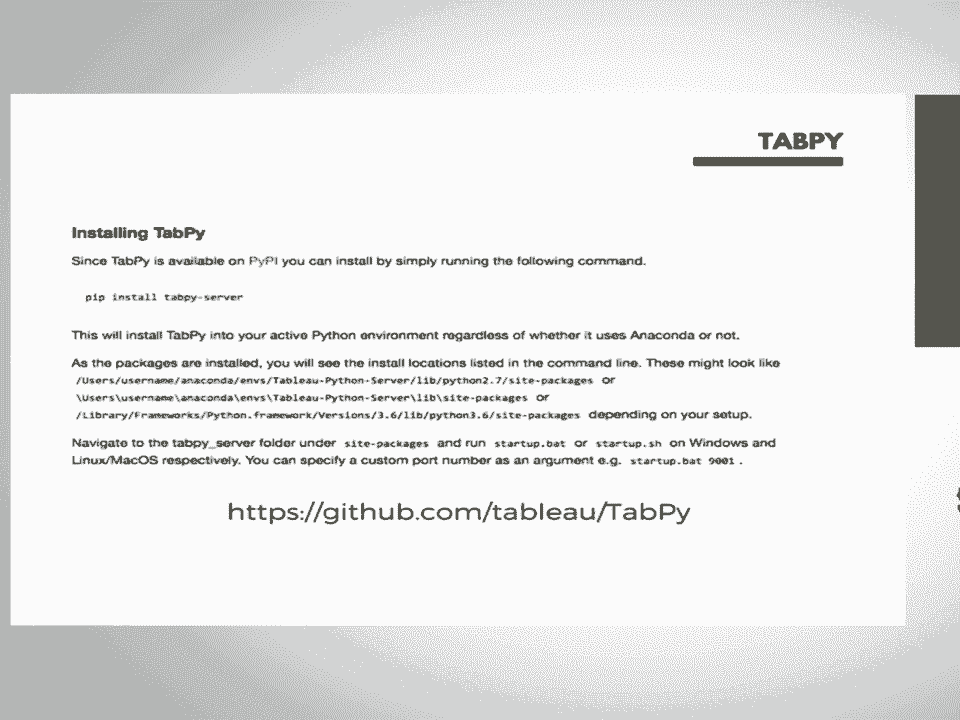
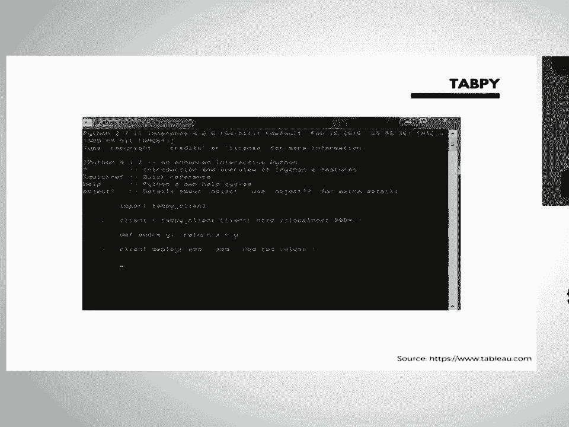
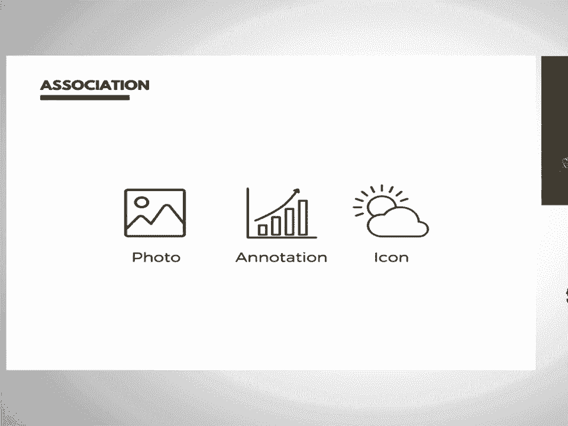
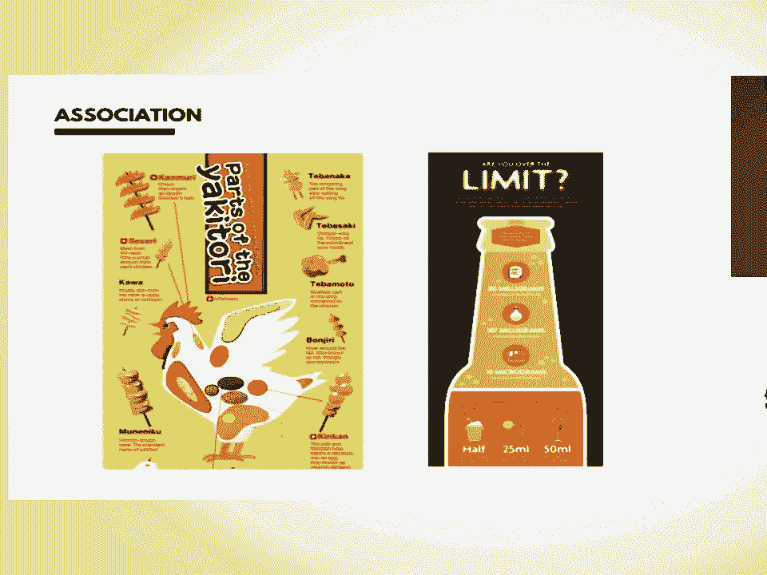
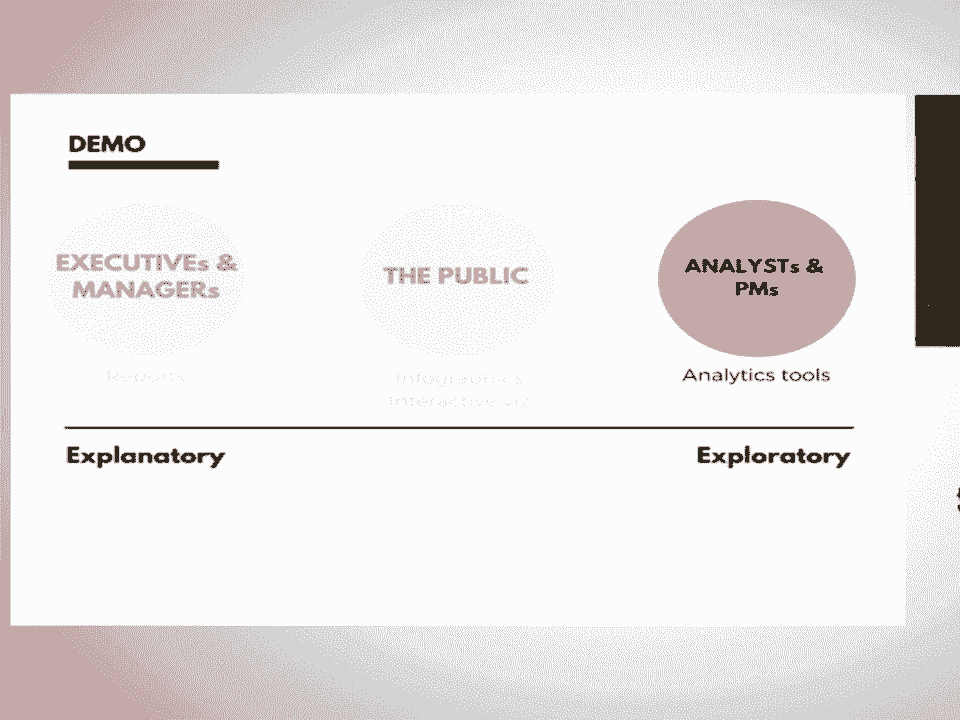
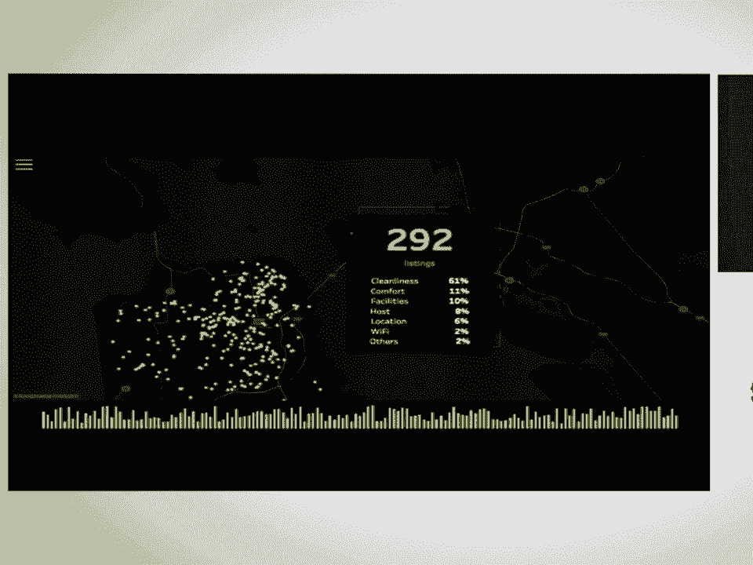
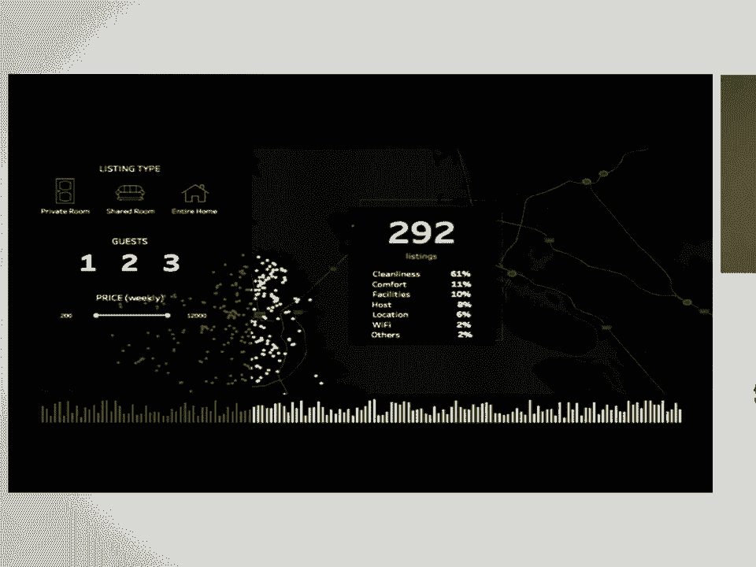

# 11：使用 Python 与 Tableau 构建交互式美观的数据可视化 📊

在本节课中，我们将学习如何结合 Python 的强大分析能力与 Tableau 的便捷可视化功能，来创建引人入胜且交互性强的数据报告。我们将重点介绍一个名为 **TabPy** 的工具，并探讨三个核心设计原则，以确保你的可视化作品能被用户反复使用。

---

## 引言：可视化面临的挑战

作为一名数据分析师，我热衷于创建数据可视化，以便利益相关者使用数据、理解数据并基于数据做出业务决策。

但有一件事一直让我感到困扰和沮丧。

我创建了许多数据可视化，希望我的利益相关者能参与其中并经常使用。但我也很好奇他们实际使用了多少次我的可视化报告。

当我查看服务器数据时，我注意到很多仪表板只有一次浏览记录。这意味着在我创建并分享可视化报告后，他们可能只使用了一次就再也没有回来。

因此，在本节课中，我将分享一些有趣的数据可视化技巧，帮助你创建真正具有吸引力的可视化作品，确保你的利益相关者会反复使用它。

---

## 第一部分：什么是 TabPy？🔗

上一节我们提到了创建可视化报告的挑战，本节中我们来看看一个能结合 Python 与 Tableau 优势的强大工具。

**TabPy** 本质上允许你在 Tableau 中非常方便地使用 Python。因此，你能够利用 Python 丰富的分析库来创建功能强大的可视化。

以下是几种常用可视化工具的优缺点分析：

*   **Python**：主要用于内部探索性分析，因为它拥有强大的分析库（如情感分析、聚类、机器学习）。它提供了出色的可视化库，如 `matplotlib`、`seaborn`、`Bokeh`。
    *   **优点**：分析能力强，库丰富。
    *   **缺点**：默认可视化样式可能不够美观；在 Jupyter Notebook 中创建的报告对非技术用户不够友好。
*   **D3.js**：常用于面向公众的可视化，因为它非常交互式、用户友好且视觉冲击力强。
    *   **优点**：交互性强，视觉效果好，体验类似网页。
    *   **缺点**：代码量大，创建简单图表也很复杂，不适合探索数据。
*   **Tableau**：介于两者之间。它是一个拖放式可视化工具，可以非常快速、轻松地创建可视化。
    *   **优点**：易于使用，创建速度快，界面对业务用户友好。
    *   **缺点**：分析功能相对较弱，数据准备能力有限。

Python 拥有强大的高级分析工具，而 Tableau 是进行数据可视化的便捷方式。**TabPy** 正是将这两大优势结合起来，允许你在 Tableau 内部使用 Python 库来创建可视化。

### TabPy 的工作原理

如果你熟悉 Tableau 界面，你可以在 Tableau 的计算字段中直接编写 Python 代码。代码会被传递到外部的 TabPy 服务器执行，并将输出结果直接返回给 Tableau。你不再需要在 Tableau 外部单独运行 Python。

**代码示例**：在 Tableau 计算字段中使用 Python 进行情感分析
```python
# 这是一个简单的Python代码片段，可在Tableau计算字段中运行
# 假设返回情感分析得分
return sentiment_score
```

此外，通过 TabPy，你还可以直接部署和调用机器学习模型。

**资源**：如果你对 TabPy 感兴趣，可以访问其 GitHub 页面获取安装和使用的详细文档：`github.com/tableau/TabPy`

---



## 第二部分：三大设计原则 ✨



现在你已经学会了如何创建功能强大的可视化，接下来我们看看如何设计出吸引人的可视化，让你的观众愿意反复使用。

我将介绍三个核心设计技巧：

1.  **属性**：使用哪些视觉属性来引导用户浏览信息。
2.  **受众**：如何识别正确的受众并为其选择合适的可视化类型。
3.  **关联**：使用哪些视觉线索来帮助用户记忆你的可视化。

### 1. 属性：引导用户注意力

当你在可视化中展示大量信息时，观众很难在一两秒内处理所有内容。

因此，你必须利用**前注意属性**来引导观众的注意力，让他们聚焦于你认为重要的部分，而不会被信息淹没。

以下是你可以使用的一些前注意属性：

*   **不同形状**
*   **不同色调**
*   **不同大小**

通过有策略地使用这些属性，你可以让观众轻松地注意到关键信息。

### 2. 受众：了解你的观众

创建数据可视化就像与朋友建立关系。你必须真正了解你的朋友，才能建立良好的关系。同样，你必须真正了解你的受众，才能为他们创建合适的数据可视化。

在工作场所，你需要为不同类型的受众创建可视化：

*   **高管和经理**：他们非常忙碌，没有太多时间处理数据。因此，创建**解释性可视化**至关重要，让他们能在一秒钟内获得你希望传达的见解或故事。这更像是静态报告。
*   **分析师和产品经理**：他们通常希望查看原始数据，与数据互动并进行探索。在这种情况下，你需要为他们创建更像**分析工具**的可视化。
*   **公众**：介于两者之间。你可以创建带有故事性的信息图，也可以创建高度交互的可视化供他们探索或获取灵感。

在创建可视化之前，必须考虑受众的类型。


### 3. 关联：利用视觉线索增强记忆


关联是可视化中一个非常重要的概念，它能帮助你记忆和识别可视化。

研究表明，在可视化中使用强烈的**视觉关联**可以极大地帮助人们记忆。

你可以在可视化中使用以下类型的视觉线索来增强关联性：

*   **照片**
*   **标注**
*   **趋势线**
*   **图标**

这些元素视觉冲击力强，易于让大脑关联和记忆。例如，在关于“鸡肉消费”的可视化中使用鸡肉的图片，在关于“酒精”的可视化中使用啤酒瓶的形状，都能让主题更容易被记住。

---

## 第三部分：实战演示 🚀

上一节我们介绍了三大设计原则，本节我们将通过两个实例，结合 TabPy 和这些原则来创建数据可视化。

我今天有两个例子：
1.  在 TabPy 中使用 Python 脚本查询数据。
2.  在 TabPy 中调用已部署的模型。



### 示例演示



本例的**受众**是 Airbnb 的产品经理。作为产品经理，他们希望提供更好的用户体验。因此，识别哪些房源持续获得较低的情感评分及其原因非常重要。基于此，我为他们创建了一个数据可视化来探索数据并发现问题。

在这个 Tableau 可视化中，我应用了设计原则：



*   **属性**：我使用了醒目的黄色来高亮显示有 292 个房源持续获得低情感评分，首先吸引观众的注意力。接着引导他们查看这些房源在旧金山地图上的位置分布，然后是底部显示情感评分随时间变化的柱状图（观察季节性），最后才是按原因细分的详细信息（用较小的白色区域表示）。
*   **关联**：在顶部，我使用了一些**图标**作为视觉关联，让用户可以轻松地识别和交互。
*   **交互**：我创建了适当的菜单，鼓励用户与数据进行更多互动和探索。

通过结合 TabPy 的计算能力和精心的设计，我创建了一个既能提供深度分析，又对用户友好、易于理解和记忆的可视化仪表板。

---



## 总结 📝



在本节课中，我们一起学习了：

1.  **TabPy 工具**：它如何桥接 Python 的分析能力与 Tableau 的可视化便捷性，让你能在 Tableau 内部直接运行 Python 代码。
2.  **三大设计原则**：
    *   **属性**：利用颜色、形状、大小等前注意属性引导用户视线。
    *   **受众**：根据受众类型（如高管、分析师、公众）选择创建解释性报告或探索性工具。
    *   **关联**：使用图片、图标等强烈的视觉线索，帮助用户更好地记忆和识别你的可视化。
3.  **实战应用**：看到了如何将这些原则与 TabPy 结合，为一个具体业务场景（分析 Airbnb 房源评价）构建交互式、有重点且易于记忆的数据仪表板。


希望你能将这些概念应用到自己的数据可视化项目中，创建出不仅功能强大，而且真正吸引人、能被用户反复使用的出色作品。