# 13：Python 中的并行数据分析 🚀

在本课程中，我们将学习 Python 中的并行编程。课程不会专注于某个特定工具，而是介绍通用的并行编程范式，帮助你理解在不同场景下应选择何种工具和范式。我们将从最简单的并行映射开始，逐步深入到更灵活的任务调度和大型数据集合处理。

---

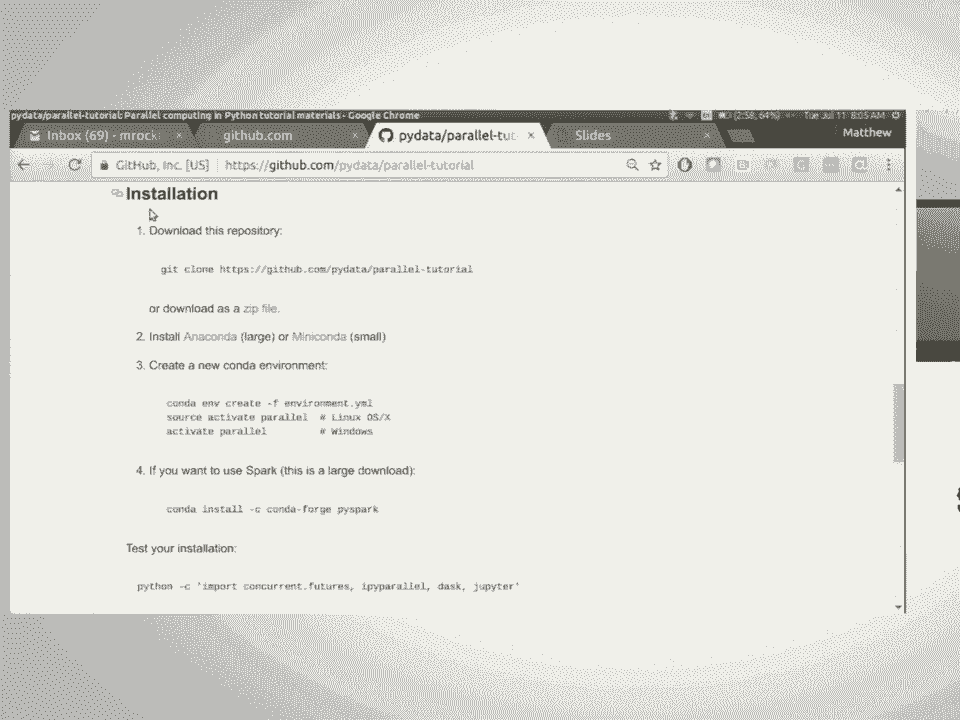

## 概述

大家好，欢迎来到并行数据分析教程。我是 Matthew Rocklin，这位是 Aaron Amadea，这位是 Ben Zaitlin。今天我们将一起探讨 Python 中的并行编程。

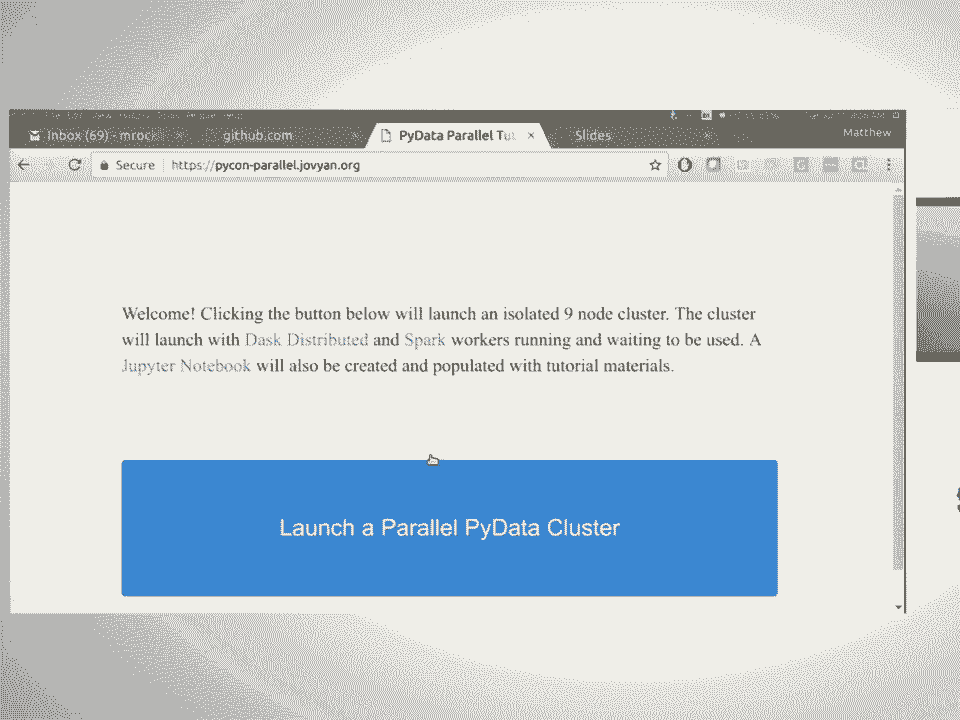

今天的教程不针对任何特定工具，而是关于通用的并行编程和 Python。我们将介绍几种不同的编程范式，帮助你理解在何种情况下应使用何种范式或工具。

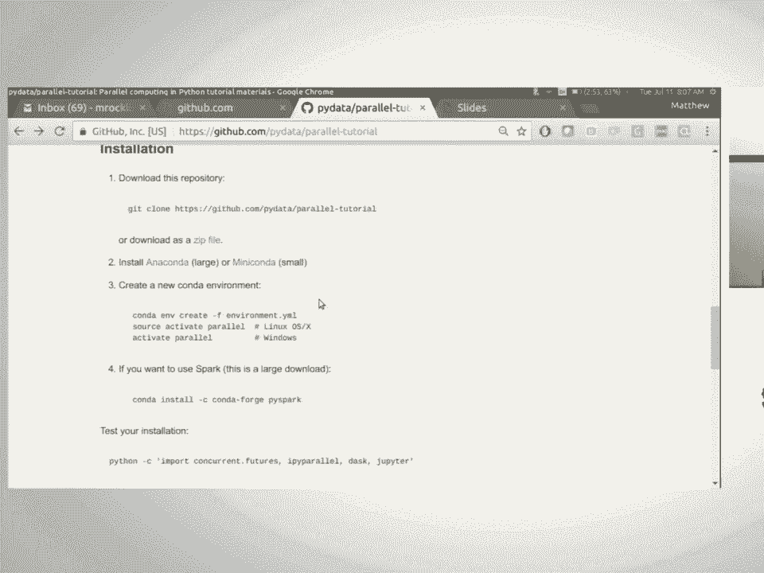

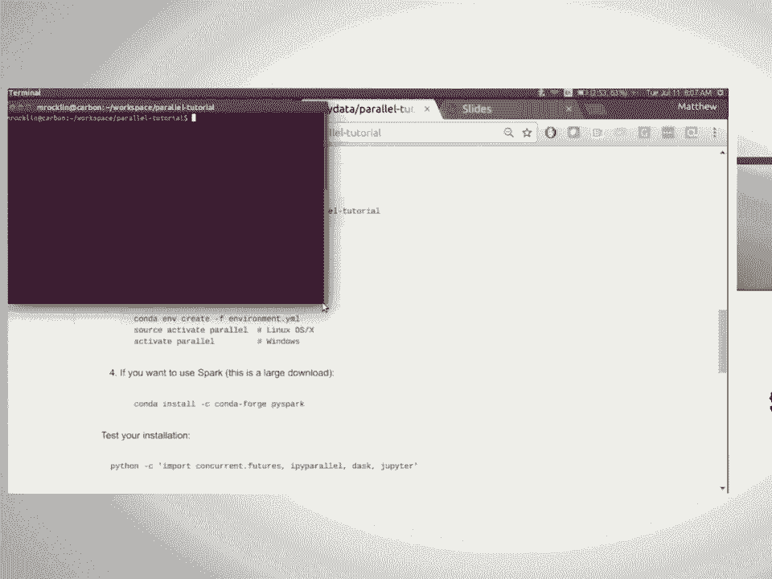

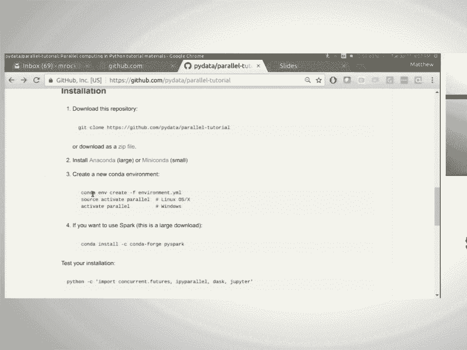

课程的前半部分主要在个人笔记本电脑上进行，后半部分我们将在 Google Cloud 上运行一个集群。首先由我讲解几个部分，然后由 Aaron 和 Ben 接手。如果你有任何问题，请随时举手示意，我们会提供帮助。

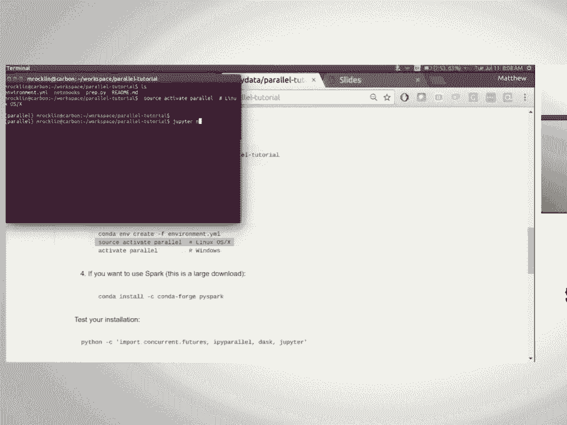

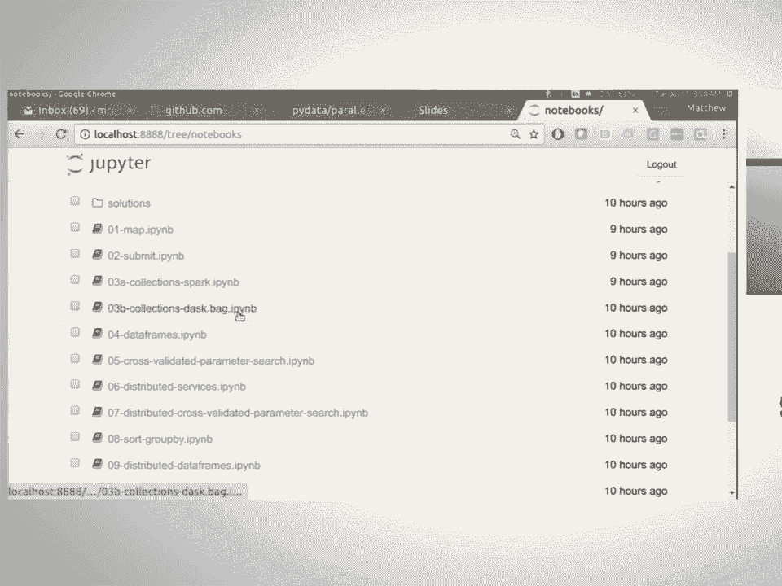

---

## 准备工作

在开始之前，请访问 GitHub 页面 `github.com/pydata/paraltutorials`，按照说明下载教程仓库。这将下载一系列 Jupyter Notebook 到你的机器上，我们将使用 Jupyter Notebook 服务器来完成课程。

课程的第一部分将使用你的本地机器。如果本地环境无法工作，可以立即切换到集群。课程的第二部分将使用集群，届时请访问指定链接并按提示操作。

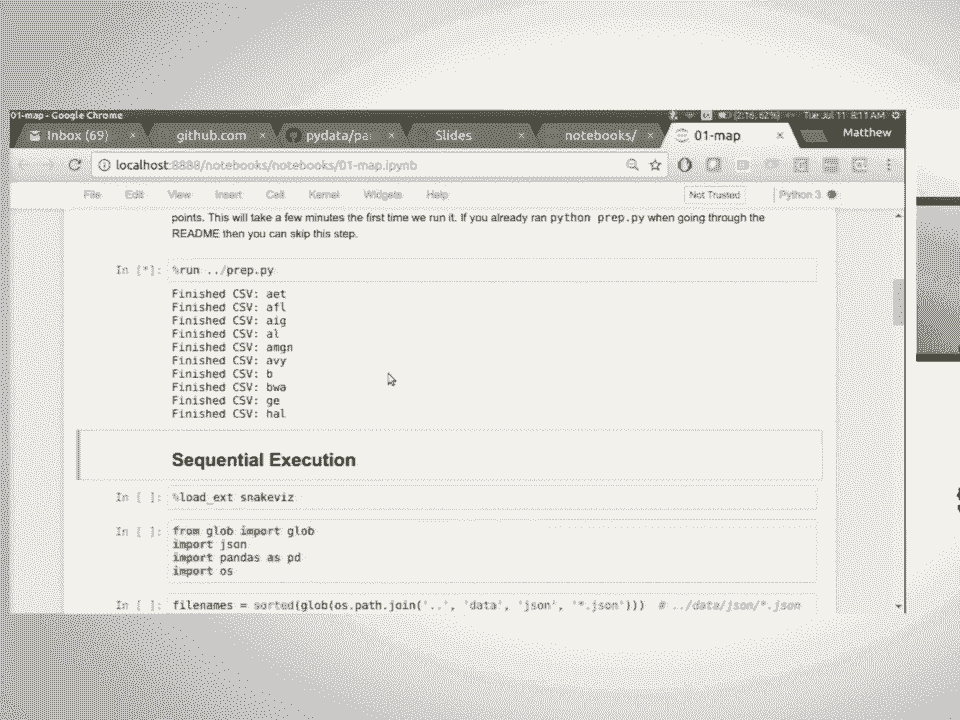

我们还将使用 Slack 房间进行交流，我和其他讲师会留意其中的问题。

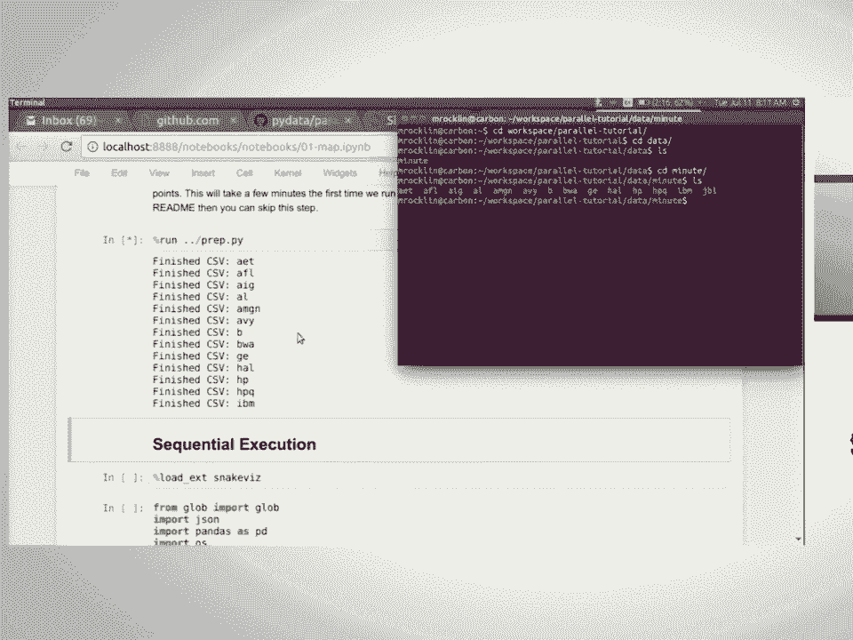

---

## 第一部分：并行映射

上一节我们介绍了课程的整体安排，本节中我们来看看最简单的并行编程范式：并行映射。

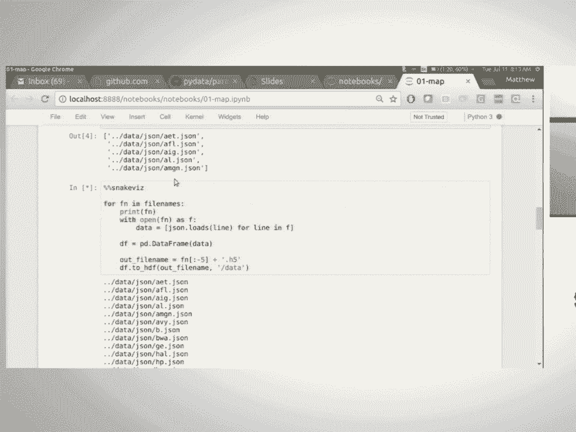

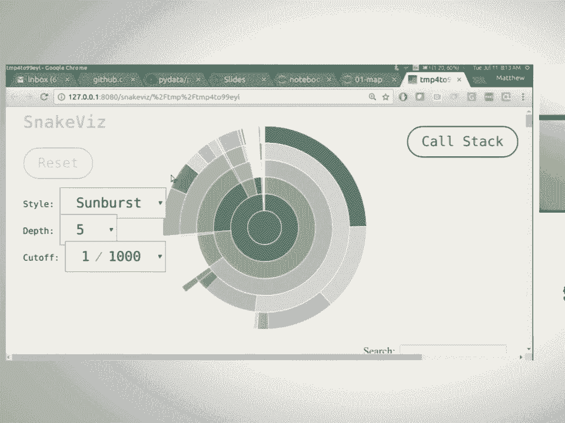

当你有一个函数和一批数据，并希望将该函数应用于数据的每一部分时，通常会使用 `for` 循环、列表推导式或 Python 内置的 `map` 函数。`map` 函数的好处在于，我们可以重写它以并行运行。许多编程框架都提供了并行版本的 `map`。

例如，`concurrent.futures` 模块提供了 `ThreadPoolExecutor` 或 `ProcessPoolExecutor`。我们创建一个执行器，向其传递函数和输入列表，它就会并行执行并返回输出列表。这是非常常见的模式，许多库都遵循这个系统。

以下是使用 `ProcessPoolExecutor` 进行并行映射的基本代码结构：

```python
from concurrent.futures import ProcessPoolExecutor

def slow_increment(x):
    # 模拟一些工作
    time.sleep(1)
    return x + 1

with ProcessPoolExecutor() as executor:
    results = list(executor.map(slow_increment, range(10)))
```

### 实践练习：转换数据格式

我们首先生成一些模拟的股票数据。数据以 CSV 和 JSON 格式存储，每个文件代表一只股票的时间序列数据。我们的任务是将所有 JSON 文件加载并转换为更高效的格式（例如 HDF5）。由于每个文件的操作是独立的，这非常适合使用 `map` 进行并行化。

以下是顺序执行的代码：

```python
import json
import pandas as pd
import glob

def convert_json_to_hdf5(filename):
    with open(filename) as f:
        data = json.load(f)
    df = pd.DataFrame(data)
    hdf5_filename = filename.replace('.json', '.h5')
    df.to_hdf(hdf5_filename, key='df', mode='w')

file_names = glob.glob('data/*.json')
for fn in file_names:
    convert_json_to_hdf5(fn)
```

使用性能分析工具 `snakeviz`，我们发现大部分时间花费在 `json.loads` 函数上。在考虑并行化之前，理解性能瓶颈非常重要。

**你的目标**：将上述顺序代码使用 `ProcessPoolExecutor.map` 进行并行化改写。

---

### 解决方案与性能分析

以下是使用 `ProcessPoolExecutor` 并行化的解决方案：

```python
from concurrent.futures import ProcessPoolExecutor
import glob

def convert_json_to_hdf5(filename):
    # ... 与之前相同的函数体 ...

file_names = glob.glob('data/*.json')
with ProcessPoolExecutor() as executor:
    results = list(executor.map(convert_json_to_hdf5, file_names))
```

在四核机器上，并行版本运行时间从约13秒减少到约4.7秒，获得了近2倍的加速。但请注意，并行化并非总是最佳方案。我们发现 `json.loads` 是主要瓶颈，因此也可以尝试使用更快的 JSON 库（如 `ujson`）来加速顺序执行。结合两者（使用 `ujson` 和并行化）可以获得最佳性能。

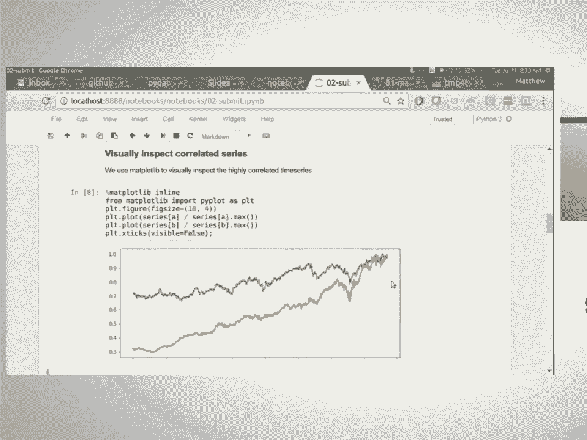

---

## 第二部分：使用 Submit 进行灵活任务调度

上一节我们介绍了简单的并行映射，本节中我们来看看更灵活的任务调度方法：`submit`。

有时，你的代码结构比简单的 `map` 更复杂。例如，你可能有两个嵌套的 `for` 循环，根据某些条件调用不同的函数 `F` 和 `G`。这些调用可以并行执行，但不容易转换为 `map` 操作。这时可以使用 `submit` 方法。

`submit` 允许你将函数及其参数提交给执行器，在后台运行，并立即返回一个 `Future` 对象作为结果的引用。你可以在提交任务后继续做其他工作，然后在需要结果时调用 `future.result()` 来获取。

以下是使用 `ThreadPoolExecutor.submit` 的基本示例：

```python
from concurrent.futures import ThreadPoolExecutor
import time

def slow_add(x, y):
    time.sleep(1)
    return x + y

with ThreadPoolExecutor() as executor:
    future = executor.submit(slow_add, 1, 2)
    # 在此期间可以做其他事情
    result = future.result()  # 等待并获取结果
```

### 实践练习：寻找相关性最高的股票对

我们使用第一部分生成的 HDF5 文件。每个文件包含一只股票的时间序列数据。我们的目标是找出所有股票对中相关性最高的一对。

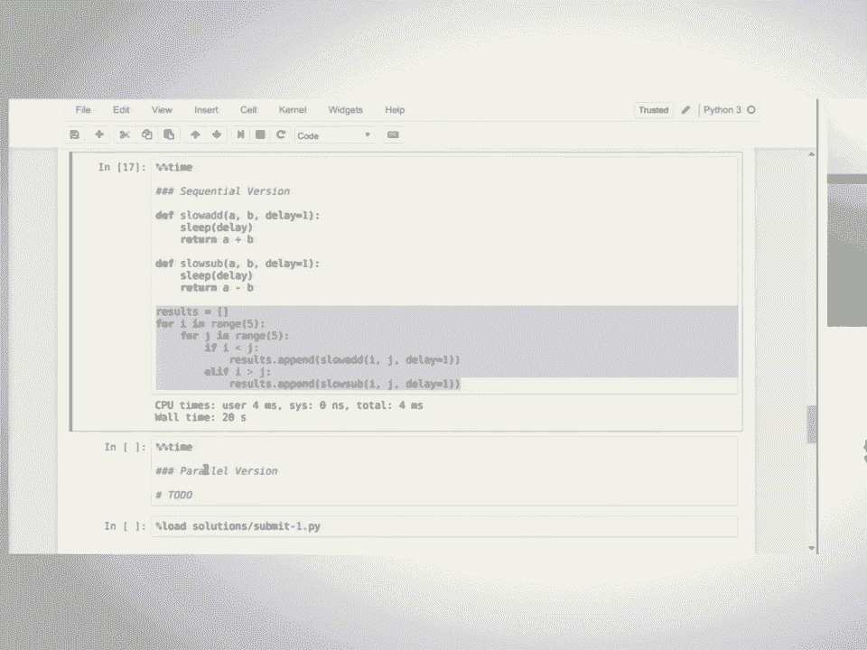

顺序执行的代码包含一个嵌套循环来计算每对股票的相关性：

```python
import pandas as pd
import glob

file_names = glob.glob('data/*.h5')
series = {}
for fn in file_names:
    series[fn] = pd.read_hdf(fn)['close']

best = (None, None, -2)
for name_a, ts_a in series.items():
    for name_b, ts_b in series.items():
        if name_a == name_b:
            continue
        corr = ts_a.corr(ts_b)
        if corr > best[2]:
            best = (name_a, name_b, corr)
```

**你的目标**：使用 `ThreadPoolExecutor.submit` 并行化上述代码中计算相关性的嵌套循环部分。

---

### 解决方案与注意事项

以下是使用 `submit` 并行化的解决方案：

```python
from concurrent.futures import ThreadPoolExecutor
import pandas as pd
import glob

def compute_corr(pair):
    name_a, name_b, ts_a, ts_b = pair
    if name_a == name_b:
        return (name_a, name_b, -2)  # 跳过自相关
    corr = ts_a.corr(ts_b)
    return (name_a, name_b, corr)

file_names = glob.glob('data/*.h5')
series = {fn: pd.read_hdf(fn)['close'] for fn in file_names}

futures = []
with ThreadPoolExecutor() as executor:
    for name_a, ts_a in series.items():
        for name_b, ts_b in series.items():
            future = executor.submit(compute_corr, (name_a, name_b, ts_a, ts_b))
            futures.append(future)

    results = [f.result() for f in futures]
    best = max(results, key=lambda x: x[2])
```

在这个例子中，并行版本可能没有获得巨大的加速，因为计算本身不重，而任务创建和协调的开销可能成为主导。此外，需要注意线程安全。例如，某些 HDF5 库的旧版本不是线程安全的，使用多线程读取 HDF5 文件可能导致崩溃。幸运的是，新版本的 HDF5 已经解决了这个问题。

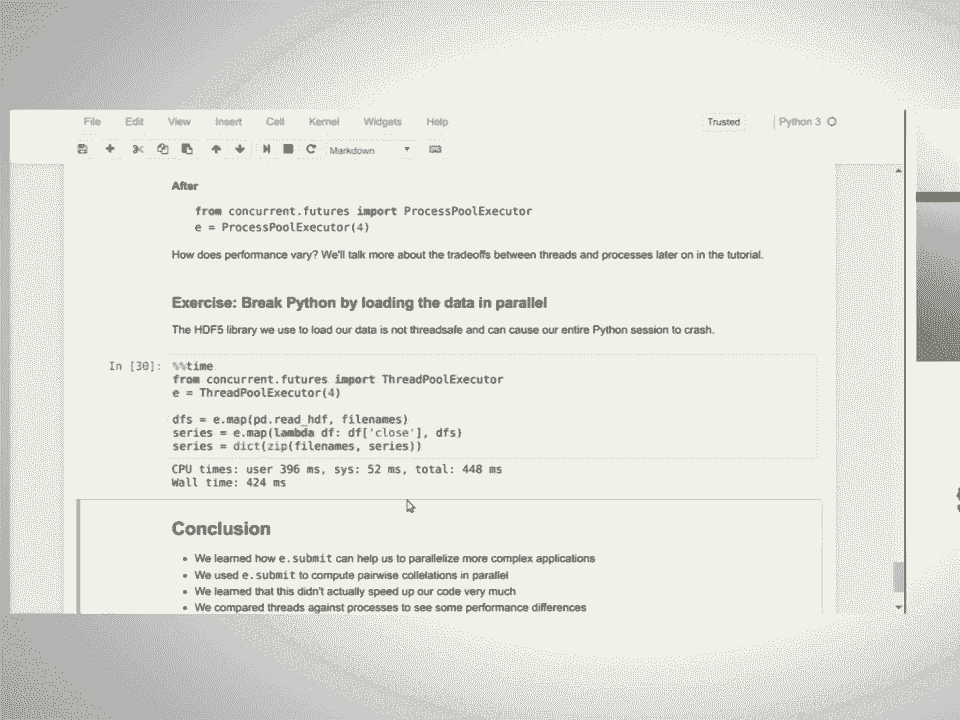

关于执行器的选择：
*   **`ThreadPoolExecutor`**：任务在同一个进程的不同线程中运行，可以轻松共享数据（如内存中的数组），但受限于 Python 的全局解释器锁，纯 Python 计算可能无法充分利用多核。
*   **`ProcessPoolExecutor`**：任务在不同的进程中运行，可以绕过 GIL 充分利用多核进行纯 Python 计算，但进程间通信（序列化和传输数据）成本较高。

一般经验法则：使用 NumPy、Pandas 或 scikit-learn 等库时，使用线程；进行纯 Python 计算（如处理字典、列表、文本解析）时，使用进程。

---

## 第三部分：使用大型数据集合

上一节我们介绍了灵活但底层的 `submit` 方法，本节中我们来看看更高级的抽象：大型数据集合。

有时，你会使用提供受限 API 的框架，例如 Spark 的 `map`、`filter`、`groupBy`、`join`，或者数组编程系统的矩阵运算，或者类似 SQL 的查询语言。只要你能将计算约束在这些 API 内，框架就会自动为你处理并行性。这对于符合这些模式的问题来说非常高效。

我们将看看典型的 Spark RDD（弹性分布式数据集）风格的 API。你可以创建来自 Python 可迭代对象的 RDD，然后在其上应用一系列转换操作（如 `map`、`filter`、`cartesian`），最后通过一个动作（如 `collect` 或 `max`）触发计算并返回结果。

以下是使用 PySpark 的基本示例：

```python
from pyspark import SparkContext
sc = SparkContext()

data = [1, 2, 3, 4, 5]
rdd = sc.parallelize(data)
squared_rdd = rdd.map(lambda x: x**2)
even_rdd = squared_rdd.filter(lambda x: x % 2 == 0)
result = even_rdd.collect()
```

`cartesian` 操作可以生成两个 RDD 所有元素对的笛卡尔积，类似于嵌套循环。

### 实践练习：使用 Spark 寻找相关性最高的股票对

我们将使用 Spark 来重写之前寻找最高相关性股票对的练习。

**你的目标**：使用 Spark RDD 操作（如 `parallelize`、`map`、`cartesian`、`filter`、`max`）来实现相同的计算。

---

### 解决方案与性能分析

以下是使用 Spark 的解决方案：

```python
from pyspark import SparkContext
sc = SparkContext()

file_names = sc.parallelize(glob.glob('data/*.h5'))
series_rdd = file_names.map(lambda fn: (fn, pd.read_hdf(fn)['close']))

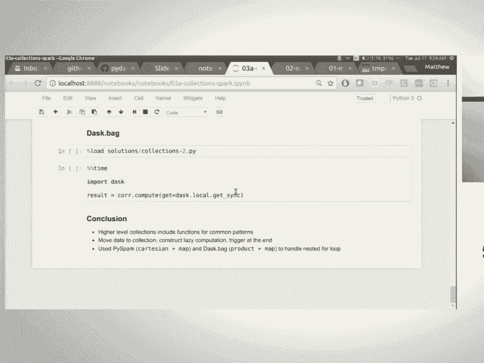

# 生成所有股票对（笛卡尔积），并过滤掉自相关的对
pairs_rdd = series_rdd.cartesian(series_rdd) \
                      .filter(lambda x: x[0][0] != x[1][0])

def compute_corr(pair):
    (name_a, ts_a), (name_b, ts_b) = pair
    corr = ts_a.corr(ts_b)
    return (name_a, name_b, corr)

corr_rdd = pairs_rdd.map(compute_corr)
best = corr_rdd.max(key=lambda x: x[2])
```

有趣的是，在这个例子中，Spark 版本（约8秒）可能比顺序版本（约1.5秒）还要慢。原因在于**通信开销**。`cartesian` 操作需要将每个股票的时间序列数据移动到所有其他任务所在的节点，这个数据移动的成本远高于实际计算相关性的成本。在本地笔记本电脑这样的共享内存环境中，这种开销尤其明显。

这个例子说明了并行化并不总是能带来加速。设置成本、任务调度开销，特别是数据移动（通信）成本，都可能抵消甚至超过并行计算带来的收益。像 Spark 或 Dask 这样的分布式系统通常提供 Web UI 等诊断工具，帮助你可视化任务执行和数据移动情况，这对于理解和优化性能至关重要。

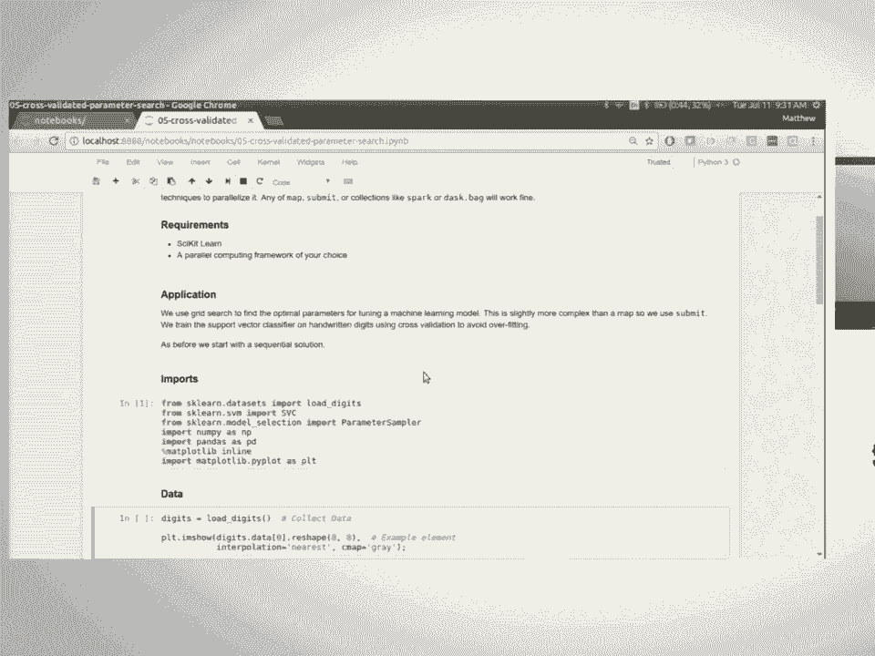

---

## 第四部分：数据科学应用：超参数调优


现在，让我们看一个更贴近实际数据科学工作的例子：机器学习模型的超参数调优。我们将使用手写数字数据集和一个支持向量机分类器。

我们的目标是调整模型的三个参数：`C`（误差容忍度）、`gamma`（核函数影响范围）和 `tol`（迭代容忍度）。我们将在一个参数网格上进行搜索，为每一组参数训练模型并进行交叉验证，找出在验证集上表现最好的参数组合。

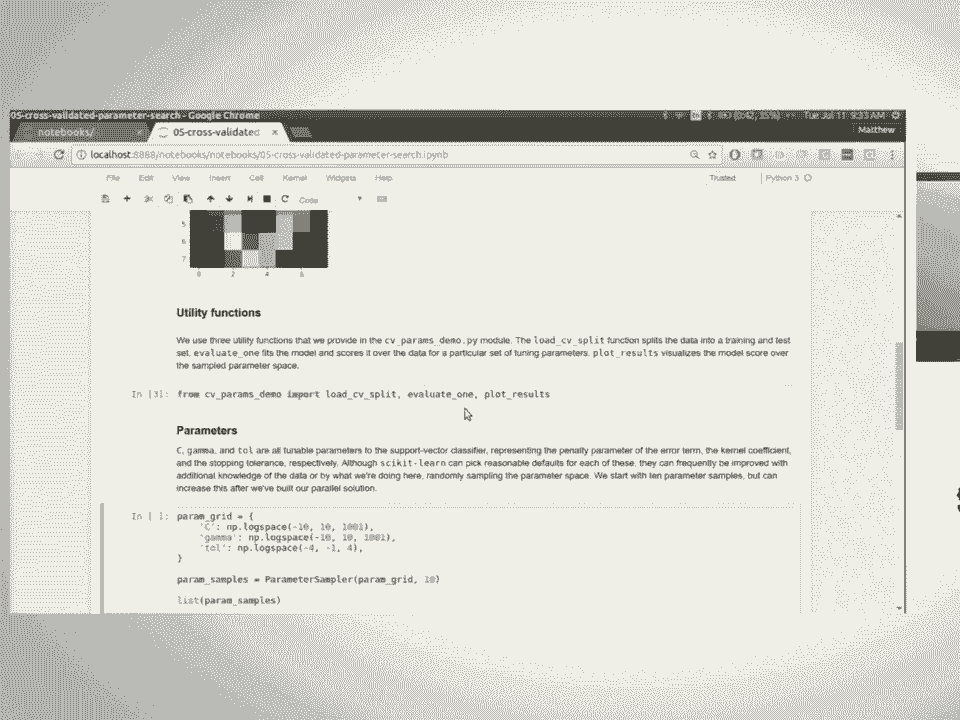

顺序执行的代码涉及在参数网格上进行三重循环，训练和评估每个模型，这非常耗时。

**你的目标**：使用你学到的任何并行编程技术（`map`、`submit`、Spark 等）来并行化这个超参数搜索过程。

---

### 解决方案示例

以下是使用 `ThreadPoolExecutor.submit` 的一种解决方案：

```python
from concurrent.futures import ThreadPoolExecutor
from sklearn.model_selection import train_test_split
from sklearn import datasets, svm
import numpy as np

# 加载数据，划分训练集和测试集
digits = datasets.load_digits()
X_train, X_test, y_train, y_test = train_test_split(...)

# 定义参数网格
param_grid = {'C': np.logspace(-10, 3, 14),
              'gamma': np.logspace(-10, 3, 14),
              'tol': np.logspace(-4, -1, 4)}

futures = []
with ThreadPoolExecutor() as executor:
    for C in param_grid['C']:
        for gamma in param_grid['gamma']:
            for tol in param_grid['tol']:
                # 提交任务
                future = executor.submit(evaluate_params, C, gamma, tol, X_train, y_train)
                futures.append(future)

    # 收集结果
    results = [f.result() for f in futures]
    best_params = max(results, key=lambda x: x[0])  # 假设返回 (score, params)
```

并行化可以显著减少搜索大量参数组合所需的总时间。你也可以尝试使用更智能的搜索算法（如随机搜索或贝叶斯优化），它们通常比网格搜索更高效，并且也容易并行化。

---


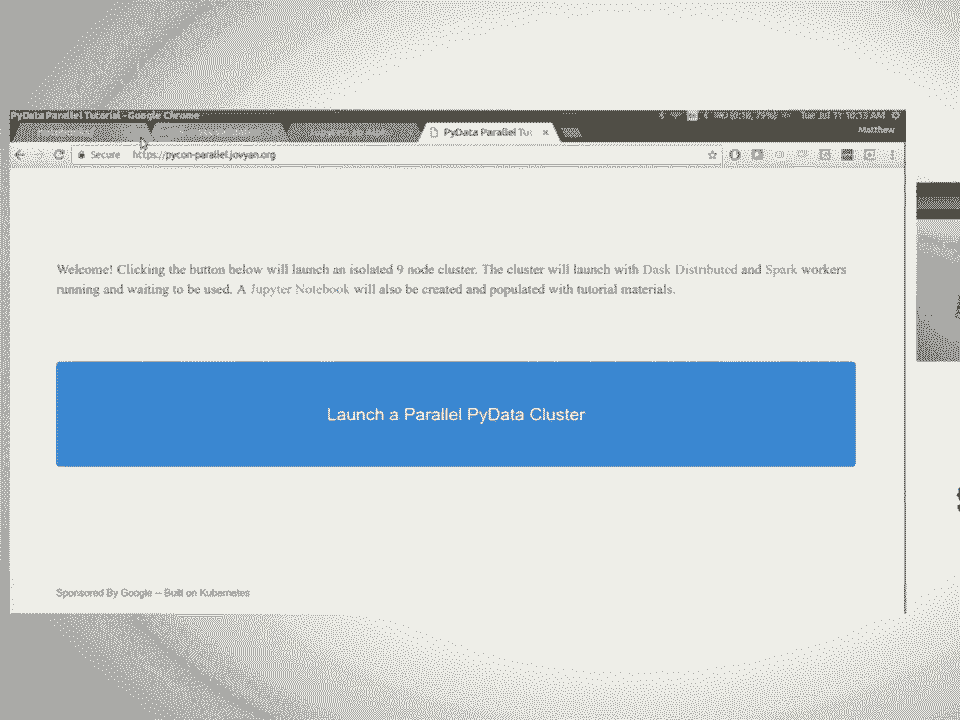

## 总结

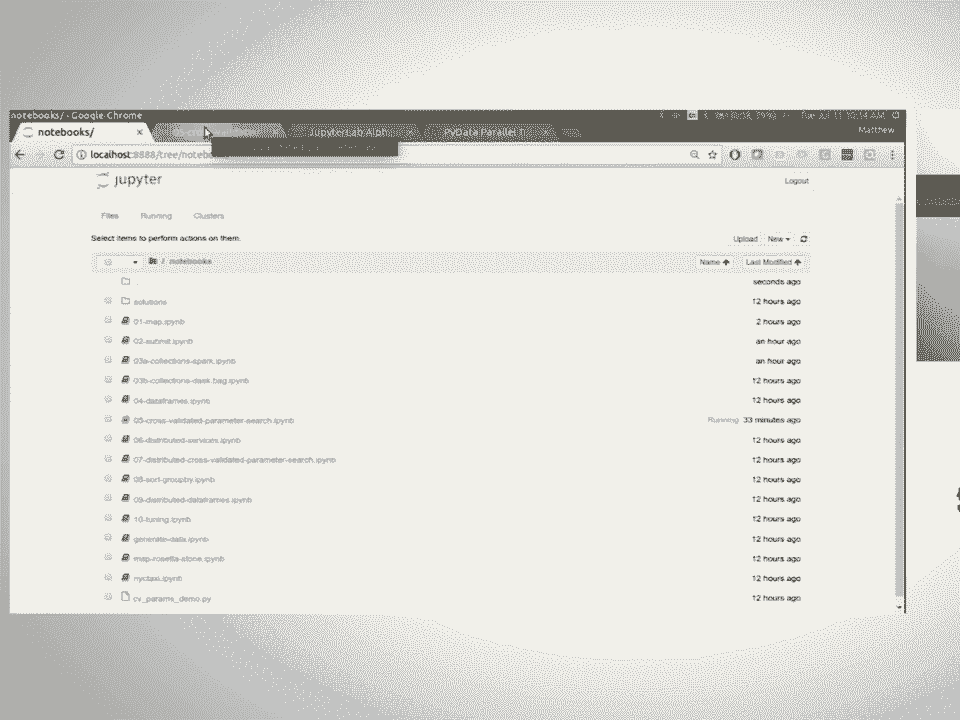

在本课程中，我们一起学习了 Python 中并行编程的几种核心范式：

1.  **并行映射**：适用于对一批独立数据应用相同函数的简单场景。使用 `concurrent.futures.Executor.map` 可以轻松实现。
2.  **任务提交**：通过 `submit` 方法提供了更大的灵活性，可以处理更复杂的依赖关系和任务图。它返回 `Future` 对象用于异步获取结果。
3.  **大型数据集合**：使用像 Spark 这样的高级抽象，通过受限但富有表现力的 API（如 `map`、`filter`、`join`）自动处理并行性。适合符合其计算模式的问题，但在数据移动成本高时需要谨慎。
4.  **实际应用**：我们将这些技术应用于数据格式转换、股票相关性分析和机器学习超参数调优等实际问题。

记住，并行化不是万能的银弹。在尝试并行化之前，务必：
*   使用性能分析工具（如 `snakeviz`）识别瓶颈。
*   考虑是否有更优的算法或更高效的库。
*   评估并行化带来的开销（任务启动、通信、数据序列化）是否会超过收益。
*   根据任务类型（I/O 密集型、CPU 密集型、纯 Python 计算）选择合适的执行器（线程 vs 进程）。

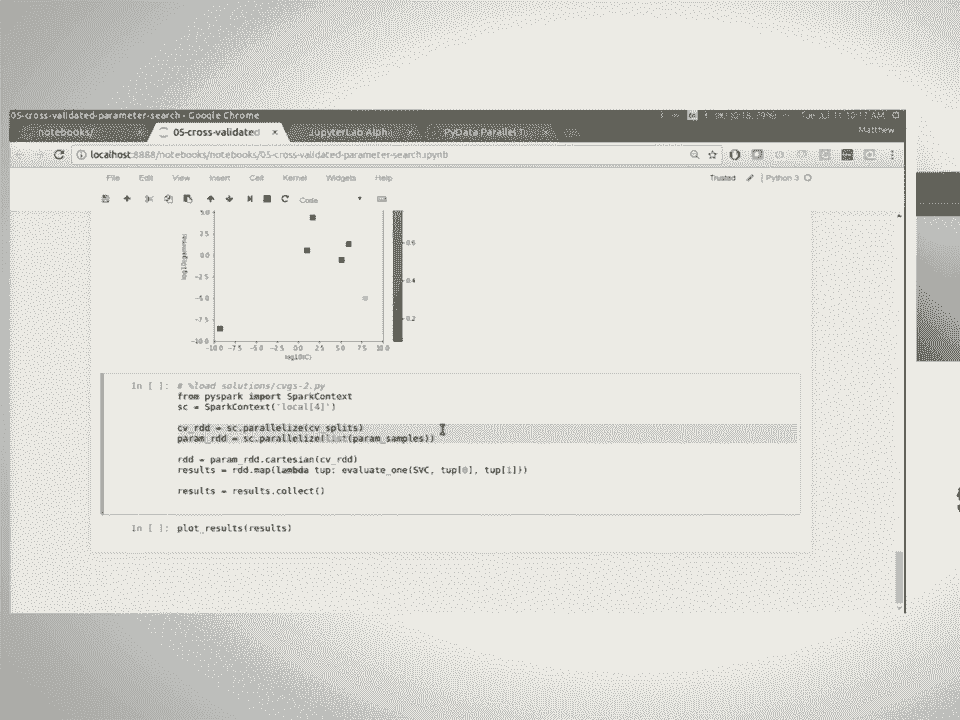

希望本教程能帮助你在未来的项目中更有效地利用 Python 的并行计算能力。