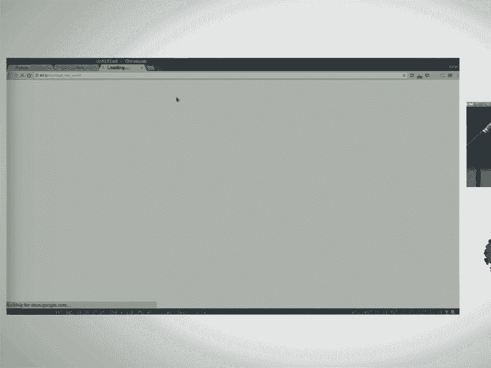
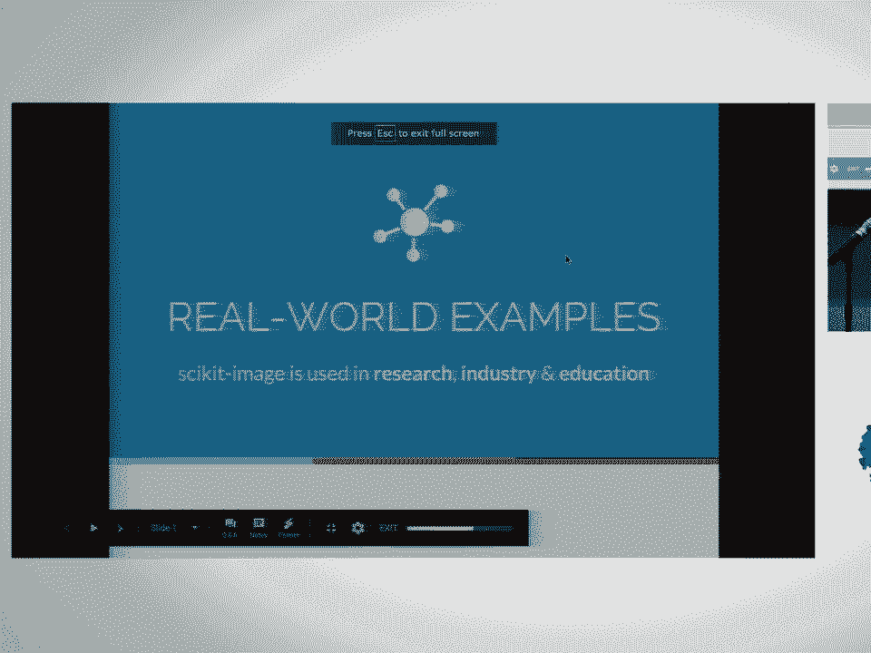
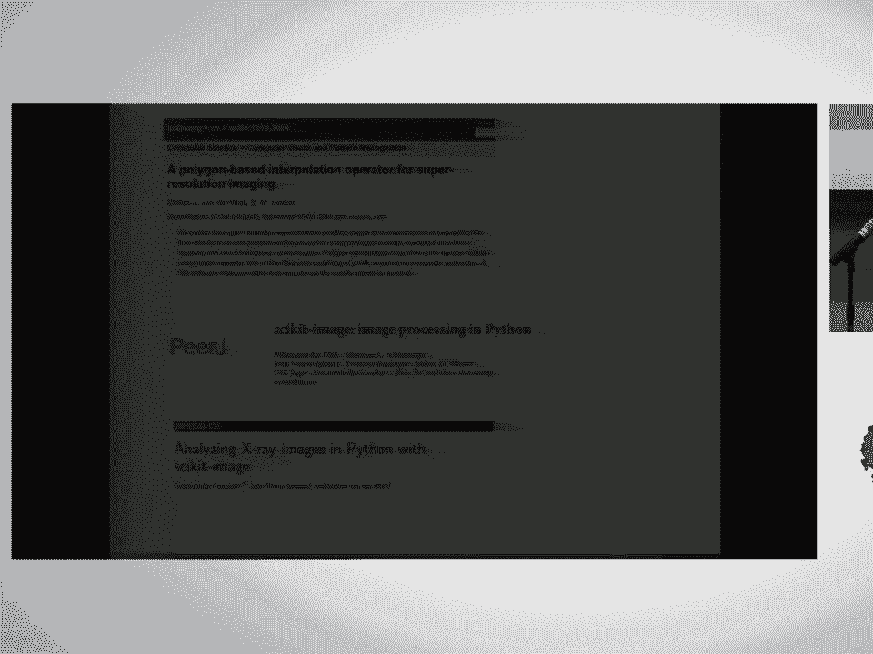
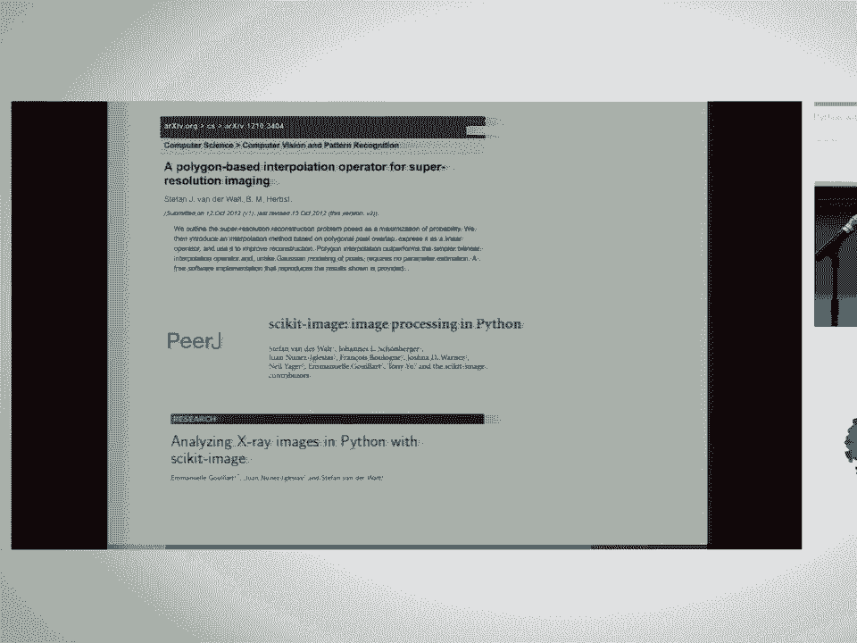
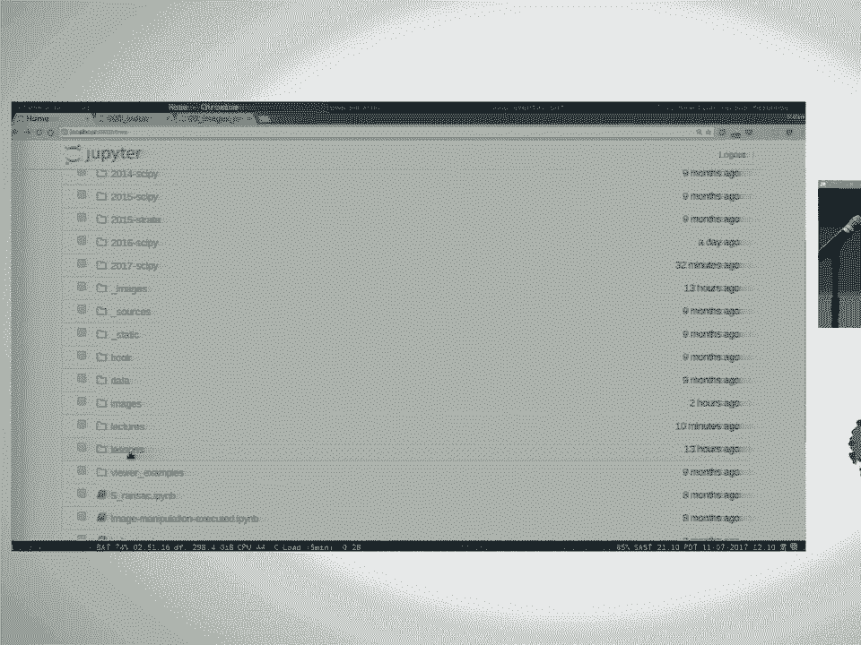
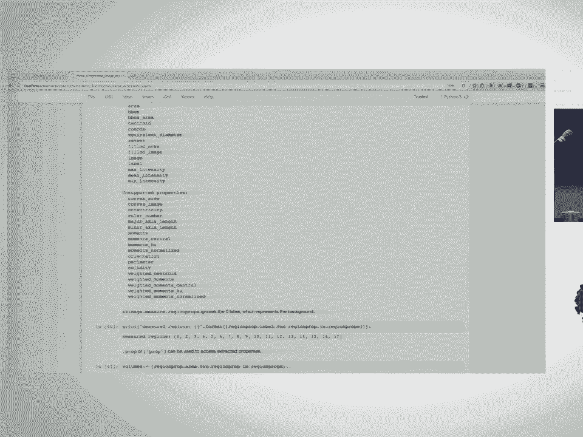

# 14：scikit-image - Python 图像处理 🖼️

在本课程中，我们将学习如何使用 scikit-image 库进行图像处理。我们将从图像在 Python 中的基本表示开始，逐步深入到三维数据处理和机器学习应用。课程内容旨在让初学者能够轻松理解并上手实践。

---

## 概述 📋

scikit-image 是一个基于 NumPy 和 SciPy 构建的图像处理库，旨在提供高级、易用的接口，用于科学研究和实验。本教程将涵盖图像表示、三维数据处理、机器学习应用以及与其他库的交互。

---

## 图像表示：NumPy 数组 📊







在 scikit-image 中，图像使用标准的 NumPy 数组来表示。本节我们将学习如何创建和操作这些数组。



### 灰度图像

灰度图像是一个二维数组，每个元素代表一个像素的亮度值。

```python
import numpy as np
import matplotlib.pyplot as plt

# 生成一个 500x500 的随机灰度图像
image = np.random.random((500, 500))
plt.imshow(image, cmap='gray')
plt.show()
```

### 彩色图像

彩色图像是一个三维数组，包含红、绿、蓝三个通道。

```python
from skimage import data

# 加载彩色测试图像
color_image = data.chelsea()
print(color_image.shape)  # 输出: (300, 451, 3)
```

### 图像数据类型

scikit-image 支持不同的数据类型，如 `uint8`（0-255）和浮点数（0-1）。内部处理通常使用浮点数。

```python
from skimage import img_as_float, img_as_ubyte

# 转换图像数据类型
float_image = img_as_float(color_image)
ubyte_image = img_as_ubyte(float_image)
```

---

## 图像显示与颜色映射 🎨

使用 Matplotlib 可以方便地显示图像。选择合适的颜色映射对图像可视化至关重要。

### 显示图像

```python
plt.imshow(image, cmap='viridis')
plt.show()
```

### 避免使用 Jet 颜色映射

Jet 颜色映射可能引入虚假的轮廓，建议使用 `viridis` 等更优的颜色映射。

```python
# 创建示例数据
x = np.linspace(-5, 5, 100)
y = np.linspace(-5, 5, 100)
X, Y = np.meshgrid(x, y)
Z = np.exp(-(X**2 + Y**2) / 15)

# 使用不同颜色映射显示
fig, axes = plt.subplots(1, 2)
axes[0].imshow(Z, cmap='jet')
axes[1].imshow(Z, cmap='viridis')
plt.show()
```

---

## 加载与保存图像 💾

scikit-image 提供了简单的接口来从磁盘加载和保存图像。

### 加载单个图像

```python
from skimage import io

image = io.imread('images/balloon.jpg')
print(type(image), image.dtype, image.shape)
```

### 加载图像集合

`ImageCollection` 可以高效地加载多个图像，仅在需要时加载到内存。



```python
from skimage import io

# 加载目录中的所有 PNG 图像
images = io.ImageCollection('images/*.png')
print(images.files)

# 显示所有图像
fig, axes = plt.subplots(1, len(images))
for i, img in enumerate(images):
    axes[i].imshow(img)
plt.show()
```

---

## 练习：操作 NumPy 数组 ✏️

以下是三个练习，帮助您熟悉图像数组的基本操作。

### 练习 1：在图像上绘制字母 H

在给定图像上绘制一个指定颜色和大小的字母 “H”。

```python
def draw_H(image, start_row, start_col, color, inplace=True):
    if not inplace:
        image = image.copy()
    # 绘制垂直条
    image[start_row:start_row+24, start_col:start_col+3] = color
    image[start_row:start_row+24, start_col+17:start_col+20] = color
    # 绘制水平条
    image[start_row+10:start_row+13, start_col:start_col+20] = color
    return image
```

### 练习 2：绘制 RGB 强度图

提取彩色图像中某一行的红、绿、蓝通道强度并绘制成线图。

```python
def plot_rgb_intensity(image, row):
    red = image[row, :, 0]
    green = image[row, :, 1]
    blue = image[row, :, 2]
    plt.plot(red, color='red')
    plt.plot(green, color='green')
    plt.plot(blue, color='blue')
    plt.show()
```

### 练习 3：将彩色图像转换为灰度图像

使用加权公式将 RGB 图像转换为灰度图像。

```python
def rgb_to_gray(image):
    weights = np.array([0.2, 0.7, 0.07])
    gray_image = np.dot(image, weights)
    return gray_image
```

---

## 三维图像处理 🔬

三维图像在生物医学等领域广泛应用。本节我们将学习如何处理三维图像数据。

### 三维图像表示

三维图像是一个三维数组，通常由多个二维切片堆叠而成。

```python
# 加载三维测试数据
from skimage import data
volume = data.cells3d()
print(volume.shape)  # 输出: (60, 256, 256)
```

### 图像间距

三维图像中，不同维度的像素间距可能不同，需要在处理时考虑。

```python
original_spacing = np.array([0.29, 0.065, 0.065])
rescaled_spacing = original_spacing * [1, 4, 4]
normalized_spacing = rescaled_spacing / rescaled_spacing[1]
```

---

## 图像增强与去噪 🌟

为了提高图像质量，我们通常需要进行对比度增强和去噪处理。

### 对比度增强

`gamma` 校正和直方图均衡是常用的对比度增强方法。

```python
from skimage import exposure

# Gamma 校正
gamma_corrected = exposure.adjust_gamma(volume, gamma=0.5)

# 直方图均衡
equalized = exposure.equalize_hist(volume)
```

### 去噪

高斯滤波、中值滤波和双边滤波可用于去除图像噪声。

```python
from skimage.filters import gaussian, median
from skimage.restoration import denoise_bilateral

# 高斯滤波（考虑间距）
sigma = 3 / normalized_spacing
smoothed = gaussian(volume, sigma=sigma, multichannel=False)

# 中值滤波（逐平面应用）
denoised = np.zeros_like(volume)
for i in range(volume.shape[0]):
    denoised[i] = median(volume[i])
```

---

## 图像分割与特征提取 🧩

图像分割是将图像划分为不同区域的过程，特征提取则用于量化这些区域。

### 阈值分割

使用阈值将图像分为前景和背景。

```python
from skimage.filters import threshold_li

# Li 最小交叉熵阈值
threshold = threshold_li(denoised)
binary = denoised > threshold
```

### 形态学操作

形态学操作可用于填充孔洞和去除小物体。

```python
from skimage import morphology

# 填充孔洞
filled = morphology.remove_small_holes(binary, area_threshold=64)

# 去除小物体
cleaned = morphology.remove_small_objects(filled, min_size=128)
```

### 分水岭算法

分水岭算法能有效分离相互接触的物体。

```python
from skimage.segmentation import watershed
from skimage.feature import peak_local_max

# 计算距离图并查找局部最大值
distance = morphology.distance_transform_edt(binary)
local_maxi = peak_local_max(distance, min_distance=10)
markers = morphology.label(local_maxi)
labels = watershed(-distance, markers, mask=binary)
```

### 特征提取

使用 `regionprops` 可以提取每个区域的多种特征。

```python
from skimage.measure import regionprops

# 清除边界标签
from skimage.segmentation import clear_border
labels_cleared = clear_border(labels)

# 提取区域属性
props = regionprops(labels_cleared, intensity_image=volume)
for prop in props:
    print(prop.area, prop.mean_intensity)
```

---



## 总结 🎓

在本课程中，我们一起学习了 scikit-image 库的基本用法。我们从图像在 Python 中的 NumPy 数组表示开始，逐步深入到图像加载、显示、增强、分割和特征提取。特别是，我们还探讨了三维图像处理的特殊考虑和方法。希望这些知识能帮助您在图像处理项目中更加得心应手。

---

**注意**：本教程基于原始讲座内容整理，删除了所有语气词，并按照要求格式进行了优化，以确保内容清晰、结构完整、易于理解。