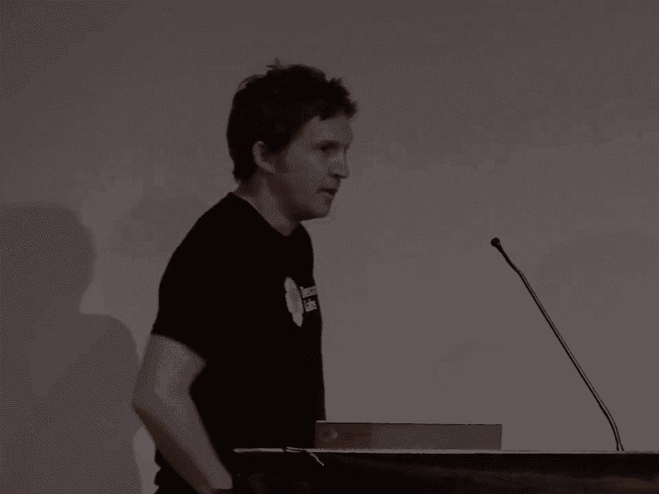
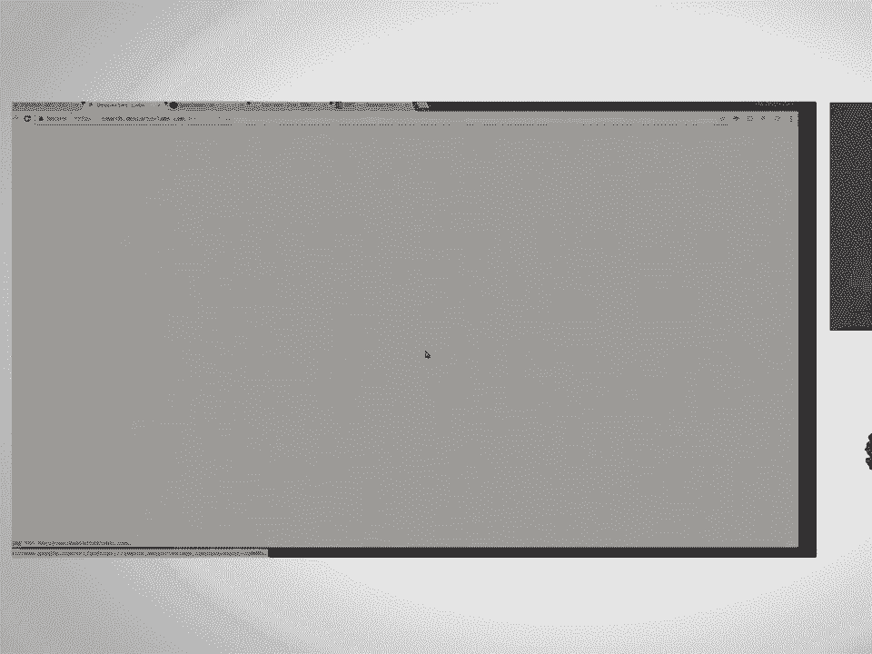
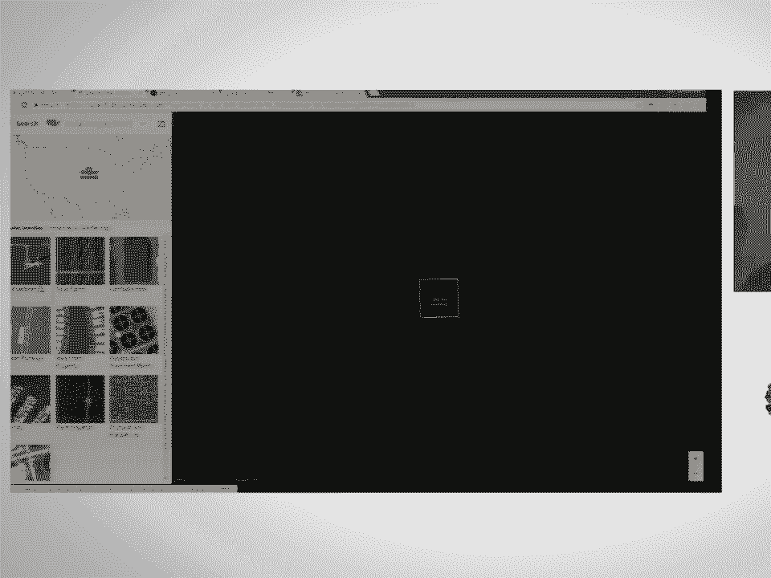
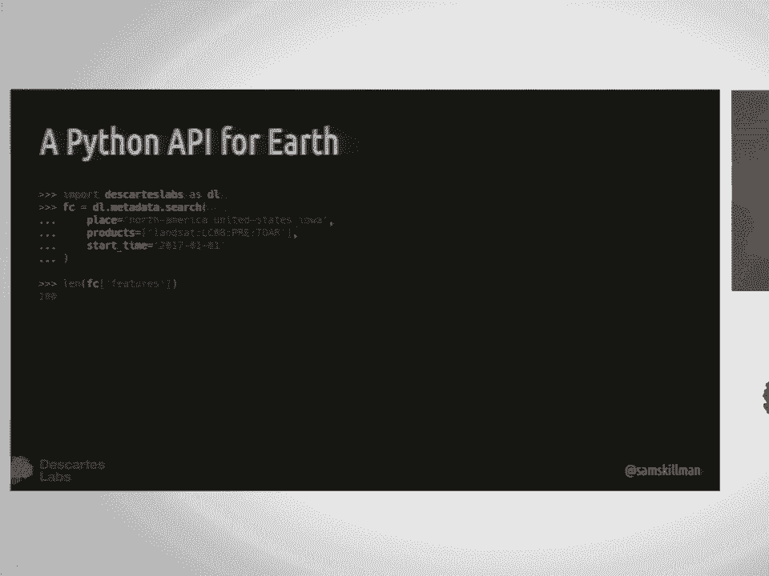
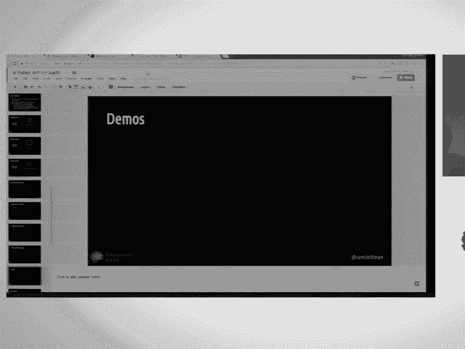
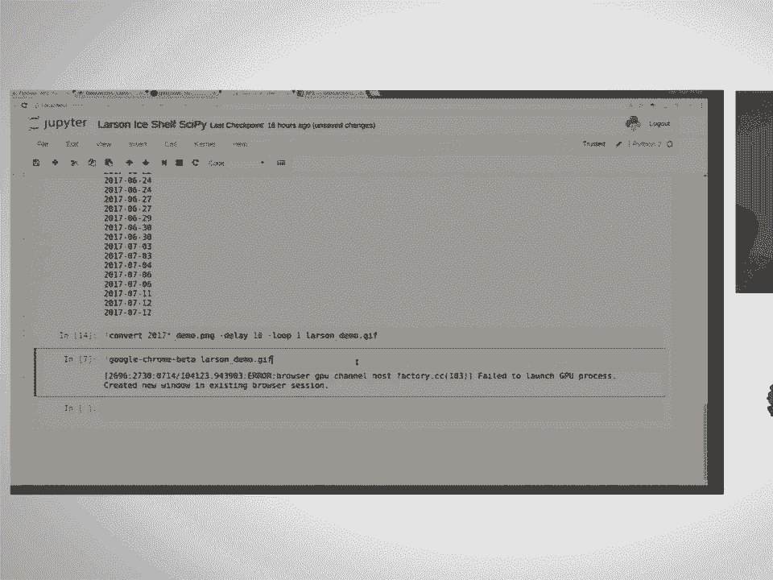
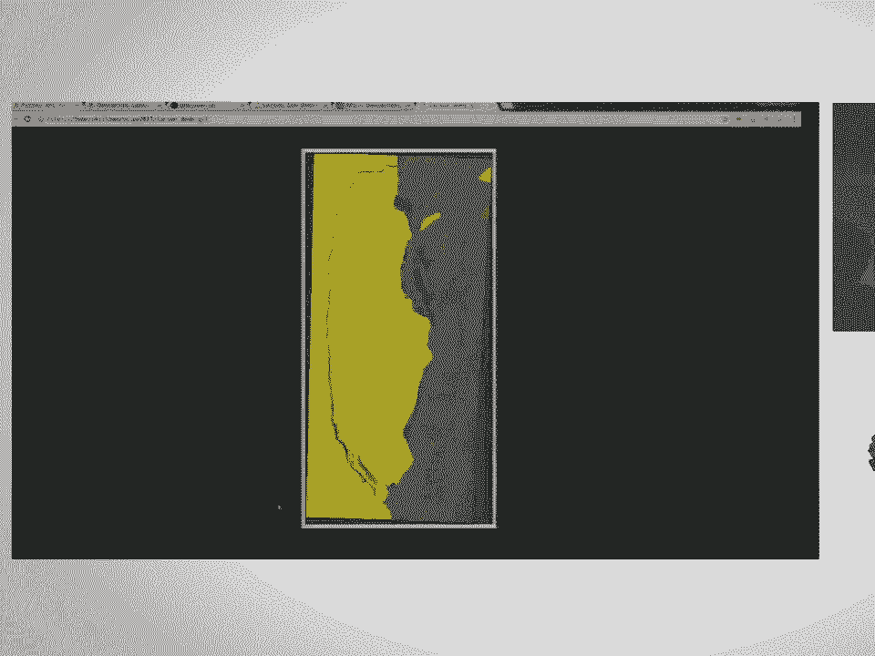
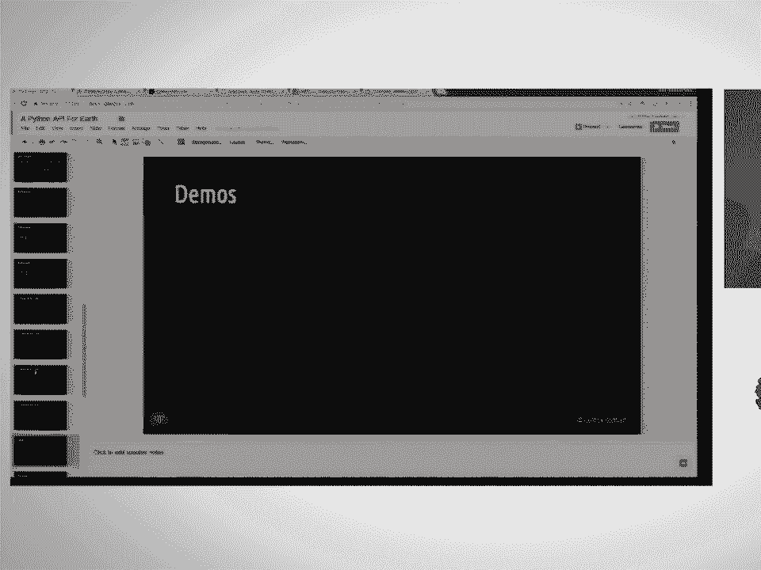
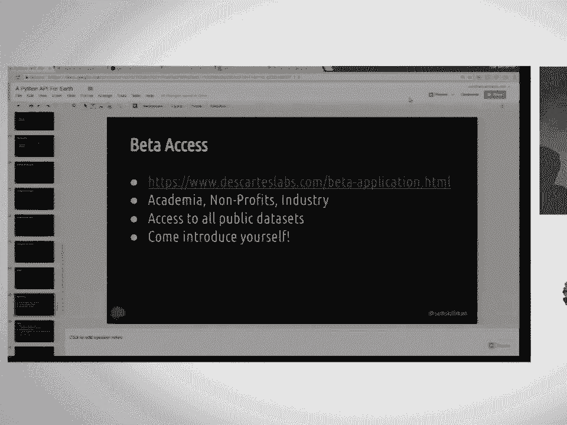

# 15：面向地球科学的Python API 🌍



在本节课中，我们将学习Descartes Labs公司如何构建一个统一的Python API，用于高效访问和处理海量地球空间数据。我们将了解其背后的动机、核心功能，并通过一个实际案例演示其强大能力。

---

## 公司简介与数据挑战 🏢

Descartes Labs是一家成立于2014年的初创公司，源自洛斯阿拉莫斯国家实验室。公司的核心目标是整合全球地理空间数据，并应用机器学习和计算机视觉技术，对地球表面即将发生的事件进行预测。

我们面临的核心挑战是地理空间数据的“大”。例如，Landsat卫星用了44年才积累了约1PB的影像数据，而欧空局的Sentinel-2星座仅用2年就能收集1PB数据，像Planet这样的私营公司每年更是会收集数PB的数据。这个领域的数据在规模、速率和类型上都在爆炸式增长。

## 多元化的地理空间数据 🌐

在Descartes Labs，我们整合了多种卫星影像和数据。这些数据在空间分辨率、时间分辨率和光谱分辨率上差异巨大。

以下是主要的数据类型：
*   **MODIS**：提供约300米分辨率的数据，时间分辨率高，适合制作高质量的无云镶嵌图。
*   **Landsat**：提供更高分辨率的多光谱数据，包含多个不同波段。
*   **国家航空影像计划**：提供约1米分辨率的数据，但每年仅更新一次。
*   **Sentinel-1**：合成孔径雷达卫星，主动发射5GHz辐射并测量其反射的极化。它不受云层影响，能清晰捕捉船只等金属物体。
*   **Sentinel-2**：与Landsat类似的光学卫星，其红边波段对植被监测非常有用。

我们的核心理念是：通过一个统一的API整合所有这些数据集，可以更轻松、更快速地利用它们，从而迭代和构建复杂的产品模型。

## 平台应用实例 🚜

利用这些影像和遥感数据集，我们开发了一些应用。

上一节我们介绍了多元化的数据，本节中我们来看看这些数据的具体应用。



**农业产量预测**
我们去年展示了美国玉米产量的预测模型。这需要整合大量前述数据集，并快速迭代模型。我们并非农学背景，主要通过物理洞察和海量影像数据来推导。



**全球合成影像**
我们制作了三套全球合成影像：
1.  Landsat 8地表反射率全球合成图。
2.  Sentinel-1合成孔径雷达全球合成图（据我们所知是首例）。
3.  Sentinel-2红边波段全球合成图，对农业监测尤其有力。

**地理视觉搜索**
这是一个演示项目，概念源于卡内基梅隆大学。其核心思想是：给定一张卫星影像片段，在全球范围内寻找与之相似的其他地点。

其技术流程可以概括为：
```python
# 概念性流程
影像数据 -> 深度卷积神经网络处理 -> 生成特征空间 -> 在高维空间中进行快速相似性比对 -> 输出最相似的结果
```
我们将其应用于Planet公司提供的中国地区影像，成功实现了对太阳能电池板等特定地物的搜索。

## Python API 设计与演示 🐍

经过两年半的发展，我们内部API已能支持大规模的全球分析。现在，我们正将部分能力对外开放。

我们的平台旨在提供统一、快速、可扩展的卫星影像数据访问接口，避免用户分别向不同数据提供商学习复杂的FTP接口。

平台目前处于测试阶段，其核心功能包括：
*   定义感兴趣区域。
*   跨所有卫星星座搜索所需数据。
*   创建镶嵌图和时序合成图。
*   提供基础遥感运算，更复杂的算法则由用户自行实现。



平台主要通过REST API暴露功能，并提供了Python客户端库。



以下是基本的Python使用模式：
```python
import descarteslabs as dl

# 1. 在特定区域（如爱荷华州）搜索Landsat数据
scenes, ctx = dl.scenes.search(aoi, products=["landsat:8"], start_time="2017-01-01", end_time="2017-12-31")

# 2. 获取数据为NumPy数组
arr = scenes.stack(bands=["red", "green", "blue"], ctx=ctx) # 获取原生波段
ndvi = scenes.stack(bands=["ndvi"], ctx=ctx) # 直接获取NDVI等衍生指数
```
`scenes.stack` 方法返回标准的NumPy数组，并附带元数据对象，方便用户了解所下载数据的信息。

## 实战演示：拉森C冰架崩解 🧊



接下来，我们通过一个实际案例来演示API的便捷性。最近，南极洲的拉森C冰架发生了崩解。







我们可以利用Sentinel-1的合成孔径雷达数据来观察这一过程，因为雷达数据不受极地黑暗和云层影响。

操作步骤如下：
1.  在 GeoJSON.io 上找到拉森C冰架位置并绘制多边形。
2.  使用Python API搜索过去一个月内的Sentinel-1 GRD数据。
3.  筛选出降轨数据，并按日期分组。
4.  请求120米分辨率的VV（垂直发射垂直接收）极化波段数据。
5.  将获取的影像按时间顺序叠加，生成GIF动图。

通过短短几行代码和几分钟的处理，我们就能清晰地看到冰架在2017年6月至7月间崩解、分离的过程。这充分展示了该API在快速验证想法、进行科学探索方面的能力。

## 平台访问与总结 📚

我们的平台目前提供测试访问权限，面向学术界、非营利组织和工业界用户。用户可以访问所有公开数据集，我们也可以协助接入私有数据源。

**关键信息：**
*   **分析运行位置**：目前，分析在用户下载数据的位置进行。我们不对用户使用的算法或软件包做限制。
*   **性能提示**：数据存储在Google云上，在Google云平台内访问速度最快。用户可以通过多进程和并发请求来优化下载速度。
*   **资源**：
    *   文档：请访问我们的官网。
    *   Python客户端库：已在GitHub上开源，支持Python 2和Python 3。

本节课中我们一起学习了Descartes Labs如何构建一个面向地球科学的Python API。我们从其处理海量、多元地理空间数据的挑战出发，了解了该API的设计理念、核心功能，并通过拉森C冰架崩解的实例，看到了它如何让科学家和开发者能够快速、便捷地访问和分析全球卫星数据，从而更高效地探索我们的星球。

---
**感谢观看。如有兴趣参与测试或了解更多，欢迎会后交流。**