# 16：nbgrader - Jupyter Notebook 中的作业创建与评分工具 📚


在本节课中，我们将学习一个名为 **nbgrader** 的工具。它是一个专门为 Jupyter Notebook 环境设计的系统，用于创建、分发、自动评分和手动批改作业。我们将了解其核心概念、两种主要工作流程，并通过一个简单的例子来演示其基本操作。

---

## 概述：为什么在课堂中使用 Notebook？

Jupyter Notebook 在教育领域的应用越来越广泛。教师们用它进行课堂练习、编写讲义、演示复杂概念，当然，还有布置和批改作业。Notebook 之所以特别适合用于作业，是因为它可以将**说明文字**、**编程练习**、**数学公式**和**概念性问题**（如自由回答）全部整合在一个文档中。

然而，使用 Notebook 进行作业评分也带来了一些独特的挑战：
*   如何维护独立的**教师版**（含答案）和**学生版**（不含答案）作业？
*   如何在 Notebook 中实现**自动评分**？
*   如何对自由回答题进行**手动评分**？
*   如何清晰地向学生提供**反馈和评论**？

nbgrader 正是为了解决这些问题而开发的。

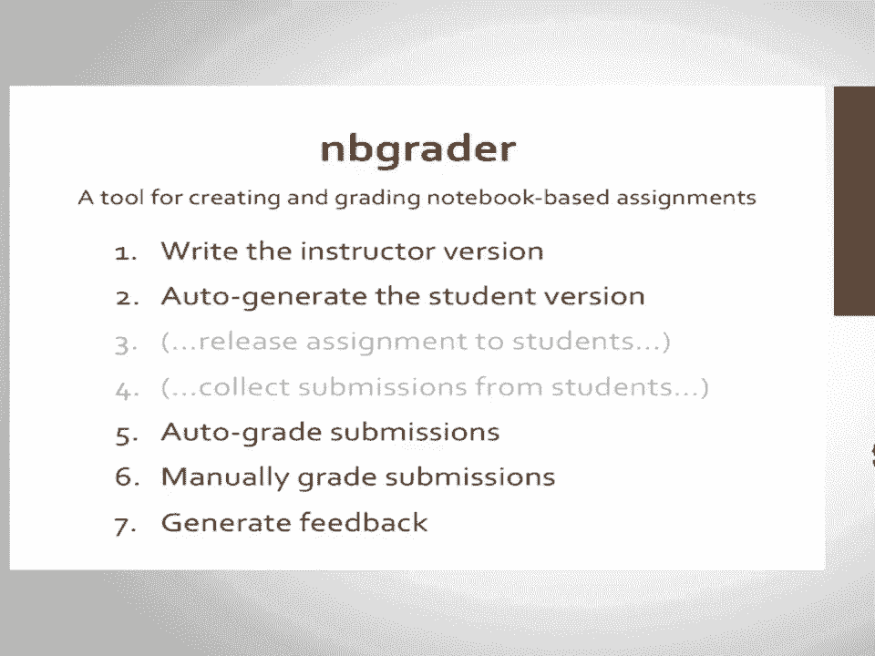

---

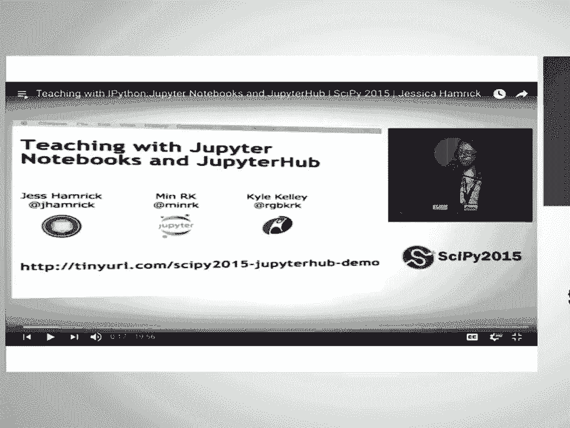

## nbgrader 工作流程总览

nbgrader 涵盖了从作业创建到反馈生成的完整工作流程。一个典型流程包含以下步骤：

1.  **创建教师版本**：编写包含题目、说明和标准答案的 Notebook。
2.  **生成学生版本**：使用 nbgrader 自动移除答案，生成供学生使用的版本。
3.  **分发作业**：将学生版作业文件发送给学生。
4.  **收集提交**：接收学生完成后的 Notebook 文件。
5.  **自动评分**：使用 nbgrader 运行预定义的测试，自动给出分数。
6.  **手动评分**：对需要人工评判的部分（如自由回答）进行评分。
7.  **生成反馈**：创建包含详细分数和评论的 HTML 报告，返回给学生。

其中，第3步（分发）和第4步（收集）可以根据是否使用 JupyterHub 而有所不同，我们稍后会详细讨论。

---

## 核心概念与单元格类型

在 nbgrader 中，我们通过为 Notebook 中的单元格添加特殊“类型”来定义其角色。以下是主要的单元格类型：

### 1. 自动评分答案单元格
这是学生编写代码解决方案的地方。在教师版本中，你需要用特殊的标记来包裹标准答案。

```python
### BEGIN SOLUTION
def squares(n):
    return [x**2 for x in range(1, n+1)]
### END SOLUTION
```
当生成学生版本时，`### BEGIN SOLUTION` 和 `### END SOLUTION` 之间的内容会被移除，并替换为“在此编写你的代码”之类的占位符。

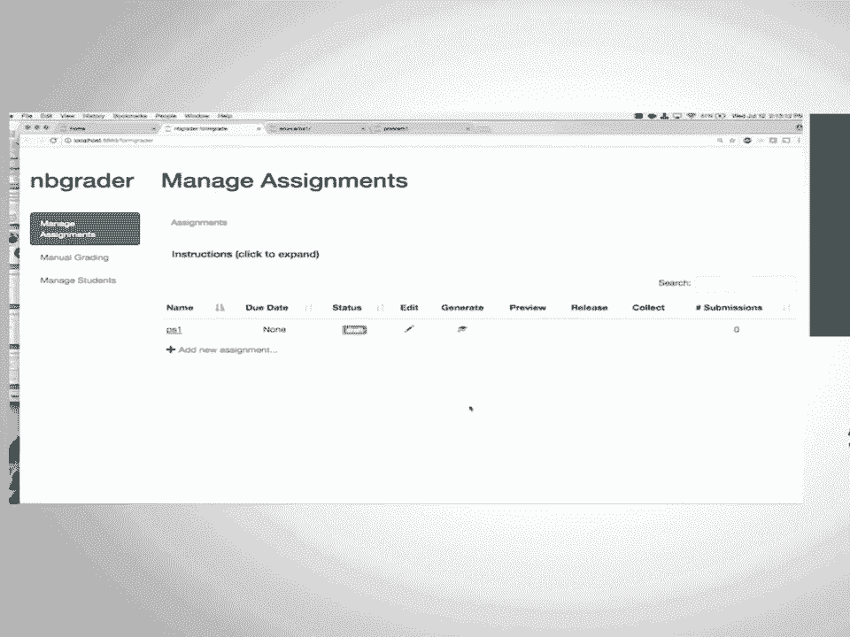

### 2. 自动评分测试单元格
这是定义如何评估学生代码的地方。你可以在其中编写单元测试。

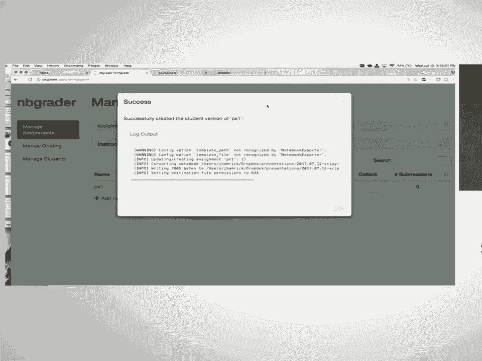

```python
# 这是一个测试单元格，值2分
assert squares(1) == [1]
assert squares(5) == [1, 4, 9, 16, 25]
### BEGIN HIDDEN TESTS
assert squares(12) == [1, 4, 9, 16, 25, 36, 49, 64, 81, 100, 121, 144]
### END HIDDEN TESTS
```
*   **普通测试**：学生会看到，用于自我检查。
*   **隐藏测试**：位于 `### BEGIN HIDDEN TESTS` 和 `### END HIDDEN TESTS` 之间。生成学生版本时会被移除，仅在自动评分时执行，用于最终评分。

### 3. 手动评分单元格
用于自由回答题或难以自动评分的代码题。你需要手动为这些单元格打分。
*   **手动评分答案**：可以是文本（如解释一个概念）或代码。
*   在教师版本中，你同样需要提供参考答案或评分标准。


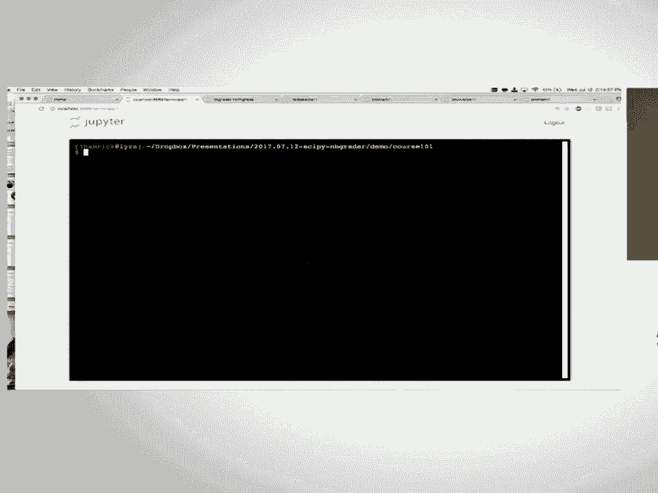

---

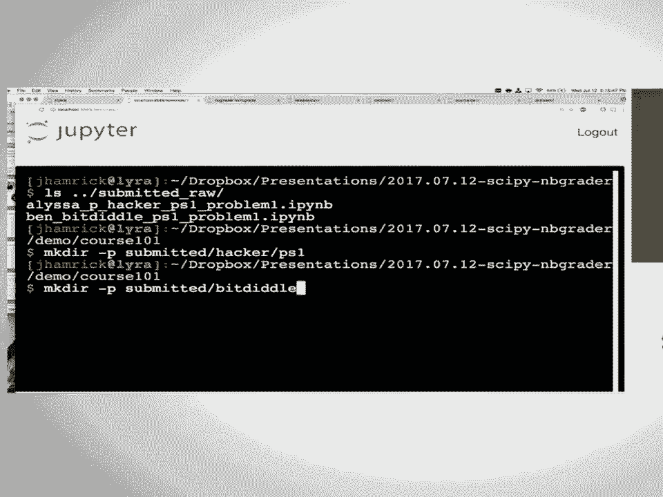

## 工作流程一：独立使用 nbgrader（无 JupyterHub）

上一节我们介绍了 nbgrader 的核心概念，本节中我们来看看如何在不依赖 JupyterHub 的情况下独立使用它。这个流程更灵活，适合通过电子邮件、学习管理系统（LMS）或 GitHub 分发作业的课程。

以下是具体操作步骤：

1.  **创建教师版本**：在 Jupyter Notebook 中，启用 “Create Assignment” 工具栏，为每个单元格设置正确的类型（如自动评分答案、测试等），并编写好答案和测试。
2.  **生成学生版本**：在 nbgrader 的表单界面或使用命令行，点击“生成”按钮。nbgrader 会创建一份移除了所有答案和隐藏测试的 Notebook。
3.  **分发作业**：你需要手动将生成的学生版 `.ipynb` 文件通过电子邮件、课程网站等方式发送给学生。
4.  **收集作业**：学生完成后，你需要手动收集他们提交的 `.ipynb` 文件。
5.  **组织提交文件**：将收集到的文件按照 `submitted/{学生ID}/{作业名称}/` 的目录结构存放，以便 nbgrader 识别。
6.  **自动评分**：在 nbgrader 界面中，对收集的作业运行自动评分。系统会执行测试单元格并给出基础分数。
7.  **手动评分**：对于手动评分单元格，你需要逐一点开学生作业，根据参考答案进行评判，并可以添加文字评论和部分分数。
8.  **生成反馈**：使用 `nbgrader feedback` 命令，为每份作业生成一个 HTML 报告。报告中会清晰展示每个单元格的得分、自动测试的错误信息以及教师添加的评论。
9.  **返回反馈**：最后，你需要手动将这些 HTML 反馈文件发送回给学生。

**优点**：无需搭建和维护 JupyterHub 服务器。
**缺点**：分发、收集和返回反馈需要手动操作，在大班教学中可能比较繁琐。

---

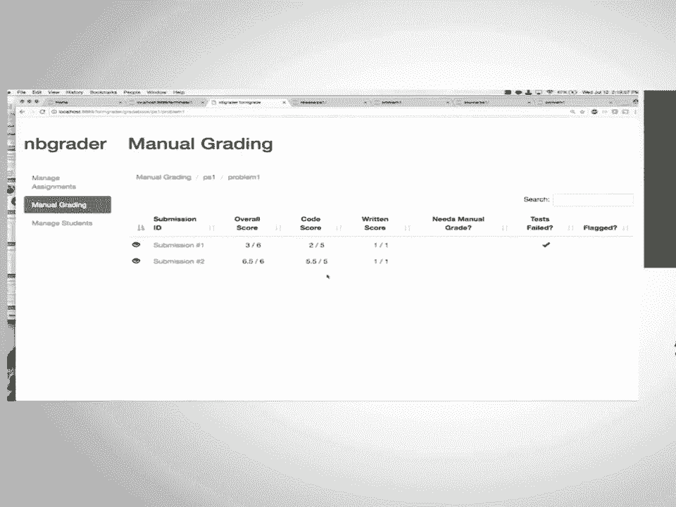

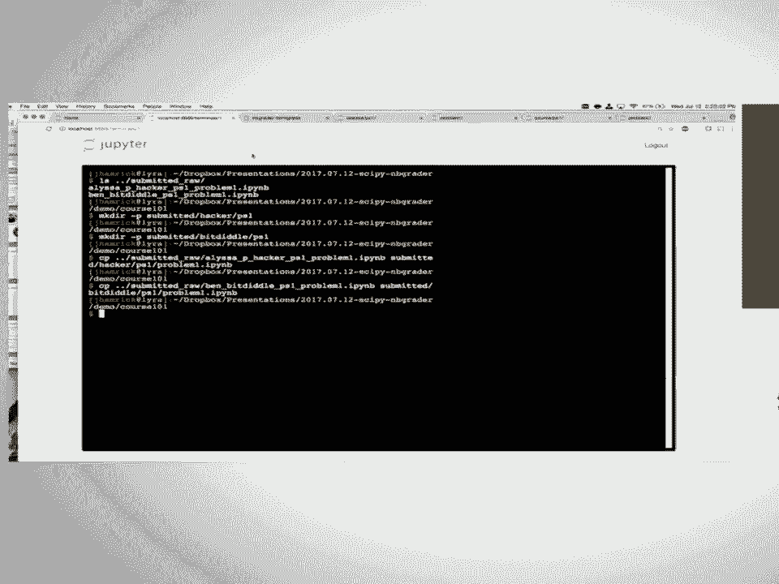

## 工作流程二：结合 JupyterHub 使用 nbgrader

如果你已经为课程部署了 JupyterHub，那么 nbgrader 可以与它无缝集成，使作业分发和收集过程自动化。

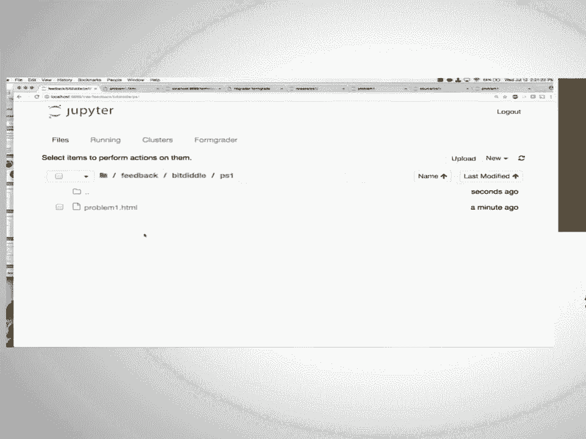

以下是结合使用时的步骤：

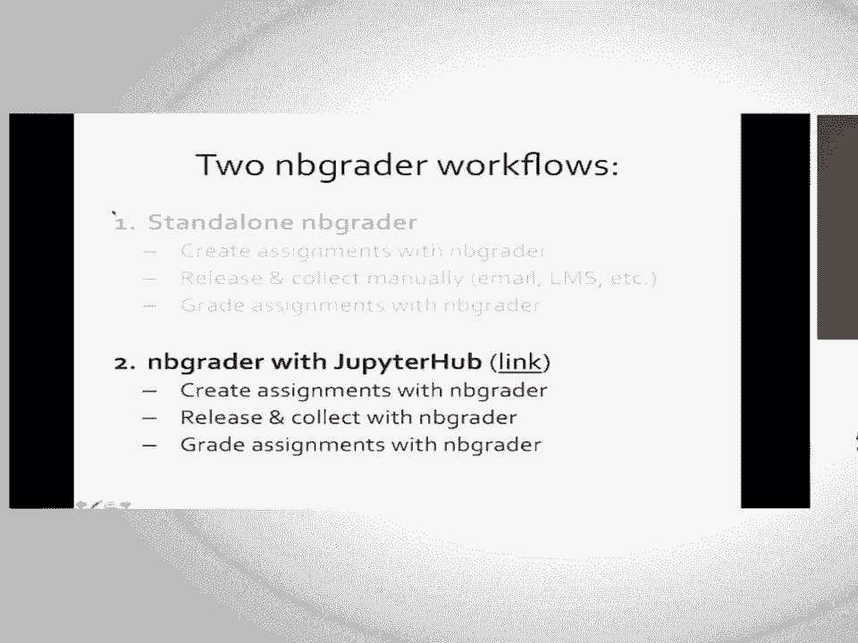


1.  **创建与生成**：前两步与独立流程相同：创建教师版本并生成学生版本。
2.  **发布作业**：在 nbgrader 界面中，点击“发布”按钮。作业会自动出现在已关联课程的所有学生的 JupyterHub 界面的“作业”选项卡中。
3.  **学生获取与提交**：学生登录 JupyterHub 后，可以“获取”作业，在 Notebook 中直接完成，并使用“提交”按钮交回。学生可以多次提交，系统会记录最新版本。
4.  **收集作业**：教师在 nbgrader 界面点击“收集”按钮，系统会自动从所有学生账户下抓取最新的提交版本。
5.  **评分与生成反馈**：自动评分、手动评分和生成反馈的步骤与独立流程完全一致。
6.  **返回反馈**：目前，将反馈文件返回给学生仍需手动操作（例如，将 HTML 文件复制到学生的 JupyterHub 主目录）。

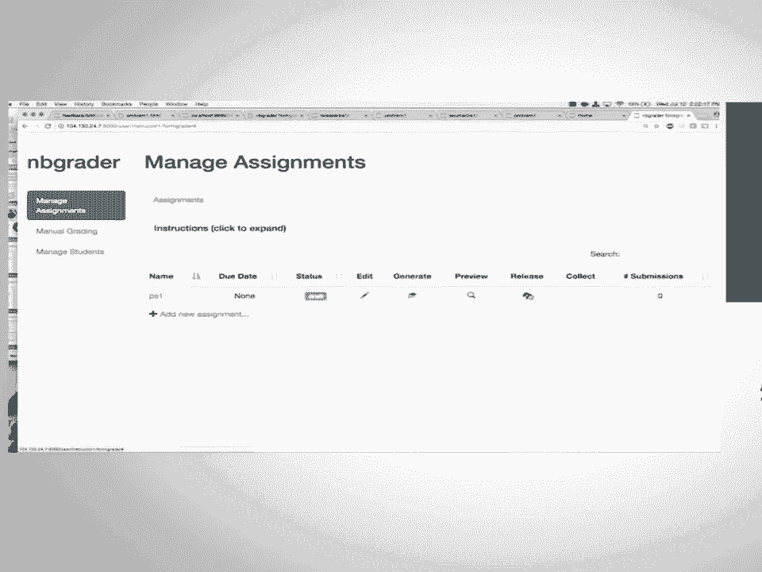

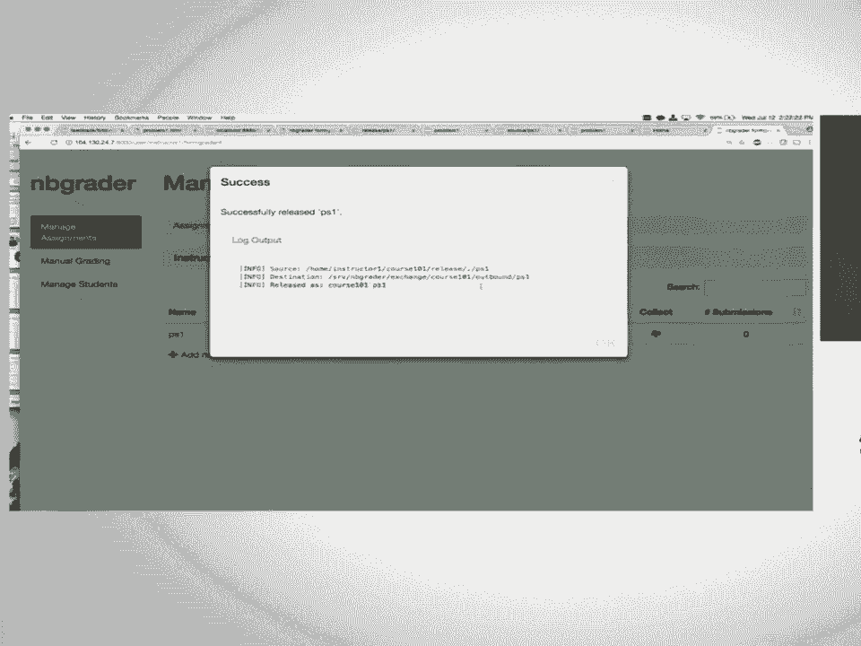

**优点**：极大简化了作业分发和收集流程，体验更流畅。
**缺点**：需要事先设置和运维 JupyterHub 环境。

---


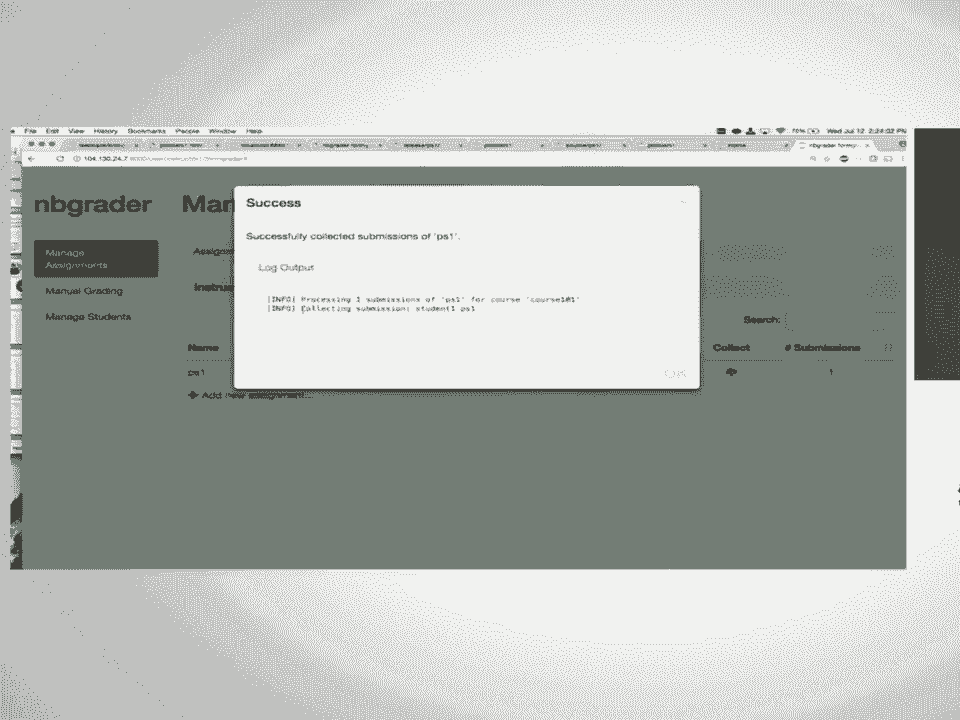

## 总结

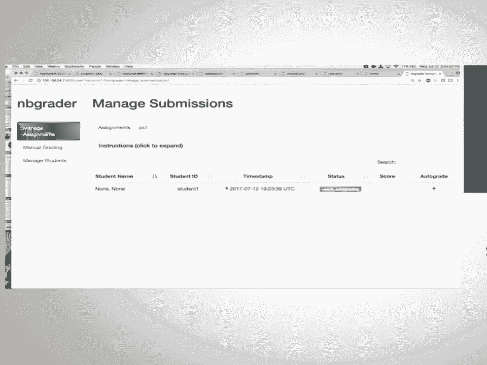

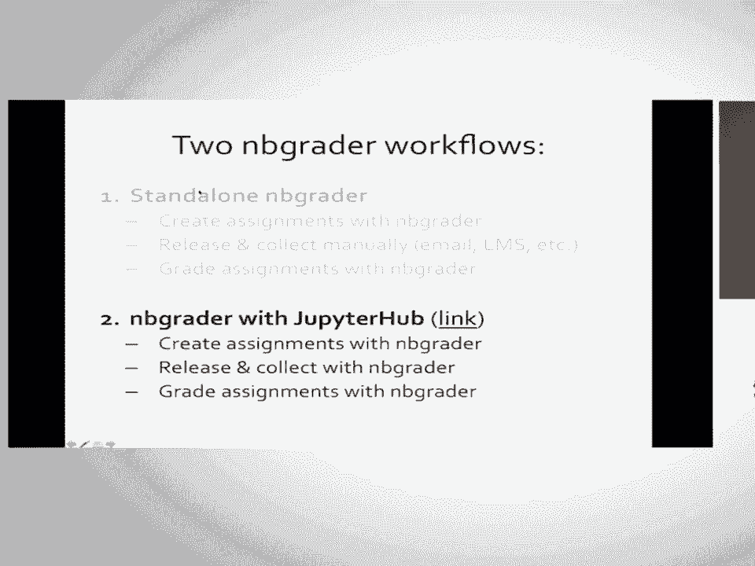

本节课我们一起学习了 **nbgrader** 这个强大的工具。我们了解到它通过定义特殊的单元格类型（自动评分答案、自动评分测试、手动评分），帮助教师在 Jupyter Notebook 中高效管理作业的**全生命周期**。

我们重点探讨了两种主要工作流程：
*   **独立使用**：适合灵活的小型课程或已有固定文件分发渠道的场景。
*   **结合 JupyterHub 使用**：适合希望实现作业管理自动化的中大型课程。

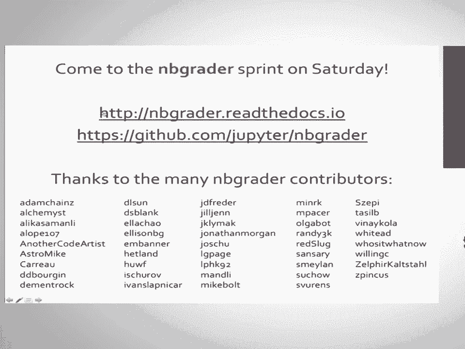

无论选择哪种方式，nbgrader 的核心价值在于它统一了作业创建、评分和反馈的流程，并为学生提供了清晰、详细的评估结果，有助于提升学习效果。